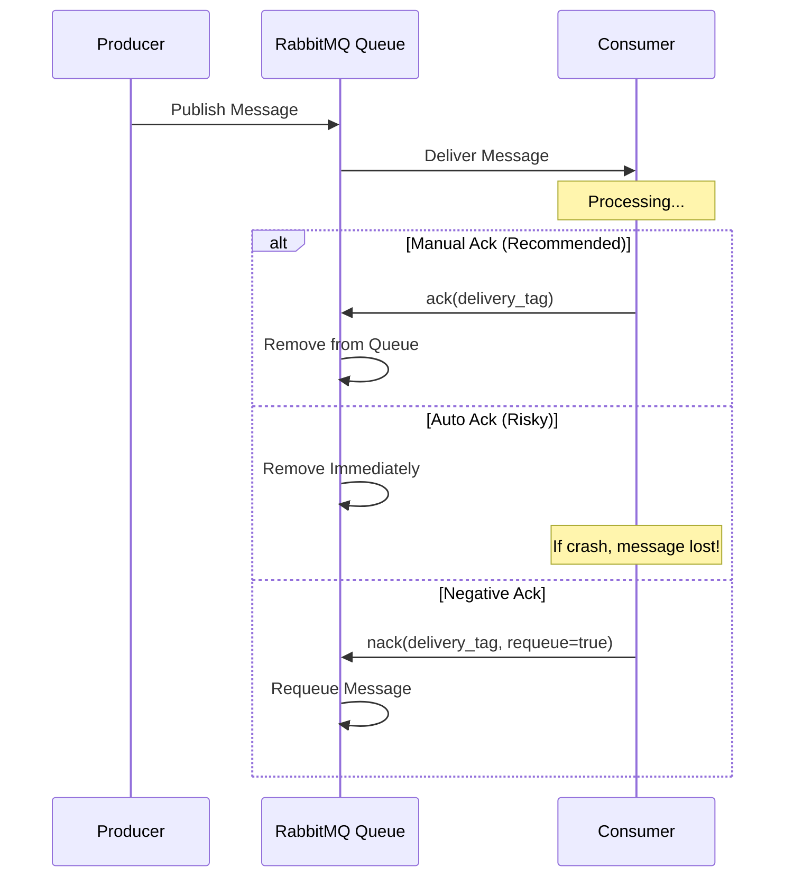
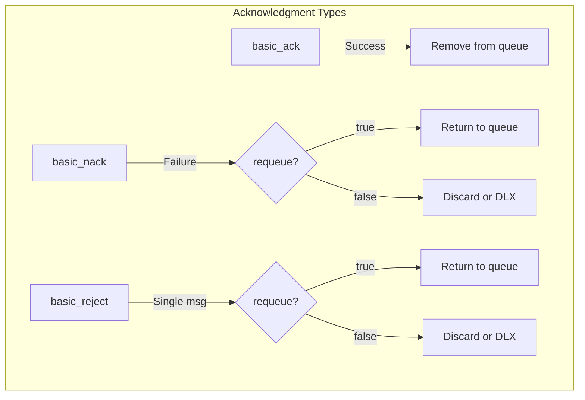
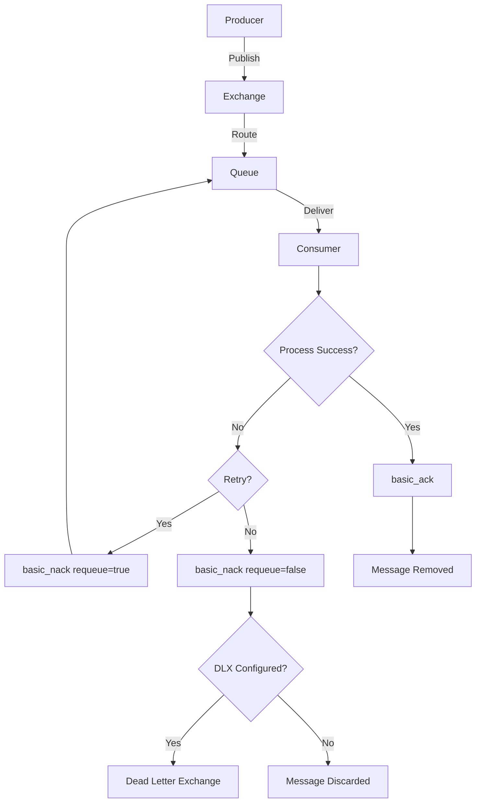
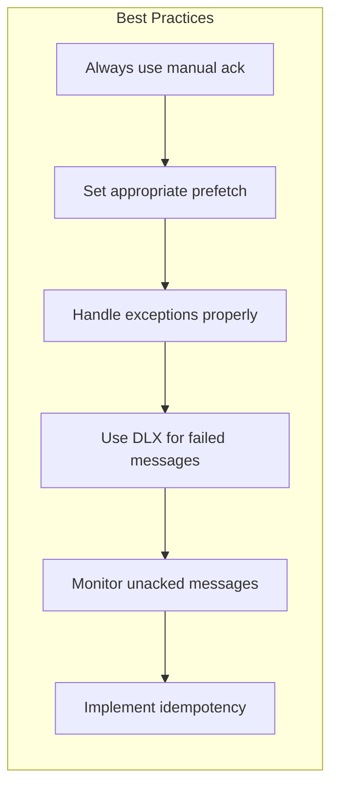

# How to Handle Message Acknowledgment in RabbitMQ

Author: [nawazdhandala](https://www.github.com/nawazdhandala)

Tags: RabbitMQ, Messaging, Reliability, Backend, Distributed Systems

Description: Learn how to properly implement message acknowledgments in RabbitMQ to ensure reliable message delivery and prevent data loss.

---

Message acknowledgment is the cornerstone of reliable message processing in RabbitMQ. Without proper acknowledgments, messages can be lost or processed multiple times. This guide covers everything you need to know about implementing acknowledgments correctly.

## Why Acknowledgments Matter



## Acknowledgment Modes Explained

RabbitMQ supports two primary acknowledgment modes:

1. **Auto-Ack (auto_ack=True)**: Messages are considered acknowledged immediately upon delivery. Fast but risky - if your consumer crashes during processing, the message is lost forever.

2. **Manual Ack (auto_ack=False)**: You explicitly acknowledge messages after successful processing. Safer but requires proper implementation.

## Basic Manual Acknowledgment in Python

```python
import pika

def process_message(body):
    """
    Simulate message processing.
    In real applications, this might involve database operations,
    API calls, or other business logic.
    """
    print(f"Processing: {body.decode()}")
    # Simulate work
    return True

def callback(ch, method, properties, body):
    """
    Callback function invoked when a message is received.

    Args:
        ch: The channel object
        method: Delivery method containing delivery_tag
        properties: Message properties (headers, content_type, etc.)
        body: The actual message content (bytes)
    """
    try:
        # Process the message
        success = process_message(body)

        if success:
            # Acknowledge the message - tells RabbitMQ to remove it from the queue
            # delivery_tag uniquely identifies this delivery on this channel
            ch.basic_ack(delivery_tag=method.delivery_tag)
            print(f"Message acknowledged: {method.delivery_tag}")
        else:
            # Negative acknowledgment - requeue the message for retry
            # requeue=True puts it back in the queue
            # requeue=False discards or sends to dead letter exchange
            ch.basic_nack(delivery_tag=method.delivery_tag, requeue=True)
            print(f"Message requeued: {method.delivery_tag}")

    except Exception as e:
        print(f"Error processing message: {e}")
        # On exception, reject and requeue the message
        ch.basic_nack(delivery_tag=method.delivery_tag, requeue=True)

# Establish connection
connection = pika.BlockingConnection(
    pika.ConnectionParameters(host='localhost')
)
channel = connection.channel()

# Declare the queue (idempotent - safe to call multiple times)
channel.queue_declare(queue='task_queue', durable=True)

# Set prefetch count to 1 - only send one message at a time to this consumer
# This ensures fair distribution and prevents overwhelming slow consumers
channel.basic_qos(prefetch_count=1)

# Start consuming with manual acknowledgment (auto_ack=False)
channel.basic_consume(
    queue='task_queue',
    on_message_callback=callback,
    auto_ack=False  # Critical: Enable manual acknowledgment
)

print('Waiting for messages...')
channel.start_consuming()
```

## Acknowledgment Types Comparison



## Node.js Implementation

```javascript
const amqp = require('amqplib');

async function startConsumer() {
    // Establish connection to RabbitMQ
    const connection = await amqp.connect('amqp://localhost');
    const channel = await connection.createChannel();

    const queue = 'task_queue';

    // Ensure queue exists with durability enabled
    // durable: true means the queue survives broker restart
    await channel.assertQueue(queue, { durable: true });

    // Prefetch 1 message at a time
    // This prevents a fast consumer from grabbing all messages
    // while other consumers sit idle
    await channel.prefetch(1);

    console.log('Waiting for messages...');

    // Consume messages with manual acknowledgment
    // noAck: false enables manual acknowledgment mode
    channel.consume(queue, async (msg) => {
        if (msg === null) {
            return; // Consumer was cancelled
        }

        const content = msg.content.toString();
        console.log(`Received: ${content}`);

        try {
            // Process the message
            await processMessage(content);

            // Acknowledge successful processing
            // This removes the message from the queue
            channel.ack(msg);
            console.log('Message acknowledged');

        } catch (error) {
            console.error('Processing failed:', error.message);

            // Check if this message has been redelivered before
            // msg.fields.redelivered is true if this is a redelivery
            if (msg.fields.redelivered) {
                // Already retried once, send to dead letter or discard
                // allUpTo: false means only this message
                // requeue: false means don't put back in queue
                channel.nack(msg, false, false);
                console.log('Message rejected (already retried)');
            } else {
                // First failure, requeue for retry
                channel.nack(msg, false, true);
                console.log('Message requeued for retry');
            }
        }
    }, { noAck: false }); // Manual acknowledgment enabled
}

async function processMessage(content) {
    // Simulate async processing
    return new Promise((resolve, reject) => {
        setTimeout(() => {
            if (Math.random() > 0.1) {
                resolve();
            } else {
                reject(new Error('Random processing failure'));
            }
        }, 1000);
    });
}

startConsumer().catch(console.error);
```

## Batch Acknowledgments

For high-throughput scenarios, you can acknowledge multiple messages at once:

```python
import pika

class BatchAckConsumer:
    """
    Consumer that batches acknowledgments for improved performance.
    Instead of acknowledging each message individually, we acknowledge
    multiple messages at once using the 'multiple' flag.
    """

    def __init__(self, batch_size=10):
        self.batch_size = batch_size
        self.message_count = 0
        self.last_delivery_tag = None

    def callback(self, ch, method, properties, body):
        """Process message and batch acknowledgments."""
        try:
            # Process the message
            self.process(body)

            # Track the delivery tag
            self.last_delivery_tag = method.delivery_tag
            self.message_count += 1

            # Acknowledge in batches
            if self.message_count >= self.batch_size:
                # multiple=True acknowledges all messages up to and including
                # this delivery_tag, not just this single message
                ch.basic_ack(
                    delivery_tag=self.last_delivery_tag,
                    multiple=True  # Ack all messages up to this tag
                )
                print(f"Batch acknowledged: {self.message_count} messages")
                self.message_count = 0

        except Exception as e:
            print(f"Error: {e}")
            # On error, nack only the failed message
            ch.basic_nack(delivery_tag=method.delivery_tag, requeue=True)

    def process(self, body):
        """Process a single message."""
        print(f"Processing: {body.decode()}")

# Usage
consumer = BatchAckConsumer(batch_size=10)
connection = pika.BlockingConnection(pika.ConnectionParameters('localhost'))
channel = connection.channel()
channel.queue_declare(queue='batch_queue', durable=True)
channel.basic_qos(prefetch_count=20)  # Prefetch more than batch size
channel.basic_consume(
    queue='batch_queue',
    on_message_callback=consumer.callback,
    auto_ack=False
)
channel.start_consuming()
```

## Message Flow with Acknowledgments



## Handling Unacknowledged Messages

Unacknowledged messages consume memory and can cause issues. Monitor them:

```bash
# Check unacknowledged message count using rabbitmqctl
rabbitmqctl list_queues name messages_ready messages_unacknowledged

# Via HTTP API (requires management plugin)
curl -u guest:guest http://localhost:15672/api/queues/%2F/task_queue
```

## Implementing Acknowledgment Timeout

RabbitMQ 3.x introduced consumer acknowledgment timeout. Configure it:

```ini
# In rabbitmq.conf
# Messages must be acknowledged within 30 minutes (1800000 ms)
# If not acknowledged, the consumer is considered stuck and disconnected
consumer_timeout = 1800000
```

For long-running tasks, send heartbeats or increase the timeout:

```python
import pika
import threading

def long_running_task(ch, method, body):
    """
    For long-running tasks, we need to keep the connection alive
    by processing events periodically.
    """
    def process():
        # Simulate long processing
        import time
        time.sleep(300)  # 5 minutes of processing

        # Acknowledge after completion
        ch.basic_ack(delivery_tag=method.delivery_tag)

    # Run processing in a thread
    thread = threading.Thread(target=process)
    thread.start()

    # Keep processing events to maintain connection
    # This sends heartbeats and handles other protocol frames
    while thread.is_alive():
        connection.process_data_events(time_limit=1)
```

## Publisher Confirms (Producer Acknowledgments)

Acknowledgments work both ways. Producers can also receive confirmations:

```python
import pika

connection = pika.BlockingConnection(pika.ConnectionParameters('localhost'))
channel = connection.channel()

# Enable publisher confirms on this channel
# This allows the broker to acknowledge received messages
channel.confirm_delivery()

# Declare exchange and queue
channel.queue_declare(queue='confirmed_queue', durable=True)

def publish_with_confirm(message):
    """
    Publish a message and wait for broker confirmation.
    Returns True if the broker confirmed receipt, False otherwise.
    """
    try:
        # publish() returns True if the message was confirmed
        # mandatory=True ensures message is routed to a queue
        channel.basic_publish(
            exchange='',
            routing_key='confirmed_queue',
            body=message,
            properties=pika.BasicProperties(
                delivery_mode=2,  # Make message persistent
            ),
            mandatory=True  # Return message if not routable
        )
        print(f"Message confirmed: {message}")
        return True

    except pika.exceptions.UnroutableError:
        # Message could not be routed to any queue
        print(f"Message unroutable: {message}")
        return False
    except pika.exceptions.NackError:
        # Broker explicitly rejected the message
        print(f"Message nacked: {message}")
        return False

# Publish messages with confirmation
for i in range(10):
    success = publish_with_confirm(f"Message {i}")
    if not success:
        print(f"Failed to publish message {i}")
```

## Best Practices Summary



## Common Mistakes to Avoid

| Mistake | Consequence | Solution |
|---------|-------------|----------|
| Using auto_ack=True | Message loss on crash | Use manual acknowledgment |
| Not setting prefetch | Memory overload | Set `basic_qos(prefetch_count=N)` |
| Acknowledging before processing | Data loss | Ack only after successful processing |
| Infinite requeue loop | Message stuck forever | Use dead letter exchanges |
| Not handling exceptions | Unacked messages pile up | Wrap processing in try/except |

---

Proper message acknowledgment is essential for building reliable message-driven systems. Always use manual acknowledgments, implement proper error handling, set appropriate prefetch counts, and use dead letter exchanges for messages that cannot be processed. With these practices in place, your RabbitMQ consumers will handle failures gracefully without losing messages.
