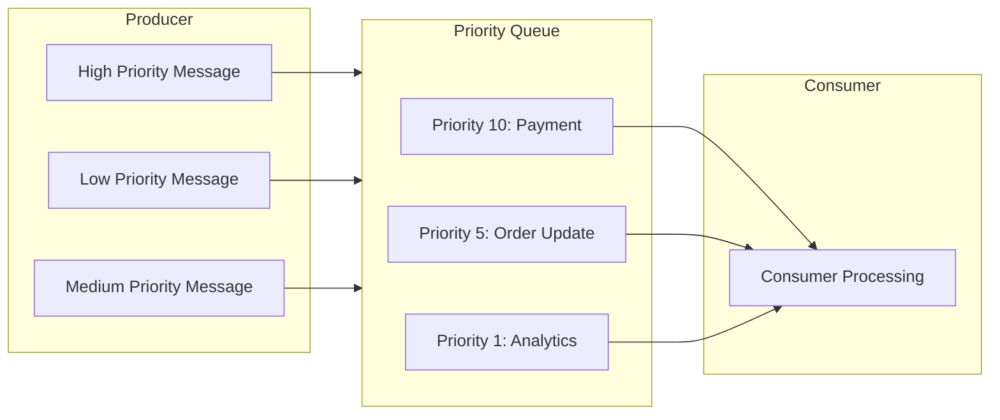
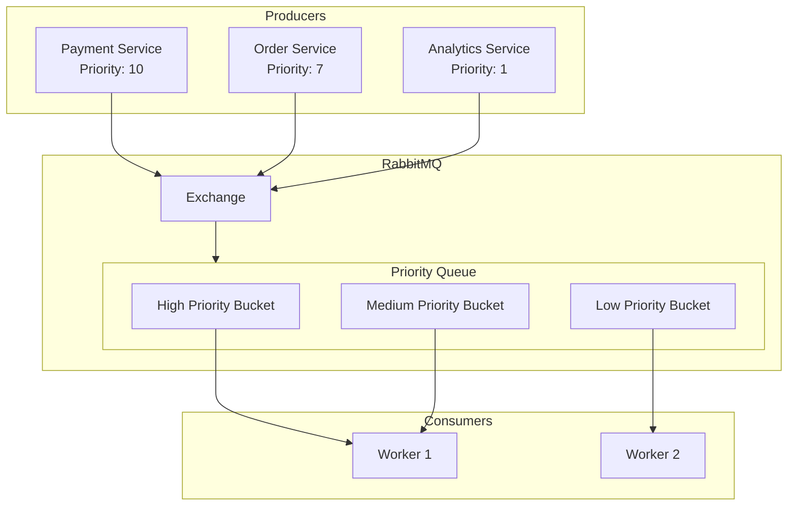
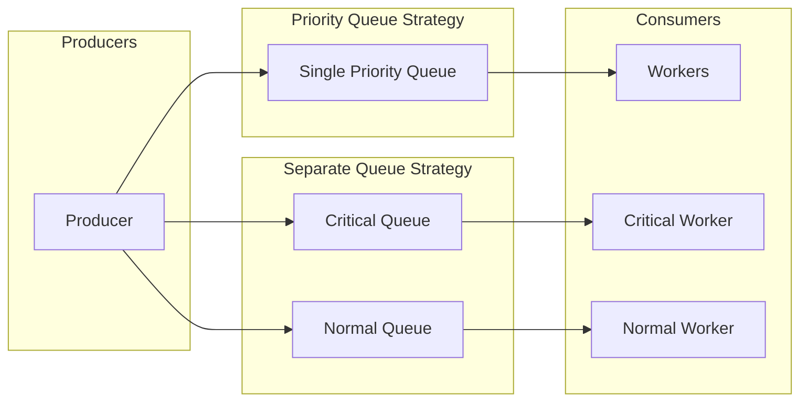

# How to Handle Message Priority in RabbitMQ

Author: [nawazdhandala](https://www.github.com/nawazdhandala)

Tags: RabbitMQ, Message Queue, Priority Queue, Messaging, Backend, DevOps, Performance

Description: Learn how to configure and use message priority in RabbitMQ to ensure critical messages are processed before less important ones.

---

Message priority in RabbitMQ allows you to ensure that important messages get processed before less critical ones. This is essential for systems where certain operations - like payment processing or emergency alerts - must take precedence over routine tasks.

## Understanding Priority Queues in RabbitMQ

By default, RabbitMQ queues follow FIFO (First In, First Out) ordering. Priority queues change this behavior by allowing messages with higher priority values to jump ahead in the queue.



## Declaring a Priority Queue

To use message priority, you must declare the queue with the `x-max-priority` argument. This sets the maximum priority level the queue supports.

### Python Example with Pika

```python
import pika

# Establish connection to RabbitMQ
connection = pika.BlockingConnection(
    pika.ConnectionParameters(host='localhost')
)
channel = connection.channel()

# Declare a priority queue with max priority of 10
# The x-max-priority argument enables priority ordering
# Higher values mean higher priority (1-10 is typical)
channel.queue_declare(
    queue='priority_tasks',
    durable=True,
    arguments={
        'x-max-priority': 10  # Support priority levels 0-10
    }
)

print("Priority queue declared successfully")
connection.close()
```

### Node.js Example with amqplib

```javascript
const amqp = require('amqplib');

async function declareQueue() {
    // Connect to RabbitMQ server
    const connection = await amqp.connect('amqp://localhost');
    const channel = await connection.createChannel();

    // Declare a priority queue
    // maxPriority sets the upper bound for message priorities
    await channel.assertQueue('priority_tasks', {
        durable: true,
        arguments: {
            'x-max-priority': 10  // Enable 10 priority levels
        }
    });

    console.log('Priority queue declared successfully');
    await connection.close();
}

declareQueue().catch(console.error);
```

## Publishing Messages with Priority

When publishing messages, include the `priority` property to assign importance levels.

### Python Producer with Priority

```python
import pika
import json

connection = pika.BlockingConnection(
    pika.ConnectionParameters(host='localhost')
)
channel = connection.channel()

# Function to publish a task with a specific priority
def publish_task(task_data, priority):
    """
    Publish a message with the given priority level.

    Args:
        task_data: Dictionary containing task information
        priority: Integer from 0 (lowest) to 10 (highest)
    """
    channel.basic_publish(
        exchange='',
        routing_key='priority_tasks',
        body=json.dumps(task_data),
        properties=pika.BasicProperties(
            delivery_mode=2,  # Make message persistent
            priority=priority  # Set the priority level
        )
    )
    print(f"Published task with priority {priority}: {task_data}")

# Publish messages with different priorities
# Higher priority messages will be consumed first

# Critical: Payment processing (highest priority)
publish_task({'type': 'payment', 'amount': 99.99}, priority=10)

# High: Order confirmation
publish_task({'type': 'order', 'id': 12345}, priority=7)

# Medium: Inventory update
publish_task({'type': 'inventory', 'sku': 'ABC123'}, priority=5)

# Low: Analytics event
publish_task({'type': 'analytics', 'event': 'page_view'}, priority=1)

connection.close()
```

### Node.js Producer with Priority

```javascript
const amqp = require('amqplib');

async function publishWithPriority() {
    const connection = await amqp.connect('amqp://localhost');
    const channel = await connection.createChannel();

    // Ensure the queue exists with priority support
    await channel.assertQueue('priority_tasks', {
        durable: true,
        arguments: { 'x-max-priority': 10 }
    });

    // Helper function to publish with priority
    function sendTask(task, priority) {
        channel.sendToQueue(
            'priority_tasks',
            Buffer.from(JSON.stringify(task)),
            {
                persistent: true,  // Survive broker restart
                priority: priority  // Message priority (0-10)
            }
        );
        console.log(`Sent task with priority ${priority}:`, task);
    }

    // Send messages with varying priorities
    sendTask({ type: 'payment', amount: 150.00 }, 10);  // Urgent
    sendTask({ type: 'email', to: 'user@example.com' }, 3);  // Low
    sendTask({ type: 'notification', msg: 'New order' }, 6);  // Medium

    // Close connection after a short delay
    setTimeout(() => connection.close(), 500);
}

publishWithPriority().catch(console.error);
```

## Consuming Priority Messages

Consumers do not need special configuration. RabbitMQ automatically delivers higher priority messages first when they are available.

### Python Consumer

```python
import pika
import json

connection = pika.BlockingConnection(
    pika.ConnectionParameters(host='localhost')
)
channel = connection.channel()

# Ensure queue exists (idempotent operation)
channel.queue_declare(
    queue='priority_tasks',
    durable=True,
    arguments={'x-max-priority': 10}
)

def process_task(ch, method, properties, body):
    """
    Callback function to process incoming messages.
    Messages arrive in priority order when multiple are queued.
    """
    task = json.loads(body)
    priority = properties.priority or 0

    print(f"Processing priority {priority} task: {task}")

    # Simulate processing time
    # In production, this would be your actual business logic
    if task['type'] == 'payment':
        print(f"  -> Processing payment of ${task['amount']}")
    elif task['type'] == 'order':
        print(f"  -> Confirming order #{task['id']}")

    # Acknowledge the message after successful processing
    ch.basic_ack(delivery_tag=method.delivery_tag)

# Set prefetch to 1 to ensure fair distribution
# This is important for priority to work correctly
channel.basic_qos(prefetch_count=1)

# Start consuming messages
channel.basic_consume(
    queue='priority_tasks',
    on_message_callback=process_task
)

print('Waiting for priority messages. Press CTRL+C to exit.')
channel.start_consuming()
```

## Priority Queue Architecture

Here is how messages flow through a priority queue system:



## Best Practices for Message Priority

### 1. Use a Limited Number of Priority Levels

Stick to 3-5 priority levels. Too many levels add complexity without real benefit.

```python
# Define clear priority levels as constants
class Priority:
    CRITICAL = 10   # System-critical operations
    HIGH = 7        # Time-sensitive tasks
    NORMAL = 5      # Standard operations
    LOW = 2         # Background tasks
    BULK = 1        # Batch processing
```

### 2. Set Prefetch Count to 1

For priority to work effectively, consumers should only prefetch one message at a time.

```python
# Critical: Set prefetch to 1 for priority queues
# Otherwise, consumers may grab lower priority messages
# before higher priority ones arrive
channel.basic_qos(prefetch_count=1)
```

### 3. Monitor Queue Depth by Priority

Track how many messages are waiting at each priority level to detect bottlenecks.

```bash
# Use rabbitmqctl to check queue status
# Look for messages_ready to see backlog
rabbitmqctl list_queues name messages_ready messages_unacknowledged
```

### 4. Consider Separate Queues for Critical Messages

For truly critical messages, a dedicated queue might be better than priority.



## Performance Considerations

Priority queues have overhead compared to standard queues:

1. **Memory Usage**: RabbitMQ maintains separate internal queues for each priority level
2. **CPU Overhead**: Sorting and bucket management requires additional processing
3. **Disk I/O**: Persistent priority messages require more disk operations

```python
# For high-throughput scenarios, consider batching
# low-priority messages together

def publish_batch(messages, priority):
    """
    Publish multiple messages with the same priority.
    Reduces connection overhead for bulk operations.
    """
    for msg in messages:
        channel.basic_publish(
            exchange='',
            routing_key='priority_tasks',
            body=json.dumps(msg),
            properties=pika.BasicProperties(
                delivery_mode=2,
                priority=priority
            )
        )
    # Confirm all messages were received
    channel.confirm_delivery()
```

## Complete Working Example

Here is a full example showing producer and consumer working together:

```python
# priority_system.py
import pika
import json
import time
import threading

QUEUE_NAME = 'task_queue'
MAX_PRIORITY = 10

def get_connection():
    """Create a new connection to RabbitMQ."""
    return pika.BlockingConnection(
        pika.ConnectionParameters(
            host='localhost',
            heartbeat=600,  # Keep connection alive
            blocked_connection_timeout=300
        )
    )

def setup_queue(channel):
    """Declare the priority queue with all necessary settings."""
    channel.queue_declare(
        queue=QUEUE_NAME,
        durable=True,
        arguments={
            'x-max-priority': MAX_PRIORITY,
            'x-message-ttl': 86400000  # Messages expire after 24 hours
        }
    )

def producer():
    """Simulate producing messages with various priorities."""
    connection = get_connection()
    channel = connection.channel()
    setup_queue(channel)

    tasks = [
        ({'action': 'process_payment', 'id': 1}, 10),
        ({'action': 'send_email', 'id': 2}, 3),
        ({'action': 'update_inventory', 'id': 3}, 5),
        ({'action': 'generate_report', 'id': 4}, 1),
        ({'action': 'fraud_check', 'id': 5}, 9),
    ]

    for task, priority in tasks:
        channel.basic_publish(
            exchange='',
            routing_key=QUEUE_NAME,
            body=json.dumps(task),
            properties=pika.BasicProperties(
                delivery_mode=2,
                priority=priority
            )
        )
        print(f"[Producer] Sent priority {priority}: {task['action']}")

    connection.close()

def consumer():
    """Consume messages in priority order."""
    connection = get_connection()
    channel = connection.channel()
    setup_queue(channel)

    # Critical: prefetch_count=1 for proper priority handling
    channel.basic_qos(prefetch_count=1)

    def callback(ch, method, properties, body):
        task = json.loads(body)
        priority = properties.priority or 0
        print(f"[Consumer] Processing priority {priority}: {task['action']}")
        time.sleep(0.5)  # Simulate work
        ch.basic_ack(delivery_tag=method.delivery_tag)

    channel.basic_consume(queue=QUEUE_NAME, on_message_callback=callback)
    print('[Consumer] Waiting for messages...')
    channel.start_consuming()

if __name__ == '__main__':
    # Run producer first, then consumer
    producer()
    time.sleep(1)  # Let messages queue up
    consumer()
```

---

Message priority in RabbitMQ is a powerful feature for ensuring critical operations get processed first. Remember to declare your queue with `x-max-priority`, set `prefetch_count=1` on consumers, and keep your priority levels simple and well-documented. For mission-critical systems, consider combining priority queues with dedicated queues for the most important message types.
