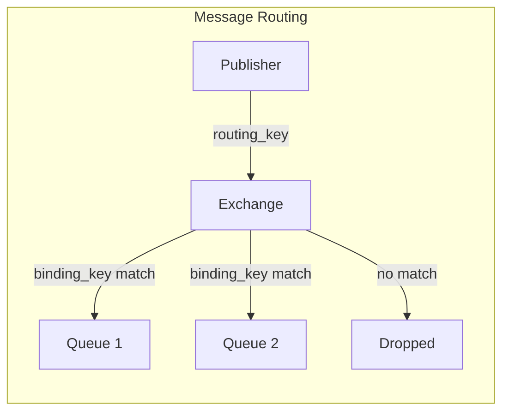
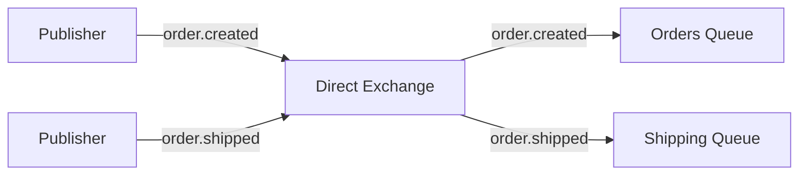
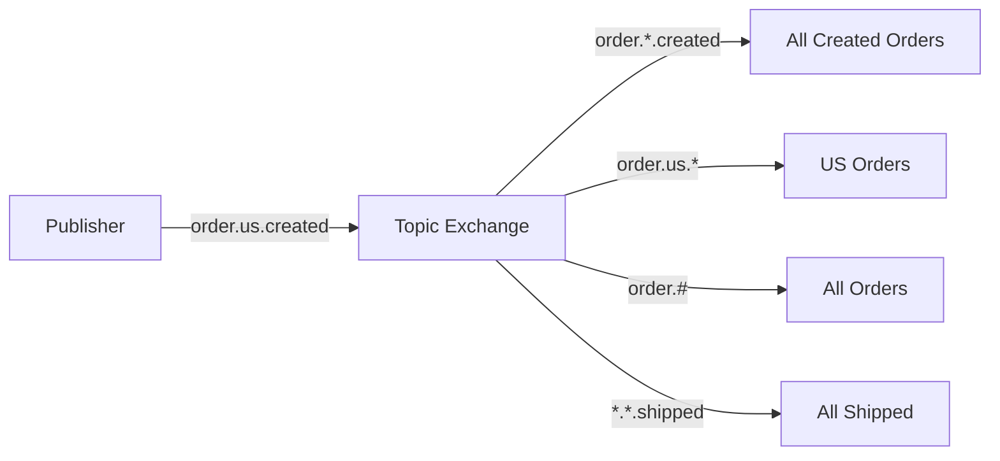
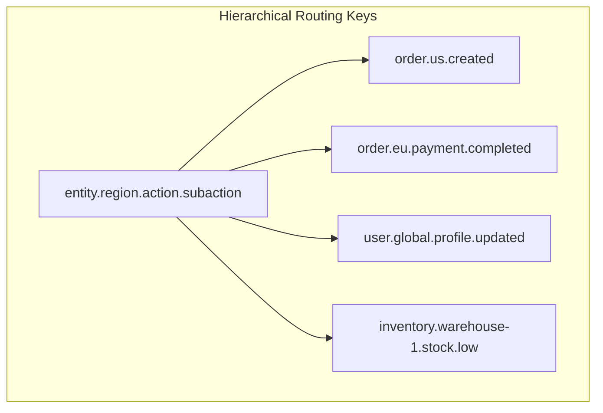
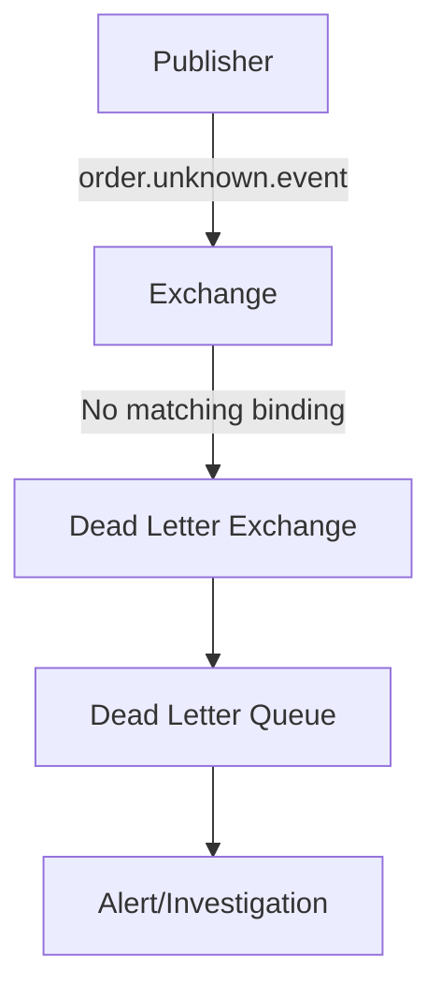

# How to Handle RabbitMQ Message Routing Keys

Author: [nawazdhandala](https://www.github.com/nawazdhandala)

Tags: RabbitMQ, Routing Keys, Message Queue, Exchange Types, Topic Exchange, Direct Exchange, Node.js, Python

Description: Learn how to design and implement effective RabbitMQ routing key strategies for flexible message distribution using direct, topic, and headers exchanges.

---

> Routing keys are the addressing system of RabbitMQ. They determine which queues receive which messages. Getting your routing strategy right is fundamental to building flexible, maintainable messaging systems.

Proper routing key design enables you to add new consumers without modifying publishers and filter messages efficiently at the broker level.

---

## Routing Key Basics



A routing key is a string attached to each message. Exchanges use routing keys along with binding keys to determine message destinations.

---

## Exchange Types and Routing

### Direct Exchange

Direct exchanges route messages to queues with exactly matching binding keys.



**Implementation:**

```javascript
// direct-exchange.js
const amqp = require('amqplib');

async function setupDirectExchange() {
    const connection = await amqp.connect('amqp://localhost');
    const channel = await connection.createChannel();

    // Declare a direct exchange
    // Direct exchanges route based on exact routing key match
    const exchange = 'order_events';
    await channel.assertExchange(exchange, 'direct', { durable: true });

    // Create queues for different event types
    const queues = {
        'order-created': 'order.created',
        'order-paid': 'order.paid',
        'order-shipped': 'order.shipped',
        'order-delivered': 'order.delivered'
    };

    for (const [queueName, routingKey] of Object.entries(queues)) {
        // Create the queue
        await channel.assertQueue(queueName, { durable: true });

        // Bind queue to exchange with specific routing key
        // Only messages with exactly this routing key will be delivered
        await channel.bindQueue(queueName, exchange, routingKey);

        console.log(`Queue ${queueName} bound to ${routingKey}`);
    }

    return { channel, exchange };
}

async function publishOrder(channel, exchange, eventType, order) {
    // The routing key determines which queue receives the message
    const routingKey = `order.${eventType}`;

    channel.publish(
        exchange,
        routingKey,
        Buffer.from(JSON.stringify(order)),
        {
            persistent: true,
            contentType: 'application/json'
        }
    );

    console.log(`Published to ${routingKey}:`, order.id);
}

// Usage
async function main() {
    const { channel, exchange } = await setupDirectExchange();

    // Publish order events
    await publishOrder(channel, exchange, 'created', {
        id: 'ORD-001',
        customer: 'john@example.com',
        total: 99.99
    });

    await publishOrder(channel, exchange, 'paid', {
        id: 'ORD-001',
        paymentId: 'PAY-123'
    });

    await publishOrder(channel, exchange, 'shipped', {
        id: 'ORD-001',
        trackingNumber: 'TRACK-456'
    });
}

main();
```

---

### Topic Exchange

Topic exchanges route messages using wildcard pattern matching on routing keys.



**Wildcard patterns:**
- `*` matches exactly one word
- `#` matches zero or more words

**Implementation:**

```python
# topic_exchange.py
import pika
import json

class TopicPublisher:
    """Publisher using topic exchange for flexible routing"""

    def __init__(self, host: str = 'localhost'):
        self.connection = pika.BlockingConnection(
            pika.ConnectionParameters(host)
        )
        self.channel = self.connection.channel()

        # Declare topic exchange
        # Topic exchanges support wildcard routing patterns
        self.exchange = 'events'
        self.channel.exchange_declare(
            exchange=self.exchange,
            exchange_type='topic',
            durable=True
        )

    def publish(self, routing_key: str, message: dict):
        """
        Publish message with routing key.

        Routing key format: <entity>.<region>.<action>
        Examples:
            - order.us.created
            - order.eu.shipped
            - user.us.registered
            - payment.us.processed
        """
        self.channel.basic_publish(
            exchange=self.exchange,
            routing_key=routing_key,
            body=json.dumps(message),
            properties=pika.BasicProperties(
                delivery_mode=2,  # Persistent
                content_type='application/json'
            )
        )
        print(f"Published to {routing_key}")

    def close(self):
        self.connection.close()


class TopicConsumer:
    """Consumer with flexible topic subscription"""

    def __init__(self, host: str = 'localhost'):
        self.connection = pika.BlockingConnection(
            pika.ConnectionParameters(host)
        )
        self.channel = self.connection.channel()

        # Declare the same exchange
        self.exchange = 'events'
        self.channel.exchange_declare(
            exchange=self.exchange,
            exchange_type='topic',
            durable=True
        )

    def subscribe(self, queue_name: str, binding_patterns: list):
        """
        Subscribe to multiple routing patterns.

        Pattern examples:
            - "order.*.created" - All created orders from any region
            - "order.us.*" - All US order events
            - "order.#" - All order events
            - "#.shipped" - All shipped events for any entity
        """
        # Declare queue
        self.channel.queue_declare(queue=queue_name, durable=True)

        # Bind to multiple patterns
        for pattern in binding_patterns:
            self.channel.queue_bind(
                queue=queue_name,
                exchange=self.exchange,
                routing_key=pattern
            )
            print(f"Queue {queue_name} bound to pattern: {pattern}")

        return queue_name

    def consume(self, queue_name: str, callback):
        """Start consuming messages"""
        self.channel.basic_qos(prefetch_count=10)

        def on_message(ch, method, props, body):
            message = json.loads(body)
            routing_key = method.routing_key

            try:
                callback(routing_key, message)
                ch.basic_ack(delivery_tag=method.delivery_tag)
            except Exception as e:
                print(f"Error processing {routing_key}: {e}")
                ch.basic_nack(delivery_tag=method.delivery_tag, requeue=True)

        self.channel.basic_consume(
            queue=queue_name,
            on_message_callback=on_message
        )

        print(f"Consuming from {queue_name}")
        self.channel.start_consuming()


# Example: Set up multiple consumers with different interests
def setup_consumers():
    """Set up consumers with different subscription patterns"""

    # Consumer 1: All US events
    us_consumer = TopicConsumer()
    us_consumer.subscribe('us-events', ['*.us.*'])

    # Consumer 2: All order events worldwide
    order_consumer = TopicConsumer()
    order_consumer.subscribe('all-orders', ['order.#'])

    # Consumer 3: All created events
    created_consumer = TopicConsumer()
    created_consumer.subscribe('created-events', ['*.*.created'])

    # Consumer 4: Specific combinations
    analytics_consumer = TopicConsumer()
    analytics_consumer.subscribe('analytics', [
        'order.*.created',
        'order.*.shipped',
        'payment.*.processed'
    ])


if __name__ == '__main__':
    # Publisher example
    publisher = TopicPublisher()

    # These messages will be routed to different queues based on patterns
    publisher.publish('order.us.created', {
        'order_id': 'US-001',
        'total': 150.00
    })

    publisher.publish('order.eu.created', {
        'order_id': 'EU-001',
        'total': 200.00
    })

    publisher.publish('order.us.shipped', {
        'order_id': 'US-001',
        'tracking': 'USPS123'
    })

    publisher.publish('user.us.registered', {
        'user_id': 'USR-001',
        'email': 'user@example.com'
    })

    publisher.close()
```

---

### Headers Exchange

Headers exchanges route based on message headers instead of routing keys.

```javascript
// headers-exchange.js
const amqp = require('amqplib');

async function setupHeadersExchange() {
    const connection = await amqp.connect('amqp://localhost');
    const channel = await connection.createChannel();

    // Declare headers exchange
    // Headers exchanges ignore routing keys entirely
    const exchange = 'notifications';
    await channel.assertExchange(exchange, 'headers', { durable: true });

    // Queue for urgent emails
    await channel.assertQueue('urgent-emails', { durable: true });
    await channel.bindQueue('urgent-emails', exchange, '', {
        // x-match: 'all' means ALL headers must match
        // x-match: 'any' means ANY header can match
        'x-match': 'all',
        'type': 'email',
        'priority': 'urgent'
    });

    // Queue for all SMS notifications
    await channel.assertQueue('all-sms', { durable: true });
    await channel.bindQueue('all-sms', exchange, '', {
        'x-match': 'any',
        'type': 'sms'
    });

    // Queue for high-priority notifications of any type
    await channel.assertQueue('high-priority', { durable: true });
    await channel.bindQueue('high-priority', exchange, '', {
        'x-match': 'any',
        'priority': 'urgent',
        'priority': 'high'
    });

    return { channel, exchange };
}

async function publishNotification(channel, exchange, notification, headers) {
    // For headers exchange, routing key is ignored
    // Headers determine routing
    channel.publish(
        exchange,
        '',  // Empty routing key
        Buffer.from(JSON.stringify(notification)),
        {
            persistent: true,
            contentType: 'application/json',
            headers: headers  // These determine routing
        }
    );

    console.log('Published notification with headers:', headers);
}

// Usage
async function main() {
    const { channel, exchange } = await setupHeadersExchange();

    // This goes to urgent-emails queue (matches all: type=email, priority=urgent)
    await publishNotification(
        channel,
        exchange,
        { message: 'Server is down!' },
        { type: 'email', priority: 'urgent' }
    );

    // This goes to all-sms queue (matches type=sms)
    await publishNotification(
        channel,
        exchange,
        { message: 'Your order shipped' },
        { type: 'sms', priority: 'normal' }
    );

    // This goes to high-priority queue (matches priority=high)
    await publishNotification(
        channel,
        exchange,
        { message: 'Payment received' },
        { type: 'push', priority: 'high' }
    );
}

main();
```

---

## Routing Key Design Patterns

### Hierarchical Keys

Structure routing keys hierarchically for maximum flexibility:



```javascript
// hierarchical-routing.js

// Define routing key schema
const RoutingKeySchema = {
    // Format: <entity>.<scope>.<action>.<detail>

    // Order events
    order: {
        created: (region) => `order.${region}.created`,
        updated: (region) => `order.${region}.updated`,
        payment: {
            initiated: (region) => `order.${region}.payment.initiated`,
            completed: (region) => `order.${region}.payment.completed`,
            failed: (region) => `order.${region}.payment.failed`
        },
        fulfillment: {
            picked: (region) => `order.${region}.fulfillment.picked`,
            packed: (region) => `order.${region}.fulfillment.packed`,
            shipped: (region) => `order.${region}.fulfillment.shipped`,
            delivered: (region) => `order.${region}.fulfillment.delivered`
        }
    },

    // User events
    user: {
        registered: (region) => `user.${region}.registered`,
        profile: {
            updated: (region) => `user.${region}.profile.updated`,
            deleted: (region) => `user.${region}.profile.deleted`
        }
    },

    // Inventory events
    inventory: {
        stock: {
            low: (warehouse) => `inventory.${warehouse}.stock.low`,
            replenished: (warehouse) => `inventory.${warehouse}.stock.replenished`,
            adjusted: (warehouse) => `inventory.${warehouse}.stock.adjusted`
        }
    }
};

// Usage
const routingKey = RoutingKeySchema.order.payment.completed('us');
// Result: "order.us.payment.completed"
```

### Binding Patterns for Different Consumers

```javascript
// consumer-patterns.js

// Define consumer binding patterns
const ConsumerBindings = {
    // Service: Order Processing
    // Needs: All order creation events
    orderService: [
        'order.*.created'
    ],

    // Service: Payment Processing
    // Needs: All payment-related events
    paymentService: [
        'order.*.payment.*'
    ],

    // Service: US Regional Hub
    // Needs: All US events
    usRegionalHub: [
        '*.us.*',
        '*.us.*.*'
    ],

    // Service: Analytics
    // Needs: Everything
    analyticsService: [
        '#'
    ],

    // Service: Inventory Alerts
    // Needs: Low stock warnings from all warehouses
    inventoryAlerts: [
        'inventory.*.stock.low'
    ],

    // Service: Fulfillment
    // Needs: All fulfillment events
    fulfillmentService: [
        'order.*.fulfillment.*'
    ],

    // Service: Customer Notifications
    // Needs: Specific events customers care about
    customerNotifications: [
        'order.*.created',
        'order.*.fulfillment.shipped',
        'order.*.fulfillment.delivered'
    ]
};
```

---

## Implementing a Routing Framework

Create a reusable routing framework:

```python
# routing_framework.py
import pika
import json
from dataclasses import dataclass
from typing import Callable, Dict, List, Optional
from enum import Enum

class ExchangeType(Enum):
    DIRECT = 'direct'
    TOPIC = 'topic'
    FANOUT = 'fanout'
    HEADERS = 'headers'

@dataclass
class RouteConfig:
    """Configuration for a message route"""
    exchange: str
    exchange_type: ExchangeType
    queue: str
    binding_keys: List[str]
    durable: bool = True

class MessageRouter:
    """Centralized message routing framework"""

    def __init__(self, host: str = 'localhost'):
        self.host = host
        self.connection = None
        self.channel = None
        self.routes: Dict[str, RouteConfig] = {}
        self.handlers: Dict[str, Callable] = {}

    def connect(self):
        """Establish connection"""
        self.connection = pika.BlockingConnection(
            pika.ConnectionParameters(
                host=self.host,
                heartbeat=60
            )
        )
        self.channel = self.connection.channel()

    def register_route(self, name: str, config: RouteConfig):
        """Register a route configuration"""
        self.routes[name] = config

        # Declare exchange
        self.channel.exchange_declare(
            exchange=config.exchange,
            exchange_type=config.exchange_type.value,
            durable=config.durable
        )

        # Declare queue
        self.channel.queue_declare(
            queue=config.queue,
            durable=config.durable
        )

        # Create bindings
        for binding_key in config.binding_keys:
            self.channel.queue_bind(
                queue=config.queue,
                exchange=config.exchange,
                routing_key=binding_key
            )

        print(f"Route '{name}' registered: {config.queue} <- {config.binding_keys}")

    def register_handler(self, route_name: str, handler: Callable):
        """Register a message handler for a route"""
        self.handlers[route_name] = handler

    def publish(self, exchange: str, routing_key: str, message: dict,
                headers: Optional[dict] = None):
        """Publish a message"""
        properties = pika.BasicProperties(
            delivery_mode=2,
            content_type='application/json',
            headers=headers
        )

        self.channel.basic_publish(
            exchange=exchange,
            routing_key=routing_key,
            body=json.dumps(message),
            properties=properties
        )

    def consume(self, route_name: str, prefetch: int = 10):
        """Start consuming from a route"""
        if route_name not in self.routes:
            raise ValueError(f"Unknown route: {route_name}")

        if route_name not in self.handlers:
            raise ValueError(f"No handler for route: {route_name}")

        config = self.routes[route_name]
        handler = self.handlers[route_name]

        self.channel.basic_qos(prefetch_count=prefetch)

        def callback(ch, method, props, body):
            message = json.loads(body)
            routing_key = method.routing_key

            try:
                handler(routing_key, message, props.headers)
                ch.basic_ack(delivery_tag=method.delivery_tag)
            except Exception as e:
                print(f"Handler error: {e}")
                ch.basic_nack(delivery_tag=method.delivery_tag, requeue=True)

        self.channel.basic_consume(
            queue=config.queue,
            on_message_callback=callback
        )

        print(f"Consuming route: {route_name}")
        self.channel.start_consuming()

    def close(self):
        if self.connection:
            self.connection.close()


# Example usage
def main():
    router = MessageRouter('localhost')
    router.connect()

    # Register routes
    router.register_route('us-orders', RouteConfig(
        exchange='events',
        exchange_type=ExchangeType.TOPIC,
        queue='us-order-processing',
        binding_keys=['order.us.*', 'order.us.*.*']
    ))

    router.register_route('all-payments', RouteConfig(
        exchange='events',
        exchange_type=ExchangeType.TOPIC,
        queue='payment-processing',
        binding_keys=['*.*.payment.*']
    ))

    router.register_route('analytics', RouteConfig(
        exchange='events',
        exchange_type=ExchangeType.TOPIC,
        queue='analytics-ingestion',
        binding_keys=['#']
    ))

    # Register handlers
    def handle_us_order(routing_key, message, headers):
        print(f"US Order [{routing_key}]: {message}")

    def handle_payment(routing_key, message, headers):
        print(f"Payment [{routing_key}]: {message}")

    router.register_handler('us-orders', handle_us_order)
    router.register_handler('all-payments', handle_payment)

    # Publish some messages
    router.publish('events', 'order.us.created', {'order_id': 'US-001'})
    router.publish('events', 'order.us.payment.completed', {'order_id': 'US-001'})
    router.publish('events', 'order.eu.payment.completed', {'order_id': 'EU-001'})

    router.close()


if __name__ == '__main__':
    main()
```

---

## Routing Key Validation

Validate routing keys before publishing:

```javascript
// routing-validator.js

class RoutingKeyValidator {
    constructor(schema) {
        // Schema defines valid routing key patterns
        this.schema = schema;
        this.compiledPatterns = this._compilePatterns();
    }

    _compilePatterns() {
        // Convert schema patterns to regex
        return this.schema.map(pattern => {
            // Escape special regex characters except * and #
            let regex = pattern
                .replace(/\./g, '\\.')
                .replace(/\*/g, '[^.]+')
                .replace(/#/g, '.*');

            return new RegExp(`^${regex}$`);
        });
    }

    validate(routingKey) {
        // Check if routing key matches any pattern in schema
        for (const pattern of this.compiledPatterns) {
            if (pattern.test(routingKey)) {
                return { valid: true };
            }
        }

        return {
            valid: false,
            error: `Routing key "${routingKey}" does not match any known pattern`,
            allowedPatterns: this.schema
        };
    }

    validateOrThrow(routingKey) {
        const result = this.validate(routingKey);
        if (!result.valid) {
            throw new Error(result.error);
        }
    }
}

// Define allowed routing key patterns
const validator = new RoutingKeyValidator([
    'order.*.created',
    'order.*.updated',
    'order.*.deleted',
    'order.*.payment.*',
    'order.*.fulfillment.*',
    'user.*.registered',
    'user.*.profile.*',
    'inventory.*.stock.*'
]);

// Usage
try {
    validator.validateOrThrow('order.us.created');  // OK
    validator.validateOrThrow('order.us.payment.completed');  // OK
    validator.validateOrThrow('invalid.routing.key');  // Throws
} catch (error) {
    console.error(error.message);
}
```

---

## Dead Letter Routing

Handle unroutable messages:



```python
# dead_letter_routing.py
import pika
import json

def setup_dead_letter_routing():
    """Set up dead letter exchange for unroutable messages"""

    connection = pika.BlockingConnection(
        pika.ConnectionParameters('localhost')
    )
    channel = connection.channel()

    # Create dead letter exchange and queue
    channel.exchange_declare(
        exchange='dlx',
        exchange_type='topic',
        durable=True
    )

    channel.queue_declare(
        queue='dead-letters',
        durable=True
    )

    # Catch all unroutable messages
    channel.queue_bind(
        queue='dead-letters',
        exchange='dlx',
        routing_key='#'
    )

    # Create main exchange with alternate exchange for unroutable messages
    channel.exchange_declare(
        exchange='events',
        exchange_type='topic',
        durable=True,
        arguments={
            # Route unroutable messages to DLX
            'alternate-exchange': 'dlx'
        }
    )

    # Create some queues with bindings
    channel.queue_declare(queue='order-events', durable=True)
    channel.queue_bind(
        queue='order-events',
        exchange='events',
        routing_key='order.*'
    )

    connection.close()
    print("Dead letter routing configured")


def publish_with_mandatory(host: str, exchange: str, routing_key: str, message: dict):
    """Publish with mandatory flag to detect unroutable messages"""

    connection = pika.BlockingConnection(
        pika.ConnectionParameters(host)
    )
    channel = connection.channel()

    # Enable publisher confirms
    channel.confirm_delivery()

    # Track returned messages
    returned_messages = []

    def on_return(ch, method, props, body):
        """Called when message cannot be routed"""
        returned_messages.append({
            'routing_key': method.routing_key,
            'body': body,
            'reply_code': method.reply_code,
            'reply_text': method.reply_text
        })
        print(f"Message returned: {method.reply_text}")

    channel.add_on_return_callback(on_return)

    try:
        # Publish with mandatory=True
        # Message will be returned if no queue is bound
        channel.basic_publish(
            exchange=exchange,
            routing_key=routing_key,
            body=json.dumps(message),
            properties=pika.BasicProperties(delivery_mode=2),
            mandatory=True
        )

        # Process events to receive returns
        connection.process_data_events(time_limit=1)

        if returned_messages:
            print(f"Warning: Message was unroutable")
            return False

        return True

    finally:
        connection.close()


if __name__ == '__main__':
    setup_dead_letter_routing()

    # This will be routed to order-events queue
    publish_with_mandatory('localhost', 'events', 'order.created', {'id': 1})

    # This will go to dead-letters (no binding for user.*)
    publish_with_mandatory('localhost', 'events', 'user.created', {'id': 1})
```

---

## Best Practices

1. **Design routing keys hierarchically** - Use dot-separated segments for flexibility

2. **Document your routing schema** - Keep a registry of valid routing patterns

3. **Validate routing keys** - Catch invalid keys before publishing

4. **Use topic exchanges for flexibility** - They support both exact and wildcard matching

5. **Set up dead letter routing** - Capture and investigate unroutable messages

6. **Keep routing keys stable** - Changing keys requires updating all consumers

7. **Use meaningful segment names** - `order.us.payment.completed` is better than `o.u.p.c`

8. **Limit routing key length** - RabbitMQ has a 255-byte limit

9. **Avoid overly complex patterns** - If you need more than 4 segments, reconsider your design

10. **Test binding patterns** - Verify messages reach expected queues

---

## Conclusion

Effective routing key design is crucial for building flexible messaging systems. Key takeaways:

- **Choose the right exchange type** for your routing needs
- **Design hierarchical routing keys** for maximum flexibility
- **Use wildcard patterns** to allow consumers to subscribe to subsets of messages
- **Validate routing keys** before publishing
- **Handle unroutable messages** with dead letter exchanges
- **Document and version** your routing schema

---

*Building event-driven architectures with RabbitMQ? [OneUptime](https://oneuptime.com) monitors your message routing, tracks queue binding health, and alerts you when messages cannot be delivered.*
