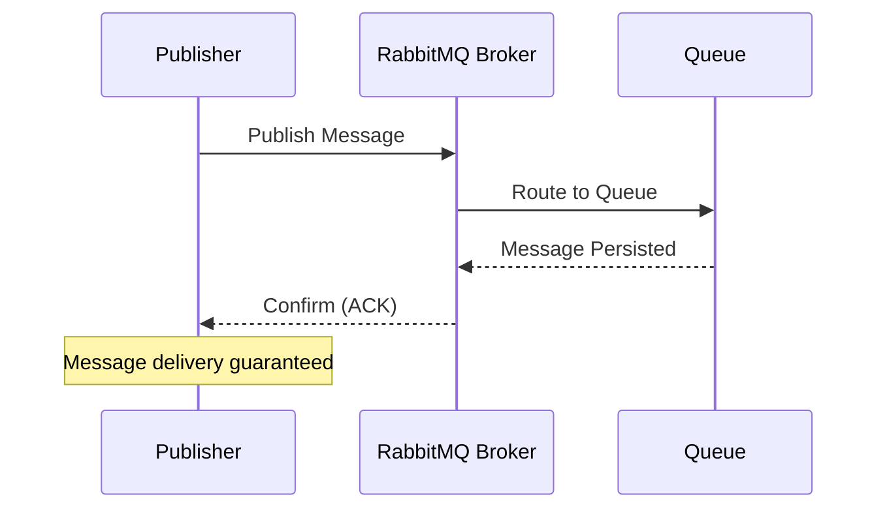
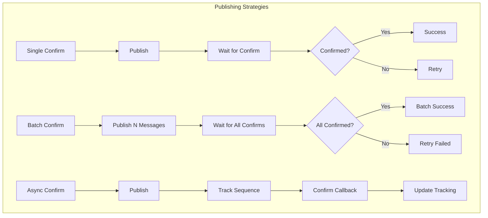
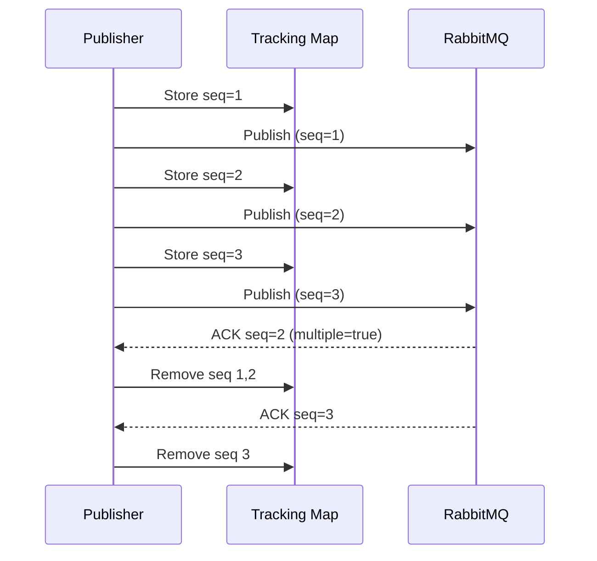

# How to Handle RabbitMQ Publisher Confirms

Author: [nawazdhandala](https://www.github.com/nawazdhandala)

Tags: RabbitMQ, Publisher Confirms, Message Queue, Reliability, Node.js, Python, Java, Messaging

Description: Learn how to implement RabbitMQ publisher confirms to guarantee message delivery and build reliable messaging systems.

---

> Publisher confirms are RabbitMQ's mechanism for ensuring messages are safely persisted. Without them, you have no guarantee that your messages were ever received by the broker.

Messages can be lost between your application and RabbitMQ. Publisher confirms solve this problem by providing acknowledgments from the broker.

---

## Understanding Publisher Confirms



Publisher confirms work by having RabbitMQ send an acknowledgment back to the publisher once a message has been:

1. Routed to at least one queue
2. Persisted to disk (for durable queues)
3. Replicated to mirrors (for HA queues)

---

## Enabling Publisher Confirms

### Node.js with amqplib

Enable confirms mode on your channel before publishing:

```javascript
// publisher-confirms.js
const amqp = require('amqplib');

async function publishWithConfirms() {
    // Create connection to RabbitMQ
    const connection = await amqp.connect('amqp://localhost');

    // Create a confirm channel instead of a regular channel
    // This enables publisher confirms mode
    const channel = await connection.createConfirmChannel();

    const exchange = 'orders';
    const routingKey = 'order.created';

    // Declare a durable exchange for reliable messaging
    await channel.assertExchange(exchange, 'topic', { durable: true });

    const message = {
        orderId: '12345',
        customerId: 'cust-001',
        total: 99.99
    };

    try {
        // Publish with confirmation - returns a promise that resolves on ACK
        await channel.publish(
            exchange,
            routingKey,
            Buffer.from(JSON.stringify(message)),
            {
                persistent: true,  // Mark message as persistent
                contentType: 'application/json'
            }
        );

        // Wait for all pending confirms
        await channel.waitForConfirms();

        console.log('Message confirmed by broker');
    } catch (error) {
        // Message was NACKed or connection failed
        console.error('Message was not confirmed:', error);
        // Implement retry logic here
    } finally {
        await channel.close();
        await connection.close();
    }
}

publishWithConfirms();
```

### Python with pika

Enable confirms and handle acknowledgments:

```python
# publisher_confirms.py
import pika
import json
from typing import Optional

class ReliablePublisher:
    """Publisher with confirmation support for guaranteed delivery"""

    def __init__(self, host: str = 'localhost'):
        self.host = host
        self.connection: Optional[pika.BlockingConnection] = None
        self.channel = None

    def connect(self):
        """Establish connection and enable confirms mode"""
        # Create connection parameters with heartbeat for connection health
        params = pika.ConnectionParameters(
            host=self.host,
            heartbeat=600,
            blocked_connection_timeout=300
        )

        self.connection = pika.BlockingConnection(params)
        self.channel = self.connection.channel()

        # Enable publisher confirms on this channel
        # This is required before any confirm operations will work
        self.channel.confirm_delivery()

        # Declare exchange for routing messages
        self.channel.exchange_declare(
            exchange='orders',
            exchange_type='topic',
            durable=True
        )

    def publish(self, routing_key: str, message: dict) -> bool:
        """
        Publish a message with confirmation.
        Returns True if message was confirmed, False otherwise.
        """
        try:
            # Publish with mandatory flag to ensure routing
            self.channel.basic_publish(
                exchange='orders',
                routing_key=routing_key,
                body=json.dumps(message),
                properties=pika.BasicProperties(
                    delivery_mode=2,  # Persistent message
                    content_type='application/json'
                ),
                mandatory=True  # Return message if unroutable
            )

            # With confirm_delivery enabled, basic_publish will raise
            # an exception if the message is NACKed
            return True

        except pika.exceptions.UnroutableError:
            # Message could not be routed to any queue
            print(f"Message unroutable: {routing_key}")
            return False

        except pika.exceptions.NackError:
            # Broker explicitly rejected the message
            print(f"Message NACKed: {routing_key}")
            return False

    def close(self):
        """Clean up connection resources"""
        if self.connection and not self.connection.is_closed:
            self.connection.close()


# Usage example
if __name__ == '__main__':
    publisher = ReliablePublisher()
    publisher.connect()

    message = {
        'order_id': '12345',
        'customer_id': 'cust-001',
        'total': 99.99
    }

    if publisher.publish('order.created', message):
        print('Message successfully confirmed')
    else:
        print('Message delivery failed')

    publisher.close()
```

### Java with RabbitMQ Client

Implement confirms with callbacks for high-throughput scenarios:

```java
// ReliablePublisher.java
import com.rabbitmq.client.*;
import java.io.IOException;
import java.util.concurrent.ConcurrentNavigableMap;
import java.util.concurrent.ConcurrentSkipListMap;
import java.util.concurrent.TimeoutException;

public class ReliablePublisher {

    private Connection connection;
    private Channel channel;

    // Track outstanding confirms by sequence number
    // ConcurrentSkipListMap provides thread-safe sorted map operations
    private final ConcurrentNavigableMap<Long, String> outstandingConfirms =
        new ConcurrentSkipListMap<>();

    public void connect() throws IOException, TimeoutException {
        ConnectionFactory factory = new ConnectionFactory();
        factory.setHost("localhost");

        connection = factory.newConnection();
        channel = connection.createChannel();

        // Enable publisher confirms on the channel
        channel.confirmSelect();

        // Add async confirm listener for non-blocking confirmations
        channel.addConfirmListener(new ConfirmListener() {

            @Override
            public void handleAck(long deliveryTag, boolean multiple) {
                // Message(s) confirmed by broker
                if (multiple) {
                    // All messages up to and including deliveryTag are confirmed
                    ConcurrentNavigableMap<Long, String> confirmed =
                        outstandingConfirms.headMap(deliveryTag, true);
                    confirmed.clear();
                } else {
                    // Single message confirmed
                    outstandingConfirms.remove(deliveryTag);
                }
            }

            @Override
            public void handleNack(long deliveryTag, boolean multiple) {
                // Message(s) rejected by broker - implement retry logic
                String message = outstandingConfirms.get(deliveryTag);
                System.err.println("Message NACKed: " + message);

                if (multiple) {
                    ConcurrentNavigableMap<Long, String> nacked =
                        outstandingConfirms.headMap(deliveryTag, true);
                    // Re-queue these messages for retry
                    nacked.clear();
                } else {
                    outstandingConfirms.remove(deliveryTag);
                }
            }
        });

        // Declare durable exchange
        channel.exchangeDeclare("orders", "topic", true);
    }

    public void publish(String routingKey, String message) throws IOException {
        // Get next sequence number before publishing
        long sequenceNumber = channel.getNextPublishSeqNo();

        // Track message for confirmation
        outstandingConfirms.put(sequenceNumber, message);

        // Publish with persistent delivery mode
        channel.basicPublish(
            "orders",
            routingKey,
            MessageProperties.PERSISTENT_TEXT_PLAIN,
            message.getBytes()
        );
    }

    public boolean waitForConfirms(long timeoutMs) throws InterruptedException {
        // Wait for all outstanding confirms with timeout
        try {
            return channel.waitForConfirms(timeoutMs);
        } catch (TimeoutException e) {
            return false;
        }
    }

    public void close() throws IOException, TimeoutException {
        if (channel != null) channel.close();
        if (connection != null) connection.close();
    }
}
```

---

## Confirm Flow Patterns



---

## Batch Publishing with Confirms

For higher throughput, batch messages and confirm in groups:

```javascript
// batch-publisher.js
const amqp = require('amqplib');

class BatchPublisher {
    constructor(batchSize = 100, flushIntervalMs = 1000) {
        this.batchSize = batchSize;
        this.flushIntervalMs = flushIntervalMs;
        this.pendingMessages = [];
        this.channel = null;
        this.flushTimer = null;
    }

    async connect() {
        const connection = await amqp.connect('amqp://localhost');
        // Use confirm channel for publisher confirms
        this.channel = await connection.createConfirmChannel();

        await this.channel.assertExchange('events', 'topic', { durable: true });

        // Start periodic flush timer
        this.flushTimer = setInterval(() => this.flush(), this.flushIntervalMs);
    }

    async publish(routingKey, message) {
        // Add message to pending batch
        this.pendingMessages.push({ routingKey, message });

        // Flush if batch size reached
        if (this.pendingMessages.length >= this.batchSize) {
            await this.flush();
        }
    }

    async flush() {
        if (this.pendingMessages.length === 0) {
            return;
        }

        // Copy and clear pending messages atomically
        const batch = this.pendingMessages.splice(0);

        console.log(`Flushing batch of ${batch.length} messages`);

        try {
            // Publish all messages in the batch
            for (const { routingKey, message } of batch) {
                this.channel.publish(
                    'events',
                    routingKey,
                    Buffer.from(JSON.stringify(message)),
                    { persistent: true }
                );
            }

            // Wait for all confirms in this batch
            await this.channel.waitForConfirms();

            console.log(`Batch of ${batch.length} messages confirmed`);

        } catch (error) {
            console.error('Batch confirmation failed:', error);

            // Re-queue failed messages for retry
            this.pendingMessages.unshift(...batch);

            throw error;
        }
    }

    async close() {
        // Clear flush timer
        if (this.flushTimer) {
            clearInterval(this.flushTimer);
        }

        // Flush remaining messages
        await this.flush();

        await this.channel.close();
    }
}

// Usage
async function main() {
    const publisher = new BatchPublisher(100, 500);
    await publisher.connect();

    // Publish many messages - they will be batched automatically
    for (let i = 0; i < 1000; i++) {
        await publisher.publish('user.activity', {
            userId: `user-${i}`,
            action: 'page_view',
            timestamp: Date.now()
        });
    }

    await publisher.close();
}

main();
```

---

## Handling Confirm Failures

Implement robust retry logic for failed confirmations:

```python
# retry_publisher.py
import pika
import json
import time
from typing import Optional, Callable
from dataclasses import dataclass
from enum import Enum

class RetryStrategy(Enum):
    IMMEDIATE = "immediate"
    EXPONENTIAL_BACKOFF = "exponential_backoff"
    FIXED_DELAY = "fixed_delay"

@dataclass
class RetryConfig:
    max_retries: int = 3
    strategy: RetryStrategy = RetryStrategy.EXPONENTIAL_BACKOFF
    base_delay_seconds: float = 1.0
    max_delay_seconds: float = 30.0

class RetryablePublisher:
    """Publisher with automatic retry on confirm failures"""

    def __init__(self, host: str, retry_config: Optional[RetryConfig] = None):
        self.host = host
        self.retry_config = retry_config or RetryConfig()
        self.connection = None
        self.channel = None
        self.on_permanent_failure: Optional[Callable] = None

    def connect(self):
        """Establish connection with confirms enabled"""
        params = pika.ConnectionParameters(
            host=self.host,
            heartbeat=600
        )
        self.connection = pika.BlockingConnection(params)
        self.channel = self.connection.channel()
        self.channel.confirm_delivery()
        self.channel.exchange_declare(
            exchange='reliable',
            exchange_type='topic',
            durable=True
        )

    def _calculate_delay(self, attempt: int) -> float:
        """Calculate delay based on retry strategy"""
        config = self.retry_config

        if config.strategy == RetryStrategy.IMMEDIATE:
            return 0

        elif config.strategy == RetryStrategy.FIXED_DELAY:
            return config.base_delay_seconds

        elif config.strategy == RetryStrategy.EXPONENTIAL_BACKOFF:
            # Exponential backoff with jitter
            delay = config.base_delay_seconds * (2 ** attempt)
            return min(delay, config.max_delay_seconds)

        return config.base_delay_seconds

    def publish_with_retry(self, routing_key: str, message: dict) -> bool:
        """
        Publish message with automatic retry on failure.
        Returns True if message was eventually confirmed.
        """
        attempt = 0
        last_error = None

        while attempt <= self.retry_config.max_retries:
            try:
                # Attempt to publish
                self.channel.basic_publish(
                    exchange='reliable',
                    routing_key=routing_key,
                    body=json.dumps(message),
                    properties=pika.BasicProperties(
                        delivery_mode=2,
                        content_type='application/json'
                    ),
                    mandatory=True
                )

                # If we get here, message was confirmed
                if attempt > 0:
                    print(f"Message confirmed after {attempt} retries")
                return True

            except (pika.exceptions.NackError,
                    pika.exceptions.UnroutableError) as e:
                last_error = e
                attempt += 1

                if attempt <= self.retry_config.max_retries:
                    delay = self._calculate_delay(attempt)
                    print(f"Publish failed, retrying in {delay}s (attempt {attempt})")
                    time.sleep(delay)

            except pika.exceptions.AMQPConnectionError:
                # Connection lost - attempt reconnection
                print("Connection lost, reconnecting...")
                try:
                    self.connect()
                except Exception as e:
                    last_error = e
                    attempt += 1
                    time.sleep(self._calculate_delay(attempt))

        # All retries exhausted
        print(f"Message failed after {self.retry_config.max_retries} retries")

        if self.on_permanent_failure:
            # Call failure handler with message details
            self.on_permanent_failure(routing_key, message, last_error)

        return False

    def close(self):
        if self.connection and not self.connection.is_closed:
            self.connection.close()


# Usage with dead letter handling
def handle_permanent_failure(routing_key, message, error):
    """Store failed messages for manual review"""
    print(f"Permanent failure: {routing_key} - {error}")
    # Write to dead letter store (database, file, etc.)
    with open('dead_letters.jsonl', 'a') as f:
        f.write(json.dumps({
            'routing_key': routing_key,
            'message': message,
            'error': str(error),
            'timestamp': time.time()
        }) + '\n')

if __name__ == '__main__':
    config = RetryConfig(
        max_retries=5,
        strategy=RetryStrategy.EXPONENTIAL_BACKOFF,
        base_delay_seconds=0.5
    )

    publisher = RetryablePublisher('localhost', config)
    publisher.on_permanent_failure = handle_permanent_failure
    publisher.connect()

    # This will retry automatically on failure
    success = publisher.publish_with_retry('order.created', {
        'order_id': '12345',
        'items': ['item1', 'item2']
    })

    publisher.close()
```

---

## Async Confirms for High Throughput



For maximum throughput, use asynchronous confirms:

```javascript
// async-confirms.js
const amqp = require('amqplib');

class AsyncConfirmPublisher {
    constructor() {
        this.channel = null;
        this.connection = null;
        // Track pending messages by delivery tag
        this.pendingConfirms = new Map();
        this.nextSeqNo = 1;
    }

    async connect() {
        this.connection = await amqp.connect('amqp://localhost');
        this.channel = await this.connection.createConfirmChannel();

        await this.channel.assertExchange('async-events', 'topic', {
            durable: true
        });

        // Set up confirm event handlers
        this.channel.on('ack', (seqNo, multiple) => {
            this._handleAck(seqNo, multiple);
        });

        this.channel.on('nack', (seqNo, multiple) => {
            this._handleNack(seqNo, multiple);
        });
    }

    _handleAck(seqNo, multiple) {
        if (multiple) {
            // All messages up to seqNo are confirmed
            for (const [key, pending] of this.pendingConfirms) {
                if (key <= seqNo) {
                    pending.resolve(true);
                    this.pendingConfirms.delete(key);
                }
            }
        } else {
            const pending = this.pendingConfirms.get(seqNo);
            if (pending) {
                pending.resolve(true);
                this.pendingConfirms.delete(seqNo);
            }
        }
    }

    _handleNack(seqNo, multiple) {
        if (multiple) {
            for (const [key, pending] of this.pendingConfirms) {
                if (key <= seqNo) {
                    pending.reject(new Error('Message NACKed'));
                    this.pendingConfirms.delete(key);
                }
            }
        } else {
            const pending = this.pendingConfirms.get(seqNo);
            if (pending) {
                pending.reject(new Error('Message NACKed'));
                this.pendingConfirms.delete(seqNo);
            }
        }
    }

    publish(routingKey, message) {
        // Return a promise that resolves when confirmed
        return new Promise((resolve, reject) => {
            const seqNo = this.nextSeqNo++;

            // Store promise handlers for this sequence number
            this.pendingConfirms.set(seqNo, { resolve, reject, message });

            // Publish without waiting
            this.channel.publish(
                'async-events',
                routingKey,
                Buffer.from(JSON.stringify(message)),
                { persistent: true }
            );
        });
    }

    async publishMany(messages) {
        // Publish all messages and collect promises
        const promises = messages.map(({ routingKey, message }) =>
            this.publish(routingKey, message)
        );

        // Wait for all confirmations
        return Promise.allSettled(promises);
    }

    async close() {
        // Wait for any pending confirms before closing
        if (this.pendingConfirms.size > 0) {
            await this.channel.waitForConfirms();
        }
        await this.channel.close();
        await this.connection.close();
    }
}

// Usage
async function main() {
    const publisher = new AsyncConfirmPublisher();
    await publisher.connect();

    // Publish many messages asynchronously
    const messages = [];
    for (let i = 0; i < 10000; i++) {
        messages.push({
            routingKey: 'event.created',
            message: { eventId: i, data: 'test' }
        });
    }

    console.time('publish');
    const results = await publisher.publishMany(messages);
    console.timeEnd('publish');

    // Check results
    const confirmed = results.filter(r => r.status === 'fulfilled').length;
    const failed = results.filter(r => r.status === 'rejected').length;

    console.log(`Confirmed: ${confirmed}, Failed: ${failed}`);

    await publisher.close();
}

main();
```

---

## Monitoring Confirm Performance

Track confirm latency and success rates:

```python
# confirm_metrics.py
import time
from dataclasses import dataclass, field
from typing import List
from statistics import mean, median, stdev

@dataclass
class ConfirmMetrics:
    """Track publisher confirm performance metrics"""

    latencies: List[float] = field(default_factory=list)
    successes: int = 0
    failures: int = 0
    retries: int = 0

    def record_confirm(self, latency_ms: float, success: bool):
        """Record a confirm result"""
        self.latencies.append(latency_ms)
        if success:
            self.successes += 1
        else:
            self.failures += 1

    def record_retry(self):
        """Record a retry attempt"""
        self.retries += 1

    def get_stats(self) -> dict:
        """Calculate and return statistics"""
        if not self.latencies:
            return {}

        return {
            'total_publishes': self.successes + self.failures,
            'success_rate': self.successes / (self.successes + self.failures) * 100,
            'retry_count': self.retries,
            'latency_avg_ms': mean(self.latencies),
            'latency_median_ms': median(self.latencies),
            'latency_p99_ms': sorted(self.latencies)[int(len(self.latencies) * 0.99)],
            'latency_max_ms': max(self.latencies)
        }


class MetricsPublisher:
    """Publisher that tracks confirm metrics"""

    def __init__(self, channel):
        self.channel = channel
        self.metrics = ConfirmMetrics()

    def publish(self, exchange: str, routing_key: str, body: bytes) -> bool:
        """Publish with metrics tracking"""
        start_time = time.time()

        try:
            self.channel.basic_publish(
                exchange=exchange,
                routing_key=routing_key,
                body=body,
                mandatory=True
            )

            latency = (time.time() - start_time) * 1000
            self.metrics.record_confirm(latency, success=True)
            return True

        except Exception:
            latency = (time.time() - start_time) * 1000
            self.metrics.record_confirm(latency, success=False)
            return False

    def print_stats(self):
        """Print current metrics"""
        stats = self.metrics.get_stats()
        print("Publisher Confirm Metrics:")
        print(f"  Total publishes: {stats.get('total_publishes', 0)}")
        print(f"  Success rate: {stats.get('success_rate', 0):.2f}%")
        print(f"  Retry count: {stats.get('retry_count', 0)}")
        print(f"  Avg latency: {stats.get('latency_avg_ms', 0):.2f}ms")
        print(f"  P99 latency: {stats.get('latency_p99_ms', 0):.2f}ms")
```

---

## Best Practices

1. **Always enable confirms for critical messages** - Data loss is unacceptable for important business events

2. **Use persistent messages with durable queues** - Confirms without persistence only confirm routing, not durability

3. **Implement retry with backoff** - Transient failures are common; give the system time to recover

4. **Track confirm latency** - High latency indicates broker or network issues

5. **Use async confirms for throughput** - Synchronous confirms limit you to one message at a time

6. **Handle NACKs explicitly** - NACKs indicate serious issues that need investigation

7. **Set reasonable timeouts** - Do not wait forever for confirms

---

## Conclusion

Publisher confirms are essential for building reliable messaging systems with RabbitMQ. Key takeaways:

- **Enable confirm mode** on your channel before publishing
- **Choose the right strategy** - sync for simplicity, async for throughput
- **Implement retry logic** - temporary failures will happen
- **Monitor confirm metrics** - track latency and success rates
- **Combine with persistence** - confirms plus durability equals reliability

---

*Building reliable message-driven systems? [OneUptime](https://oneuptime.com) monitors your RabbitMQ clusters and alerts you to publisher confirm failures before they impact your users.*
