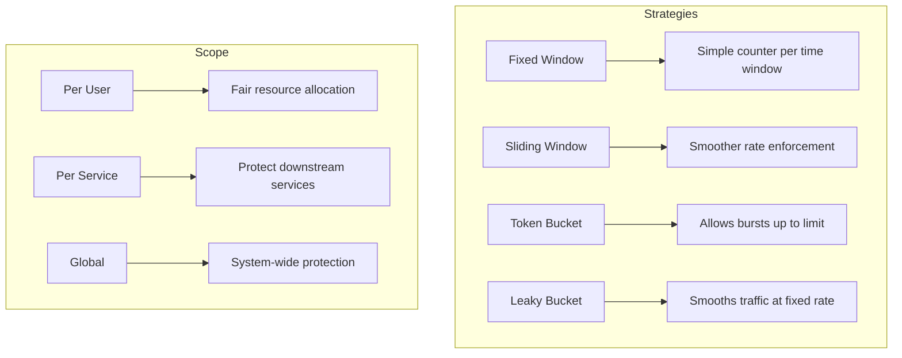
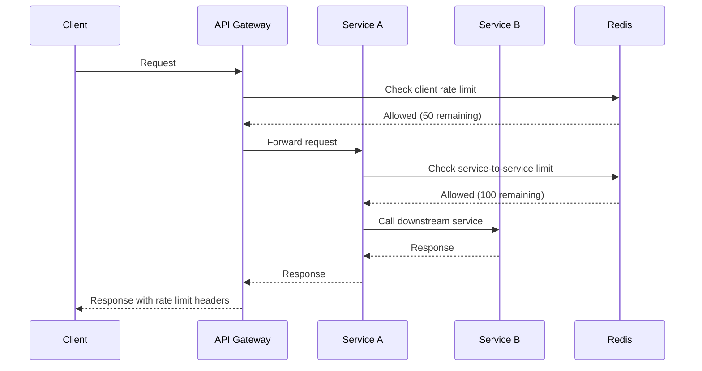
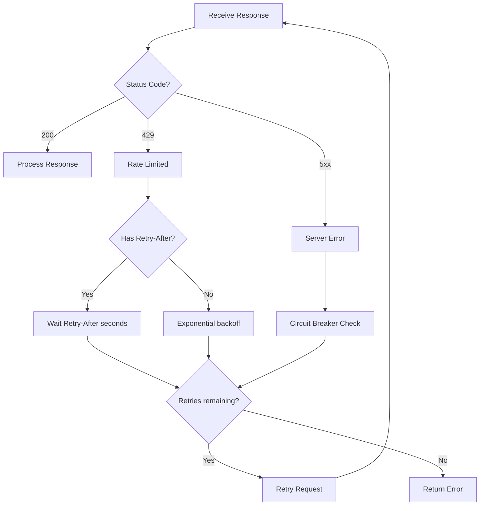

# How to Handle Rate Limiting Across Services

Author: [nawazdhandala](https://www.github.com/nawazdhandala)

Tags: Rate Limiting, Microservices, API Gateway, Redis, Distributed Systems, Traffic Management, Throttling

Description: Learn how to implement and handle rate limiting across distributed microservices, including token bucket algorithms, sliding window counters, and coordinated rate limiting with Redis.

---

> Rate limiting is your first line of defense against traffic spikes, misbehaving clients, and cascading failures. In a microservices architecture, coordinating rate limits across multiple services adds complexity but is essential for system stability.

Without proper rate limiting, a single misbehaving client can overwhelm your services, causing slowdowns or outages that affect all users. This guide covers strategies for implementing rate limiting that works across distributed services.

---

## Rate Limiting Strategies



---

## Distributed Rate Limiting with Redis

For rate limiting across multiple service instances, you need a shared state store.

```go
// Go - Distributed rate limiter using Redis
package ratelimit

import (
    "context"
    "fmt"
    "time"

    "github.com/redis/go-redis/v9"
)

// RateLimiter provides distributed rate limiting using Redis
type RateLimiter struct {
    client     *redis.Client
    keyPrefix  string
}

// NewRateLimiter creates a new distributed rate limiter
func NewRateLimiter(redisAddr string, keyPrefix string) *RateLimiter {
    client := redis.NewClient(&redis.Options{
        Addr:         redisAddr,
        PoolSize:     100,
        MinIdleConns: 10,
    })

    return &RateLimiter{
        client:    client,
        keyPrefix: keyPrefix,
    }
}

// SlidingWindowLimit implements sliding window rate limiting
// Returns: allowed (bool), remaining (int64), resetTime (time.Time), error
func (rl *RateLimiter) SlidingWindowLimit(
    ctx context.Context,
    key string,
    limit int64,
    window time.Duration,
) (bool, int64, time.Time, error) {
    now := time.Now()
    windowStart := now.Add(-window).UnixMilli()
    nowMs := now.UnixMilli()

    fullKey := fmt.Sprintf("%s:%s", rl.keyPrefix, key)

    // Lua script for atomic sliding window rate limiting
    script := redis.NewScript(`
        local key = KEYS[1]
        local window_start = tonumber(ARGV[1])
        local now = tonumber(ARGV[2])
        local limit = tonumber(ARGV[3])
        local window_ms = tonumber(ARGV[4])

        -- Remove old entries outside the window
        redis.call('ZREMRANGEBYSCORE', key, '-inf', window_start)

        -- Count current requests in window
        local current = redis.call('ZCARD', key)

        if current < limit then
            -- Add new request
            redis.call('ZADD', key, now, now .. ':' .. math.random())
            -- Set expiry on the key
            redis.call('PEXPIRE', key, window_ms)
            return {1, limit - current - 1}
        else
            return {0, 0}
        end
    `)

    result, err := script.Run(ctx, rl.client, []string{fullKey},
        windowStart, nowMs, limit, window.Milliseconds()).Int64Slice()

    if err != nil {
        return false, 0, time.Time{}, fmt.Errorf("rate limit check failed: %w", err)
    }

    allowed := result[0] == 1
    remaining := result[1]
    resetTime := now.Add(window)

    return allowed, remaining, resetTime, nil
}

// TokenBucketLimit implements token bucket rate limiting
func (rl *RateLimiter) TokenBucketLimit(
    ctx context.Context,
    key string,
    bucketSize int64,
    refillRate float64, // tokens per second
) (bool, int64, error) {
    fullKey := fmt.Sprintf("%s:bucket:%s", rl.keyPrefix, key)
    now := time.Now().UnixMilli()

    // Lua script for atomic token bucket
    script := redis.NewScript(`
        local key = KEYS[1]
        local bucket_size = tonumber(ARGV[1])
        local refill_rate = tonumber(ARGV[2])
        local now = tonumber(ARGV[3])

        -- Get current bucket state
        local bucket = redis.call('HMGET', key, 'tokens', 'last_update')
        local tokens = tonumber(bucket[1]) or bucket_size
        local last_update = tonumber(bucket[2]) or now

        -- Calculate tokens to add based on time elapsed
        local elapsed_seconds = (now - last_update) / 1000.0
        local tokens_to_add = elapsed_seconds * refill_rate
        tokens = math.min(bucket_size, tokens + tokens_to_add)

        local allowed = 0
        if tokens >= 1 then
            tokens = tokens - 1
            allowed = 1
        end

        -- Update bucket state
        redis.call('HMSET', key, 'tokens', tokens, 'last_update', now)
        redis.call('EXPIRE', key, 3600)

        return {allowed, math.floor(tokens)}
    `)

    result, err := script.Run(ctx, rl.client, []string{fullKey},
        bucketSize, refillRate, now).Int64Slice()

    if err != nil {
        return false, 0, fmt.Errorf("token bucket check failed: %w", err)
    }

    return result[0] == 1, result[1], nil
}
```

---

## Rate Limiting Middleware

### HTTP Middleware

```go
// Go - HTTP middleware for rate limiting
package middleware

import (
    "net/http"
    "strconv"
    "time"

    "myapp/ratelimit"
)

// RateLimitConfig holds rate limit configuration
type RateLimitConfig struct {
    Limit      int64
    Window     time.Duration
    KeyFunc    func(r *http.Request) string
    OnLimited  func(w http.ResponseWriter, r *http.Request)
}

// DefaultKeyFunc extracts client IP for rate limiting
func DefaultKeyFunc(r *http.Request) string {
    // Check X-Forwarded-For first (for proxied requests)
    if xff := r.Header.Get("X-Forwarded-For"); xff != "" {
        return xff
    }
    return r.RemoteAddr
}

// RateLimitMiddleware creates rate limiting middleware
func RateLimitMiddleware(limiter *ratelimit.RateLimiter, config RateLimitConfig) func(http.Handler) http.Handler {
    if config.KeyFunc == nil {
        config.KeyFunc = DefaultKeyFunc
    }

    if config.OnLimited == nil {
        config.OnLimited = func(w http.ResponseWriter, r *http.Request) {
            http.Error(w, "Rate limit exceeded", http.StatusTooManyRequests)
        }
    }

    return func(next http.Handler) http.Handler {
        return http.HandlerFunc(func(w http.ResponseWriter, r *http.Request) {
            ctx := r.Context()
            key := config.KeyFunc(r)

            allowed, remaining, resetTime, err := limiter.SlidingWindowLimit(
                ctx, key, config.Limit, config.Window,
            )

            if err != nil {
                // On error, allow request but log
                // Could also deny request for stricter enforcement
                next.ServeHTTP(w, r)
                return
            }

            // Set rate limit headers
            w.Header().Set("X-RateLimit-Limit", strconv.FormatInt(config.Limit, 10))
            w.Header().Set("X-RateLimit-Remaining", strconv.FormatInt(remaining, 10))
            w.Header().Set("X-RateLimit-Reset", strconv.FormatInt(resetTime.Unix(), 10))

            if !allowed {
                w.Header().Set("Retry-After", strconv.FormatInt(int64(time.Until(resetTime).Seconds()), 10))
                config.OnLimited(w, r)
                return
            }

            next.ServeHTTP(w, r)
        })
    }
}
```

---

## Tiered Rate Limiting

Different rate limits for different user tiers or API endpoints.

```python
# Python - Tiered rate limiting implementation
from dataclasses import dataclass
from enum import Enum
from typing import Optional, Tuple
import time
import redis
import hashlib

class UserTier(Enum):
    FREE = "free"
    BASIC = "basic"
    PREMIUM = "premium"
    ENTERPRISE = "enterprise"

@dataclass
class RateLimitTier:
    requests_per_minute: int
    requests_per_hour: int
    requests_per_day: int
    burst_size: int

# Define rate limits per tier
TIER_LIMITS = {
    UserTier.FREE: RateLimitTier(
        requests_per_minute=10,
        requests_per_hour=100,
        requests_per_day=1000,
        burst_size=5
    ),
    UserTier.BASIC: RateLimitTier(
        requests_per_minute=60,
        requests_per_hour=1000,
        requests_per_day=10000,
        burst_size=20
    ),
    UserTier.PREMIUM: RateLimitTier(
        requests_per_minute=300,
        requests_per_hour=5000,
        requests_per_day=50000,
        burst_size=50
    ),
    UserTier.ENTERPRISE: RateLimitTier(
        requests_per_minute=1000,
        requests_per_hour=50000,
        requests_per_day=500000,
        burst_size=200
    ),
}

class TieredRateLimiter:
    def __init__(self, redis_client: redis.Redis, key_prefix: str = "ratelimit"):
        self.redis = redis_client
        self.key_prefix = key_prefix

    def _get_key(self, user_id: str, window: str) -> str:
        """Generate Redis key for rate limit counter"""
        return f"{self.key_prefix}:{user_id}:{window}"

    def check_rate_limit(
        self,
        user_id: str,
        tier: UserTier,
        endpoint: Optional[str] = None
    ) -> Tuple[bool, dict]:
        """
        Check if request is allowed under rate limits.
        Returns (allowed, info_dict)
        """
        limits = TIER_LIMITS[tier]
        now = time.time()

        # Apply endpoint-specific multiplier if needed
        multiplier = self._get_endpoint_multiplier(endpoint)

        # Check all time windows
        windows = [
            ("minute", 60, int(limits.requests_per_minute * multiplier)),
            ("hour", 3600, int(limits.requests_per_hour * multiplier)),
            ("day", 86400, int(limits.requests_per_day * multiplier)),
        ]

        pipe = self.redis.pipeline()

        for window_name, window_seconds, limit in windows:
            window_start = int(now // window_seconds) * window_seconds
            key = self._get_key(user_id, f"{window_name}:{window_start}")
            pipe.get(key)

        counts = pipe.execute()

        # Check each window
        results = {}
        allowed = True

        for i, (window_name, window_seconds, limit) in enumerate(windows):
            count = int(counts[i] or 0)
            remaining = max(0, limit - count)

            results[window_name] = {
                "limit": limit,
                "remaining": remaining,
                "reset": int(now // window_seconds) * window_seconds + window_seconds
            }

            if count >= limit:
                allowed = False

        return allowed, results

    def record_request(self, user_id: str) -> None:
        """Record a request for rate limiting"""
        now = time.time()
        pipe = self.redis.pipeline()

        windows = [
            ("minute", 60),
            ("hour", 3600),
            ("day", 86400),
        ]

        for window_name, window_seconds in windows:
            window_start = int(now // window_seconds) * window_seconds
            key = self._get_key(user_id, f"{window_name}:{window_start}")

            pipe.incr(key)
            pipe.expire(key, window_seconds + 60)  # Extra buffer for safety

        pipe.execute()

    def _get_endpoint_multiplier(self, endpoint: Optional[str]) -> float:
        """
        Some endpoints may have different rate limits.
        Returns multiplier for the endpoint.
        """
        if endpoint is None:
            return 1.0

        # Expensive endpoints get lower limits
        expensive_endpoints = ["/api/export", "/api/report", "/api/bulk"]
        if any(endpoint.startswith(ep) for ep in expensive_endpoints):
            return 0.1

        return 1.0

# Usage example
def rate_limit_middleware(get_user_tier):
    """FastAPI middleware for tiered rate limiting"""
    from fastapi import Request, HTTPException
    from fastapi.responses import JSONResponse

    limiter = TieredRateLimiter(
        redis.Redis(host='localhost', port=6379, db=0)
    )

    async def middleware(request: Request, call_next):
        user_id = request.headers.get("X-User-ID", request.client.host)
        tier = get_user_tier(user_id)
        endpoint = request.url.path

        allowed, info = limiter.check_rate_limit(user_id, tier, endpoint)

        if not allowed:
            # Find which window was exceeded
            for window, data in info.items():
                if data["remaining"] == 0:
                    retry_after = data["reset"] - time.time()
                    return JSONResponse(
                        status_code=429,
                        content={
                            "error": "Rate limit exceeded",
                            "window": window,
                            "retry_after": int(retry_after)
                        },
                        headers={
                            "Retry-After": str(int(retry_after)),
                            "X-RateLimit-Limit": str(data["limit"]),
                            "X-RateLimit-Remaining": "0",
                            "X-RateLimit-Reset": str(data["reset"])
                        }
                    )

        # Record the request
        limiter.record_request(user_id)

        # Add rate limit headers to response
        response = await call_next(request)
        minute_info = info.get("minute", {})
        response.headers["X-RateLimit-Limit"] = str(minute_info.get("limit", 0))
        response.headers["X-RateLimit-Remaining"] = str(minute_info.get("remaining", 0))
        response.headers["X-RateLimit-Reset"] = str(minute_info.get("reset", 0))

        return response

    return middleware
```

---

## Service-to-Service Rate Limiting



```typescript
// TypeScript - Service-to-service rate limiting
import Redis from 'ioredis';

interface RateLimitResult {
    allowed: boolean;
    remaining: number;
    retryAfter?: number;
}

interface ServiceRateLimitConfig {
    // How many requests this service can make to target
    requestsPerSecond: number;
    // Burst capacity
    burstSize: number;
}

// Define rate limits between services
const SERVICE_LIMITS: Record<string, Record<string, ServiceRateLimitConfig>> = {
    'order-service': {
        'inventory-service': { requestsPerSecond: 100, burstSize: 50 },
        'payment-service': { requestsPerSecond: 50, burstSize: 20 },
        'notification-service': { requestsPerSecond: 200, burstSize: 100 },
    },
    'api-gateway': {
        'order-service': { requestsPerSecond: 1000, burstSize: 200 },
        'user-service': { requestsPerSecond: 500, burstSize: 100 },
    },
};

class ServiceRateLimiter {
    private redis: Redis;
    private serviceName: string;

    constructor(redis: Redis, serviceName: string) {
        this.redis = redis;
        this.serviceName = serviceName;
    }

    async checkLimit(targetService: string): Promise<RateLimitResult> {
        const config = SERVICE_LIMITS[this.serviceName]?.[targetService];

        if (!config) {
            // No limit configured, allow request
            return { allowed: true, remaining: -1 };
        }

        const key = `svc-ratelimit:${this.serviceName}:${targetService}`;
        const now = Date.now();

        // Token bucket implementation
        const script = `
            local key = KEYS[1]
            local bucket_size = tonumber(ARGV[1])
            local refill_rate = tonumber(ARGV[2])
            local now = tonumber(ARGV[3])

            local bucket = redis.call('HMGET', key, 'tokens', 'last_update')
            local tokens = tonumber(bucket[1]) or bucket_size
            local last_update = tonumber(bucket[2]) or now

            local elapsed_seconds = (now - last_update) / 1000.0
            local tokens_to_add = elapsed_seconds * refill_rate
            tokens = math.min(bucket_size, tokens + tokens_to_add)

            local allowed = 0
            local retry_after = 0

            if tokens >= 1 then
                tokens = tokens - 1
                allowed = 1
            else
                retry_after = math.ceil((1 - tokens) / refill_rate * 1000)
            end

            redis.call('HMSET', key, 'tokens', tokens, 'last_update', now)
            redis.call('EXPIRE', key, 3600)

            return {allowed, math.floor(tokens), retry_after}
        `;

        const result = await this.redis.eval(
            script,
            1,
            key,
            config.burstSize,
            config.requestsPerSecond,
            now
        ) as number[];

        return {
            allowed: result[0] === 1,
            remaining: result[1],
            retryAfter: result[2] > 0 ? result[2] : undefined,
        };
    }

    // Wrapper for making rate-limited HTTP calls
    async makeRequest<T>(
        targetService: string,
        requestFn: () => Promise<T>
    ): Promise<T> {
        const result = await this.checkLimit(targetService);

        if (!result.allowed) {
            throw new RateLimitExceededError(
                `Rate limit exceeded for ${targetService}`,
                result.retryAfter || 1000
            );
        }

        return requestFn();
    }
}

class RateLimitExceededError extends Error {
    constructor(message: string, public retryAfter: number) {
        super(message);
        this.name = 'RateLimitExceededError';
    }
}

// Circuit breaker integration with rate limiting
class ResilientServiceClient {
    private rateLimiter: ServiceRateLimiter;
    private circuitBreaker: Map<string, CircuitBreakerState> = new Map();

    constructor(redis: Redis, serviceName: string) {
        this.rateLimiter = new ServiceRateLimiter(redis, serviceName);
    }

    async call<T>(
        targetService: string,
        requestFn: () => Promise<T>,
        options: { retries?: number; backoff?: number } = {}
    ): Promise<T> {
        const { retries = 3, backoff = 100 } = options;

        // Check circuit breaker
        const circuitState = this.circuitBreaker.get(targetService);
        if (circuitState?.state === 'open') {
            if (Date.now() < circuitState.resetTime) {
                throw new Error(`Circuit breaker open for ${targetService}`);
            }
            // Half-open state - allow one request
            circuitState.state = 'half-open';
        }

        let lastError: Error | undefined;

        for (let attempt = 0; attempt < retries; attempt++) {
            try {
                const result = await this.rateLimiter.makeRequest(targetService, requestFn);

                // Success - close circuit breaker
                this.circuitBreaker.delete(targetService);

                return result;
            } catch (error) {
                lastError = error as Error;

                if (error instanceof RateLimitExceededError) {
                    // Wait for rate limit to reset
                    await this.sleep(error.retryAfter);
                } else {
                    // Other error - apply backoff
                    await this.sleep(backoff * Math.pow(2, attempt));

                    // Update circuit breaker on failure
                    this.recordFailure(targetService);
                }
            }
        }

        throw lastError;
    }

    private recordFailure(targetService: string): void {
        const state = this.circuitBreaker.get(targetService) || {
            failures: 0,
            state: 'closed' as const,
            resetTime: 0,
        };

        state.failures++;

        if (state.failures >= 5) {
            state.state = 'open';
            state.resetTime = Date.now() + 30000; // 30 second timeout
        }

        this.circuitBreaker.set(targetService, state);
    }

    private sleep(ms: number): Promise<void> {
        return new Promise(resolve => setTimeout(resolve, ms));
    }
}

interface CircuitBreakerState {
    failures: number;
    state: 'closed' | 'open' | 'half-open';
    resetTime: number;
}
```

---

## Handling Rate Limit Responses



### Client-Side Rate Limit Handling

```go
// Go - HTTP client with rate limit handling
package httpclient

import (
    "context"
    "fmt"
    "io"
    "net/http"
    "strconv"
    "time"
)

// RateLimitedClient handles rate limit responses automatically
type RateLimitedClient struct {
    client     *http.Client
    maxRetries int
    baseDelay  time.Duration
}

// NewRateLimitedClient creates a new rate-limit-aware HTTP client
func NewRateLimitedClient(maxRetries int) *RateLimitedClient {
    return &RateLimitedClient{
        client: &http.Client{
            Timeout: 30 * time.Second,
        },
        maxRetries: maxRetries,
        baseDelay:  time.Second,
    }
}

// Do performs an HTTP request with automatic rate limit handling
func (c *RateLimitedClient) Do(req *http.Request) (*http.Response, error) {
    var lastErr error

    for attempt := 0; attempt <= c.maxRetries; attempt++ {
        // Clone request for retry
        reqCopy := req.Clone(req.Context())
        if req.Body != nil {
            // Note: In production, use a body that can be read multiple times
            reqCopy.Body = req.Body
        }

        resp, err := c.client.Do(reqCopy)
        if err != nil {
            lastErr = err
            time.Sleep(c.calculateBackoff(attempt))
            continue
        }

        // Check for rate limiting
        if resp.StatusCode == http.StatusTooManyRequests {
            resp.Body.Close()

            waitTime := c.getRetryAfter(resp)
            if waitTime == 0 {
                waitTime = c.calculateBackoff(attempt)
            }

            select {
            case <-time.After(waitTime):
                continue
            case <-req.Context().Done():
                return nil, req.Context().Err()
            }
        }

        // Check for server errors (might indicate overload)
        if resp.StatusCode >= 500 {
            resp.Body.Close()
            lastErr = fmt.Errorf("server error: %d", resp.StatusCode)
            time.Sleep(c.calculateBackoff(attempt))
            continue
        }

        return resp, nil
    }

    return nil, fmt.Errorf("max retries exceeded: %w", lastErr)
}

func (c *RateLimitedClient) getRetryAfter(resp *http.Response) time.Duration {
    retryAfter := resp.Header.Get("Retry-After")
    if retryAfter == "" {
        return 0
    }

    // Try parsing as seconds
    if seconds, err := strconv.Atoi(retryAfter); err == nil {
        return time.Duration(seconds) * time.Second
    }

    // Try parsing as HTTP date
    if t, err := http.ParseTime(retryAfter); err == nil {
        return time.Until(t)
    }

    return 0
}

func (c *RateLimitedClient) calculateBackoff(attempt int) time.Duration {
    backoff := c.baseDelay * time.Duration(1<<uint(attempt))
    maxBackoff := 30 * time.Second
    if backoff > maxBackoff {
        return maxBackoff
    }
    return backoff
}
```

---

## Rate Limiting at the API Gateway

```yaml
# Kong API Gateway rate limiting configuration
# kong.yml

_format_version: "2.1"

services:
  - name: order-service
    url: http://order-service:8080
    routes:
      - name: order-routes
        paths:
          - /api/orders
    plugins:
      - name: rate-limiting
        config:
          # Limit configuration
          minute: 100
          hour: 1000
          day: 10000

          # Policy: local, cluster, or redis
          policy: redis
          redis_host: redis
          redis_port: 6379
          redis_database: 0

          # Identifier for rate limiting
          limit_by: consumer  # or ip, header, path

          # Response behavior
          hide_client_headers: false

      - name: rate-limiting-advanced
        config:
          # Different limits per consumer group
          limits:
            - consumer_groups:
                - free-tier
              minute: 10
              hour: 100
            - consumer_groups:
                - premium-tier
              minute: 1000
              hour: 10000

consumers:
  - username: api-user-1
    groups:
      - name: free-tier
  - username: api-user-2
    groups:
      - name: premium-tier
```

---

## Monitoring Rate Limits

```go
// Go - Prometheus metrics for rate limiting
package metrics

import (
    "github.com/prometheus/client_golang/prometheus"
    "github.com/prometheus/client_golang/prometheus/promauto"
)

var (
    // Counter for rate limit decisions
    rateLimitDecisions = promauto.NewCounterVec(
        prometheus.CounterOpts{
            Name: "rate_limit_decisions_total",
            Help: "Total rate limit decisions by outcome",
        },
        []string{"client_type", "endpoint", "decision"},
    )

    // Histogram for current usage relative to limit
    rateLimitUsage = promauto.NewGaugeVec(
        prometheus.GaugeOpts{
            Name: "rate_limit_usage_ratio",
            Help: "Current rate limit usage as ratio of limit",
        },
        []string{"client_type", "window"},
    )

    // Counter for rate limit exceeded events
    rateLimitExceeded = promauto.NewCounterVec(
        prometheus.CounterOpts{
            Name: "rate_limit_exceeded_total",
            Help: "Total number of rate limit exceeded events",
        },
        []string{"client_type", "endpoint"},
    )
)

// RecordRateLimitDecision records a rate limit decision
func RecordRateLimitDecision(clientType, endpoint string, allowed bool) {
    decision := "allowed"
    if !allowed {
        decision = "denied"
        rateLimitExceeded.WithLabelValues(clientType, endpoint).Inc()
    }
    rateLimitDecisions.WithLabelValues(clientType, endpoint, decision).Inc()
}

// UpdateUsageRatio updates the current usage ratio metric
func UpdateUsageRatio(clientType, window string, current, limit int64) {
    ratio := float64(current) / float64(limit)
    rateLimitUsage.WithLabelValues(clientType, window).Set(ratio)
}
```

---

## Best Practices

1. **Use distributed storage** - Redis or similar for multi-instance coordination
2. **Implement graceful degradation** - Return cached data when rate limited
3. **Add rate limit headers** - Help clients manage their request rate
4. **Use appropriate algorithms** - Token bucket for bursts, sliding window for smooth limits
5. **Monitor rate limit metrics** - Alert when limits are frequently hit
6. **Tier your limits** - Different limits for different user types
7. **Test rate limiting** - Include rate limit scenarios in load tests

---

*Need to monitor your API rate limiting effectiveness? [OneUptime](https://oneuptime.com) provides real-time visibility into API performance and rate limit metrics.*

**Related Reading:**
- [How to Fix "Service Registration Failed" Errors](https://oneuptime.com/blog/post/2026-01-24-service-registration-failed-errors/view)
- [How to Handle Idempotency in Microservices](https://oneuptime.com/blog/post/2026-01-24-idempotency-in-microservices/view)
