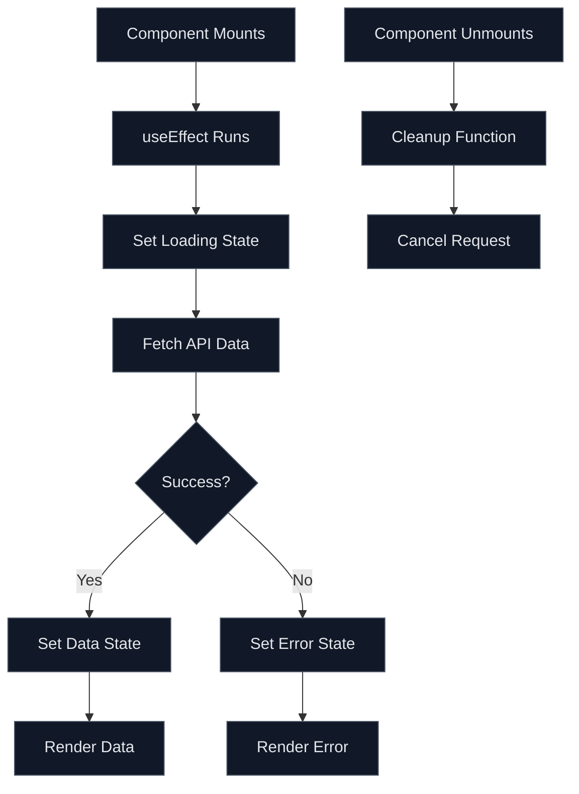
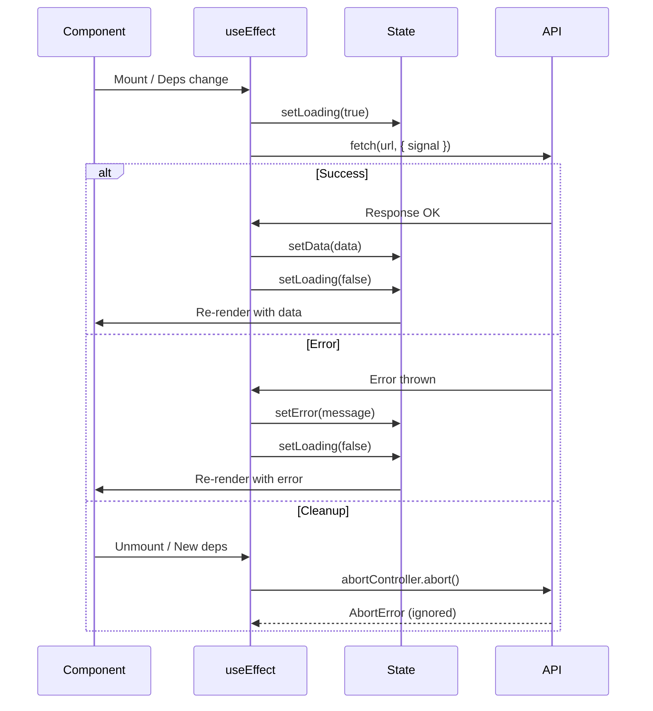

# How to Handle API Calls with useEffect

Author: [nawazdhandala](https://www.github.com/nawazdhandala)

Tags: React, useEffect, API, JavaScript, TypeScript, Hooks, Data Fetching, Frontend

Description: A comprehensive guide to handling API calls in React using useEffect, including proper cleanup, error handling, loading states, and avoiding common pitfalls.

---

Fetching data from APIs is one of the most common tasks in React applications. This guide covers how to properly use useEffect for API calls, handle loading and error states, and avoid common mistakes.

## Basic API Call Pattern

The fundamental pattern for fetching data with useEffect:



## Basic Implementation

```tsx
// components/UserProfile.tsx
import { useState, useEffect } from 'react';

// Define the data type
interface User {
  id: number;
  name: string;
  email: string;
  company: {
    name: string;
  };
}

export function UserProfile({ userId }: { userId: number }) {
  // State for the fetched data
  const [user, setUser] = useState<User | null>(null);

  // State for loading indicator
  const [loading, setLoading] = useState(true);

  // State for error handling
  const [error, setError] = useState<string | null>(null);

  useEffect(() => {
    // Reset states when userId changes
    setLoading(true);
    setError(null);
    setUser(null);

    // Fetch user data
    fetch(`https://jsonplaceholder.typicode.com/users/${userId}`)
      .then((response) => {
        // Check if response is ok
        if (!response.ok) {
          throw new Error(`HTTP error! status: ${response.status}`);
        }
        return response.json();
      })
      .then((data: User) => {
        setUser(data);
        setLoading(false);
      })
      .catch((err) => {
        setError(err.message);
        setLoading(false);
      });
  }, [userId]); // Re-run when userId changes

  // Render loading state
  if (loading) {
    return <div className="loading">Loading user data...</div>;
  }

  // Render error state
  if (error) {
    return <div className="error">Error: {error}</div>;
  }

  // Render empty state
  if (!user) {
    return <div className="empty">No user found</div>;
  }

  // Render data
  return (
    <div className="user-profile">
      <h1>{user.name}</h1>
      <p>Email: {user.email}</p>
      <p>Company: {user.company.name}</p>
    </div>
  );
}
```

## Proper Cleanup with AbortController

Always clean up ongoing requests to prevent memory leaks and race conditions:

```tsx
// components/UserProfileWithCleanup.tsx
import { useState, useEffect } from 'react';

interface User {
  id: number;
  name: string;
  email: string;
}

export function UserProfileWithCleanup({ userId }: { userId: number }) {
  const [user, setUser] = useState<User | null>(null);
  const [loading, setLoading] = useState(true);
  const [error, setError] = useState<string | null>(null);

  useEffect(() => {
    // Create an AbortController for this request
    const abortController = new AbortController();

    // Define async function inside useEffect
    const fetchUser = async () => {
      setLoading(true);
      setError(null);

      try {
        const response = await fetch(
          `https://jsonplaceholder.typicode.com/users/${userId}`,
          { signal: abortController.signal } // Pass abort signal
        );

        if (!response.ok) {
          throw new Error(`HTTP error! status: ${response.status}`);
        }

        const data: User = await response.json();

        // Only update state if request was not aborted
        setUser(data);
        setLoading(false);
      } catch (err) {
        // Ignore abort errors - these are expected
        if (err instanceof Error && err.name === 'AbortError') {
          console.log('Request was cancelled');
          return;
        }

        // Handle other errors
        setError(err instanceof Error ? err.message : 'Unknown error');
        setLoading(false);
      }
    };

    fetchUser();

    // Cleanup function - runs before next effect or unmount
    return () => {
      abortController.abort();
    };
  }, [userId]);

  if (loading) return <div>Loading...</div>;
  if (error) return <div>Error: {error}</div>;
  if (!user) return <div>No user found</div>;

  return (
    <div>
      <h1>{user.name}</h1>
      <p>{user.email}</p>
    </div>
  );
}
```

## Race Condition Prevention

Handle the case where multiple requests are in flight:

```tsx
// components/SearchResults.tsx
import { useState, useEffect } from 'react';

interface SearchResult {
  id: number;
  title: string;
}

export function SearchResults({ query }: { query: string }) {
  const [results, setResults] = useState<SearchResult[]>([]);
  const [loading, setLoading] = useState(false);
  const [error, setError] = useState<string | null>(null);

  useEffect(() => {
    // Skip empty queries
    if (!query.trim()) {
      setResults([]);
      return;
    }

    // Flag to track if this effect is still current
    let isCurrent = true;
    const abortController = new AbortController();

    const search = async () => {
      setLoading(true);
      setError(null);

      try {
        const response = await fetch(
          `/api/search?q=${encodeURIComponent(query)}`,
          { signal: abortController.signal }
        );

        if (!response.ok) {
          throw new Error('Search failed');
        }

        const data: SearchResult[] = await response.json();

        // Only update state if this is still the current request
        if (isCurrent) {
          setResults(data);
          setLoading(false);
        }
      } catch (err) {
        if (err instanceof Error && err.name === 'AbortError') {
          return; // Request was cancelled, ignore
        }

        if (isCurrent) {
          setError(err instanceof Error ? err.message : 'Search error');
          setLoading(false);
        }
      }
    };

    search();

    // Cleanup: mark this effect as stale and abort request
    return () => {
      isCurrent = false;
      abortController.abort();
    };
  }, [query]);

  return (
    <div>
      {loading && <div className="spinner">Searching...</div>}
      {error && <div className="error">{error}</div>}
      <ul>
        {results.map((result) => (
          <li key={result.id}>{result.title}</li>
        ))}
      </ul>
    </div>
  );
}
```

## Custom Hook for Data Fetching

Extract the fetching logic into a reusable hook:

```tsx
// hooks/useFetch.ts
import { useState, useEffect, useCallback } from 'react';

// Generic type for the hook
interface FetchState<T> {
  data: T | null;
  loading: boolean;
  error: string | null;
}

interface UseFetchReturn<T> extends FetchState<T> {
  refetch: () => void;
}

export function useFetch<T>(url: string): UseFetchReturn<T> {
  const [state, setState] = useState<FetchState<T>>({
    data: null,
    loading: true,
    error: null,
  });

  // Memoized fetch function
  const fetchData = useCallback(async (signal?: AbortSignal) => {
    setState((prev) => ({ ...prev, loading: true, error: null }));

    try {
      const response = await fetch(url, { signal });

      if (!response.ok) {
        throw new Error(`HTTP ${response.status}: ${response.statusText}`);
      }

      const data: T = await response.json();

      setState({ data, loading: false, error: null });
    } catch (err) {
      if (err instanceof Error && err.name === 'AbortError') {
        return;
      }

      setState((prev) => ({
        ...prev,
        loading: false,
        error: err instanceof Error ? err.message : 'Fetch failed',
      }));
    }
  }, [url]);

  // Effect for automatic fetching
  useEffect(() => {
    const abortController = new AbortController();
    fetchData(abortController.signal);

    return () => {
      abortController.abort();
    };
  }, [fetchData]);

  // Manual refetch function
  const refetch = useCallback(() => {
    fetchData();
  }, [fetchData]);

  return { ...state, refetch };
}

// Usage example
function ProductDetails({ productId }: { productId: string }) {
  interface Product {
    id: string;
    name: string;
    price: number;
    description: string;
  }

  const { data: product, loading, error, refetch } = useFetch<Product>(
    `/api/products/${productId}`
  );

  if (loading) return <div>Loading product...</div>;
  if (error) return <div>Error: {error} <button onClick={refetch}>Retry</button></div>;
  if (!product) return <div>Product not found</div>;

  return (
    <div>
      <h1>{product.name}</h1>
      <p>${product.price}</p>
      <p>{product.description}</p>
      <button onClick={refetch}>Refresh</button>
    </div>
  );
}
```

## Debounced API Calls

For search inputs and similar use cases:

```tsx
// hooks/useDebounce.ts
import { useState, useEffect } from 'react';

export function useDebounce<T>(value: T, delay: number): T {
  const [debouncedValue, setDebouncedValue] = useState<T>(value);

  useEffect(() => {
    const timer = setTimeout(() => {
      setDebouncedValue(value);
    }, delay);

    return () => {
      clearTimeout(timer);
    };
  }, [value, delay]);

  return debouncedValue;
}
```

```tsx
// components/SearchInput.tsx
import { useState, useEffect } from 'react';
import { useDebounce } from '@/hooks/useDebounce';

interface SearchResult {
  id: string;
  title: string;
  description: string;
}

export function SearchInput() {
  const [query, setQuery] = useState('');
  const [results, setResults] = useState<SearchResult[]>([]);
  const [loading, setLoading] = useState(false);

  // Debounce the query to avoid excessive API calls
  const debouncedQuery = useDebounce(query, 300);

  useEffect(() => {
    if (!debouncedQuery.trim()) {
      setResults([]);
      return;
    }

    const abortController = new AbortController();

    const search = async () => {
      setLoading(true);

      try {
        const response = await fetch(
          `/api/search?q=${encodeURIComponent(debouncedQuery)}`,
          { signal: abortController.signal }
        );

        if (!response.ok) throw new Error('Search failed');

        const data: SearchResult[] = await response.json();
        setResults(data);
      } catch (err) {
        if (err instanceof Error && err.name !== 'AbortError') {
          console.error('Search error:', err);
        }
      } finally {
        setLoading(false);
      }
    };

    search();

    return () => {
      abortController.abort();
    };
  }, [debouncedQuery]); // Only fetch when debounced value changes

  return (
    <div className="search">
      <input
        type="text"
        value={query}
        onChange={(e) => setQuery(e.target.value)}
        placeholder="Search..."
      />

      {loading && <span className="spinner" />}

      <ul className="results">
        {results.map((result) => (
          <li key={result.id}>
            <strong>{result.title}</strong>
            <p>{result.description}</p>
          </li>
        ))}
      </ul>
    </div>
  );
}
```

## Common Mistakes to Avoid

### Mistake 1: Missing Dependency Array

```tsx
// BAD: Missing dependency array - runs on every render
useEffect(() => {
  fetch(`/api/users/${userId}`);
}); // No dependency array!

// GOOD: Proper dependencies
useEffect(() => {
  fetch(`/api/users/${userId}`);
}, [userId]);
```

### Mistake 2: Not Handling Cleanup

```tsx
// BAD: No cleanup - can cause memory leaks
useEffect(() => {
  fetch('/api/data')
    .then((res) => res.json())
    .then(setData);
}, []);

// GOOD: With cleanup
useEffect(() => {
  const controller = new AbortController();

  fetch('/api/data', { signal: controller.signal })
    .then((res) => res.json())
    .then(setData)
    .catch((err) => {
      if (err.name !== 'AbortError') {
        setError(err.message);
      }
    });

  return () => controller.abort();
}, []);
```

### Mistake 3: Async Function Directly in useEffect

```tsx
// BAD: useEffect callback cannot be async
useEffect(async () => {  // This causes issues!
  const data = await fetchData();
  setData(data);
}, []);

// GOOD: Define async function inside
useEffect(() => {
  const fetchAndSet = async () => {
    const data = await fetchData();
    setData(data);
  };

  fetchAndSet();
}, []);
```

## Data Flow Diagram

Understanding the complete data flow:



## Quick Reference

| Pattern | Use Case |
|---------|----------|
| Basic fetch | Simple one-time data loading |
| AbortController | Prevent state updates after unmount |
| Race condition flag | Handle rapid dependency changes |
| Custom useFetch hook | Reusable fetching logic |
| Promise.all | Multiple parallel requests |
| Debounce | Search inputs, rate limiting |
| Polling | Real-time status updates |

Proper API handling in useEffect requires attention to cleanup, error handling, and race conditions. Following these patterns ensures your React application handles data fetching robustly and efficiently.
