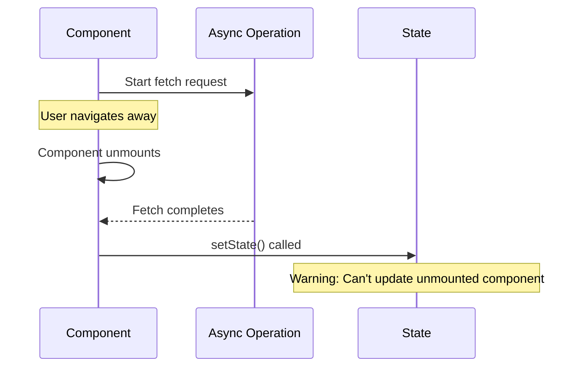
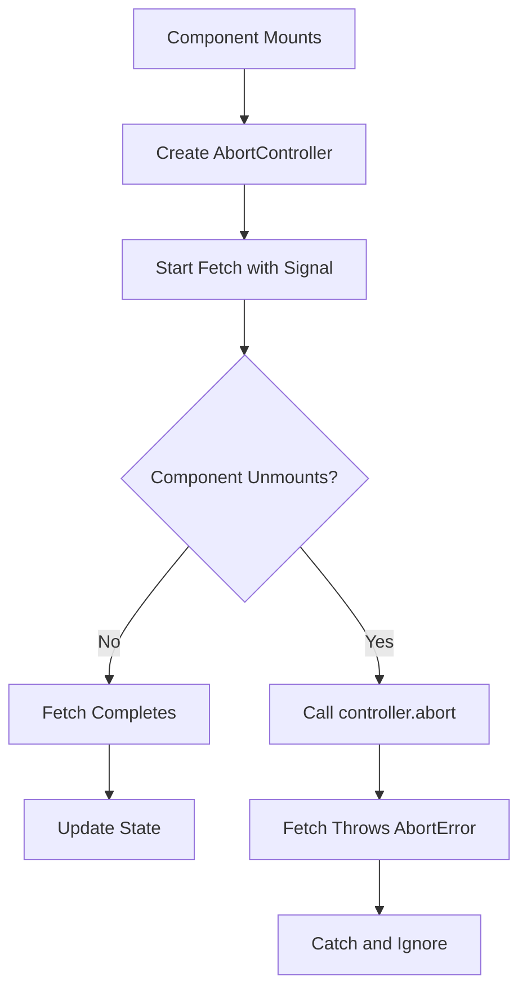
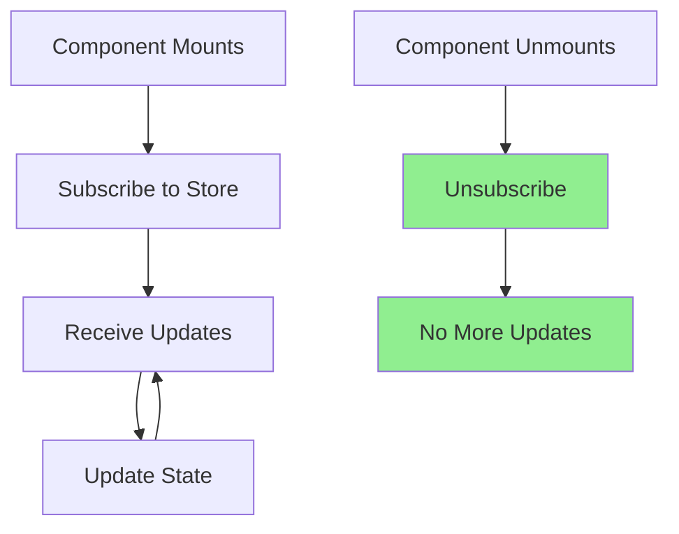

# How to Fix "Cannot Update State on Unmounted Component"

Author: [nawazdhandala](https://www.github.com/nawazdhandala)

Tags: React, JavaScript, Debugging, Memory Leaks, Async, Hooks

Description: Learn how to identify and fix the React warning about updating state on unmounted components, including proper cleanup patterns for async operations.

---

The warning "Can't perform a React state update on an unmounted component" appears when your code tries to update state after a component has been removed from the DOM. While React 18 removed this warning by default, the underlying issue of memory leaks and wasted operations still exists. Understanding and fixing this pattern is essential for building efficient React applications.

## Understanding the Problem

When a component unmounts while an async operation is still pending, the operation's callback may try to update state that no longer exists.



```jsx
// This component has the memory leak issue
function UserProfile({ userId }) {
  const [user, setUser] = useState(null);
  const [loading, setLoading] = useState(true);

  useEffect(() => {
    fetchUser(userId).then(data => {
      // If component unmounts before fetch completes,
      // this setState will trigger on unmounted component
      setUser(data);
      setLoading(false);
    });
  }, [userId]);

  if (loading) return <Spinner />;
  return <div>{user.name}</div>;
}
```

## Solution 1: Cleanup Flag Pattern

The most straightforward solution is using a cleanup flag to track component mount state.

```jsx
function UserProfile({ userId }) {
  const [user, setUser] = useState(null);
  const [loading, setLoading] = useState(true);
  const [error, setError] = useState(null);

  useEffect(() => {
    // Track whether the component is mounted
    let isMounted = true;

    async function loadUser() {
      try {
        setLoading(true);
        setError(null);

        const data = await fetchUser(userId);

        // Only update state if still mounted
        if (isMounted) {
          setUser(data);
          setLoading(false);
        }
      } catch (err) {
        // Only update state if still mounted
        if (isMounted) {
          setError(err.message);
          setLoading(false);
        }
      }
    }

    loadUser();

    // Cleanup function sets the flag to false
    return () => {
      isMounted = false;
    };
  }, [userId]);

  if (loading) return <Spinner />;
  if (error) return <ErrorMessage message={error} />;
  return <div>{user.name}</div>;
}
```

## Solution 2: AbortController Pattern

For fetch requests, AbortController provides a cleaner solution that actually cancels the request.



```jsx
function UserProfile({ userId }) {
  const [user, setUser] = useState(null);
  const [loading, setLoading] = useState(true);
  const [error, setError] = useState(null);

  useEffect(() => {
    // Create an AbortController for this effect
    const controller = new AbortController();
    const signal = controller.signal;

    async function loadUser() {
      try {
        setLoading(true);
        setError(null);

        const response = await fetch(`/api/users/${userId}`, { signal });

        if (!response.ok) {
          throw new Error('Failed to fetch user');
        }

        const data = await response.json();
        setUser(data);
        setLoading(false);
      } catch (err) {
        // Ignore abort errors
        if (err.name === 'AbortError') {
          console.log('Fetch aborted');
          return;
        }

        setError(err.message);
        setLoading(false);
      }
    }

    loadUser();

    // Cleanup: abort the request
    return () => {
      controller.abort();
    };
  }, [userId]);

  if (loading) return <Spinner />;
  if (error) return <ErrorMessage message={error} />;
  return <div>{user.name}</div>;
}
```

### Using AbortController with Axios

```jsx
import axios from 'axios';

function UserProfile({ userId }) {
  const [user, setUser] = useState(null);
  const [loading, setLoading] = useState(true);

  useEffect(() => {
    const controller = new AbortController();

    async function loadUser() {
      try {
        setLoading(true);

        const { data } = await axios.get(`/api/users/${userId}`, {
          signal: controller.signal,
        });

        setUser(data);
        setLoading(false);
      } catch (err) {
        if (axios.isCancel(err)) {
          console.log('Request cancelled');
          return;
        }

        setLoading(false);
        console.error(err);
      }
    }

    loadUser();

    return () => {
      controller.abort();
    };
  }, [userId]);

  // render logic
}
```

## Solution 3: Custom Hook for Safe State Updates

Create a reusable hook that handles the mounted check automatically.

```jsx
// hooks/useSafeState.js
import { useState, useEffect, useRef, useCallback } from 'react';

function useSafeState(initialValue) {
  const [state, setState] = useState(initialValue);
  const isMounted = useRef(true);

  useEffect(() => {
    isMounted.current = true;
    return () => {
      isMounted.current = false;
    };
  }, []);

  const setSafeState = useCallback((value) => {
    if (isMounted.current) {
      setState(value);
    }
  }, []);

  return [state, setSafeState];
}

// Usage
function UserProfile({ userId }) {
  const [user, setSafeUser] = useSafeState(null);
  const [loading, setSafeLoading] = useSafeState(true);

  useEffect(() => {
    fetchUser(userId).then(data => {
      // These are safe to call even if unmounted
      setSafeUser(data);
      setSafeLoading(false);
    });
  }, [userId]);

  // render logic
}
```

### Enhanced Custom Hook with Abort Support

```jsx
// hooks/useAsyncEffect.js
import { useEffect, useRef } from 'react';

function useAsyncEffect(asyncEffect, deps) {
  const isMounted = useRef(true);

  useEffect(() => {
    isMounted.current = true;
    const controller = new AbortController();

    // Create a context object for the async effect
    const context = {
      signal: controller.signal,
      isMounted: () => isMounted.current,
    };

    // Call the async effect with the context
    const cleanup = asyncEffect(context);

    return () => {
      isMounted.current = false;
      controller.abort();

      // Call any additional cleanup returned by the effect
      if (typeof cleanup === 'function') {
        cleanup();
      }
    };
  }, deps);
}

// Usage
function UserProfile({ userId }) {
  const [user, setUser] = useState(null);
  const [loading, setLoading] = useState(true);

  useAsyncEffect(async ({ signal, isMounted }) => {
    try {
      setLoading(true);

      const response = await fetch(`/api/users/${userId}`, { signal });
      const data = await response.json();

      if (isMounted()) {
        setUser(data);
        setLoading(false);
      }
    } catch (err) {
      if (err.name !== 'AbortError' && isMounted()) {
        setLoading(false);
      }
    }
  }, [userId]);

  // render logic
}
```

## Solution 4: Using React Query or SWR

Data fetching libraries handle this problem automatically.

```jsx
// Using React Query
import { useQuery } from '@tanstack/react-query';

function UserProfile({ userId }) {
  const { data: user, isLoading, error } = useQuery({
    queryKey: ['user', userId],
    queryFn: () => fetchUser(userId),
  });

  if (isLoading) return <Spinner />;
  if (error) return <ErrorMessage message={error.message} />;
  return <div>{user.name}</div>;
}

// Using SWR
import useSWR from 'swr';

function UserProfile({ userId }) {
  const { data: user, error, isLoading } = useSWR(
    `/api/users/${userId}`,
    fetcher
  );

  if (isLoading) return <Spinner />;
  if (error) return <ErrorMessage message={error.message} />;
  return <div>{user.name}</div>;
}
```

## Handling Timers and Intervals

Timers are another common source of this warning.

```jsx
// BAD: Timer continues after unmount
function AutoRefresh({ userId }) {
  const [user, setUser] = useState(null);

  useEffect(() => {
    const intervalId = setInterval(async () => {
      const data = await fetchUser(userId);
      setUser(data); // May run after unmount
    }, 5000);

    // Missing cleanup!
  }, [userId]);

  return <div>{user?.name}</div>;
}

// GOOD: Proper timer cleanup
function AutoRefresh({ userId }) {
  const [user, setUser] = useState(null);

  useEffect(() => {
    let isMounted = true;

    async function refresh() {
      const data = await fetchUser(userId);
      if (isMounted) {
        setUser(data);
      }
    }

    // Initial fetch
    refresh();

    // Set up interval
    const intervalId = setInterval(refresh, 5000);

    // Cleanup
    return () => {
      isMounted = false;
      clearInterval(intervalId);
    };
  }, [userId]);

  return <div>{user?.name}</div>;
}
```

### Debounced Input with Cleanup

```jsx
function SearchInput({ onSearch }) {
  const [query, setQuery] = useState('');

  useEffect(() => {
    // Don't search for empty queries
    if (!query) return;

    // Set up debounce timer
    const timeoutId = setTimeout(() => {
      onSearch(query);
    }, 300);

    // Cleanup: cancel the timeout
    return () => {
      clearTimeout(timeoutId);
    };
  }, [query, onSearch]);

  return (
    <input
      value={query}
      onChange={e => setQuery(e.target.value)}
      placeholder="Search..."
    />
  );
}
```

## Handling Event Listeners

Event listeners must be cleaned up to prevent updates on unmounted components.

```jsx
function WindowSize() {
  const [size, setSize] = useState({
    width: window.innerWidth,
    height: window.innerHeight,
  });

  useEffect(() => {
    function handleResize() {
      setSize({
        width: window.innerWidth,
        height: window.innerHeight,
      });
    }

    window.addEventListener('resize', handleResize);

    // Cleanup: remove the event listener
    return () => {
      window.removeEventListener('resize', handleResize);
    };
  }, []);

  return (
    <div>
      Window size: {size.width} x {size.height}
    </div>
  );
}
```

## Handling WebSocket Connections

```jsx
function LiveFeed({ channel }) {
  const [messages, setMessages] = useState([]);
  const [connected, setConnected] = useState(false);

  useEffect(() => {
    let isMounted = true;
    const ws = new WebSocket(`wss://api.example.com/${channel}`);

    ws.onopen = () => {
      if (isMounted) {
        setConnected(true);
      }
    };

    ws.onmessage = (event) => {
      if (isMounted) {
        const message = JSON.parse(event.data);
        setMessages(prev => [...prev, message]);
      }
    };

    ws.onclose = () => {
      if (isMounted) {
        setConnected(false);
      }
    };

    ws.onerror = (error) => {
      console.error('WebSocket error:', error);
      if (isMounted) {
        setConnected(false);
      }
    };

    // Cleanup: close the WebSocket connection
    return () => {
      isMounted = false;
      ws.close();
    };
  }, [channel]);

  return (
    <div>
      <p>Status: {connected ? 'Connected' : 'Disconnected'}</p>
      <ul>
        {messages.map((msg, i) => (
          <li key={i}>{msg.text}</li>
        ))}
      </ul>
    </div>
  );
}
```

## Handling Subscriptions



```jsx
function StoreSubscriber({ store }) {
  const [state, setState] = useState(store.getState());

  useEffect(() => {
    // Subscribe to store updates
    const unsubscribe = store.subscribe(() => {
      setState(store.getState());
    });

    // Sync state in case it changed
    setState(store.getState());

    // Cleanup: unsubscribe
    return unsubscribe;
  }, [store]);

  return <div>{JSON.stringify(state)}</div>;
}
```

## Complete Example: Data Fetching Component

Here is a complete example showing all the patterns together.

```jsx
import { useState, useEffect, useCallback } from 'react';

// Custom hook for safe async data fetching
function useFetch(url) {
  const [data, setData] = useState(null);
  const [loading, setLoading] = useState(true);
  const [error, setError] = useState(null);

  const refetch = useCallback(() => {
    setLoading(true);
    setError(null);
  }, []);

  useEffect(() => {
    // Skip if no URL
    if (!url) {
      setLoading(false);
      return;
    }

    let isMounted = true;
    const controller = new AbortController();

    async function fetchData() {
      try {
        const response = await fetch(url, {
          signal: controller.signal,
        });

        if (!response.ok) {
          throw new Error(`HTTP error! status: ${response.status}`);
        }

        const result = await response.json();

        if (isMounted) {
          setData(result);
          setError(null);
        }
      } catch (err) {
        if (err.name === 'AbortError') {
          return; // Ignore abort errors
        }

        if (isMounted) {
          setError(err.message);
          setData(null);
        }
      } finally {
        if (isMounted) {
          setLoading(false);
        }
      }
    }

    fetchData();

    return () => {
      isMounted = false;
      controller.abort();
    };
  }, [url, loading]); // Include loading to support refetch

  return { data, loading, error, refetch };
}

// Component using the hook
function UserDashboard({ userId }) {
  const {
    data: user,
    loading,
    error,
    refetch
  } = useFetch(userId ? `/api/users/${userId}` : null);

  const {
    data: posts,
    loading: postsLoading,
  } = useFetch(user ? `/api/users/${user.id}/posts` : null);

  if (loading) {
    return <LoadingSpinner />;
  }

  if (error) {
    return (
      <ErrorDisplay message={error}>
        <button onClick={refetch}>Retry</button>
      </ErrorDisplay>
    );
  }

  if (!user) {
    return <div>No user selected</div>;
  }

  return (
    <div>
      <header>
        <h1>{user.name}</h1>
        <p>{user.email}</p>
      </header>

      <section>
        <h2>Posts</h2>
        {postsLoading ? (
          <LoadingSpinner size="small" />
        ) : (
          <PostList posts={posts} />
        )}
      </section>
    </div>
  );
}
```

## Testing Components with Async Effects

```jsx
import { render, screen, waitFor } from '@testing-library/react';
import { act } from 'react-dom/test-utils';
import UserProfile from './UserProfile';

// Mock fetch
global.fetch = jest.fn();

describe('UserProfile', () => {
  beforeEach(() => {
    fetch.mockClear();
  });

  it('does not update state after unmount', async () => {
    // Set up a delayed response
    let resolvePromise;
    const promise = new Promise(resolve => {
      resolvePromise = resolve;
    });

    fetch.mockImplementation(() => promise);

    const { unmount } = render(<UserProfile userId="123" />);

    // Unmount before fetch completes
    unmount();

    // Resolve the fetch after unmount
    await act(async () => {
      resolvePromise({
        ok: true,
        json: () => Promise.resolve({ name: 'John' }),
      });
    });

    // No errors should occur
    // In older React versions, this would have shown a warning
  });

  it('aborts fetch on unmount', async () => {
    const abortSpy = jest.spyOn(AbortController.prototype, 'abort');

    fetch.mockImplementation(() =>
      new Promise(() => {}) // Never resolves
    );

    const { unmount } = render(<UserProfile userId="123" />);

    unmount();

    expect(abortSpy).toHaveBeenCalled();
    abortSpy.mockRestore();
  });
});
```

## Summary

The "Cannot update state on unmounted component" warning indicates a potential memory leak. Here are the key solutions:

| Pattern | Use Case | Pros | Cons |
|---------|----------|------|------|
| **Cleanup Flag** | Any async operation | Simple, universal | Does not cancel operations |
| **AbortController** | Fetch requests | Actually cancels request | Only works with fetch |
| **Custom Hook** | Reusable logic | DRY, encapsulated | Additional abstraction |
| **React Query/SWR** | Data fetching | Handles everything | Additional dependency |

Best practices:

1. Always return a cleanup function from useEffect when dealing with async operations
2. Use AbortController for fetch requests to actually cancel them
3. Clear timers and intervals in cleanup functions
4. Unsubscribe from event listeners and subscriptions
5. Consider using data fetching libraries for complex scenarios
6. Test that your components handle unmounting gracefully
