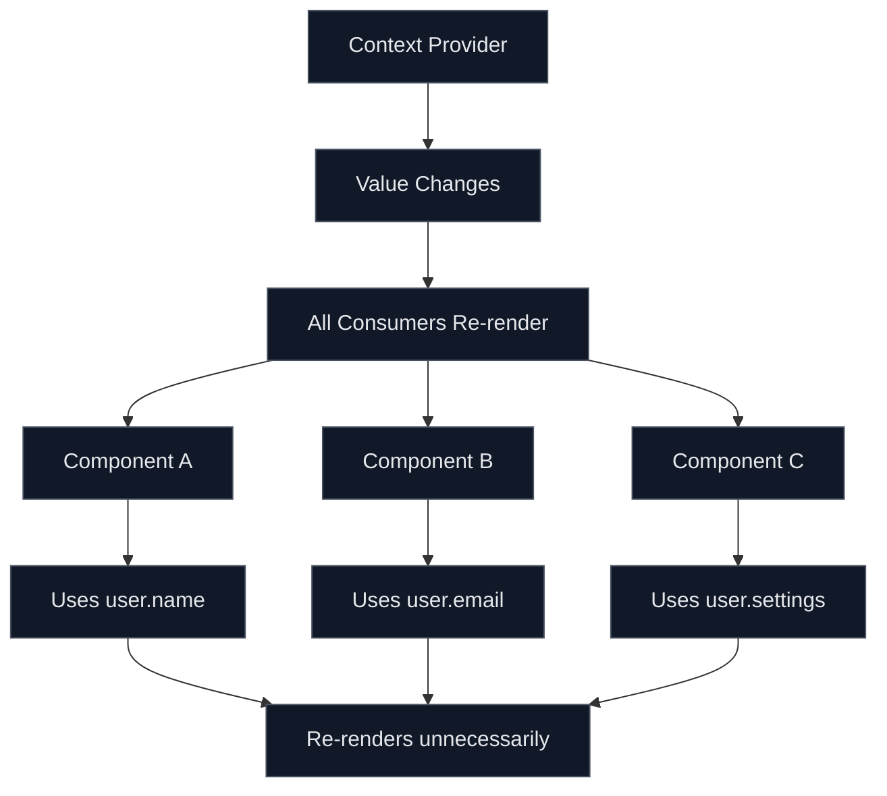
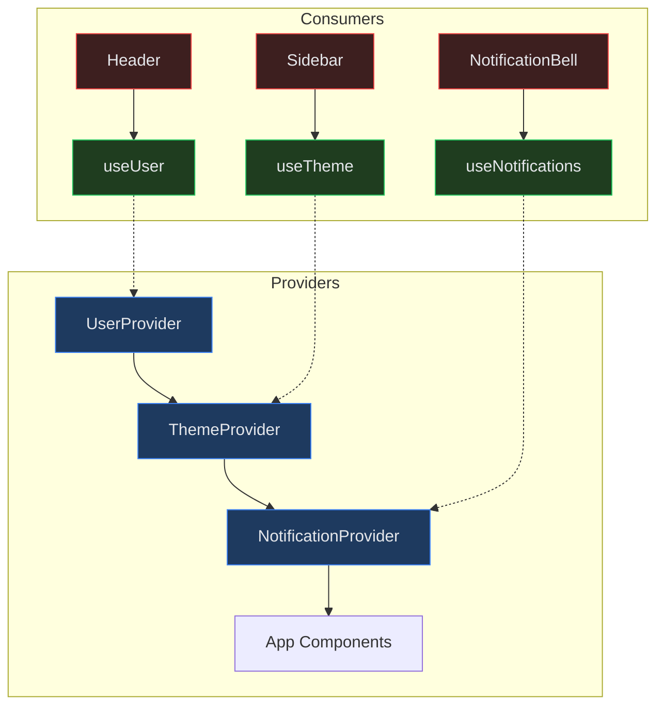
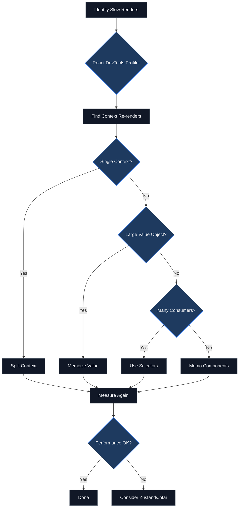

# How to Handle React Context Performance Issues

Author: [nawazdhandala](https://www.github.com/nawazdhandala)

Tags: React, Context API, Performance, State Management, Optimization, JavaScript, TypeScript

Description: A practical guide to identifying and fixing performance issues caused by React Context, including memoization strategies, context splitting, and alternative state management patterns.

---

React Context is a powerful tool for sharing state across components without prop drilling. However, improper use can lead to significant performance problems, causing unnecessary re-renders throughout your application. This guide covers how to identify and fix these issues.

## Understanding the Problem

When a Context value changes, all components that consume that context will re-render, even if they only use a small portion of the context value. This cascading effect can severely impact application performance.

## How Context Re-renders Work



## Common Performance Anti-patterns

### Problem 1: Inline Object Values

```tsx
// BAD: Creates new object on every render
function App() {
  const [user, setUser] = useState({ name: 'John', email: 'john@example.com' });
  const [theme, setTheme] = useState('dark');

  return (
    // This object is recreated on every render
    <AppContext.Provider value={{ user, theme, setUser, setTheme }}>
      <MainContent />
    </AppContext.Provider>
  );
}

// GOOD: Memoize the context value
function App() {
  const [user, setUser] = useState({ name: 'John', email: 'john@example.com' });
  const [theme, setTheme] = useState('dark');

  // Memoize the value to prevent unnecessary re-renders
  const contextValue = useMemo(
    () => ({ user, theme, setUser, setTheme }),
    [user, theme]
  );

  return (
    <AppContext.Provider value={contextValue}>
      <MainContent />
    </AppContext.Provider>
  );
}
```

### Problem 2: Single Monolithic Context

```tsx
// BAD: All consumers re-render when any value changes
const AppContext = createContext({
  user: null,
  theme: 'light',
  notifications: [],
  settings: {},
});

function Dashboard() {
  // This component re-renders when notifications change
  // even though it only uses theme
  const { theme } = useContext(AppContext);
  return <div className={theme}>Dashboard</div>;
}
```

## Solution 1: Split Context by Update Frequency

Separate your context into multiple smaller contexts based on how often data changes:

```tsx
// contexts/UserContext.tsx
import { createContext, useContext, useState, useMemo, ReactNode } from 'react';

interface User {
  id: string;
  name: string;
  email: string;
}

interface UserContextValue {
  user: User | null;
  setUser: (user: User | null) => void;
}

const UserContext = createContext<UserContextValue | undefined>(undefined);

export function UserProvider({ children }: { children: ReactNode }) {
  const [user, setUser] = useState<User | null>(null);

  const value = useMemo(() => ({ user, setUser }), [user]);

  return <UserContext.Provider value={value}>{children}</UserContext.Provider>;
}

export function useUser() {
  const context = useContext(UserContext);
  if (context === undefined) {
    throw new Error('useUser must be used within a UserProvider');
  }
  return context;
}
```

```tsx
// contexts/ThemeContext.tsx
import { createContext, useContext, useState, useMemo, ReactNode } from 'react';

type Theme = 'light' | 'dark';

interface ThemeContextValue {
  theme: Theme;
  toggleTheme: () => void;
}

const ThemeContext = createContext<ThemeContextValue | undefined>(undefined);

export function ThemeProvider({ children }: { children: ReactNode }) {
  const [theme, setTheme] = useState<Theme>('light');

  const value = useMemo(
    () => ({
      theme,
      toggleTheme: () => setTheme(t => (t === 'light' ? 'dark' : 'light')),
    }),
    [theme]
  );

  return <ThemeContext.Provider value={value}>{children}</ThemeContext.Provider>;
}

export function useTheme() {
  const context = useContext(ThemeContext);
  if (context === undefined) {
    throw new Error('useTheme must be used within a ThemeProvider');
  }
  return context;
}
```

## Context Architecture After Splitting



## Solution 2: Separate State and Dispatch Contexts

For complex state with reducers, separate the state from the dispatch function:

```tsx
// contexts/CartContext.tsx
import {
  createContext,
  useContext,
  useReducer,
  useMemo,
  ReactNode,
  Dispatch,
} from 'react';

// Types
interface CartItem {
  id: string;
  name: string;
  price: number;
  quantity: number;
}

interface CartState {
  items: CartItem[];
  total: number;
}

type CartAction =
  | { type: 'ADD_ITEM'; payload: CartItem }
  | { type: 'REMOVE_ITEM'; payload: string }
  | { type: 'UPDATE_QUANTITY'; payload: { id: string; quantity: number } }
  | { type: 'CLEAR_CART' };

// Reducer
function cartReducer(state: CartState, action: CartAction): CartState {
  switch (action.type) {
    case 'ADD_ITEM': {
      const existingItem = state.items.find(item => item.id === action.payload.id);
      if (existingItem) {
        const items = state.items.map(item =>
          item.id === action.payload.id
            ? { ...item, quantity: item.quantity + 1 }
            : item
        );
        return { items, total: calculateTotal(items) };
      }
      const items = [...state.items, { ...action.payload, quantity: 1 }];
      return { items, total: calculateTotal(items) };
    }
    case 'REMOVE_ITEM': {
      const items = state.items.filter(item => item.id !== action.payload);
      return { items, total: calculateTotal(items) };
    }
    case 'UPDATE_QUANTITY': {
      const items = state.items.map(item =>
        item.id === action.payload.id
          ? { ...item, quantity: action.payload.quantity }
          : item
      );
      return { items, total: calculateTotal(items) };
    }
    case 'CLEAR_CART':
      return { items: [], total: 0 };
    default:
      return state;
  }
}

function calculateTotal(items: CartItem[]): number {
  return items.reduce((sum, item) => sum + item.price * item.quantity, 0);
}

// Separate contexts
const CartStateContext = createContext<CartState | undefined>(undefined);
const CartDispatchContext = createContext<Dispatch<CartAction> | undefined>(undefined);

// Provider
export function CartProvider({ children }: { children: ReactNode }) {
  const [state, dispatch] = useReducer(cartReducer, { items: [], total: 0 });

  return (
    <CartStateContext.Provider value={state}>
      <CartDispatchContext.Provider value={dispatch}>
        {children}
      </CartDispatchContext.Provider>
    </CartStateContext.Provider>
  );
}

// Hooks
export function useCartState() {
  const context = useContext(CartStateContext);
  if (context === undefined) {
    throw new Error('useCartState must be used within a CartProvider');
  }
  return context;
}

export function useCartDispatch() {
  const context = useContext(CartDispatchContext);
  if (context === undefined) {
    throw new Error('useCartDispatch must be used within a CartProvider');
  }
  return context;
}

// Convenience hook that returns both
export function useCart() {
  return [useCartState(), useCartDispatch()] as const;
}
```

Now components that only dispatch actions will not re-render when state changes:

```tsx
// This component only re-renders when cart state changes
function CartSummary() {
  const { items, total } = useCartState();

  return (
    <div>
      <p>Items: {items.length}</p>
      <p>Total: ${total.toFixed(2)}</p>
    </div>
  );
}

// This component never re-renders due to cart state changes
function AddToCartButton({ product }: { product: Product }) {
  const dispatch = useCartDispatch();

  const handleClick = () => {
    dispatch({
      type: 'ADD_ITEM',
      payload: { id: product.id, name: product.name, price: product.price, quantity: 1 },
    });
  };

  return <button onClick={handleClick}>Add to Cart</button>;
}
```

## Solution 3: Use React.memo with Context Selectors

Create a selector pattern to prevent unnecessary re-renders:

```tsx
// hooks/useContextSelector.ts
import { useContext, useRef, useEffect, useState } from 'react';

export function useContextSelector<T, St>(
  Context: React.Context<T>,
  selector: (value: T) => St
): St {
  const contextValue = useContext(Context);
  const selectedValueRef = useRef<St>(selector(contextValue));
  const [, forceRender] = useState({});

  const selectedValue = selector(contextValue);

  useEffect(() => {
    if (!Object.is(selectedValueRef.current, selectedValue)) {
      selectedValueRef.current = selectedValue;
      forceRender({});
    }
  }, [selectedValue]);

  return selectedValue;
}
```

For a more robust solution, use the `use-context-selector` library:

```tsx
// Using use-context-selector library
import { createContext, useContextSelector } from 'use-context-selector';

const AppContext = createContext({
  user: { name: 'John', email: 'john@example.com' },
  theme: 'dark',
  notifications: [],
});

// Component only re-renders when user.name changes
function UserName() {
  const userName = useContextSelector(AppContext, ctx => ctx.user.name);
  return <span>{userName}</span>;
}

// Component only re-renders when theme changes
function ThemeDisplay() {
  const theme = useContextSelector(AppContext, ctx => ctx.theme);
  return <span>Current theme: {theme}</span>;
}
```

## Solution 4: Memoize Consumer Components

Wrap consuming components with React.memo:

```tsx
// components/UserProfile.tsx
import { memo } from 'react';
import { useUser } from '../contexts/UserContext';

interface UserProfileProps {
  showAvatar?: boolean;
}

export const UserProfile = memo(function UserProfile({ showAvatar = true }: UserProfileProps) {
  const { user } = useUser();

  if (!user) return null;

  return (
    <div className="user-profile">
      {showAvatar && }
      <span>{user.name}</span>
    </div>
  );
});
```

## Performance Optimization Flow



## Solution 5: Use External State Management for Complex Cases

When context optimization is not enough, consider using libraries designed for performance:

```tsx
// Using Zustand for performant state management
import { create } from 'zustand';

interface AppState {
  user: { name: string; email: string } | null;
  theme: 'light' | 'dark';
  notifications: string[];
  setUser: (user: AppState['user']) => void;
  toggleTheme: () => void;
  addNotification: (message: string) => void;
}

const useAppStore = create<AppState>((set) => ({
  user: null,
  theme: 'light',
  notifications: [],
  setUser: (user) => set({ user }),
  toggleTheme: () => set((state) => ({
    theme: state.theme === 'light' ? 'dark' : 'light'
  })),
  addNotification: (message) => set((state) => ({
    notifications: [...state.notifications, message],
  })),
}));

// Components only subscribe to what they need
function UserName() {
  // Only re-renders when user.name changes
  const userName = useAppStore((state) => state.user?.name);
  return <span>{userName}</span>;
}

function ThemeToggle() {
  // Only re-renders when theme changes
  const theme = useAppStore((state) => state.theme);
  const toggleTheme = useAppStore((state) => state.toggleTheme);

  return (
    <button onClick={toggleTheme}>
      Current: {theme}
    </button>
  );
}
```

## Debugging Context Performance

Use React DevTools Profiler to identify unnecessary re-renders:

```tsx
// Add this component to debug context re-renders
function ContextDebugger({ name }: { name: string }) {
  const renderCount = useRef(0);
  renderCount.current += 1;

  useEffect(() => {
    console.log(`${name} rendered ${renderCount.current} times`);
  });

  return null;
}

// Use in components
function Header() {
  const { user } = useUser();

  return (
    <header>
      <ContextDebugger name="Header" />
      <h1>Welcome, {user?.name}</h1>
    </header>
  );
}
```

## Quick Reference

| Problem | Solution |
|---------|----------|
| Inline context value | Wrap value in useMemo |
| Large context with mixed update frequencies | Split into multiple contexts |
| Components re-render but only use dispatch | Separate state and dispatch contexts |
| Many consumers need different slices | Use context selectors |
| Complex state with many updates | Consider Zustand or Jotai |

## Best Practices Summary

1. **Always memoize context values** using useMemo
2. **Split contexts** by update frequency and domain
3. **Separate state from dispatch** in reducer patterns
4. **Use React.memo** on context consumers
5. **Profile before optimizing** with React DevTools
6. **Consider alternatives** like Zustand for complex state

React Context is excellent for low-frequency updates like themes and authentication. For high-frequency updates or complex state, combine context optimizations with external state management libraries for the best performance.
