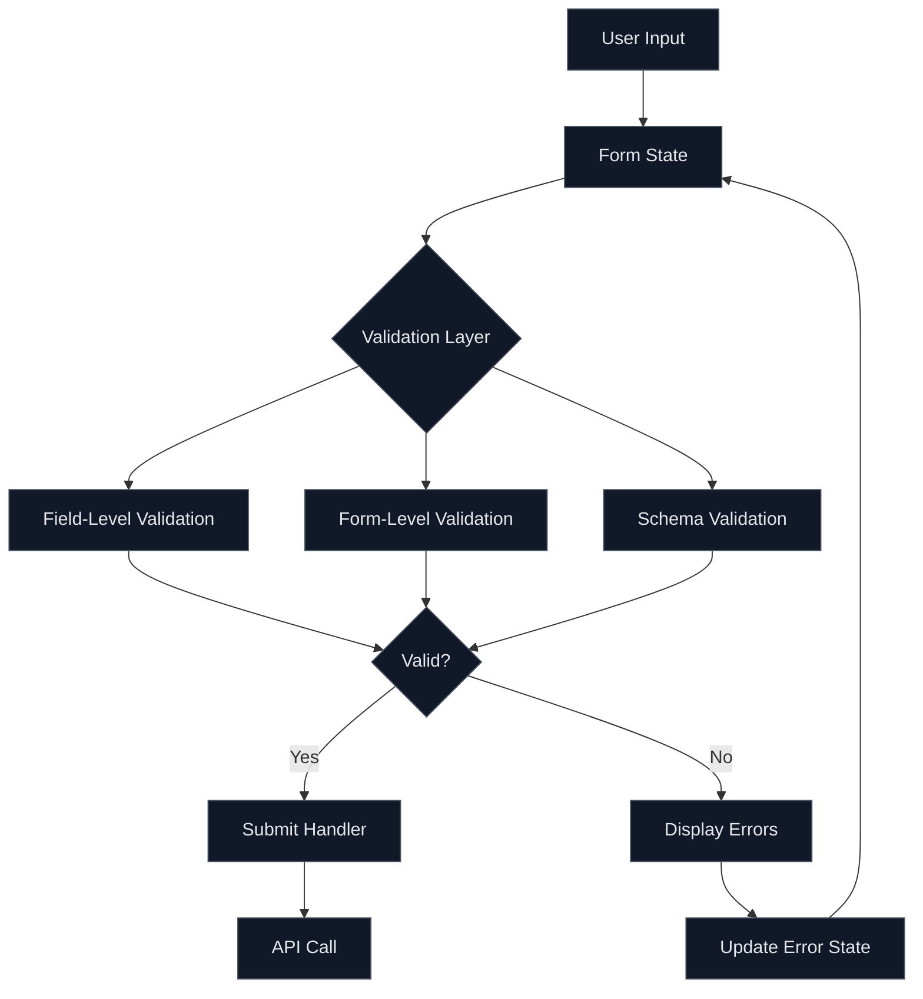
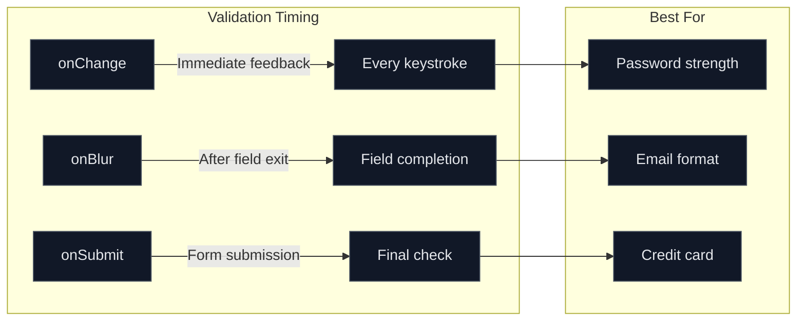

# How to Handle Form Validation in React

Author: [nawazdhandala](https://www.github.com/nawazdhandala)

Tags: React, Form Validation, JavaScript, TypeScript, Frontend, React Hook Form, Zod

Description: A comprehensive guide to implementing form validation in React using controlled components, React Hook Form, and Zod schema validation.

---

Form validation is essential for creating robust user interfaces. This guide covers multiple approaches to handling form validation in React, from basic controlled components to advanced libraries like React Hook Form with Zod.

## Validation Architecture

Understanding how validation flows through your React application:



## Basic Controlled Form Validation

Start with a simple controlled form approach:

```tsx
// components/BasicForm.tsx
import { useState, FormEvent, ChangeEvent } from 'react';

// Define the shape of form data
interface FormData {
  email: string;
  password: string;
  confirmPassword: string;
}

// Define the shape of form errors
interface FormErrors {
  email?: string;
  password?: string;
  confirmPassword?: string;
}

export function BasicForm() {
  // Initialize form state with empty values
  const [formData, setFormData] = useState<FormData>({
    email: '',
    password: '',
    confirmPassword: '',
  });

  // Track validation errors for each field
  const [errors, setErrors] = useState<FormErrors>({});

  // Track which fields have been touched (visited)
  const [touched, setTouched] = useState<Record<string, boolean>>({});

  // Validate a single field and return error message if invalid
  const validateField = (name: string, value: string): string | undefined => {
    switch (name) {
      case 'email':
        // Check if email is empty
        if (!value) {
          return 'Email is required';
        }
        // Validate email format using regex
        if (!/^[A-Z0-9._%+-]+@[A-Z0-9.-]+\.[A-Z]{2,}$/i.test(value)) {
          return 'Invalid email address';
        }
        break;

      case 'password':
        // Check if password is empty
        if (!value) {
          return 'Password is required';
        }
        // Enforce minimum length
        if (value.length < 8) {
          return 'Password must be at least 8 characters';
        }
        // Require at least one number
        if (!/\d/.test(value)) {
          return 'Password must contain at least one number';
        }
        // Require at least one uppercase letter
        if (!/[A-Z]/.test(value)) {
          return 'Password must contain at least one uppercase letter';
        }
        break;

      case 'confirmPassword':
        // Check if confirmation is empty
        if (!value) {
          return 'Please confirm your password';
        }
        // Ensure passwords match
        if (value !== formData.password) {
          return 'Passwords do not match';
        }
        break;
    }
    return undefined;
  };

  // Validate all fields and return combined errors object
  const validateForm = (): FormErrors => {
    const newErrors: FormErrors = {};

    // Iterate through each field and validate
    (Object.keys(formData) as Array<keyof FormData>).forEach((key) => {
      const error = validateField(key, formData[key]);
      if (error) {
        newErrors[key] = error;
      }
    });

    return newErrors;
  };

  // Handle input changes and perform real-time validation
  const handleChange = (e: ChangeEvent<HTMLInputElement>) => {
    const { name, value } = e.target;

    // Update form data state
    setFormData((prev) => ({ ...prev, [name]: value }));

    // Only validate if field has been touched
    if (touched[name]) {
      const error = validateField(name, value);
      setErrors((prev) => ({ ...prev, [name]: error }));
    }
  };

  // Mark field as touched when user leaves it
  const handleBlur = (e: ChangeEvent<HTMLInputElement>) => {
    const { name, value } = e.target;

    // Mark this field as touched
    setTouched((prev) => ({ ...prev, [name]: true }));

    // Validate the field on blur
    const error = validateField(name, value);
    setErrors((prev) => ({ ...prev, [name]: error }));
  };

  // Handle form submission
  const handleSubmit = (e: FormEvent) => {
    e.preventDefault();

    // Validate entire form before submitting
    const formErrors = validateForm();
    setErrors(formErrors);

    // Mark all fields as touched to show all errors
    const allTouched = Object.keys(formData).reduce(
      (acc, key) => ({ ...acc, [key]: true }),
      {}
    );
    setTouched(allTouched);

    // Only submit if no errors exist
    if (Object.keys(formErrors).length === 0) {
      console.log('Form submitted:', formData);
      // Proceed with API call or other submission logic
    }
  };

  return (
    <form onSubmit={handleSubmit} noValidate>
      <div className="form-group">
        <label htmlFor="email">Email</label>
        <input
          type="email"
          id="email"
          name="email"
          value={formData.email}
          onChange={handleChange}
          onBlur={handleBlur}
          className={errors.email && touched.email ? 'error' : ''}
          aria-describedby="email-error"
          aria-invalid={!!errors.email}
        />
        {/* Only show error if field has been touched */}
        {errors.email && touched.email && (
          <span id="email-error" className="error-message" role="alert">
            {errors.email}
          </span>
        )}
      </div>

      <div className="form-group">
        <label htmlFor="password">Password</label>
        <input
          type="password"
          id="password"
          name="password"
          value={formData.password}
          onChange={handleChange}
          onBlur={handleBlur}
          className={errors.password && touched.password ? 'error' : ''}
          aria-describedby="password-error"
          aria-invalid={!!errors.password}
        />
        {errors.password && touched.password && (
          <span id="password-error" className="error-message" role="alert">
            {errors.password}
          </span>
        )}
      </div>

      <div className="form-group">
        <label htmlFor="confirmPassword">Confirm Password</label>
        <input
          type="password"
          id="confirmPassword"
          name="confirmPassword"
          value={formData.confirmPassword}
          onChange={handleChange}
          onBlur={handleBlur}
          className={errors.confirmPassword && touched.confirmPassword ? 'error' : ''}
          aria-describedby="confirm-error"
          aria-invalid={!!errors.confirmPassword}
        />
        {errors.confirmPassword && touched.confirmPassword && (
          <span id="confirm-error" className="error-message" role="alert">
            {errors.confirmPassword}
          </span>
        )}
      </div>

      <button type="submit">Sign Up</button>
    </form>
  );
}
```

## React Hook Form with Zod Validation

For complex forms, use React Hook Form with Zod for type-safe schema validation:

```bash
# Install required packages
npm install react-hook-form zod @hookform/resolvers
```

```tsx
// components/AdvancedForm.tsx
import { useForm } from 'react-hook-form';
import { zodResolver } from '@hookform/resolvers/zod';
import { z } from 'zod';

// Define validation schema using Zod
// This creates both the validation rules and TypeScript types
const formSchema = z.object({
  // Email field with format validation
  email: z
    .string()
    .min(1, 'Email is required')
    .email('Invalid email address'),

  // Password with multiple validation rules
  password: z
    .string()
    .min(1, 'Password is required')
    .min(8, 'Password must be at least 8 characters')
    .regex(/[A-Z]/, 'Password must contain at least one uppercase letter')
    .regex(/[a-z]/, 'Password must contain at least one lowercase letter')
    .regex(/[0-9]/, 'Password must contain at least one number')
    .regex(/[^A-Za-z0-9]/, 'Password must contain at least one special character'),

  // Username with length constraints
  username: z
    .string()
    .min(1, 'Username is required')
    .min(3, 'Username must be at least 3 characters')
    .max(20, 'Username must be at most 20 characters')
    .regex(/^[a-zA-Z0-9_]+$/, 'Username can only contain letters, numbers, and underscores'),

  // Age with number validation
  age: z
    .number({ invalid_type_error: 'Age must be a number' })
    .min(18, 'You must be at least 18 years old')
    .max(120, 'Please enter a valid age'),

  // Website URL validation (optional field)
  website: z
    .string()
    .url('Please enter a valid URL')
    .optional()
    .or(z.literal('')),

  // Boolean field for terms acceptance
  acceptTerms: z
    .boolean()
    .refine((val) => val === true, 'You must accept the terms and conditions'),
});

// Infer TypeScript type from the Zod schema
type FormData = z.infer<typeof formSchema>;

export function AdvancedForm() {
  // Initialize React Hook Form with Zod resolver
  const {
    register,         // Register form inputs
    handleSubmit,     // Handle form submission
    formState: {
      errors,         // Validation errors
      isSubmitting,   // Submission state
    },
    reset,            // Reset form to initial values
    setError,         // Manually set errors (for server-side validation)
  } = useForm<FormData>({
    resolver: zodResolver(formSchema),
    mode: 'onBlur',   // Validate on blur
    defaultValues: {
      email: '',
      password: '',
      username: '',
      age: undefined,
      website: '',
      acceptTerms: false,
    },
  });

  // Form submission handler
  const onSubmit = async (data: FormData) => {
    try {
      // Simulate API call
      const response = await fetch('/api/register', {
        method: 'POST',
        headers: { 'Content-Type': 'application/json' },
        body: JSON.stringify(data),
      });

      if (!response.ok) {
        // Handle server-side validation errors
        const errorData = await response.json();

        // Set server-side errors on specific fields
        if (errorData.field) {
          setError(errorData.field, {
            type: 'server',
            message: errorData.message,
          });
        }
        return;
      }

      // Success - reset form and show success message
      reset();
      console.log('Registration successful!');
    } catch (error) {
      // Handle network or unexpected errors
      setError('root', {
        type: 'server',
        message: 'An unexpected error occurred. Please try again.',
      });
    }
  };

  return (
    <form onSubmit={handleSubmit(onSubmit)} noValidate>
      {/* Root-level error display */}
      {errors.root && (
        <div className="form-error-banner" role="alert">
          {errors.root.message}
        </div>
      )}

      <div className="form-group">
        <label htmlFor="email">Email *</label>
        <input
          type="email"
          id="email"
          {...register('email')}
          aria-invalid={!!errors.email}
          aria-describedby="email-error"
        />
        {errors.email && (
          <span id="email-error" className="error-message" role="alert">
            {errors.email.message}
          </span>
        )}
      </div>

      <div className="form-group">
        <label htmlFor="username">Username *</label>
        <input
          type="text"
          id="username"
          {...register('username')}
          aria-invalid={!!errors.username}
          aria-describedby="username-error"
        />
        {errors.username && (
          <span id="username-error" className="error-message" role="alert">
            {errors.username.message}
          </span>
        )}
      </div>

      <div className="form-group">
        <label htmlFor="password">Password *</label>
        <input
          type="password"
          id="password"
          {...register('password')}
          aria-invalid={!!errors.password}
          aria-describedby="password-error"
        />
        {errors.password && (
          <span id="password-error" className="error-message" role="alert">
            {errors.password.message}
          </span>
        )}
      </div>

      <div className="form-group">
        <label htmlFor="age">Age *</label>
        <input
          type="number"
          id="age"
          {...register('age', { valueAsNumber: true })}
          aria-invalid={!!errors.age}
          aria-describedby="age-error"
        />
        {errors.age && (
          <span id="age-error" className="error-message" role="alert">
            {errors.age.message}
          </span>
        )}
      </div>

      <div className="form-group">
        <label htmlFor="website">Website (optional)</label>
        <input
          type="url"
          id="website"
          {...register('website')}
          placeholder="https://example.com"
          aria-invalid={!!errors.website}
          aria-describedby="website-error"
        />
        {errors.website && (
          <span id="website-error" className="error-message" role="alert">
            {errors.website.message}
          </span>
        )}
      </div>

      <div className="form-group checkbox">
        <input
          type="checkbox"
          id="acceptTerms"
          {...register('acceptTerms')}
          aria-invalid={!!errors.acceptTerms}
          aria-describedby="terms-error"
        />
        <label htmlFor="acceptTerms">
          I accept the terms and conditions *
        </label>
        {errors.acceptTerms && (
          <span id="terms-error" className="error-message" role="alert">
            {errors.acceptTerms.message}
          </span>
        )}
      </div>

      <button
        type="submit"
        disabled={isSubmitting}
      >
        {isSubmitting ? 'Submitting...' : 'Register'}
      </button>
    </form>
  );
}
```

## Async Validation

Handle server-side validation for unique fields:

```tsx
// hooks/useAsyncValidation.ts
import { useState, useCallback, useRef } from 'react';

// Hook for async field validation
export function useAsyncValidation<T>(
  validateFn: (value: T) => Promise<string | null>,
  debounceMs: number = 300
) {
  const [isValidating, setIsValidating] = useState(false);
  const [error, setError] = useState<string | null>(null);
  const timeoutRef = useRef<NodeJS.Timeout | null>(null);

  const validate = useCallback(
    (value: T) => {
      // Clear existing timeout
      if (timeoutRef.current) {
        clearTimeout(timeoutRef.current);
      }

      // Debounce the validation
      timeoutRef.current = setTimeout(async () => {
        setIsValidating(true);
        try {
          const result = await validateFn(value);
          setError(result);
        } catch (err) {
          setError('Validation failed');
        } finally {
          setIsValidating(false);
        }
      }, debounceMs);
    },
    [validateFn, debounceMs]
  );

  return { isValidating, error, validate };
}
```

## Validation Strategies

Different validation timing options and when to use them:



## Best Practices

1. **Validate on blur for most fields** - Provides feedback without being intrusive
2. **Use onChange for password strength** - Shows real-time strength indicators
3. **Debounce async validations** - Reduce server load and improve performance
4. **Show validation state visually** - Use colors, icons, and clear error messages
5. **Support accessibility** - Use aria attributes and role="alert" for errors
6. **Validate both client and server side** - Never trust client-only validation
7. **Use schema validation libraries** - Zod provides type-safe validation with TypeScript

## Common Validation Patterns

| Field Type | Validation Pattern |
|------------|-------------------|
| Email | `/^[A-Z0-9._%+-]+@[A-Z0-9.-]+\.[A-Z]{2,}$/i` |
| Phone (US) | `/^\(\d{3}\) \d{3}-\d{4}$/` |
| URL | Use `new URL()` constructor |
| Credit Card | Luhn algorithm check |
| Password | Length + complexity rules |
| Username | Alphanumeric + underscore |

Form validation in React can be as simple or complex as your application requires. Start with controlled components for basic forms, and graduate to React Hook Form with Zod for complex, type-safe validation needs. The key is choosing the right approach for your specific use case while maintaining good user experience and accessibility.
