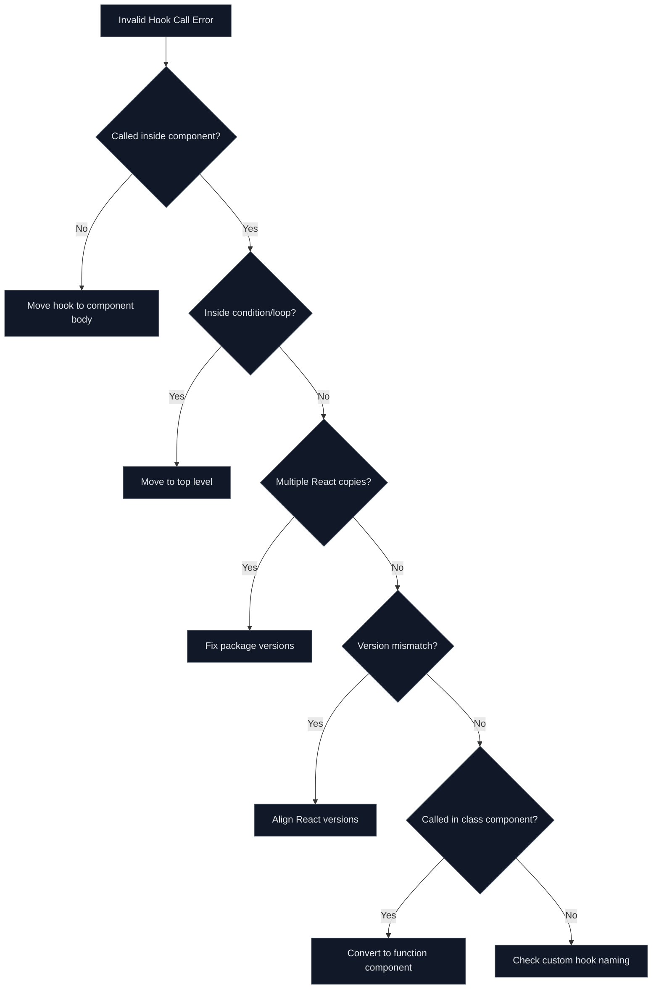

# How to Fix "Invalid Hook Call" Errors in React

Author: [nawazdhandala](https://www.github.com/nawazdhandala)

Tags: React, Hooks, JavaScript, TypeScript, Debugging, Error Handling, Frontend

Description: A comprehensive troubleshooting guide for fixing the "Invalid Hook Call" error in React, covering common causes and solutions with practical examples.

---

The "Invalid Hook Call" error is one of the most frustrating errors React developers encounter. This guide explains why it happens and provides systematic solutions to fix it.

## Understanding the Error

When you see this error, React is telling you that hooks are being called in a way that violates the Rules of Hooks:

```
Error: Invalid hook call. Hooks can only be called inside of the body of a function component.
This could happen for one of the following reasons:
1. You might have mismatching versions of React and the renderer (such as React DOM)
2. You might be breaking the Rules of Hooks
3. You might have more than one copy of React in the same app
```

## Error Diagnosis Flow

Follow this decision tree to identify your specific issue:



## Cause 1: Calling Hooks Outside Components

The most common cause is calling hooks outside of a React function component.

### Wrong: Hook Called Outside Component

```tsx
// WRONG: Hook called at module level
import { useState } from 'react';

// This will cause an error - hooks cannot be called outside components
const [count, setCount] = useState(0);

export function Counter() {
  return (
    <div>
      <p>Count: {count}</p>
      <button onClick={() => setCount(count + 1)}>Increment</button>
    </div>
  );
}
```

### Correct: Hook Inside Component

```tsx
// CORRECT: Hook called inside the function component body
import { useState } from 'react';

export function Counter() {
  // Hooks must be called at the top level of a function component
  const [count, setCount] = useState(0);

  return (
    <div>
      <p>Count: {count}</p>
      <button onClick={() => setCount(count + 1)}>Increment</button>
    </div>
  );
}
```

## Cause 2: Conditional Hook Calls

React requires hooks to be called in the same order on every render.

### Wrong: Hook Inside Condition

```tsx
// WRONG: Conditional hook call
import { useState, useEffect } from 'react';

interface UserProps {
  userId: string | null;
}

export function UserProfile({ userId }: UserProps) {
  // This violates Rules of Hooks - conditional hook call
  if (userId) {
    const [user, setUser] = useState(null);

    useEffect(() => {
      fetchUser(userId).then(setUser);
    }, [userId]);

    return <div>{user?.name}</div>;
  }

  return <div>No user selected</div>;
}
```

### Correct: Unconditional Hook with Conditional Logic

```tsx
// CORRECT: Hooks called unconditionally, logic inside
import { useState, useEffect } from 'react';

interface User {
  id: string;
  name: string;
  email: string;
}

interface UserProps {
  userId: string | null;
}

export function UserProfile({ userId }: UserProps) {
  // Always call hooks at the top level
  const [user, setUser] = useState<User | null>(null);
  const [loading, setLoading] = useState(false);
  const [error, setError] = useState<string | null>(null);

  // The conditional logic goes inside the hook
  useEffect(() => {
    // Early return if no userId - this is fine
    if (!userId) {
      setUser(null);
      return;
    }

    setLoading(true);
    setError(null);

    fetchUser(userId)
      .then((data) => {
        setUser(data);
        setLoading(false);
      })
      .catch((err) => {
        setError(err.message);
        setLoading(false);
      });
  }, [userId]);

  // Conditional rendering is fine - it happens after hooks
  if (!userId) {
    return <div>No user selected</div>;
  }

  if (loading) {
    return <div>Loading...</div>;
  }

  if (error) {
    return <div>Error: {error}</div>;
  }

  return <div>{user?.name}</div>;
}
```

## Cause 3: Hook Inside Loop

### Wrong: Hook in Loop

```tsx
// WRONG: Hook called inside a loop
import { useState } from 'react';

interface Item {
  id: string;
  name: string;
}

export function ItemList({ items }: { items: Item[] }) {
  // This will cause an error - hooks cannot be in loops
  const itemStates = items.map((item) => {
    const [expanded, setExpanded] = useState(false);
    return { item, expanded, setExpanded };
  });

  return (
    <ul>
      {itemStates.map(({ item, expanded, setExpanded }) => (
        <li key={item.id}>
          {item.name}
          <button onClick={() => setExpanded(!expanded)}>
            {expanded ? 'Collapse' : 'Expand'}
          </button>
        </li>
      ))}
    </ul>
  );
}
```

### Correct: Extract to Separate Component

```tsx
// CORRECT: Extract item logic to a separate component
import { useState } from 'react';

interface Item {
  id: string;
  name: string;
  description: string;
}

// Separate component that can have its own state
function ExpandableItem({ item }: { item: Item }) {
  // Each instance of this component has its own state
  const [expanded, setExpanded] = useState(false);

  return (
    <li>
      <div className="item-header">
        <span>{item.name}</span>
        <button onClick={() => setExpanded(!expanded)}>
          {expanded ? 'Collapse' : 'Expand'}
        </button>
      </div>
      {expanded && (
        <div className="item-content">
          {item.description}
        </div>
      )}
    </li>
  );
}

// Parent component renders the list
export function ItemList({ items }: { items: Item[] }) {
  return (
    <ul>
      {items.map((item) => (
        <ExpandableItem key={item.id} item={item} />
      ))}
    </ul>
  );
}
```

## Cause 4: Multiple React Copies

This often happens with npm/yarn linking or mismatched dependencies.

### Diagnosing Multiple React Copies

```bash
# Check for duplicate React packages
npm ls react

# Expected output (single version):
# my-app@1.0.0
# -- react@18.2.0

# Problematic output (multiple versions):
# my-app@1.0.0
# |-- react@18.2.0
# -- some-package@1.0.0
#    -- react@17.0.2
```

### Fixing Multiple React Copies

```json
// package.json - Add resolutions (Yarn) or overrides (npm)
{
  "name": "my-app",
  "version": "1.0.0",
  "dependencies": {
    "react": "^18.2.0",
    "react-dom": "^18.2.0"
  },
  "resolutions": {
    "react": "18.2.0",
    "react-dom": "18.2.0"
  },
  "overrides": {
    "react": "18.2.0",
    "react-dom": "18.2.0"
  }
}
```

```bash
# After updating package.json, reinstall dependencies
rm -rf node_modules package-lock.json
npm install
```

## Cause 5: Version Mismatch

React and ReactDOM must be the same version.

### Check Versions

```bash
# Check installed versions
npm ls react react-dom

# Should show matching versions:
# |-- react@18.2.0
# -- react-dom@18.2.0
```

### Fix Version Mismatch

```json
// package.json - Ensure versions match
{
  "dependencies": {
    "react": "^18.2.0",
    "react-dom": "^18.2.0"
  }
}
```

## Cause 6: Custom Hook Naming

Custom hooks must start with "use" to be recognized by React.

### Wrong: Incorrectly Named Custom Hook

```tsx
// WRONG: Custom hook without "use" prefix
import { useState, useEffect } from 'react';

// React does not recognize this as a hook
function fetchUserData(userId: string) {
  const [user, setUser] = useState(null);
  const [loading, setLoading] = useState(true);

  useEffect(() => {
    fetch(`/api/users/${userId}`)
      .then((res) => res.json())
      .then(setUser)
      .finally(() => setLoading(false));
  }, [userId]);

  return { user, loading };
}
```

### Correct: Properly Named Custom Hook

```tsx
// CORRECT: Custom hook with "use" prefix
import { useState, useEffect } from 'react';

interface User {
  id: string;
  name: string;
  email: string;
}

// Custom hooks MUST start with "use"
function useUserData(userId: string) {
  const [user, setUser] = useState<User | null>(null);
  const [loading, setLoading] = useState(true);
  const [error, setError] = useState<string | null>(null);

  useEffect(() => {
    let cancelled = false;

    setLoading(true);
    setError(null);

    fetch(`/api/users/${userId}`)
      .then((res) => {
        if (!res.ok) throw new Error('Failed to fetch user');
        return res.json();
      })
      .then((data) => {
        if (!cancelled) {
          setUser(data);
          setLoading(false);
        }
      })
      .catch((err) => {
        if (!cancelled) {
          setError(err.message);
          setLoading(false);
        }
      });

    return () => {
      cancelled = true;
    };
  }, [userId]);

  return { user, loading, error };
}

export function Profile({ userId }: { userId: string }) {
  // Now React properly tracks this as a hook
  const { user, loading, error } = useUserData(userId);

  if (loading) return <div>Loading...</div>;
  if (error) return <div>Error: {error}</div>;

  return <div>{user?.name}</div>;
}
```

## ESLint Configuration

Enable the React Hooks ESLint plugin to catch these errors at development time:

```bash
# Install the ESLint plugin
npm install -D eslint-plugin-react-hooks
```

```json
// .eslintrc.json
{
  "plugins": ["react-hooks"],
  "rules": {
    "react-hooks/rules-of-hooks": "error",
    "react-hooks/exhaustive-deps": "warn"
  }
}
```

## Quick Reference

| Error Cause | Solution |
|-------------|----------|
| Hook outside component | Move hook inside function component body |
| Conditional hook | Move condition inside hook, not around it |
| Hook in loop | Extract loop item to separate component |
| Multiple React copies | Use resolutions/overrides in package.json |
| Version mismatch | Align React and ReactDOM versions |
| Class component | Convert to function component |
| Wrong hook name | Prefix custom hooks with "use" |
| Hook in callback | Move state to component level |

The "Invalid Hook Call" error always comes down to violating one of the Rules of Hooks. By understanding these rules and following the patterns in this guide, you can quickly diagnose and fix these errors in your React applications.
