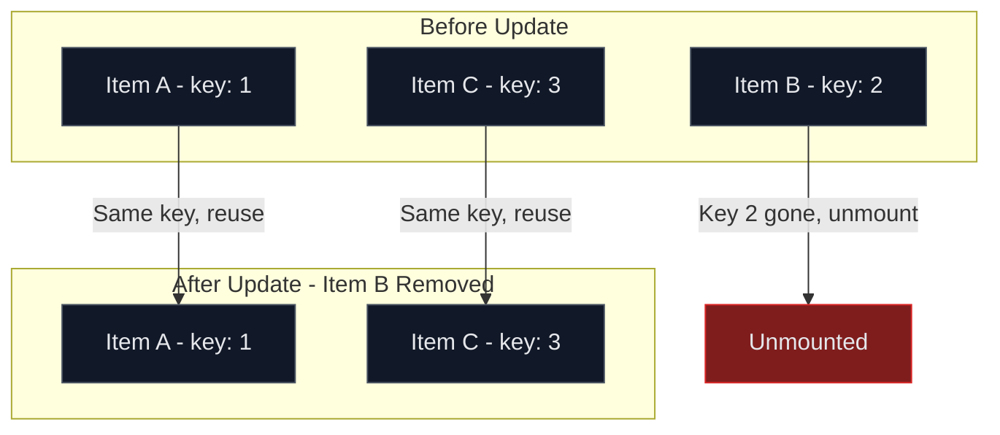
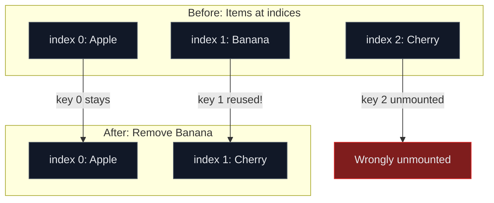
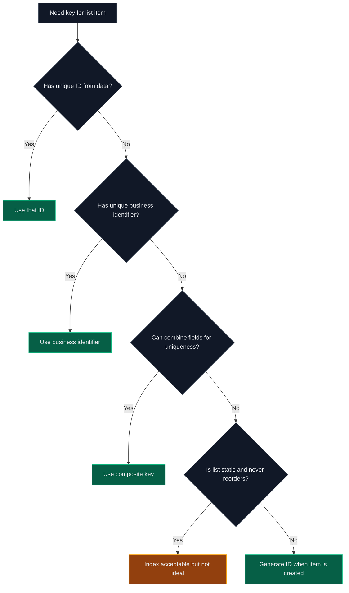

# How to Fix "Key Prop" Warnings in React Lists

Author: [nawazdhandala](https://www.github.com/nawazdhandala)

Tags: React, JavaScript, TypeScript, Performance, Lists, Frontend, Best Practices

Description: A practical guide to understanding and fixing the "key prop" warning in React, including proper key selection strategies and performance implications.

---

The "Each child in a list should have a unique key prop" warning is one of the most common React warnings. This guide explains why keys matter and how to choose them correctly.

## Understanding the Warning

When you see this warning in your console:

```
Warning: Each child in a list should have a unique "key" prop.
```

React is telling you that it cannot efficiently track list items during re-renders without unique identifiers.

## How React Uses Keys

Keys help React identify which items have changed, been added, or been removed:



## The Problem: Missing Keys

### Wrong: No Key Prop

```tsx
// WRONG: Missing key prop
interface Todo {
  id: number;
  text: string;
  completed: boolean;
}

function TodoList({ todos }: { todos: Todo[] }) {
  return (
    <ul>
      {todos.map((todo) => (
        // Warning: Each child in a list should have a unique "key" prop
        <li>
          <span>{todo.text}</span>
        </li>
      ))}
    </ul>
  );
}
```

### Correct: With Unique Key

```tsx
// CORRECT: Using unique id as key
interface Todo {
  id: number;
  text: string;
  completed: boolean;
}

function TodoList({ todos }: { todos: Todo[] }) {
  return (
    <ul>
      {todos.map((todo) => (
        // Use the unique id from your data
        <li key={todo.id}>
          <span>{todo.text}</span>
        </li>
      ))}
    </ul>
  );
}
```

## Key Selection Strategies

### Strategy 1: Use Database IDs (Best)

```tsx
// BEST: Use existing unique identifiers from your data
interface User {
  id: string;        // UUID from database
  name: string;
  email: string;
}

function UserList({ users }: { users: User[] }) {
  return (
    <ul>
      {users.map((user) => (
        // Database IDs are guaranteed unique and stable
        <li key={user.id}>
          <strong>{user.name}</strong>
          <span>{user.email}</span>
        </li>
      ))}
    </ul>
  );
}
```

### Strategy 2: Generate IDs When Creating Items

```tsx
// GOOD: Generate unique IDs when items are created
import { useState } from 'react';

interface Note {
  id: string;
  content: string;
  createdAt: Date;
}

// Helper function to generate unique IDs
function generateId(): string {
  return `${Date.now()}-${Math.random().toString(36).substr(2, 9)}`;
}

function NotesApp() {
  const [notes, setNotes] = useState<Note[]>([]);
  const [input, setInput] = useState('');

  const addNote = () => {
    if (!input.trim()) return;

    // Generate ID when creating the item
    const newNote: Note = {
      id: generateId(), // ID is assigned at creation time
      content: input,
      createdAt: new Date(),
    };

    setNotes((prev) => [...prev, newNote]);
    setInput('');
  };

  const deleteNote = (id: string) => {
    setNotes((prev) => prev.filter((note) => note.id !== id));
  };

  return (
    <div>
      <input
        value={input}
        onChange={(e) => setInput(e.target.value)}
        placeholder="Add a note"
      />
      <button onClick={addNote}>Add</button>

      <ul>
        {notes.map((note) => (
          <li key={note.id}>
            <span>{note.content}</span>
            <button onClick={() => deleteNote(note.id)}>Delete</button>
          </li>
        ))}
      </ul>
    </div>
  );
}
```

## Anti-Patterns to Avoid

### Anti-Pattern 1: Using Index as Key

```tsx
// BAD: Using array index as key
function BadList({ items }: { items: string[] }) {
  return (
    <ul>
      {items.map((item, index) => (
        // Index keys cause problems when list order changes
        <li key={index}>{item}</li>
      ))}
    </ul>
  );
}
```

Why index keys are problematic:



### When Index Keys Are Acceptable

Index keys are acceptable only when ALL of these conditions are true:

```tsx
// OK: Static list that never changes
const menuItems = ['Home', 'About', 'Contact'];

function StaticMenu() {
  return (
    <nav>
      {menuItems.map((item, index) => (
        // OK because: list never reorders, no additions/removals
        <a key={index} href={`/${item.toLowerCase()}`}>
          {item}
        </a>
      ))}
    </nav>
  );
}
```

### Anti-Pattern 2: Using Random Values

```tsx
// BAD: Generating random keys during render
function BadRandomKeys({ items }: { items: string[] }) {
  return (
    <ul>
      {items.map((item) => (
        // New random key every render - defeats the purpose
        <li key={Math.random()}>{item}</li>
      ))}
    </ul>
  );
}
```

## Composite Keys

When no single field is unique, combine multiple fields:

```tsx
// GOOD: Combine fields to create unique key
interface ScheduleItem {
  date: string;
  timeSlot: string;
  roomId: string;
  eventName: string;
}

function Schedule({ items }: { items: ScheduleItem[] }) {
  return (
    <table>
      <tbody>
        {items.map((item) => (
          // Combine date + timeSlot + roomId for uniqueness
          <tr key={`${item.date}-${item.timeSlot}-${item.roomId}`}>
            <td>{item.date}</td>
            <td>{item.timeSlot}</td>
            <td>{item.roomId}</td>
            <td>{item.eventName}</td>
          </tr>
        ))}
      </tbody>
    </table>
  );
}
```

## Nested Lists

Each list level needs its own keys:

```tsx
// CORRECT: Keys at each list level
interface Category {
  id: string;
  name: string;
  products: Product[];
}

interface Product {
  id: string;
  name: string;
  price: number;
}

function CategoryList({ categories }: { categories: Category[] }) {
  return (
    <div>
      {categories.map((category) => (
        // Key for outer list
        <section key={category.id}>
          <h2>{category.name}</h2>
          <ul>
            {category.products.map((product) => (
              // Key for inner list
              <li key={product.id}>
                {product.name} - ${product.price}
              </li>
            ))}
          </ul>
        </section>
      ))}
    </div>
  );
}
```

## Keys with Fragments

When using Fragments in lists, use the explicit syntax:

```tsx
import { Fragment } from 'react';

interface TableRow {
  id: string;
  name: string;
  details: string;
}

function DataTable({ rows }: { rows: TableRow[] }) {
  return (
    <table>
      <tbody>
        {rows.map((row) => (
          // Use Fragment with key, not shorthand <>
          <Fragment key={row.id}>
            <tr>
              <td colSpan={2}>{row.name}</td>
            </tr>
            <tr>
              <td colSpan={2}>{row.details}</td>
            </tr>
          </Fragment>
        ))}
      </tbody>
    </table>
  );
}
```

## Key Decision Flowchart

Use this to choose the right key strategy:



## Quick Reference

| Scenario | Key Strategy |
|----------|-------------|
| Database records | Use primary key / ID |
| API response items | Use ID from response |
| User-created items | Generate ID at creation |
| Static config lists | Index acceptable |
| Grouped data | Composite key from unique fields |
| Nested lists | Unique key per list level |

## Common Mistakes Summary

| Mistake | Problem | Solution |
|---------|---------|----------|
| No key | React cannot track items | Add unique key |
| Index as key | Wrong updates on reorder | Use stable unique ID |
| Random key | Component remounts every render | Use stable ID |
| Non-unique key | Duplicate key warnings | Ensure uniqueness |
| Key on wrong element | Key not on direct list child | Move key to mapped element |

Proper key usage is essential for React performance and correct behavior. Always prefer stable, unique identifiers from your data over generated or index-based keys. When in doubt, generate unique IDs at the point of data creation, not during rendering.
