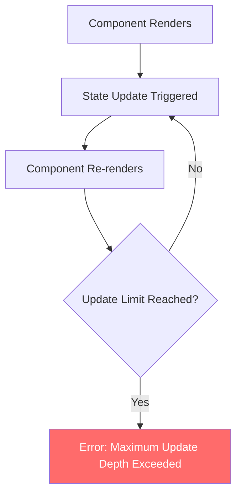
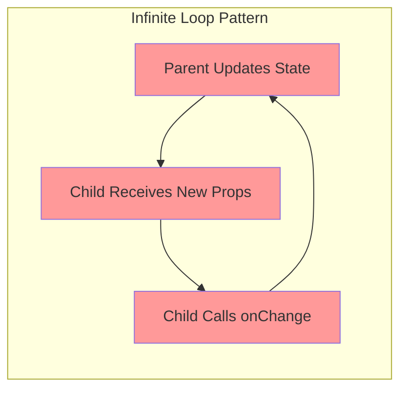
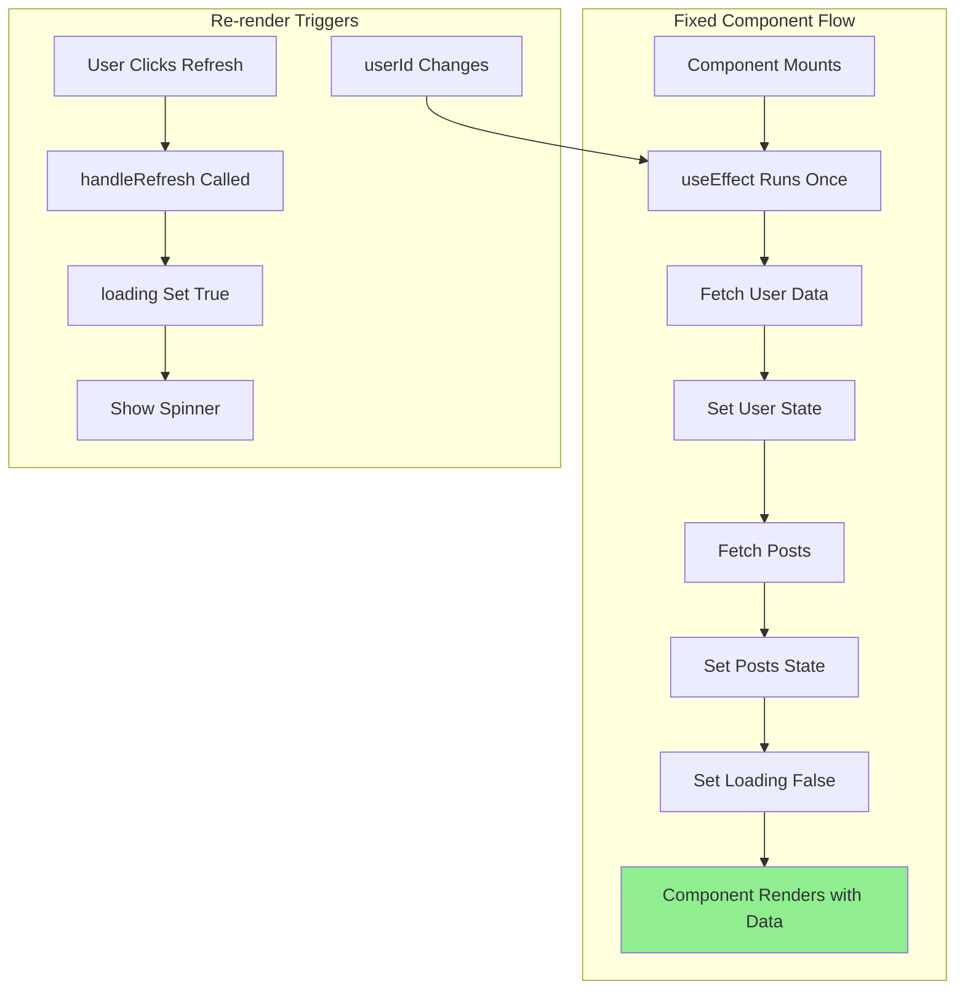

# How to Fix 'Maximum Update Depth' Errors in React

Author: [nawazdhandala](https://www.github.com/nawazdhandala)

Tags: React, JavaScript, Debugging, Frontend, Performance

Description: Learn how to identify, debug, and fix the 'Maximum update depth exceeded' error in React applications caused by infinite re-render loops.

---

The "Maximum update depth exceeded" error is one of the most common React errors developers encounter. It occurs when your component triggers an infinite loop of re-renders, causing React to bail out to prevent the browser from freezing. Understanding why this happens and how to fix it is essential for building stable React applications.

## Understanding the Error

When React detects that a component is updating itself repeatedly without stopping, it throws this error:

```
Error: Maximum update depth exceeded. This can happen when a component
calls setState inside useEffect, but useEffect either doesn't have a
dependency array, or one of the dependencies changes on every render.
```



## Common Causes and Solutions

### 1. Calling setState Directly in Render

The most basic mistake is calling a state setter function directly during render.

```jsx
// BAD: This causes infinite re-renders
function Counter() {
  const [count, setCount] = useState(0);

  // This runs on every render, triggering another render
  setCount(count + 1);

  return <div>{count}</div>;
}

// GOOD: Only update state in response to events
function Counter() {
  const [count, setCount] = useState(0);

  const increment = () => {
    setCount(count + 1);
  };

  return (
    <div>
      <p>{count}</p>
      <button onClick={increment}>Increment</button>
    </div>
  );
}
```

### 2. Incorrect Event Handler Syntax

A very common mistake is calling a function instead of passing a reference.

```jsx
// BAD: handleClick() is called immediately on every render
function Button() {
  const [clicked, setClicked] = useState(false);

  const handleClick = () => {
    setClicked(true);
  };

  // Wrong: This calls the function immediately
  return <button onClick={handleClick()}>Click me</button>;
}

// GOOD: Pass the function reference
function Button() {
  const [clicked, setClicked] = useState(false);

  const handleClick = () => {
    setClicked(true);
  };

  // Correct: This passes the function to be called later
  return <button onClick={handleClick}>Click me</button>;
}

// GOOD: For functions that need arguments, use an arrow function
function ItemList() {
  const [selectedId, setSelectedId] = useState(null);

  const items = [{ id: 1 }, { id: 2 }, { id: 3 }];

  return (
    <ul>
      {items.map(item => (
        <li key={item.id}>
          {/* Wrap in arrow function to pass arguments */}
          <button onClick={() => setSelectedId(item.id)}>
            Select {item.id}
          </button>
        </li>
      ))}
    </ul>
  );
}
```

### 3. useEffect Without Dependency Array

Missing or incorrect dependency arrays in useEffect can cause infinite loops.

```jsx
// BAD: No dependency array means this runs after every render
function UserProfile({ userId }) {
  const [user, setUser] = useState(null);

  useEffect(() => {
    fetchUser(userId).then(setUser);
  }); // Missing dependency array!

  return <div>{user?.name}</div>;
}

// BAD: Object in dependency array that changes every render
function SearchResults({ query }) {
  const [results, setResults] = useState([]);

  // This object is recreated on every render
  const options = { limit: 10, sort: 'date' };

  useEffect(() => {
    search(query, options).then(setResults);
  }, [query, options]); // options changes every render!

  return <ul>{results.map(r => <li key={r.id}>{r.title}</li>)}</ul>;
}

// GOOD: Proper dependency array
function UserProfile({ userId }) {
  const [user, setUser] = useState(null);

  useEffect(() => {
    fetchUser(userId).then(setUser);
  }, [userId]); // Only re-run when userId changes

  return <div>{user?.name}</div>;
}

// GOOD: Memoize objects used in dependencies
function SearchResults({ query }) {
  const [results, setResults] = useState([]);

  // Memoize the options object
  const options = useMemo(() => ({ limit: 10, sort: 'date' }), []);

  useEffect(() => {
    search(query, options).then(setResults);
  }, [query, options]);

  return <ul>{results.map(r => <li key={r.id}>{r.title}</li>)}</ul>;
}
```

### 4. State Updates Based on State in useEffect

Updating state based on the same state in useEffect creates a loop.

```jsx
// BAD: count is both read and written in the effect
function Counter() {
  const [count, setCount] = useState(0);

  useEffect(() => {
    // This creates an infinite loop
    setCount(count + 1);
  }, [count]); // count changes, effect runs, count changes...

  return <div>{count}</div>;
}

// GOOD: Use functional updates when you need previous state
function Counter() {
  const [count, setCount] = useState(0);

  useEffect(() => {
    const interval = setInterval(() => {
      // Functional update does not require count in dependencies
      setCount(prevCount => prevCount + 1);
    }, 1000);

    return () => clearInterval(interval);
  }, []); // Empty dependency array is now correct

  return <div>{count}</div>;
}
```

### 5. Parent-Child State Synchronization Issues

Bidirectional state updates between parent and child can cause loops.



```jsx
// BAD: Child immediately calls onChange when value changes
function Parent() {
  const [value, setValue] = useState('');

  return <Child value={value} onChange={setValue} />;
}

function Child({ value, onChange }) {
  useEffect(() => {
    // This runs every time value changes, calling onChange,
    // which changes value, which runs this effect...
    onChange(value.toUpperCase());
  }, [value, onChange]);

  return <input value={value} onChange={e => onChange(e.target.value)} />;
}

// GOOD: Transform in the parent or use local state
function Parent() {
  const [value, setValue] = useState('');

  const handleChange = (newValue) => {
    setValue(newValue.toUpperCase());
  };

  return <Child value={value} onChange={handleChange} />;
}

function Child({ value, onChange }) {
  return <input value={value} onChange={e => onChange(e.target.value)} />;
}

// GOOD: Use local state with controlled sync
function Child({ initialValue, onSave }) {
  const [localValue, setLocalValue] = useState(initialValue);

  // Only sync from parent when initialValue actually changes
  useEffect(() => {
    setLocalValue(initialValue);
  }, [initialValue]);

  const handleBlur = () => {
    onSave(localValue);
  };

  return (
    <input
      value={localValue}
      onChange={e => setLocalValue(e.target.value)}
      onBlur={handleBlur}
    />
  );
}
```

## Debugging Infinite Re-render Loops

### Using React DevTools

React DevTools has a profiler that can help identify components that render too frequently.

```jsx
// Add this to track renders during development
function useRenderCount(componentName) {
  const renderCount = useRef(0);

  useEffect(() => {
    renderCount.current += 1;
    console.log(`${componentName} rendered ${renderCount.current} times`);
  });
}

function MyComponent() {
  useRenderCount('MyComponent');
  // ... rest of component
}
```

### Tracking State Changes

```jsx
// Custom hook to log state changes
function useStateWithLogging(initialValue, name) {
  const [value, setValue] = useState(initialValue);

  const setValueWithLog = useCallback((newValue) => {
    console.log(`${name} changing from`, value, 'to', newValue);
    console.trace('State change triggered by:');
    setValue(newValue);
  }, [name, value]);

  return [value, setValueWithLog];
}

// Usage
function DebugComponent() {
  const [count, setCount] = useStateWithLogging(0, 'count');

  // Now you will see logs whenever count changes
  return <button onClick={() => setCount(count + 1)}>{count}</button>;
}
```

### Using the why-did-you-render Library

```jsx
// Install: npm install @welldone-software/why-did-you-render

// wdyr.js - Import this before React
import React from 'react';

if (process.env.NODE_ENV === 'development') {
  const whyDidYouRender = require('@welldone-software/why-did-you-render');
  whyDidYouRender(React, {
    trackAllPureComponents: true,
    logOnDifferentValues: true,
  });
}

// In your component file
function ProblematicComponent(props) {
  // Component code
}

// Enable tracking for this component
ProblematicComponent.whyDidYouRender = true;

export default ProblematicComponent;
```

## Prevention Patterns

### Use useCallback for Event Handlers

```jsx
function SearchForm({ onSearch }) {
  const [query, setQuery] = useState('');

  // Memoize the handler to prevent child re-renders
  const handleSubmit = useCallback((e) => {
    e.preventDefault();
    onSearch(query);
  }, [query, onSearch]);

  const handleChange = useCallback((e) => {
    setQuery(e.target.value);
  }, []);

  return (
    <form onSubmit={handleSubmit}>
      <input value={query} onChange={handleChange} />
      <button type="submit">Search</button>
    </form>
  );
}
```

### Use useMemo for Expensive Computations

```jsx
function DataTable({ data, filters }) {
  // Memoize filtered data to prevent recalculation
  const filteredData = useMemo(() => {
    return data.filter(item => {
      return Object.entries(filters).every(([key, value]) => {
        return item[key] === value;
      });
    });
  }, [data, filters]);

  return (
    <table>
      <tbody>
        {filteredData.map(item => (
          <tr key={item.id}>
            <td>{item.name}</td>
          </tr>
        ))}
      </tbody>
    </table>
  );
}
```

### ESLint Rules for Prevention

Configure ESLint to catch common mistakes.

```json
{
  "plugins": ["react-hooks"],
  "rules": {
    "react-hooks/rules-of-hooks": "error",
    "react-hooks/exhaustive-deps": "warn"
  }
}
```

## Complete Example: Fixing a Real-World Loop

Here is a complete example showing a component with multiple issues and how to fix them.

```jsx
// BEFORE: Multiple issues causing infinite loops
function UserDashboard({ userId }) {
  const [user, setUser] = useState(null);
  const [posts, setPosts] = useState([]);
  const [loading, setLoading] = useState(true);

  // Issue 1: Object recreated every render
  const fetchOptions = { includeDeleted: false };

  // Issue 2: Missing and incorrect dependencies
  useEffect(() => {
    setLoading(true);
    fetchUser(userId, fetchOptions).then(userData => {
      setUser(userData);
      // Issue 3: Nested state update can cause issues
      fetchPosts(userData.id).then(setPosts);
      setLoading(false);
    });
  }, [fetchOptions]); // userId missing, fetchOptions changes every render

  // Issue 4: Calling function in render
  const handleRefresh = () => {
    setLoading(true);
  };

  if (loading) return <Spinner onClick={handleRefresh()} />;

  return (
    <div>
      <h1>{user?.name}</h1>
      <PostList posts={posts} />
    </div>
  );
}

// AFTER: All issues fixed
function UserDashboard({ userId }) {
  const [user, setUser] = useState(null);
  const [posts, setPosts] = useState([]);
  const [loading, setLoading] = useState(true);

  // Fix 1: Memoize the options object
  const fetchOptions = useMemo(() => ({ includeDeleted: false }), []);

  // Fix 2: Proper dependency array
  useEffect(() => {
    let cancelled = false;

    async function loadData() {
      setLoading(true);

      try {
        const userData = await fetchUser(userId, fetchOptions);

        if (cancelled) return;

        setUser(userData);

        const userPosts = await fetchPosts(userData.id);

        if (cancelled) return;

        setPosts(userPosts);
      } finally {
        if (!cancelled) {
          setLoading(false);
        }
      }
    }

    loadData();

    // Cleanup function to prevent state updates after unmount
    return () => {
      cancelled = true;
    };
  }, [userId, fetchOptions]); // Correct dependencies

  // Fix 4: Memoize handler and pass reference correctly
  const handleRefresh = useCallback(() => {
    setLoading(true);
  }, []);

  if (loading) {
    // Fix: Pass function reference, not function call
    return <Spinner onClick={handleRefresh} />;
  }

  return (
    <div>
      <h1>{user?.name}</h1>
      <PostList posts={posts} />
    </div>
  );
}
```



## Summary

The "Maximum update depth exceeded" error always indicates an infinite loop in your component. Common causes include:

1. Calling setState directly in the render body
2. Using `onClick={handler()}` instead of `onClick={handler}`
3. Missing or incorrect useEffect dependency arrays
4. Objects or arrays in dependencies that are recreated each render
5. Circular state updates between parent and child components

To prevent these issues:

- Always use dependency arrays in useEffect
- Use useMemo for objects and useCallback for functions in dependencies
- Use functional state updates when the new state depends on previous state
- Configure ESLint with react-hooks rules
- Use React DevTools and logging hooks to debug render loops

By understanding these patterns and applying the fixes consistently, you can eliminate infinite re-render loops from your React applications.
