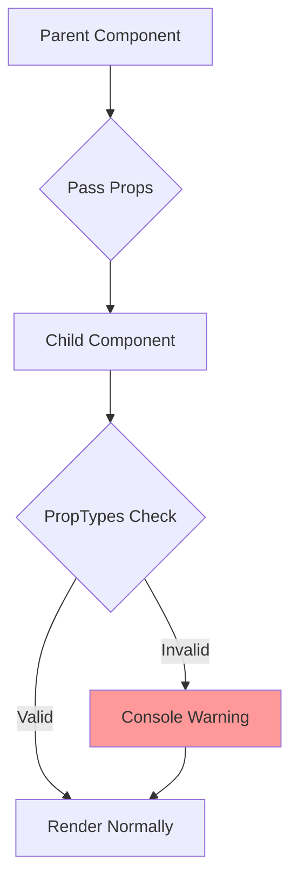
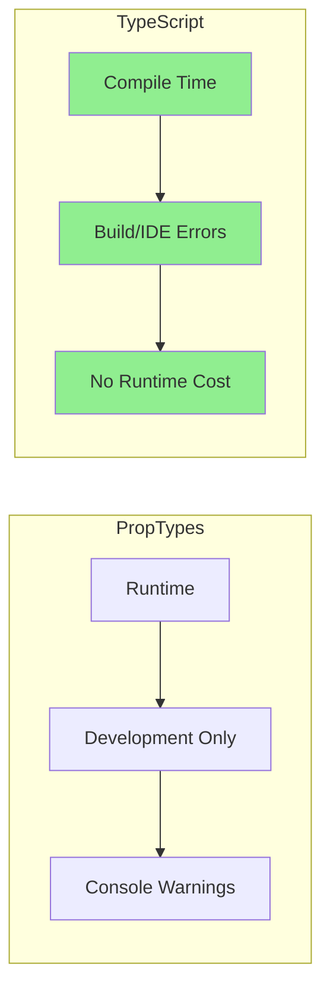
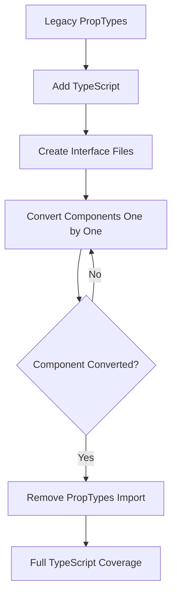

# How to Fix 'Prop Type Validation' Errors in React

Author: [nawazdhandala](https://www.github.com/nawazdhandala)

Tags: React, JavaScript, TypeScript, PropTypes, Debugging, Type Safety

Description: Learn how to identify and fix prop type validation errors in React using PropTypes and TypeScript for better type safety and debugging.

---

Prop type validation errors occur when components receive props that do not match their expected types. These warnings help catch bugs early during development by alerting you when data flows incorrectly through your component tree. This guide covers how to fix these errors using both PropTypes and TypeScript.

## Understanding Prop Type Errors

When React detects a prop type mismatch, it logs a warning to the console:

```
Warning: Failed prop type: Invalid prop `count` of type `string`
supplied to `Counter`, expected `number`.
```



## Using PropTypes

### Installation

```bash
npm install prop-types
```

### Basic PropTypes Usage

```jsx
import PropTypes from 'prop-types';

function UserCard({ name, age, email, isActive }) {
  return (
    <div className={`card ${isActive ? 'active' : ''}`}>
      <h2>{name}</h2>
      <p>Age: {age}</p>
      <p>Email: {email}</p>
    </div>
  );
}

UserCard.propTypes = {
  name: PropTypes.string.isRequired,
  age: PropTypes.number.isRequired,
  email: PropTypes.string.isRequired,
  isActive: PropTypes.bool,
};

UserCard.defaultProps = {
  isActive: false,
};

export default UserCard;
```

### Available PropTypes

```jsx
import PropTypes from 'prop-types';

Component.propTypes = {
  // Primitive types
  stringProp: PropTypes.string,
  numberProp: PropTypes.number,
  boolProp: PropTypes.bool,
  funcProp: PropTypes.func,
  symbolProp: PropTypes.symbol,

  // Required props
  requiredString: PropTypes.string.isRequired,
  requiredNumber: PropTypes.number.isRequired,

  // Objects and arrays
  arrayProp: PropTypes.array,
  objectProp: PropTypes.object,

  // Typed arrays
  stringArray: PropTypes.arrayOf(PropTypes.string),
  numberArray: PropTypes.arrayOf(PropTypes.number),

  // Object with specific shape
  userProp: PropTypes.shape({
    id: PropTypes.number.isRequired,
    name: PropTypes.string.isRequired,
    email: PropTypes.string,
  }),

  // Exact shape (no extra properties allowed)
  exactUser: PropTypes.exact({
    id: PropTypes.number.isRequired,
    name: PropTypes.string.isRequired,
  }),

  // Object with typed values
  scores: PropTypes.objectOf(PropTypes.number),

  // One of specific values
  status: PropTypes.oneOf(['pending', 'active', 'inactive']),

  // One of specific types
  content: PropTypes.oneOfType([
    PropTypes.string,
    PropTypes.number,
    PropTypes.element,
  ]),

  // React elements
  children: PropTypes.node, // Anything renderable
  element: PropTypes.element, // React element
  elementType: PropTypes.elementType, // Component type

  // Instance of a class
  date: PropTypes.instanceOf(Date),

  // Any type (not recommended)
  anything: PropTypes.any,
};
```

### Custom PropType Validators

```jsx
// Custom validator function
function ageValidator(props, propName, componentName) {
  const value = props[propName];

  if (value === undefined) {
    return null; // Optional prop, no error
  }

  if (typeof value !== 'number') {
    return new Error(
      `Invalid prop \`${propName}\` supplied to \`${componentName}\`. ` +
      `Expected a number, got ${typeof value}.`
    );
  }

  if (value < 0 || value > 150) {
    return new Error(
      `Invalid prop \`${propName}\` supplied to \`${componentName}\`. ` +
      `Age must be between 0 and 150, got ${value}.`
    );
  }

  return null;
}

// Custom validator for arrays
function nonEmptyArrayValidator(props, propName, componentName) {
  const value = props[propName];

  if (!Array.isArray(value)) {
    return new Error(
      `Invalid prop \`${propName}\` supplied to \`${componentName}\`. ` +
      `Expected an array.`
    );
  }

  if (value.length === 0) {
    return new Error(
      `Invalid prop \`${propName}\` supplied to \`${componentName}\`. ` +
      `Array must not be empty.`
    );
  }

  return null;
}

function PersonForm({ age, items }) {
  // component code
}

PersonForm.propTypes = {
  age: ageValidator,
  items: nonEmptyArrayValidator,
};
```

## Common PropType Errors and Fixes

### Error 1: Type Mismatch

```jsx
// Error: Expected number, received string
<Counter count="5" />

// Fix: Pass the correct type
<Counter count={5} />

// Or convert in the parent
<Counter count={parseInt(userInput, 10)} />
```

### Error 2: Missing Required Prop

```jsx
// Error: Required prop `title` was not specified
function Article({ title, body }) {
  return (
    <article>
      <h1>{title}</h1>
      <p>{body}</p>
    </article>
  );
}

Article.propTypes = {
  title: PropTypes.string.isRequired,
  body: PropTypes.string.isRequired,
};

// Usage without required prop
<Article body="Some content" /> // Warning!

// Fix: Always pass required props
<Article title="My Article" body="Some content" />

// Or provide a default value (but then remove isRequired)
Article.propTypes = {
  title: PropTypes.string,
  body: PropTypes.string.isRequired,
};

Article.defaultProps = {
  title: 'Untitled',
};
```

### Error 3: Wrong Object Shape

```jsx
// Error: Invalid prop `user.id` of type `string`, expected `number`
function UserProfile({ user }) {
  return <div>{user.name} (ID: {user.id})</div>;
}

UserProfile.propTypes = {
  user: PropTypes.shape({
    id: PropTypes.number.isRequired,
    name: PropTypes.string.isRequired,
  }).isRequired,
};

// Wrong usage
<UserProfile user={{ id: "123", name: "John" }} />

// Fix: Ensure correct types
<UserProfile user={{ id: 123, name: "John" }} />

// Or fix at the data source
const user = {
  id: Number(rawUser.id),
  name: rawUser.name,
};
```

### Error 4: Invalid Array Elements

```jsx
// Error: Invalid prop `items[2]` of type `string`, expected `number`
function ScoreList({ scores }) {
  return (
    <ul>
      {scores.map((score, i) => (
        <li key={i}>{score}</li>
      ))}
    </ul>
  );
}

ScoreList.propTypes = {
  scores: PropTypes.arrayOf(PropTypes.number).isRequired,
};

// Wrong usage
<ScoreList scores={[10, 20, "30", 40]} />

// Fix: Ensure all elements are numbers
<ScoreList scores={[10, 20, 30, 40]} />

// Or filter/transform the data
const cleanedScores = rawScores
  .map(Number)
  .filter(n => !isNaN(n));
```

### Error 5: Invalid Children Type

```jsx
// Error: Invalid prop `children` of type `array`, expected single element
function Modal({ children }) {
  return <div className="modal">{children}</div>;
}

Modal.propTypes = {
  children: PropTypes.element.isRequired,
};

// Wrong usage
<Modal>
  <h1>Title</h1>
  <p>Content</p>
</Modal>

// Fix 1: Wrap in a single element
<Modal>
  <div>
    <h1>Title</h1>
    <p>Content</p>
  </div>
</Modal>

// Fix 2: Change propTypes to accept multiple children
Modal.propTypes = {
  children: PropTypes.node.isRequired,
};
```

## Migrating to TypeScript

TypeScript provides compile-time type checking, catching errors before runtime.



### Basic TypeScript Props

```tsx
// Define props interface
interface UserCardProps {
  name: string;
  age: number;
  email: string;
  isActive?: boolean; // Optional prop
}

function UserCard({ name, age, email, isActive = false }: UserCardProps) {
  return (
    <div className={`card ${isActive ? 'active' : ''}`}>
      <h2>{name}</h2>
      <p>Age: {age}</p>
      <p>Email: {email}</p>
    </div>
  );
}

export default UserCard;
```

### Common TypeScript Patterns

```tsx
import { ReactNode, FC, ComponentType } from 'react';

// Props with children
interface ContainerProps {
  children: ReactNode;
  className?: string;
}

function Container({ children, className }: ContainerProps) {
  return <div className={className}>{children}</div>;
}

// Props with event handlers
interface ButtonProps {
  label: string;
  onClick: () => void;
  disabled?: boolean;
}

function Button({ label, onClick, disabled = false }: ButtonProps) {
  return (
    <button onClick={onClick} disabled={disabled}>
      {label}
    </button>
  );
}

// Props with generic types
interface ListProps<T> {
  items: T[];
  renderItem: (item: T, index: number) => ReactNode;
  keyExtractor: (item: T) => string | number;
}

function List<T>({ items, renderItem, keyExtractor }: ListProps<T>) {
  return (
    <ul>
      {items.map((item, index) => (
        <li key={keyExtractor(item)}>{renderItem(item, index)}</li>
      ))}
    </ul>
  );
}

// Usage
interface User {
  id: number;
  name: string;
}

<List<User>
  items={users}
  renderItem={(user) => <span>{user.name}</span>}
  keyExtractor={(user) => user.id}
/>
```

### TypeScript Utility Types for Props

```tsx
import { ComponentProps, HTMLAttributes } from 'react';

// Extend HTML element props
interface CustomInputProps extends HTMLAttributes<HTMLInputElement> {
  label: string;
  error?: string;
}

function CustomInput({ label, error, ...inputProps }: CustomInputProps) {
  return (
    <div>
      <label>{label}</label>
      <input {...inputProps} />
      {error && <span className="error">{error}</span>}
    </div>
  );
}

// Get props from existing component
type ButtonProps = ComponentProps<typeof Button>;

// Pick specific props
interface UserDisplayProps {
  user: Pick<User, 'name' | 'email'>;
}

// Omit specific props
interface UserFormProps {
  initialData: Omit<User, 'id' | 'createdAt'>;
}

// Partial props (all optional)
interface UpdateUserProps {
  updates: Partial<User>;
}

// Required props (all required)
interface CreateUserProps {
  data: Required<User>;
}
```

### Discriminated Unions for Complex Props

```tsx
// Different props based on variant
interface BaseButtonProps {
  size?: 'small' | 'medium' | 'large';
  disabled?: boolean;
}

interface LinkButtonProps extends BaseButtonProps {
  variant: 'link';
  href: string;
  target?: '_blank' | '_self';
}

interface ActionButtonProps extends BaseButtonProps {
  variant: 'primary' | 'secondary' | 'danger';
  onClick: () => void;
}

type ButtonProps = LinkButtonProps | ActionButtonProps;

function Button(props: ButtonProps) {
  if (props.variant === 'link') {
    // TypeScript knows this is LinkButtonProps
    const { href, target, size, disabled } = props;
    return (
      <a href={href} target={target} className={`btn btn-${size}`}>
        Link
      </a>
    );
  }

  // TypeScript knows this is ActionButtonProps
  const { onClick, variant, size, disabled } = props;
  return (
    <button
      onClick={onClick}
      disabled={disabled}
      className={`btn btn-${variant} btn-${size}`}
    >
      Button
    </button>
  );
}

// Usage
<Button variant="link" href="/about" />
<Button variant="primary" onClick={() => console.log('clicked')} />
```

## Debugging Prop Type Errors

### 1. Use React DevTools

React DevTools shows prop values in real-time, making it easy to identify type mismatches.

```jsx
// Add display name for better debugging
function MyComponent(props) {
  // ...
}
MyComponent.displayName = 'MyComponent';
```

### 2. Add Runtime Logging

```jsx
function withPropLogging(Component) {
  return function LoggedComponent(props) {
    console.log(`${Component.name} received props:`, props);
    console.log('Prop types:', Object.entries(props).map(([key, value]) =>
      `${key}: ${typeof value}`
    ));
    return <Component {...props} />;
  };
}

// Usage
const LoggedUserCard = withPropLogging(UserCard);
```

### 3. Strict Prop Checking

```jsx
// Wrapper to make all props required during development
function strictProps(propTypes) {
  if (process.env.NODE_ENV !== 'development') {
    return propTypes;
  }

  return Object.fromEntries(
    Object.entries(propTypes).map(([key, validator]) => [
      key,
      (props, propName, componentName, ...rest) => {
        if (props[propName] === undefined) {
          return new Error(
            `Prop \`${propName}\` is undefined in \`${componentName}\`. ` +
            `All props should be explicitly passed in strict mode.`
          );
        }
        return validator(props, propName, componentName, ...rest);
      },
    ])
  );
}

UserCard.propTypes = strictProps({
  name: PropTypes.string,
  age: PropTypes.number,
});
```

## ESLint Rules for Prop Validation

```json
{
  "plugins": ["react"],
  "rules": {
    "react/prop-types": "error",
    "react/require-default-props": "error",
    "react/no-unused-prop-types": "error",
    "react/forbid-prop-types": ["error", {
      "forbid": ["any", "array", "object"],
      "checkContextTypes": true,
      "checkChildContextTypes": true
    }]
  }
}
```

For TypeScript projects:

```json
{
  "extends": [
    "plugin:@typescript-eslint/recommended"
  ],
  "rules": {
    "@typescript-eslint/explicit-function-return-type": "off",
    "@typescript-eslint/no-explicit-any": "error"
  }
}
```

## Migration Strategy



### Gradual Migration

```tsx
// Step 1: Add types alongside PropTypes
import PropTypes from 'prop-types';

interface UserCardProps {
  name: string;
  age: number;
  email: string;
  isActive?: boolean;
}

function UserCard({ name, age, email, isActive = false }: UserCardProps) {
  return (
    <div className={`card ${isActive ? 'active' : ''}`}>
      <h2>{name}</h2>
      <p>Age: {age}</p>
      <p>Email: {email}</p>
    </div>
  );
}

// Keep PropTypes during migration for runtime checks
UserCard.propTypes = {
  name: PropTypes.string.isRequired,
  age: PropTypes.number.isRequired,
  email: PropTypes.string.isRequired,
  isActive: PropTypes.bool,
};

export default UserCard;

// Step 2: Remove PropTypes once TypeScript is fully adopted
// Simply delete the propTypes definition
```

## Summary

Prop type validation errors help catch data flow issues early. Here is a quick reference:

| Approach | Pros | Cons |
|----------|------|------|
| **PropTypes** | Runtime validation, no build step | Development only, runtime cost |
| **TypeScript** | Compile-time checks, IDE support | Build step required, learning curve |
| **Both** | Maximum safety | More code to maintain |

Key practices:

1. Always define prop types for reusable components
2. Use specific types rather than `any` or `object`
3. Mark required props explicitly
4. Provide sensible default values
5. Consider migrating to TypeScript for better tooling
6. Use ESLint to enforce prop type rules
7. Test components with edge case prop values

By following these practices, you will catch prop-related bugs early and create more maintainable React applications.
