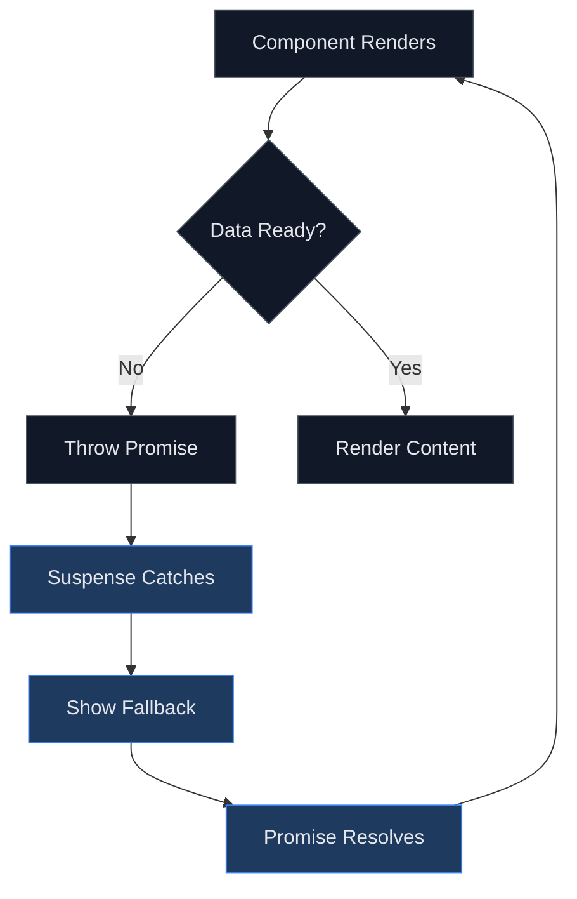
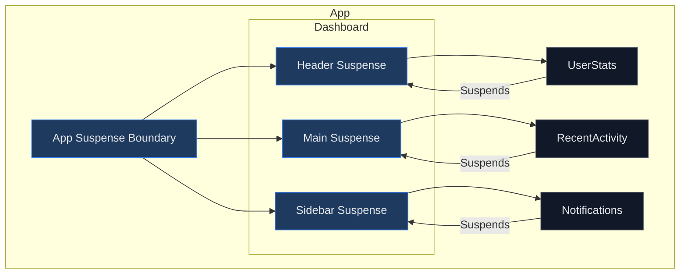
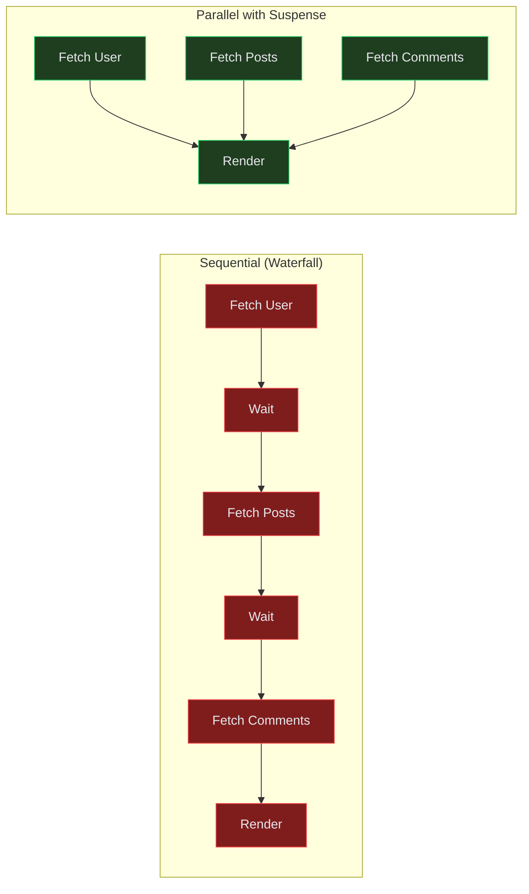

# How to Handle React Suspense for Data Fetching

Author: [nawazdhandala](https://www.github.com/nawazdhandala)

Tags: React, Suspense, Data Fetching, Async, Performance, Concurrent React, Error Boundaries

Description: A practical guide to using React Suspense for data fetching, including integration with popular data libraries, error handling, and streaming patterns.

---

React Suspense allows you to declaratively handle loading states in your application. Instead of manually tracking loading states, Suspense lets components "suspend" while waiting for data, showing a fallback UI automatically. This guide covers how to implement Suspense for data fetching effectively.

## Understanding Suspense

Suspense works by catching promises thrown during render. When a component needs data that is not yet available, it throws a promise. Suspense catches this promise, shows a fallback, and re-renders when the data is ready.

## Suspense Flow



## Basic Suspense Setup

```tsx
// App.tsx
import { Suspense } from 'react';
import { UserProfile } from './UserProfile';
import { Spinner } from './Spinner';

function App() {
  return (
    <Suspense fallback={<Spinner />}>
      <UserProfile userId="123" />
    </Suspense>
  );
}
```

## Using Suspense with React Query (TanStack Query)

React Query v5 has built-in Suspense support:

```tsx
// hooks/useUser.ts
import { useSuspenseQuery } from '@tanstack/react-query';

interface User {
  id: string;
  name: string;
  email: string;
}

async function fetchUser(userId: string): Promise<User> {
  const response = await fetch(`/api/users/${userId}`);
  if (!response.ok) {
    throw new Error('Failed to fetch user');
  }
  return response.json();
}

export function useUser(userId: string) {
  return useSuspenseQuery({
    queryKey: ['user', userId],
    queryFn: () => fetchUser(userId),
  });
}
```

```tsx
// components/UserProfile.tsx
import { Suspense } from 'react';
import { useUser } from '../hooks/useUser';
import { ErrorBoundary } from 'react-error-boundary';

function UserProfileContent({ userId }: { userId: string }) {
  // This hook suspends until data is ready
  const { data: user } = useUser(userId);

  return (
    <div className="user-profile">
      <h2>{user.name}</h2>
      <p>{user.email}</p>
    </div>
  );
}

function ErrorFallback({ error, resetErrorBoundary }: { error: Error; resetErrorBoundary: () => void }) {
  return (
    <div className="error">
      <p>Something went wrong: {error.message}</p>
      <button onClick={resetErrorBoundary}>Try again</button>
    </div>
  );
}

export function UserProfile({ userId }: { userId: string }) {
  return (
    <ErrorBoundary FallbackComponent={ErrorFallback}>
      <Suspense fallback={<div>Loading user...</div>}>
        <UserProfileContent userId={userId} />
      </Suspense>
    </ErrorBoundary>
  );
}
```

## Query Client Configuration for Suspense

```tsx
// main.tsx
import { QueryClient, QueryClientProvider } from '@tanstack/react-query';

const queryClient = new QueryClient({
  defaultOptions: {
    queries: {
      // Suspense-specific settings
      suspense: true,

      // Prevent refetching on mount when data exists
      staleTime: 5 * 60 * 1000, // 5 minutes

      // Retry configuration
      retry: 3,
      retryDelay: (attemptIndex) => Math.min(1000 * 2 ** attemptIndex, 30000),
    },
  },
});

function App() {
  return (
    <QueryClientProvider client={queryClient}>
      <MainApp />
    </QueryClientProvider>
  );
}
```

## Nested Suspense Boundaries

Use multiple Suspense boundaries for granular loading states:

```tsx
// pages/Dashboard.tsx
import { Suspense } from 'react';
import { UserStats } from './UserStats';
import { RecentActivity } from './RecentActivity';
import { Notifications } from './Notifications';

function Dashboard() {
  return (
    <div className="dashboard">
      <header>
        <Suspense fallback={<div>Loading user...</div>}>
          <UserStats />
        </Suspense>
      </header>

      <main>
        <Suspense fallback={<div>Loading activity...</div>}>
          <RecentActivity />
        </Suspense>
      </main>

      <aside>
        <Suspense fallback={<div>Loading notifications...</div>}>
          <Notifications />
        </Suspense>
      </aside>
    </div>
  );
}
```

## Suspense Boundaries Architecture



## Using SuspenseList for Coordinated Loading

Control the reveal order of multiple suspended components:

```tsx
import { Suspense, SuspenseList } from 'react';

function ProfilePage() {
  return (
    <SuspenseList revealOrder="forwards" tail="collapsed">
      <Suspense fallback={<HeaderSkeleton />}>
        <ProfileHeader />
      </Suspense>

      <Suspense fallback={<DetailsSkeleton />}>
        <ProfileDetails />
      </Suspense>

      <Suspense fallback={<PostsSkeleton />}>
        <ProfilePosts />
      </Suspense>
    </SuspenseList>
  );
}
```

`revealOrder` options:
- `forwards` - Reveal in DOM order, top to bottom
- `backwards` - Reveal in reverse order
- `together` - Reveal all at once when all are ready

## Parallel Data Fetching

Fetch multiple resources in parallel for better performance:

```tsx
// hooks/useDashboardData.ts
import { useSuspenseQueries } from '@tanstack/react-query';

export function useDashboardData(userId: string) {
  const results = useSuspenseQueries({
    queries: [
      {
        queryKey: ['user', userId],
        queryFn: () => fetchUser(userId),
      },
      {
        queryKey: ['posts', userId],
        queryFn: () => fetchUserPosts(userId),
      },
      {
        queryKey: ['notifications', userId],
        queryFn: () => fetchNotifications(userId),
      },
    ],
  });

  return {
    user: results[0].data,
    posts: results[1].data,
    notifications: results[2].data,
  };
}

// components/Dashboard.tsx
function Dashboard({ userId }: { userId: string }) {
  const { user, posts, notifications } = useDashboardData(userId);

  return (
    <div>
      <h1>Welcome, {user.name}</h1>
      <PostList posts={posts} />
      <NotificationBell count={notifications.length} />
    </div>
  );
}
```

## Data Fetching Flow Comparison



## Error Boundaries with Suspense

Always pair Suspense with Error Boundaries:

```tsx
// components/ErrorBoundary.tsx
import { Component, ReactNode } from 'react';

interface Props {
  children: ReactNode;
  fallback: ReactNode | ((error: Error, reset: () => void) => ReactNode);
}

interface State {
  hasError: boolean;
  error: Error | null;
}

export class ErrorBoundary extends Component<Props, State> {
  constructor(props: Props) {
    super(props);
    this.state = { hasError: false, error: null };
  }

  static getDerivedStateFromError(error: Error): State {
    return { hasError: true, error };
  }

  reset = () => {
    this.setState({ hasError: false, error: null });
  };

  render() {
    if (this.state.hasError && this.state.error) {
      if (typeof this.props.fallback === 'function') {
        return this.props.fallback(this.state.error, this.reset);
      }
      return this.props.fallback;
    }

    return this.props.children;
  }
}
```

```tsx
// Usage with Suspense
function App() {
  return (
    <ErrorBoundary
      fallback={(error, reset) => (
        <div className="error-page">
          <h1>Something went wrong</h1>
          <p>{error.message}</p>
          <button onClick={reset}>Try again</button>
        </div>
      )}
    >
      <Suspense fallback={<PageSkeleton />}>
        <MainContent />
      </Suspense>
    </ErrorBoundary>
  );
}
```

## Prefetching Data

Improve perceived performance by prefetching data:

```tsx
// hooks/useUserPrefetch.ts
import { useQueryClient } from '@tanstack/react-query';

export function useUserPrefetch() {
  const queryClient = useQueryClient();

  const prefetchUser = (userId: string) => {
    queryClient.prefetchQuery({
      queryKey: ['user', userId],
      queryFn: () => fetchUser(userId),
      staleTime: 5 * 60 * 1000,
    });
  };

  return { prefetchUser };
}

// components/UserList.tsx
function UserList({ users }: { users: UserSummary[] }) {
  const { prefetchUser } = useUserPrefetch();

  return (
    <ul>
      {users.map((user) => (
        <li
          key={user.id}
          // Prefetch on hover
          onMouseEnter={() => prefetchUser(user.id)}
        >
          <Link to={`/users/${user.id}`}>{user.name}</Link>
        </li>
      ))}
    </ul>
  );
}
```

## Streaming with Server Components

For Next.js or other frameworks supporting React Server Components:

```tsx
// app/dashboard/page.tsx (Next.js App Router)
import { Suspense } from 'react';
import { UserStats } from './UserStats';
import { RecentActivity } from './RecentActivity';

// This is a Server Component
export default function DashboardPage() {
  return (
    <div>
      <h1>Dashboard</h1>

      {/* Each Suspense boundary can stream independently */}
      <Suspense fallback={<div>Loading stats...</div>}>
        <UserStats />
      </Suspense>

      <Suspense fallback={<div>Loading activity...</div>}>
        <RecentActivity />
      </Suspense>
    </div>
  );
}

// UserStats.tsx - Server Component with async
async function UserStats() {
  // This fetch happens on the server
  const stats = await fetchUserStats();

  return (
    <div className="stats">
      <p>Total Posts: {stats.totalPosts}</p>
      <p>Total Likes: {stats.totalLikes}</p>
    </div>
  );
}
```

## Transition API with Suspense

Use transitions to keep the current UI while loading new data:

```tsx
import { useState, useTransition, Suspense } from 'react';

function TabContainer() {
  const [tab, setTab] = useState('posts');
  const [isPending, startTransition] = useTransition();

  const selectTab = (nextTab: string) => {
    startTransition(() => {
      setTab(nextTab);
    });
  };

  return (
    <div>
      <nav style={{ opacity: isPending ? 0.7 : 1 }}>
        <button onClick={() => selectTab('posts')}>Posts</button>
        <button onClick={() => selectTab('comments')}>Comments</button>
        <button onClick={() => selectTab('photos')}>Photos</button>
      </nav>

      <Suspense fallback={<Spinner />}>
        {tab === 'posts' && <PostsTab />}
        {tab === 'comments' && <CommentsTab />}
        {tab === 'photos' && <PhotosTab />}
      </Suspense>
    </div>
  );
}
```

## Best Practices

### 1. Place Suspense Boundaries Strategically

```tsx
// GOOD: Granular boundaries for independent sections
function Dashboard() {
  return (
    <div>
      <Suspense fallback={<HeaderSkeleton />}>
        <Header />
      </Suspense>
      <Suspense fallback={<ContentSkeleton />}>
        <MainContent />
      </Suspense>
    </div>
  );
}

// AVOID: Single boundary causing entire page to show loading
function Dashboard() {
  return (
    <Suspense fallback={<FullPageSpinner />}>
      <Header />
      <MainContent />
      <Sidebar />
    </Suspense>
  );
}
```

### 2. Use Skeleton UIs as Fallbacks

```tsx
function ProductCardSkeleton() {
  return (
    <div className="product-card skeleton">
      <div className="skeleton-image" />
      <div className="skeleton-text" />
      <div className="skeleton-text short" />
    </div>
  );
}

function ProductList() {
  return (
    <Suspense
      fallback={
        <div className="product-grid">
          {Array.from({ length: 6 }).map((_, i) => (
            <ProductCardSkeleton key={i} />
          ))}
        </div>
      }
    >
      <ProductListContent />
    </Suspense>
  );
}
```

### 3. Handle Loading States for Actions

```tsx
function UpdateButton({ userId }: { userId: string }) {
  const [isPending, startTransition] = useTransition();
  const queryClient = useQueryClient();

  const handleUpdate = () => {
    startTransition(async () => {
      await updateUser(userId);
      queryClient.invalidateQueries({ queryKey: ['user', userId] });
    });
  };

  return (
    <button onClick={handleUpdate} disabled={isPending}>
      {isPending ? 'Updating...' : 'Update'}
    </button>
  );
}
```

## Quick Reference

| Pattern | Use Case |
|---------|----------|
| Single Suspense | Simple pages with one data source |
| Nested Suspense | Independent sections loading separately |
| SuspenseList | Coordinated reveal order |
| useSuspenseQuery | React Query data fetching |
| useTransition | Keep old UI while loading new data |
| Error Boundary | Handle fetch failures gracefully |
| Prefetching | Improve perceived performance |

## Summary

React Suspense transforms how we handle loading states:

1. **Declarative loading** - Define fallbacks, not loading flags
2. **Granular control** - Multiple boundaries for different sections
3. **Better UX** - Use transitions to avoid jarring loading states
4. **Error handling** - Pair with Error Boundaries
5. **Performance** - Prefetch and parallel fetch data

Suspense works best with libraries designed for it like React Query, SWR, or Relay. Start with basic Suspense boundaries and progressively enhance with transitions and prefetching as your application grows.
