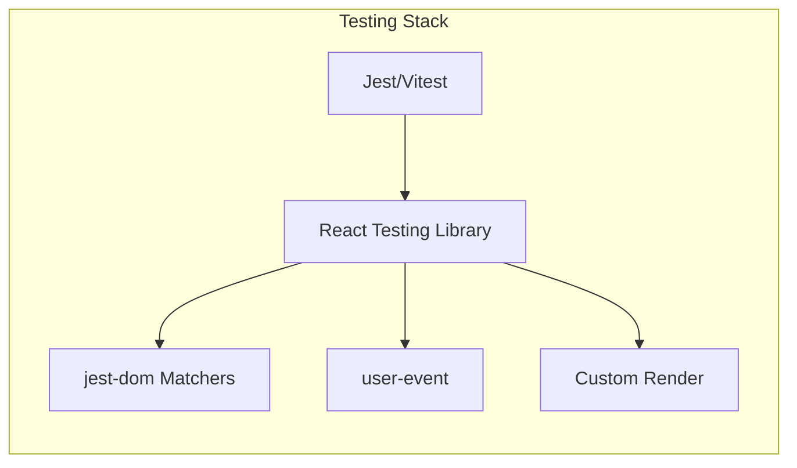
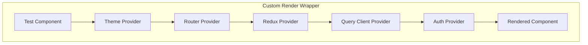
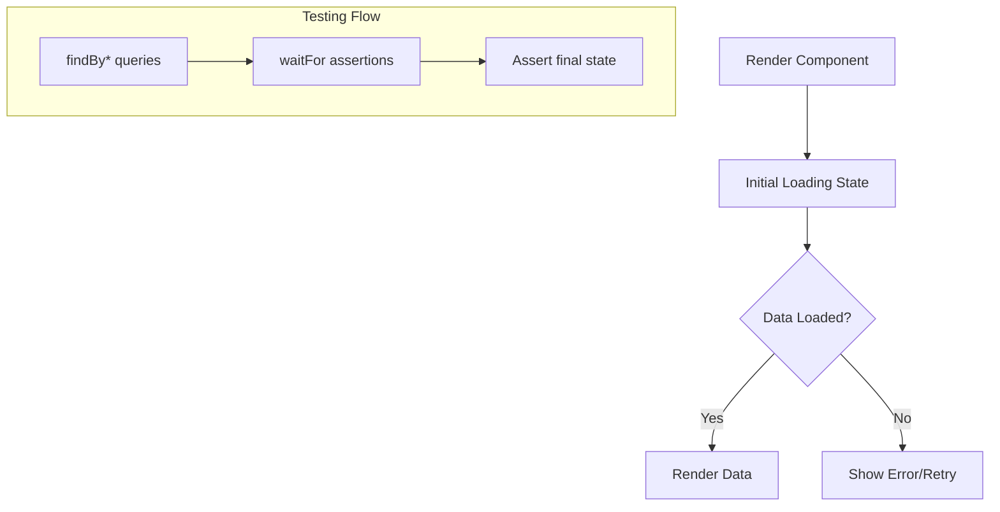

# How to Configure React Testing Library

Author: [nawazdhandala](https://www.github.com/nawazdhandala)

Tags: React, Testing, JavaScript, Frontend, Jest, Testing Library

Description: A comprehensive guide to setting up and configuring React Testing Library for effective component testing with Jest and custom render functions.

---

React Testing Library (RTL) encourages testing your components the way users interact with them, focusing on behavior rather than implementation details. Proper configuration is essential to get the most out of RTL and create a maintainable test suite. This guide covers everything from basic setup to advanced configuration patterns.

## Installation and Basic Setup

### Installing Dependencies

```bash
# For Create React App (already includes RTL)
npx create-react-app my-app

# For existing projects
npm install --save-dev @testing-library/react @testing-library/jest-dom @testing-library/user-event

# If using Vite
npm install --save-dev vitest jsdom @testing-library/react @testing-library/jest-dom
```



### Jest Configuration

Create or update your Jest configuration file.

```javascript
// jest.config.js
module.exports = {
  // Use jsdom environment for DOM testing
  testEnvironment: 'jsdom',

  // Setup files to run before each test file
  setupFilesAfterEnv: ['<rootDir>/src/setupTests.js'],

  // Module name mapping for CSS and assets
  moduleNameMapper: {
    // Handle CSS imports
    '\\.(css|less|scss|sass)$': 'identity-obj-proxy',
    // Handle image imports
    '\\.(jpg|jpeg|png|gif|webp|svg)$': '<rootDir>/__mocks__/fileMock.js',
    // Handle path aliases
    '^@/(.*)$': '<rootDir>/src/$1',
    '^@components/(.*)$': '<rootDir>/src/components/$1',
  },

  // Transform files with babel-jest
  transform: {
    '^.+\\.(js|jsx|ts|tsx)$': 'babel-jest',
  },

  // Ignore transformations for node_modules except specific packages
  transformIgnorePatterns: [
    '/node_modules/(?!(some-esm-package|another-package)/)',
  ],

  // Test file patterns
  testMatch: [
    '**/__tests__/**/*.[jt]s?(x)',
    '**/?(*.)+(spec|test).[jt]s?(x)',
  ],

  // Coverage configuration
  collectCoverageFrom: [
    'src/**/*.{js,jsx,ts,tsx}',
    '!src/**/*.d.ts',
    '!src/index.tsx',
    '!src/reportWebVitals.ts',
  ],

  // Coverage thresholds
  coverageThreshold: {
    global: {
      branches: 80,
      functions: 80,
      lines: 80,
      statements: 80,
    },
  },
};
```

### Setup File Configuration

```javascript
// src/setupTests.js
import '@testing-library/jest-dom';

// Extend expect with custom matchers
import { configure } from '@testing-library/react';

// Configure RTL
configure({
  // Change the default data-testid attribute
  testIdAttribute: 'data-testid',

  // Throw errors for deprecated methods
  throwSuggestions: true,
});

// Mock window.matchMedia (required for responsive components)
Object.defineProperty(window, 'matchMedia', {
  writable: true,
  value: jest.fn().mockImplementation(query => ({
    matches: false,
    media: query,
    onchange: null,
    addListener: jest.fn(),
    removeListener: jest.fn(),
    addEventListener: jest.fn(),
    removeEventListener: jest.fn(),
    dispatchEvent: jest.fn(),
  })),
});

// Mock IntersectionObserver
class MockIntersectionObserver {
  constructor(callback) {
    this.callback = callback;
  }
  observe() { return null; }
  unobserve() { return null; }
  disconnect() { return null; }
}

Object.defineProperty(window, 'IntersectionObserver', {
  writable: true,
  value: MockIntersectionObserver,
});

// Mock ResizeObserver
class MockResizeObserver {
  observe() { return null; }
  unobserve() { return null; }
  disconnect() { return null; }
}

Object.defineProperty(window, 'ResizeObserver', {
  writable: true,
  value: MockResizeObserver,
});

// Suppress specific console errors in tests
const originalError = console.error;
beforeAll(() => {
  console.error = (...args) => {
    // Suppress React act() warnings in certain cases
    if (
      typeof args[0] === 'string' &&
      args[0].includes('Warning: An update to')
    ) {
      return;
    }
    originalError.call(console, ...args);
  };
});

afterAll(() => {
  console.error = originalError;
});
```

### Vitest Configuration

```javascript
// vite.config.js
import { defineConfig } from 'vite';
import react from '@vitejs/plugin-react';

export default defineConfig({
  plugins: [react()],
  test: {
    globals: true,
    environment: 'jsdom',
    setupFiles: ['./src/setupTests.js'],
    css: true,
    coverage: {
      provider: 'v8',
      reporter: ['text', 'json', 'html'],
      exclude: [
        'node_modules/',
        'src/setupTests.js',
      ],
    },
  },
});
```

## Custom Render Function

Creating a custom render function is essential for testing components that depend on providers.



```javascript
// src/test-utils/render.jsx
import React from 'react';
import { render as rtlRender } from '@testing-library/react';
import { BrowserRouter, MemoryRouter } from 'react-router-dom';
import { Provider } from 'react-redux';
import { QueryClient, QueryClientProvider } from '@tanstack/react-query';
import { ThemeProvider } from 'styled-components';
import { configureStore } from '@reduxjs/toolkit';

import rootReducer from '../store/rootReducer';
import theme from '../styles/theme';
import { AuthProvider } from '../contexts/AuthContext';

// Create a custom render function
function render(
  ui,
  {
    // Redux options
    preloadedState = {},
    store = configureStore({
      reducer: rootReducer,
      preloadedState,
    }),

    // Router options
    route = '/',
    routerType = 'memory', // 'memory' or 'browser'

    // React Query options
    queryClient = new QueryClient({
      defaultOptions: {
        queries: {
          retry: false,
          cacheTime: 0,
        },
      },
    }),

    // Auth options
    user = null,

    // RTL options
    ...renderOptions
  } = {}
) {
  // Choose router based on test needs
  const Router = routerType === 'memory' ? MemoryRouter : BrowserRouter;
  const routerProps = routerType === 'memory'
    ? { initialEntries: [route] }
    : {};

  function AllTheProviders({ children }) {
    return (
      <Provider store={store}>
        <QueryClientProvider client={queryClient}>
          <ThemeProvider theme={theme}>
            <Router {...routerProps}>
              <AuthProvider initialUser={user}>
                {children}
              </AuthProvider>
            </Router>
          </ThemeProvider>
        </QueryClientProvider>
      </Provider>
    );
  }

  return {
    ...rtlRender(ui, { wrapper: AllTheProviders, ...renderOptions }),
    // Return store and queryClient for assertions
    store,
    queryClient,
  };
}

// Re-export everything from RTL
export * from '@testing-library/react';

// Override the default render
export { render };
```

### Using the Custom Render

```javascript
// src/components/UserProfile.test.jsx
import { render, screen, waitFor } from '../test-utils/render';
import userEvent from '@testing-library/user-event';
import UserProfile from './UserProfile';

describe('UserProfile', () => {
  it('displays user name from redux store', () => {
    render(<UserProfile />, {
      preloadedState: {
        user: {
          profile: { name: 'John Doe', email: 'john@example.com' },
        },
      },
    });

    expect(screen.getByText('John Doe')).toBeInTheDocument();
  });

  it('navigates to settings page', async () => {
    const user = userEvent.setup();

    render(<UserProfile />, {
      route: '/profile',
      preloadedState: {
        user: { profile: { name: 'John Doe' } },
      },
    });

    await user.click(screen.getByRole('button', { name: /settings/i }));

    expect(window.location.pathname).toBe('/settings');
  });

  it('renders with authenticated user', () => {
    render(<UserProfile />, {
      user: { id: 1, name: 'John', role: 'admin' },
    });

    expect(screen.getByText(/admin/i)).toBeInTheDocument();
  });
});
```

## Configuring User Event

User event provides more realistic user interactions than fireEvent.

```javascript
// src/test-utils/user-event.js
import userEvent from '@testing-library/user-event';

// Create a configured user event instance
export function setupUser(options = {}) {
  return userEvent.setup({
    // Simulate real delays between actions
    delay: null, // Set to a number for realistic delays

    // Configure pointer events
    pointerEventsCheck: 0,

    // Skip auto-await for certain actions
    skipAutoClose: false,

    ...options,
  });
}

// Usage in tests
// const user = setupUser();
// await user.click(button);
```

### User Event Examples

```javascript
// src/components/Form.test.jsx
import { render, screen, waitFor } from '../test-utils/render';
import { setupUser } from '../test-utils/user-event';
import ContactForm from './ContactForm';

describe('ContactForm', () => {
  it('submits form with user input', async () => {
    const user = setupUser();
    const handleSubmit = jest.fn();

    render(<ContactForm onSubmit={handleSubmit} />);

    // Type into inputs
    await user.type(screen.getByLabelText(/name/i), 'John Doe');
    await user.type(screen.getByLabelText(/email/i), 'john@example.com');
    await user.type(screen.getByLabelText(/message/i), 'Hello there!');

    // Select from dropdown
    await user.selectOptions(screen.getByLabelText(/subject/i), 'support');

    // Check a checkbox
    await user.click(screen.getByLabelText(/agree to terms/i));

    // Submit the form
    await user.click(screen.getByRole('button', { name: /submit/i }));

    await waitFor(() => {
      expect(handleSubmit).toHaveBeenCalledWith({
        name: 'John Doe',
        email: 'john@example.com',
        message: 'Hello there!',
        subject: 'support',
        agreeToTerms: true,
      });
    });
  });

  it('shows validation errors', async () => {
    const user = setupUser();

    render(<ContactForm onSubmit={jest.fn()} />);

    // Submit without filling form
    await user.click(screen.getByRole('button', { name: /submit/i }));

    // Check for error messages
    expect(await screen.findByText(/name is required/i)).toBeInTheDocument();
    expect(screen.getByText(/email is required/i)).toBeInTheDocument();
  });

  it('clears input on escape key', async () => {
    const user = setupUser();

    render(<ContactForm onSubmit={jest.fn()} />);

    const input = screen.getByLabelText(/name/i);
    await user.type(input, 'John Doe');
    await user.keyboard('{Escape}');

    expect(input).toHaveValue('');
  });
});
```

## Mocking API Calls

### Using MSW (Mock Service Worker)

```javascript
// src/mocks/handlers.js
import { rest } from 'msw';

export const handlers = [
  rest.get('/api/users/:userId', (req, res, ctx) => {
    const { userId } = req.params;

    return res(
      ctx.status(200),
      ctx.json({
        id: userId,
        name: 'John Doe',
        email: 'john@example.com',
      })
    );
  }),

  rest.post('/api/users', async (req, res, ctx) => {
    const body = await req.json();

    return res(
      ctx.status(201),
      ctx.json({
        id: '123',
        ...body,
      })
    );
  }),

  rest.get('/api/users/:userId', (req, res, ctx) => {
    // Simulate error for specific user
    if (req.params.userId === '404') {
      return res(
        ctx.status(404),
        ctx.json({ error: 'User not found' })
      );
    }

    return res(ctx.json({ id: req.params.userId, name: 'Test User' }));
  }),
];

// src/mocks/server.js
import { setupServer } from 'msw/node';
import { handlers } from './handlers';

export const server = setupServer(...handlers);

// src/setupTests.js
import { server } from './mocks/server';

beforeAll(() => server.listen({ onUnhandledRequest: 'error' }));
afterEach(() => server.resetHandlers());
afterAll(() => server.close());
```

### Testing with MSW

```javascript
// src/components/UserList.test.jsx
import { render, screen, waitFor } from '../test-utils/render';
import { rest } from 'msw';
import { server } from '../mocks/server';
import UserList from './UserList';

describe('UserList', () => {
  it('loads and displays users', async () => {
    server.use(
      rest.get('/api/users', (req, res, ctx) => {
        return res(
          ctx.json([
            { id: 1, name: 'Alice' },
            { id: 2, name: 'Bob' },
          ])
        );
      })
    );

    render(<UserList />);

    expect(screen.getByText(/loading/i)).toBeInTheDocument();

    await waitFor(() => {
      expect(screen.getByText('Alice')).toBeInTheDocument();
      expect(screen.getByText('Bob')).toBeInTheDocument();
    });
  });

  it('displays error message on failure', async () => {
    server.use(
      rest.get('/api/users', (req, res, ctx) => {
        return res(ctx.status(500), ctx.json({ error: 'Server error' }));
      })
    );

    render(<UserList />);

    await waitFor(() => {
      expect(screen.getByText(/error loading users/i)).toBeInTheDocument();
    });
  });
});
```

## Testing Async Components



```javascript
// src/components/AsyncComponent.test.jsx
import { render, screen, waitFor, waitForElementToBeRemoved } from '../test-utils/render';
import AsyncComponent from './AsyncComponent';

describe('AsyncComponent', () => {
  it('shows loading then content', async () => {
    render(<AsyncComponent />);

    // Check loading state
    expect(screen.getByRole('progressbar')).toBeInTheDocument();

    // Wait for loading to disappear
    await waitForElementToBeRemoved(() => screen.queryByRole('progressbar'));

    // Check content is displayed
    expect(screen.getByText(/data loaded/i)).toBeInTheDocument();
  });

  it('handles async state changes', async () => {
    render(<AsyncComponent />);

    // Use findBy for elements that appear asynchronously
    const content = await screen.findByText(/data loaded/i, {}, { timeout: 3000 });

    expect(content).toBeInTheDocument();
  });

  it('retries on error', async () => {
    const user = setupUser();
    let attempts = 0;

    server.use(
      rest.get('/api/data', (req, res, ctx) => {
        attempts++;
        if (attempts === 1) {
          return res(ctx.status(500));
        }
        return res(ctx.json({ data: 'success' }));
      })
    );

    render(<AsyncComponent />);

    // Wait for error
    await screen.findByText(/error occurred/i);

    // Click retry
    await user.click(screen.getByRole('button', { name: /retry/i }));

    // Wait for success
    await screen.findByText(/success/i);

    expect(attempts).toBe(2);
  });
});
```

## Custom Matchers

```javascript
// src/test-utils/matchers.js
import { expect } from '@jest/globals';

// Custom matcher for checking form validity
expect.extend({
  toBeInvalidField(received) {
    const isInvalid = received.getAttribute('aria-invalid') === 'true';

    return {
      pass: isInvalid,
      message: () =>
        `expected ${received.tagName} to ${isInvalid ? 'not ' : ''}be invalid`,
    };
  },

  toHaveErrorMessage(received, expectedMessage) {
    const errorId = received.getAttribute('aria-describedby');
    const errorElement = document.getElementById(errorId);
    const actualMessage = errorElement?.textContent;

    return {
      pass: actualMessage === expectedMessage,
      message: () =>
        `expected error message to be "${expectedMessage}" but got "${actualMessage}"`,
    };
  },
});

// Usage
test('shows validation error', async () => {
  render(<Form />);

  const emailInput = screen.getByLabelText(/email/i);
  await user.type(emailInput, 'invalid');
  await user.tab();

  expect(emailInput).toBeInvalidField();
  expect(emailInput).toHaveErrorMessage('Please enter a valid email');
});
```

## Testing Context Providers

```javascript
// src/contexts/ThemeContext.test.jsx
import { render, screen } from '@testing-library/react';
import { setupUser } from '../test-utils/user-event';
import { ThemeProvider, useTheme } from './ThemeContext';

// Test component that uses the context
function ThemeConsumer() {
  const { theme, toggleTheme } = useTheme();

  return (
    <div>
      <span data-testid="theme">{theme}</span>
      <button onClick={toggleTheme}>Toggle</button>
    </div>
  );
}

describe('ThemeContext', () => {
  it('provides default theme', () => {
    render(
      <ThemeProvider>
        <ThemeConsumer />
      </ThemeProvider>
    );

    expect(screen.getByTestId('theme')).toHaveTextContent('light');
  });

  it('toggles theme', async () => {
    const user = setupUser();

    render(
      <ThemeProvider>
        <ThemeConsumer />
      </ThemeProvider>
    );

    await user.click(screen.getByRole('button', { name: /toggle/i }));

    expect(screen.getByTestId('theme')).toHaveTextContent('dark');
  });

  it('allows initial theme', () => {
    render(
      <ThemeProvider initialTheme="dark">
        <ThemeConsumer />
      </ThemeProvider>
    );

    expect(screen.getByTestId('theme')).toHaveTextContent('dark');
  });
});
```

## Snapshot Testing Configuration

```javascript
// jest.config.js
module.exports = {
  // ... other config
  snapshotSerializers: ['@emotion/jest/serializer'],

  // Custom snapshot resolver
  snapshotResolver: '<rootDir>/snapshotResolver.js',
};

// snapshotResolver.js
module.exports = {
  // Store snapshots next to test files
  resolveSnapshotPath: (testPath, snapshotExtension) =>
    testPath.replace(/\.test\.([tj]sx?)/, `.test.$1${snapshotExtension}`),

  resolveTestPath: (snapshotFilePath, snapshotExtension) =>
    snapshotFilePath.replace(snapshotExtension, ''),

  testPathForConsistencyCheck: 'some/example.test.js',
};
```

```javascript
// Component snapshot test
import { render } from '../test-utils/render';
import Button from './Button';

describe('Button', () => {
  it('matches snapshot for primary variant', () => {
    const { container } = render(<Button variant="primary">Click me</Button>);
    expect(container.firstChild).toMatchSnapshot();
  });

  it('matches inline snapshot', () => {
    const { container } = render(<Button size="small">Small</Button>);
    expect(container.firstChild).toMatchInlineSnapshot(`
      <button
        class="btn btn-small"
      >
        Small
      </button>
    `);
  });
});
```

## CI/CD Configuration

```yaml
# .github/workflows/test.yml
name: Test

on:
  push:
    branches: [main]
  pull_request:
    branches: [main]

jobs:
  test:
    runs-on: ubuntu-latest

    steps:
      - uses: actions/checkout@v4

      - name: Setup Node.js
        uses: actions/setup-node@v4
        with:
          node-version: '20'
          cache: 'npm'

      - name: Install dependencies
        run: npm ci

      - name: Run tests
        run: npm test -- --coverage --watchAll=false

      - name: Upload coverage
        uses: codecov/codecov-action@v3
        with:
          files: ./coverage/lcov.info
          fail_ci_if_error: true
```

## Summary

Proper React Testing Library configuration involves several key components:

1. **Jest/Vitest Setup**: Configure the test environment, module mappers, and setup files
2. **Custom Render Function**: Wrap components with necessary providers for realistic testing
3. **User Event Configuration**: Use userEvent for realistic user interaction simulation
4. **API Mocking**: Use MSW for consistent and maintainable API mocking
5. **Custom Matchers**: Extend Jest with domain-specific matchers
6. **CI Integration**: Set up automated testing in your CI/CD pipeline

With this configuration in place, you can write tests that accurately reflect how users interact with your application while maintaining a fast and reliable test suite.
