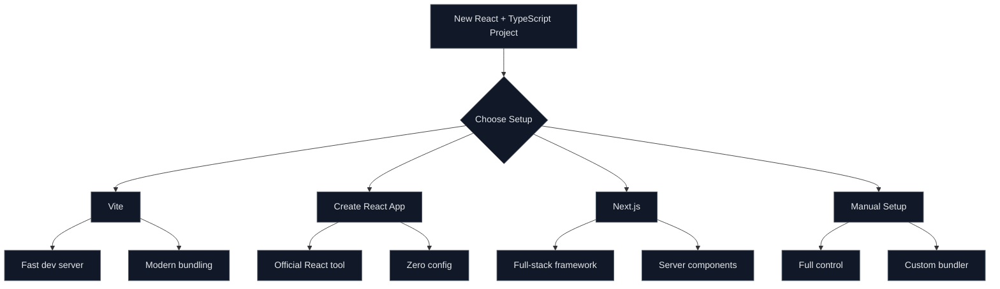

# How to Configure React with TypeScript

Author: [nawazdhandala](https://www.github.com/nawazdhandala)

Tags: React, TypeScript, JavaScript, Configuration, Frontend, Vite, Create React App

Description: A complete guide to setting up and configuring React projects with TypeScript, including project setup, tsconfig options, and common type patterns.

---

TypeScript brings type safety and better developer experience to React applications. This guide covers everything from initial setup to advanced configuration patterns.

## Project Setup Options

Choose the right setup approach for your needs:



## Setup with Vite (Recommended)

Vite provides the fastest development experience:

```bash
# Create new project with Vite
npm create vite@latest my-react-app -- --template react-ts

# Navigate to project
cd my-react-app

# Install dependencies
npm install

# Start development server
npm run dev
```

## TypeScript Configuration

### Basic tsconfig.json

```json
// tsconfig.json
{
  "compilerOptions": {
    // Target modern JavaScript for better performance
    "target": "ES2020",

    // Use ESNext modules with bundler resolution
    "module": "ESNext",
    "moduleResolution": "bundler",

    // Enable all strict type checking options
    "strict": true,
    "noImplicitAny": true,
    "strictNullChecks": true,
    "strictFunctionTypes": true,

    // Additional checks for better code quality
    "noUnusedLocals": true,
    "noUnusedParameters": true,
    "noImplicitReturns": true,
    "noFallthroughCasesInSwitch": true,

    // JSX configuration for React
    "jsx": "react-jsx",

    // Path aliases for cleaner imports
    "baseUrl": ".",
    "paths": {
      "@/*": ["src/*"],
      "@components/*": ["src/components/*"],
      "@hooks/*": ["src/hooks/*"],
      "@utils/*": ["src/utils/*"]
    },

    // Allow importing JSON files
    "resolveJsonModule": true,

    // Ensure consistency with ESM
    "esModuleInterop": true,
    "allowSyntheticDefaultImports": true,
    "isolatedModules": true,

    // Skip type checking of declaration files
    "skipLibCheck": true,

    // Include type definitions
    "lib": ["ES2020", "DOM", "DOM.Iterable"],
    "types": ["vite/client"]
  },
  "include": ["src/**/*"],
  "exclude": ["node_modules", "dist"]
}
```

### Vite Configuration with TypeScript

```typescript
// vite.config.ts
import { defineConfig } from 'vite';
import react from '@vitejs/plugin-react';
import path from 'path';

export default defineConfig({
  plugins: [react()],

  // Configure path aliases to match tsconfig
  resolve: {
    alias: {
      '@': path.resolve(__dirname, './src'),
      '@components': path.resolve(__dirname, './src/components'),
      '@hooks': path.resolve(__dirname, './src/hooks'),
      '@utils': path.resolve(__dirname, './src/utils'),
    },
  },

  // Development server configuration
  server: {
    port: 3000,
    open: true,
  },

  // Build configuration
  build: {
    outDir: 'dist',
    sourcemap: true,
  },
});
```

## Essential Type Definitions

### Component Props Types

```tsx
// src/types/common.ts
import { ReactNode, PropsWithChildren, ComponentPropsWithoutRef } from 'react';

// Props that include children
export interface ContainerProps {
  children: ReactNode;
  className?: string;
}

// Using PropsWithChildren utility type
export type CardProps = PropsWithChildren<{
  title: string;
  footer?: ReactNode;
}>;

// Extending native HTML element props
export interface ButtonProps extends ComponentPropsWithoutRef<'button'> {
  variant?: 'primary' | 'secondary' | 'danger';
  size?: 'small' | 'medium' | 'large';
  loading?: boolean;
}

// Example implementation
export function Button({
  variant = 'primary',
  size = 'medium',
  loading = false,
  children,
  disabled,
  className,
  ...props
}: ButtonProps) {
  return (
    <button
      className={`btn btn-${variant} btn-${size} ${className || ''}`}
      disabled={disabled || loading}
      {...props}
    >
      {loading ? <span className="spinner" /> : children}
    </button>
  );
}
```

### Event Handler Types

```tsx
// src/components/Form.tsx
import {
  ChangeEvent,
  FormEvent,
  MouseEvent,
  KeyboardEvent,
  FocusEvent
} from 'react';

interface FormProps {
  onSubmit: (data: FormData) => void;
}

interface FormData {
  email: string;
  password: string;
}

export function LoginForm({ onSubmit }: FormProps) {
  // Type the event handlers explicitly
  const handleInputChange = (e: ChangeEvent<HTMLInputElement>) => {
    const { name, value } = e.target;
    console.log(`${name}: ${value}`);
  };

  const handleFormSubmit = (e: FormEvent<HTMLFormElement>) => {
    e.preventDefault();
    const formData = new FormData(e.currentTarget);
    onSubmit({
      email: formData.get('email') as string,
      password: formData.get('password') as string,
    });
  };

  const handleKeyPress = (e: KeyboardEvent<HTMLInputElement>) => {
    if (e.key === 'Enter') {
      console.log('Enter pressed');
    }
  };

  return (
    <form onSubmit={handleFormSubmit}>
      <input
        type="email"
        name="email"
        onChange={handleInputChange}
        onKeyPress={handleKeyPress}
      />
      <input
        type="password"
        name="password"
        onChange={handleInputChange}
      />
      <button type="submit">Login</button>
    </form>
  );
}
```

### Hook Types

```tsx
// src/hooks/useLocalStorage.ts
import { useState, useEffect, useCallback } from 'react';

// Generic hook for type-safe localStorage
export function useLocalStorage<T>(
  key: string,
  initialValue: T
): [T, (value: T | ((prev: T) => T)) => void, () => void] {
  // Initialize state with value from localStorage or initial value
  const [storedValue, setStoredValue] = useState<T>(() => {
    try {
      const item = window.localStorage.getItem(key);
      return item ? (JSON.parse(item) as T) : initialValue;
    } catch (error) {
      console.error(`Error reading localStorage key "${key}":`, error);
      return initialValue;
    }
  });

  // Update localStorage when state changes
  const setValue = useCallback(
    (value: T | ((prev: T) => T)) => {
      try {
        const valueToStore = value instanceof Function ? value(storedValue) : value;
        setStoredValue(valueToStore);
        window.localStorage.setItem(key, JSON.stringify(valueToStore));
      } catch (error) {
        console.error(`Error setting localStorage key "${key}":`, error);
      }
    },
    [key, storedValue]
  );

  // Remove item from localStorage
  const removeValue = useCallback(() => {
    try {
      window.localStorage.removeItem(key);
      setStoredValue(initialValue);
    } catch (error) {
      console.error(`Error removing localStorage key "${key}":`, error);
    }
  }, [key, initialValue]);

  return [storedValue, setValue, removeValue];
}
```

### Context Types

```tsx
// src/contexts/AuthContext.tsx
import {
  createContext,
  useContext,
  useState,
  useCallback,
  ReactNode
} from 'react';

// Define the shape of user data
interface User {
  id: string;
  email: string;
  name: string;
  role: 'admin' | 'user' | 'guest';
}

// Define the context value type
interface AuthContextType {
  user: User | null;
  isAuthenticated: boolean;
  isLoading: boolean;
  login: (email: string, password: string) => Promise<void>;
  logout: () => void;
}

// Create context with undefined default
const AuthContext = createContext<AuthContextType | undefined>(undefined);

// Provider props type
interface AuthProviderProps {
  children: ReactNode;
}

// Provider component
export function AuthProvider({ children }: AuthProviderProps) {
  const [user, setUser] = useState<User | null>(null);
  const [isLoading, setIsLoading] = useState(false);

  const login = useCallback(async (email: string, password: string) => {
    setIsLoading(true);
    try {
      const response = await fetch('/api/login', {
        method: 'POST',
        headers: { 'Content-Type': 'application/json' },
        body: JSON.stringify({ email, password }),
      });

      if (!response.ok) {
        throw new Error('Login failed');
      }

      const userData: User = await response.json();
      setUser(userData);
    } finally {
      setIsLoading(false);
    }
  }, []);

  const logout = useCallback(() => {
    setUser(null);
  }, []);

  const value: AuthContextType = {
    user,
    isAuthenticated: user !== null,
    isLoading,
    login,
    logout,
  };

  return (
    <AuthContext.Provider value={value}>
      {children}
    </AuthContext.Provider>
  );
}

// Custom hook with type safety
export function useAuth(): AuthContextType {
  const context = useContext(AuthContext);

  if (context === undefined) {
    throw new Error('useAuth must be used within an AuthProvider');
  }

  return context;
}
```

## Generics in React Components

```tsx
// src/components/DataList.tsx
import { ReactNode } from 'react';

// Generic list component that works with any data type
interface DataListProps<T> {
  items: T[];
  renderItem: (item: T, index: number) => ReactNode;
  keyExtractor: (item: T) => string | number;
  emptyMessage?: string;
  loading?: boolean;
}

export function DataList<T>({
  items,
  renderItem,
  keyExtractor,
  emptyMessage = 'No items found',
  loading = false,
}: DataListProps<T>) {
  if (loading) {
    return <div className="loading">Loading...</div>;
  }

  if (items.length === 0) {
    return <div className="empty">{emptyMessage}</div>;
  }

  return (
    <ul className="data-list">
      {items.map((item, index) => (
        <li key={keyExtractor(item)}>{renderItem(item, index)}</li>
      ))}
    </ul>
  );
}

// Usage example
interface Product {
  id: number;
  name: string;
  price: number;
}

function ProductList({ products }: { products: Product[] }) {
  return (
    <DataList
      items={products}
      keyExtractor={(product) => product.id}
      renderItem={(product) => (
        <div>
          <span>{product.name}</span>
          <span>${product.price}</span>
        </div>
      )}
      emptyMessage="No products available"
    />
  );
}
```

## ESLint Configuration for TypeScript

```json
// .eslintrc.json
{
  "env": {
    "browser": true,
    "es2021": true
  },
  "extends": [
    "eslint:recommended",
    "plugin:react/recommended",
    "plugin:react-hooks/recommended",
    "plugin:@typescript-eslint/recommended"
  ],
  "parser": "@typescript-eslint/parser",
  "parserOptions": {
    "ecmaFeatures": { "jsx": true },
    "ecmaVersion": "latest",
    "sourceType": "module",
    "project": "./tsconfig.json"
  },
  "plugins": ["react", "@typescript-eslint"],
  "rules": {
    "react/react-in-jsx-scope": "off",
    "@typescript-eslint/explicit-function-return-type": "off",
    "@typescript-eslint/no-unused-vars": ["error", { "argsIgnorePattern": "^_" }]
  },
  "settings": {
    "react": { "version": "detect" }
  }
}
```

## Quick Reference

| Configuration | Purpose |
|--------------|---------|
| `strict: true` | Enable all strict type checking |
| `jsx: "react-jsx"` | Use new JSX transform |
| `moduleResolution: "bundler"` | Match bundler module resolution |
| `paths` | Configure import aliases |
| `skipLibCheck` | Faster compilation |

Setting up React with TypeScript provides a solid foundation for building maintainable applications. The initial configuration effort pays off quickly through better autocomplete, catching errors at compile time, and self-documenting code through types.
