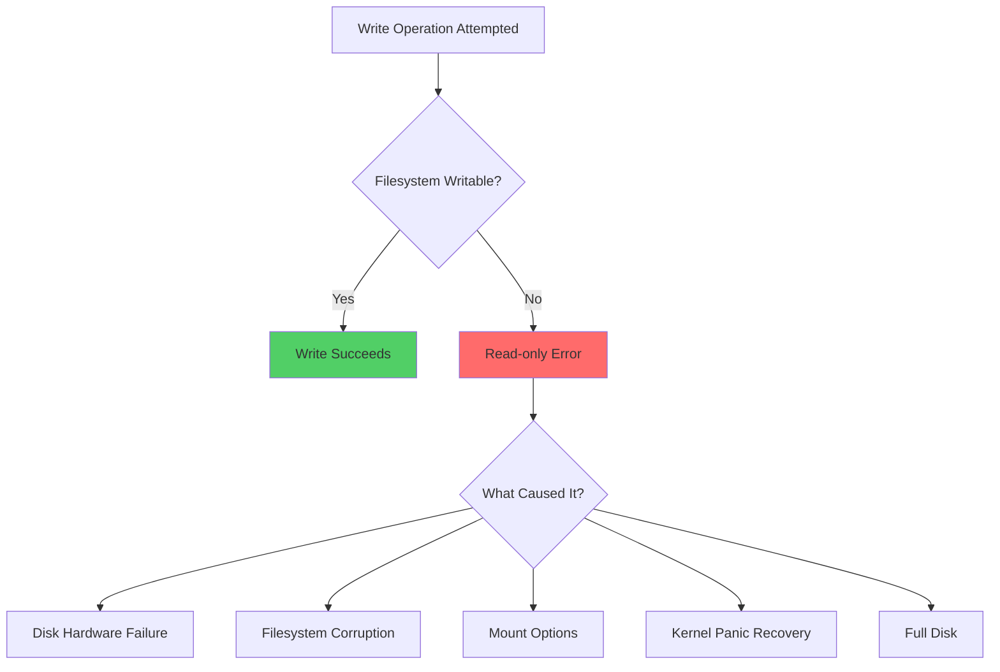
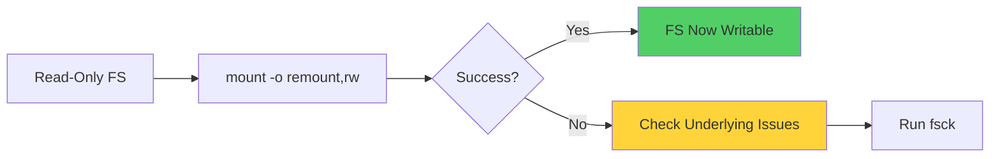
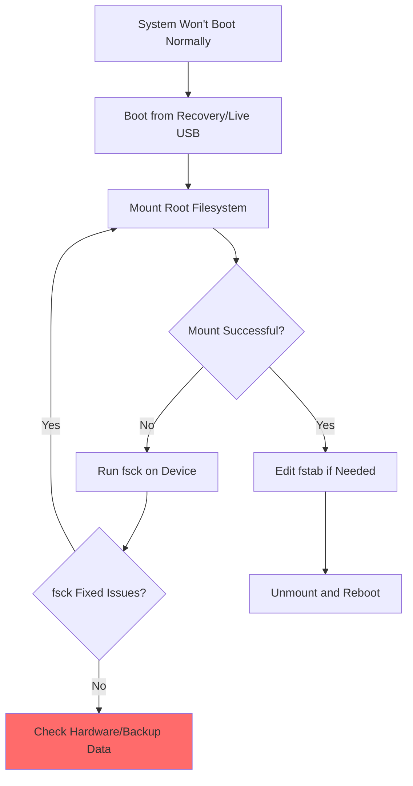
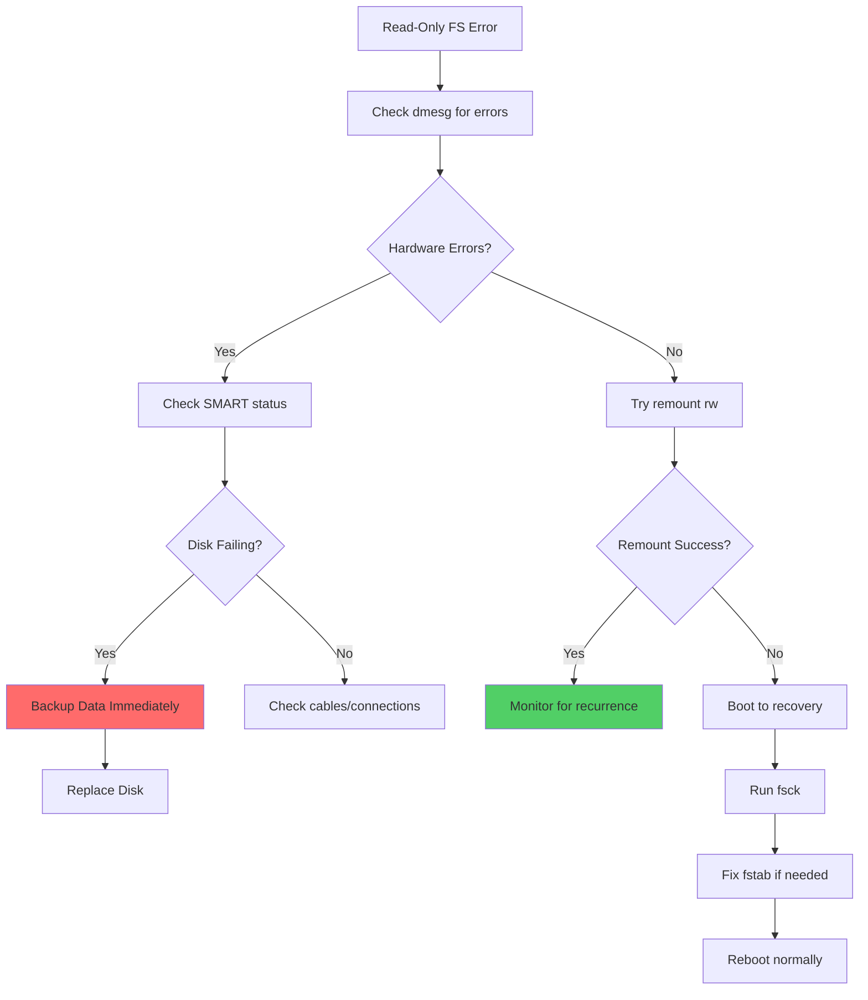

# How to Fix "Read-Only File System" Errors

Author: [nawazdhandala](https://www.github.com/nawazdhandala)

Tags: Linux, File System, Troubleshooting, System Administration, Storage

Description: Learn how to diagnose and fix read-only file system errors in Linux, including causes like disk failures, mount issues, and filesystem corruption.

---

The "Read-only file system" error is one of the most common issues Linux administrators encounter. This error prevents you from writing to files, creating directories, or making any modifications to the affected filesystem. Understanding the root causes and knowing how to fix them is essential for maintaining system stability.

## Understanding Read-Only File System Errors

When Linux encounters a serious filesystem error or hardware issue, it often remounts the filesystem as read-only to prevent further damage. This protective mechanism helps preserve data integrity but can disrupt normal operations.



## Common Causes

### 1. Filesystem Corruption

The most common cause is filesystem corruption, often triggered by:
- Unexpected system shutdowns
- Power failures
- Hardware failures
- Software bugs

### 2. Disk Hardware Issues

Physical disk problems can cause the kernel to remount filesystems as read-only:
- Bad sectors
- Failing drives
- Cable connection issues
- Controller problems

### 3. Mount Configuration

Sometimes the filesystem is intentionally mounted as read-only due to:
- Incorrect fstab entries
- Boot parameters
- Recovery mode operations

## Diagnostic Steps

### Step 1: Check Current Mount Status

First, identify which filesystems are mounted as read-only.

```bash
# Display all mounted filesystems and their options
# Look for 'ro' (read-only) vs 'rw' (read-write) in the output
mount | grep -E '(^/dev|type (ext4|xfs|btrfs))'
```

Example output showing a read-only root filesystem:

```
/dev/sda1 on / type ext4 (ro,relatime,errors=remount-ro)
```

### Step 2: Check System Logs

Examine system logs to understand why the filesystem became read-only.

```bash
# Check kernel messages for filesystem errors
# This will show any I/O errors, filesystem corruption, or hardware issues
dmesg | grep -iE '(error|fail|readonly|read-only|ext4|xfs|I/O)' | tail -50

# Check system journal for filesystem-related messages
# The -p err flag filters for error-level messages only
journalctl -p err -b | grep -iE '(filesystem|disk|sda|sdb|ext4|xfs)'
```

### Step 3: Check Disk Health

Verify the physical health of your storage devices.

```bash
# Check SMART status for disk health indicators
# This requires the smartmontools package to be installed
sudo smartctl -H /dev/sda

# Get detailed SMART information including error logs
# Look for reallocated sectors, pending sectors, and uncorrectable errors
sudo smartctl -a /dev/sda | grep -E '(Reallocated|Pending|Uncorrectable|Error)'
```

## Fixing Read-Only File System Errors

### Method 1: Remount the Filesystem

If the filesystem was temporarily remounted as read-only, you can try remounting it as read-write.

```bash
# Attempt to remount the root filesystem as read-write
# This is the simplest fix but may fail if there are underlying issues
sudo mount -o remount,rw /

# For a specific mount point, specify the device and path
# Replace /dev/sda1 and /data with your actual device and mount point
sudo mount -o remount,rw /dev/sda1 /data
```



### Method 2: Check and Repair Filesystem

If remounting fails, you may need to repair the filesystem using fsck.

**Warning:** Never run fsck on a mounted filesystem. Always unmount first or boot into recovery mode.

```bash
# First, check if the filesystem can be unmounted
# This shows which processes are using the filesystem
sudo lsof +f -- /data

# Unmount the filesystem before running fsck
# You may need to stop services that are using it first
sudo umount /data

# Run filesystem check and repair on an ext4 filesystem
# The -y flag automatically answers yes to repair prompts
# The -f flag forces a check even if the filesystem seems clean
sudo fsck.ext4 -y -f /dev/sda2

# For XFS filesystems, use xfs_repair instead
# XFS does not use fsck - always use xfs_repair
sudo xfs_repair /dev/sda2
```

### Method 3: Fix Root Filesystem Issues

When the root filesystem is read-only, you need special handling since you cannot unmount it while the system is running.

```bash
# Boot into single-user or recovery mode first
# Then remount root as read-write for maintenance
mount -o remount,rw /

# After making changes, you can check the filesystem at next boot
# This creates a file that triggers fsck on reboot
sudo touch /forcefsck

# For systemd-based systems, use this command instead
# This schedules a filesystem check at the next boot
sudo systemctl --force --force reboot
```

### Method 4: Check and Fix fstab Configuration

Incorrect fstab entries can cause filesystems to mount as read-only.

```bash
# View current fstab configuration
# Look for 'ro' in the options column or incorrect UUIDs
cat /etc/fstab

# Example of a correct fstab entry with read-write permissions:
# UUID=abc123 /data ext4 defaults,rw 0 2

# Verify the UUID matches the actual device
# Compare the output with what is in fstab
sudo blkid /dev/sda1
```

Example fstab entry that might cause read-only mounting:

```
# Incorrect - 'ro' option forces read-only mount
/dev/sda2  /data  ext4  ro,noatime  0  2

# Correct - 'defaults' includes rw (read-write)
/dev/sda2  /data  ext4  defaults,noatime  0  2
```

### Method 5: Handle Full Disk Situations

A completely full disk can cause write operations to fail and sometimes trigger read-only remounting.

```bash
# Check disk space usage for all mounted filesystems
# Look for partitions at 100% usage
df -h

# Find the largest files in a directory to free up space
# This finds files larger than 100MB in the specified path
sudo find /var -type f -size +100M -exec ls -lh {} \; 2>/dev/null

# Find and remove old log files to free space
# This removes log files older than 30 days
sudo find /var/log -type f -name "*.log" -mtime +30 -delete

# Clear journal logs if they are taking too much space
# This keeps only the last 100MB of journal entries
sudo journalctl --vacuum-size=100M
```

## Recovery Mode Procedures

When you cannot fix the issue from a running system, boot into recovery mode.



### Using a Live USB

```bash
# After booting from a live USB, identify your root partition
# List all block devices and their partitions
lsblk -f

# Run filesystem check on the unmounted root partition
# Replace /dev/sda1 with your actual root partition
sudo fsck -y /dev/sda1

# If you need to edit configuration files, mount the partition
sudo mkdir -p /mnt/repair
sudo mount /dev/sda1 /mnt/repair

# Edit fstab if needed
sudo nano /mnt/repair/etc/fstab

# Unmount when done
sudo umount /mnt/repair
```

## Preventing Future Read-Only Issues

### Set Up Disk Monitoring

Proactive monitoring helps catch issues before they cause read-only problems.

```bash
# Install smartmontools for disk health monitoring
sudo apt install smartmontools    # Debian/Ubuntu
sudo yum install smartmontools    # RHEL/CentOS

# Enable automatic SMART monitoring daemon
# This runs periodic health checks on your disks
sudo systemctl enable smartd
sudo systemctl start smartd

# Configure smartd to send email alerts on disk problems
# Edit /etc/smartd.conf and add monitoring entries
echo '/dev/sda -a -o on -S on -s (S/../.././02|L/../../6/03) -m admin@example.com' | sudo tee -a /etc/smartd.conf
```

### Configure Filesystem Options

Use appropriate filesystem options to handle errors gracefully.

```bash
# For ext4, set the errors behavior in fstab
# errors=remount-ro is default; errors=continue keeps FS writable
# Only use errors=continue if you have good backups
/dev/sda1  /  ext4  defaults,errors=remount-ro  0  1

# Enable periodic filesystem checks
# This enables automatic fsck every 30 mounts or 180 days
sudo tune2fs -c 30 -i 180d /dev/sda1
```

## Quick Reference Troubleshooting Flow



## Conclusion

Read-only file system errors can be frustrating, but they usually indicate an underlying issue that needs attention. By systematically checking hardware health, filesystem integrity, and mount configurations, you can identify and resolve most read-only filesystem problems. Remember to always maintain good backups, as read-only errors can sometimes indicate impending disk failure.

**Key Takeaways:**
- Check system logs first to understand the root cause
- Never run fsck on mounted filesystems
- Use SMART monitoring to catch disk problems early
- Keep regular backups to protect against data loss

**Related Reading:**
- [How to Configure LVM for Storage Management](https://oneuptime.com/blog/post/2026-01-24-lvm-storage-management/view)
- [How to Handle Package Management with apt and yum](https://oneuptime.com/blog/post/2026-01-24-package-management-apt-yum/view)
