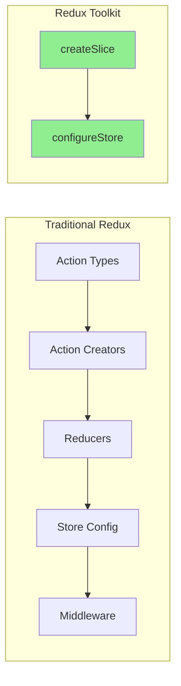
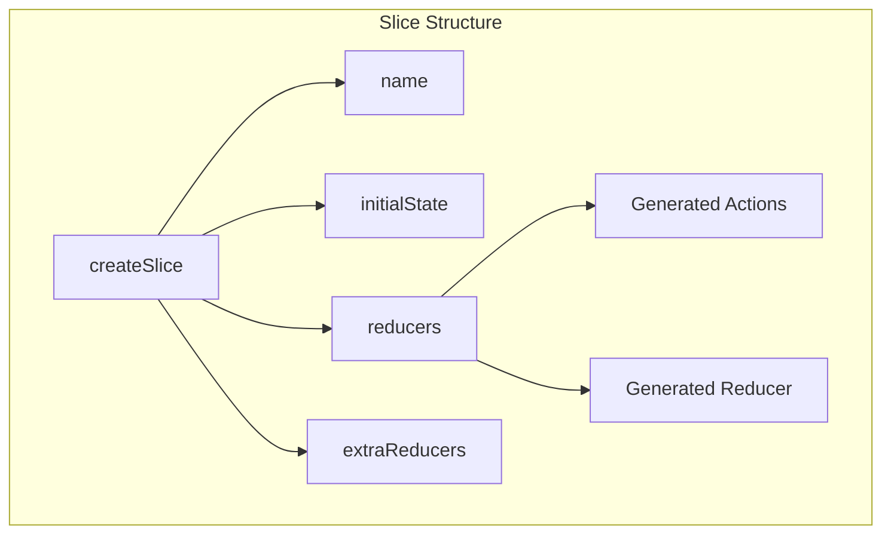
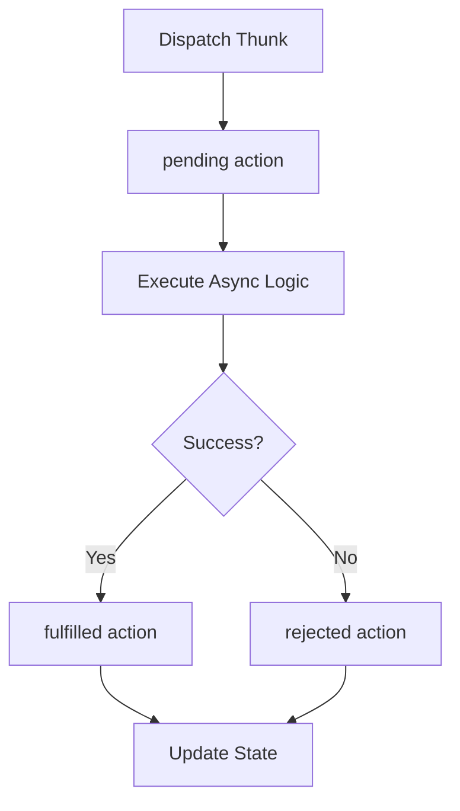
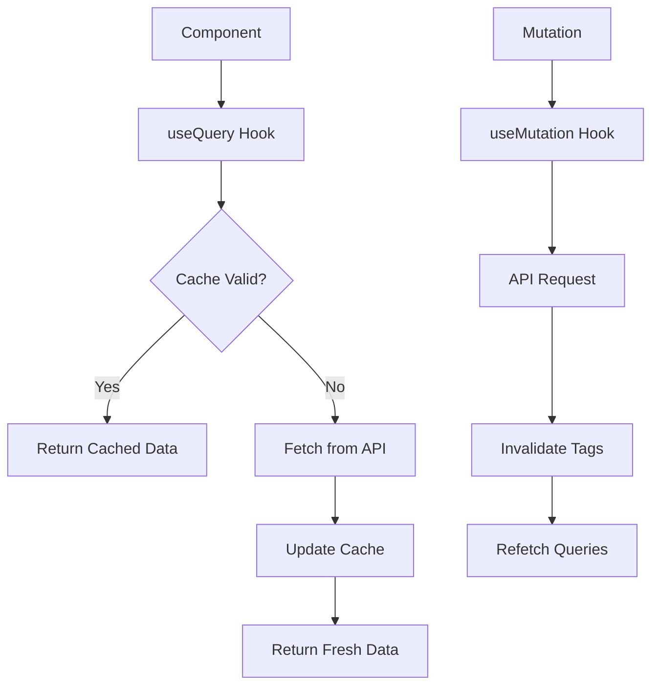

# How to Handle Global State with Redux Toolkit

Author: [nawazdhandala](https://www.github.com/nawazdhandala)

Tags: React, Redux, Redux Toolkit, State Management, JavaScript, TypeScript

Description: A comprehensive guide to managing global state in React applications using Redux Toolkit, including slices, async thunks, and best practices.

---

Redux Toolkit (RTK) is the official, recommended way to write Redux logic. It simplifies store setup, reduces boilerplate, and includes powerful utilities for common use cases. This guide covers everything from basic setup to advanced patterns for managing global state effectively.

## Why Redux Toolkit?

Redux Toolkit addresses common complaints about Redux:

- Too much boilerplate code
- Complex store configuration
- Need for many additional packages
- Difficulty handling immutable updates



## Installation and Setup

```bash
# Install Redux Toolkit and React-Redux
npm install @reduxjs/toolkit react-redux

# For TypeScript projects
npm install @reduxjs/toolkit react-redux @types/react-redux
```

### Basic Store Configuration

```javascript
// store/index.js
import { configureStore } from '@reduxjs/toolkit';
import userReducer from './slices/userSlice';
import productsReducer from './slices/productsSlice';
import cartReducer from './slices/cartSlice';

export const store = configureStore({
  reducer: {
    user: userReducer,
    products: productsReducer,
    cart: cartReducer,
  },
});

// For TypeScript: Export types
export type RootState = ReturnType<typeof store.getState>;
export type AppDispatch = typeof store.dispatch;
```

### Provider Setup

```jsx
// index.jsx or App.jsx
import React from 'react';
import ReactDOM from 'react-dom/client';
import { Provider } from 'react-redux';
import { store } from './store';
import App from './App';

ReactDOM.createRoot(document.getElementById('root')).render(
  <React.StrictMode>
    <Provider store={store}>
      <App />
    </Provider>
  </React.StrictMode>
);
```

## Creating Slices

A slice is a collection of Redux reducer logic and actions for a single feature.



### Basic Slice

```javascript
// store/slices/counterSlice.js
import { createSlice } from '@reduxjs/toolkit';

const initialState = {
  value: 0,
  history: [],
};

const counterSlice = createSlice({
  name: 'counter',
  initialState,
  reducers: {
    // Immer allows "mutating" syntax
    increment: (state) => {
      state.value += 1;
      state.history.push({ action: 'increment', value: state.value });
    },

    decrement: (state) => {
      state.value -= 1;
      state.history.push({ action: 'decrement', value: state.value });
    },

    // Action with payload
    incrementByAmount: (state, action) => {
      state.value += action.payload;
      state.history.push({
        action: 'incrementByAmount',
        amount: action.payload,
        value: state.value
      });
    },

    // Reset state
    reset: () => initialState,
  },
});

// Export actions
export const { increment, decrement, incrementByAmount, reset } = counterSlice.actions;

// Export reducer
export default counterSlice.reducer;

// Selector
export const selectCount = (state) => state.counter.value;
export const selectHistory = (state) => state.counter.history;
```

### Slice with Prepare Callback

```javascript
// store/slices/todosSlice.js
import { createSlice, nanoid } from '@reduxjs/toolkit';

const todosSlice = createSlice({
  name: 'todos',
  initialState: {
    items: [],
    filter: 'all', // 'all' | 'active' | 'completed'
  },
  reducers: {
    // Use prepare callback to customize the action payload
    addTodo: {
      reducer: (state, action) => {
        state.items.push(action.payload);
      },
      prepare: (text) => ({
        payload: {
          id: nanoid(),
          text,
          completed: false,
          createdAt: new Date().toISOString(),
        },
      }),
    },

    toggleTodo: (state, action) => {
      const todo = state.items.find(item => item.id === action.payload);
      if (todo) {
        todo.completed = !todo.completed;
      }
    },

    removeTodo: (state, action) => {
      state.items = state.items.filter(item => item.id !== action.payload);
    },

    setFilter: (state, action) => {
      state.filter = action.payload;
    },

    clearCompleted: (state) => {
      state.items = state.items.filter(item => !item.completed);
    },
  },
});

export const { addTodo, toggleTodo, removeTodo, setFilter, clearCompleted } = todosSlice.actions;
export default todosSlice.reducer;

// Selectors
export const selectAllTodos = (state) => state.todos.items;
export const selectFilter = (state) => state.todos.filter;

export const selectFilteredTodos = (state) => {
  const items = selectAllTodos(state);
  const filter = selectFilter(state);

  switch (filter) {
    case 'active':
      return items.filter(item => !item.completed);
    case 'completed':
      return items.filter(item => item.completed);
    default:
      return items;
  }
};
```

## Async Operations with createAsyncThunk



```javascript
// store/slices/usersSlice.js
import { createSlice, createAsyncThunk } from '@reduxjs/toolkit';

// Async thunk for fetching users
export const fetchUsers = createAsyncThunk(
  'users/fetchUsers',
  async (_, { rejectWithValue }) => {
    try {
      const response = await fetch('/api/users');

      if (!response.ok) {
        throw new Error('Failed to fetch users');
      }

      return await response.json();
    } catch (error) {
      return rejectWithValue(error.message);
    }
  }
);

// Async thunk for creating a user
export const createUser = createAsyncThunk(
  'users/createUser',
  async (userData, { rejectWithValue }) => {
    try {
      const response = await fetch('/api/users', {
        method: 'POST',
        headers: { 'Content-Type': 'application/json' },
        body: JSON.stringify(userData),
      });

      if (!response.ok) {
        const error = await response.json();
        throw new Error(error.message);
      }

      return await response.json();
    } catch (error) {
      return rejectWithValue(error.message);
    }
  }
);

// Async thunk with access to state
export const fetchUserById = createAsyncThunk(
  'users/fetchById',
  async (userId, { getState, rejectWithValue }) => {
    // Check if user is already in cache
    const { users } = getState();
    const existingUser = users.entities[userId];

    if (existingUser) {
      return existingUser;
    }

    try {
      const response = await fetch(`/api/users/${userId}`);
      return await response.json();
    } catch (error) {
      return rejectWithValue(error.message);
    }
  }
);

const usersSlice = createSlice({
  name: 'users',
  initialState: {
    entities: {},
    ids: [],
    loading: 'idle', // 'idle' | 'pending' | 'succeeded' | 'failed'
    error: null,
    currentRequestId: undefined,
  },
  reducers: {
    clearError: (state) => {
      state.error = null;
    },
  },
  extraReducers: (builder) => {
    builder
      // fetchUsers
      .addCase(fetchUsers.pending, (state, action) => {
        if (state.loading === 'idle') {
          state.loading = 'pending';
          state.currentRequestId = action.meta.requestId;
        }
      })
      .addCase(fetchUsers.fulfilled, (state, action) => {
        if (
          state.loading === 'pending' &&
          state.currentRequestId === action.meta.requestId
        ) {
          state.loading = 'succeeded';
          // Normalize the data
          action.payload.forEach(user => {
            state.entities[user.id] = user;
            if (!state.ids.includes(user.id)) {
              state.ids.push(user.id);
            }
          });
        }
      })
      .addCase(fetchUsers.rejected, (state, action) => {
        if (
          state.loading === 'pending' &&
          state.currentRequestId === action.meta.requestId
        ) {
          state.loading = 'failed';
          state.error = action.payload;
        }
      })
      // createUser
      .addCase(createUser.fulfilled, (state, action) => {
        const user = action.payload;
        state.entities[user.id] = user;
        state.ids.push(user.id);
      });
  },
});

export const { clearError } = usersSlice.actions;
export default usersSlice.reducer;

// Selectors
export const selectAllUsers = (state) =>
  state.users.ids.map(id => state.users.entities[id]);

export const selectUserById = (state, userId) =>
  state.users.entities[userId];

export const selectUsersLoading = (state) => state.users.loading;
export const selectUsersError = (state) => state.users.error;
```

## Using Hooks in Components

### Typed Hooks for TypeScript

```typescript
// store/hooks.ts
import { TypedUseSelectorHook, useDispatch, useSelector } from 'react-redux';
import type { RootState, AppDispatch } from './index';

// Use throughout your app instead of plain useDispatch and useSelector
export const useAppDispatch = () => useDispatch<AppDispatch>();
export const useAppSelector: TypedUseSelectorHook<RootState> = useSelector;
```

### Component Examples

```jsx
// components/UserList.jsx
import React, { useEffect } from 'react';
import { useAppDispatch, useAppSelector } from '../store/hooks';
import {
  fetchUsers,
  selectAllUsers,
  selectUsersLoading,
  selectUsersError
} from '../store/slices/usersSlice';

function UserList() {
  const dispatch = useAppDispatch();
  const users = useAppSelector(selectAllUsers);
  const loading = useAppSelector(selectUsersLoading);
  const error = useAppSelector(selectUsersError);

  useEffect(() => {
    if (loading === 'idle') {
      dispatch(fetchUsers());
    }
  }, [loading, dispatch]);

  if (loading === 'pending') {
    return <div>Loading users...</div>;
  }

  if (loading === 'failed') {
    return (
      <div>
        <p>Error: {error}</p>
        <button onClick={() => dispatch(fetchUsers())}>
          Retry
        </button>
      </div>
    );
  }

  return (
    <ul>
      {users.map(user => (
        <li key={user.id}>
          {user.name} - {user.email}
        </li>
      ))}
    </ul>
  );
}

export default UserList;
```

```jsx
// components/Counter.jsx
import React from 'react';
import { useAppDispatch, useAppSelector } from '../store/hooks';
import {
  increment,
  decrement,
  incrementByAmount,
  selectCount
} from '../store/slices/counterSlice';

function Counter() {
  const count = useAppSelector(selectCount);
  const dispatch = useAppDispatch();

  return (
    <div>
      <h2>Count: {count}</h2>
      <div>
        <button onClick={() => dispatch(decrement())}>-</button>
        <button onClick={() => dispatch(increment())}>+</button>
        <button onClick={() => dispatch(incrementByAmount(5))}>+5</button>
      </div>
    </div>
  );
}

export default Counter;
```

## Entity Adapter for Normalized State

```javascript
// store/slices/postsSlice.js
import {
  createSlice,
  createAsyncThunk,
  createEntityAdapter,
  createSelector
} from '@reduxjs/toolkit';

// Create entity adapter
const postsAdapter = createEntityAdapter({
  // Sort by date descending
  sortComparer: (a, b) => b.createdAt.localeCompare(a.createdAt),
});

// Get initial state from adapter
const initialState = postsAdapter.getInitialState({
  loading: 'idle',
  error: null,
});

// Async thunks
export const fetchPosts = createAsyncThunk(
  'posts/fetchAll',
  async () => {
    const response = await fetch('/api/posts');
    return response.json();
  }
);

export const addNewPost = createAsyncThunk(
  'posts/addNew',
  async (postData) => {
    const response = await fetch('/api/posts', {
      method: 'POST',
      headers: { 'Content-Type': 'application/json' },
      body: JSON.stringify(postData),
    });
    return response.json();
  }
);

const postsSlice = createSlice({
  name: 'posts',
  initialState,
  reducers: {
    // Use adapter methods directly
    postUpdated: postsAdapter.updateOne,
    postRemoved: postsAdapter.removeOne,
    postsCleared: postsAdapter.removeAll,
  },
  extraReducers: (builder) => {
    builder
      .addCase(fetchPosts.pending, (state) => {
        state.loading = 'pending';
      })
      .addCase(fetchPosts.fulfilled, (state, action) => {
        state.loading = 'succeeded';
        // Use adapter method to set all posts
        postsAdapter.setAll(state, action.payload);
      })
      .addCase(fetchPosts.rejected, (state, action) => {
        state.loading = 'failed';
        state.error = action.error.message;
      })
      .addCase(addNewPost.fulfilled, postsAdapter.addOne);
  },
});

export const { postUpdated, postRemoved, postsCleared } = postsSlice.actions;
export default postsSlice.reducer;

// Get selectors from adapter
export const {
  selectAll: selectAllPosts,
  selectById: selectPostById,
  selectIds: selectPostIds,
  selectEntities: selectPostEntities,
  selectTotal: selectTotalPosts,
} = postsAdapter.getSelectors((state) => state.posts);

// Custom selectors
export const selectPostsByUser = createSelector(
  [selectAllPosts, (state, userId) => userId],
  (posts, userId) => posts.filter(post => post.userId === userId)
);

export const selectPostsLoading = (state) => state.posts.loading;
```

## RTK Query for Data Fetching

RTK Query is a powerful data fetching and caching tool built into Redux Toolkit.



```javascript
// store/api/apiSlice.js
import { createApi, fetchBaseQuery } from '@reduxjs/toolkit/query/react';

export const apiSlice = createApi({
  reducerPath: 'api',
  baseQuery: fetchBaseQuery({
    baseUrl: '/api',
    prepareHeaders: (headers, { getState }) => {
      // Add auth token to requests
      const token = getState().auth.token;
      if (token) {
        headers.set('Authorization', `Bearer ${token}`);
      }
      return headers;
    },
  }),
  tagTypes: ['Post', 'User', 'Comment'],
  endpoints: (builder) => ({
    // Query endpoints
    getPosts: builder.query({
      query: () => '/posts',
      providesTags: (result) =>
        result
          ? [
              ...result.map(({ id }) => ({ type: 'Post', id })),
              { type: 'Post', id: 'LIST' },
            ]
          : [{ type: 'Post', id: 'LIST' }],
    }),

    getPost: builder.query({
      query: (id) => `/posts/${id}`,
      providesTags: (result, error, id) => [{ type: 'Post', id }],
    }),

    getPostComments: builder.query({
      query: (postId) => `/posts/${postId}/comments`,
      providesTags: (result, error, postId) => [
        { type: 'Comment', id: `POST-${postId}` },
      ],
    }),

    // Mutation endpoints
    addPost: builder.mutation({
      query: (newPost) => ({
        url: '/posts',
        method: 'POST',
        body: newPost,
      }),
      invalidatesTags: [{ type: 'Post', id: 'LIST' }],
    }),

    updatePost: builder.mutation({
      query: ({ id, ...patch }) => ({
        url: `/posts/${id}`,
        method: 'PATCH',
        body: patch,
      }),
      invalidatesTags: (result, error, { id }) => [{ type: 'Post', id }],
    }),

    deletePost: builder.mutation({
      query: (id) => ({
        url: `/posts/${id}`,
        method: 'DELETE',
      }),
      invalidatesTags: (result, error, id) => [
        { type: 'Post', id },
        { type: 'Post', id: 'LIST' },
      ],
    }),

    addComment: builder.mutation({
      query: ({ postId, ...comment }) => ({
        url: `/posts/${postId}/comments`,
        method: 'POST',
        body: comment,
      }),
      invalidatesTags: (result, error, { postId }) => [
        { type: 'Comment', id: `POST-${postId}` },
      ],
    }),
  }),
});

// Export hooks
export const {
  useGetPostsQuery,
  useGetPostQuery,
  useGetPostCommentsQuery,
  useAddPostMutation,
  useUpdatePostMutation,
  useDeletePostMutation,
  useAddCommentMutation,
} = apiSlice;
```

### Store Configuration with RTK Query

```javascript
// store/index.js
import { configureStore } from '@reduxjs/toolkit';
import { apiSlice } from './api/apiSlice';
import authReducer from './slices/authSlice';
import uiReducer from './slices/uiSlice';

export const store = configureStore({
  reducer: {
    auth: authReducer,
    ui: uiReducer,
    [apiSlice.reducerPath]: apiSlice.reducer,
  },
  middleware: (getDefaultMiddleware) =>
    getDefaultMiddleware().concat(apiSlice.middleware),
});
```

### Using RTK Query in Components

```jsx
// components/PostList.jsx
import React from 'react';
import { useGetPostsQuery, useDeletePostMutation } from '../store/api/apiSlice';

function PostList() {
  const {
    data: posts,
    isLoading,
    isError,
    error,
    refetch,
  } = useGetPostsQuery();

  const [deletePost, { isLoading: isDeleting }] = useDeletePostMutation();

  const handleDelete = async (id) => {
    try {
      await deletePost(id).unwrap();
    } catch (err) {
      console.error('Failed to delete post:', err);
    }
  };

  if (isLoading) return <div>Loading posts...</div>;

  if (isError) {
    return (
      <div>
        <p>Error: {error.message}</p>
        <button onClick={refetch}>Retry</button>
      </div>
    );
  }

  return (
    <div>
      <h2>Posts</h2>
      <ul>
        {posts.map(post => (
          <li key={post.id}>
            <h3>{post.title}</h3>
            <p>{post.body}</p>
            <button
              onClick={() => handleDelete(post.id)}
              disabled={isDeleting}
            >
              Delete
            </button>
          </li>
        ))}
      </ul>
    </div>
  );
}

export default PostList;
```

```jsx
// components/AddPostForm.jsx
import React, { useState } from 'react';
import { useAddPostMutation } from '../store/api/apiSlice';

function AddPostForm() {
  const [title, setTitle] = useState('');
  const [body, setBody] = useState('');

  const [addPost, { isLoading, isError, error }] = useAddPostMutation();

  const handleSubmit = async (e) => {
    e.preventDefault();

    try {
      await addPost({ title, body }).unwrap();
      setTitle('');
      setBody('');
    } catch (err) {
      console.error('Failed to add post:', err);
    }
  };

  return (
    <form onSubmit={handleSubmit}>
      <h3>Add New Post</h3>

      {isError && <p className="error">Error: {error.message}</p>}

      <div>
        <label htmlFor="title">Title:</label>
        <input
          id="title"
          value={title}
          onChange={(e) => setTitle(e.target.value)}
          required
        />
      </div>

      <div>
        <label htmlFor="body">Content:</label>
        <textarea
          id="body"
          value={body}
          onChange={(e) => setBody(e.target.value)}
          required
        />
      </div>

      <button type="submit" disabled={isLoading}>
        {isLoading ? 'Adding...' : 'Add Post'}
      </button>
    </form>
  );
}

export default AddPostForm;
```

## Best Practices

### 1. Organize by Feature

```
src/
  features/
    auth/
      authSlice.js
      authApi.js
      Login.jsx
      Register.jsx
    posts/
      postsSlice.js
      postsApi.js
      PostList.jsx
      PostDetail.jsx
  store/
    index.js
    rootReducer.js
```

### 2. Use Selectors with Memoization

```javascript
import { createSelector } from '@reduxjs/toolkit';

// Base selectors
const selectProducts = (state) => state.products.items;
const selectFilters = (state) => state.products.filters;

// Memoized selector
export const selectFilteredProducts = createSelector(
  [selectProducts, selectFilters],
  (products, filters) => {
    return products.filter(product => {
      if (filters.category && product.category !== filters.category) {
        return false;
      }
      if (filters.minPrice && product.price < filters.minPrice) {
        return false;
      }
      if (filters.maxPrice && product.price > filters.maxPrice) {
        return false;
      }
      return true;
    });
  }
);

// Selector with parameters
export const selectProductsByCategory = createSelector(
  [selectProducts, (state, category) => category],
  (products, category) => products.filter(p => p.category === category)
);
```

### 3. Handle Loading States Consistently

```javascript
// Create a reusable loading state pattern
const createLoadingState = () => ({
  status: 'idle', // 'idle' | 'loading' | 'succeeded' | 'failed'
  error: null,
});

const createLoadingReducers = (builder, thunk, adapter) => {
  builder
    .addCase(thunk.pending, (state) => {
      state.status = 'loading';
      state.error = null;
    })
    .addCase(thunk.fulfilled, (state, action) => {
      state.status = 'succeeded';
      if (adapter) {
        adapter.setAll(state, action.payload);
      }
    })
    .addCase(thunk.rejected, (state, action) => {
      state.status = 'failed';
      state.error = action.payload || action.error.message;
    });
};
```

## Summary

Redux Toolkit provides a streamlined approach to Redux development:

| Feature | Purpose |
|---------|---------|
| **configureStore** | Simplified store setup with good defaults |
| **createSlice** | Generate actions and reducers together |
| **createAsyncThunk** | Handle async logic with pending/fulfilled/rejected states |
| **createEntityAdapter** | Manage normalized data collections |
| **RTK Query** | Powerful data fetching and caching |

Key takeaways:

1. Use createSlice to reduce boilerplate in reducers
2. Leverage Immer for intuitive state updates
3. Use createAsyncThunk for API calls and async logic
4. Consider RTK Query for data fetching to eliminate manual cache management
5. Organize code by feature for better maintainability
6. Use memoized selectors to optimize performance
