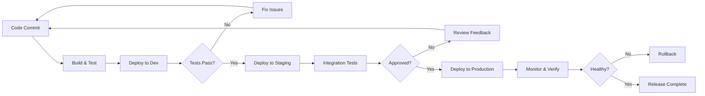

# How to Handle Release Management

Author: [nawazdhandala](https://www.github.com/nawazdhandala)

Tags: Release Management, CI/CD, DevOps, Deployment, GitOps, Automation

Description: A practical guide to implementing effective release management processes, including versioning strategies, deployment pipelines, rollback procedures, and release automation.

---

Release management is the discipline of planning, scheduling, and controlling software releases. Done well, it means shipping features quickly with confidence. Done poorly, it means late-night rollbacks and stressed-out teams. This guide covers practical approaches to making releases boring, which is exactly what you want.

## The Release Management Challenge

Releasing software involves coordinating many moving parts:

- Code changes from multiple developers
- Testing across different environments
- Database migrations
- Configuration updates
- Communication with stakeholders

The goal is to make this process repeatable, automated, and safe.

## Versioning Strategy

A clear versioning strategy makes it easy to track what is deployed where. Semantic versioning (SemVer) is the standard approach.

```bash
# Semantic Versioning: MAJOR.MINOR.PATCH
# MAJOR: Breaking changes
# MINOR: New features, backward compatible
# PATCH: Bug fixes, backward compatible

# Tag a release in git
git tag -a v2.3.1 -m "Fix user authentication timeout issue"
git push origin v2.3.1

# For pre-releases
git tag -a v2.4.0-beta.1 -m "Beta release with new dashboard"
git tag -a v2.4.0-rc.1 -m "Release candidate for testing"
```

Automate version bumping based on commit messages using conventional commits.

```yaml
# .github/workflows/version-bump.yml
name: Version Bump

on:
  push:
    branches: [main]

jobs:
  bump-version:
    runs-on: ubuntu-latest
    steps:
      - uses: actions/checkout@v4
        with:
          fetch-depth: 0

      - name: Bump version and push tag
        uses: anothrNick/github-tag-action@v1
        env:
          GITHUB_TOKEN: ${{ secrets.GITHUB_TOKEN }}
          WITH_V: true
          DEFAULT_BUMP: patch
          # Commit message patterns
          # feat: -> minor bump
          # fix: -> patch bump
          # BREAKING CHANGE: -> major bump
```

## Release Pipeline Architecture

A well-designed release pipeline moves code through environments safely.



## Setting Up the Release Pipeline

Here is a complete GitHub Actions workflow for a release pipeline.

```yaml
# .github/workflows/release.yml
name: Release Pipeline

on:
  push:
    tags:
      - 'v*'

env:
  REGISTRY: ghcr.io
  IMAGE_NAME: ${{ github.repository }}

jobs:
  build:
    runs-on: ubuntu-latest
    outputs:
      version: ${{ steps.meta.outputs.version }}
    steps:
      - uses: actions/checkout@v4

      - name: Extract version from tag
        id: meta
        run: echo "version=${GITHUB_REF#refs/tags/v}" >> $GITHUB_OUTPUT

      - name: Set up Docker Buildx
        uses: docker/setup-buildx-action@v3

      - name: Login to Container Registry
        uses: docker/login-action@v3
        with:
          registry: ${{ env.REGISTRY }}
          username: ${{ github.actor }}
          password: ${{ secrets.GITHUB_TOKEN }}

      - name: Build and push
        uses: docker/build-push-action@v5
        with:
          context: .
          push: true
          tags: |
            ${{ env.REGISTRY }}/${{ env.IMAGE_NAME }}:${{ steps.meta.outputs.version }}
            ${{ env.REGISTRY }}/${{ env.IMAGE_NAME }}:latest
          cache-from: type=gha
          cache-to: type=gha,mode=max

  deploy-staging:
    needs: build
    runs-on: ubuntu-latest
    environment: staging
    steps:
      - uses: actions/checkout@v4

      - name: Deploy to staging
        run: |
          # Update image tag in Kubernetes manifest
          kubectl set image deployment/app \
            app=${{ env.REGISTRY }}/${{ env.IMAGE_NAME }}:${{ needs.build.outputs.version }} \
            --namespace=staging

          # Wait for rollout to complete
          kubectl rollout status deployment/app --namespace=staging --timeout=300s

  integration-tests:
    needs: deploy-staging
    runs-on: ubuntu-latest
    steps:
      - uses: actions/checkout@v4

      - name: Run integration tests
        run: |
          npm ci
          npm run test:integration
        env:
          API_URL: https://staging.example.com

  deploy-production:
    needs: [build, integration-tests]
    runs-on: ubuntu-latest
    environment: production  # Requires manual approval
    steps:
      - uses: actions/checkout@v4

      - name: Deploy to production
        run: |
          kubectl set image deployment/app \
            app=${{ env.REGISTRY }}/${{ env.IMAGE_NAME }}:${{ needs.build.outputs.version }} \
            --namespace=production

          kubectl rollout status deployment/app --namespace=production --timeout=300s

      - name: Verify deployment health
        run: |
          # Run smoke tests against production
          for i in {1..5}; do
            response=$(curl -s -o /dev/null -w "%{http_code}" https://api.example.com/health)
            if [ "$response" != "200" ]; then
              echo "Health check failed with status $response"
              exit 1
            fi
            sleep 10
          done
          echo "Production deployment verified"
```

## GitOps Release Management

GitOps uses Git as the single source of truth for deployments. Changes are made by updating manifests in a repository.

```yaml
# k8s/production/deployment.yaml
apiVersion: apps/v1
kind: Deployment
metadata:
  name: api-server
  namespace: production
  annotations:
    # Track which version is deployed
    app.kubernetes.io/version: "2.3.1"
spec:
  replicas: 5
  strategy:
    type: RollingUpdate
    rollingUpdate:
      maxSurge: 25%
      maxUnavailable: 0
  selector:
    matchLabels:
      app: api-server
  template:
    metadata:
      labels:
        app: api-server
        version: "2.3.1"
    spec:
      containers:
        - name: api-server
          image: ghcr.io/company/api-server:2.3.1
          ports:
            - containerPort: 8080
          resources:
            requests:
              cpu: 200m
              memory: 256Mi
            limits:
              cpu: 500m
              memory: 512Mi
          livenessProbe:
            httpGet:
              path: /health
              port: 8080
            initialDelaySeconds: 10
            periodSeconds: 10
          readinessProbe:
            httpGet:
              path: /ready
              port: 8080
            initialDelaySeconds: 5
            periodSeconds: 5
```

Use ArgoCD to sync the Git repository with your cluster.

```yaml
# argocd/application.yaml
apiVersion: argoproj.io/v1alpha1
kind: Application
metadata:
  name: api-server
  namespace: argocd
spec:
  project: default
  source:
    repoURL: https://github.com/company/k8s-manifests
    targetRevision: main
    path: k8s/production
  destination:
    server: https://kubernetes.default.svc
    namespace: production
  syncPolicy:
    automated:
      prune: true
      selfHeal: true
    syncOptions:
      - CreateNamespace=true
    retry:
      limit: 5
      backoff:
        duration: 5s
        factor: 2
        maxDuration: 3m
```

## Rollback Procedures

Every release needs a tested rollback plan. Automate rollbacks so they can happen quickly under pressure.

```bash
#!/bin/bash
# rollback.sh - Quick rollback script

set -e

DEPLOYMENT=$1
NAMESPACE=${2:-production}

if [ -z "$DEPLOYMENT" ]; then
    echo "Usage: ./rollback.sh <deployment-name> [namespace]"
    exit 1
fi

echo "Current revision:"
kubectl rollout history deployment/$DEPLOYMENT -n $NAMESPACE | tail -3

echo ""
echo "Rolling back to previous revision..."
kubectl rollout undo deployment/$DEPLOYMENT -n $NAMESPACE

echo ""
echo "Waiting for rollback to complete..."
kubectl rollout status deployment/$DEPLOYMENT -n $NAMESPACE --timeout=300s

echo ""
echo "Rollback complete. Current version:"
kubectl get deployment/$DEPLOYMENT -n $NAMESPACE -o jsonpath='{.spec.template.spec.containers[0].image}'
echo ""
```

For database-involved rollbacks, you need to handle migrations carefully.

```python
# rollback_manager.py
import subprocess
import logging
from datetime import datetime

class RollbackManager:
    def __init__(self, deployment_name, namespace="production"):
        self.deployment = deployment_name
        self.namespace = namespace
        self.logger = logging.getLogger(__name__)

    def execute_rollback(self, target_version=None):
        """
        Execute a complete rollback including application and database.
        """
        self.logger.info(f"Starting rollback for {self.deployment}")

        # Step 1: Get current state for audit
        current_version = self._get_current_version()
        self.logger.info(f"Current version: {current_version}")

        # Step 2: Check if database rollback is needed
        if self._needs_db_rollback(current_version, target_version):
            self.logger.info("Database rollback required")
            self._rollback_database(target_version)

        # Step 3: Rollback the application
        self._rollback_application(target_version)

        # Step 4: Verify health
        if not self._verify_health():
            raise Exception("Rollback verification failed")

        self.logger.info("Rollback completed successfully")
        return True

    def _rollback_application(self, target_version):
        """Roll back Kubernetes deployment."""
        if target_version:
            cmd = f"kubectl rollout undo deployment/{self.deployment} " \
                  f"--to-revision={target_version} -n {self.namespace}"
        else:
            cmd = f"kubectl rollout undo deployment/{self.deployment} -n {self.namespace}"

        subprocess.run(cmd, shell=True, check=True)

        # Wait for rollout
        wait_cmd = f"kubectl rollout status deployment/{self.deployment} " \
                   f"-n {self.namespace} --timeout=300s"
        subprocess.run(wait_cmd, shell=True, check=True)

    def _verify_health(self):
        """Verify the rolled back deployment is healthy."""
        import requests
        import time

        for attempt in range(5):
            try:
                response = requests.get(
                    f"https://api.example.com/health",
                    timeout=10
                )
                if response.status_code == 200:
                    return True
            except Exception as e:
                self.logger.warning(f"Health check attempt {attempt + 1} failed: {e}")
            time.sleep(10)

        return False
```

## Release Notes Automation

Generate release notes automatically from commit messages and pull requests.

```yaml
# .github/workflows/release-notes.yml
name: Generate Release Notes

on:
  release:
    types: [published]

jobs:
  release-notes:
    runs-on: ubuntu-latest
    steps:
      - uses: actions/checkout@v4
        with:
          fetch-depth: 0

      - name: Generate changelog
        id: changelog
        uses: mikepenz/release-changelog-builder-action@v4
        with:
          configuration: ".github/changelog-config.json"
        env:
          GITHUB_TOKEN: ${{ secrets.GITHUB_TOKEN }}

      - name: Update release
        uses: softprops/action-gh-release@v1
        with:
          body: ${{ steps.changelog.outputs.changelog }}
```

Configure the changelog generator to categorize changes.

```json
{
  "categories": [
    {
      "title": "## New Features",
      "labels": ["feature", "enhancement"]
    },
    {
      "title": "## Bug Fixes",
      "labels": ["bug", "fix"]
    },
    {
      "title": "## Performance Improvements",
      "labels": ["performance"]
    },
    {
      "title": "## Documentation",
      "labels": ["documentation"]
    },
    {
      "title": "## Other Changes",
      "labels": []
    }
  ],
  "template": "#{{CHANGELOG}}\n\n**Full Changelog**: #{{RELEASE_DIFF}}",
  "pr_template": "- #{{TITLE}} by @#{{AUTHOR}} in ##{{NUMBER}}"
}
```

## Feature Flags for Safe Releases

Feature flags let you deploy code without exposing it to users, reducing release risk.

```typescript
// feature-flags.ts
interface FeatureFlag {
  name: string;
  enabled: boolean;
  rolloutPercentage?: number;
  allowedUsers?: string[];
}

class FeatureFlagService {
  private flags: Map<string, FeatureFlag> = new Map();

  async isEnabled(flagName: string, userId?: string): Promise<boolean> {
    const flag = this.flags.get(flagName);

    if (!flag) {
      return false;
    }

    // Check if globally disabled
    if (!flag.enabled) {
      return false;
    }

    // Check if user is in allowlist
    if (flag.allowedUsers && userId) {
      if (flag.allowedUsers.includes(userId)) {
        return true;
      }
    }

    // Check percentage rollout
    if (flag.rolloutPercentage !== undefined && userId) {
      const hash = this.hashUserId(userId);
      return hash < flag.rolloutPercentage;
    }

    return flag.enabled;
  }

  private hashUserId(userId: string): number {
    // Simple hash for consistent user bucketing
    let hash = 0;
    for (let i = 0; i < userId.length; i++) {
      hash = ((hash << 5) - hash) + userId.charCodeAt(i);
      hash = hash & hash;
    }
    return Math.abs(hash % 100);
  }
}

// Usage in application code
const featureFlags = new FeatureFlagService();

async function handleRequest(req, res) {
  const userId = req.user?.id;

  if (await featureFlags.isEnabled('new-checkout-flow', userId)) {
    return newCheckoutHandler(req, res);
  } else {
    return legacyCheckoutHandler(req, res);
  }
}
```

## Release Communication

Keep stakeholders informed about releases with automated notifications.

```yaml
# .github/workflows/notify-release.yml
name: Notify Release

on:
  release:
    types: [published]

jobs:
  notify:
    runs-on: ubuntu-latest
    steps:
      - name: Send Slack notification
        uses: slackapi/slack-github-action@v1
        with:
          payload: |
            {
              "text": "New Release: ${{ github.event.release.tag_name }}",
              "blocks": [
                {
                  "type": "header",
                  "text": {
                    "type": "plain_text",
                    "text": "Release ${{ github.event.release.tag_name }}"
                  }
                },
                {
                  "type": "section",
                  "text": {
                    "type": "mrkdwn",
                    "text": "${{ github.event.release.body }}"
                  }
                },
                {
                  "type": "actions",
                  "elements": [
                    {
                      "type": "button",
                      "text": {
                        "type": "plain_text",
                        "text": "View Release"
                      },
                      "url": "${{ github.event.release.html_url }}"
                    }
                  ]
                }
              ]
            }
        env:
          SLACK_WEBHOOK_URL: ${{ secrets.SLACK_WEBHOOK_URL }}
```

## Best Practices

1. **Automate everything** - Manual steps are error-prone under pressure
2. **Test rollbacks** - Practice rollbacks regularly, not just during incidents
3. **Use feature flags** - Decouple deployment from release
4. **Keep releases small** - Smaller releases are easier to debug and rollback
5. **Monitor after release** - Watch metrics closely for the first hour
6. **Document procedures** - Runbooks save time during incidents

---

Good release management is about reducing risk while maintaining velocity. Start with automation, add safety checks, and continuously improve based on what goes wrong. The best release is one nobody notices because everything just works.
