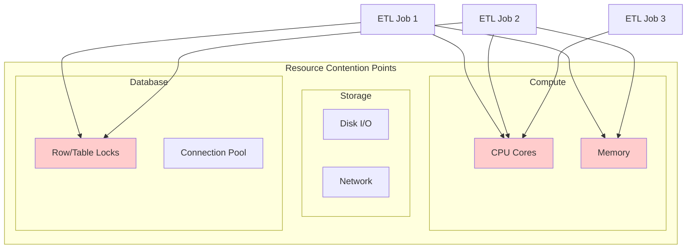

# How to Fix 'Resource Contention' ETL Issues

Author: [nawazdhandala](https://www.github.com/nawazdhandala)

Tags: ETL, Data Engineering, Resource Management, Spark, Airflow, Performance Tuning, Parallel Processing

Description: Learn how to identify and fix resource contention issues in ETL pipelines, including memory conflicts, lock contention, and parallel job optimization.

---

> Resource contention is the silent killer of ETL performance. When multiple jobs compete for CPU, memory, or I/O, everything slows down and pipelines start failing. This guide shows you how to diagnose and fix contention issues in production ETL systems.

Your 2-hour ETL job running for 8 hours is probably fighting for resources. Let's fix that.

---

## Understanding Resource Contention in ETL

Resource contention occurs when multiple processes compete for limited resources:



---

## Diagnosing Resource Contention

### Identify Contention Patterns

```python
# Python script to analyze ETL job overlaps
import pandas as pd
from datetime import datetime, timedelta
import matplotlib.pyplot as plt

def analyze_job_overlaps(job_history):
    """Analyze job execution times to find overlaps"""
    # Create timeline of concurrent jobs
    events = []
    for job in job_history:
        events.append({
            'time': job['start_time'],
            'type': 'start',
            'job': job['name'],
            'resources': job['memory_mb']
        })
        events.append({
            'time': job['end_time'],
            'type': 'end',
            'job': job['name'],
            'resources': -job['memory_mb']
        })

    # Sort by time
    events_df = pd.DataFrame(events).sort_values('time')

    # Calculate concurrent jobs and resource usage
    events_df['concurrent_jobs'] = (events_df['type'] == 'start').cumsum() - \
                                    (events_df['type'] == 'end').cumsum()
    events_df['total_memory'] = events_df['resources'].cumsum()

    # Find peak contention periods
    peak_contention = events_df[events_df['concurrent_jobs'] == events_df['concurrent_jobs'].max()]
    print(f"Peak concurrent jobs: {peak_contention['concurrent_jobs'].iloc[0]}")
    print(f"Peak memory usage: {peak_contention['total_memory'].iloc[0]} MB")

    return events_df

# Example usage
job_history = [
    {'name': 'daily_sales', 'start_time': '2026-01-24 02:00', 'end_time': '2026-01-24 04:30', 'memory_mb': 16000},
    {'name': 'inventory_sync', 'start_time': '2026-01-24 02:30', 'end_time': '2026-01-24 05:00', 'memory_mb': 8000},
    {'name': 'customer_aggregation', 'start_time': '2026-01-24 03:00', 'end_time': '2026-01-24 04:00', 'memory_mb': 12000},
]

overlaps = analyze_job_overlaps(job_history)
```

### Monitor System Resources During ETL

```bash
#!/bin/bash
# Monitor resources during ETL execution

# Start monitoring
echo "Starting resource monitoring for ETL jobs..."

# Monitor CPU and memory every 5 seconds
while true; do
    timestamp=$(date '+%Y-%m-%d %H:%M:%S')

    # CPU usage
    cpu_usage=$(top -bn1 | grep "Cpu(s)" | awk '{print $2}')

    # Memory usage
    mem_info=$(free -m | grep Mem)
    mem_total=$(echo $mem_info | awk '{print $2}')
    mem_used=$(echo $mem_info | awk '{print $3}')
    mem_pct=$((mem_used * 100 / mem_total))

    # Disk I/O
    io_wait=$(iostat -c 1 2 | tail -1 | awk '{print $4}')

    # Log metrics
    echo "$timestamp,CPU:$cpu_usage%,Memory:$mem_pct%,IOWait:$io_wait%" >> /var/log/etl_resources.log

    sleep 5
done
```

---

## Fix 1: Memory Contention in Spark Jobs

### Configure Memory Isolation

```python
# Spark configuration to prevent memory contention
from pyspark.sql import SparkSession

def create_spark_session(job_name, memory_budget_gb):
    """Create Spark session with isolated memory allocation"""

    # Calculate memory fractions based on budget
    executor_memory = int(memory_budget_gb * 0.6)  # 60% for execution
    memory_overhead = int(memory_budget_gb * 0.1)  # 10% overhead

    spark = SparkSession.builder \
        .appName(job_name) \
        .config("spark.executor.memory", f"{executor_memory}g") \
        .config("spark.executor.memoryOverhead", f"{memory_overhead}g") \
        .config("spark.memory.fraction", "0.6") \
        .config("spark.memory.storageFraction", "0.3") \
        .config("spark.sql.shuffle.partitions", "200") \
        .config("spark.dynamicAllocation.enabled", "true") \
        .config("spark.dynamicAllocation.minExecutors", "2") \
        .config("spark.dynamicAllocation.maxExecutors", "50") \
        .config("spark.dynamicAllocation.executorIdleTimeout", "60s") \
        .getOrCreate()

    return spark

# Job-specific configurations
def run_heavy_transformation(df, spark):
    """Run memory-intensive transformation with spill protection"""

    # Configure memory spill to disk when needed
    spark.conf.set("spark.memory.offHeap.enabled", "true")
    spark.conf.set("spark.memory.offHeap.size", "4g")

    # Use disk-based shuffle when memory is constrained
    spark.conf.set("spark.shuffle.spill.compress", "true")
    spark.conf.set("spark.shuffle.compress", "true")

    # Perform transformation with checkpointing
    spark.sparkContext.setCheckpointDir("/tmp/spark-checkpoints")

    result = df.groupBy("customer_id") \
        .agg({"amount": "sum", "quantity": "count"}) \
        .checkpoint()  # Break lineage to free memory

    return result
```

### Partition Data to Reduce Memory Pressure

```python
# Optimize partitioning to prevent skew and memory issues
def repartition_for_processing(df, key_column, target_partition_size_mb=128):
    """Repartition data to optimal size for memory efficiency"""

    # Estimate current data size
    estimated_size_mb = df.rdd.map(lambda row: len(str(row))).sum() / (1024 * 1024)

    # Calculate optimal partition count
    optimal_partitions = max(1, int(estimated_size_mb / target_partition_size_mb))

    # Repartition with salt to handle skew
    from pyspark.sql.functions import concat, lit, rand

    # Add salt to distribute skewed keys
    salted_df = df.withColumn(
        "salt",
        (rand() * 10).cast("int")  # 10 salt buckets
    ).withColumn(
        "salted_key",
        concat(df[key_column], lit("_"), "salt")
    )

    return salted_df.repartition(optimal_partitions, "salted_key")

# Coalesce small partitions after filtering
def optimize_after_filter(df, min_partition_size_mb=64):
    """Coalesce partitions after filtering to prevent small files"""

    current_partitions = df.rdd.getNumPartitions()
    estimated_size_mb = df.rdd.map(lambda row: len(str(row))).sum() / (1024 * 1024)

    optimal_partitions = max(1, int(estimated_size_mb / min_partition_size_mb))

    if optimal_partitions < current_partitions:
        return df.coalesce(optimal_partitions)
    return df
```

---

## Fix 2: Database Lock Contention

### Implement Row-Level Locking Strategy

```python
# PostgreSQL: Avoid lock contention with batch updates
import psycopg2
from psycopg2.extras import execute_batch
import time

class BatchUpdater:
    def __init__(self, connection_string, batch_size=1000):
        self.conn_string = connection_string
        self.batch_size = batch_size

    def update_with_row_locks(self, updates):
        """Update records with minimal lock contention"""

        conn = psycopg2.connect(self.conn_string)
        cursor = conn.cursor()

        try:
            # Process in small batches to reduce lock duration
            for i in range(0, len(updates), self.batch_size):
                batch = updates[i:i + self.batch_size]

                # Use SELECT FOR UPDATE SKIP LOCKED to avoid waiting
                ids = [u['id'] for u in batch]
                cursor.execute("""
                    SELECT id FROM orders
                    WHERE id = ANY(%s)
                    FOR UPDATE SKIP LOCKED
                """, (ids,))

                locked_ids = set(row[0] for row in cursor.fetchall())

                # Update only locked records
                updates_to_apply = [u for u in batch if u['id'] in locked_ids]

                if updates_to_apply:
                    execute_batch(cursor, """
                        UPDATE orders
                        SET status = %(status)s,
                            updated_at = NOW()
                        WHERE id = %(id)s
                    """, updates_to_apply)

                conn.commit()

                # Small delay to let other transactions proceed
                time.sleep(0.1)

        finally:
            cursor.close()
            conn.close()

    def bulk_insert_with_conflict(self, records):
        """Insert records with conflict handling to avoid deadlocks"""

        conn = psycopg2.connect(self.conn_string)
        cursor = conn.cursor()

        try:
            # Use INSERT ON CONFLICT to avoid lock waits
            execute_batch(cursor, """
                INSERT INTO orders (id, customer_id, amount, status)
                VALUES (%(id)s, %(customer_id)s, %(amount)s, %(status)s)
                ON CONFLICT (id) DO UPDATE SET
                    amount = EXCLUDED.amount,
                    status = EXCLUDED.status,
                    updated_at = NOW()
            """, records, page_size=self.batch_size)

            conn.commit()

        finally:
            cursor.close()
            conn.close()
```

### Partition Tables to Reduce Lock Scope

```sql
-- PostgreSQL: Create partitioned table to isolate locks
CREATE TABLE orders (
    id BIGSERIAL,
    order_date DATE NOT NULL,
    customer_id BIGINT,
    amount DECIMAL(10,2),
    status VARCHAR(50),
    created_at TIMESTAMP DEFAULT NOW()
) PARTITION BY RANGE (order_date);

-- Create monthly partitions
CREATE TABLE orders_2026_01 PARTITION OF orders
    FOR VALUES FROM ('2026-01-01') TO ('2026-02-01');

CREATE TABLE orders_2026_02 PARTITION OF orders
    FOR VALUES FROM ('2026-02-01') TO ('2026-03-01');

-- ETL jobs targeting different partitions won't block each other
-- Job 1: Process January data (locks orders_2026_01 only)
UPDATE orders SET status = 'processed'
WHERE order_date >= '2026-01-01' AND order_date < '2026-02-01';

-- Job 2: Process February data (locks orders_2026_02 only - no contention)
UPDATE orders SET status = 'processed'
WHERE order_date >= '2026-02-01' AND order_date < '2026-03-01';
```

---

## Fix 3: Connection Pool Exhaustion

### Configure Connection Pooling Properly

```python
# Python: Use connection pooling to prevent exhaustion
from sqlalchemy import create_engine
from sqlalchemy.pool import QueuePool
import threading

class ConnectionPoolManager:
    _instance = None
    _lock = threading.Lock()

    def __new__(cls, connection_string):
        if cls._instance is None:
            with cls._lock:
                if cls._instance is None:
                    cls._instance = super().__new__(cls)
                    cls._instance._init_pool(connection_string)
        return cls._instance

    def _init_pool(self, connection_string):
        """Initialize connection pool with proper limits"""
        self.engine = create_engine(
            connection_string,
            poolclass=QueuePool,
            pool_size=10,           # Base number of connections
            max_overflow=20,        # Additional connections when pool exhausted
            pool_timeout=30,        # Wait time for connection
            pool_recycle=3600,      # Recycle connections after 1 hour
            pool_pre_ping=True      # Verify connection before use
        )

    def get_connection(self):
        """Get connection from pool with timeout"""
        return self.engine.connect()

    def execute_with_retry(self, query, params=None, max_retries=3):
        """Execute query with retry on connection errors"""
        for attempt in range(max_retries):
            try:
                with self.engine.connect() as conn:
                    result = conn.execute(query, params or {})
                    conn.commit()
                    return result
            except Exception as e:
                if "connection" in str(e).lower() and attempt < max_retries - 1:
                    time.sleep(2 ** attempt)  # Exponential backoff
                    continue
                raise

# Airflow: Configure connection pool per DAG
def get_dag_connection_pool(dag_id, pool_size=5):
    """Create isolated connection pool for DAG"""
    from airflow.hooks.postgres_hook import PostgresHook

    hook = PostgresHook(
        postgres_conn_id='main_db',
        schema='analytics'
    )

    # Override pool settings for this DAG
    engine = hook.get_sqlalchemy_engine()
    engine.pool._pool.maxsize = pool_size

    return engine
```

---

## Fix 4: I/O Contention on Shared Storage

### Implement I/O Throttling

```python
# Throttle I/O operations to prevent contention
import time
import threading
from functools import wraps

class IOThrottler:
    def __init__(self, max_bytes_per_second):
        self.max_bps = max_bytes_per_second
        self.bytes_sent = 0
        self.window_start = time.time()
        self.lock = threading.Lock()

    def throttle(self, bytes_to_send):
        """Throttle I/O to stay within bandwidth limit"""
        with self.lock:
            current_time = time.time()
            window_duration = current_time - self.window_start

            # Reset window every second
            if window_duration >= 1.0:
                self.bytes_sent = 0
                self.window_start = current_time

            # Check if we need to wait
            if self.bytes_sent + bytes_to_send > self.max_bps:
                sleep_time = 1.0 - window_duration
                if sleep_time > 0:
                    time.sleep(sleep_time)
                self.bytes_sent = 0
                self.window_start = time.time()

            self.bytes_sent += bytes_to_send

# Use throttler for file operations
throttler = IOThrottler(max_bytes_per_second=100 * 1024 * 1024)  # 100 MB/s

def throttled_write(file_path, data):
    """Write data with I/O throttling"""
    chunk_size = 1024 * 1024  # 1 MB chunks

    with open(file_path, 'wb') as f:
        for i in range(0, len(data), chunk_size):
            chunk = data[i:i + chunk_size]
            throttler.throttle(len(chunk))
            f.write(chunk)
```

### Schedule Jobs to Avoid I/O Overlap

```python
# Airflow DAG with I/O-aware scheduling
from airflow import DAG
from airflow.operators.python import PythonOperator
from airflow.utils.task_group import TaskGroup
from datetime import datetime, timedelta

default_args = {
    'owner': 'data-engineering',
    'retries': 2,
    'retry_delay': timedelta(minutes=5),
}

with DAG(
    'io_aware_etl',
    default_args=default_args,
    schedule_interval='0 2 * * *',
    start_date=datetime(2026, 1, 1),
    catchup=False,
    max_active_tasks=3,  # Limit concurrent I/O-heavy tasks
) as dag:

    # Group I/O-intensive tasks with concurrency limits
    with TaskGroup("heavy_io_tasks", tooltip="I/O Intensive Operations") as io_group:

        # These run sequentially to avoid I/O contention
        extract_sales = PythonOperator(
            task_id='extract_sales',
            python_callable=extract_sales_data,
            pool='io_pool',  # Use Airflow pool for limiting
            pool_slots=2     # Consume 2 slots from io_pool
        )

        extract_inventory = PythonOperator(
            task_id='extract_inventory',
            python_callable=extract_inventory_data,
            pool='io_pool',
            pool_slots=2
        )

        # Sequential execution within group
        extract_sales >> extract_inventory

    # CPU-intensive tasks can run in parallel
    with TaskGroup("cpu_tasks", tooltip="CPU Intensive Operations") as cpu_group:

        transform_sales = PythonOperator(
            task_id='transform_sales',
            python_callable=transform_sales_data,
            pool='cpu_pool',
            pool_slots=1
        )

        transform_inventory = PythonOperator(
            task_id='transform_inventory',
            python_callable=transform_inventory_data,
            pool='cpu_pool',
            pool_slots=1
        )

    io_group >> cpu_group
```

---

## Fix 5: Parallel Job Coordination with Semaphores

```python
# Coordinate parallel ETL jobs with semaphores
import redis
import time
import uuid

class DistributedSemaphore:
    def __init__(self, redis_client, name, limit):
        self.redis = redis_client
        self.name = f"semaphore:{name}"
        self.limit = limit
        self.token = str(uuid.uuid4())

    def acquire(self, timeout=60):
        """Acquire semaphore slot with timeout"""
        start_time = time.time()

        while time.time() - start_time < timeout:
            # Clean up expired tokens
            self.redis.zremrangebyscore(
                self.name,
                '-inf',
                time.time() - 300  # 5 minute expiry
            )

            # Try to acquire
            current_count = self.redis.zcard(self.name)

            if current_count < self.limit:
                # Add our token with current timestamp
                self.redis.zadd(self.name, {self.token: time.time()})

                # Verify we got in under the limit
                our_rank = self.redis.zrank(self.name, self.token)
                if our_rank is not None and our_rank < self.limit:
                    return True
                else:
                    # We didn't make it, remove our token
                    self.redis.zrem(self.name, self.token)

            time.sleep(1)

        return False

    def release(self):
        """Release semaphore slot"""
        self.redis.zrem(self.name, self.token)

    def __enter__(self):
        if not self.acquire():
            raise TimeoutError(f"Could not acquire semaphore {self.name}")
        return self

    def __exit__(self, exc_type, exc_val, exc_tb):
        self.release()

# Usage in ETL jobs
redis_client = redis.Redis(host='localhost', port=6379)

def run_etl_job(job_name, job_func):
    """Run ETL job with resource coordination"""

    # Limit to 3 concurrent heavy ETL jobs
    semaphore = DistributedSemaphore(redis_client, 'heavy_etl', limit=3)

    with semaphore:
        print(f"Starting {job_name}")
        result = job_func()
        print(f"Completed {job_name}")
        return result
```

---

## Monitoring Resource Contention

```python
# Monitor and alert on resource contention
from prometheus_client import Counter, Gauge, Histogram
import psutil

# Define metrics
etl_memory_usage = Gauge(
    'etl_memory_usage_bytes',
    'Memory usage of ETL job',
    ['job_name']
)

etl_wait_time = Histogram(
    'etl_resource_wait_seconds',
    'Time spent waiting for resources',
    ['job_name', 'resource_type'],
    buckets=[1, 5, 10, 30, 60, 120, 300]
)

etl_contention_events = Counter(
    'etl_contention_events_total',
    'Number of resource contention events',
    ['job_name', 'resource_type']
)

def monitor_job_resources(job_name):
    """Decorator to monitor job resource usage"""
    def decorator(func):
        @wraps(func)
        def wrapper(*args, **kwargs):
            start_time = time.time()
            process = psutil.Process()

            # Record initial memory
            initial_memory = process.memory_info().rss

            try:
                result = func(*args, **kwargs)
                return result
            finally:
                # Record peak memory usage
                peak_memory = process.memory_info().rss
                etl_memory_usage.labels(job_name=job_name).set(peak_memory)

                # Log if memory grew significantly
                if peak_memory > initial_memory * 2:
                    etl_contention_events.labels(
                        job_name=job_name,
                        resource_type='memory'
                    ).inc()

        return wrapper
    return decorator
```

---

## Best Practices

1. **Profile before optimizing** - Identify actual contention points with monitoring
2. **Stagger job schedules** - Avoid starting multiple heavy jobs simultaneously
3. **Use resource pools** - Airflow pools, Spark dynamic allocation, connection pools
4. **Partition data and tables** - Reduce lock scope and enable parallel processing
5. **Implement backpressure** - Slow down producers when consumers are overwhelmed
6. **Monitor continuously** - Track memory, CPU, I/O, and lock wait times
7. **Test at scale** - Contention often only appears at production data volumes

---

## Conclusion

Resource contention can turn fast ETL jobs into slow, unreliable processes. The key fixes are:

- Isolate memory allocations per job
- Use row-level locking and table partitioning
- Configure connection pools with proper limits
- Throttle I/O operations on shared storage
- Coordinate parallel jobs with semaphores

With proper resource management, your ETL pipelines will run predictably and efficiently, even as data volumes grow.

---

*Need to monitor your ETL pipelines? [OneUptime](https://oneuptime.com) provides comprehensive observability for data engineering workflows with real-time alerting on resource contention and job failures.*
