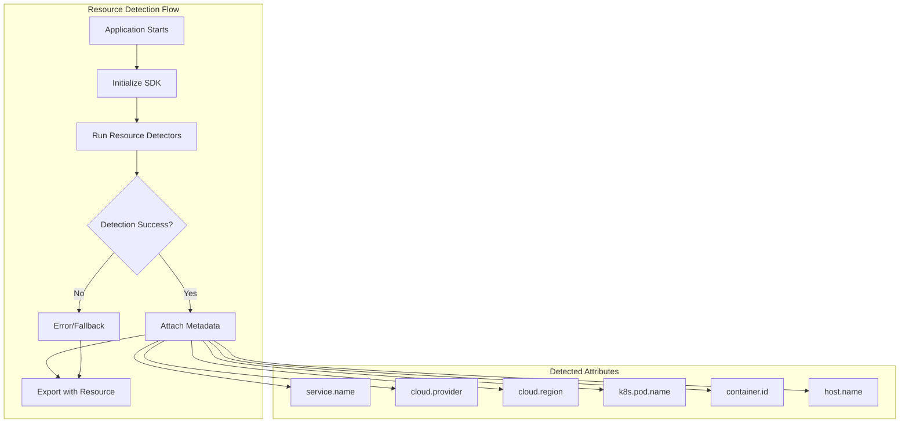
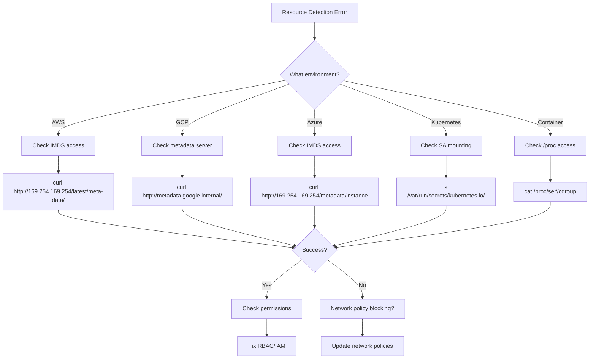

# How to Fix "Resource Detection Failed" Errors

Author: [nawazdhandala](https://www.github.com/nawazdhandala)

Tags: OpenTelemetry, Resource Detection, Debugging, Kubernetes, AWS, GCP, Azure, Docker, Observability

Description: Learn how to diagnose and resolve "Resource Detection Failed" errors in OpenTelemetry, covering common issues with cloud providers, container environments, and custom resource detectors.

---

Resource detection in OpenTelemetry automatically identifies where your application is running and attaches metadata like cloud provider, region, container ID, and Kubernetes pod information to your telemetry. When resource detection fails, you lose valuable context that helps correlate telemetry across services. This guide covers the common causes and solutions.

## Understanding Resource Detection

Resources in OpenTelemetry describe the entity producing telemetry. Resource detectors automatically discover this information from the environment:



## Common Error Messages

### 1. AWS Resource Detection Failed

**Error Message:**
```
Error: Failed to detect AWS EC2 metadata: connect ETIMEDOUT 169.254.169.254:80
```

**Cause:** The application cannot reach the EC2 Instance Metadata Service (IMDS), either because it is not running on EC2 or the metadata service is blocked.

**Solution:**

```typescript
// instrumentation.ts
import { NodeSDK } from '@opentelemetry/sdk-node';
import { Resource } from '@opentelemetry/resources';
import {
  ATTR_SERVICE_NAME,
  ATTR_SERVICE_VERSION
} from '@opentelemetry/semantic-conventions';
import {
  awsEc2Detector,
  awsEcsDetector
} from '@opentelemetry/resource-detector-aws';

// Create a base resource with required attributes
const baseResource = new Resource({
  [ATTR_SERVICE_NAME]: process.env.OTEL_SERVICE_NAME || 'my-service',
  [ATTR_SERVICE_VERSION]: process.env.SERVICE_VERSION || '1.0.0',
});

// Conditionally include AWS detectors only when running on AWS
const resourceDetectors = [];

// Check if running on AWS by looking for metadata service availability
const isRunningOnAws = process.env.AWS_EXECUTION_ENV ||
                       process.env.ECS_CONTAINER_METADATA_URI ||
                       process.env.AWS_REGION;

if (isRunningOnAws) {
  resourceDetectors.push(awsEc2Detector);
  resourceDetectors.push(awsEcsDetector);
}

const sdk = new NodeSDK({
  resource: baseResource,
  resourceDetectors,
  // ... other configuration
});

sdk.start();
```

For EKS with IRSA (IAM Roles for Service Accounts), ensure the metadata service is accessible:

```yaml
# Kubernetes deployment with proper AWS configuration
apiVersion: apps/v1
kind: Deployment
metadata:
  name: my-service
spec:
  template:
    spec:
      serviceAccountName: my-service-sa  # SA with IRSA configured
      containers:
        - name: app
          env:
            # These help detectors understand the environment
            - name: AWS_REGION
              value: "us-east-1"
            - name: OTEL_SERVICE_NAME
              value: "my-service"
```

### 2. GCP Resource Detection Failed

**Error Message:**
```
Error: Failed to detect GCP metadata: request to http://metadata.google.internal failed
```

**Cause:** The GCP metadata server is not accessible, typically because the application is not running on GCP or the metadata service is blocked by network policies.

**Solution:**

```typescript
// gcp-instrumentation.ts
import { NodeSDK } from '@opentelemetry/sdk-node';
import { Resource } from '@opentelemetry/resources';
import { ATTR_SERVICE_NAME } from '@opentelemetry/semantic-conventions';
import { gcpDetector } from '@opentelemetry/resource-detector-gcp';

const baseResource = new Resource({
  [ATTR_SERVICE_NAME]: process.env.OTEL_SERVICE_NAME || 'my-service',
});

// Detect if running on GCP
const isRunningOnGcp = process.env.GOOGLE_CLOUD_PROJECT ||
                       process.env.GCLOUD_PROJECT ||
                       process.env.GCP_PROJECT;

const resourceDetectors = [];
if (isRunningOnGcp) {
  resourceDetectors.push(gcpDetector);
}

const sdk = new NodeSDK({
  resource: baseResource,
  resourceDetectors,
});

sdk.start();
```

For GKE, ensure Workload Identity is properly configured:

```yaml
# GKE deployment with metadata access
apiVersion: apps/v1
kind: Deployment
metadata:
  name: my-service
spec:
  template:
    metadata:
      annotations:
        # Enable GKE metadata server access
        gke-metadata-server: "true"
    spec:
      serviceAccountName: my-gcp-sa
      containers:
        - name: app
          env:
            - name: GOOGLE_CLOUD_PROJECT
              value: "my-project-id"
```

### 3. Azure Resource Detection Failed

**Error Message:**
```
Error: Failed to detect Azure metadata: ECONNREFUSED 169.254.169.254:80
```

**Solution:**

```typescript
// azure-instrumentation.ts
import { NodeSDK } from '@opentelemetry/sdk-node';
import { Resource } from '@opentelemetry/resources';
import { ATTR_SERVICE_NAME } from '@opentelemetry/semantic-conventions';
import { azureAppServiceDetector } from '@opentelemetry/resource-detector-azure';

const baseResource = new Resource({
  [ATTR_SERVICE_NAME]: process.env.OTEL_SERVICE_NAME || 'my-service',
});

// Detect if running on Azure
const isRunningOnAzure = process.env.WEBSITE_SITE_NAME ||  // App Service
                         process.env.AZURE_FUNCTIONS_ENVIRONMENT;  // Functions

const resourceDetectors = [];
if (isRunningOnAzure) {
  resourceDetectors.push(azureAppServiceDetector);
}

const sdk = new NodeSDK({
  resource: baseResource,
  resourceDetectors,
});

sdk.start();
```

### 4. Kubernetes Resource Detection Failed

**Error Message:**
```
Error: Failed to detect Kubernetes metadata: unable to read /var/run/secrets/kubernetes.io/serviceaccount/namespace
```

**Cause:** The Kubernetes service account files are not mounted, or the application does not have permission to read them.

**Solution:**

```yaml
# Kubernetes deployment with proper service account mounting
apiVersion: apps/v1
kind: Deployment
metadata:
  name: my-service
spec:
  template:
    spec:
      # Ensure automountServiceAccountToken is true (default)
      automountServiceAccountToken: true
      containers:
        - name: app
          env:
            # Pass pod information via downward API
            - name: OTEL_RESOURCE_ATTRIBUTES
              value: "k8s.pod.name=$(POD_NAME),k8s.namespace.name=$(POD_NAMESPACE),k8s.node.name=$(NODE_NAME)"
            - name: POD_NAME
              valueFrom:
                fieldRef:
                  fieldPath: metadata.name
            - name: POD_NAMESPACE
              valueFrom:
                fieldRef:
                  fieldPath: metadata.namespace
            - name: NODE_NAME
              valueFrom:
                fieldRef:
                  fieldPath: spec.nodeName
```

```typescript
// kubernetes-instrumentation.ts
import { NodeSDK } from '@opentelemetry/sdk-node';
import { Resource } from '@opentelemetry/resources';
import { ATTR_SERVICE_NAME } from '@opentelemetry/semantic-conventions';
import {
  envDetector,
  processDetector
} from '@opentelemetry/resources';

// Parse OTEL_RESOURCE_ATTRIBUTES environment variable
// Format: key1=value1,key2=value2
function parseResourceAttributes(): Record<string, string> {
  const attrs: Record<string, string> = {};
  const envAttrs = process.env.OTEL_RESOURCE_ATTRIBUTES;

  if (envAttrs) {
    envAttrs.split(',').forEach((pair) => {
      const [key, value] = pair.split('=');
      if (key && value) {
        attrs[key.trim()] = value.trim();
      }
    });
  }

  return attrs;
}

const resourceAttributes = parseResourceAttributes();

const baseResource = new Resource({
  [ATTR_SERVICE_NAME]: process.env.OTEL_SERVICE_NAME || 'my-service',
  ...resourceAttributes,
});

const sdk = new NodeSDK({
  resource: baseResource,
  resourceDetectors: [envDetector, processDetector],
});

sdk.start();
```

### 5. Container ID Detection Failed

**Error Message:**
```
Error: Failed to detect container ID: unable to read /proc/self/cgroup
```

**Cause:** The `/proc` filesystem is not mounted or the application is running in a restricted container environment.

**Solution:**

```yaml
# Docker Compose with proper proc mount
version: '3.8'
services:
  my-service:
    image: my-service:latest
    environment:
      - OTEL_SERVICE_NAME=my-service
      # Manually set container ID if needed
      - CONTAINER_ID=${HOSTNAME}
    volumes:
      # Mount proc filesystem for container detection (read-only)
      - /proc:/host/proc:ro
```

```typescript
// container-detection.ts
import { Resource } from '@opentelemetry/resources';
import * as fs from 'fs';

function detectContainerId(): string | undefined {
  // Try standard cgroup location
  const cgroupPaths = [
    '/proc/self/cgroup',
    '/host/proc/self/cgroup',  // When mounted from host
  ];

  for (const cgroupPath of cgroupPaths) {
    try {
      const content = fs.readFileSync(cgroupPath, 'utf8');
      // Parse container ID from cgroup content
      // Format varies by container runtime
      const match = content.match(/[a-f0-9]{64}/);
      if (match) {
        return match[0];
      }
    } catch {
      // File not accessible, try next
    }
  }

  // Fallback to HOSTNAME (often the container ID in Docker)
  return process.env.HOSTNAME;
}

const containerId = detectContainerId();

const resource = new Resource({
  'service.name': process.env.OTEL_SERVICE_NAME || 'my-service',
  ...(containerId && { 'container.id': containerId }),
});
```

### 6. Process Detection Failed

**Error Message:**
```
Error: Failed to detect process information: permission denied reading /proc/self/status
```

**Solution:**

```typescript
// process-detection.ts
import { Resource } from '@opentelemetry/resources';
import * as os from 'os';

// Manually build process resource when automatic detection fails
function buildProcessResource(): Record<string, string | number> {
  const attrs: Record<string, string | number> = {};

  // Process ID - always available
  attrs['process.pid'] = process.pid;

  // Process command
  if (process.argv[0]) {
    attrs['process.executable.name'] = process.argv[0].split('/').pop() || 'node';
  }

  // Process command line (be careful not to expose secrets)
  const safeArgs = process.argv.filter(
    (arg) => !arg.includes('password') && !arg.includes('secret') && !arg.includes('token')
  );
  attrs['process.command_line'] = safeArgs.join(' ');

  // Runtime version
  attrs['process.runtime.name'] = 'nodejs';
  attrs['process.runtime.version'] = process.version;

  // Host information
  attrs['host.name'] = os.hostname();
  attrs['host.arch'] = os.arch();

  return attrs;
}

const resource = new Resource({
  'service.name': process.env.OTEL_SERVICE_NAME || 'my-service',
  ...buildProcessResource(),
});
```

## Robust Resource Detection Pattern

Create a robust detection setup that handles failures gracefully:

```typescript
// robust-resource-detection.ts
import { NodeSDK } from '@opentelemetry/sdk-node';
import { Resource, ResourceDetectionConfig } from '@opentelemetry/resources';
import {
  ATTR_SERVICE_NAME,
  ATTR_SERVICE_VERSION,
  ATTR_DEPLOYMENT_ENVIRONMENT,
} from '@opentelemetry/semantic-conventions';
import { diag, DiagConsoleLogger, DiagLogLevel } from '@opentelemetry/api';

// Enable diagnostics for debugging
diag.setLogger(new DiagConsoleLogger(), DiagLogLevel.INFO);

// Environment detection helper
function detectEnvironment(): string {
  if (process.env.AWS_EXECUTION_ENV || process.env.ECS_CONTAINER_METADATA_URI) {
    return 'aws';
  }
  if (process.env.GOOGLE_CLOUD_PROJECT || process.env.GCLOUD_PROJECT) {
    return 'gcp';
  }
  if (process.env.WEBSITE_SITE_NAME || process.env.AZURE_FUNCTIONS_ENVIRONMENT) {
    return 'azure';
  }
  if (process.env.KUBERNETES_SERVICE_HOST) {
    return 'kubernetes';
  }
  if (process.env.DOCKER_HOST || fs.existsSync('/.dockerenv')) {
    return 'docker';
  }
  return 'local';
}

// Build resource detectors based on detected environment
async function buildResourceDetectors(): Promise<any[]> {
  const detectors: any[] = [];
  const env = detectEnvironment();

  try {
    switch (env) {
      case 'aws':
        const { awsEc2Detector, awsEcsDetector } = await import(
          '@opentelemetry/resource-detector-aws'
        );
        detectors.push(awsEc2Detector, awsEcsDetector);
        break;

      case 'gcp':
        const { gcpDetector } = await import(
          '@opentelemetry/resource-detector-gcp'
        );
        detectors.push(gcpDetector);
        break;

      case 'azure':
        const { azureAppServiceDetector } = await import(
          '@opentelemetry/resource-detector-azure'
        );
        detectors.push(azureAppServiceDetector);
        break;
    }
  } catch (error) {
    diag.warn(`Failed to load resource detector for ${env}: ${error}`);
  }

  // Always include basic detectors
  const { envDetector, processDetector, hostDetector } = await import(
    '@opentelemetry/resources'
  );
  detectors.push(envDetector, processDetector, hostDetector);

  return detectors;
}

// Main initialization
async function initializeOpenTelemetry() {
  // Build base resource with required attributes
  const baseResource = new Resource({
    [ATTR_SERVICE_NAME]: process.env.OTEL_SERVICE_NAME || 'my-service',
    [ATTR_SERVICE_VERSION]: process.env.SERVICE_VERSION || '1.0.0',
    [ATTR_DEPLOYMENT_ENVIRONMENT]: process.env.ENVIRONMENT || 'development',
    'detected.environment': detectEnvironment(),
  });

  const resourceDetectors = await buildResourceDetectors();

  const sdk = new NodeSDK({
    resource: baseResource,
    resourceDetectors,
    // Handle detection errors gracefully
    autoDetectResources: true,
  });

  // Register error handler for resource detection
  process.on('uncaughtException', (error) => {
    if (error.message.includes('resource detection')) {
      diag.error('Resource detection failed, continuing with base resource', error);
      // Don't crash - continue with base resource
    } else {
      throw error;
    }
  });

  await sdk.start();

  diag.info('OpenTelemetry SDK initialized successfully');

  return sdk;
}

// Usage
initializeOpenTelemetry().catch((error) => {
  console.error('Failed to initialize OpenTelemetry:', error);
});
```

## Debugging Resource Detection



### Debug Script

Create a diagnostic script to test resource detection:

```typescript
// debug-resource-detection.ts
import { diag, DiagConsoleLogger, DiagLogLevel } from '@opentelemetry/api';
import { Resource, detectResourcesSync, envDetector, processDetector, hostDetector } from '@opentelemetry/resources';
import * as http from 'http';
import * as fs from 'fs';

// Enable verbose logging
diag.setLogger(new DiagConsoleLogger(), DiagLogLevel.DEBUG);

async function checkMetadataService(url: string, name: string): Promise<boolean> {
  return new Promise((resolve) => {
    const req = http.get(url, { timeout: 2000 }, (res) => {
      console.log(`[${name}] Status: ${res.statusCode}`);
      resolve(res.statusCode === 200);
    });

    req.on('error', (err) => {
      console.log(`[${name}] Error: ${err.message}`);
      resolve(false);
    });

    req.on('timeout', () => {
      console.log(`[${name}] Timeout`);
      req.destroy();
      resolve(false);
    });
  });
}

async function runDiagnostics() {
  console.log('=== OpenTelemetry Resource Detection Diagnostics ===\n');

  // Check environment variables
  console.log('Environment Variables:');
  const relevantVars = [
    'OTEL_SERVICE_NAME',
    'OTEL_RESOURCE_ATTRIBUTES',
    'AWS_EXECUTION_ENV',
    'ECS_CONTAINER_METADATA_URI',
    'GOOGLE_CLOUD_PROJECT',
    'WEBSITE_SITE_NAME',
    'KUBERNETES_SERVICE_HOST',
  ];

  relevantVars.forEach((varName) => {
    const value = process.env[varName];
    console.log(`  ${varName}: ${value || '(not set)'}`);
  });

  console.log('\n--- Metadata Service Checks ---');

  // Check AWS IMDS
  const awsAvailable = await checkMetadataService(
    'http://169.254.169.254/latest/meta-data/',
    'AWS IMDS'
  );

  // Check GCP metadata
  const gcpAvailable = await checkMetadataService(
    'http://metadata.google.internal/computeMetadata/v1/',
    'GCP Metadata'
  );

  // Check Azure IMDS
  const azureAvailable = await checkMetadataService(
    'http://169.254.169.254/metadata/instance?api-version=2021-02-01',
    'Azure IMDS'
  );

  console.log('\n--- Filesystem Checks ---');

  // Check Kubernetes service account
  const k8sFiles = [
    '/var/run/secrets/kubernetes.io/serviceaccount/namespace',
    '/var/run/secrets/kubernetes.io/serviceaccount/token',
  ];

  k8sFiles.forEach((file) => {
    try {
      fs.accessSync(file, fs.constants.R_OK);
      console.log(`  ${file}: readable`);
    } catch {
      console.log(`  ${file}: not accessible`);
    }
  });

  // Check cgroup for container ID
  try {
    const cgroup = fs.readFileSync('/proc/self/cgroup', 'utf8');
    console.log('  /proc/self/cgroup: readable');
    const containerId = cgroup.match(/[a-f0-9]{64}/);
    if (containerId) {
      console.log(`  Container ID: ${containerId[0].substring(0, 12)}...`);
    }
  } catch {
    console.log('  /proc/self/cgroup: not accessible');
  }

  console.log('\n--- Running Basic Detectors ---');

  // Run basic detectors
  const detectedResource = detectResourcesSync({
    detectors: [envDetector, processDetector, hostDetector],
  });

  console.log('Detected attributes:');
  const attrs = detectedResource.attributes;
  Object.entries(attrs).forEach(([key, value]) => {
    console.log(`  ${key}: ${value}`);
  });

  console.log('\n=== Diagnostics Complete ===');
}

runDiagnostics().catch(console.error);
```

Run the diagnostic script:

```bash
# Run diagnostics
npx ts-node debug-resource-detection.ts
```

## Environment-Specific Configuration

### Docker Compose

```yaml
version: '3.8'
services:
  my-service:
    image: my-service:latest
    environment:
      - OTEL_SERVICE_NAME=my-service
      - OTEL_RESOURCE_ATTRIBUTES=deployment.environment=docker,container.runtime=docker
    volumes:
      # Enable container ID detection
      - /proc:/host/proc:ro
```

### Kubernetes

```yaml
apiVersion: apps/v1
kind: Deployment
metadata:
  name: my-service
spec:
  template:
    spec:
      automountServiceAccountToken: true
      containers:
        - name: app
          env:
            - name: OTEL_SERVICE_NAME
              value: "my-service"
            - name: POD_NAME
              valueFrom:
                fieldRef:
                  fieldPath: metadata.name
            - name: POD_NAMESPACE
              valueFrom:
                fieldRef:
                  fieldPath: metadata.namespace
            - name: NODE_NAME
              valueFrom:
                fieldRef:
                  fieldPath: spec.nodeName
            - name: OTEL_RESOURCE_ATTRIBUTES
              value: "k8s.pod.name=$(POD_NAME),k8s.namespace.name=$(POD_NAMESPACE),k8s.node.name=$(NODE_NAME)"
```

### AWS ECS

```json
{
  "containerDefinitions": [
    {
      "name": "my-service",
      "environment": [
        {
          "name": "OTEL_SERVICE_NAME",
          "value": "my-service"
        },
        {
          "name": "OTEL_RESOURCE_ATTRIBUTES",
          "value": "deployment.environment=ecs"
        }
      ]
    }
  ]
}
```

## Summary

To fix "Resource Detection Failed" errors:

1. **Identify your environment** and only enable relevant detectors
2. **Provide fallback values** through environment variables
3. **Check network access** to metadata services (IMDS, metadata servers)
4. **Verify filesystem permissions** for `/proc` and service account mounts
5. **Use the diagnostic script** to understand what is available
6. **Handle errors gracefully** - don't let detection failures crash your app

The key principle is defense in depth: always define required attributes like `service.name` in code, and treat automatic detection as a bonus that adds context rather than a requirement for your application to function.
