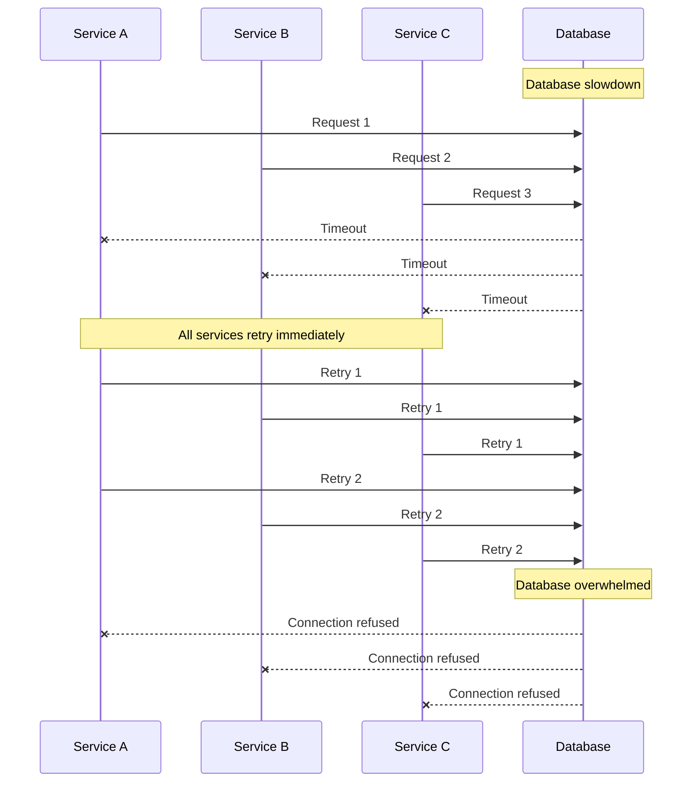
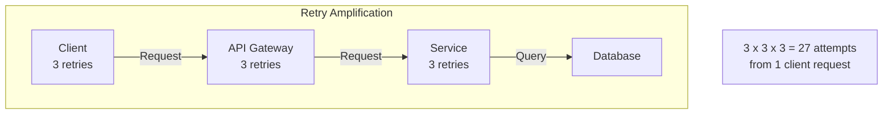
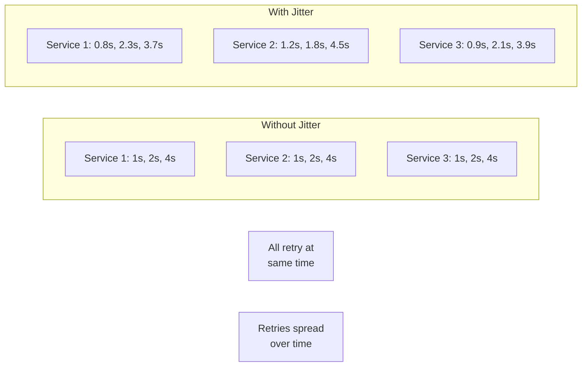
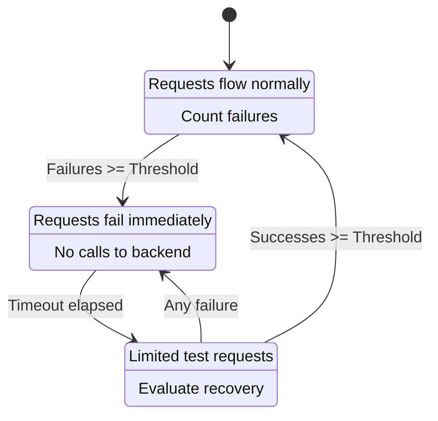
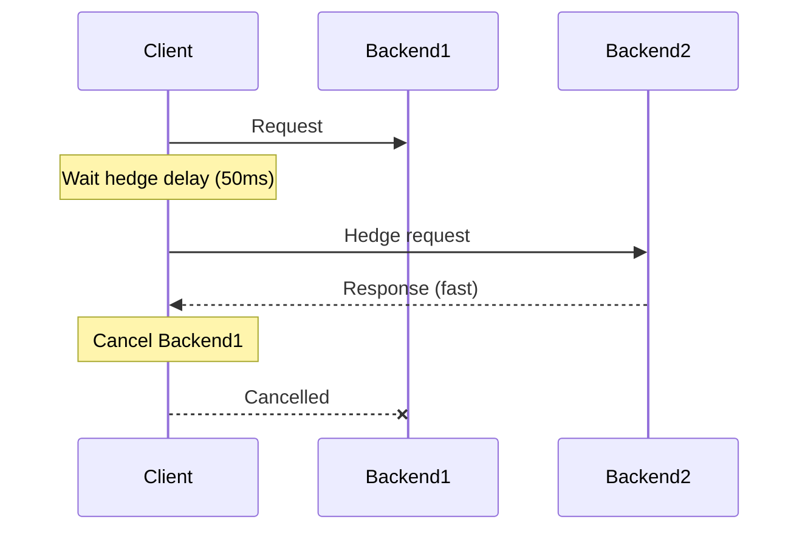

# How to Fix "Retry Storm" Issues in Microservices

Author: [nawazdhandala](https://www.github.com/nawazdhandala)

Tags: Microservices, Retry Storm, Resilience, Circuit Breaker, Backoff, Distributed Systems, Troubleshooting

Description: Learn how to identify and fix retry storm issues in microservices, including exponential backoff, jitter, circuit breakers, and request hedging strategies.

---

A retry storm occurs when multiple services simultaneously retry failed requests, overwhelming a struggling or recovering service. This creates a cascading failure that can bring down your entire system. Understanding and preventing retry storms is critical for microservices reliability.

## Understanding Retry Storms

When a service experiences a temporary failure, well-intentioned retry logic can make things much worse.



The problem amplifies when retries happen at multiple levels of the call chain.



## Identifying Retry Storms

### Signs of a Retry Storm

```go
package monitoring

import (
    "context"
    "time"

    "github.com/prometheus/client_golang/prometheus"
    "github.com/prometheus/client_golang/prometheus/promauto"
)

var (
    // Track retry attempts
    retryAttempts = promauto.NewCounterVec(prometheus.CounterOpts{
        Name: "http_client_retry_attempts_total",
        Help: "Total number of retry attempts",
    }, []string{"service", "endpoint", "attempt"})

    // Track request rate
    requestRate = promauto.NewCounterVec(prometheus.CounterOpts{
        Name: "http_client_requests_total",
        Help: "Total number of requests",
    }, []string{"service", "endpoint", "status"})

    // Track concurrent requests
    concurrentRequests = promauto.NewGaugeVec(prometheus.GaugeOpts{
        Name: "http_client_concurrent_requests",
        Help: "Current number of concurrent requests",
    }, []string{"service"})
)

// InstrumentedClient wraps an HTTP client with metrics
type InstrumentedClient struct {
    client  HTTPClient
    service string
}

// Do executes the request with instrumentation
func (c *InstrumentedClient) Do(ctx context.Context, req *Request) (*Response, error) {
    concurrentRequests.WithLabelValues(c.service).Inc()
    defer concurrentRequests.WithLabelValues(c.service).Dec()

    start := time.Now()
    resp, err := c.client.Do(ctx, req)

    status := "success"
    if err != nil {
        status = "error"
    } else if resp.StatusCode >= 500 {
        status = "server_error"
    }

    requestRate.WithLabelValues(c.service, req.URL.Path, status).Inc()

    return resp, err
}
```

### Prometheus Queries for Detection

```promql
# Detect retry storm: high retry rate
sum(rate(http_client_retry_attempts_total[5m])) by (service)
  / sum(rate(http_client_requests_total[5m])) by (service) > 0.5

# Detect amplification: request rate spike
rate(http_server_requests_total[1m])
  / rate(http_server_requests_total[1m] offset 5m) > 3

# Concurrent connections spike
max_over_time(http_client_concurrent_requests[5m]) > 100
```

## Solution 1: Exponential Backoff with Jitter

The most important fix is adding exponential backoff with jitter to spread out retry attempts.

```go
package retry

import (
    "context"
    "errors"
    "math"
    "math/rand"
    "time"
)

// BackoffConfig configures the backoff behavior
type BackoffConfig struct {
    // Initial delay before first retry
    InitialDelay time.Duration
    // Maximum delay between retries
    MaxDelay time.Duration
    // Multiplier for exponential growth
    Multiplier float64
    // Maximum number of retries
    MaxRetries int
    // Jitter factor (0.0 to 1.0)
    JitterFactor float64
}

// DefaultBackoffConfig returns sensible defaults
func DefaultBackoffConfig() BackoffConfig {
    return BackoffConfig{
        InitialDelay: 100 * time.Millisecond,
        MaxDelay:     30 * time.Second,
        Multiplier:   2.0,
        MaxRetries:   5,
        JitterFactor: 0.5, // 50% jitter
    }
}

// CalculateDelay returns the delay for a given attempt with jitter
func (c BackoffConfig) CalculateDelay(attempt int) time.Duration {
    if attempt <= 0 {
        return 0
    }

    // Calculate exponential delay
    delay := float64(c.InitialDelay) * math.Pow(c.Multiplier, float64(attempt-1))

    // Cap at maximum delay
    if delay > float64(c.MaxDelay) {
        delay = float64(c.MaxDelay)
    }

    // Add jitter: delay * (1 - jitter + random * 2 * jitter)
    // This spreads the delay between (1-jitter)*delay and (1+jitter)*delay
    if c.JitterFactor > 0 {
        jitter := (rand.Float64()*2 - 1) * c.JitterFactor
        delay = delay * (1 + jitter)
    }

    return time.Duration(delay)
}

// Retrier executes functions with retry logic
type Retrier struct {
    config BackoffConfig
}

// NewRetrier creates a new retrier
func NewRetrier(config BackoffConfig) *Retrier {
    return &Retrier{config: config}
}

// Do executes the function with retries
func (r *Retrier) Do(ctx context.Context, fn func() error) error {
    var lastErr error

    for attempt := 0; attempt <= r.config.MaxRetries; attempt++ {
        // Calculate delay (0 for first attempt)
        delay := r.config.CalculateDelay(attempt)

        if delay > 0 {
            select {
            case <-ctx.Done():
                return ctx.Err()
            case <-time.After(delay):
            }
        }

        err := fn()
        if err == nil {
            return nil
        }

        lastErr = err

        // Check if error is retryable
        if !isRetryable(err) {
            return err
        }
    }

    return lastErr
}

func isRetryable(err error) bool {
    // Define which errors should trigger retries
    var retryableErr *RetryableError
    return errors.As(err, &retryableErr)
}

// RetryableError marks an error as retryable
type RetryableError struct {
    Err error
}

func (e *RetryableError) Error() string {
    return e.Err.Error()
}

func (e *RetryableError) Unwrap() error {
    return e.Err
}
```

### Visualizing Jitter Effect



## Solution 2: Circuit Breaker Pattern

Circuit breakers stop retries entirely when a service is clearly failing.

```go
package circuitbreaker

import (
    "errors"
    "sync"
    "time"
)

// State represents the circuit breaker state
type State int

const (
    StateClosed State = iota
    StateOpen
    StateHalfOpen
)

// CircuitBreaker implements the circuit breaker pattern
type CircuitBreaker struct {
    mu sync.RWMutex

    // Configuration
    failureThreshold int
    successThreshold int
    timeout          time.Duration

    // State
    state           State
    failures        int
    successes       int
    lastFailureTime time.Time

    // Callbacks
    onStateChange func(from, to State)
}

// Config holds circuit breaker configuration
type Config struct {
    // Number of failures to open the circuit
    FailureThreshold int
    // Number of successes in half-open to close
    SuccessThreshold int
    // Time to wait before trying again
    Timeout time.Duration
    // Callback for state changes
    OnStateChange func(from, to State)
}

// New creates a new circuit breaker
func New(config Config) *CircuitBreaker {
    return &CircuitBreaker{
        failureThreshold: config.FailureThreshold,
        successThreshold: config.SuccessThreshold,
        timeout:          config.Timeout,
        onStateChange:    config.OnStateChange,
        state:            StateClosed,
    }
}

// ErrCircuitOpen is returned when the circuit is open
var ErrCircuitOpen = errors.New("circuit breaker is open")

// Execute runs the function if the circuit allows
func (cb *CircuitBreaker) Execute(fn func() error) error {
    if !cb.allowRequest() {
        return ErrCircuitOpen
    }

    err := fn()
    cb.recordResult(err == nil)
    return err
}

func (cb *CircuitBreaker) allowRequest() bool {
    cb.mu.Lock()
    defer cb.mu.Unlock()

    switch cb.state {
    case StateClosed:
        return true

    case StateOpen:
        // Check if timeout has passed
        if time.Since(cb.lastFailureTime) > cb.timeout {
            cb.setState(StateHalfOpen)
            return true
        }
        return false

    case StateHalfOpen:
        // Allow limited requests in half-open state
        return true
    }

    return false
}

func (cb *CircuitBreaker) recordResult(success bool) {
    cb.mu.Lock()
    defer cb.mu.Unlock()

    switch cb.state {
    case StateClosed:
        if success {
            cb.failures = 0
        } else {
            cb.failures++
            cb.lastFailureTime = time.Now()
            if cb.failures >= cb.failureThreshold {
                cb.setState(StateOpen)
            }
        }

    case StateHalfOpen:
        if success {
            cb.successes++
            if cb.successes >= cb.successThreshold {
                cb.setState(StateClosed)
            }
        } else {
            cb.setState(StateOpen)
            cb.lastFailureTime = time.Now()
        }
    }
}

func (cb *CircuitBreaker) setState(newState State) {
    if cb.state == newState {
        return
    }

    oldState := cb.state
    cb.state = newState
    cb.failures = 0
    cb.successes = 0

    if cb.onStateChange != nil {
        go cb.onStateChange(oldState, newState)
    }
}

// GetState returns the current state
func (cb *CircuitBreaker) GetState() State {
    cb.mu.RLock()
    defer cb.mu.RUnlock()
    return cb.state
}
```

### Circuit Breaker State Machine



## Solution 3: Adaptive Retry Budget

Limit the total number of retries system-wide using a retry budget.

```go
package retry

import (
    "context"
    "errors"
    "sync"
    "time"
)

// ErrBudgetExhausted is returned when retry budget is exhausted
var ErrBudgetExhausted = errors.New("retry budget exhausted")

// AdaptiveBudget limits retries based on recent success rate
type AdaptiveBudget struct {
    mu sync.Mutex

    // Configuration
    windowSize      time.Duration
    minRetryRatio   float64 // Minimum retry budget (e.g., 0.1 = 10%)
    maxRetryRatio   float64 // Maximum retry budget (e.g., 0.3 = 30%)

    // Sliding window tracking
    requests  []requestRecord
    retries   []time.Time
}

type requestRecord struct {
    timestamp time.Time
    success   bool
}

// NewAdaptiveBudget creates a new adaptive retry budget
func NewAdaptiveBudget(windowSize time.Duration, minRatio, maxRatio float64) *AdaptiveBudget {
    return &AdaptiveBudget{
        windowSize:    windowSize,
        minRetryRatio: minRatio,
        maxRetryRatio: maxRatio,
        requests:      make([]requestRecord, 0),
        retries:       make([]time.Time, 0),
    }
}

// CanRetry checks if a retry is allowed
func (b *AdaptiveBudget) CanRetry() bool {
    b.mu.Lock()
    defer b.mu.Unlock()

    b.cleanup()

    totalRequests := len(b.requests)
    if totalRequests == 0 {
        return true
    }

    // Calculate success rate
    successCount := 0
    for _, r := range b.requests {
        if r.success {
            successCount++
        }
    }
    successRate := float64(successCount) / float64(totalRequests)

    // Higher success rate = higher retry budget
    // Lower success rate = lower retry budget (system is struggling)
    retryRatio := b.minRetryRatio + (b.maxRetryRatio-b.minRetryRatio)*successRate

    // Check if we are within budget
    currentRetryRatio := float64(len(b.retries)) / float64(totalRequests)
    return currentRetryRatio < retryRatio
}

// RecordRequest records a request result
func (b *AdaptiveBudget) RecordRequest(success bool) {
    b.mu.Lock()
    defer b.mu.Unlock()

    b.requests = append(b.requests, requestRecord{
        timestamp: time.Now(),
        success:   success,
    })
}

// RecordRetry records a retry attempt
func (b *AdaptiveBudget) RecordRetry() {
    b.mu.Lock()
    defer b.mu.Unlock()

    b.retries = append(b.retries, time.Now())
}

// cleanup removes old records outside the window
func (b *AdaptiveBudget) cleanup() {
    cutoff := time.Now().Add(-b.windowSize)

    // Clean up requests
    newRequests := make([]requestRecord, 0)
    for _, r := range b.requests {
        if r.timestamp.After(cutoff) {
            newRequests = append(newRequests, r)
        }
    }
    b.requests = newRequests

    // Clean up retries
    newRetries := make([]time.Time, 0)
    for _, t := range b.retries {
        if t.After(cutoff) {
            newRetries = append(newRetries, t)
        }
    }
    b.retries = newRetries
}

// BudgetAwareRetrier uses an adaptive budget
type BudgetAwareRetrier struct {
    budget  *AdaptiveBudget
    backoff BackoffConfig
}

// Do executes with budget-aware retries
func (r *BudgetAwareRetrier) Do(ctx context.Context, fn func() error) error {
    var lastErr error

    for attempt := 0; attempt <= r.backoff.MaxRetries; attempt++ {
        if attempt > 0 {
            // Check budget before retry
            if !r.budget.CanRetry() {
                return ErrBudgetExhausted
            }
            r.budget.RecordRetry()

            delay := r.backoff.CalculateDelay(attempt)
            select {
            case <-ctx.Done():
                return ctx.Err()
            case <-time.After(delay):
            }
        }

        err := fn()
        r.budget.RecordRequest(err == nil)

        if err == nil {
            return nil
        }

        lastErr = err
        if !isRetryable(err) {
            return err
        }
    }

    return lastErr
}
```

## Solution 4: Request Hedging

Instead of waiting and retrying, send requests to multiple backends and use the first response.

```go
package hedging

import (
    "context"
    "sync"
    "time"
)

// Hedger sends parallel requests to reduce tail latency
type Hedger struct {
    // Delay before sending hedge request
    hedgeDelay time.Duration
    // Maximum number of hedge requests
    maxHedges int
}

// NewHedger creates a new hedger
func NewHedger(hedgeDelay time.Duration, maxHedges int) *Hedger {
    return &Hedger{
        hedgeDelay: hedgeDelay,
        maxHedges:  maxHedges,
    }
}

// Result holds the result of a hedged request
type Result struct {
    Value interface{}
    Err   error
}

// Do executes the function with hedging
func (h *Hedger) Do(ctx context.Context, fn func(context.Context) (interface{}, error)) (interface{}, error) {
    // Create a cancellable context for all requests
    ctx, cancel := context.WithCancel(ctx)
    defer cancel()

    // Channel to receive results
    results := make(chan Result, h.maxHedges+1)

    // WaitGroup to track goroutines
    var wg sync.WaitGroup

    // Send initial request
    wg.Add(1)
    go func() {
        defer wg.Done()
        value, err := fn(ctx)
        select {
        case results <- Result{Value: value, Err: err}:
        case <-ctx.Done():
        }
    }()

    // Timer for hedge requests
    hedgeTimer := time.NewTimer(h.hedgeDelay)
    defer hedgeTimer.Stop()

    hedgeCount := 0

    for {
        select {
        case result := <-results:
            if result.Err == nil {
                // Success - cancel other requests and return
                cancel()
                return result.Value, nil
            }
            // Error - wait for other results or send hedge

        case <-hedgeTimer.C:
            // Send hedge request
            if hedgeCount < h.maxHedges {
                hedgeCount++
                wg.Add(1)
                go func() {
                    defer wg.Done()
                    value, err := fn(ctx)
                    select {
                    case results <- Result{Value: value, Err: err}:
                    case <-ctx.Done():
                    }
                }()
                hedgeTimer.Reset(h.hedgeDelay)
            }

        case <-ctx.Done():
            return nil, ctx.Err()
        }
    }
}
```

### Hedging Visualization



## Solution 5: Load Shedding

Protect services by rejecting excess load before it causes failures.

```go
package loadshed

import (
    "errors"
    "sync/atomic"
    "time"
)

// ErrOverloaded is returned when the service is shedding load
var ErrOverloaded = errors.New("service is overloaded")

// LoadShedder rejects requests when the service is overloaded
type LoadShedder struct {
    // Configuration
    maxConcurrent     int64
    maxQueueTime      time.Duration
    cpuThreshold      float64

    // State
    currentConcurrent int64
}

// NewLoadShedder creates a new load shedder
func NewLoadShedder(maxConcurrent int64, maxQueueTime time.Duration) *LoadShedder {
    return &LoadShedder{
        maxConcurrent: maxConcurrent,
        maxQueueTime:  maxQueueTime,
    }
}

// Allow checks if a request should be allowed
func (ls *LoadShedder) Allow() (func(), error) {
    current := atomic.AddInt64(&ls.currentConcurrent, 1)

    if current > ls.maxConcurrent {
        atomic.AddInt64(&ls.currentConcurrent, -1)
        return nil, ErrOverloaded
    }

    // Return a function to call when request completes
    return func() {
        atomic.AddInt64(&ls.currentConcurrent, -1)
    }, nil
}

// Middleware creates an HTTP middleware for load shedding
func (ls *LoadShedder) Middleware(next http.Handler) http.Handler {
    return http.HandlerFunc(func(w http.ResponseWriter, r *http.Request) {
        done, err := ls.Allow()
        if err != nil {
            w.Header().Set("Retry-After", "5")
            http.Error(w, "Service Overloaded", http.StatusServiceUnavailable)
            return
        }
        defer done()

        next.ServeHTTP(w, r)
    })
}
```

## Coordinating Retry Policies Across Services

```yaml
# Kubernetes ConfigMap for retry coordination
apiVersion: v1
kind: ConfigMap
metadata:
  name: retry-policy
  namespace: production
data:
  policy.yaml: |
    # Global retry settings
    defaults:
      maxRetries: 3
      initialDelay: 100ms
      maxDelay: 10s
      multiplier: 2.0
      jitterFactor: 0.5

    # Service-specific overrides
    services:
      payment-service:
        maxRetries: 2
        initialDelay: 200ms
        # Payment is sensitive - fail fast

      inventory-service:
        maxRetries: 5
        maxDelay: 30s
        # Inventory can tolerate longer waits

      notification-service:
        maxRetries: 1
        # Non-critical - minimal retries

    # Disable retries at gateway level when backends have retries
    gatewayRetries: false
```

## Monitoring and Alerting

```yaml
# Prometheus alerting rules for retry storms
groups:
  - name: retry_storm_detection
    rules:
      # Detect high retry rate
      - alert: HighRetryRate
        expr: |
          sum(rate(http_client_retry_attempts_total[5m])) by (service)
          / sum(rate(http_client_requests_total[5m])) by (service) > 0.3
        for: 2m
        labels:
          severity: warning
        annotations:
          summary: "High retry rate detected for {{ $labels.service }}"
          description: "Retry rate is {{ $value | humanizePercentage }}"

      # Detect circuit breaker opening
      - alert: CircuitBreakerOpen
        expr: circuit_breaker_state == 2
        for: 1m
        labels:
          severity: critical
        annotations:
          summary: "Circuit breaker open for {{ $labels.service }}"

      # Detect request amplification
      - alert: RequestAmplification
        expr: |
          sum(rate(http_server_requests_total[1m])) by (service)
          / sum(rate(http_server_requests_total[1m] offset 5m)) by (service) > 5
        for: 2m
        labels:
          severity: critical
        annotations:
          summary: "Request amplification detected for {{ $labels.service }}"
```

## Best Practices Summary

1. Always use exponential backoff with jitter to spread out retries
2. Implement circuit breakers to stop retries to failing services
3. Use adaptive retry budgets to limit system-wide retry impact
4. Consider request hedging for latency-sensitive operations
5. Implement load shedding to protect services under stress
6. Coordinate retry policies across the call chain to prevent amplification
7. Monitor retry rates and set up alerts for retry storms
8. Disable retries at outer layers when inner layers have retry logic
9. Make retry policies configurable and consistent across services
10. Test retry behavior under failure conditions before production

Retry storms are preventable with proper design. The key is to spread out retries, limit their total impact, and fail fast when a service is truly unavailable.
