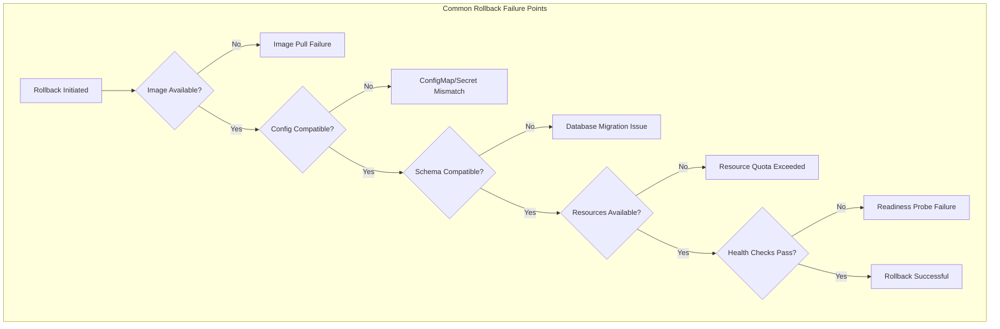
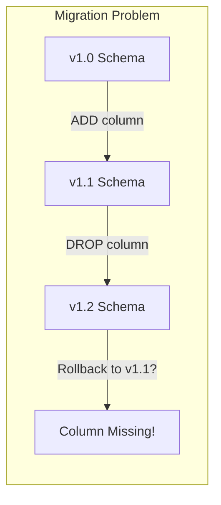

# How to Fix 'Rollback' Deployment Issues

Author: [nawazdhandala](https://www.github.com/nawazdhandala)

Tags: Kubernetes, DevOps, Rollback, Deployment, Troubleshooting, GitOps, CI/CD

Description: Learn how to diagnose and fix common rollback failures in Kubernetes and other deployment systems, including stuck rollbacks, data compatibility issues, and failed health checks.

---

Rolling back a deployment should be your safety net when things go wrong, but rollbacks themselves can fail for various reasons. When your rollback doesn't work, you're in a tough spot with a broken deployment and no easy way back. Understanding why rollbacks fail helps you build more resilient deployment pipelines and recover faster when issues occur.

## Why Rollbacks Fail

Rollbacks are not simply "undo buttons." They involve complex interactions between application versions, data schemas, and infrastructure state.



## Kubernetes Rollback Fundamentals

Understanding how Kubernetes handles rollbacks helps you diagnose issues.

### Checking Rollout History

Before rolling back, examine the available revisions:

```bash
# View deployment rollout history
kubectl rollout history deployment/web-api -n production

# See details of a specific revision
kubectl rollout history deployment/web-api -n production --revision=3

# Example output shows what changed in each revision:
# deployment.apps/web-api
# REVISION  CHANGE-CAUSE
# 1         Initial deployment
# 2         kubectl set image deployment/web-api api=myapp:v1.1.0
# 3         kubectl set image deployment/web-api api=myapp:v1.2.0
```

### Performing a Rollback

Roll back to the previous version or a specific revision:

```bash
# Rollback to the immediately previous revision
kubectl rollout undo deployment/web-api -n production

# Rollback to a specific revision number
kubectl rollout undo deployment/web-api -n production --to-revision=2

# Watch the rollback progress
kubectl rollout status deployment/web-api -n production
```

## Fixing Image Pull Failures During Rollback

The most common rollback failure is when the previous image no longer exists.

### Problem: Image Not Found

```bash
# You'll see this in pod events
kubectl describe pod web-api-abc123 -n production

# Events section shows:
# Warning  Failed   ImagePullBackOff  Failed to pull image "myapp:v1.0.0":
#          rpc error: image not found
```

### Solution: Image Retention Policies

Configure your container registry to retain images:

```yaml
# AWS ECR lifecycle policy - keep last 30 images
{
  "rules": [
    {
      "rulePriority": 1,
      "description": "Keep last 30 production images",
      "selection": {
        "tagStatus": "tagged",
        "tagPrefixList": ["v", "release"],
        "countType": "imageCountMoreThan",
        "countNumber": 30
      },
      "action": {
        "type": "expire"
      }
    }
  ]
}
```

### Solution: Use Immutable Tags

Always use specific version tags, never `latest`:

```yaml
# Good - immutable tag that won't be overwritten
image: myapp:v1.2.3-abc1234

# Bad - tag can point to different images over time
image: myapp:latest
image: myapp:stable
```

## Fixing ConfigMap and Secret Mismatches

Applications often depend on configuration that changes between versions.

### Problem: Missing or Changed Config

When rolling back, the old application version may expect configuration that no longer exists:

```bash
# Check if the deployment references configs that exist
kubectl get deployment web-api -n production -o yaml | grep -A5 "configMapRef\|secretRef"

# Verify the referenced ConfigMaps exist
kubectl get configmap -n production
```

### Solution: Version Your Configuration

Include version information in ConfigMap names:

```yaml
# Create versioned ConfigMaps alongside deployments
apiVersion: v1
kind: ConfigMap
metadata:
  name: web-api-config-v1.2.0
  namespace: production
  labels:
    app: web-api
    version: v1.2.0
data:
  APP_CONFIG: |
    database_pool_size: 10
    cache_ttl: 300
---
apiVersion: apps/v1
kind: Deployment
metadata:
  name: web-api
spec:
  template:
    spec:
      containers:
        - name: api
          image: myapp:v1.2.0
          envFrom:
            - configMapRef:
                # Reference the version-specific ConfigMap
                name: web-api-config-v1.2.0
```

### Solution: Keep Old ConfigMaps

Don't delete old ConfigMaps immediately. Keep them for the rollback window:

```bash
#!/bin/bash
# cleanup-old-configs.sh
# Only delete configs older than 7 days

NAMESPACE="production"
RETENTION_DAYS=7
CUTOFF_DATE=$(date -d "-${RETENTION_DAYS} days" +%s)

for cm in $(kubectl get configmap -n $NAMESPACE -l app=web-api -o name); do
  CREATION_DATE=$(kubectl get $cm -n $NAMESPACE -o jsonpath='{.metadata.creationTimestamp}')
  CREATION_EPOCH=$(date -d "$CREATION_DATE" +%s)

  if [ $CREATION_EPOCH -lt $CUTOFF_DATE ]; then
    echo "Deleting old ConfigMap: $cm"
    kubectl delete $cm -n $NAMESPACE
  fi
done
```

## Fixing Database Migration Issues

Database schema changes are the trickiest part of rollbacks. Forward migrations often cannot be easily reversed.

### Problem: Backward-Incompatible Schema



### Solution: Expand-Contract Pattern

Never drop columns or tables in the same release that stops using them:

```sql
-- Release 1: Add new column (expand)
ALTER TABLE users ADD COLUMN email_verified BOOLEAN DEFAULT false;

-- Release 2: Application uses new column, old column still exists
-- Both v1 and v2 of the app work with this schema

-- Release 3: Remove old column (contract) - only after v1 is no longer deployed
ALTER TABLE users DROP COLUMN email_verified_legacy;
```

### Solution: Backward-Compatible Migrations

Write migrations that work with both old and new application versions:

```python
# migrations/versions/2024_01_add_user_status.py
from alembic import op
import sqlalchemy as sa

def upgrade():
    # Add column with default value so old app version still works
    op.add_column('users',
        sa.Column('status', sa.String(50),
                  nullable=False,
                  server_default='active'))  # Default allows old code to work

def downgrade():
    # Downgrade is safe because we used a default
    op.drop_column('users', 'status')
```

### Solution: Database Rollback Script

For emergencies, maintain a database rollback procedure:

```bash
#!/bin/bash
# db-rollback.sh - Emergency database rollback

set -euo pipefail

BACKUP_FILE=$1
DATABASE_URL=$2

if [ -z "$BACKUP_FILE" ] || [ -z "$DATABASE_URL" ]; then
  echo "Usage: ./db-rollback.sh <backup-file> <database-url>"
  exit 1
fi

echo "WARNING: This will restore the database from backup"
echo "Backup file: $BACKUP_FILE"
read -p "Are you sure? (yes/no): " confirm

if [ "$confirm" != "yes" ]; then
  echo "Aborted"
  exit 1
fi

# Restore from backup
echo "Restoring database..."
pg_restore --clean --if-exists --no-owner \
  --dbname="$DATABASE_URL" \
  "$BACKUP_FILE"

echo "Database restored successfully"
```

## Fixing Stuck Rollbacks

Sometimes rollbacks get stuck in a pending state and never complete.

### Problem: Rollback Not Progressing

```bash
# Check rollout status
kubectl rollout status deployment/web-api -n production
# Output: Waiting for deployment "web-api" rollout to finish: 2 old replicas pending termination

# Check why pods aren't terminating
kubectl get pods -n production -l app=web-api
kubectl describe pod <stuck-pod-name> -n production
```

### Solution: Check Pod Disruption Budgets

PDBs can prevent rollbacks from completing:

```bash
# List PDBs that might be blocking
kubectl get pdb -n production

# Check if PDB is preventing pod termination
kubectl describe pdb web-api-pdb -n production

# Temporarily adjust PDB if necessary (be careful in production!)
kubectl patch pdb web-api-pdb -n production \
  -p '{"spec":{"minAvailable":1}}'
```

### Solution: Force Delete Stuck Pods

As a last resort, force delete stuck pods:

```bash
# First, try graceful deletion with shorter timeout
kubectl delete pod <pod-name> -n production --grace-period=30

# If that doesn't work, force delete (use with caution)
kubectl delete pod <pod-name> -n production --force --grace-period=0

# For stuck terminating pods, you may need to remove finalizers
kubectl patch pod <pod-name> -n production \
  -p '{"metadata":{"finalizers":null}}' --type=merge
```

## Fixing Readiness Probe Failures

Rolled-back pods may fail health checks if probes have changed.

### Problem: Old Version Fails New Probes

```yaml
# New version added a /ready endpoint that old version doesn't have
readinessProbe:
  httpGet:
    path: /ready  # Old version only has /health
    port: 8080
```

### Solution: Backward-Compatible Health Endpoints

Design health endpoints that exist in all versions:

```python
# app.py - Health endpoint that works for rollbacks
from flask import Flask, jsonify

app = Flask(__name__)

@app.route('/health')
def health():
    """Basic health check - exists in all versions"""
    return jsonify({"status": "healthy"}), 200

@app.route('/ready')
def ready():
    """Readiness check - may have additional checks"""
    # Check database connectivity, cache, etc.
    if check_dependencies():
        return jsonify({"status": "ready"}), 200
    return jsonify({"status": "not ready"}), 503

# For backward compatibility, /ready falls back to /health behavior
# if advanced checks aren't implemented
```

## Automated Rollback with Argo Rollouts

Argo Rollouts provides automatic rollback based on metrics:

```yaml
apiVersion: argoproj.io/v1alpha1
kind: Rollout
metadata:
  name: web-api
spec:
  strategy:
    canary:
      steps:
        - setWeight: 10
        - pause: {duration: 5m}
        - setWeight: 50
        - pause: {duration: 10m}
      # Automatically rollback if analysis fails
      analysis:
        templates:
          - templateName: error-rate-check
        startingStep: 1  # Start checking from first canary step
---
apiVersion: argoproj.io/v1alpha1
kind: AnalysisTemplate
metadata:
  name: error-rate-check
spec:
  metrics:
    - name: error-rate
      interval: 1m
      # Rollback if error rate exceeds 5%
      successCondition: result[0] < 0.05
      failureLimit: 3
      provider:
        prometheus:
          address: http://prometheus:9090
          query: |
            sum(rate(http_requests_total{status=~"5.*",app="web-api"}[2m]))
            /
            sum(rate(http_requests_total{app="web-api"}[2m]))
```

## Rollback Testing Strategy

Test your rollback procedures before you need them:

```yaml
# .github/workflows/rollback-test.yml
name: Test Rollback Procedure

on:
  schedule:
    - cron: '0 6 * * 1'  # Weekly on Monday

jobs:
  rollback-test:
    runs-on: ubuntu-latest
    environment: staging
    steps:
      - uses: actions/checkout@v4

      - name: Deploy current version
        run: |
          kubectl apply -f k8s/
          kubectl rollout status deployment/web-api -n staging

      - name: Record current revision
        id: current
        run: |
          echo "revision=$(kubectl rollout history deployment/web-api -n staging | tail -2 | head -1 | awk '{print $1}')" >> $GITHUB_OUTPUT

      - name: Deploy test version
        run: |
          kubectl set image deployment/web-api api=myapp:rollback-test -n staging
          kubectl rollout status deployment/web-api -n staging

      - name: Perform rollback
        run: |
          kubectl rollout undo deployment/web-api -n staging
          kubectl rollout status deployment/web-api -n staging

      - name: Verify rollback
        run: |
          CURRENT_IMAGE=$(kubectl get deployment web-api -n staging -o jsonpath='{.spec.template.spec.containers[0].image}')
          echo "Current image after rollback: $CURRENT_IMAGE"

          # Run smoke tests
          ./scripts/smoke-test.sh staging
```

## Summary

Rollback failures are often more stressful than the original deployment failure because you're already in incident mode. Key takeaways to prevent rollback issues:

1. Retain container images for at least 30 days
2. Version your ConfigMaps and Secrets alongside deployments
3. Use the expand-contract pattern for database migrations
4. Design backward-compatible health check endpoints
5. Monitor PodDisruptionBudgets that might block rollbacks
6. Test your rollback procedures regularly in staging

The best time to discover your rollback doesn't work is during a scheduled test, not during a production incident at 3 AM.
