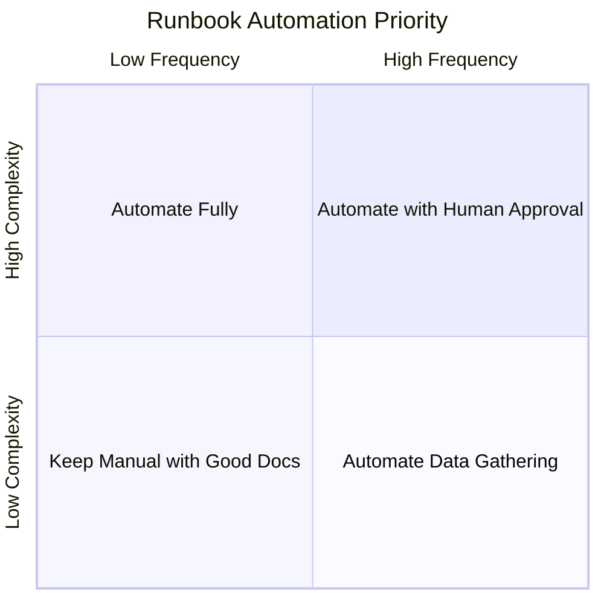
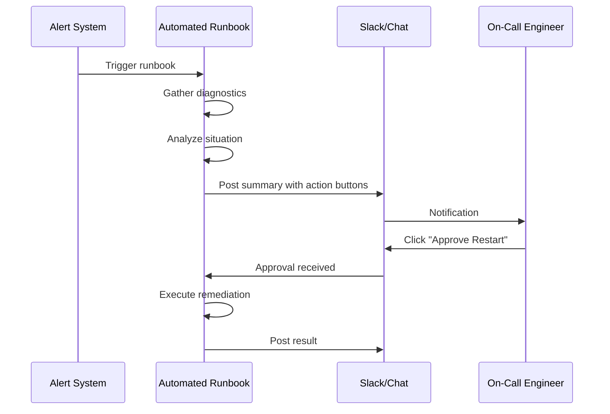

# How to Handle Runbook Automation

Author: [nawazdhandala](https://www.github.com/nawazdhandala)

Tags: Site Reliability Engineering, SRE, Runbooks, Automation, Incident Response, DevOps, Operational Excellence

Description: Learn how to transform manual runbooks into automated workflows that reduce incident response time and eliminate human error during high-stress situations.

---

## The Runbook Dilemma

Every SRE team has runbooks. Documents that describe step-by-step procedures for handling common incidents. The problem is that these runbooks are often outdated, inconsistently formatted, and require human judgment at the worst possible time: 3 AM when the pager goes off.

Runbook automation transforms these documents into executable workflows. The goal is not to replace human judgment but to handle the mechanical parts automatically, freeing engineers to focus on the parts that actually require thinking.

## When to Automate Runbooks

Not every runbook should be automated. Start with procedures that meet these criteria:

- Executed frequently (at least weekly)
- Have predictable steps with clear success/failure conditions
- Do not require complex decision-making
- Have high cost of human error

The following diagram helps categorize your runbooks:



## Building Your First Automated Runbook

Let's walk through automating a common runbook: restarting a service when it becomes unresponsive.

First, here is what the manual runbook looks like:

```markdown
## Runbook: Service Unresponsive

### Symptoms
- Health check failures on service X
- Error rate spike above 5%

### Steps
1. Check if service pods are running: `kubectl get pods -l app=service-x`
2. Check pod logs for errors: `kubectl logs -l app=service-x --tail=100`
3. If OOM killed, increase memory limits
4. If not OOM, perform rolling restart: `kubectl rollout restart deployment/service-x`
5. Monitor recovery for 5 minutes
6. If not recovered, escalate to team lead
```

Now let's convert this to an automated workflow. We will use a script that can be triggered by alerts:

```python
#!/usr/bin/env python3
# automated_runbook.py
# Automated runbook for handling unresponsive service

import subprocess
import time
import json
import logging
from datetime import datetime

logging.basicConfig(level=logging.INFO)
logger = logging.getLogger(__name__)

class RunbookExecutor:
    def __init__(self, service_name, namespace='default'):
        self.service = service_name
        self.namespace = namespace
        self.timeline = []

    def log_step(self, step_name, status, details=None):
        """Record each step for incident timeline."""
        entry = {
            'timestamp': datetime.utcnow().isoformat(),
            'step': step_name,
            'status': status,
            'details': details
        }
        self.timeline.append(entry)
        logger.info(f"[{status}] {step_name}: {details}")

    def check_pod_status(self):
        """Step 1: Check if pods are running."""
        self.log_step("Check Pod Status", "started")

        result = subprocess.run([
            'kubectl', 'get', 'pods',
            '-n', self.namespace,
            '-l', f'app={self.service}',
            '-o', 'json'
        ], capture_output=True, text=True)

        if result.returncode != 0:
            self.log_step("Check Pod Status", "failed", result.stderr)
            return None

        pods = json.loads(result.stdout)
        pod_summary = []

        for pod in pods.get('items', []):
            name = pod['metadata']['name']
            phase = pod['status']['phase']

            # Check for OOM kills
            for container_status in pod['status'].get('containerStatuses', []):
                if container_status.get('lastState', {}).get('terminated', {}).get('reason') == 'OOMKilled':
                    pod_summary.append({'name': name, 'status': 'OOMKilled'})
                else:
                    pod_summary.append({'name': name, 'status': phase})

        self.log_step("Check Pod Status", "completed", pod_summary)
        return pod_summary

    def collect_logs(self):
        """Step 2: Collect recent logs for analysis."""
        self.log_step("Collect Logs", "started")

        result = subprocess.run([
            'kubectl', 'logs',
            '-n', self.namespace,
            '-l', f'app={self.service}',
            '--tail=100',
            '--all-containers=true'
        ], capture_output=True, text=True)

        logs = result.stdout

        # Look for common error patterns
        error_patterns = {
            'oom': 'out of memory' in logs.lower(),
            'connection_refused': 'connection refused' in logs.lower(),
            'timeout': 'timeout' in logs.lower() or 'timed out' in logs.lower(),
            'crash': 'panic' in logs.lower() or 'fatal' in logs.lower()
        }

        self.log_step("Collect Logs", "completed", error_patterns)
        return logs, error_patterns

    def perform_rolling_restart(self):
        """Step 4: Perform rolling restart."""
        self.log_step("Rolling Restart", "started")

        result = subprocess.run([
            'kubectl', 'rollout', 'restart',
            f'deployment/{self.service}',
            '-n', self.namespace
        ], capture_output=True, text=True)

        if result.returncode != 0:
            self.log_step("Rolling Restart", "failed", result.stderr)
            return False

        self.log_step("Rolling Restart", "completed", "Restart initiated")
        return True

    def wait_for_recovery(self, timeout_seconds=300):
        """Step 5: Monitor recovery."""
        self.log_step("Monitor Recovery", "started")

        start_time = time.time()

        while time.time() - start_time < timeout_seconds:
            result = subprocess.run([
                'kubectl', 'rollout', 'status',
                f'deployment/{self.service}',
                '-n', self.namespace,
                '--timeout=30s'
            ], capture_output=True, text=True)

            if result.returncode == 0:
                self.log_step("Monitor Recovery", "completed", "Service recovered")
                return True

            time.sleep(10)

        self.log_step("Monitor Recovery", "failed", "Timeout waiting for recovery")
        return False

    def execute(self):
        """Execute the full runbook."""
        self.log_step("Runbook Execution", "started", self.service)

        # Step 1: Check pod status
        pod_status = self.check_pod_status()
        if pod_status is None:
            return self.escalate("Failed to get pod status")

        # Check for OOM kills
        oom_pods = [p for p in pod_status if p['status'] == 'OOMKilled']
        if oom_pods:
            return self.escalate(
                "OOM kills detected - requires memory limit adjustment",
                auto_remediate=False
            )

        # Step 2: Collect logs
        logs, error_patterns = self.collect_logs()

        # Step 3: Decide on action based on error patterns
        if error_patterns['crash']:
            return self.escalate(
                "Application crash detected - requires code investigation",
                auto_remediate=False
            )

        # Step 4: Perform rolling restart
        if not self.perform_rolling_restart():
            return self.escalate("Rolling restart failed")

        # Step 5: Monitor recovery
        if not self.wait_for_recovery():
            return self.escalate("Service did not recover after restart")

        self.log_step("Runbook Execution", "completed", "Service recovered successfully")
        return {'status': 'success', 'timeline': self.timeline}

    def escalate(self, reason, auto_remediate=True):
        """Escalate to human operator."""
        self.log_step("Escalation", "triggered", reason)

        # In practice, this would page the on-call engineer
        return {
            'status': 'escalated',
            'reason': reason,
            'timeline': self.timeline,
            'auto_remediation_attempted': auto_remediate
        }


if __name__ == '__main__':
    import sys

    service_name = sys.argv[1] if len(sys.argv) > 1 else 'example-service'

    executor = RunbookExecutor(service_name)
    result = executor.execute()

    print(json.dumps(result, indent=2))
```

## Integrating with Alerting Systems

The automated runbook becomes powerful when triggered by alerts. Here is how to integrate with a webhook-based alerting system:

```python
# runbook_webhook.py
# Flask webhook endpoint for alert-triggered runbook execution

from flask import Flask, request, jsonify
from automated_runbook import RunbookExecutor
import threading

app = Flask(__name__)

# Map alert names to runbook configurations
RUNBOOK_MAPPING = {
    'ServiceUnresponsive': {
        'executor': RunbookExecutor,
        'auto_execute': True,
        'require_approval_after_hours': False
    },
    'HighErrorRate': {
        'executor': RunbookExecutor,
        'auto_execute': True,
        'require_approval_after_hours': True
    },
    'DiskSpaceLow': {
        'executor': DiskCleanupExecutor,  # Different runbook
        'auto_execute': True,
        'require_approval_after_hours': False
    }
}

@app.route('/webhook/alert', methods=['POST'])
def handle_alert():
    """Handle incoming alert webhook."""
    alert_data = request.json
    alert_name = alert_data.get('alertname')
    service = alert_data.get('labels', {}).get('service')

    if alert_name not in RUNBOOK_MAPPING:
        return jsonify({
            'status': 'no_runbook',
            'message': f'No automated runbook for alert: {alert_name}'
        }), 200

    config = RUNBOOK_MAPPING[alert_name]

    if not config['auto_execute']:
        return jsonify({
            'status': 'manual_required',
            'message': 'This runbook requires manual execution'
        }), 200

    # Execute runbook in background thread
    executor = config['executor'](service)
    thread = threading.Thread(target=executor.execute)
    thread.start()

    return jsonify({
        'status': 'executing',
        'message': f'Runbook triggered for {service}'
    }), 202


if __name__ == '__main__':
    app.run(host='0.0.0.0', port=8080)
```

## Adding Human Approval Gates

Some runbooks should gather information automatically but wait for human approval before taking action. Here is how to implement approval gates:



## Testing Automated Runbooks

Automated runbooks need testing just like application code. Create a testing framework that validates runbook behavior:

```python
# test_runbook.py
# Unit tests for automated runbooks

import unittest
from unittest.mock import patch, MagicMock
from automated_runbook import RunbookExecutor

class TestRunbookExecutor(unittest.TestCase):

    def setUp(self):
        self.executor = RunbookExecutor('test-service', 'test-namespace')

    @patch('subprocess.run')
    def test_healthy_pods_triggers_restart(self, mock_run):
        """Test that healthy but unresponsive pods get restarted."""
        # Mock kubectl get pods response
        mock_run.return_value = MagicMock(
            returncode=0,
            stdout='{"items": [{"metadata": {"name": "pod-1"}, "status": {"phase": "Running", "containerStatuses": []}}]}'
        )

        pod_status = self.executor.check_pod_status()

        self.assertEqual(len(pod_status), 1)
        self.assertEqual(pod_status[0]['status'], 'Running')

    @patch('subprocess.run')
    def test_oom_killed_triggers_escalation(self, mock_run):
        """Test that OOM killed pods escalate instead of restart."""
        mock_run.return_value = MagicMock(
            returncode=0,
            stdout='''{
                "items": [{
                    "metadata": {"name": "pod-1"},
                    "status": {
                        "phase": "Running",
                        "containerStatuses": [{
                            "lastState": {
                                "terminated": {"reason": "OOMKilled"}
                            }
                        }]
                    }
                }]
            }'''
        )

        pod_status = self.executor.check_pod_status()

        self.assertEqual(pod_status[0]['status'], 'OOMKilled')


if __name__ == '__main__':
    unittest.main()
```

## Measuring Runbook Automation Success

Track these metrics to measure the impact of your automation efforts:

- **Mean Time to Remediation (MTTR)**: Should decrease as automation handles more incidents
- **Human Intervention Rate**: Percentage of runbook executions requiring human action
- **Automation Success Rate**: Percentage of automated remediations that resolve the issue
- **False Positive Rate**: Automated actions taken for non-issues

```yaml
# runbook-metrics.yaml
# Prometheus metrics for runbook automation

metrics:
  - name: runbook_execution_total
    type: counter
    labels: [runbook_name, status, required_escalation]
    help: "Total runbook executions"

  - name: runbook_duration_seconds
    type: histogram
    labels: [runbook_name]
    help: "Time taken to execute runbook"

  - name: runbook_step_duration_seconds
    type: histogram
    labels: [runbook_name, step_name]
    help: "Time taken for each runbook step"
```

## Common Pitfalls to Avoid

**Over-automation**: Not every runbook should be automated. Some procedures require human judgment that cannot be easily codified.

**Missing rollback**: Automated actions should have automated rollback procedures. If an automated restart makes things worse, the system should detect this and revert.

**Silent failures**: Automated runbooks that fail silently are dangerous. Every failure should be logged and escalated.

**Stale automation**: As systems evolve, automated runbooks can become outdated. Review and test your automation regularly.

## Getting Started

Start with your most frequently executed runbook. Automate just the data gathering portion first: collect logs, check metrics, and summarize the situation. This alone saves significant time during incidents.

Once you trust the data gathering, add automated remediation for simple cases while escalating complex situations to humans. Gradually expand automation as you gain confidence in your tooling.

The goal is not to eliminate human involvement but to make human involvement more effective by handling the repetitive parts automatically.
