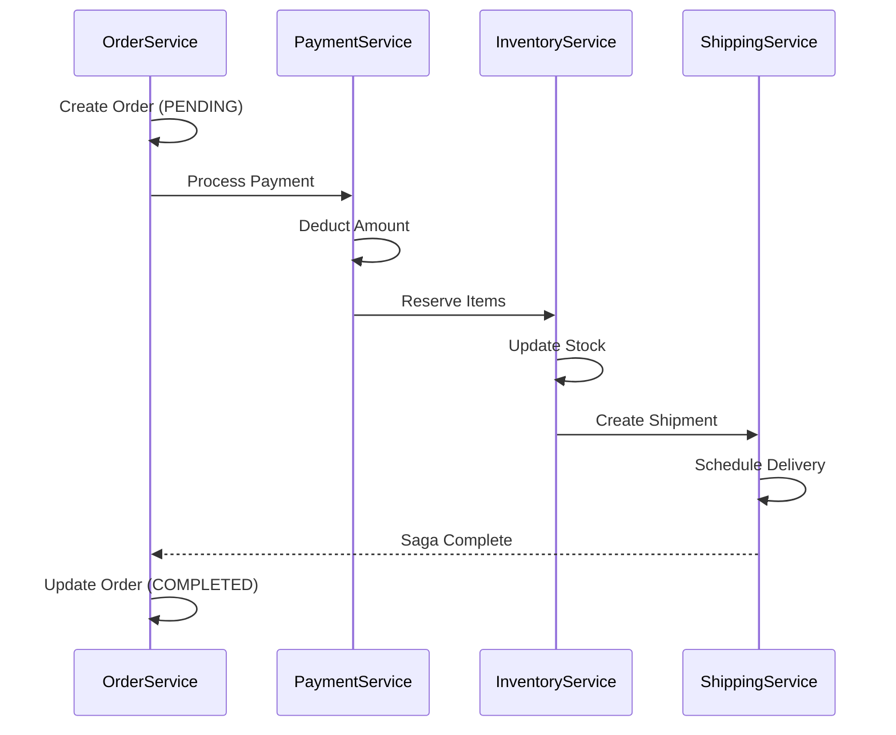
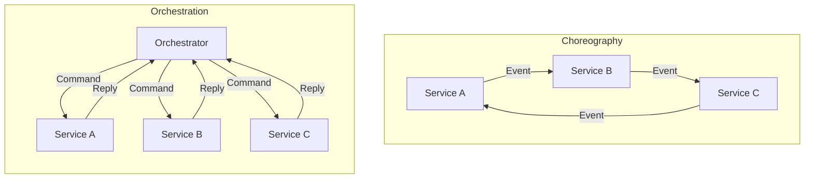
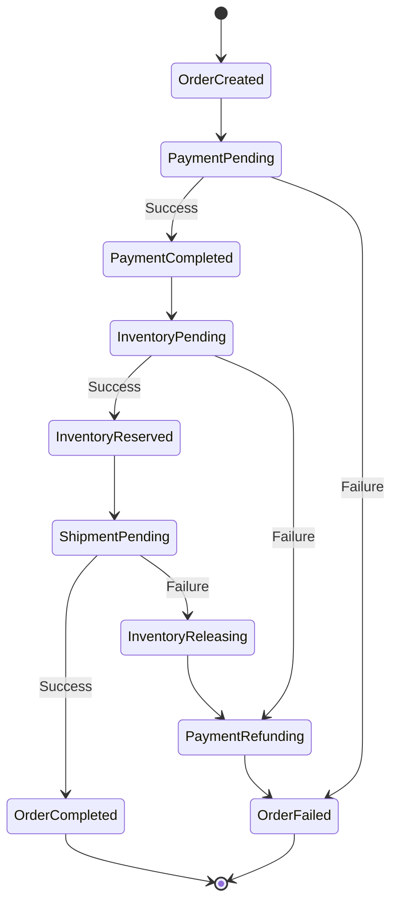

# How to Handle Saga Pattern for Transactions

Author: [nawazdhandala](https://www.github.com/nawazdhandala)

Tags: Microservices, Saga Pattern, Distributed Transactions, Event-Driven, Architecture, Database, Choreography, Orchestration

Description: Learn how to implement the Saga pattern for managing distributed transactions in microservices, including choreography and orchestration approaches.

---

In microservices architectures, maintaining data consistency across multiple services is challenging because traditional ACID transactions do not span service boundaries. The Saga pattern solves this by breaking a distributed transaction into a sequence of local transactions with compensating actions.

## Understanding the Saga Pattern

A saga is a sequence of local transactions where each transaction updates a single service. If one transaction fails, compensating transactions undo the changes made by preceding transactions.



## Saga Implementation Approaches

There are two main approaches to implementing sagas: choreography and orchestration.



## Choreography-Based Saga

In choreography, each service listens for events and decides when to act. There is no central coordinator.

### Event Definitions

```go
package events

import (
    "time"
)

// OrderCreated is published when a new order is created
type OrderCreated struct {
    OrderID     string    `json:"order_id"`
    CustomerID  string    `json:"customer_id"`
    Items       []Item    `json:"items"`
    TotalAmount float64   `json:"total_amount"`
    CreatedAt   time.Time `json:"created_at"`
}

// PaymentProcessed is published when payment succeeds
type PaymentProcessed struct {
    OrderID       string    `json:"order_id"`
    TransactionID string    `json:"transaction_id"`
    Amount        float64   `json:"amount"`
    ProcessedAt   time.Time `json:"processed_at"`
}

// PaymentFailed is published when payment fails
type PaymentFailed struct {
    OrderID   string    `json:"order_id"`
    Reason    string    `json:"reason"`
    FailedAt  time.Time `json:"failed_at"`
}

// InventoryReserved is published when inventory is reserved
type InventoryReserved struct {
    OrderID      string    `json:"order_id"`
    ReservationID string   `json:"reservation_id"`
    Items        []Item    `json:"items"`
    ReservedAt   time.Time `json:"reserved_at"`
}

// InventoryReservationFailed is published when reservation fails
type InventoryReservationFailed struct {
    OrderID  string    `json:"order_id"`
    Reason   string    `json:"reason"`
    FailedAt time.Time `json:"failed_at"`
}

// Item represents an order item
type Item struct {
    ProductID string `json:"product_id"`
    Quantity  int    `json:"quantity"`
    Price     float64 `json:"price"`
}
```

### Order Service Implementation

```go
package order

import (
    "context"
    "encoding/json"
    "fmt"
    "time"

    "github.com/segmentio/kafka-go"
)

// OrderStatus represents the order state
type OrderStatus string

const (
    StatusPending   OrderStatus = "PENDING"
    StatusConfirmed OrderStatus = "CONFIRMED"
    StatusFailed    OrderStatus = "FAILED"
    StatusCancelled OrderStatus = "CANCELLED"
)

// Order represents an order entity
type Order struct {
    ID          string      `json:"id"`
    CustomerID  string      `json:"customer_id"`
    Items       []Item      `json:"items"`
    TotalAmount float64     `json:"total_amount"`
    Status      OrderStatus `json:"status"`
    CreatedAt   time.Time   `json:"created_at"`
    UpdatedAt   time.Time   `json:"updated_at"`
}

// OrderService handles order operations
type OrderService struct {
    repo     OrderRepository
    producer *kafka.Writer
}

// CreateOrder creates a new order and publishes OrderCreated event
func (s *OrderService) CreateOrder(ctx context.Context, req CreateOrderRequest) (*Order, error) {
    // Create order in PENDING state
    order := &Order{
        ID:          generateID(),
        CustomerID:  req.CustomerID,
        Items:       req.Items,
        TotalAmount: calculateTotal(req.Items),
        Status:      StatusPending,
        CreatedAt:   time.Now(),
        UpdatedAt:   time.Now(),
    }

    // Save to database
    if err := s.repo.Save(ctx, order); err != nil {
        return nil, fmt.Errorf("saving order: %w", err)
    }

    // Publish OrderCreated event to start the saga
    event := OrderCreated{
        OrderID:     order.ID,
        CustomerID:  order.CustomerID,
        Items:       order.Items,
        TotalAmount: order.TotalAmount,
        CreatedAt:   order.CreatedAt,
    }

    if err := s.publishEvent(ctx, "order.created", event); err != nil {
        // Log error but do not fail - event can be retried
        fmt.Printf("Failed to publish OrderCreated event: %v\n", err)
    }

    return order, nil
}

// HandleShipmentCreated completes the saga
func (s *OrderService) HandleShipmentCreated(ctx context.Context, event ShipmentCreated) error {
    order, err := s.repo.FindByID(ctx, event.OrderID)
    if err != nil {
        return fmt.Errorf("finding order: %w", err)
    }

    order.Status = StatusConfirmed
    order.UpdatedAt = time.Now()

    if err := s.repo.Save(ctx, order); err != nil {
        return fmt.Errorf("updating order: %w", err)
    }

    return nil
}

// HandlePaymentFailed compensates by cancelling the order
func (s *OrderService) HandlePaymentFailed(ctx context.Context, event PaymentFailed) error {
    order, err := s.repo.FindByID(ctx, event.OrderID)
    if err != nil {
        return fmt.Errorf("finding order: %w", err)
    }

    order.Status = StatusFailed
    order.UpdatedAt = time.Now()

    if err := s.repo.Save(ctx, order); err != nil {
        return fmt.Errorf("updating order: %w", err)
    }

    return nil
}

func (s *OrderService) publishEvent(ctx context.Context, topic string, event interface{}) error {
    data, err := json.Marshal(event)
    if err != nil {
        return fmt.Errorf("marshaling event: %w", err)
    }

    return s.producer.WriteMessages(ctx, kafka.Message{
        Topic: topic,
        Value: data,
    })
}
```

### Payment Service Implementation

```go
package payment

import (
    "context"
    "fmt"
    "time"
)

// PaymentService handles payment operations
type PaymentService struct {
    repo     PaymentRepository
    gateway  PaymentGateway
    producer EventProducer
}

// HandleOrderCreated processes payment for new order
func (s *PaymentService) HandleOrderCreated(ctx context.Context, event OrderCreated) error {
    // Check for idempotency - has this order already been processed?
    existing, err := s.repo.FindByOrderID(ctx, event.OrderID)
    if err == nil && existing != nil {
        // Already processed, skip
        return nil
    }

    // Process payment through gateway
    result, err := s.gateway.Charge(ctx, ChargeRequest{
        CustomerID: event.CustomerID,
        Amount:     event.TotalAmount,
        OrderID:    event.OrderID,
    })

    if err != nil {
        // Payment failed - publish failure event
        failEvent := PaymentFailed{
            OrderID:  event.OrderID,
            Reason:   err.Error(),
            FailedAt: time.Now(),
        }
        return s.producer.Publish(ctx, "payment.failed", failEvent)
    }

    // Save payment record
    payment := &Payment{
        ID:            generateID(),
        OrderID:       event.OrderID,
        TransactionID: result.TransactionID,
        Amount:        event.TotalAmount,
        Status:        StatusCompleted,
        CreatedAt:     time.Now(),
    }

    if err := s.repo.Save(ctx, payment); err != nil {
        return fmt.Errorf("saving payment: %w", err)
    }

    // Publish success event
    successEvent := PaymentProcessed{
        OrderID:       event.OrderID,
        TransactionID: result.TransactionID,
        Amount:        event.TotalAmount,
        ProcessedAt:   time.Now(),
    }

    return s.producer.Publish(ctx, "payment.processed", successEvent)
}

// HandleInventoryReservationFailed compensates by refunding payment
func (s *PaymentService) HandleInventoryReservationFailed(ctx context.Context, event InventoryReservationFailed) error {
    payment, err := s.repo.FindByOrderID(ctx, event.OrderID)
    if err != nil {
        return fmt.Errorf("finding payment: %w", err)
    }

    // Refund through gateway
    if err := s.gateway.Refund(ctx, payment.TransactionID, payment.Amount); err != nil {
        return fmt.Errorf("refunding payment: %w", err)
    }

    payment.Status = StatusRefunded
    payment.UpdatedAt = time.Now()

    if err := s.repo.Save(ctx, payment); err != nil {
        return fmt.Errorf("updating payment: %w", err)
    }

    // Publish refund event
    refundEvent := PaymentRefunded{
        OrderID:       event.OrderID,
        TransactionID: payment.TransactionID,
        Amount:        payment.Amount,
        RefundedAt:    time.Now(),
    }

    return s.producer.Publish(ctx, "payment.refunded", refundEvent)
}
```

## Orchestration-Based Saga

In orchestration, a central coordinator manages the saga execution and compensation.



### Saga Orchestrator Implementation

```go
package saga

import (
    "context"
    "fmt"
    "time"
)

// SagaState represents the current state of a saga
type SagaState string

const (
    StateOrderCreated      SagaState = "ORDER_CREATED"
    StatePaymentPending    SagaState = "PAYMENT_PENDING"
    StatePaymentCompleted  SagaState = "PAYMENT_COMPLETED"
    StateInventoryPending  SagaState = "INVENTORY_PENDING"
    StateInventoryReserved SagaState = "INVENTORY_RESERVED"
    StateShipmentPending   SagaState = "SHIPMENT_PENDING"
    StateCompleted         SagaState = "COMPLETED"
    StateFailed            SagaState = "FAILED"
    StateCompensating      SagaState = "COMPENSATING"
)

// OrderSaga represents the saga instance
type OrderSaga struct {
    ID             string            `json:"id"`
    OrderID        string            `json:"order_id"`
    State          SagaState         `json:"state"`
    Data           map[string]string `json:"data"`
    CompletedSteps []string          `json:"completed_steps"`
    CreatedAt      time.Time         `json:"created_at"`
    UpdatedAt      time.Time         `json:"updated_at"`
}

// SagaOrchestrator coordinates the saga execution
type SagaOrchestrator struct {
    repo             SagaRepository
    orderService     OrderServiceClient
    paymentService   PaymentServiceClient
    inventoryService InventoryServiceClient
    shippingService  ShippingServiceClient
}

// StartSaga initiates a new order saga
func (o *SagaOrchestrator) StartSaga(ctx context.Context, orderID string) error {
    saga := &OrderSaga{
        ID:             generateID(),
        OrderID:        orderID,
        State:          StateOrderCreated,
        Data:           make(map[string]string),
        CompletedSteps: []string{},
        CreatedAt:      time.Now(),
        UpdatedAt:      time.Now(),
    }

    if err := o.repo.Save(ctx, saga); err != nil {
        return fmt.Errorf("saving saga: %w", err)
    }

    return o.processStep(ctx, saga)
}

// processStep executes the next step based on current state
func (o *SagaOrchestrator) processStep(ctx context.Context, saga *OrderSaga) error {
    switch saga.State {
    case StateOrderCreated:
        return o.processPayment(ctx, saga)
    case StatePaymentCompleted:
        return o.reserveInventory(ctx, saga)
    case StateInventoryReserved:
        return o.createShipment(ctx, saga)
    case StateCompensating:
        return o.compensate(ctx, saga)
    default:
        return nil
    }
}

func (o *SagaOrchestrator) processPayment(ctx context.Context, saga *OrderSaga) error {
    saga.State = StatePaymentPending
    saga.UpdatedAt = time.Now()

    if err := o.repo.Save(ctx, saga); err != nil {
        return fmt.Errorf("updating saga: %w", err)
    }

    // Call payment service
    result, err := o.paymentService.ProcessPayment(ctx, saga.OrderID)
    if err != nil {
        return o.handleStepFailure(ctx, saga, "payment", err)
    }

    saga.State = StatePaymentCompleted
    saga.Data["transaction_id"] = result.TransactionID
    saga.CompletedSteps = append(saga.CompletedSteps, "payment")
    saga.UpdatedAt = time.Now()

    if err := o.repo.Save(ctx, saga); err != nil {
        return fmt.Errorf("updating saga: %w", err)
    }

    return o.processStep(ctx, saga)
}

func (o *SagaOrchestrator) reserveInventory(ctx context.Context, saga *OrderSaga) error {
    saga.State = StateInventoryPending
    saga.UpdatedAt = time.Now()

    if err := o.repo.Save(ctx, saga); err != nil {
        return fmt.Errorf("updating saga: %w", err)
    }

    // Call inventory service
    result, err := o.inventoryService.ReserveItems(ctx, saga.OrderID)
    if err != nil {
        return o.handleStepFailure(ctx, saga, "inventory", err)
    }

    saga.State = StateInventoryReserved
    saga.Data["reservation_id"] = result.ReservationID
    saga.CompletedSteps = append(saga.CompletedSteps, "inventory")
    saga.UpdatedAt = time.Now()

    if err := o.repo.Save(ctx, saga); err != nil {
        return fmt.Errorf("updating saga: %w", err)
    }

    return o.processStep(ctx, saga)
}

func (o *SagaOrchestrator) createShipment(ctx context.Context, saga *OrderSaga) error {
    saga.State = StateShipmentPending
    saga.UpdatedAt = time.Now()

    if err := o.repo.Save(ctx, saga); err != nil {
        return fmt.Errorf("updating saga: %w", err)
    }

    // Call shipping service
    _, err := o.shippingService.CreateShipment(ctx, saga.OrderID)
    if err != nil {
        return o.handleStepFailure(ctx, saga, "shipping", err)
    }

    saga.State = StateCompleted
    saga.CompletedSteps = append(saga.CompletedSteps, "shipping")
    saga.UpdatedAt = time.Now()

    if err := o.repo.Save(ctx, saga); err != nil {
        return fmt.Errorf("updating saga: %w", err)
    }

    // Update order status
    return o.orderService.CompleteOrder(ctx, saga.OrderID)
}

func (o *SagaOrchestrator) handleStepFailure(ctx context.Context, saga *OrderSaga, step string, err error) error {
    fmt.Printf("Step %s failed: %v\n", step, err)

    saga.State = StateCompensating
    saga.Data["failure_reason"] = err.Error()
    saga.Data["failed_step"] = step
    saga.UpdatedAt = time.Now()

    if saveErr := o.repo.Save(ctx, saga); saveErr != nil {
        return fmt.Errorf("updating saga: %w", saveErr)
    }

    return o.compensate(ctx, saga)
}

// compensate runs compensating transactions in reverse order
func (o *SagaOrchestrator) compensate(ctx context.Context, saga *OrderSaga) error {
    // Execute compensating transactions in reverse order
    for i := len(saga.CompletedSteps) - 1; i >= 0; i-- {
        step := saga.CompletedSteps[i]

        var err error
        switch step {
        case "shipping":
            err = o.shippingService.CancelShipment(ctx, saga.OrderID)
        case "inventory":
            err = o.inventoryService.ReleaseReservation(ctx, saga.Data["reservation_id"])
        case "payment":
            err = o.paymentService.RefundPayment(ctx, saga.Data["transaction_id"])
        }

        if err != nil {
            // Log and continue - compensation must complete
            fmt.Printf("Compensation for %s failed: %v\n", step, err)
        }
    }

    saga.State = StateFailed
    saga.UpdatedAt = time.Now()

    if err := o.repo.Save(ctx, saga); err != nil {
        return fmt.Errorf("updating saga: %w", err)
    }

    return o.orderService.FailOrder(ctx, saga.OrderID, saga.Data["failure_reason"])
}
```

## Saga Execution Log

Maintain a detailed log of saga execution for debugging and recovery.

```go
package saga

import (
    "context"
    "time"
)

// SagaLogEntry represents a single step in saga execution
type SagaLogEntry struct {
    ID        string    `json:"id"`
    SagaID    string    `json:"saga_id"`
    Step      string    `json:"step"`
    Action    string    `json:"action"`
    Status    string    `json:"status"`
    Input     string    `json:"input"`
    Output    string    `json:"output"`
    Error     string    `json:"error,omitempty"`
    Timestamp time.Time `json:"timestamp"`
}

// SagaLogger logs saga execution steps
type SagaLogger struct {
    repo SagaLogRepository
}

// LogStep records a saga step execution
func (l *SagaLogger) LogStep(ctx context.Context, sagaID, step, action string, input interface{}) (*SagaLogEntry, error) {
    entry := &SagaLogEntry{
        ID:        generateID(),
        SagaID:    sagaID,
        Step:      step,
        Action:    action,
        Status:    "STARTED",
        Input:     toJSON(input),
        Timestamp: time.Now(),
    }

    if err := l.repo.Save(ctx, entry); err != nil {
        return nil, err
    }

    return entry, nil
}

// CompleteStep marks a step as completed
func (l *SagaLogger) CompleteStep(ctx context.Context, entry *SagaLogEntry, output interface{}) error {
    entry.Status = "COMPLETED"
    entry.Output = toJSON(output)
    return l.repo.Save(ctx, entry)
}

// FailStep marks a step as failed
func (l *SagaLogger) FailStep(ctx context.Context, entry *SagaLogEntry, err error) error {
    entry.Status = "FAILED"
    entry.Error = err.Error()
    return l.repo.Save(ctx, entry)
}
```

## Database Schema for Saga State

```sql
-- Saga instances table
CREATE TABLE sagas (
    id UUID PRIMARY KEY,
    order_id UUID NOT NULL UNIQUE,
    state VARCHAR(50) NOT NULL,
    data JSONB DEFAULT '{}',
    completed_steps TEXT[] DEFAULT '{}',
    created_at TIMESTAMP NOT NULL DEFAULT NOW(),
    updated_at TIMESTAMP NOT NULL DEFAULT NOW()
);

-- Index for querying by state
CREATE INDEX idx_sagas_state ON sagas(state);

-- Index for finding incomplete sagas
CREATE INDEX idx_sagas_incomplete ON sagas(state)
    WHERE state NOT IN ('COMPLETED', 'FAILED');

-- Saga execution log
CREATE TABLE saga_logs (
    id UUID PRIMARY KEY,
    saga_id UUID NOT NULL REFERENCES sagas(id),
    step VARCHAR(50) NOT NULL,
    action VARCHAR(50) NOT NULL,
    status VARCHAR(20) NOT NULL,
    input JSONB,
    output JSONB,
    error TEXT,
    timestamp TIMESTAMP NOT NULL DEFAULT NOW()
);

-- Index for querying logs by saga
CREATE INDEX idx_saga_logs_saga_id ON saga_logs(saga_id);
```

## Recovery and Dead Letter Handling

```go
package saga

import (
    "context"
    "fmt"
    "time"
)

// SagaRecoveryService handles stuck and failed sagas
type SagaRecoveryService struct {
    repo         SagaRepository
    orchestrator *SagaOrchestrator
}

// RecoverStuckSagas finds and resumes sagas that got stuck
func (s *SagaRecoveryService) RecoverStuckSagas(ctx context.Context) error {
    // Find sagas that have been pending for too long
    stuckSagas, err := s.repo.FindStuck(ctx, 5*time.Minute)
    if err != nil {
        return fmt.Errorf("finding stuck sagas: %w", err)
    }

    for _, saga := range stuckSagas {
        fmt.Printf("Recovering stuck saga: %s in state %s\n", saga.ID, saga.State)

        // Resume saga from current state
        if err := s.orchestrator.processStep(ctx, saga); err != nil {
            fmt.Printf("Failed to recover saga %s: %v\n", saga.ID, err)
        }
    }

    return nil
}

// RetryFailedSagas attempts to retry failed sagas
func (s *SagaRecoveryService) RetryFailedSagas(ctx context.Context, maxRetries int) error {
    failedSagas, err := s.repo.FindFailed(ctx)
    if err != nil {
        return fmt.Errorf("finding failed sagas: %w", err)
    }

    for _, saga := range failedSagas {
        retryCount := saga.GetRetryCount()
        if retryCount >= maxRetries {
            // Move to dead letter queue
            s.moveToDeadLetter(ctx, saga)
            continue
        }

        fmt.Printf("Retrying failed saga: %s (attempt %d)\n", saga.ID, retryCount+1)

        saga.IncrementRetryCount()
        saga.State = StateOrderCreated
        saga.CompletedSteps = []string{}

        if err := s.repo.Save(ctx, saga); err != nil {
            fmt.Printf("Failed to save saga for retry: %v\n", err)
            continue
        }

        if err := s.orchestrator.processStep(ctx, saga); err != nil {
            fmt.Printf("Retry failed for saga %s: %v\n", saga.ID, err)
        }
    }

    return nil
}

func (s *SagaRecoveryService) moveToDeadLetter(ctx context.Context, saga *OrderSaga) {
    fmt.Printf("Moving saga %s to dead letter queue\n", saga.ID)
    // Implementation depends on your dead letter queue setup
}
```

## Best Practices Summary

1. Design idempotent operations so that retries are safe
2. Store saga state persistently to survive service restarts
3. Use correlation IDs to track saga execution across services
4. Implement timeout handling for each saga step
5. Design compensating transactions carefully as they must always succeed
6. Use the outbox pattern to ensure events are published reliably
7. Monitor saga completion rates and compensation frequency
8. Keep saga steps small and focused on a single responsibility

The Saga pattern adds complexity but provides a robust way to maintain data consistency in distributed systems. Choose choreography for simple workflows and orchestration for complex business processes.
