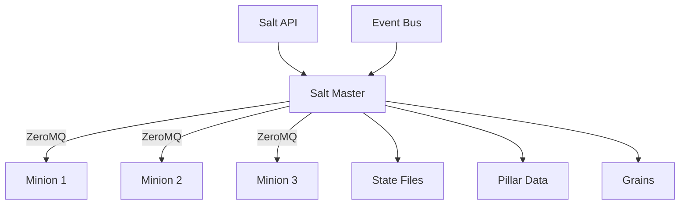

# How to Configure SaltStack for Configuration Management

Author: [nawazdhandala](https://www.github.com/nawazdhandala)

Tags: SaltStack, Salt, Configuration Management, DevOps, Infrastructure Automation

Description: Set up SaltStack for scalable configuration management with states, pillars, grains, and event-driven automation to manage thousands of servers efficiently.

---

SaltStack (Salt) is a high-speed configuration management and remote execution platform. Unlike Ansible's push-based model, Salt uses a master-minion architecture with persistent connections, making it exceptionally fast for managing large infrastructures. Salt can configure thousands of servers in seconds.

This guide covers Salt installation, state files, pillar data, and best practices for production deployments.

## Salt Architecture Overview

Salt uses a publish-subscribe model for communication between components.



Key components:
- **Salt Master**: Central server that stores configurations and sends commands
- **Salt Minions**: Agents running on managed nodes
- **States**: Declarative configuration definitions
- **Pillars**: Secure, minion-specific data
- **Grains**: Static information about minions (OS, hardware, etc.)

## Installing Salt Master

Set up the Salt Master on your control server.

```bash
# Ubuntu/Debian - Add Salt repository
curl -fsSL https://packages.broadcom.com/artifactory/api/security/keypair/SaltProjectKey/public | sudo tee /etc/apt/keyrings/salt-archive-keyring.pgp
echo "deb [signed-by=/etc/apt/keyrings/salt-archive-keyring.pgp] https://packages.broadcom.com/artifactory/saltproject-deb stable main" | sudo tee /etc/apt/sources.list.d/salt.list

# Install Salt Master
sudo apt update
sudo apt install -y salt-master

# Start and enable the service
sudo systemctl enable salt-master
sudo systemctl start salt-master

# Verify master is running
sudo salt-master --version
```

Configure the master:

```yaml
# /etc/salt/master
# Salt Master configuration

# Network interface to bind
interface: 0.0.0.0

# File server configuration
file_roots:
  base:
    - /srv/salt/base
  production:
    - /srv/salt/production
  staging:
    - /srv/salt/staging

# Pillar configuration
pillar_roots:
  base:
    - /srv/pillar/base
  production:
    - /srv/pillar/production

# Auto-accept minion keys (use only in trusted networks)
# auto_accept: True

# Timeout settings
timeout: 30
gather_job_timeout: 60

# Enable file server backend
fileserver_backend:
  - roots
  - gitfs

# Git fileserver (optional - pull states from Git)
gitfs_remotes:
  - https://github.com/company/salt-states.git

# Logging
log_level: info
log_file: /var/log/salt/master
```

## Installing Salt Minions

Install the minion agent on managed servers.

```bash
# Install Salt Minion
sudo apt install -y salt-minion

# Configure minion to connect to master
sudo tee /etc/salt/minion << EOF
# Salt Minion configuration

# Address of the Salt Master
master: salt-master.example.com

# Minion ID (defaults to hostname if not set)
id: web1.example.com

# Grains - static minion data
grains:
  roles:
    - webserver
    - frontend
  environment: production
  datacenter: us-east-1
EOF

# Start and enable minion
sudo systemctl enable salt-minion
sudo systemctl start salt-minion
```

## Managing Minion Keys

Salt uses public key cryptography for authentication.

```bash
# On the Salt Master - list all keys
sudo salt-key -L

# Output:
# Accepted Keys:
# Denied Keys:
# Unaccepted Keys:
#   web1.example.com
#   web2.example.com
# Rejected Keys:

# Accept a specific minion key
sudo salt-key -a web1.example.com

# Accept all pending keys
sudo salt-key -A

# Reject a key
sudo salt-key -r suspicious-host

# Delete a key (for decommissioned servers)
sudo salt-key -d old-server.example.com

# View key fingerprints
sudo salt-key -F
```

## Testing Connectivity

Verify communication between master and minions.

```bash
# Ping all minions
sudo salt '*' test.ping

# Ping specific minion
sudo salt 'web1.example.com' test.ping

# Ping minions matching a pattern
sudo salt 'web*.example.com' test.ping

# Ping minions with specific grain
sudo salt -G 'roles:webserver' test.ping

# Run command on all minions
sudo salt '*' cmd.run 'uptime'

# Get system information
sudo salt '*' grains.items
```

## Writing State Files

States define the desired configuration of systems.

```yaml
# /srv/salt/base/webserver/init.sls
# Web server state file

# Install Nginx
nginx_installed:
  pkg.installed:
    - name: nginx

# Ensure Nginx service is running
nginx_service:
  service.running:
    - name: nginx
    - enable: True
    - require:
      - pkg: nginx_installed
    - watch:
      - file: nginx_config

# Deploy Nginx configuration
nginx_config:
  file.managed:
    - name: /etc/nginx/nginx.conf
    - source: salt://webserver/files/nginx.conf
    - user: root
    - group: root
    - mode: 644
    - require:
      - pkg: nginx_installed

# Create web root directory
webroot:
  file.directory:
    - name: /var/www/html
    - user: www-data
    - group: www-data
    - mode: 755
    - makedirs: True
```

```yaml
# /srv/salt/base/webserver/files/nginx.conf
# Nginx configuration template

user www-data;
worker_processes auto;
pid /run/nginx.pid;

events {
    worker_connections 1024;
}

http {
    sendfile on;
    keepalive_timeout 65;
    include /etc/nginx/mime.types;
    default_type application/octet-stream;

    server {
        listen 80 default_server;
        root /var/www/html;
        index index.html;
    }
}
```

## Using Pillar for Secrets

Pillars store sensitive data securely, accessible only to specific minions.

```yaml
# /srv/pillar/base/top.sls
# Pillar top file - maps pillars to minions

base:
  '*':
    - common
  'web*.example.com':
    - webserver
  'db*.example.com':
    - database
```

```yaml
# /srv/pillar/base/common.sls
# Common pillar data for all minions

timezone: UTC
ntp_servers:
  - time.google.com
  - time.cloudflare.com

admin_users:
  - john
  - jane
```

```yaml
# /srv/pillar/base/database.sls
# Database credentials (keep encrypted in production)

postgres:
  admin_password: super_secret_password
  replication_password: another_secret
  databases:
    - name: production
      owner: app_user
      password: app_db_password
```

Use pillar data in states:

```yaml
# /srv/salt/base/database/init.sls

postgresql_installed:
  pkg.installed:
    - name: postgresql

create_database:
  postgres_database.present:
    - name: {{ pillar['postgres']['databases'][0]['name'] }}
    - owner: {{ pillar['postgres']['databases'][0]['owner'] }}

create_user:
  postgres_user.present:
    - name: {{ pillar['postgres']['databases'][0]['owner'] }}
    - password: {{ pillar['postgres']['databases'][0]['password'] }}
```

## Using Grains for Targeting

Grains are facts about minions used for targeting and conditionals.

```bash
# View all grains for a minion
sudo salt 'web1.example.com' grains.items

# Get specific grain
sudo salt '*' grains.get os
sudo salt '*' grains.get ip_interfaces

# Target by grain
sudo salt -G 'os:Ubuntu' test.ping
sudo salt -G 'roles:webserver' state.apply webserver
```

Custom grains in minion configuration:

```yaml
# /etc/salt/minion.d/grains.conf
grains:
  roles:
    - webserver
    - frontend
  environment: production
  app_version: "2.1.0"
  datacenter: us-east-1
```

Use grains in states:

```yaml
# /srv/salt/base/packages/init.sls


install_packages:
  pkg.installed:
    - pkgs:
      - nginx
      - php-fpm

install_packages:
  pkg.installed:
    - pkgs:
      - nginx
      - php-fpm

```

## The Top File

The top file maps states to minions.

```yaml
# /srv/salt/base/top.sls
# State top file

base:
  '*':
    - common
    - users
    - ssh

  'roles:webserver':
    - match: grain
    - webserver
    - certbot

  'roles:database':
    - match: grain
    - postgresql
    - backup

  'environment:production':
    - match: grain
    - monitoring
    - security
```

## Applying States

Execute state configurations on minions.

```bash
# Apply all states defined in top.sls
sudo salt '*' state.apply

# Apply specific state
sudo salt 'web*.example.com' state.apply webserver

# Test mode (dry run)
sudo salt '*' state.apply test=True

# High state with verbose output
sudo salt '*' state.highstate -l debug

# Apply state to minion with specific grain
sudo salt -G 'roles:webserver' state.apply nginx
```

## Event-Driven Automation

Salt's event bus enables reactive automation.

```yaml
# /etc/salt/master.d/reactor.conf
# Reactor configuration

reactor:
  # Auto-configure new minions
  - 'salt/minion/*/start':
    - /srv/reactor/minion_start.sls

  # Alert on auth failures
  - 'salt/auth':
    - /srv/reactor/auth_alert.sls
```

```yaml
# /srv/reactor/minion_start.sls
# Automatically apply highstate to new minions

apply_highstate:
  local.state.apply:
    - tgt: {{ data['id'] }}
    - arg: []
```

## Orchestration

Coordinate multi-minion deployments with orchestration.

```yaml
# /srv/salt/base/orchestrate/deploy.sls
# Orchestrated deployment

# Step 1: Update database schema
update_database:
  salt.state:
    - tgt: 'roles:database'
    - tgt_type: grain
    - sls: database.migrate

# Step 2: Deploy to web servers (one at a time)
deploy_webservers:
  salt.state:
    - tgt: 'roles:webserver'
    - tgt_type: grain
    - sls: webserver.deploy
    - batch: 1
    - require:
      - salt: update_database

# Step 3: Clear caches
clear_caches:
  salt.state:
    - tgt: 'roles:cache'
    - tgt_type: grain
    - sls: cache.clear
    - require:
      - salt: deploy_webservers
```

Run orchestration:

```bash
sudo salt-run state.orch orchestrate.deploy
```

---

SaltStack excels at managing large-scale infrastructure with its speed and event-driven capabilities. The learning curve is steeper than Ansible, but the performance benefits justify the investment for organizations with hundreds or thousands of servers. Start with basic states, add pillars for secrets, and gradually adopt advanced features like reactors and orchestration as your automation matures.
