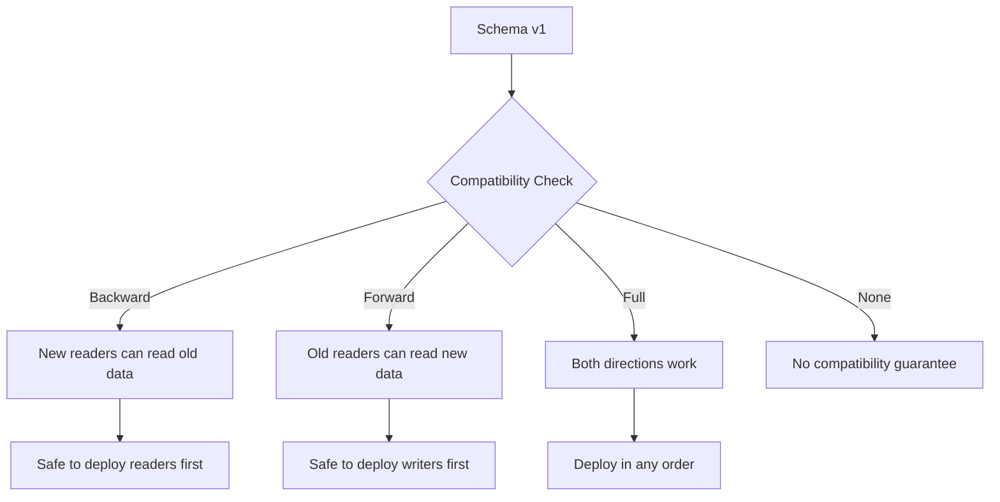
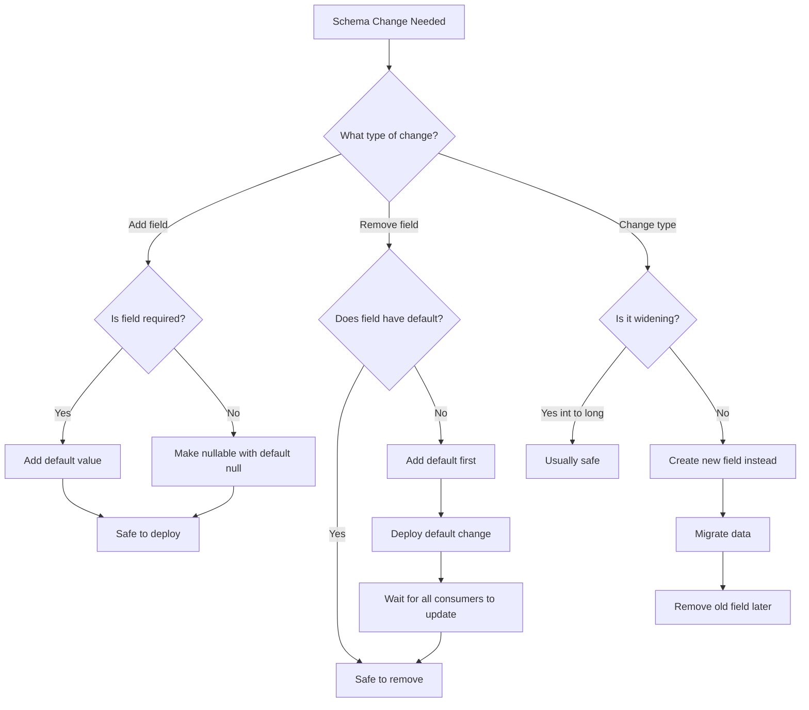

# How to Fix "Schema Evolution" Issues

Author: [nawazdhandala](https://www.github.com/nawazdhandala)

Tags: Schema Evolution, Data Engineering, Database, Kafka, Avro, Data Migration

Description: Learn how to fix schema evolution issues in data systems, including handling backward and forward compatibility, Avro schemas, and database migrations.

---

Schema evolution is one of the trickiest challenges in data engineering. As your application grows, you need to add new fields, remove deprecated ones, and change data types without breaking existing consumers. This guide covers practical solutions for common schema evolution problems.

---

## Understanding Schema Compatibility



---

## Common Schema Evolution Errors

### 1. Incompatible Schema Change

When you see errors like:

```
Schema evolution not compatible:
Cannot remove required field 'user_id' without default value
```

Or in Kafka:

```
io.confluent.kafka.schemaregistry.client.rest.exceptions.RestClientException:
Schema being registered is incompatible with an earlier schema; error code: 409
```

---

## Avro Schema Evolution

Avro is widely used in data pipelines because of its schema evolution support.

### Adding a New Field (Backward Compatible)

```json
// Original schema v1
{
  "type": "record",
  "name": "User",
  "namespace": "com.example",
  "fields": [
    {"name": "id", "type": "long"},
    {"name": "name", "type": "string"},
    {"name": "email", "type": "string"}
  ]
}
```

```json
// New schema v2 - Adding optional field with default
{
  "type": "record",
  "name": "User",
  "namespace": "com.example",
  "fields": [
    {"name": "id", "type": "long"},
    {"name": "name", "type": "string"},
    {"name": "email", "type": "string"},
    {"name": "phone", "type": ["null", "string"], "default": null}
  ]
}
```

### Removing a Field (Forward Compatible)

```json
// Schema v2 - Field to be removed must have a default
{
  "type": "record",
  "name": "User",
  "namespace": "com.example",
  "fields": [
    {"name": "id", "type": "long"},
    {"name": "name", "type": "string"},
    {"name": "email", "type": "string"},
    {"name": "legacy_field", "type": "string", "default": ""}
  ]
}
```

```json
// Schema v3 - Field removed (old readers still work due to default)
{
  "type": "record",
  "name": "User",
  "namespace": "com.example",
  "fields": [
    {"name": "id", "type": "long"},
    {"name": "name", "type": "string"},
    {"name": "email", "type": "string"}
  ]
}
```

---

## Schema Registry Configuration

Configure Kafka Schema Registry for your compatibility needs:

```bash
# Check current compatibility level
curl -X GET http://localhost:8081/config/my-topic-value

# Set backward compatibility (default)
curl -X PUT -H "Content-Type: application/vnd.schemaregistry.v1+json" \
  --data '{"compatibility": "BACKWARD"}' \
  http://localhost:8081/config/my-topic-value

# Set forward compatibility
curl -X PUT -H "Content-Type: application/vnd.schemaregistry.v1+json" \
  --data '{"compatibility": "FORWARD"}' \
  http://localhost:8081/config/my-topic-value

# Set full compatibility (both directions)
curl -X PUT -H "Content-Type: application/vnd.schemaregistry.v1+json" \
  --data '{"compatibility": "FULL"}' \
  http://localhost:8081/config/my-topic-value
```

---

## Testing Schema Compatibility

```bash
# Test if a new schema is compatible before registering
curl -X POST -H "Content-Type: application/vnd.schemaregistry.v1+json" \
  --data '{"schema": "{\"type\":\"record\",\"name\":\"User\",\"fields\":[{\"name\":\"id\",\"type\":\"long\"}]}"}' \
  http://localhost:8081/compatibility/subjects/my-topic-value/versions/latest

# Response if compatible
{"is_compatible": true}

# Response if not compatible
{"is_compatible": false}
```

---

## Python Schema Evolution Handler

```python
# schema_manager.py

from confluent_kafka.schema_registry import SchemaRegistryClient
from confluent_kafka.schema_registry.avro import AvroSerializer, AvroDeserializer
import json

class SchemaManager:
    """Manages schema evolution for Kafka topics."""

    def __init__(self, schema_registry_url):
        self.client = SchemaRegistryClient({
            'url': schema_registry_url
        })

    def check_compatibility(self, subject, schema_str):
        """Check if a schema is compatible with the latest version."""
        try:
            # Test compatibility before registering
            is_compatible = self.client.test_compatibility(
                subject_name=subject,
                schema=Schema(schema_str, "AVRO")
            )
            return is_compatible
        except Exception as e:
            print(f"Compatibility check failed: {e}")
            return False

    def register_schema(self, subject, schema_str):
        """Register a new schema version if compatible."""
        from confluent_kafka.schema_registry import Schema

        # Check compatibility first
        if not self.check_compatibility(subject, schema_str):
            raise ValueError(f"Schema is not compatible with subject {subject}")

        # Register the schema
        schema = Schema(schema_str, "AVRO")
        schema_id = self.client.register_schema(subject, schema)
        print(f"Registered schema with ID: {schema_id}")
        return schema_id

    def get_schema_versions(self, subject):
        """List all versions of a schema."""
        versions = self.client.get_versions(subject)
        schemas = []

        for version in versions:
            schema = self.client.get_version(subject, version)
            schemas.append({
                'version': version,
                'schema_id': schema.schema_id,
                'schema': json.loads(schema.schema.schema_str)
            })

        return schemas

    def evolve_schema_safely(self, subject, old_schema, new_schema):
        """Safely evolve a schema with validation."""
        old_fields = {f['name'] for f in old_schema['fields']}
        new_fields = {f['name'] for f in new_schema['fields']}

        # Check for removed fields without defaults
        removed_fields = old_fields - new_fields
        for field in old_schema['fields']:
            if field['name'] in removed_fields:
                if 'default' not in field:
                    raise ValueError(
                        f"Cannot remove field '{field['name']}' without default value. "
                        "Add a default value first, then remove in a later version."
                    )

        # Check for new required fields
        added_fields = new_fields - old_fields
        for field in new_schema['fields']:
            if field['name'] in added_fields:
                if 'default' not in field and 'null' not in str(field['type']):
                    raise ValueError(
                        f"New field '{field['name']}' must have a default value "
                        "or be nullable for backward compatibility."
                    )

        print("Schema evolution is safe!")
        return True


# Usage example
if __name__ == "__main__":
    manager = SchemaManager("http://localhost:8081")

    old_schema = {
        "type": "record",
        "name": "User",
        "fields": [
            {"name": "id", "type": "long"},
            {"name": "name", "type": "string"}
        ]
    }

    new_schema = {
        "type": "record",
        "name": "User",
        "fields": [
            {"name": "id", "type": "long"},
            {"name": "name", "type": "string"},
            {"name": "email", "type": ["null", "string"], "default": None}
        ]
    }

    # Validate before deployment
    manager.evolve_schema_safely("user-topic-value", old_schema, new_schema)
```

---

## Schema Evolution Decision Flow



---

## Database Schema Migrations

For relational databases, use migration tools properly:

### Flyway Migration Example

```sql
-- V1__create_users_table.sql
CREATE TABLE users (
    id BIGSERIAL PRIMARY KEY,
    name VARCHAR(255) NOT NULL,
    email VARCHAR(255) NOT NULL UNIQUE,
    created_at TIMESTAMP DEFAULT CURRENT_TIMESTAMP
);

-- V2__add_phone_column.sql
-- Adding nullable column is safe
ALTER TABLE users ADD COLUMN phone VARCHAR(20);

-- V3__add_status_with_default.sql
-- Adding column with default is backward compatible
ALTER TABLE users ADD COLUMN status VARCHAR(20) DEFAULT 'active';

-- V4__rename_column_safely.sql
-- Use a multi-step approach for renames
-- Step 1: Add new column
ALTER TABLE users ADD COLUMN full_name VARCHAR(255);

-- Step 2: Copy data
UPDATE users SET full_name = name WHERE full_name IS NULL;

-- Step 3: Update application to write to both columns
-- (done in application code, not SQL)

-- V5__complete_rename.sql
-- After all applications updated, drop old column
ALTER TABLE users DROP COLUMN name;
```

---

## Handling Breaking Changes

When you absolutely need a breaking change:

```python
# versioned_consumer.py

import json
from typing import Dict, Any

class VersionedMessageHandler:
    """Handle messages from different schema versions."""

    def __init__(self):
        self.handlers = {}

    def register_handler(self, version: int, handler):
        """Register a handler for a specific schema version."""
        self.handlers[version] = handler

    def process_message(self, message: Dict[str, Any]):
        """Process a message based on its schema version."""
        # Extract version from message metadata
        version = message.get('_schema_version', 1)

        if version not in self.handlers:
            # Fall back to transformation
            message = self.transform_to_latest(message, version)
            version = max(self.handlers.keys())

        handler = self.handlers[version]
        return handler(message)

    def transform_to_latest(self, message: Dict[str, Any], from_version: int):
        """Transform old message format to latest version."""
        # Version 1 to 2: Split name into first_name and last_name
        if from_version == 1 and 'name' in message:
            parts = message['name'].split(' ', 1)
            message['first_name'] = parts[0]
            message['last_name'] = parts[1] if len(parts) > 1 else ''
            del message['name']

        # Version 2 to 3: Add default values for new fields
        if from_version <= 2:
            message.setdefault('preferences', {})
            message.setdefault('verified', False)

        message['_schema_version'] = max(self.handlers.keys())
        return message


# Usage
handler = VersionedMessageHandler()

handler.register_handler(1, lambda m: print(f"V1: {m}"))
handler.register_handler(2, lambda m: print(f"V2: {m}"))
handler.register_handler(3, lambda m: print(f"V3: {m}"))

# Old message gets transformed
old_message = {"name": "John Doe", "email": "john@example.com", "_schema_version": 1}
handler.process_message(old_message)
```

---

## Best Practices Summary

| Change Type | Safe Approach |
|------------|---------------|
| Add field | Make optional with default value |
| Remove field | Ensure field has default first |
| Rename field | Add new, migrate, delete old |
| Change type | Create new field, deprecate old |
| Add enum value | Append to end of enum list |
| Remove enum value | Never remove, only deprecate |

---

## Monitoring Schema Changes

```python
# schema_monitor.py

import logging
from datetime import datetime

class SchemaChangeMonitor:
    """Monitor and alert on schema changes."""

    def __init__(self, schema_registry_url, alert_callback):
        self.registry_url = schema_registry_url
        self.alert = alert_callback
        self.known_versions = {}

    def check_for_changes(self, subjects):
        """Check for schema changes across subjects."""
        for subject in subjects:
            current_version = self.get_latest_version(subject)

            if subject in self.known_versions:
                if current_version > self.known_versions[subject]:
                    self.alert(
                        f"Schema changed for {subject}: "
                        f"v{self.known_versions[subject]} -> v{current_version}"
                    )

            self.known_versions[subject] = current_version

    def get_latest_version(self, subject):
        """Get the latest schema version for a subject."""
        # Implementation depends on your schema registry
        pass

# Set up alerting
def send_alert(message):
    logging.warning(f"[SCHEMA ALERT] {message}")
    # Send to monitoring system like OneUptime

monitor = SchemaChangeMonitor("http://localhost:8081", send_alert)
```

---

## Key Takeaways

1. **Always add defaults** - New fields need defaults for backward compatibility
2. **Never remove without defaults** - Fields being removed must have defaults first
3. **Test compatibility** - Use schema registry compatibility checks before deploying
4. **Version your schemas** - Keep track of schema versions in your messages
5. **Plan multi-step migrations** - Breaking changes require careful rollout across services
6. **Monitor changes** - Set up alerts for unexpected schema modifications

---

*Managing schema evolution in production? [OneUptime](https://oneuptime.com) helps you monitor data pipeline health, track schema changes, and alert on compatibility issues before they impact your applications.*
