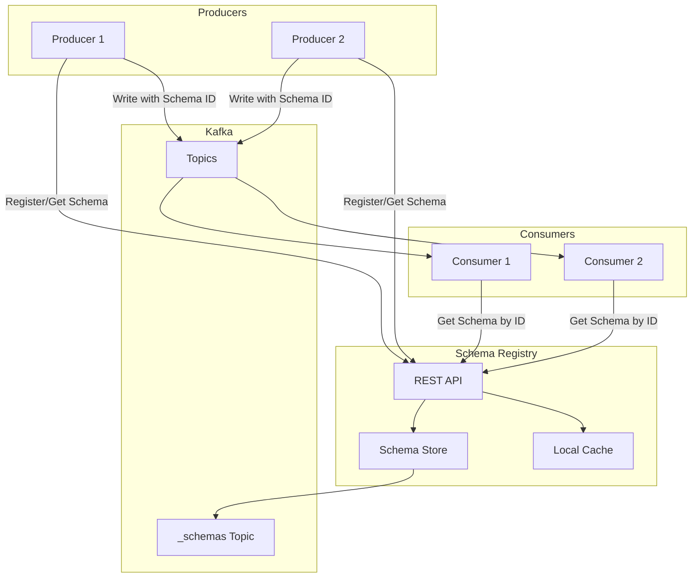

# How to Fix "Schema Registry" Errors

Author: [nawazdhandala](https://www.github.com/nawazdhandala)

Tags: Schema Registry, Apache Kafka, Avro, Data Serialization, Schema Evolution, Confluent, Data Streaming

Description: Learn how to diagnose and fix common Schema Registry errors including compatibility issues, serialization failures, and registry connectivity problems.

---

> Schema Registry errors can halt your entire streaming pipeline. Whether it's compatibility violations, serialization failures, or connectivity issues, these problems need quick resolution. This guide covers the most common Schema Registry errors and how to fix them.

Your producers are failing with "Schema not found" errors at 3 AM. Let's make sure that never happens again.

---

## Schema Registry Architecture

Understanding the architecture helps diagnose issues:



---

## Error 1: Schema Compatibility Violation

### The Error

```
io.confluent.kafka.schemaregistry.client.rest.exceptions.RestClientException:
Schema being registered is incompatible with an earlier schema for subject "orders-value";
error code: 409
```

### Diagnosis

```bash
# Check current compatibility level
curl -X GET http://schema-registry:8081/config/orders-value

# Get existing schema
curl -X GET http://schema-registry:8081/subjects/orders-value/versions/latest
```

### Fix: Update Schema with Compatible Changes

```python
# Python: Check compatibility before registering
from confluent_kafka.schema_registry import SchemaRegistryClient
from confluent_kafka.schema_registry.avro import AvroSerializer
import json

schema_registry_conf = {'url': 'http://schema-registry:8081'}
schema_registry = SchemaRegistryClient(schema_registry_conf)

def check_and_register_schema(subject, new_schema_str):
    """Check compatibility and register schema"""

    # Test compatibility first
    try:
        is_compatible = schema_registry.test_compatibility(
            subject_name=subject,
            schema=Schema(new_schema_str, 'AVRO')
        )

        if not is_compatible:
            print("Schema is NOT compatible. Analyzing differences...")
            analyze_incompatibility(subject, new_schema_str)
            return None

    except Exception as e:
        # Subject might not exist yet
        if "Subject not found" in str(e):
            print("Subject doesn't exist, registering new schema")
        else:
            raise

    # Register the schema
    schema_id = schema_registry.register_schema(
        subject_name=subject,
        schema=Schema(new_schema_str, 'AVRO')
    )

    print(f"Registered schema with ID: {schema_id}")
    return schema_id

def analyze_incompatibility(subject, new_schema_str):
    """Analyze why schema is incompatible"""

    # Get current schema
    current = schema_registry.get_latest_version(subject)
    current_schema = json.loads(current.schema.schema_str)
    new_schema = json.loads(new_schema_str)

    current_fields = {f['name']: f for f in current_schema.get('fields', [])}
    new_fields = {f['name']: f for f in new_schema.get('fields', [])}

    # Check for removed fields (breaks BACKWARD compatibility)
    removed = set(current_fields.keys()) - set(new_fields.keys())
    if removed:
        print(f"INCOMPATIBLE: Removed fields: {removed}")
        print("  Fix: Add default values or keep fields")

    # Check for added required fields (breaks FORWARD compatibility)
    added = set(new_fields.keys()) - set(current_fields.keys())
    for field_name in added:
        field = new_fields[field_name]
        if 'default' not in field:
            print(f"INCOMPATIBLE: New field '{field_name}' has no default")
            print("  Fix: Add a default value to new fields")

    # Check for type changes
    for field_name in current_fields.keys() & new_fields.keys():
        if current_fields[field_name]['type'] != new_fields[field_name]['type']:
            print(f"INCOMPATIBLE: Field '{field_name}' type changed")
            print(f"  From: {current_fields[field_name]['type']}")
            print(f"  To: {new_fields[field_name]['type']}")

# Example: Compatible schema evolution
old_schema = """
{
    "type": "record",
    "name": "Order",
    "namespace": "com.example",
    "fields": [
        {"name": "order_id", "type": "string"},
        {"name": "amount", "type": "double"},
        {"name": "customer_id", "type": "string"}
    ]
}
"""

# Adding new field WITH default - compatible
new_schema_compatible = """
{
    "type": "record",
    "name": "Order",
    "namespace": "com.example",
    "fields": [
        {"name": "order_id", "type": "string"},
        {"name": "amount", "type": "double"},
        {"name": "customer_id", "type": "string"},
        {"name": "currency", "type": "string", "default": "USD"}
    ]
}
"""

check_and_register_schema("orders-value", new_schema_compatible)
```

### Change Compatibility Level (When Necessary)

```bash
# Set compatibility for specific subject
curl -X PUT -H "Content-Type: application/vnd.schemaregistry.v1+json" \
    --data '{"compatibility": "BACKWARD"}' \
    http://schema-registry:8081/config/orders-value

# Compatibility levels:
# BACKWARD - new schema can read old data (default)
# FORWARD - old schema can read new data
# FULL - both backward and forward compatible
# NONE - no compatibility checking
```

---

## Error 2: Schema Not Found

### The Error

```
org.apache.kafka.common.errors.SerializationException:
Error retrieving Avro schema for id 42
io.confluent.kafka.schemaregistry.client.rest.exceptions.RestClientException:
Schema not found; error code: 40403
```

### Diagnosis

```bash
# Check if schema ID exists
curl -X GET http://schema-registry:8081/schemas/ids/42

# List all subjects
curl -X GET http://schema-registry:8081/subjects

# Check schema versions for subject
curl -X GET http://schema-registry:8081/subjects/orders-value/versions
```

### Fix: Re-register Missing Schema

```python
# Restore schema from backup or re-register
def restore_or_register_schema(subject, schema_str, expected_id=None):
    """Restore schema, optionally with specific ID"""

    schema_registry = SchemaRegistryClient({'url': 'http://schema-registry:8081'})

    try:
        # Check if subject exists
        versions = schema_registry.get_versions(subject)
        print(f"Subject {subject} has {len(versions)} versions")

        # Find if schema already registered
        existing_id = schema_registry.lookup_schema(
            subject_name=subject,
            schema=Schema(schema_str, 'AVRO')
        )
        print(f"Schema already registered with ID: {existing_id.schema_id}")
        return existing_id.schema_id

    except Exception as e:
        if "Subject not found" in str(e) or "Schema not found" in str(e):
            # Register new schema
            schema_id = schema_registry.register_schema(
                subject_name=subject,
                schema=Schema(schema_str, 'AVRO')
            )
            print(f"Registered schema with ID: {schema_id}")

            if expected_id and schema_id != expected_id:
                print(f"WARNING: Expected ID {expected_id}, got {schema_id}")
                print("Consumers using old ID will fail. Consider data migration.")

            return schema_id
        raise

# Emergency recovery: Export and restore schemas
def export_all_schemas(output_file):
    """Export all schemas for backup"""

    schema_registry = SchemaRegistryClient({'url': 'http://schema-registry:8081'})

    subjects = schema_registry.get_subjects()
    schemas = {}

    for subject in subjects:
        versions = schema_registry.get_versions(subject)
        schemas[subject] = []

        for version in versions:
            schema_version = schema_registry.get_version(subject, version)
            schemas[subject].append({
                'version': version,
                'schema_id': schema_version.schema_id,
                'schema': schema_version.schema.schema_str
            })

    with open(output_file, 'w') as f:
        json.dump(schemas, f, indent=2)

    print(f"Exported {len(subjects)} subjects to {output_file}")

def restore_schemas_from_backup(backup_file):
    """Restore schemas from backup file"""

    schema_registry = SchemaRegistryClient({'url': 'http://schema-registry:8081'})

    with open(backup_file, 'r') as f:
        schemas = json.load(f)

    for subject, versions in schemas.items():
        for version_info in sorted(versions, key=lambda x: x['version']):
            try:
                schema_id = schema_registry.register_schema(
                    subject_name=subject,
                    schema=Schema(version_info['schema'], 'AVRO')
                )
                print(f"Restored {subject} v{version_info['version']} as ID {schema_id}")
            except Exception as e:
                print(f"Failed to restore {subject} v{version_info['version']}: {e}")
```

---

## Error 3: Serialization/Deserialization Failures

### The Error

```
org.apache.kafka.common.errors.SerializationException:
Error deserializing Avro message for id 15
Caused by: org.apache.avro.AvroTypeException:
Found string, expecting union
```

### Diagnosis

```python
# Debug serialization issues
def debug_message_schema(topic, message_bytes):
    """Extract and analyze schema from message"""

    # Confluent wire format: magic byte + 4-byte schema ID + data
    if len(message_bytes) < 5:
        print("Message too short for Confluent format")
        return

    magic_byte = message_bytes[0]
    if magic_byte != 0:
        print(f"Invalid magic byte: {magic_byte} (expected 0)")
        return

    # Extract schema ID (big-endian)
    schema_id = int.from_bytes(message_bytes[1:5], byteorder='big')
    print(f"Schema ID: {schema_id}")

    # Fetch schema
    schema_registry = SchemaRegistryClient({'url': 'http://schema-registry:8081'})
    try:
        schema = schema_registry.get_schema(schema_id)
        print(f"Schema: {schema.schema_str}")
    except Exception as e:
        print(f"Failed to fetch schema: {e}")
```

### Fix: Handle Schema Evolution in Consumers

```python
# Consumer with proper schema handling
from confluent_kafka import DeserializingConsumer
from confluent_kafka.schema_registry.avro import AvroDeserializer
from confluent_kafka.schema_registry import SchemaRegistryClient

def create_robust_consumer(topic, group_id):
    """Create consumer with schema evolution support"""

    schema_registry_conf = {'url': 'http://schema-registry:8081'}
    schema_registry = SchemaRegistryClient(schema_registry_conf)

    # Reader schema - what your application expects
    reader_schema_str = """
    {
        "type": "record",
        "name": "Order",
        "namespace": "com.example",
        "fields": [
            {"name": "order_id", "type": "string"},
            {"name": "amount", "type": "double"},
            {"name": "customer_id", "type": "string"},
            {"name": "currency", "type": "string", "default": "USD"},
            {"name": "status", "type": "string", "default": "pending"}
        ]
    }
    """

    # Deserializer uses reader schema to handle evolution
    avro_deserializer = AvroDeserializer(
        schema_registry,
        reader_schema_str,
        from_dict=lambda obj, ctx: Order(**obj)
    )

    consumer_conf = {
        'bootstrap.servers': 'kafka:9092',
        'group.id': group_id,
        'auto.offset.reset': 'earliest',
        'value.deserializer': avro_deserializer
    }

    return DeserializingConsumer(consumer_conf)

# Handle deserialization errors gracefully
def consume_with_error_handling(consumer, topic):
    """Consume messages with error handling"""

    consumer.subscribe([topic])

    while True:
        try:
            msg = consumer.poll(timeout=1.0)

            if msg is None:
                continue

            if msg.error():
                print(f"Consumer error: {msg.error()}")
                continue

            # Successfully deserialized
            order = msg.value()
            process_order(order)

        except SerializationException as e:
            # Log problematic message for investigation
            print(f"Deserialization error: {e}")
            print(f"Topic: {msg.topic()}, Partition: {msg.partition()}, Offset: {msg.offset()}")

            # Option 1: Skip and continue
            # consumer.commit()

            # Option 2: Send to dead letter queue
            send_to_dlq(msg.value(), str(e))

        except Exception as e:
            print(f"Unexpected error: {e}")
            raise
```

---

## Error 4: Registry Connectivity Issues

### The Error

```
io.confluent.kafka.schemaregistry.client.rest.exceptions.RestClientException:
Connect timed out; error code: 500
```

### Fix: Configure Retry and Failover

```python
# Robust Schema Registry client configuration
from confluent_kafka.schema_registry import SchemaRegistryClient
import time

class RobustSchemaRegistryClient:
    def __init__(self, urls, max_retries=3, retry_delay=1):
        self.urls = urls if isinstance(urls, list) else [urls]
        self.max_retries = max_retries
        self.retry_delay = retry_delay
        self.current_url_index = 0
        self._init_client()

    def _init_client(self):
        """Initialize client with current URL"""
        self.client = SchemaRegistryClient({
            'url': self.urls[self.current_url_index],
            'basic.auth.user.info': 'user:password'  # if auth required
        })

    def _failover(self):
        """Switch to next URL in list"""
        self.current_url_index = (self.current_url_index + 1) % len(self.urls)
        print(f"Failing over to: {self.urls[self.current_url_index]}")
        self._init_client()

    def get_schema(self, schema_id):
        """Get schema with retry and failover"""

        for attempt in range(self.max_retries * len(self.urls)):
            try:
                return self.client.get_schema(schema_id)
            except Exception as e:
                if "timed out" in str(e).lower() or "connection" in str(e).lower():
                    print(f"Connection error (attempt {attempt + 1}): {e}")

                    if (attempt + 1) % self.max_retries == 0:
                        self._failover()
                    else:
                        time.sleep(self.retry_delay * (2 ** (attempt % self.max_retries)))
                else:
                    raise

        raise Exception("All Schema Registry nodes unavailable")

    def register_schema(self, subject, schema):
        """Register schema with retry"""

        for attempt in range(self.max_retries):
            try:
                return self.client.register_schema(subject, schema)
            except Exception as e:
                if attempt < self.max_retries - 1:
                    time.sleep(self.retry_delay * (2 ** attempt))
                else:
                    raise

# Usage with multiple registry nodes
client = RobustSchemaRegistryClient([
    'http://schema-registry-1:8081',
    'http://schema-registry-2:8081',
    'http://schema-registry-3:8081'
])
```

### Health Check Script

```bash
#!/bin/bash
# Schema Registry health check

REGISTRY_URL="http://schema-registry:8081"

# Check API availability
response=$(curl -s -o /dev/null -w "%{http_code}" "${REGISTRY_URL}/subjects")

if [ "$response" = "200" ]; then
    echo "Schema Registry is healthy"

    # Check recent schema registration
    subjects=$(curl -s "${REGISTRY_URL}/subjects" | jq -r '.[]' | head -5)

    for subject in $subjects; do
        versions=$(curl -s "${REGISTRY_URL}/subjects/${subject}/versions")
        echo "  ${subject}: ${versions}"
    done
else
    echo "Schema Registry is unhealthy (HTTP ${response})"
    exit 1
fi

# Check Kafka connectivity (schema storage)
kafka_mode=$(curl -s "${REGISTRY_URL}/mode")
echo "Registry mode: ${kafka_mode}"
```

---

## Error 5: Subject Naming Issues

### The Error

```
io.confluent.kafka.schemaregistry.client.rest.exceptions.RestClientException:
Subject 'my-topic-value' not found; error code: 40401
```

### Fix: Correct Subject Naming Strategy

```python
# Configure subject naming strategy
from confluent_kafka import SerializingProducer
from confluent_kafka.schema_registry.avro import AvroSerializer
from confluent_kafka.serialization import StringSerializer

def create_producer_with_naming_strategy(topic, schema_str, strategy='TopicNameStrategy'):
    """Create producer with specific naming strategy"""

    schema_registry = SchemaRegistryClient({'url': 'http://schema-registry:8081'})

    # Subject naming strategies:
    # TopicNameStrategy: {topic}-key, {topic}-value (default)
    # RecordNameStrategy: {namespace}.{name}
    # TopicRecordNameStrategy: {topic}-{namespace}.{name}

    if strategy == 'TopicNameStrategy':
        subject_name_strategy = lambda ctx: f"{ctx.topic}-{ctx.field}"
    elif strategy == 'RecordNameStrategy':
        # Uses record name from schema
        subject_name_strategy = None  # Let serializer use schema name
    elif strategy == 'TopicRecordNameStrategy':
        subject_name_strategy = lambda ctx: f"{ctx.topic}-{get_record_name(schema_str)}"

    avro_serializer = AvroSerializer(
        schema_registry,
        schema_str,
        conf={'subject.name.strategy': subject_name_strategy} if subject_name_strategy else {}
    )

    producer_conf = {
        'bootstrap.servers': 'kafka:9092',
        'key.serializer': StringSerializer('utf_8'),
        'value.serializer': avro_serializer
    }

    return SerializingProducer(producer_conf)

def get_record_name(schema_str):
    """Extract record name from Avro schema"""
    schema = json.loads(schema_str)
    namespace = schema.get('namespace', '')
    name = schema.get('name', 'Unknown')
    return f"{namespace}.{name}" if namespace else name

# Verify subject exists before producing
def verify_subject_exists(subject):
    """Check if subject exists in registry"""

    schema_registry = SchemaRegistryClient({'url': 'http://schema-registry:8081'})

    try:
        versions = schema_registry.get_versions(subject)
        print(f"Subject '{subject}' exists with {len(versions)} version(s)")
        return True
    except Exception as e:
        if "Subject not found" in str(e):
            print(f"Subject '{subject}' does not exist")
            return False
        raise

# Check for common naming issues
verify_subject_exists("orders-value")      # TopicNameStrategy
verify_subject_exists("com.example.Order") # RecordNameStrategy
```

---

## Monitoring and Alerting

```python
# Monitor Schema Registry health
from prometheus_client import Counter, Gauge, Histogram
import requests

# Metrics
schema_registry_requests = Counter(
    'schema_registry_requests_total',
    'Total Schema Registry requests',
    ['operation', 'status']
)

schema_registry_latency = Histogram(
    'schema_registry_latency_seconds',
    'Schema Registry request latency',
    ['operation']
)

schema_versions = Gauge(
    'schema_registry_versions',
    'Number of schema versions per subject',
    ['subject']
)

def monitor_schema_registry(registry_url):
    """Collect Schema Registry metrics"""

    # Get all subjects
    try:
        start = time.time()
        response = requests.get(f"{registry_url}/subjects")
        latency = time.time() - start

        schema_registry_latency.labels(operation='list_subjects').observe(latency)
        schema_registry_requests.labels(operation='list_subjects', status='success').inc()

        subjects = response.json()

        # Get version count per subject
        for subject in subjects:
            versions_response = requests.get(f"{registry_url}/subjects/{subject}/versions")
            versions = versions_response.json()
            schema_versions.labels(subject=subject).set(len(versions))

    except Exception as e:
        schema_registry_requests.labels(operation='list_subjects', status='error').inc()
        print(f"Monitoring error: {e}")

# Alert on compatibility violations
def check_compatibility_violations(registry_url):
    """Check for recent compatibility issues"""

    # This would integrate with your alerting system
    subjects = requests.get(f"{registry_url}/subjects").json()

    violations = []
    for subject in subjects:
        config = requests.get(f"{registry_url}/config/{subject}").json()

        if config.get('compatibilityLevel') == 'NONE':
            violations.append({
                'subject': subject,
                'issue': 'Compatibility checking disabled'
            })

    if violations:
        send_alert("Schema Registry compatibility warnings", violations)
```

---

## Best Practices

1. **Always test compatibility** before registering new schemas
2. **Use BACKWARD compatibility** as the default for consumer-driven development
3. **Add defaults to new fields** to maintain compatibility
4. **Back up schemas regularly** using export scripts
5. **Monitor registry health** and alert on errors
6. **Use multiple registry instances** for high availability
7. **Document schema changes** in your version control

---

## Conclusion

Schema Registry errors often stem from compatibility violations, missing schemas, or connectivity issues. Key fixes include:

- Check compatibility before registering schemas
- Add default values to new fields
- Implement retry logic with failover
- Use correct subject naming strategies
- Monitor and alert on registry health

With proper configuration and monitoring, Schema Registry becomes a reliable component of your streaming infrastructure.

---

*Need to monitor your streaming infrastructure? [OneUptime](https://oneuptime.com) provides comprehensive observability for Kafka, Schema Registry, and streaming systems with real-time alerting on serialization failures and compatibility issues.*
