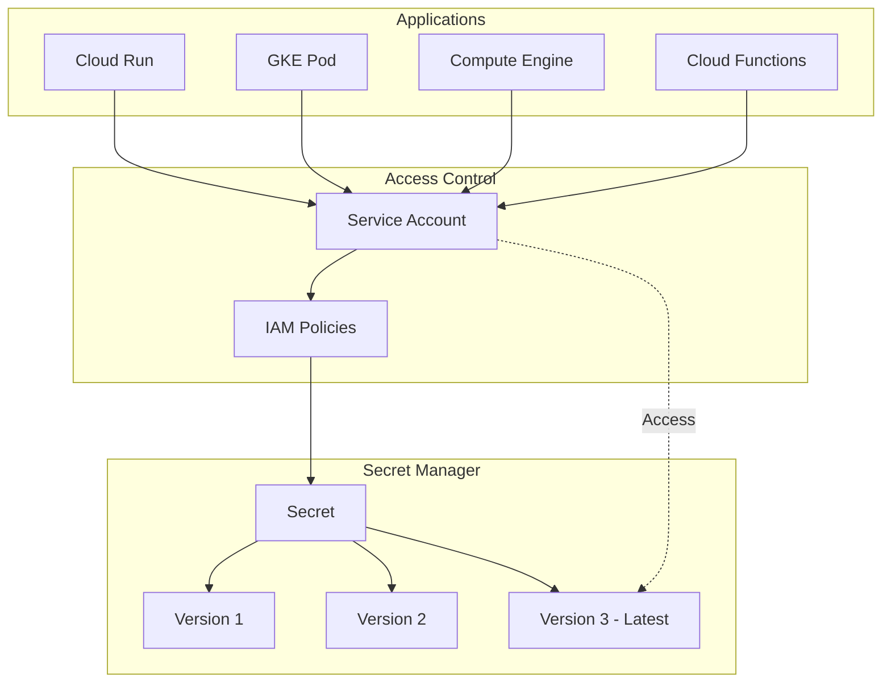

# How to Handle Secret Manager

Author: [nawazdhandala](https://www.github.com/nawazdhandala)

Tags: Secret Manager, Google Cloud, Security, Secrets, GCP, DevOps, Configuration

Description: Learn how to effectively use Google Cloud Secret Manager to store, access, and manage sensitive data like API keys, passwords, and certificates.

---

Managing secrets in applications is a security-critical task. Hardcoding credentials in source code or configuration files creates security vulnerabilities and makes rotation difficult. Google Cloud Secret Manager provides a centralized, secure solution for storing and accessing sensitive data. This guide covers everything from basic usage to advanced patterns for secret management.

## Understanding Secret Manager

Secret Manager stores secrets as versioned, immutable payloads with fine-grained access control. Understanding the data model helps you design effective secret management strategies.



## Creating and Managing Secrets

Start by creating secrets using the gcloud CLI or client libraries.

### Using gcloud CLI

```bash
# Create a secret
gcloud secrets create database-password \
    --replication-policy="automatic" \
    --labels="env=production,app=myapp"

# Add a secret version (the actual secret value)
echo -n "my-super-secret-password" | gcloud secrets versions add database-password --data-file=-

# Create secret with value in one command
echo -n "my-api-key" | gcloud secrets create api-key --data-file=- --replication-policy="automatic"

# Create secret from a file (useful for certificates)
gcloud secrets create tls-certificate --data-file=./server.crt

# List all secrets
gcloud secrets list

# View secret metadata
gcloud secrets describe database-password

# Access a secret version
gcloud secrets versions access latest --secret=database-password
```

### Using Python Client Library

```python
from google.cloud import secretmanager
import json

class SecretManagerClient:
    """Wrapper for Secret Manager operations."""

    def __init__(self, project_id):
        self.client = secretmanager.SecretManagerServiceClient()
        self.project_id = project_id
        self.parent = f"projects/{project_id}"

    def create_secret(self, secret_id, labels=None):
        """Create a new secret without any versions."""

        secret = {
            "replication": {
                "automatic": {}  # Automatically replicate across regions
            }
        }

        if labels:
            secret["labels"] = labels

        response = self.client.create_secret(
            request={
                "parent": self.parent,
                "secret_id": secret_id,
                "secret": secret,
            }
        )

        print(f"Created secret: {response.name}")
        return response

    def add_secret_version(self, secret_id, payload):
        """Add a new version to an existing secret."""

        parent = f"{self.parent}/secrets/{secret_id}"

        # Convert payload to bytes if needed
        if isinstance(payload, str):
            payload = payload.encode("UTF-8")
        elif isinstance(payload, dict):
            payload = json.dumps(payload).encode("UTF-8")

        response = self.client.add_secret_version(
            request={
                "parent": parent,
                "payload": {"data": payload},
            }
        )

        print(f"Added secret version: {response.name}")
        return response

    def access_secret(self, secret_id, version="latest"):
        """Access a secret version."""

        name = f"{self.parent}/secrets/{secret_id}/versions/{version}"

        response = self.client.access_secret_version(request={"name": name})

        return response.payload.data.decode("UTF-8")

    def delete_secret(self, secret_id):
        """Delete a secret and all its versions."""

        name = f"{self.parent}/secrets/{secret_id}"
        self.client.delete_secret(request={"name": name})
        print(f"Deleted secret: {name}")

# Usage
client = SecretManagerClient("my-project")

# Create and populate a secret
client.create_secret("db-credentials", labels={"env": "production"})
client.add_secret_version("db-credentials", {
    "username": "admin",
    "password": "super-secret-password",
    "host": "db.example.com"
})

# Access the secret
credentials = json.loads(client.access_secret("db-credentials"))
print(f"Connecting to {credentials['host']} as {credentials['username']}")
```

## Accessing Secrets in Applications

Different deployment environments have different patterns for accessing secrets.

### Cloud Run

Mount secrets as environment variables or files in Cloud Run services.

```yaml
# service.yaml for Cloud Run
apiVersion: serving.knative.dev/v1
kind: Service
metadata:
  name: my-api
spec:
  template:
    spec:
      containers:
        - image: gcr.io/my-project/my-api:latest
          env:
            # Mount secret as environment variable
            - name: DATABASE_PASSWORD
              valueFrom:
                secretKeyRef:
                  key: latest
                  name: database-password
          volumeMounts:
            # Mount secret as file
            - name: tls-certs
              mountPath: /secrets/tls
              readOnly: true
      volumes:
        - name: tls-certs
          secret:
            secretName: tls-certificate
            items:
              - key: latest
                path: server.crt
```

Deploy with gcloud:

```bash
# Deploy Cloud Run service with secret
gcloud run deploy my-api \
    --image=gcr.io/my-project/my-api:latest \
    --set-secrets="DATABASE_PASSWORD=database-password:latest" \
    --set-secrets="/secrets/tls/server.crt=tls-certificate:latest"
```

### Google Kubernetes Engine (GKE)

Use the GKE Secret Manager add-on or Workload Identity.

```yaml
# pod.yaml with Secret Manager integration
apiVersion: v1
kind: Pod
metadata:
  name: my-app
spec:
  serviceAccountName: my-app-sa
  containers:
    - name: app
      image: gcr.io/my-project/my-app:latest
      env:
        - name: DB_PASSWORD
          valueFrom:
            secretKeyRef:
              name: db-secret
              key: password
      volumeMounts:
        - name: secrets
          mountPath: /etc/secrets
          readOnly: true
  volumes:
    - name: secrets
      csi:
        driver: secrets-store.csi.k8s.io
        readOnly: true
        volumeAttributes:
          secretProviderClass: gcp-secrets
---
apiVersion: secrets-store.csi.x-k8s.io/v1
kind: SecretProviderClass
metadata:
  name: gcp-secrets
spec:
  provider: gcp
  parameters:
    secrets: |
      - resourceName: "projects/my-project/secrets/database-password/versions/latest"
        path: "db-password.txt"
      - resourceName: "projects/my-project/secrets/api-key/versions/latest"
        path: "api-key.txt"
```

### Application Code with Caching

Avoid fetching secrets on every request by implementing caching.

```python
from google.cloud import secretmanager
from functools import lru_cache
import time

class CachedSecretManager:
    """Secret Manager client with caching to reduce API calls."""

    def __init__(self, project_id, cache_ttl=300):
        self.client = secretmanager.SecretManagerServiceClient()
        self.project_id = project_id
        self.cache_ttl = cache_ttl
        self._cache = {}
        self._cache_times = {}

    def get_secret(self, secret_id, version="latest"):
        """Get a secret with caching."""

        cache_key = f"{secret_id}:{version}"

        # Check if cached and not expired
        if cache_key in self._cache:
            if time.time() - self._cache_times[cache_key] < self.cache_ttl:
                return self._cache[cache_key]

        # Fetch from Secret Manager
        name = f"projects/{self.project_id}/secrets/{secret_id}/versions/{version}"
        response = self.client.access_secret_version(request={"name": name})
        value = response.payload.data.decode("UTF-8")

        # Update cache
        self._cache[cache_key] = value
        self._cache_times[cache_key] = time.time()

        return value

    def clear_cache(self, secret_id=None):
        """Clear cached secrets."""

        if secret_id:
            keys_to_remove = [k for k in self._cache if k.startswith(f"{secret_id}:")]
            for key in keys_to_remove:
                del self._cache[key]
                del self._cache_times[key]
        else:
            self._cache.clear()
            self._cache_times.clear()

# Initialize at application startup
secrets = CachedSecretManager("my-project", cache_ttl=300)

# Use throughout your application
def get_database_connection():
    password = secrets.get_secret("database-password")
    return create_connection(password=password)
```

## Secret Rotation

Implement secret rotation to improve security posture.

```python
from google.cloud import secretmanager
from datetime import datetime, timedelta

def rotate_secret(project_id, secret_id, new_value, cleanup_old_versions=True):
    """Rotate a secret by adding a new version and optionally disabling old ones."""

    client = secretmanager.SecretManagerServiceClient()
    parent = f"projects/{project_id}/secrets/{secret_id}"

    # Add the new secret version
    if isinstance(new_value, str):
        new_value = new_value.encode("UTF-8")

    new_version = client.add_secret_version(
        request={
            "parent": parent,
            "payload": {"data": new_value},
        }
    )

    print(f"Created new version: {new_version.name}")

    if cleanup_old_versions:
        # List all versions
        versions = client.list_secret_versions(request={"parent": parent})

        for version in versions:
            # Skip the new version and already disabled versions
            if version.name == new_version.name:
                continue
            if version.state != secretmanager.SecretVersion.State.ENABLED:
                continue

            # Disable old versions
            client.disable_secret_version(request={"name": version.name})
            print(f"Disabled old version: {version.name}")

    return new_version

def setup_rotation_notification(project_id, secret_id, pubsub_topic):
    """Configure a secret to send notifications for rotation reminders."""

    client = secretmanager.SecretManagerServiceClient()
    name = f"projects/{project_id}/secrets/{secret_id}"

    # Get current secret
    secret = client.get_secret(request={"name": name})

    # Add rotation configuration
    secret.rotation = {
        "rotation_period": {"seconds": 86400 * 90},  # 90 days
        "next_rotation_time": datetime.utcnow() + timedelta(days=90),
    }

    # Add Pub/Sub topic for rotation notifications
    secret.topics = [{"name": pubsub_topic}]

    # Update the secret
    updated = client.update_secret(
        request={
            "secret": secret,
            "update_mask": {"paths": ["rotation", "topics"]},
        }
    )

    print(f"Configured rotation for {updated.name}")
    return updated
```

## Access Control with IAM

Configure fine-grained access control for secrets.

```bash
# Grant access to a specific secret for a service account
gcloud secrets add-iam-policy-binding database-password \
    --member="serviceAccount:my-app@my-project.iam.gserviceaccount.com" \
    --role="roles/secretmanager.secretAccessor"

# Grant access to all secrets in the project (use sparingly)
gcloud projects add-iam-policy-binding my-project \
    --member="serviceAccount:my-app@my-project.iam.gserviceaccount.com" \
    --role="roles/secretmanager.secretAccessor"

# View current access policy
gcloud secrets get-iam-policy database-password
```

Use conditional IAM bindings for additional security.

```bash
# Allow access only from specific IP ranges
gcloud secrets add-iam-policy-binding database-password \
    --member="serviceAccount:my-app@my-project.iam.gserviceaccount.com" \
    --role="roles/secretmanager.secretAccessor" \
    --condition="expression=request.auth.access_levels.exists(x, x == 'accessPolicies/123/accessLevels/trusted'),title=trusted-network"
```

## Auditing Secret Access

Monitor who accesses your secrets using Cloud Audit Logs.

```bash
# View recent secret access events
gcloud logging read 'protoPayload.serviceName="secretmanager.googleapis.com"' \
    --limit=50 \
    --format="table(timestamp,protoPayload.methodName,protoPayload.authenticationInfo.principalEmail,protoPayload.resourceName)"

# Filter for specific secret access
gcloud logging read 'protoPayload.serviceName="secretmanager.googleapis.com" AND protoPayload.resourceName:"database-password"' \
    --limit=20
```

Create alerts for suspicious access patterns.

```python
from google.cloud import monitoring_v3

def create_secret_access_alert(project_id, secret_id, threshold=100):
    """Create an alert for unusual secret access patterns."""

    client = monitoring_v3.AlertPolicyServiceClient()
    project_name = f"projects/{project_id}"

    alert_policy = {
        "display_name": f"High Secret Access Rate - {secret_id}",
        "conditions": [
            {
                "display_name": "Secret access rate",
                "condition_threshold": {
                    "filter": f'''
                        resource.type="audited_resource"
                        protoPayload.serviceName="secretmanager.googleapis.com"
                        protoPayload.methodName="google.cloud.secretmanager.v1.SecretManagerService.AccessSecretVersion"
                        protoPayload.resourceName:"{secret_id}"
                    ''',
                    "comparison": "COMPARISON_GT",
                    "threshold_value": threshold,
                    "duration": {"seconds": 300},
                    "aggregations": [
                        {
                            "alignment_period": {"seconds": 60},
                            "per_series_aligner": "ALIGN_RATE",
                        }
                    ],
                },
            }
        ],
        "combiner": "OR",
        "notification_channels": [
            f"projects/{project_id}/notificationChannels/security-team"
        ],
    }

    policy = client.create_alert_policy(
        name=project_name,
        alert_policy=alert_policy
    )

    return policy
```

## Best Practices

### Use Separate Secrets for Different Environments

```bash
# Create environment-specific secrets
gcloud secrets create database-password-dev --labels="env=development"
gcloud secrets create database-password-staging --labels="env=staging"
gcloud secrets create database-password-prod --labels="env=production"
```

### Store Complex Configuration as JSON

```python
import json
from google.cloud import secretmanager

def store_config_secret(project_id, secret_id, config_dict):
    """Store complex configuration as a JSON secret."""

    client = secretmanager.SecretManagerServiceClient()
    parent = f"projects/{project_id}/secrets/{secret_id}"

    # Convert to JSON and encode
    payload = json.dumps(config_dict, indent=2).encode("UTF-8")

    response = client.add_secret_version(
        request={
            "parent": parent,
            "payload": {"data": payload},
        }
    )

    return response

# Store database configuration
db_config = {
    "host": "db.example.com",
    "port": 5432,
    "database": "myapp",
    "username": "app_user",
    "password": "super-secret",
    "ssl_mode": "verify-full",
    "pool_size": 10
}

store_config_secret("my-project", "database-config", db_config)
```

### Handle Secret Not Found Gracefully

```python
from google.cloud import secretmanager
from google.api_core import exceptions

def get_secret_with_fallback(project_id, secret_id, default=None):
    """Get a secret with a fallback value if not found."""

    client = secretmanager.SecretManagerServiceClient()
    name = f"projects/{project_id}/secrets/{secret_id}/versions/latest"

    try:
        response = client.access_secret_version(request={"name": name})
        return response.payload.data.decode("UTF-8")
    except exceptions.NotFound:
        if default is not None:
            return default
        raise ValueError(f"Secret {secret_id} not found and no default provided")
    except exceptions.PermissionDenied:
        raise PermissionError(f"Access denied to secret {secret_id}")
```

## Summary

Google Cloud Secret Manager provides a robust solution for managing sensitive data in your applications. Key takeaways include:

- Use versioned secrets to enable rotation without application changes
- Mount secrets as environment variables or files in Cloud Run and GKE
- Implement caching to reduce API calls and improve performance
- Configure rotation schedules and notifications for security compliance
- Use IAM policies to control access at the secret level
- Monitor secret access through Cloud Audit Logs and set up alerts
- Store complex configuration as JSON secrets for easier management

Proper secret management is foundational to application security. The time invested in setting up Secret Manager correctly pays dividends in reduced security incidents and easier credential rotation.
