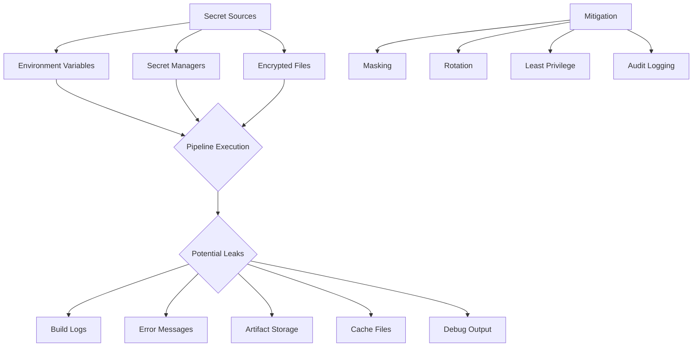
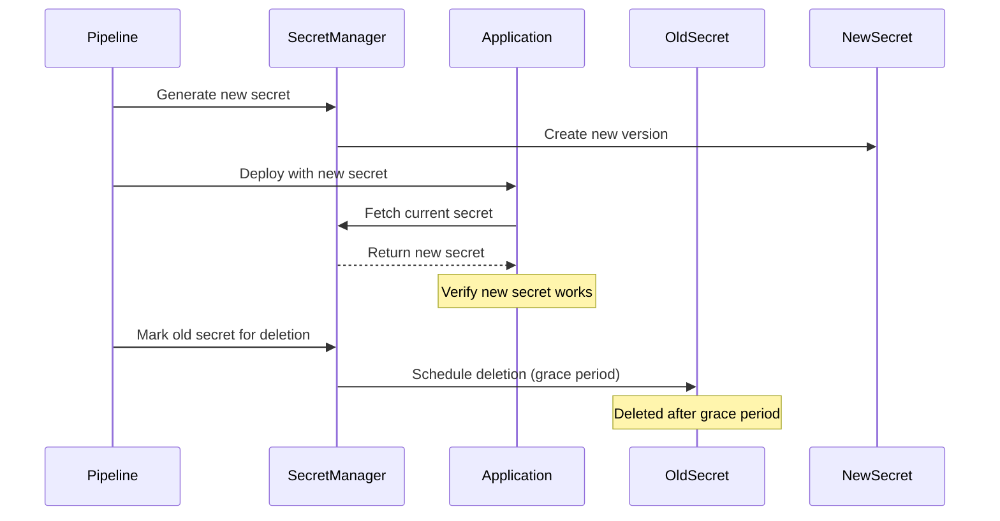
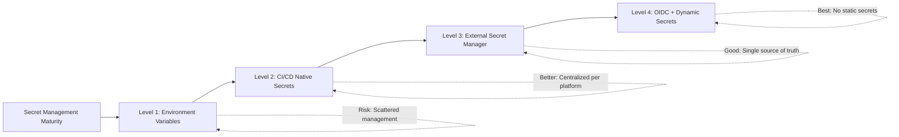

# How to Handle Secrets in CI/CD Pipelines

Author: [nawazdhandala](https://github.com/nawazdhandala)

Tags: Security, CI/CD, DevOps, Secrets Management, GitHub Actions

Description: Learn secure practices for managing secrets in CI/CD pipelines including environment variables, secret managers, and preventing accidental exposure.

---

Secrets management in CI/CD pipelines is critical for security. A leaked API key, database password, or cloud credential can lead to data breaches, unauthorized access, and significant financial damage. This guide covers best practices for handling secrets across different CI/CD platforms.

## The Secret Exposure Problem

Secrets in CI/CD pipelines can be exposed through multiple vectors: hardcoded values in code, logs, environment variables, or artifact storage. Understanding these risks is the first step to preventing exposure.



## GitHub Actions Secrets Management

### Basic Secret Usage

```yaml
# .github/workflows/deploy.yml
name: Deploy Application

on:
  push:
    branches: [main]

jobs:
  deploy:
    runs-on: ubuntu-latest

    steps:
      - uses: actions/checkout@v4

      - name: Configure AWS credentials
        uses: aws-actions/configure-aws-credentials@v4
        with:
          # Secrets are accessed via secrets context
          # They are automatically masked in logs
          aws-access-key-id: ${{ secrets.AWS_ACCESS_KEY_ID }}
          aws-secret-access-key: ${{ secrets.AWS_SECRET_ACCESS_KEY }}
          aws-region: us-east-1

      - name: Deploy to ECS
        run: |
          # Secret is available as environment variable
          # GitHub automatically masks it in logs
          aws ecs update-service --cluster production --service api --force-new-deployment
```

### Using Environment-Specific Secrets

```yaml
# .github/workflows/deploy.yml
name: Deploy to Environment

on:
  workflow_dispatch:
    inputs:
      environment:
        description: 'Environment to deploy to'
        required: true
        type: choice
        options:
          - staging
          - production

jobs:
  deploy:
    runs-on: ubuntu-latest
    # Environment provides isolated secrets
    environment: ${{ github.event.inputs.environment }}

    steps:
      - uses: actions/checkout@v4

      - name: Deploy
        env:
          # These secrets are specific to the selected environment
          DATABASE_URL: ${{ secrets.DATABASE_URL }}
          API_KEY: ${{ secrets.API_KEY }}
        run: |
          ./scripts/deploy.sh
```

### OIDC Authentication (Recommended for Cloud Providers)

```yaml
# .github/workflows/deploy-oidc.yml
name: Deploy with OIDC

# Required for OIDC token generation
permissions:
  id-token: write
  contents: read

jobs:
  deploy:
    runs-on: ubuntu-latest

    steps:
      - uses: actions/checkout@v4

      # OIDC eliminates the need for long-lived credentials
      # AWS trusts GitHub's identity provider
      - name: Configure AWS credentials via OIDC
        uses: aws-actions/configure-aws-credentials@v4
        with:
          role-to-assume: arn:aws:iam::123456789012:role/GitHubActionsRole
          aws-region: us-east-1
          # No secrets needed - uses short-lived tokens

      - name: Deploy
        run: |
          aws s3 sync ./build s3://my-bucket
```

## GitLab CI Secrets Management

### Using CI/CD Variables

```yaml
# .gitlab-ci.yml
stages:
  - test
  - deploy

variables:
  # Non-sensitive variables can be defined here
  NODE_ENV: production

test:
  stage: test
  script:
    # Masked variables are hidden in job logs
    - echo "Using API endpoint: $API_ENDPOINT"
    # Protected variables only available on protected branches
    - npm test

deploy:
  stage: deploy
  # Only run on protected branches
  only:
    - main
  script:
    # Access protected and masked variables
    - docker login -u $DOCKER_USER -p $DOCKER_PASSWORD
    - docker push myapp:latest
  environment:
    name: production
```

### Using External Secret Managers

```yaml
# .gitlab-ci.yml
deploy:
  stage: deploy
  image: hashicorp/vault:latest
  script:
    # Authenticate with Vault using CI job JWT
    - export VAULT_TOKEN=$(vault write -field=token auth/jwt/login role=gitlab-ci jwt=$CI_JOB_JWT)

    # Fetch secrets from Vault
    - export DATABASE_PASSWORD=$(vault kv get -field=password secret/production/database)
    - export API_KEY=$(vault kv get -field=key secret/production/api)

    # Use secrets for deployment
    - ./deploy.sh
```

## Jenkins Secrets Management

### Using Credentials Plugin

```groovy
// Jenkinsfile
pipeline {
    agent any

    environment {
        // Bind credentials to environment variables
        AWS_CREDENTIALS = credentials('aws-production-credentials')
        // This creates AWS_CREDENTIALS_USR and AWS_CREDENTIALS_PSW
    }

    stages {
        stage('Deploy') {
            steps {
                withCredentials([
                    // More granular credential binding
                    string(credentialsId: 'api-key', variable: 'API_KEY'),
                    usernamePassword(
                        credentialsId: 'database-credentials',
                        usernameVariable: 'DB_USER',
                        passwordVariable: 'DB_PASSWORD'
                    ),
                    file(credentialsId: 'kubeconfig', variable: 'KUBECONFIG')
                ]) {
                    sh '''
                        # Credentials are available as environment variables
                        # Jenkins masks them in build logs
                        kubectl apply -f deployment.yaml
                    '''
                }
            }
        }
    }

    post {
        always {
            // Clean up any credential files
            cleanWs()
        }
    }
}
```

### Integrating with HashiCorp Vault

```groovy
// Jenkinsfile
pipeline {
    agent any

    stages {
        stage('Fetch Secrets') {
            steps {
                // Use Vault plugin to fetch secrets
                withVault(
                    configuration: [
                        vaultUrl: 'https://vault.example.com',
                        vaultCredentialId: 'vault-app-role'
                    ],
                    vaultSecrets: [
                        [
                            path: 'secret/production/database',
                            secretValues: [
                                [envVar: 'DB_PASSWORD', vaultKey: 'password']
                            ]
                        ],
                        [
                            path: 'secret/production/api',
                            secretValues: [
                                [envVar: 'API_KEY', vaultKey: 'key']
                            ]
                        ]
                    ]
                ) {
                    sh './deploy.sh'
                }
            }
        }
    }
}
```

## Secret Manager Integrations

### AWS Secrets Manager

```yaml
# GitHub Actions with AWS Secrets Manager
name: Deploy with AWS Secrets Manager

jobs:
  deploy:
    runs-on: ubuntu-latest
    permissions:
      id-token: write
      contents: read

    steps:
      - uses: actions/checkout@v4

      - name: Configure AWS credentials
        uses: aws-actions/configure-aws-credentials@v4
        with:
          role-to-assume: ${{ secrets.AWS_ROLE_ARN }}
          aws-region: us-east-1

      - name: Fetch secrets from AWS Secrets Manager
        id: secrets
        run: |
          # Fetch and parse secrets
          SECRETS=$(aws secretsmanager get-secret-value \
            --secret-id production/api-keys \
            --query SecretString \
            --output text)

          # Parse JSON and set as masked environment variables
          echo "::add-mask::$(echo $SECRETS | jq -r '.api_key')"
          echo "API_KEY=$(echo $SECRETS | jq -r '.api_key')" >> $GITHUB_ENV

          echo "::add-mask::$(echo $SECRETS | jq -r '.db_password')"
          echo "DB_PASSWORD=$(echo $SECRETS | jq -r '.db_password')" >> $GITHUB_ENV

      - name: Deploy
        run: ./deploy.sh
```

### HashiCorp Vault

```yaml
# GitHub Actions with HashiCorp Vault
name: Deploy with Vault

jobs:
  deploy:
    runs-on: ubuntu-latest

    steps:
      - uses: actions/checkout@v4

      - name: Import secrets from Vault
        uses: hashicorp/vault-action@v2
        with:
          url: https://vault.example.com
          method: jwt
          role: github-actions
          # Vault verifies GitHub's OIDC token
          jwtGithubAudience: https://vault.example.com
          secrets: |
            secret/data/production/api api_key | API_KEY ;
            secret/data/production/database password | DB_PASSWORD

      - name: Deploy
        run: |
          # Secrets are available as environment variables
          # They are automatically masked in logs
          ./deploy.sh
```

## Preventing Secret Leaks

### Log Masking

```yaml
# GitHub Actions - Custom masking
- name: Mask sensitive data
  run: |
    # Manually mask values that might appear in logs
    echo "::add-mask::$CUSTOM_SECRET"
    echo "::add-mask::$API_KEY"

    # Now these values will be replaced with *** in logs
    echo "Deploying with key: $API_KEY"
```

### Pre-commit Hooks for Secret Detection

```yaml
# .pre-commit-config.yaml
repos:
  - repo: https://github.com/Yelp/detect-secrets
    rev: v1.4.0
    hooks:
      - id: detect-secrets
        args: ['--baseline', '.secrets.baseline']
        exclude: package-lock.json
```

```bash
# Initialize baseline (ignore existing false positives)
detect-secrets scan > .secrets.baseline

# Audit the baseline
detect-secrets audit .secrets.baseline
```

### CI Secret Scanning

```yaml
# .github/workflows/secret-scan.yml
name: Secret Scanning

on:
  pull_request:
    branches: [main]

jobs:
  scan:
    runs-on: ubuntu-latest

    steps:
      - uses: actions/checkout@v4
        with:
          fetch-depth: 0  # Full history for scanning

      - name: TruffleHog Secret Scan
        uses: trufflesecurity/trufflehog@main
        with:
          path: ./
          base: ${{ github.event.pull_request.base.sha }}
          head: ${{ github.event.pull_request.head.sha }}
          extra_args: --only-verified

      - name: Gitleaks Secret Scan
        uses: gitleaks/gitleaks-action@v2
        env:
          GITHUB_TOKEN: ${{ secrets.GITHUB_TOKEN }}
```

## Secret Rotation in CI/CD



```yaml
# Secret rotation workflow
name: Rotate Secrets

on:
  schedule:
    - cron: '0 0 1 * *'  # Monthly rotation
  workflow_dispatch:

jobs:
  rotate:
    runs-on: ubuntu-latest
    permissions:
      id-token: write
      contents: read

    steps:
      - name: Configure AWS credentials
        uses: aws-actions/configure-aws-credentials@v4
        with:
          role-to-assume: ${{ secrets.AWS_ROLE_ARN }}
          aws-region: us-east-1

      - name: Rotate database password
        run: |
          # Generate new password
          NEW_PASSWORD=$(openssl rand -base64 32)

          # Update in Secrets Manager
          aws secretsmanager put-secret-value \
            --secret-id production/database \
            --secret-string "{\"password\":\"$NEW_PASSWORD\"}"

          # Update database user password
          aws rds modify-db-cluster \
            --db-cluster-identifier production \
            --master-user-password "$NEW_PASSWORD"

      - name: Trigger application redeployment
        run: |
          # Force new deployment to pick up rotated secrets
          aws ecs update-service \
            --cluster production \
            --service api \
            --force-new-deployment
```

## Docker and Kubernetes Secrets

### Docker Build Secrets

```dockerfile
# Dockerfile with build secrets
# syntax=docker/dockerfile:1.4

FROM node:20-alpine

WORKDIR /app

COPY package*.json ./

# Use build secrets - not stored in image layers
RUN --mount=type=secret,id=npm_token \
    NPM_TOKEN=$(cat /run/secrets/npm_token) \
    npm ci --ignore-scripts

COPY . .

RUN npm run build

# Don't include secrets in final image
FROM node:20-alpine
WORKDIR /app
COPY --from=0 /app/dist ./dist
COPY --from=0 /app/node_modules ./node_modules

CMD ["node", "dist/index.js"]
```

```yaml
# GitHub Actions - Build with secrets
- name: Build Docker image
  run: |
    echo "${{ secrets.NPM_TOKEN }}" > npm_token.txt
    docker build \
      --secret id=npm_token,src=npm_token.txt \
      -t myapp:${{ github.sha }} .
    rm npm_token.txt
```

### Kubernetes Secrets in CI/CD

```yaml
# GitHub Actions - Deploy to Kubernetes
- name: Create Kubernetes secrets
  run: |
    # Create secret from literal values
    kubectl create secret generic api-secrets \
      --from-literal=api-key=${{ secrets.API_KEY }} \
      --from-literal=db-password=${{ secrets.DB_PASSWORD }} \
      --dry-run=client -o yaml | kubectl apply -f -

    # Or use External Secrets Operator
    cat <<EOF | kubectl apply -f -
    apiVersion: external-secrets.io/v1beta1
    kind: ExternalSecret
    metadata:
      name: api-secrets
    spec:
      refreshInterval: 1h
      secretStoreRef:
        name: aws-secrets-manager
        kind: SecretStore
      target:
        name: api-secrets
      data:
        - secretKey: api-key
          remoteRef:
            key: production/api
            property: key
        - secretKey: db-password
          remoteRef:
            key: production/database
            property: password
    EOF
```

## Best Practices Summary

| Practice | Description | Priority |
|----------|-------------|----------|
| Use OIDC when possible | Eliminate long-lived credentials | Critical |
| Never hardcode secrets | Use CI/CD secret storage or external managers | Critical |
| Enable secret masking | Prevent secrets appearing in logs | Critical |
| Implement secret scanning | Detect accidentally committed secrets | High |
| Use environment isolation | Separate secrets per environment | High |
| Rotate secrets regularly | Limit exposure window for leaked secrets | High |
| Principle of least privilege | Give CI/CD only necessary permissions | High |
| Audit secret access | Log who accessed which secrets when | Medium |
| Use short-lived credentials | Prefer temporary tokens over permanent keys | Medium |



Proper secret management in CI/CD pipelines requires a combination of secure storage, access controls, monitoring, and regular rotation. By implementing these practices, you significantly reduce the risk of credential exposure and limit the blast radius if a leak does occur.
