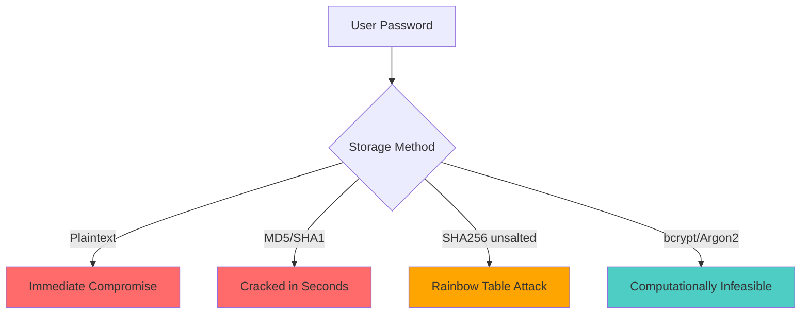
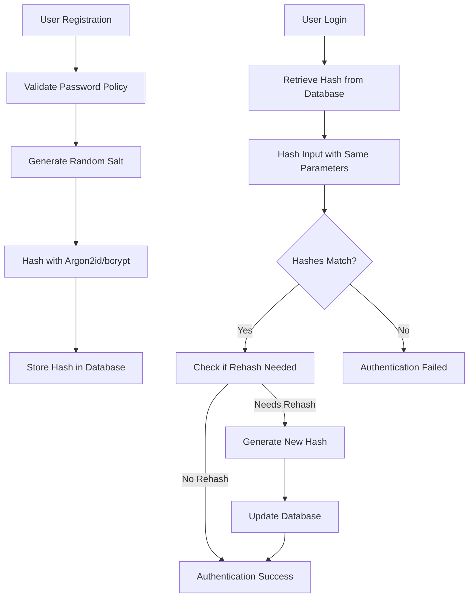

# How to Handle Secure Password Hashing

Author: [nawazdhandala](https://www.github.com/nawazdhandala)

Tags: Security, Password Hashing, Authentication, Cryptography, bcrypt, Argon2

Description: Learn how to properly hash and verify passwords using modern algorithms like bcrypt and Argon2 to protect user credentials.

---

Storing user passwords securely is one of the most critical responsibilities of any application that handles authentication. A data breach exposing plaintext or weakly hashed passwords can have devastating consequences for your users and your organization. This guide covers modern password hashing best practices, comparing algorithms, and providing implementation examples across multiple programming languages.

## Why Password Hashing Matters

When attackers breach a database, they often target user credentials. If passwords are stored in plaintext or using weak hashing, attackers can:

- Directly access user accounts
- Use credentials on other services (credential stuffing)
- Impersonate users for fraud or identity theft



## What NOT to Do

Before diving into proper techniques, let's understand common mistakes.

### Never Store Plaintext Passwords

```python
# DANGEROUS - Never do this!
def store_user(username, password):
    # Storing plaintext password - catastrophic if breached
    db.execute("INSERT INTO users (username, password) VALUES (%s, %s)",
               (username, password))
```

### Never Use Fast Hashing Algorithms

```python
# DANGEROUS - MD5, SHA1, SHA256 alone are NOT suitable for passwords
import hashlib

def bad_hash_password(password):
    # MD5 is broken and too fast for password hashing
    return hashlib.md5(password.encode()).hexdigest()

def also_bad_hash_password(password):
    # Even SHA256 without salt and work factor is unsuitable
    return hashlib.sha256(password.encode()).hexdigest()
```

Fast hashing algorithms like MD5, SHA1, and SHA256 are designed for speed. Attackers with modern GPUs can compute billions of these hashes per second, making brute-force attacks trivial.

## The Right Approach: Password Hashing Algorithms

Modern password hashing algorithms are specifically designed to be:

1. **Slow** - Intentionally computationally expensive
2. **Salted** - Each password gets a unique random salt
3. **Configurable** - Work factor can increase over time

### Algorithm Comparison

| Algorithm | Recommended | Notes |
|-----------|-------------|-------|
| Argon2id | Yes (preferred) | Winner of Password Hashing Competition, memory-hard |
| bcrypt | Yes | Battle-tested, widely supported |
| scrypt | Yes | Memory-hard, good alternative |
| PBKDF2 | Acceptable | Older, use only if others unavailable |
| SHA256/SHA512 | No | Too fast, not designed for passwords |
| MD5/SHA1 | Never | Cryptographically broken |

## Implementing bcrypt

bcrypt is the most widely supported password hashing algorithm. It automatically handles salting and has a configurable cost factor.

### bcrypt in Python

```python
import bcrypt

def hash_password(password: str) -> bytes:
    """Hash a password using bcrypt with automatic salt generation."""
    # Convert password to bytes
    password_bytes = password.encode('utf-8')

    # Generate salt and hash password
    # Cost factor of 12 is recommended (2^12 = 4096 iterations)
    salt = bcrypt.gensalt(rounds=12)
    hashed = bcrypt.hashpw(password_bytes, salt)

    return hashed

def verify_password(password: str, hashed: bytes) -> bool:
    """Verify a password against its hash."""
    password_bytes = password.encode('utf-8')

    # bcrypt.checkpw handles timing-safe comparison
    return bcrypt.checkpw(password_bytes, hashed)

# Usage example
if __name__ == "__main__":
    password = "user_secret_password"

    # Hash the password
    hashed = hash_password(password)
    print(f"Hashed password: {hashed}")

    # Verify correct password
    assert verify_password(password, hashed) == True

    # Verify wrong password
    assert verify_password("wrong_password", hashed) == False
```

### bcrypt in Node.js

```javascript
const bcrypt = require('bcrypt');

// Cost factor - higher is more secure but slower
const SALT_ROUNDS = 12;

async function hashPassword(password) {
    // bcrypt.hash generates salt and hashes in one call
    const hash = await bcrypt.hash(password, SALT_ROUNDS);
    return hash;
}

async function verifyPassword(password, hash) {
    // bcrypt.compare is timing-safe
    const match = await bcrypt.compare(password, hash);
    return match;
}

// Synchronous versions (use async in production)
function hashPasswordSync(password) {
    const salt = bcrypt.genSaltSync(SALT_ROUNDS);
    return bcrypt.hashSync(password, salt);
}

function verifyPasswordSync(password, hash) {
    return bcrypt.compareSync(password, hash);
}

// Usage example
async function main() {
    const password = "user_secret_password";

    const hash = await hashPassword(password);
    console.log(`Hashed: ${hash}`);

    const isValid = await verifyPassword(password, hash);
    console.log(`Password valid: ${isValid}`);

    const isInvalid = await verifyPassword("wrong_password", hash);
    console.log(`Wrong password valid: ${isInvalid}`);
}

main();
```

### bcrypt in Go

```go
package main

import (
    "fmt"
    "golang.org/x/crypto/bcrypt"
)

// Cost factor for bcrypt (10-14 is typical for production)
const bcryptCost = 12

// HashPassword generates a bcrypt hash of the password
func HashPassword(password string) (string, error) {
    // GenerateFromPassword handles salt generation internally
    hash, err := bcrypt.GenerateFromPassword([]byte(password), bcryptCost)
    if err != nil {
        return "", err
    }
    return string(hash), nil
}

// VerifyPassword checks if the password matches the hash
func VerifyPassword(password, hash string) bool {
    // CompareHashAndPassword is timing-safe
    err := bcrypt.CompareHashAndPassword([]byte(hash), []byte(password))
    return err == nil
}

func main() {
    password := "user_secret_password"

    // Hash the password
    hash, err := HashPassword(password)
    if err != nil {
        panic(err)
    }
    fmt.Printf("Hashed: %s\n", hash)

    // Verify correct password
    fmt.Printf("Password valid: %v\n", VerifyPassword(password, hash))

    // Verify wrong password
    fmt.Printf("Wrong password valid: %v\n", VerifyPassword("wrong", hash))
}
```

### bcrypt in Java

```java
import org.mindrot.jbcrypt.BCrypt;

public class PasswordHasher {
    // Work factor (log rounds) - 12 means 2^12 iterations
    private static final int WORK_FACTOR = 12;

    /**
     * Hash a password using bcrypt.
     * Returns a string containing the algorithm, cost, salt, and hash.
     */
    public static String hashPassword(String password) {
        // gensalt() generates a random salt with the specified work factor
        String salt = BCrypt.gensalt(WORK_FACTOR);
        return BCrypt.hashpw(password, salt);
    }

    /**
     * Verify a password against a bcrypt hash.
     * Uses constant-time comparison to prevent timing attacks.
     */
    public static boolean verifyPassword(String password, String hash) {
        return BCrypt.checkpw(password, hash);
    }

    public static void main(String[] args) {
        String password = "user_secret_password";

        // Hash the password
        String hash = hashPassword(password);
        System.out.println("Hashed: " + hash);

        // Verify correct password
        System.out.println("Password valid: " + verifyPassword(password, hash));

        // Verify wrong password
        System.out.println("Wrong password valid: " + verifyPassword("wrong", hash));
    }
}
```

## Implementing Argon2

Argon2 is the winner of the Password Hashing Competition (2015) and is considered the most secure option. Argon2id is the recommended variant, combining resistance against both side-channel and GPU attacks.

### Argon2 in Python

```python
from argon2 import PasswordHasher
from argon2.exceptions import VerifyMismatchError

# Configure Argon2id with recommended parameters
# time_cost: iterations, memory_cost: KB of memory, parallelism: threads
hasher = PasswordHasher(
    time_cost=3,        # Number of iterations
    memory_cost=65536,  # 64 MB of memory
    parallelism=4,      # Number of parallel threads
    hash_len=32,        # Length of the hash in bytes
    salt_len=16         # Length of the salt in bytes
)

def hash_password(password: str) -> str:
    """Hash a password using Argon2id."""
    return hasher.hash(password)

def verify_password(password: str, hash: str) -> bool:
    """Verify a password against its Argon2 hash."""
    try:
        hasher.verify(hash, password)
        return True
    except VerifyMismatchError:
        return False

def needs_rehash(hash: str) -> bool:
    """Check if a hash needs to be rehashed with updated parameters."""
    return hasher.check_needs_rehash(hash)

# Usage with rehash check
def verify_and_rehash(password: str, hash: str) -> tuple[bool, str | None]:
    """Verify password and rehash if parameters have changed."""
    if not verify_password(password, hash):
        return False, None

    # If parameters changed, generate new hash
    if needs_rehash(hash):
        new_hash = hash_password(password)
        return True, new_hash

    return True, None
```

### Argon2 in Node.js

```javascript
const argon2 = require('argon2');

// Argon2id configuration
const hashOptions = {
    type: argon2.argon2id,  // Use Argon2id variant
    memoryCost: 65536,       // 64 MB
    timeCost: 3,             // 3 iterations
    parallelism: 4,          // 4 threads
    hashLength: 32           // 32 byte hash
};

async function hashPassword(password) {
    const hash = await argon2.hash(password, hashOptions);
    return hash;
}

async function verifyPassword(password, hash) {
    try {
        return await argon2.verify(hash, password);
    } catch (err) {
        // Invalid hash format or verification failed
        return false;
    }
}

async function needsRehash(hash) {
    // Check if hash was created with different parameters
    return argon2.needsRehash(hash, hashOptions);
}

// Example with automatic rehashing
async function verifyAndRehash(password, hash) {
    const isValid = await verifyPassword(password, hash);
    if (!isValid) {
        return { valid: false, newHash: null };
    }

    // Rehash if parameters have changed
    if (await needsRehash(hash)) {
        const newHash = await hashPassword(password);
        return { valid: true, newHash };
    }

    return { valid: true, newHash: null };
}
```

### Argon2 in Go

```go
package main

import (
    "crypto/rand"
    "crypto/subtle"
    "encoding/base64"
    "fmt"
    "strings"

    "golang.org/x/crypto/argon2"
)

// Argon2 parameters
type Argon2Params struct {
    Memory      uint32 // Memory in KB
    Iterations  uint32 // Time cost
    Parallelism uint8  // Number of threads
    SaltLength  uint32 // Salt length in bytes
    KeyLength   uint32 // Hash length in bytes
}

// DefaultParams returns recommended Argon2id parameters
func DefaultParams() *Argon2Params {
    return &Argon2Params{
        Memory:      64 * 1024, // 64 MB
        Iterations:  3,
        Parallelism: 4,
        SaltLength:  16,
        KeyLength:   32,
    }
}

// HashPassword creates an Argon2id hash of the password
func HashPassword(password string, params *Argon2Params) (string, error) {
    // Generate random salt
    salt := make([]byte, params.SaltLength)
    if _, err := rand.Read(salt); err != nil {
        return "", err
    }

    // Generate hash using Argon2id
    hash := argon2.IDKey(
        []byte(password),
        salt,
        params.Iterations,
        params.Memory,
        params.Parallelism,
        params.KeyLength,
    )

    // Encode as a single string: $argon2id$v=19$m=65536,t=3,p=4$salt$hash
    encodedSalt := base64.RawStdEncoding.EncodeToString(salt)
    encodedHash := base64.RawStdEncoding.EncodeToString(hash)

    return fmt.Sprintf("$argon2id$v=%d$m=%d,t=%d,p=%d$%s$%s",
        argon2.Version, params.Memory, params.Iterations,
        params.Parallelism, encodedSalt, encodedHash), nil
}

// VerifyPassword checks if a password matches the hash
func VerifyPassword(password, encodedHash string) (bool, error) {
    // Parse the encoded hash
    params, salt, hash, err := decodeHash(encodedHash)
    if err != nil {
        return false, err
    }

    // Compute hash of the provided password
    computedHash := argon2.IDKey(
        []byte(password),
        salt,
        params.Iterations,
        params.Memory,
        params.Parallelism,
        params.KeyLength,
    )

    // Constant-time comparison to prevent timing attacks
    if subtle.ConstantTimeCompare(hash, computedHash) == 1 {
        return true, nil
    }
    return false, nil
}

// decodeHash parses an encoded Argon2 hash string
func decodeHash(encodedHash string) (*Argon2Params, []byte, []byte, error) {
    parts := strings.Split(encodedHash, "$")
    if len(parts) != 6 {
        return nil, nil, nil, fmt.Errorf("invalid hash format")
    }

    var version int
    var memory, iterations uint32
    var parallelism uint8

    _, err := fmt.Sscanf(parts[2], "v=%d", &version)
    if err != nil {
        return nil, nil, nil, err
    }

    _, err = fmt.Sscanf(parts[3], "m=%d,t=%d,p=%d", &memory, &iterations, &parallelism)
    if err != nil {
        return nil, nil, nil, err
    }

    salt, err := base64.RawStdEncoding.DecodeString(parts[4])
    if err != nil {
        return nil, nil, nil, err
    }

    hash, err := base64.RawStdEncoding.DecodeString(parts[5])
    if err != nil {
        return nil, nil, nil, err
    }

    params := &Argon2Params{
        Memory:      memory,
        Iterations:  iterations,
        Parallelism: parallelism,
        SaltLength:  uint32(len(salt)),
        KeyLength:   uint32(len(hash)),
    }

    return params, salt, hash, nil
}
```

## Choosing the Right Work Factor

The work factor should be tuned so that hashing takes approximately 250ms to 500ms on your production hardware.

```python
import time
import bcrypt

def benchmark_bcrypt_cost():
    """Find the appropriate cost factor for your hardware."""
    password = b"test_password_for_benchmarking"

    for cost in range(10, 16):
        start = time.time()
        salt = bcrypt.gensalt(rounds=cost)
        bcrypt.hashpw(password, salt)
        elapsed = time.time() - start

        print(f"Cost {cost}: {elapsed:.3f} seconds")

        # Target: 250-500ms
        if elapsed >= 0.25:
            print(f"\nRecommended cost factor: {cost}")
            break

# Run benchmark on your production servers
benchmark_bcrypt_cost()
```

## Password Storage Architecture



## Best Practices Summary

1. **Use Argon2id or bcrypt** - Never use MD5, SHA1, or plain SHA256 for passwords
2. **Use library defaults** - Most libraries have sensible default parameters
3. **Tune work factors** - Benchmark on production hardware, target 250-500ms
4. **Implement rehashing** - Update hashes when parameters change
5. **Use timing-safe comparison** - Prevent timing attacks during verification
6. **Enforce password policies** - Minimum length, complexity requirements
7. **Consider pepper** - An additional secret key stored outside the database
8. **Monitor for breaches** - Implement breach detection and forced password resets

## Conclusion

Proper password hashing is a fundamental security requirement that protects your users even in the event of a database breach. By using modern algorithms like Argon2id or bcrypt with appropriate work factors, you make credential theft computationally infeasible for attackers.

Remember to periodically review your hashing parameters as hardware improves, and implement automatic rehashing to keep your password storage current with security best practices.
