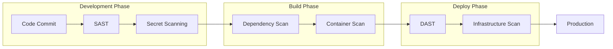

# How to Configure Security Scanning in Pipelines

Author: [nawazdhandala](https://www.github.com/nawazdhandala)

Tags: Security, DevSecOps, CI/CD, Pipelines, SAST, DAST, Vulnerability Scanning

Description: A practical guide to integrating security scanning tools into your CI/CD pipelines for automated vulnerability detection and compliance.

---

Security vulnerabilities caught in production cost ten times more to fix than those found during development. Integrating security scanning into your CI/CD pipelines shifts security left, catching issues early when they are cheapest and easiest to remediate. This guide walks through configuring different types of security scans in your build pipelines.

## Understanding Security Scanning Types

Before diving into implementation, let us understand the different types of security scans you can integrate:



| Scan Type | What It Checks | When to Run |
|-----------|---------------|-------------|
| SAST | Source code vulnerabilities | On every commit |
| Secret Scanning | Exposed credentials | On every commit |
| Dependency Scan | Third-party vulnerabilities | On every build |
| Container Scan | Image vulnerabilities | After image build |
| DAST | Running application | After deployment |
| IaC Scan | Infrastructure misconfigurations | On infrastructure changes |

## Setting Up SAST (Static Application Security Testing)

SAST tools analyze your source code without executing it. They can find vulnerabilities like SQL injection, XSS, and insecure coding patterns.

### GitHub Actions with CodeQL

CodeQL is GitHub's free SAST tool that supports multiple languages. It builds a database of your code and runs queries to find vulnerability patterns.

```yaml
# .github/workflows/codeql.yml
name: CodeQL Security Analysis

on:
  push:
    branches: [main, develop]
  pull_request:
    branches: [main]
  # Run weekly to catch newly discovered vulnerability patterns
  schedule:
    - cron: '0 2 * * 1'

jobs:
  analyze:
    name: Analyze Code
    runs-on: ubuntu-latest

    # Required permissions for CodeQL to upload results
    permissions:
      actions: read
      contents: read
      security-events: write

    strategy:
      fail-fast: false
      matrix:
        # Specify languages to analyze
        # CodeQL supports: javascript, python, java, go, csharp, cpp, ruby
        language: ['javascript', 'python']

    steps:
      - name: Checkout repository
        uses: actions/checkout@v4

      # Initialize CodeQL with the specified language
      - name: Initialize CodeQL
        uses: github/codeql-action/init@v3
        with:
          languages: ${{ matrix.language }}
          # Use extended security queries for more thorough scanning
          queries: security-extended,security-and-quality

      # For compiled languages, CodeQL needs to observe the build
      # For interpreted languages like JavaScript/Python, autobuild works
      - name: Autobuild
        uses: github/codeql-action/autobuild@v3

      # Perform the analysis and upload results
      - name: Perform CodeQL Analysis
        uses: github/codeql-action/analyze@v3
        with:
          category: "/language:${{ matrix.language }}"
```

### Using Semgrep for Custom Rules

Semgrep allows you to write custom security rules specific to your codebase. It is lightweight and fast, making it ideal for pre-commit hooks and CI.

```yaml
# .github/workflows/semgrep.yml
name: Semgrep Security Scan

on:
  pull_request: {}
  push:
    branches: [main]

jobs:
  semgrep:
    runs-on: ubuntu-latest

    steps:
      - uses: actions/checkout@v4

      - name: Run Semgrep
        uses: returntocorp/semgrep-action@v1
        with:
          # Use multiple rulesets for comprehensive coverage
          config: >-
            p/security-audit
            p/secrets
            p/owasp-top-ten
            p/nodejs
          # Generate SARIF output for GitHub Security tab
          generateSarif: "1"

      # Upload results to GitHub Security tab
      - name: Upload SARIF
        uses: github/codeql-action/upload-sarif@v3
        with:
          sarif_file: semgrep.sarif
        if: always()
```

### Custom Semgrep Rules

Create custom rules for patterns specific to your application. This example detects insecure token handling.

```yaml
# .semgrep/custom-rules.yml
rules:
  # Detect hardcoded API keys in JavaScript/TypeScript
  - id: hardcoded-api-key
    patterns:
      - pattern-either:
          - pattern: const $KEY = "sk_live_..."
          - pattern: const $KEY = "pk_live_..."
          - pattern: apiKey = "..."
    message: "Hardcoded API key detected. Use environment variables instead."
    severity: ERROR
    languages: [javascript, typescript]
    metadata:
      cwe: "CWE-798"
      owasp: "A3:2017 - Sensitive Data Exposure"

  # Detect unsafe eval usage
  - id: unsafe-eval
    pattern: eval($ARG)
    message: "eval() is dangerous and can lead to code injection. Consider alternatives."
    severity: WARNING
    languages: [javascript, typescript]
    metadata:
      cwe: "CWE-95"
```

## Secret Scanning Configuration

Leaked secrets in code repositories are a leading cause of breaches. Configure scanning to catch credentials before they reach your repository.

### GitLeaks for Secret Detection

GitLeaks scans your entire git history for accidentally committed secrets.

```yaml
# .github/workflows/secrets.yml
name: Secret Scanning

on:
  push:
    branches: [main, develop]
  pull_request:

jobs:
  gitleaks:
    runs-on: ubuntu-latest
    steps:
      - uses: actions/checkout@v4
        with:
          # Fetch full history to scan all commits
          fetch-depth: 0

      - name: Run Gitleaks
        uses: gitleaks/gitleaks-action@v2
        env:
          GITHUB_TOKEN: ${{ secrets.GITHUB_TOKEN }}
          # Custom config for your repo
          GITLEAKS_CONFIG: .gitleaks.toml
```

```toml
# .gitleaks.toml - Custom Gitleaks configuration
title = "Custom Gitleaks Config"

# Define custom rules for your specific secrets
[[rules]]
id = "custom-api-token"
description = "Custom API Token"
regex = '''MYAPP_TOKEN_[a-zA-Z0-9]{32}'''
tags = ["api", "token"]

# Allowlist paths that should be ignored
[allowlist]
paths = [
    '''.*_test\.go$''',
    '''.*\.md$''',
    '''testdata/''',
]

# Allowlist specific strings (use sparingly)
regexes = [
    '''EXAMPLE_TOKEN_PLACEHOLDER''',
]
```

## Dependency Vulnerability Scanning

Third-party dependencies often contain known vulnerabilities. Automated scanning ensures you catch these before deployment.

### Multi-Language Dependency Scanning

```yaml
# .github/workflows/dependency-scan.yml
name: Dependency Security Scan

on:
  push:
    branches: [main]
  pull_request:
  # Daily scan to catch newly disclosed CVEs
  schedule:
    - cron: '0 6 * * *'

jobs:
  # Node.js dependency scanning
  npm-audit:
    runs-on: ubuntu-latest
    steps:
      - uses: actions/checkout@v4

      - name: Setup Node.js
        uses: actions/setup-node@v4
        with:
          node-version: '20'
          cache: 'npm'

      - name: Install dependencies
        run: npm ci

      # Run npm audit with JSON output for processing
      - name: Run npm audit
        run: |
          npm audit --json > npm-audit.json || true

          # Count high and critical vulnerabilities
          HIGH=$(cat npm-audit.json | jq '.metadata.vulnerabilities.high // 0')
          CRITICAL=$(cat npm-audit.json | jq '.metadata.vulnerabilities.critical // 0')

          echo "High: $HIGH, Critical: $CRITICAL"

          # Fail if critical vulnerabilities found
          if [ "$CRITICAL" -gt 0 ]; then
            echo "::error::Critical vulnerabilities found!"
            exit 1
          fi

  # Python dependency scanning with Safety
  python-safety:
    runs-on: ubuntu-latest
    steps:
      - uses: actions/checkout@v4

      - name: Setup Python
        uses: actions/setup-python@v5
        with:
          python-version: '3.11'

      - name: Install Safety
        run: pip install safety

      - name: Run Safety check
        run: safety check -r requirements.txt --json > safety-report.json

      - name: Upload Safety report
        uses: actions/upload-artifact@v4
        with:
          name: safety-report
          path: safety-report.json

  # Go dependency scanning
  go-vuln:
    runs-on: ubuntu-latest
    steps:
      - uses: actions/checkout@v4

      - name: Setup Go
        uses: actions/setup-go@v5
        with:
          go-version: '1.22'

      - name: Run govulncheck
        run: |
          go install golang.org/x/vuln/cmd/govulncheck@latest
          govulncheck ./...
```

## Container Image Scanning

Container images can contain vulnerable base layers and packages. Scan images before pushing to your registry.

### Trivy Container Scanning

Trivy is a comprehensive vulnerability scanner for containers, filesystems, and git repositories.

```yaml
# .github/workflows/container-scan.yml
name: Container Security Scan

on:
  push:
    branches: [main]
    paths:
      - 'Dockerfile'
      - 'docker/**'

jobs:
  build-and-scan:
    runs-on: ubuntu-latest

    steps:
      - uses: actions/checkout@v4

      # Build the container image
      - name: Build Docker image
        run: docker build -t myapp:${{ github.sha }} .

      # Scan with Trivy
      - name: Run Trivy vulnerability scanner
        uses: aquasecurity/trivy-action@master
        with:
          image-ref: 'myapp:${{ github.sha }}'
          format: 'sarif'
          output: 'trivy-results.sarif'
          # Only report high and critical vulnerabilities
          severity: 'HIGH,CRITICAL'
          # Ignore unfixed vulnerabilities (optional)
          ignore-unfixed: true

      # Upload results to GitHub Security tab
      - name: Upload Trivy scan results
        uses: github/codeql-action/upload-sarif@v3
        with:
          sarif_file: 'trivy-results.sarif'

      # Fail the build if critical vulnerabilities found
      - name: Check for critical vulnerabilities
        uses: aquasecurity/trivy-action@master
        with:
          image-ref: 'myapp:${{ github.sha }}'
          format: 'table'
          exit-code: '1'
          severity: 'CRITICAL'
```

## Infrastructure as Code Scanning

Misconfigurations in infrastructure code can expose your systems to attacks. Scan Terraform, CloudFormation, and Kubernetes manifests.

```yaml
# .github/workflows/iac-scan.yml
name: Infrastructure Security Scan

on:
  push:
    paths:
      - 'terraform/**'
      - 'k8s/**'
      - 'cloudformation/**'
  pull_request:

jobs:
  checkov:
    runs-on: ubuntu-latest
    steps:
      - uses: actions/checkout@v4

      - name: Run Checkov
        uses: bridgecrewio/checkov-action@v12
        with:
          directory: .
          # Scan multiple IaC frameworks
          framework: terraform,kubernetes,cloudformation
          # Output formats
          output_format: cli,sarif
          output_file_path: console,checkov.sarif
          # Skip specific checks if needed
          skip_check: CKV_AWS_123

      - name: Upload SARIF
        uses: github/codeql-action/upload-sarif@v3
        with:
          sarif_file: checkov.sarif
        if: always()
```

## Unified Security Dashboard

Consolidate all security findings into a single view using a custom workflow.

```yaml
# .github/workflows/security-summary.yml
name: Security Summary

on:
  workflow_run:
    workflows: ["CodeQL", "Dependency Scan", "Container Scan"]
    types: [completed]

jobs:
  summarize:
    runs-on: ubuntu-latest
    steps:
      - name: Generate Security Report
        run: |
          echo "# Security Scan Summary" > security-report.md
          echo "Generated: $(date)" >> security-report.md
          echo "" >> security-report.md

          # Add logic to fetch and aggregate results
          # from various security scanning workflows

      - name: Create Issue for Failures
        if: failure()
        uses: actions/github-script@v7
        with:
          script: |
            github.rest.issues.create({
              owner: context.repo.owner,
              repo: context.repo.repo,
              title: 'Security Scan Failed',
              body: 'Security vulnerabilities detected. Review the workflow run.',
              labels: ['security', 'automated']
            })
```

## Best Practices for Pipeline Security Scanning

| Practice | Description |
|----------|-------------|
| Fail fast | Block deployments when critical vulnerabilities are found |
| Baseline known issues | Track existing vulnerabilities separately from new ones |
| Automate remediation | Use tools like Dependabot for automatic dependency updates |
| Monitor trends | Track vulnerability counts over time |
| Set SLAs | Define timeframes for fixing vulnerabilities by severity |

## Handling False Positives

Not every finding is a real vulnerability. Create a process for managing false positives.

```yaml
# .security/false-positives.yml
# Document acknowledged false positives with justification
false_positives:
  - id: "CWE-79-xss-123"
    file: "src/components/RichTextEditor.tsx"
    reason: "User input is sanitized by DOMPurify before rendering"
    approved_by: "security-team"
    approved_date: "2026-01-15"
    review_date: "2026-07-15"
```

Security scanning in pipelines is not a set-and-forget solution. Regularly review your scanning configuration, update rule sets, and adjust thresholds based on your team's capacity to respond to findings. The goal is to catch real vulnerabilities early while minimizing alert fatigue from false positives.
