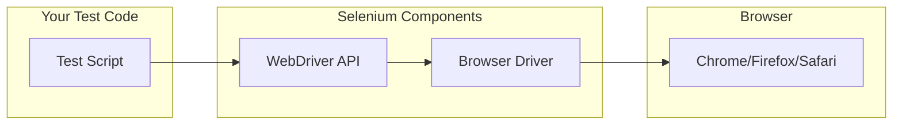

# How to Configure Selenium for Web Testing

Author: [nawazdhandala](https://www.github.com/nawazdhandala)

Tags: Selenium, Web Testing, Automation, Python, JavaScript, Testing, Quality Assurance, Browser Automation

Description: A comprehensive guide to configuring Selenium for reliable web testing, including setup, best practices, and common pitfalls to avoid.

---

Selenium is the industry standard for browser automation and web testing. However, getting it configured correctly can be challenging, especially when dealing with different browsers, CI environments, and modern web applications. This guide walks you through setting up Selenium properly and avoiding the common configuration mistakes that cause flaky tests.

## Understanding Selenium Architecture

Before diving into configuration, it helps to understand how Selenium works.



The WebDriver API sends commands to a browser-specific driver (like ChromeDriver), which controls the actual browser.

## Setting Up Selenium with Python

### Basic Installation

Start by installing Selenium and a WebDriver manager to handle driver binaries automatically.

```bash
# Install Selenium and webdriver-manager
pip install selenium webdriver-manager
```

### Configuring ChromeDriver

The most common setup uses Chrome with ChromeDriver.

```python
# selenium_config.py
from selenium import webdriver
from selenium.webdriver.chrome.service import Service
from selenium.webdriver.chrome.options import Options
from webdriver_manager.chrome import ChromeDriverManager

def create_chrome_driver(headless=False):
    """
    Create a configured Chrome WebDriver instance.

    Args:
        headless: Run browser without GUI (useful for CI)

    Returns:
        Configured WebDriver instance
    """
    options = Options()

    # Run in headless mode for CI environments
    if headless:
        options.add_argument('--headless=new')

    # Essential options for stability
    options.add_argument('--no-sandbox')
    options.add_argument('--disable-dev-shm-usage')
    options.add_argument('--disable-gpu')

    # Set window size for consistent screenshots
    options.add_argument('--window-size=1920,1080')

    # Disable automation detection
    options.add_argument('--disable-blink-features=AutomationControlled')
    options.add_experimental_option('excludeSwitches', ['enable-automation'])

    # Use webdriver-manager to handle driver installation
    service = Service(ChromeDriverManager().install())

    driver = webdriver.Chrome(service=service, options=options)

    # Set implicit wait for element finding
    driver.implicitly_wait(10)

    return driver
```

### Configuring Firefox

Firefox setup follows a similar pattern.

```python
# firefox_config.py
from selenium import webdriver
from selenium.webdriver.firefox.service import Service
from selenium.webdriver.firefox.options import Options
from webdriver_manager.firefox import GeckoDriverManager

def create_firefox_driver(headless=False):
    """Create a configured Firefox WebDriver instance."""
    options = Options()

    if headless:
        options.add_argument('--headless')

    # Set window size
    options.add_argument('--width=1920')
    options.add_argument('--height=1080')

    # Firefox-specific preferences
    options.set_preference('browser.download.folderList', 2)
    options.set_preference('browser.download.dir', '/tmp/downloads')
    options.set_preference('browser.helperApps.neverAsk.saveToDisk',
                          'application/pdf,text/csv')

    service = Service(GeckoDriverManager().install())
    driver = webdriver.Firefox(service=service, options=options)
    driver.implicitly_wait(10)

    return driver
```

## Setting Up Selenium with JavaScript

### Installation with npm

```bash
# Install Selenium WebDriver
npm install selenium-webdriver

# Install ChromeDriver
npm install chromedriver
```

### JavaScript Configuration

```javascript
// selenium-config.js
const { Builder, Browser } = require('selenium-webdriver');
const chrome = require('selenium-webdriver/chrome');
const firefox = require('selenium-webdriver/firefox');

/**
 * Create a configured Chrome WebDriver
 * @param {boolean} headless - Run without GUI
 * @returns {Promise<WebDriver>} Configured driver instance
 */
async function createChromeDriver(headless = false) {
  const options = new chrome.Options();

  if (headless) {
    options.addArguments('--headless=new');
  }

  // Essential stability options
  options.addArguments(
    '--no-sandbox',
    '--disable-dev-shm-usage',
    '--disable-gpu',
    '--window-size=1920,1080'
  );

  // Disable automation detection
  options.excludeSwitches('enable-automation');
  options.addArguments('--disable-blink-features=AutomationControlled');

  const driver = await new Builder()
    .forBrowser(Browser.CHROME)
    .setChromeOptions(options)
    .build();

  // Set timeouts
  await driver.manage().setTimeouts({
    implicit: 10000,
    pageLoad: 30000,
    script: 30000
  });

  return driver;
}

/**
 * Create a configured Firefox WebDriver
 */
async function createFirefoxDriver(headless = false) {
  const options = new firefox.Options();

  if (headless) {
    options.addArguments('--headless');
  }

  options.setPreference('browser.download.folderList', 2);
  options.setPreference('browser.download.dir', '/tmp/downloads');

  const driver = await new Builder()
    .forBrowser(Browser.FIREFOX)
    .setFirefoxOptions(options)
    .build();

  await driver.manage().setTimeouts({
    implicit: 10000,
    pageLoad: 30000
  });

  return driver;
}

module.exports = { createChromeDriver, createFirefoxDriver };
```

## Handling Waits Properly

One of the biggest sources of flaky tests is improper wait handling. Avoid hardcoded sleeps and use explicit waits instead.

```python
# waits.py
from selenium.webdriver.support.ui import WebDriverWait
from selenium.webdriver.support import expected_conditions as EC
from selenium.webdriver.common.by import By

class SmartWaits:
    """Helper class for reliable element waiting."""

    def __init__(self, driver, default_timeout=10):
        self.driver = driver
        self.default_timeout = default_timeout

    def wait_for_element_visible(self, locator, timeout=None):
        """Wait for element to be visible on the page."""
        timeout = timeout or self.default_timeout
        wait = WebDriverWait(self.driver, timeout)
        return wait.until(EC.visibility_of_element_located(locator))

    def wait_for_element_clickable(self, locator, timeout=None):
        """Wait for element to be clickable."""
        timeout = timeout or self.default_timeout
        wait = WebDriverWait(self.driver, timeout)
        return wait.until(EC.element_to_be_clickable(locator))

    def wait_for_text_present(self, locator, text, timeout=None):
        """Wait for specific text to appear in element."""
        timeout = timeout or self.default_timeout
        wait = WebDriverWait(self.driver, timeout)
        return wait.until(EC.text_to_be_present_in_element(locator, text))

    def wait_for_url_contains(self, url_substring, timeout=None):
        """Wait for URL to contain specific text."""
        timeout = timeout or self.default_timeout
        wait = WebDriverWait(self.driver, timeout)
        return wait.until(EC.url_contains(url_substring))

    def wait_for_ajax_complete(self, timeout=None):
        """Wait for all AJAX requests to complete (jQuery)."""
        timeout = timeout or self.default_timeout
        wait = WebDriverWait(self.driver, timeout)
        return wait.until(
            lambda d: d.execute_script('return jQuery.active == 0')
        )

# Usage example
def test_login(driver):
    waits = SmartWaits(driver)

    # Navigate to login page
    driver.get('https://example.com/login')

    # Wait for form to be ready
    username_field = waits.wait_for_element_visible(
        (By.ID, 'username')
    )
    username_field.send_keys('testuser')

    password_field = waits.wait_for_element_visible(
        (By.ID, 'password')
    )
    password_field.send_keys('testpass')

    # Wait for button to be clickable
    submit_button = waits.wait_for_element_clickable(
        (By.CSS_SELECTOR, 'button[type="submit"]')
    )
    submit_button.click()

    # Wait for redirect after login
    waits.wait_for_url_contains('/dashboard')
```

## Page Object Pattern

Structure your tests using the Page Object pattern for maintainability.

```python
# pages/login_page.py
from selenium.webdriver.common.by import By
from selenium.webdriver.support.ui import WebDriverWait
from selenium.webdriver.support import expected_conditions as EC

class LoginPage:
    """Page Object for the login page."""

    # Locators defined as class attributes
    URL = '/login'
    USERNAME_INPUT = (By.ID, 'username')
    PASSWORD_INPUT = (By.ID, 'password')
    SUBMIT_BUTTON = (By.CSS_SELECTOR, 'button[type="submit"]')
    ERROR_MESSAGE = (By.CSS_SELECTOR, '.error-message')

    def __init__(self, driver, base_url):
        self.driver = driver
        self.base_url = base_url
        self.wait = WebDriverWait(driver, 10)

    def navigate(self):
        """Navigate to the login page."""
        self.driver.get(f'{self.base_url}{self.URL}')
        return self

    def enter_username(self, username):
        """Enter username in the form."""
        field = self.wait.until(
            EC.visibility_of_element_located(self.USERNAME_INPUT)
        )
        field.clear()
        field.send_keys(username)
        return self

    def enter_password(self, password):
        """Enter password in the form."""
        field = self.wait.until(
            EC.visibility_of_element_located(self.PASSWORD_INPUT)
        )
        field.clear()
        field.send_keys(password)
        return self

    def click_submit(self):
        """Click the submit button."""
        button = self.wait.until(
            EC.element_to_be_clickable(self.SUBMIT_BUTTON)
        )
        button.click()
        return self

    def login(self, username, password):
        """Perform complete login flow."""
        self.enter_username(username)
        self.enter_password(password)
        self.click_submit()
        return self

    def get_error_message(self):
        """Get error message text if present."""
        try:
            element = self.wait.until(
                EC.visibility_of_element_located(self.ERROR_MESSAGE)
            )
            return element.text
        except:
            return None
```

## CI/CD Configuration

### Docker-based Setup

Running Selenium in Docker provides consistent environments.

```dockerfile
# Dockerfile.selenium
FROM python:3.11-slim

# Install Chrome
RUN apt-get update && apt-get install -y \
    wget \
    gnupg \
    && wget -q -O - https://dl.google.com/linux/linux_signing_key.pub | apt-key add - \
    && echo "deb [arch=amd64] http://dl.google.com/linux/chrome/deb/ stable main" >> /etc/apt/sources.list.d/google-chrome.list \
    && apt-get update \
    && apt-get install -y google-chrome-stable \
    && rm -rf /var/lib/apt/lists/*

# Install Python dependencies
COPY requirements.txt .
RUN pip install --no-cache-dir -r requirements.txt

# Copy test code
COPY . /app
WORKDIR /app

# Run tests
CMD ["pytest", "tests/", "-v", "--headless"]
```

### GitHub Actions Configuration

```yaml
# .github/workflows/selenium-tests.yml
name: Selenium Tests

on: [push, pull_request]

jobs:
  test:
    runs-on: ubuntu-latest

    steps:
      - uses: actions/checkout@v4

      - name: Set up Python
        uses: actions/setup-python@v5
        with:
          python-version: '3.11'

      - name: Install Chrome
        uses: browser-actions/setup-chrome@v1
        with:
          chrome-version: stable

      - name: Install dependencies
        run: |
          pip install -r requirements.txt

      - name: Run Selenium tests
        run: |
          pytest tests/ -v --headless
        env:
          HEADLESS: 'true'

      - name: Upload screenshots on failure
        if: failure()
        uses: actions/upload-artifact@v4
        with:
          name: failure-screenshots
          path: screenshots/
```

## Handling Common Issues

### Stale Element Reference

Elements can become stale when the DOM changes. Handle this gracefully.

```python
from selenium.common.exceptions import StaleElementReferenceException

def click_with_retry(driver, locator, max_attempts=3):
    """Click an element with retry for stale references."""
    for attempt in range(max_attempts):
        try:
            element = WebDriverWait(driver, 10).until(
                EC.element_to_be_clickable(locator)
            )
            element.click()
            return True
        except StaleElementReferenceException:
            if attempt == max_attempts - 1:
                raise
            # Element went stale, try again
            continue
    return False
```

### Screenshot on Failure

Capture screenshots when tests fail for easier debugging.

```python
# conftest.py (pytest)
import pytest
import os
from datetime import datetime

@pytest.hookimpl(tryfirst=True, hookwrapper=True)
def pytest_runtest_makereport(item, call):
    outcome = yield
    report = outcome.get_result()

    if report.when == 'call' and report.failed:
        driver = item.funcargs.get('driver')
        if driver:
            # Create screenshots directory
            os.makedirs('screenshots', exist_ok=True)

            # Generate filename with test name and timestamp
            timestamp = datetime.now().strftime('%Y%m%d_%H%M%S')
            filename = f"screenshots/{item.name}_{timestamp}.png"

            driver.save_screenshot(filename)
            print(f"\nScreenshot saved: {filename}")
```

## Best Practices Checklist

Follow these guidelines for reliable Selenium tests:

- Always use explicit waits instead of implicit waits or sleep
- Use the Page Object pattern for maintainable code
- Run tests in headless mode in CI environments
- Capture screenshots and logs on test failure
- Use a WebDriver manager to handle driver versions
- Close the browser in test teardown to prevent resource leaks
- Use unique, stable selectors (IDs, data attributes) over fragile ones (XPath with indexes)
- Set reasonable timeouts for your application's performance

By following this configuration guide, you will have a solid foundation for reliable Selenium tests that work consistently in both local development and CI environments. The key is proper setup, good wait handling, and structured code using patterns like Page Object.
