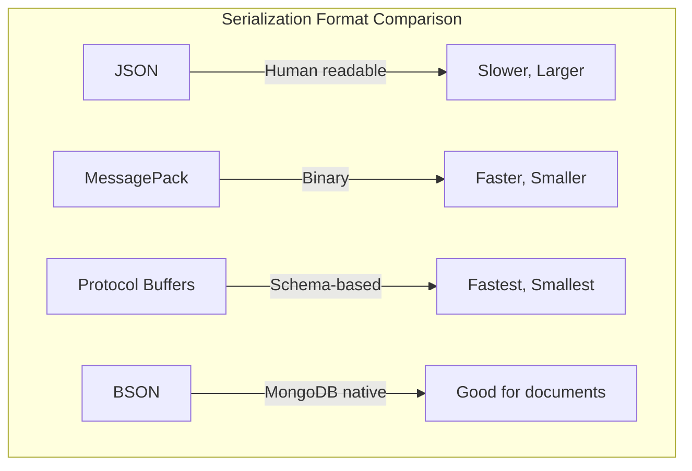

# How to Fix "Serialization" Performance Issues

Author: [nawazdhandala](https://www.github.com/nawazdhandala)

Tags: Performance, Serialization, JSON, Optimization, API, Data Transfer

Description: Learn how to identify and fix serialization performance bottlenecks that slow down your applications and APIs.

---

Serialization is the process of converting data structures into a format that can be stored or transmitted. While it seems straightforward, inefficient serialization can become a major performance bottleneck, especially in high-throughput applications. This guide covers common serialization issues and how to fix them.

---

## Understanding Serialization Overhead


Every serialization operation involves:
- Traversing the object graph
- Type checking and conversion
- String allocation and manipulation
- Memory copying

---

## Common Serialization Problems

### 1. Serializing Too Much Data

```javascript
// Bad: Serializing entire user object with sensitive data
const user = {
    id: 1,
    name: 'John Doe',
    email: 'john@example.com',
    password: 'hashed_password',  // Should not be sent
    sessions: [...],               // Large array, not needed
    auditLog: [...],              // Huge array, definitely not needed
    createdAt: new Date(),
    updatedAt: new Date()
};

// Slow and wasteful
res.json(user);

// Good: Serialize only what is needed
const userResponse = {
    id: user.id,
    name: user.name,
    email: user.email
};

res.json(userResponse);
```

---

### 2. Inefficient JSON Parsing in Node.js

```javascript
// slow-json.js
// Problem: JSON.parse and JSON.stringify are blocking operations

const largeData = generateLargeDataset(100000);

// Bad: Blocks the event loop
console.time('sync-stringify');
const jsonString = JSON.stringify(largeData);
console.timeEnd('sync-stringify');

// Better: Use streaming JSON for large datasets
const { Transform } = require('stream');
const JSONStream = require('JSONStream');

function streamingStringify(data, outputStream) {
    const stringifyStream = JSONStream.stringify();
    stringifyStream.pipe(outputStream);

    // Write each item individually
    for (const item of data) {
        stringifyStream.write(item);
    }

    stringifyStream.end();
}

// Even better: Use a worker thread for CPU-intensive serialization
const { Worker, isMainThread, parentPort, workerData } = require('worker_threads');

if (isMainThread) {
    // Main thread code
    async function serializeInWorker(data) {
        return new Promise((resolve, reject) => {
            const worker = new Worker(__filename, {
                workerData: data
            });

            worker.on('message', resolve);
            worker.on('error', reject);
        });
    }

    // Usage
    serializeInWorker(largeData).then(json => {
        console.log('Serialized in worker thread');
    });
} else {
    // Worker thread code
    const json = JSON.stringify(workerData);
    parentPort.postMessage(json);
}
```

---

## Faster Serialization Formats



### Using MessagePack

```javascript
// messagepack-example.js
const msgpack = require('msgpack-lite');

const data = {
    users: Array.from({ length: 1000 }, (_, i) => ({
        id: i,
        name: `User ${i}`,
        email: `user${i}@example.com`,
        active: i % 2 === 0
    }))
};

// Compare JSON vs MessagePack
console.time('json-encode');
const jsonEncoded = JSON.stringify(data);
console.timeEnd('json-encode');
console.log('JSON size:', jsonEncoded.length, 'bytes');

console.time('msgpack-encode');
const msgpackEncoded = msgpack.encode(data);
console.timeEnd('msgpack-encode');
console.log('MessagePack size:', msgpackEncoded.length, 'bytes');

// Decode comparison
console.time('json-decode');
JSON.parse(jsonEncoded);
console.timeEnd('json-decode');

console.time('msgpack-decode');
msgpack.decode(msgpackEncoded);
console.timeEnd('msgpack-decode');
```

---

### Using Protocol Buffers

```protobuf
// user.proto
syntax = "proto3";

message User {
    int32 id = 1;
    string name = 2;
    string email = 3;
    bool active = 4;
}

message UserList {
    repeated User users = 1;
}
```

```javascript
// protobuf-example.js
const protobuf = require('protobufjs');

async function main() {
    // Load the protobuf definition
    const root = await protobuf.load('user.proto');
    const UserList = root.lookupType('UserList');

    // Create test data
    const payload = {
        users: Array.from({ length: 1000 }, (_, i) => ({
            id: i,
            name: `User ${i}`,
            email: `user${i}@example.com`,
            active: i % 2 === 0
        }))
    };

    // Verify the data matches the schema
    const errMsg = UserList.verify(payload);
    if (errMsg) throw Error(errMsg);

    // Encode
    console.time('protobuf-encode');
    const message = UserList.create(payload);
    const buffer = UserList.encode(message).finish();
    console.timeEnd('protobuf-encode');
    console.log('Protobuf size:', buffer.length, 'bytes');

    // Decode
    console.time('protobuf-decode');
    const decoded = UserList.decode(buffer);
    console.timeEnd('protobuf-decode');
}

main();
```

---

## Python Serialization Optimization

```python
# serialization_comparison.py
import json
import pickle
import time
import msgpack
from dataclasses import dataclass, asdict
from typing import List

@dataclass
class User:
    id: int
    name: str
    email: str
    active: bool

def generate_users(count: int) -> List[dict]:
    return [
        {'id': i, 'name': f'User {i}', 'email': f'user{i}@example.com', 'active': i % 2 == 0}
        for i in range(count)
    ]

def benchmark_serialization():
    users = generate_users(10000)

    # JSON
    start = time.perf_counter()
    json_data = json.dumps(users)
    json_encode_time = time.perf_counter() - start

    start = time.perf_counter()
    json.loads(json_data)
    json_decode_time = time.perf_counter() - start

    print(f"JSON: encode={json_encode_time:.4f}s, decode={json_decode_time:.4f}s, size={len(json_data)} bytes")

    # MessagePack
    start = time.perf_counter()
    msgpack_data = msgpack.packb(users)
    msgpack_encode_time = time.perf_counter() - start

    start = time.perf_counter()
    msgpack.unpackb(msgpack_data)
    msgpack_decode_time = time.perf_counter() - start

    print(f"MsgPack: encode={msgpack_encode_time:.4f}s, decode={msgpack_decode_time:.4f}s, size={len(msgpack_data)} bytes")

    # Pickle (Python-specific, not for cross-language)
    start = time.perf_counter()
    pickle_data = pickle.dumps(users)
    pickle_encode_time = time.perf_counter() - start

    start = time.perf_counter()
    pickle.loads(pickle_data)
    pickle_decode_time = time.perf_counter() - start

    print(f"Pickle: encode={pickle_encode_time:.4f}s, decode={pickle_decode_time:.4f}s, size={len(pickle_data)} bytes")

if __name__ == '__main__':
    benchmark_serialization()
```

---

## Custom Serializers for Performance

```javascript
// custom-serializer.js
// When you know your data structure, custom serializers can be much faster

class FastUserSerializer {
    // Pre-compile the field names to avoid repeated string operations
    static FIELDS = ['id', 'name', 'email', 'active'];

    static serialize(users) {
        // Use array join instead of string concatenation
        const parts = ['['];

        for (let i = 0; i < users.length; i++) {
            if (i > 0) parts.push(',');

            const user = users[i];
            parts.push(
                '{"id":',
                String(user.id),
                ',"name":"',
                this.escapeString(user.name),
                '","email":"',
                this.escapeString(user.email),
                '","active":',
                user.active ? 'true' : 'false',
                '}'
            );
        }

        parts.push(']');
        return parts.join('');
    }

    static escapeString(str) {
        // Fast path for strings without special characters
        if (!/["\\\n\r\t]/.test(str)) return str;

        return str
            .replace(/\\/g, '\\\\')
            .replace(/"/g, '\\"')
            .replace(/\n/g, '\\n')
            .replace(/\r/g, '\\r')
            .replace(/\t/g, '\\t');
    }
}

// Benchmark
const users = Array.from({ length: 10000 }, (_, i) => ({
    id: i,
    name: `User ${i}`,
    email: `user${i}@example.com`,
    active: i % 2 === 0
}));

console.time('JSON.stringify');
const jsonResult = JSON.stringify(users);
console.timeEnd('JSON.stringify');

console.time('FastUserSerializer');
const fastResult = FastUserSerializer.serialize(users);
console.timeEnd('FastUserSerializer');

// Verify correctness
console.log('Results match:', jsonResult === fastResult);
```

---

## Caching Serialized Data

```javascript
// serialization-cache.js
const crypto = require('crypto');

class SerializationCache {
    constructor(maxSize = 1000) {
        this.cache = new Map();
        this.maxSize = maxSize;
    }

    // Create a hash key from the object
    createKey(obj) {
        // For simple objects, use a fast hash
        const str = JSON.stringify(obj);
        return crypto.createHash('md5').update(str).digest('hex');
    }

    // Get or create serialized version
    getOrSerialize(obj, serializer = JSON.stringify) {
        const key = this.createKey(obj);

        if (this.cache.has(key)) {
            return this.cache.get(key);
        }

        const serialized = serializer(obj);

        // Evict oldest if at capacity
        if (this.cache.size >= this.maxSize) {
            const firstKey = this.cache.keys().next().value;
            this.cache.delete(firstKey);
        }

        this.cache.set(key, serialized);
        return serialized;
    }

    clear() {
        this.cache.clear();
    }
}

// Usage with API responses
const cache = new SerializationCache(100);

function handleRequest(req, res) {
    const data = fetchDataFromDatabase();

    // Reuse serialized version if data hasn't changed
    const json = cache.getOrSerialize(data);

    res.setHeader('Content-Type', 'application/json');
    res.end(json);
}
```

---

## Performance Comparison Chart

| Format | Encode Speed | Decode Speed | Size | Human Readable |
|--------|--------------|--------------|------|----------------|
| JSON | Medium | Medium | Large | Yes |
| MessagePack | Fast | Fast | Small | No |
| Protocol Buffers | Fastest | Fastest | Smallest | No |
| BSON | Medium | Fast | Medium | No |
| Avro | Fast | Fast | Small | No |

---

## Best Practices

1. **Choose the right format**: Use JSON for debugging and human interfaces, binary formats for performance-critical paths
2. **Serialize only needed fields**: Create DTOs (Data Transfer Objects) with just the required data
3. **Use streaming for large datasets**: Avoid loading entire datasets into memory
4. **Cache serialized responses**: If data does not change often, cache the serialized form
5. **Consider compression**: For network transfer, gzip compression can offset larger serialization sizes
6. **Profile before optimizing**: Measure actual serialization time before switching formats
7. **Use schema validation**: Schemas catch errors early and enable optimizations

---

## Summary

Serialization performance issues often stem from:
- Serializing more data than necessary
- Using the wrong format for the use case
- Blocking the event loop with large synchronous operations
- Not caching frequently used serialized data

Fix these by selecting appropriate serialization formats, creating lean data transfer objects, using streaming or worker threads for large payloads, and implementing caching strategies.

---

*Monitor your API performance and serialization times in real-time with [OneUptime](https://oneuptime.com). Track response times, payload sizes, and identify slow endpoints before they impact your users.*
