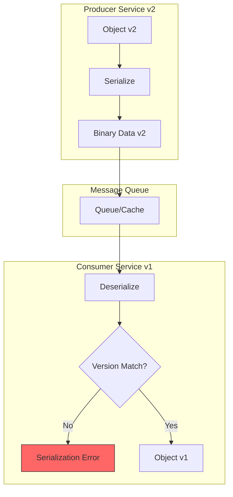
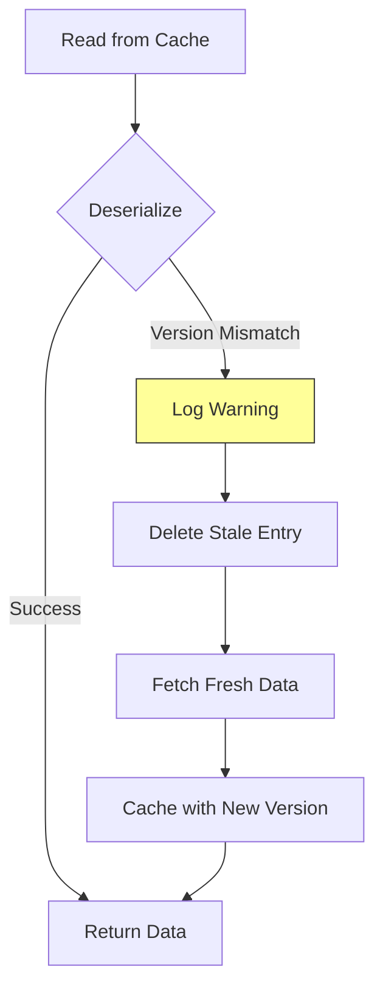
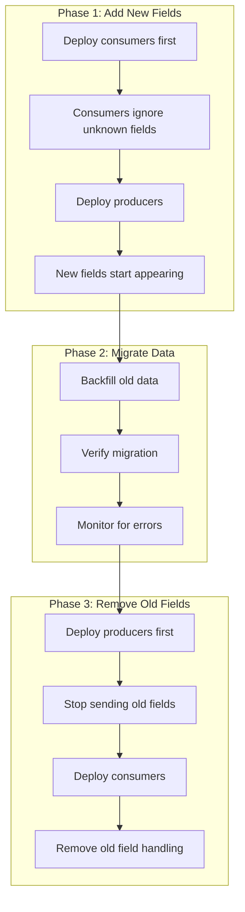

# How to Fix "Serialization Version" Mismatch Errors

Author: [nawazdhandala](https://www.github.com/nawazdhandala)

Tags: Serialization, Version Mismatch, Java, Protocol Buffers, Data Migration, Backward Compatibility, Microservices

Description: A practical guide to diagnosing and fixing serialization version mismatch errors in distributed systems, covering common causes, debugging techniques, and strategies for maintaining backward compatibility.

---

Serialization version mismatch errors occur when a service tries to deserialize data that was serialized with a different version of a class or schema. These errors are common in distributed systems during deployments when services run different code versions. This guide covers how to diagnose and fix these issues.

## Understanding Serialization Version Mismatches

Version mismatches happen when the serialized format changes between producer and consumer.



Common causes include:
- Adding or removing fields without proper versioning
- Changing field types
- Renaming classes or packages
- Missing serialVersionUID in Java
- Schema evolution in Protocol Buffers or Avro

## Diagnosing Java Serialization Errors

Java serialization errors are among the most common. Here is how to diagnose them.

```java
// SerializationDiagnostics.java - Tools for diagnosing serialization issues
import java.io.*;
import java.lang.reflect.Field;
import java.security.MessageDigest;
import java.util.*;

public class SerializationDiagnostics {

    /**
     * Calculate the effective serialVersionUID for a class.
     * This helps identify what Java computes when serialVersionUID is not declared.
     */
    public static long calculateSerialVersionUID(Class<?> clazz) {
        try {
            // Get declared serialVersionUID if present
            Field field = clazz.getDeclaredField("serialVersionUID");
            field.setAccessible(true);
            return field.getLong(null);
        } catch (NoSuchFieldException e) {
            // Calculate what JVM would generate
            return ObjectStreamClass.lookup(clazz).getSerialVersionUID();
        } catch (IllegalAccessException e) {
            throw new RuntimeException("Cannot access serialVersionUID", e);
        }
    }

    /**
     * Compare serialization compatibility between two class versions.
     */
    public static SerializationCompatibility checkCompatibility(
            Class<?> oldClass,
            Class<?> newClass) {

        List<String> issues = new ArrayList<>();

        // Check serialVersionUID
        long oldUID = calculateSerialVersionUID(oldClass);
        long newUID = calculateSerialVersionUID(newClass);

        if (oldUID != newUID) {
            issues.add(String.format(
                "serialVersionUID mismatch: old=%d, new=%d", oldUID, newUID));
        }

        // Compare fields
        Set<String> oldFields = getSerializableFields(oldClass);
        Set<String> newFields = getSerializableFields(newClass);

        // Check for removed fields
        Set<String> removed = new HashSet<>(oldFields);
        removed.removeAll(newFields);
        if (!removed.isEmpty()) {
            issues.add("Removed fields: " + removed);
        }

        // Check for added fields without defaults
        Set<String> added = new HashSet<>(newFields);
        added.removeAll(oldFields);
        if (!added.isEmpty()) {
            issues.add("Added fields (may cause issues if non-optional): " + added);
        }

        // Check for type changes
        for (String fieldName : oldFields) {
            if (newFields.contains(fieldName)) {
                Class<?> oldType = getFieldType(oldClass, fieldName);
                Class<?> newType = getFieldType(newClass, fieldName);
                if (oldType != null && newType != null && !oldType.equals(newType)) {
                    issues.add(String.format(
                        "Type change for '%s': %s -> %s",
                        fieldName, oldType.getName(), newType.getName()));
                }
            }
        }

        return new SerializationCompatibility(
            issues.isEmpty(),
            issues
        );
    }

    private static Set<String> getSerializableFields(Class<?> clazz) {
        Set<String> fields = new HashSet<>();
        for (Field field : clazz.getDeclaredFields()) {
            int modifiers = field.getModifiers();
            // Skip static and transient fields
            if (!java.lang.reflect.Modifier.isStatic(modifiers) &&
                !java.lang.reflect.Modifier.isTransient(modifiers)) {
                fields.add(field.getName());
            }
        }
        return fields;
    }

    private static Class<?> getFieldType(Class<?> clazz, String fieldName) {
        try {
            return clazz.getDeclaredField(fieldName).getType();
        } catch (NoSuchFieldException e) {
            return null;
        }
    }

    /**
     * Attempt to deserialize with detailed error reporting.
     */
    public static <T> DeserializationResult<T> safeDeserialize(
            byte[] data,
            Class<T> expectedType) {

        try (ByteArrayInputStream bais = new ByteArrayInputStream(data);
             ObjectInputStream ois = new ObjectInputStream(bais)) {

            @SuppressWarnings("unchecked")
            T obj = (T) ois.readObject();
            return DeserializationResult.success(obj);

        } catch (InvalidClassException e) {
            // Extract version information from exception
            String message = e.getMessage();
            return DeserializationResult.failure(
                "Invalid class version: " + message,
                extractVersionInfo(message)
            );

        } catch (ClassNotFoundException e) {
            return DeserializationResult.failure(
                "Class not found: " + e.getMessage(),
                Map.of("missingClass", e.getMessage())
            );

        } catch (IOException e) {
            return DeserializationResult.failure(
                "IO error: " + e.getMessage(),
                Map.of()
            );
        }
    }

    private static Map<String, String> extractVersionInfo(String message) {
        Map<String, String> info = new HashMap<>();

        // Parse "local class incompatible: stream classdesc serialVersionUID = X,
        // local class serialVersionUID = Y"
        if (message.contains("serialVersionUID")) {
            String[] parts = message.split("serialVersionUID = ");
            if (parts.length >= 2) {
                info.put("streamVersion", parts[1].split(",")[0].trim());
            }
            if (parts.length >= 3) {
                info.put("localVersion", parts[2].trim());
            }
        }

        return info;
    }

    // Result classes
    public static class SerializationCompatibility {
        public final boolean compatible;
        public final List<String> issues;

        public SerializationCompatibility(boolean compatible, List<String> issues) {
            this.compatible = compatible;
            this.issues = issues;
        }
    }

    public static class DeserializationResult<T> {
        public final boolean success;
        public final T value;
        public final String error;
        public final Map<String, String> details;

        private DeserializationResult(
                boolean success, T value, String error, Map<String, String> details) {
            this.success = success;
            this.value = value;
            this.error = error;
            this.details = details;
        }

        public static <T> DeserializationResult<T> success(T value) {
            return new DeserializationResult<>(true, value, null, Map.of());
        }

        public static <T> DeserializationResult<T> failure(
                String error, Map<String, String> details) {
            return new DeserializationResult<>(false, null, error, details);
        }
    }
}
```

## Implementing Backward Compatible Java Serialization

When you need to evolve serializable classes while maintaining compatibility.

```java
// VersionedSerializable.java - Backward compatible serialization pattern
import java.io.*;
import java.util.*;

public class VersionedSerializable implements Serializable {

    // ALWAYS declare serialVersionUID explicitly
    private static final long serialVersionUID = 1L;

    // Current schema version for custom handling
    private static final int CURRENT_VERSION = 3;

    // Original fields (v1)
    private String name;
    private int age;

    // Added in v2
    private String email;

    // Added in v3
    private List<String> tags;
    private Address address;

    public VersionedSerializable() {
        // Initialize defaults for optional fields
        this.tags = new ArrayList<>();
    }

    /**
     * Custom serialization for version control.
     */
    private void writeObject(ObjectOutputStream out) throws IOException {
        // Write version first
        out.writeInt(CURRENT_VERSION);

        // Write all fields
        out.writeObject(name);
        out.writeInt(age);
        out.writeObject(email);
        out.writeObject(tags);
        out.writeObject(address);
    }

    /**
     * Custom deserialization with version handling.
     */
    private void readObject(ObjectInputStream in)
            throws IOException, ClassNotFoundException {

        int version = in.readInt();

        // v1 fields - always present
        name = (String) in.readObject();
        age = in.readInt();

        // v2 fields
        if (version >= 2) {
            email = (String) in.readObject();
        } else {
            email = null;  // Default for old data
        }

        // v3 fields
        if (version >= 3) {
            @SuppressWarnings("unchecked")
            List<String> readTags = (List<String>) in.readObject();
            tags = readTags != null ? readTags : new ArrayList<>();
            address = (Address) in.readObject();
        } else {
            tags = new ArrayList<>();  // Default
            address = null;
        }
    }

    // Nested class also needs version handling
    public static class Address implements Serializable {
        private static final long serialVersionUID = 1L;
        private static final int CURRENT_VERSION = 2;

        private String street;
        private String city;
        private String country;  // Added in v2

        private void writeObject(ObjectOutputStream out) throws IOException {
            out.writeInt(CURRENT_VERSION);
            out.writeObject(street);
            out.writeObject(city);
            out.writeObject(country);
        }

        private void readObject(ObjectInputStream in)
                throws IOException, ClassNotFoundException {
            int version = in.readInt();
            street = (String) in.readObject();
            city = (String) in.readObject();

            if (version >= 2) {
                country = (String) in.readObject();
            } else {
                country = "Unknown";
            }
        }
    }

    // Getters and setters omitted for brevity
}
```

## Protocol Buffers Schema Evolution

Protocol Buffers provides better versioning support than Java serialization. Here is how to evolve schemas safely.

```protobuf
// user_v1.proto - Original schema
syntax = "proto3";

package example;

message User {
    int64 id = 1;
    string name = 2;
    string email = 3;
}
```

```protobuf
// user_v2.proto - Evolved schema with backward compatibility
syntax = "proto3";

package example;

message User {
    int64 id = 1;
    string name = 2;
    string email = 3;

    // New fields added with new field numbers
    string phone = 4;                    // Optional, defaults to empty
    repeated string tags = 5;            // Can add repeated fields
    Address address = 6;                 // Can add nested messages

    // RESERVED: Do not reuse these field numbers or names
    // Field 7 was 'age' - removed in v2
    reserved 7;
    reserved "age";
}

message Address {
    string street = 1;
    string city = 2;
    string country = 3;
    string postal_code = 4;
}
```

Handle schema evolution in your code.

```python
# protobuf_evolution.py - Handling Protocol Buffers schema evolution
from google.protobuf import json_format
from google.protobuf.message import DecodeError
import logging

logger = logging.getLogger(__name__)

class ProtobufVersionHandler:
    """
    Handles Protocol Buffers message versioning and migration.
    """

    def __init__(self):
        self._migrations = {}

    def register_migration(self, from_version: int, to_version: int, migrator):
        """Register a migration function between versions."""
        self._migrations[(from_version, to_version)] = migrator

    def deserialize_with_fallback(
        self,
        data: bytes,
        message_types: list,
        context: dict = None
    ):
        """
        Try to deserialize with multiple message types.

        Args:
            data: Serialized protobuf bytes
            message_types: List of message classes to try, newest first
            context: Additional context for error reporting

        Returns:
            Tuple of (message, message_type) or raises exception
        """
        errors = []

        for msg_type in message_types:
            try:
                msg = msg_type()
                msg.ParseFromString(data)

                # Validate required fields are present
                if self._validate_message(msg):
                    return msg, msg_type

            except DecodeError as e:
                errors.append(f"{msg_type.__name__}: {e}")
                continue

        # All attempts failed
        error_msg = f"Failed to deserialize message. Tried: {errors}"
        if context:
            error_msg += f" Context: {context}"

        logger.error(error_msg)
        raise ValueError(error_msg)

    def _validate_message(self, msg) -> bool:
        """Validate that a message has essential fields."""
        # Check if message has any fields set
        return msg.ByteSize() > 0

    def safe_get_field(self, msg, field_name, default=None):
        """
        Safely get a field that may not exist in older versions.

        Args:
            msg: Protobuf message
            field_name: Name of the field
            default: Default value if field is not set

        Returns:
            Field value or default
        """
        try:
            if msg.HasField(field_name):
                return getattr(msg, field_name)
        except ValueError:
            # Field is not a singular field (might be repeated or not exist)
            pass

        # For repeated fields and missing fields
        value = getattr(msg, field_name, default)

        # Check if it is an empty repeated field
        if hasattr(value, '__len__') and len(value) == 0:
            return default

        return value if value else default

    def migrate_message(self, msg, from_version: int, to_version: int):
        """
        Migrate a message from one version to another.

        Args:
            msg: Source message
            from_version: Source version
            to_version: Target version

        Returns:
            Migrated message
        """
        current_version = from_version
        current_msg = msg

        while current_version < to_version:
            next_version = current_version + 1
            migration_key = (current_version, next_version)

            if migration_key not in self._migrations:
                raise ValueError(
                    f"No migration path from v{current_version} to v{next_version}"
                )

            migrator = self._migrations[migration_key]
            current_msg = migrator(current_msg)
            current_version = next_version

        return current_msg


# Example migration functions
def migrate_user_v1_to_v2(user_v1):
    """Migrate User message from v1 to v2."""
    from generated import user_pb2

    user_v2 = user_pb2.User()
    user_v2.id = user_v1.id
    user_v2.name = user_v1.name
    user_v2.email = user_v1.email

    # Set defaults for new fields
    user_v2.phone = ""
    # tags is repeated, leave empty
    # address is optional, leave unset

    return user_v2


def migrate_user_v2_to_v3(user_v2):
    """Migrate User message from v2 to v3."""
    from generated import user_pb2

    user_v3 = user_pb2.User()
    user_v3.CopyFrom(user_v2)

    # Apply any v3 specific transformations
    # For example, normalize phone number format
    if user_v3.phone:
        user_v3.phone = normalize_phone(user_v3.phone)

    return user_v3


def normalize_phone(phone: str) -> str:
    """Normalize phone number format."""
    # Remove non-numeric characters
    digits = ''.join(c for c in phone if c.isdigit())
    return digits
```

## JSON Serialization Version Handling

JSON is more flexible but still needs version handling for schema changes.

```python
# json_versioning.py - JSON schema versioning and migration
import json
import logging
from dataclasses import dataclass, field, asdict
from typing import Any, Callable, Dict, List, Optional, Type, TypeVar
from datetime import datetime

logger = logging.getLogger(__name__)

T = TypeVar('T')

@dataclass
class VersionedDocument:
    """Base class for versioned JSON documents."""
    _schema_version: int = 1
    _created_at: str = field(default_factory=lambda: datetime.utcnow().isoformat())


class JsonVersionManager:
    """
    Manages JSON document versioning and migrations.
    """

    def __init__(self):
        self._schemas: Dict[str, Dict[int, Type]] = {}
        self._migrations: Dict[str, Dict[tuple, Callable]] = {}
        self._current_versions: Dict[str, int] = {}

    def register_schema(
        self,
        document_type: str,
        version: int,
        schema_class: Type,
        is_current: bool = False
    ) -> None:
        """Register a schema version for a document type."""
        if document_type not in self._schemas:
            self._schemas[document_type] = {}

        self._schemas[document_type][version] = schema_class

        if is_current:
            self._current_versions[document_type] = version

    def register_migration(
        self,
        document_type: str,
        from_version: int,
        to_version: int,
        migrator: Callable[[Dict], Dict]
    ) -> None:
        """Register a migration function."""
        if document_type not in self._migrations:
            self._migrations[document_type] = {}

        self._migrations[document_type][(from_version, to_version)] = migrator

    def deserialize(
        self,
        json_string: str,
        document_type: str,
        target_version: Optional[int] = None
    ) -> Any:
        """
        Deserialize JSON with automatic version migration.

        Args:
            json_string: JSON string to deserialize
            document_type: Type of document
            target_version: Target version (uses current if None)

        Returns:
            Deserialized and migrated object
        """
        data = json.loads(json_string)

        # Determine source version
        source_version = data.get('_schema_version', 1)

        # Determine target version
        if target_version is None:
            target_version = self._current_versions.get(document_type, source_version)

        # Migrate if needed
        if source_version != target_version:
            data = self._migrate(document_type, data, source_version, target_version)

        # Get schema class for target version
        schema_class = self._schemas.get(document_type, {}).get(target_version)

        if schema_class:
            # Remove internal fields before instantiation
            clean_data = {
                k: v for k, v in data.items()
                if not k.startswith('_')
            }
            return schema_class(**clean_data)

        return data

    def serialize(self, obj: Any, document_type: str) -> str:
        """
        Serialize object to JSON with version information.

        Args:
            obj: Object to serialize
            document_type: Type of document

        Returns:
            JSON string with version metadata
        """
        if hasattr(obj, '__dict__'):
            data = asdict(obj) if hasattr(obj, '__dataclass_fields__') else obj.__dict__
        else:
            data = dict(obj)

        # Add version metadata
        current_version = self._current_versions.get(document_type, 1)
        data['_schema_version'] = current_version
        data['_document_type'] = document_type

        return json.dumps(data, default=str)

    def _migrate(
        self,
        document_type: str,
        data: Dict,
        from_version: int,
        to_version: int
    ) -> Dict:
        """Migrate data through version chain."""
        current = from_version
        current_data = data.copy()

        while current != to_version:
            if current < to_version:
                next_version = current + 1
            else:
                next_version = current - 1

            migration_key = (current, next_version)
            migrations = self._migrations.get(document_type, {})

            if migration_key not in migrations:
                raise ValueError(
                    f"No migration for {document_type} from v{current} to v{next_version}"
                )

            logger.info(
                f"Migrating {document_type} from v{current} to v{next_version}"
            )

            current_data = migrations[migration_key](current_data)
            current_data['_schema_version'] = next_version
            current = next_version

        return current_data


# Example usage with dataclasses
@dataclass
class UserV1:
    """User schema version 1."""
    name: str
    email: str


@dataclass
class UserV2:
    """User schema version 2 - added phone."""
    name: str
    email: str
    phone: str = ""


@dataclass
class UserV3:
    """User schema version 3 - split name into first/last."""
    first_name: str
    last_name: str
    email: str
    phone: str = ""


def migrate_user_v1_to_v2(data: Dict) -> Dict:
    """Migrate user from v1 to v2."""
    return {
        **data,
        'phone': data.get('phone', '')
    }


def migrate_user_v2_to_v3(data: Dict) -> Dict:
    """Migrate user from v2 to v3 - split name."""
    name = data.get('name', '')
    parts = name.split(' ', 1)

    return {
        'first_name': parts[0] if parts else '',
        'last_name': parts[1] if len(parts) > 1 else '',
        'email': data.get('email', ''),
        'phone': data.get('phone', '')
    }


# Setup version manager
def setup_user_versioning() -> JsonVersionManager:
    """Configure user document versioning."""
    manager = JsonVersionManager()

    # Register schemas
    manager.register_schema('user', 1, UserV1)
    manager.register_schema('user', 2, UserV2)
    manager.register_schema('user', 3, UserV3, is_current=True)

    # Register migrations
    manager.register_migration('user', 1, 2, migrate_user_v1_to_v2)
    manager.register_migration('user', 2, 3, migrate_user_v2_to_v3)

    return manager
```

## Handling Cache Serialization Mismatches

Cache deserialization errors are common during deployments. Here is how to handle them gracefully.



```python
# cache_serialization.py - Graceful cache serialization handling
import pickle
import json
import logging
import hashlib
from typing import Any, Callable, Optional, TypeVar
from dataclasses import dataclass

logger = logging.getLogger(__name__)

T = TypeVar('T')

@dataclass
class CacheEntry:
    """Wrapper for cached data with version info."""
    version: str
    data: Any
    serializer: str = "json"


class VersionedCacheSerializer:
    """
    Cache serializer with version awareness.

    Handles serialization mismatches gracefully by:
    - Tracking schema versions
    - Falling back to source on mismatch
    - Automatically refreshing stale entries
    """

    def __init__(
        self,
        cache_client,
        schema_version: str,
        fallback_enabled: bool = True
    ):
        """
        Initialize versioned cache serializer.

        Args:
            cache_client: Redis or other cache client
            schema_version: Current schema version string
            fallback_enabled: Whether to fallback on mismatch
        """
        self._cache = cache_client
        self._schema_version = schema_version
        self._fallback_enabled = fallback_enabled
        self._mismatch_count = 0

    def _serialize(self, value: Any) -> bytes:
        """Serialize value with version wrapper."""
        entry = CacheEntry(
            version=self._schema_version,
            data=value,
            serializer="json"
        )

        try:
            # Try JSON first for debugging ease
            json_str = json.dumps({
                'version': entry.version,
                'data': entry.data,
                'serializer': entry.serializer
            }, default=str)
            return json_str.encode('utf-8')
        except (TypeError, ValueError):
            # Fall back to pickle for complex objects
            entry.serializer = "pickle"
            return pickle.dumps(entry)

    def _deserialize(self, data: bytes) -> CacheEntry:
        """Deserialize value and check version."""
        try:
            # Try JSON first
            json_data = json.loads(data.decode('utf-8'))
            return CacheEntry(
                version=json_data['version'],
                data=json_data['data'],
                serializer=json_data.get('serializer', 'json')
            )
        except (json.JSONDecodeError, UnicodeDecodeError):
            # Try pickle
            return pickle.loads(data)

    def get(
        self,
        key: str,
        fallback: Optional[Callable[[], T]] = None
    ) -> Optional[T]:
        """
        Get value from cache with version checking.

        Args:
            key: Cache key
            fallback: Function to call on cache miss or version mismatch

        Returns:
            Cached value or fallback result
        """
        try:
            raw_data = self._cache.get(key)

            if raw_data is None:
                logger.debug(f"Cache miss for {key}")
                if fallback and self._fallback_enabled:
                    return self._fetch_and_cache(key, fallback)
                return None

            entry = self._deserialize(raw_data)

            # Check version
            if entry.version != self._schema_version:
                self._mismatch_count += 1
                logger.warning(
                    f"Cache version mismatch for {key}: "
                    f"cached={entry.version}, current={self._schema_version}"
                )

                # Delete stale entry
                self._cache.delete(key)

                if fallback and self._fallback_enabled:
                    return self._fetch_and_cache(key, fallback)
                return None

            return entry.data

        except Exception as e:
            logger.error(f"Cache deserialization error for {key}: {e}")

            # Delete corrupted entry
            try:
                self._cache.delete(key)
            except Exception:
                pass

            if fallback and self._fallback_enabled:
                return self._fetch_and_cache(key, fallback)
            return None

    def set(self, key: str, value: Any, ttl: int = 3600) -> bool:
        """
        Set value in cache with version info.

        Args:
            key: Cache key
            value: Value to cache
            ttl: Time-to-live in seconds

        Returns:
            True if successful
        """
        try:
            serialized = self._serialize(value)
            self._cache.setex(key, ttl, serialized)
            return True
        except Exception as e:
            logger.error(f"Cache serialization error for {key}: {e}")
            return False

    def _fetch_and_cache(
        self,
        key: str,
        fallback: Callable[[], T],
        ttl: int = 3600
    ) -> T:
        """Fetch fresh data and cache it."""
        value = fallback()
        self.set(key, value, ttl)
        return value

    def get_mismatch_count(self) -> int:
        """Get count of version mismatches (for monitoring)."""
        return self._mismatch_count

    @staticmethod
    def compute_schema_version(*classes) -> str:
        """
        Compute schema version from class definitions.

        This creates a hash based on class structure, so version
        changes automatically when classes change.
        """
        class_signatures = []

        for cls in classes:
            sig_parts = [cls.__name__]

            # Include field information
            if hasattr(cls, '__dataclass_fields__'):
                for name, field in cls.__dataclass_fields__.items():
                    sig_parts.append(f"{name}:{field.type}")
            elif hasattr(cls, '__annotations__'):
                for name, type_hint in cls.__annotations__.items():
                    sig_parts.append(f"{name}:{type_hint}")

            class_signatures.append('|'.join(sig_parts))

        combined = '::'.join(sorted(class_signatures))
        return hashlib.md5(combined.encode()).hexdigest()[:12]
```

## Deployment Strategies for Schema Changes

Proper deployment ordering prevents serialization mismatches.



## Best Practices

1. **Always declare explicit version identifiers** - Use serialVersionUID in Java, schema versions in JSON/Protobuf.

2. **Add fields as optional** - New fields should have sensible defaults for old data.

3. **Never remove or rename fields directly** - Mark as deprecated first, then remove in a later version.

4. **Deploy consumers before producers** - Consumers should be able to handle new fields before producers start sending them.

5. **Test serialization compatibility** - Include compatibility tests in your CI/CD pipeline.

6. **Monitor deserialization errors** - Track version mismatch errors to detect deployment issues.

7. **Use schema registries** - For Kafka and similar systems, use schema registries to enforce compatibility.

8. **Document all changes** - Maintain a changelog of schema changes for debugging.

Following these practices will help you avoid serialization version mismatch errors and handle them gracefully when they occur.
