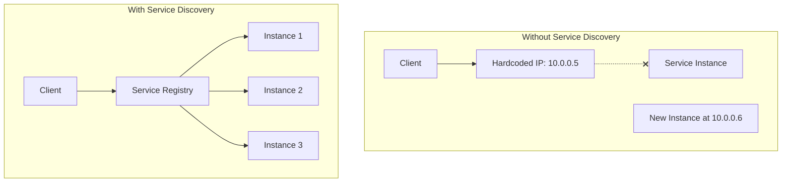
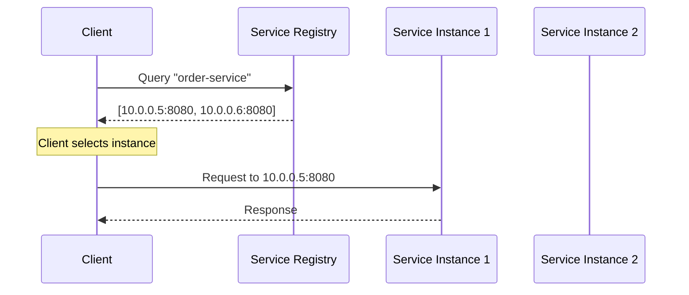
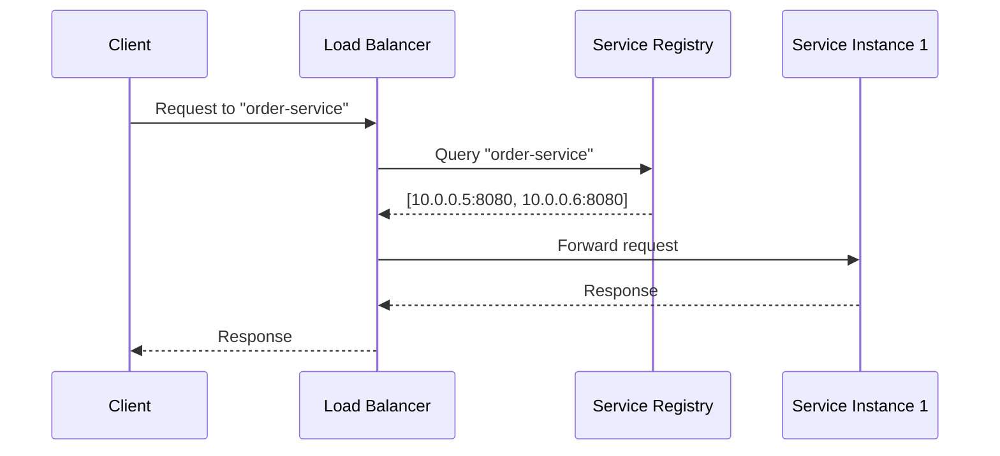
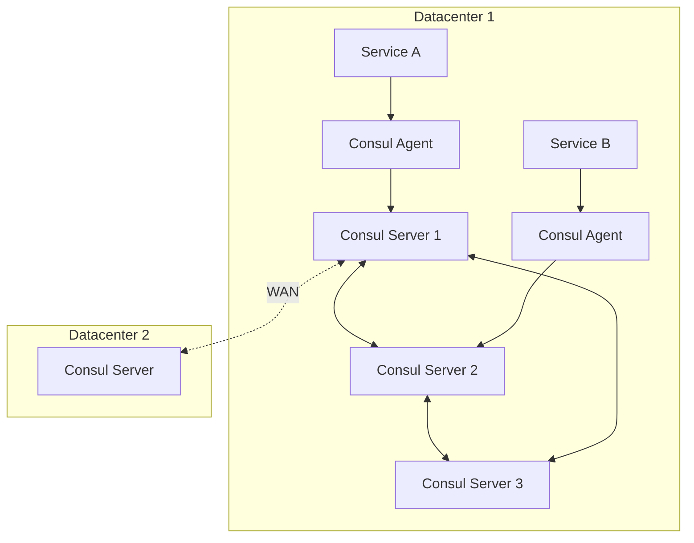
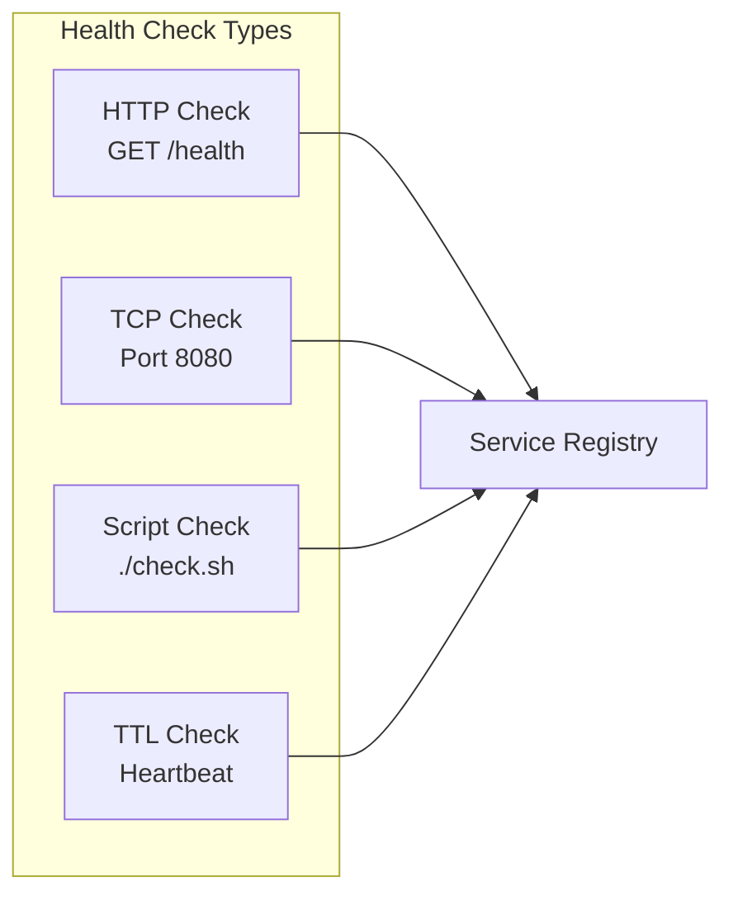

# How to Handle Service Discovery in Microservices

Author: [nawazdhandala](https://www.github.com/nawazdhandala)

Tags: Microservices, Service Discovery, Kubernetes, Consul, DNS, Load Balancing, DevOps

Description: A practical guide to implementing service discovery in microservices architectures using DNS, Kubernetes services, Consul, and client-side discovery patterns.

---

In a microservices architecture, services need to find each other. Hardcoding IP addresses is a recipe for disaster. Service discovery solves this by maintaining a registry of available service instances and their locations.

## Why Service Discovery Matters

In traditional monolithic applications, components communicate via in-process method calls. In microservices, each service runs in its own process, often across multiple instances for scalability and reliability.



## Service Discovery Patterns

There are two main patterns for service discovery: client-side and server-side.

### Client-Side Discovery

The client queries the service registry and selects an instance using a load-balancing algorithm.



### Server-Side Discovery

The client sends requests to a load balancer, which queries the registry and forwards the request.



## Kubernetes Service Discovery

Kubernetes provides built-in service discovery through DNS and Services.

### ClusterIP Service

The most common service discovery method in Kubernetes. Creates a stable internal IP and DNS name.

```yaml
# order-service.yaml
apiVersion: v1
kind: Service
metadata:
  name: order-service
  namespace: production
spec:
  selector:
    app: order-service
  ports:
    - port: 80
      targetPort: 8080
  type: ClusterIP
---
apiVersion: apps/v1
kind: Deployment
metadata:
  name: order-service
  namespace: production
spec:
  replicas: 3
  selector:
    matchLabels:
      app: order-service
  template:
    metadata:
      labels:
        app: order-service
    spec:
      containers:
        - name: order-service
          image: order-service:1.0.0
          ports:
            - containerPort: 8080
          # Health checks for service discovery
          readinessProbe:
            httpGet:
              path: /health/ready
              port: 8080
            initialDelaySeconds: 5
            periodSeconds: 10
          livenessProbe:
            httpGet:
              path: /health/live
              port: 8080
            initialDelaySeconds: 15
            periodSeconds: 20
```

### DNS Resolution in Kubernetes

Kubernetes automatically creates DNS entries for services.

```bash
# Full DNS name format
<service-name>.<namespace>.svc.cluster.local

# Examples
order-service.production.svc.cluster.local
payment-service.production.svc.cluster.local

# Within the same namespace, use short names
order-service
payment-service
```

### Using Kubernetes DNS in Applications

```javascript
// Node.js example using Kubernetes DNS
const axios = require('axios');

// Configuration using environment variables for flexibility
const ORDER_SERVICE_URL = process.env.ORDER_SERVICE_URL || 'http://order-service';
const PAYMENT_SERVICE_URL = process.env.PAYMENT_SERVICE_URL || 'http://payment-service';

async function createOrder(orderData) {
    try {
        // Call order service using Kubernetes DNS
        const orderResponse = await axios.post(
            `${ORDER_SERVICE_URL}/api/orders`,
            orderData,
            {
                timeout: 5000,
                headers: {
                    'Content-Type': 'application/json'
                }
            }
        );

        // Call payment service
        const paymentResponse = await axios.post(
            `${PAYMENT_SERVICE_URL}/api/payments`,
            {
                orderId: orderResponse.data.id,
                amount: orderResponse.data.total
            }
        );

        return {
            order: orderResponse.data,
            payment: paymentResponse.data
        };
    } catch (error) {
        console.error('Service call failed:', error.message);
        throw error;
    }
}
```

### Headless Services for Direct Pod Access

When you need to discover individual pod IPs instead of load-balanced access.

```yaml
# headless-service.yaml
apiVersion: v1
kind: Service
metadata:
  name: database-cluster
  namespace: production
spec:
  clusterIP: None  # This makes it headless
  selector:
    app: postgres
  ports:
    - port: 5432
      targetPort: 5432
```

```bash
# DNS lookup returns all pod IPs
nslookup database-cluster.production.svc.cluster.local

# Returns:
# database-cluster-0.database-cluster.production.svc.cluster.local -> 10.0.0.5
# database-cluster-1.database-cluster.production.svc.cluster.local -> 10.0.0.6
# database-cluster-2.database-cluster.production.svc.cluster.local -> 10.0.0.7
```

## HashiCorp Consul Service Discovery

Consul provides a more feature-rich service discovery solution with health checking, key-value storage, and multi-datacenter support.

### Consul Architecture



### Service Registration with Consul

```json
{
  "service": {
    "name": "order-service",
    "id": "order-service-1",
    "port": 8080,
    "tags": ["production", "v1.2.0"],
    "meta": {
      "version": "1.2.0",
      "environment": "production"
    },
    "check": {
      "http": "http://localhost:8080/health",
      "interval": "10s",
      "timeout": "5s",
      "deregister_critical_service_after": "1m"
    }
  }
}
```

### Consul DNS Interface

Consul provides a DNS interface for service discovery.

```bash
# Query service by name
dig @127.0.0.1 -p 8600 order-service.service.consul

# Query with tag filtering
dig @127.0.0.1 -p 8600 production.order-service.service.consul

# SRV records include port information
dig @127.0.0.1 -p 8600 order-service.service.consul SRV
```

### Consul Connect (Service Mesh)

Consul Connect provides secure service-to-service communication with automatic mTLS.

```yaml
# Kubernetes deployment with Consul Connect
apiVersion: apps/v1
kind: Deployment
metadata:
  name: order-service
spec:
  template:
    metadata:
      annotations:
        # Enable Consul Connect sidecar injection
        'consul.hashicorp.com/connect-inject': 'true'
        # Define upstream services
        'consul.hashicorp.com/connect-service-upstreams': 'payment-service:8081,inventory-service:8082'
    spec:
      containers:
        - name: order-service
          image: order-service:1.0.0
          env:
            # Connect to upstream services via localhost
            - name: PAYMENT_SERVICE_URL
              value: "http://localhost:8081"
            - name: INVENTORY_SERVICE_URL
              value: "http://localhost:8082"
```

## Client-Side Service Discovery Implementation

### Go Implementation with Consul

```go
package discovery

import (
    "fmt"
    "log"
    "math/rand"
    "sync"
    "time"

    consul "github.com/hashicorp/consul/api"
)

// ServiceDiscovery handles service registration and discovery
type ServiceDiscovery struct {
    client       *consul.Client
    cache        map[string][]*consul.ServiceEntry
    cacheMutex   sync.RWMutex
    cacheTimeout time.Duration
    lastUpdate   map[string]time.Time
}

// NewServiceDiscovery creates a new service discovery client
func NewServiceDiscovery(consulAddr string) (*ServiceDiscovery, error) {
    config := consul.DefaultConfig()
    config.Address = consulAddr

    client, err := consul.NewClient(config)
    if err != nil {
        return nil, fmt.Errorf("failed to create consul client: %w", err)
    }

    return &ServiceDiscovery{
        client:       client,
        cache:        make(map[string][]*consul.ServiceEntry),
        cacheTimeout: 30 * time.Second,
        lastUpdate:   make(map[string]time.Time),
    }, nil
}

// Register registers a service with Consul
func (sd *ServiceDiscovery) Register(name, id, address string, port int, tags []string) error {
    registration := &consul.AgentServiceRegistration{
        ID:      id,
        Name:    name,
        Address: address,
        Port:    port,
        Tags:    tags,
        Check: &consul.AgentServiceCheck{
            HTTP:                           fmt.Sprintf("http://%s:%d/health", address, port),
            Interval:                       "10s",
            Timeout:                        "5s",
            DeregisterCriticalServiceAfter: "1m",
        },
    }

    err := sd.client.Agent().ServiceRegister(registration)
    if err != nil {
        return fmt.Errorf("failed to register service: %w", err)
    }

    log.Printf("Registered service %s with ID %s", name, id)
    return nil
}

// Deregister removes a service from Consul
func (sd *ServiceDiscovery) Deregister(serviceID string) error {
    return sd.client.Agent().ServiceDeregister(serviceID)
}

// Discover finds healthy instances of a service
func (sd *ServiceDiscovery) Discover(serviceName string) ([]*consul.ServiceEntry, error) {
    // Check cache first
    sd.cacheMutex.RLock()
    if entries, ok := sd.cache[serviceName]; ok {
        if time.Since(sd.lastUpdate[serviceName]) < sd.cacheTimeout {
            sd.cacheMutex.RUnlock()
            return entries, nil
        }
    }
    sd.cacheMutex.RUnlock()

    // Query Consul for healthy services
    entries, _, err := sd.client.Health().Service(serviceName, "", true, nil)
    if err != nil {
        return nil, fmt.Errorf("failed to discover service %s: %w", serviceName, err)
    }

    // Update cache
    sd.cacheMutex.Lock()
    sd.cache[serviceName] = entries
    sd.lastUpdate[serviceName] = time.Now()
    sd.cacheMutex.Unlock()

    return entries, nil
}

// GetInstance returns a single healthy instance using random selection
func (sd *ServiceDiscovery) GetInstance(serviceName string) (string, int, error) {
    entries, err := sd.Discover(serviceName)
    if err != nil {
        return "", 0, err
    }

    if len(entries) == 0 {
        return "", 0, fmt.Errorf("no healthy instances found for service %s", serviceName)
    }

    // Random load balancing
    entry := entries[rand.Intn(len(entries))]
    return entry.Service.Address, entry.Service.Port, nil
}
```

### Using the Service Discovery Client

```go
package main

import (
    "fmt"
    "log"
    "net/http"
    "os"
    "os/signal"
    "syscall"

    "myapp/discovery"
)

func main() {
    // Initialize service discovery
    sd, err := discovery.NewServiceDiscovery("consul:8500")
    if err != nil {
        log.Fatal(err)
    }

    // Register this service
    hostname, _ := os.Hostname()
    serviceID := fmt.Sprintf("order-service-%s", hostname)

    err = sd.Register(
        "order-service",
        serviceID,
        hostname,
        8080,
        []string{"production", "v1.0.0"},
    )
    if err != nil {
        log.Fatal(err)
    }

    // Graceful shutdown
    sigChan := make(chan os.Signal, 1)
    signal.Notify(sigChan, syscall.SIGINT, syscall.SIGTERM)

    go func() {
        <-sigChan
        log.Println("Shutting down, deregistering service...")
        sd.Deregister(serviceID)
        os.Exit(0)
    }()

    // HTTP handler that calls another service
    http.HandleFunc("/orders", func(w http.ResponseWriter, r *http.Request) {
        // Discover payment service
        address, port, err := sd.GetInstance("payment-service")
        if err != nil {
            http.Error(w, "Payment service unavailable", http.StatusServiceUnavailable)
            return
        }

        paymentURL := fmt.Sprintf("http://%s:%d/api/payments", address, port)
        log.Printf("Calling payment service at %s", paymentURL)

        // Make request to payment service
        // ... rest of the handler
    })

    log.Println("Starting server on :8080")
    http.ListenAndServe(":8080", nil)
}
```

## Health Checks and Service Health

Service discovery is only useful if unhealthy instances are removed from the registry.

### Health Check Types



### Implementing Health Endpoints

```javascript
// Express.js health check endpoints
const express = require('express');
const app = express();

// Track service state
let isReady = false;
let dependencies = {
    database: false,
    cache: false
};

// Initialize dependencies
async function initializeDependencies() {
    try {
        // Check database connection
        await database.ping();
        dependencies.database = true;

        // Check cache connection
        await redis.ping();
        dependencies.cache = true;

        isReady = true;
    } catch (error) {
        console.error('Failed to initialize dependencies:', error);
    }
}

// Liveness probe - is the process running?
app.get('/health/live', (req, res) => {
    res.status(200).json({
        status: 'alive',
        timestamp: new Date().toISOString()
    });
});

// Readiness probe - is the service ready to accept traffic?
app.get('/health/ready', (req, res) => {
    if (!isReady) {
        return res.status(503).json({
            status: 'not ready',
            dependencies
        });
    }

    res.status(200).json({
        status: 'ready',
        dependencies
    });
});

// Detailed health check for monitoring
app.get('/health', async (req, res) => {
    const health = {
        status: 'healthy',
        timestamp: new Date().toISOString(),
        uptime: process.uptime(),
        checks: {}
    };

    // Check database
    try {
        const start = Date.now();
        await database.ping();
        health.checks.database = {
            status: 'healthy',
            responseTime: Date.now() - start
        };
    } catch (error) {
        health.status = 'unhealthy';
        health.checks.database = {
            status: 'unhealthy',
            error: error.message
        };
    }

    // Check cache
    try {
        const start = Date.now();
        await redis.ping();
        health.checks.cache = {
            status: 'healthy',
            responseTime: Date.now() - start
        };
    } catch (error) {
        health.status = 'degraded';
        health.checks.cache = {
            status: 'unhealthy',
            error: error.message
        };
    }

    const statusCode = health.status === 'healthy' ? 200 :
                       health.status === 'degraded' ? 200 : 503;

    res.status(statusCode).json(health);
});

initializeDependencies();
app.listen(8080);
```

## Service Discovery Best Practices

### 1. Use Readiness Probes

Ensure services only receive traffic when fully initialized.

```yaml
# Kubernetes readiness probe
readinessProbe:
  httpGet:
    path: /health/ready
    port: 8080
  initialDelaySeconds: 5
  periodSeconds: 10
  failureThreshold: 3
  successThreshold: 1
```

### 2. Implement Graceful Shutdown

Deregister before stopping to prevent traffic to dying instances.

```go
func gracefulShutdown(server *http.Server, sd *ServiceDiscovery, serviceID string) {
    sigChan := make(chan os.Signal, 1)
    signal.Notify(sigChan, syscall.SIGINT, syscall.SIGTERM)

    <-sigChan

    // Deregister from service discovery first
    log.Println("Deregistering from service discovery...")
    sd.Deregister(serviceID)

    // Wait for in-flight requests to drain
    time.Sleep(5 * time.Second)

    // Shutdown HTTP server with timeout
    ctx, cancel := context.WithTimeout(context.Background(), 30*time.Second)
    defer cancel()

    if err := server.Shutdown(ctx); err != nil {
        log.Printf("HTTP server shutdown error: %v", err)
    }

    log.Println("Graceful shutdown complete")
}
```

### 3. Cache Discovery Results

Reduce load on the registry with client-side caching.

```javascript
// Simple discovery cache with TTL
class DiscoveryCache {
    constructor(ttlMs = 30000) {
        this.cache = new Map();
        this.ttl = ttlMs;
    }

    get(serviceName) {
        const entry = this.cache.get(serviceName);
        if (!entry) return null;

        if (Date.now() - entry.timestamp > this.ttl) {
            this.cache.delete(serviceName);
            return null;
        }

        return entry.instances;
    }

    set(serviceName, instances) {
        this.cache.set(serviceName, {
            instances,
            timestamp: Date.now()
        });
    }
}
```

### 4. Handle Discovery Failures

Always have a fallback strategy when discovery fails.

```python
import logging
from functools import wraps
from typing import List, Optional

logger = logging.getLogger(__name__)

class ServiceDiscoveryClient:
    def __init__(self, consul_client, fallback_hosts: dict = None):
        self.consul = consul_client
        self.fallback_hosts = fallback_hosts or {}
        self.cache = {}

    def discover(self, service_name: str) -> List[str]:
        """Discover service instances with fallback support."""
        try:
            # Try primary discovery
            _, services = self.consul.health.service(service_name, passing=True)

            if services:
                instances = [
                    f"{s['Service']['Address']}:{s['Service']['Port']}"
                    for s in services
                ]
                self.cache[service_name] = instances
                return instances

        except Exception as e:
            logger.warning(f"Discovery failed for {service_name}: {e}")

        # Try cached results
        if service_name in self.cache:
            logger.info(f"Using cached instances for {service_name}")
            return self.cache[service_name]

        # Try fallback hosts
        if service_name in self.fallback_hosts:
            logger.warning(f"Using fallback hosts for {service_name}")
            return self.fallback_hosts[service_name]

        raise ServiceDiscoveryError(f"No instances found for {service_name}")
```

## Summary

Service discovery is fundamental to microservices architecture. Choose the right approach based on your infrastructure:

- **Kubernetes native**: Use Services and DNS for simple, integrated discovery
- **Multi-platform or complex routing**: Use Consul or similar service mesh
- **Client-side control needed**: Implement client-side discovery with caching

Always implement health checks, graceful shutdown, and fallback strategies. Your services should handle discovery failures gracefully and never hardcode instance addresses.
