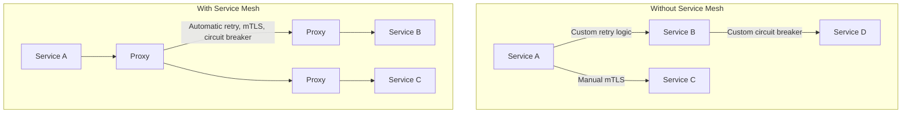
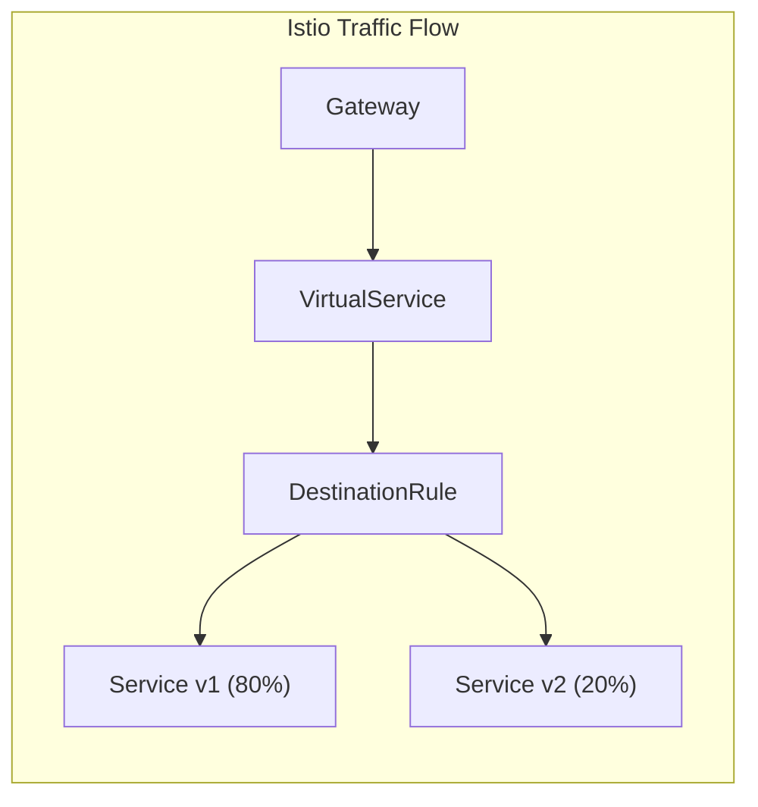
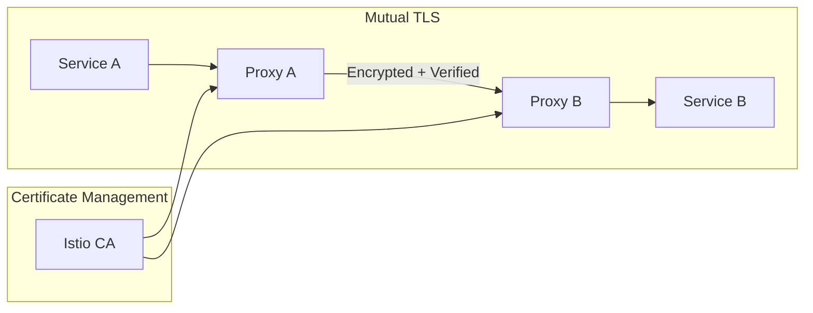
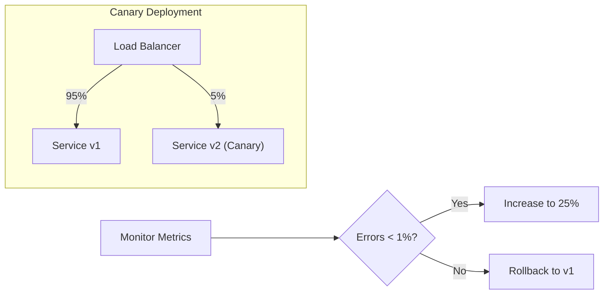

# How to Handle Service Mesh Implementation

Author: [nawazdhandala](https://www.github.com/nawazdhandala)

Tags: Service Mesh, Istio, Linkerd, Kubernetes, Microservices, mTLS, Traffic Management, Observability

Description: A comprehensive guide to implementing a service mesh in Kubernetes, covering Istio and Linkerd setup, traffic management, security policies, and observability.

---

> As microservices architectures grow, managing service-to-service communication becomes increasingly complex. A service mesh provides a dedicated infrastructure layer for handling this complexity, offering features like traffic management, security, and observability without changing application code. This guide walks you through practical service mesh implementation.

A service mesh abstracts the networking layer from your application code. Instead of implementing retries, circuit breakers, and mTLS in every service, the mesh handles it transparently through sidecar proxies.

---

## Why Service Mesh?



### Key Benefits

1. **Traffic Management**: Load balancing, retries, circuit breakers, rate limiting
2. **Security**: Automatic mTLS, authentication, authorization
3. **Observability**: Distributed tracing, metrics, access logs
4. **Resilience**: Fault injection, chaos testing, canary deployments

---

## Choosing a Service Mesh

| Feature | Istio | Linkerd |
|---------|-------|---------|
| Complexity | Higher | Lower |
| Resource Usage | Higher | Lower |
| Features | Comprehensive | Essential |
| Learning Curve | Steeper | Gentler |
| Best For | Large enterprises | Smaller teams |

---

## Istio Implementation

### Installation

```bash
# Download Istio
curl -L https://istio.io/downloadIstio | sh -
cd istio-*

# Add istioctl to PATH
export PATH=$PWD/bin:$PATH

# Install Istio with demo profile (includes all features)
istioctl install --set profile=demo -y

# For production, use a minimal profile
# istioctl install --set profile=minimal -y

# Enable sidecar injection for a namespace
kubectl label namespace default istio-injection=enabled
```

### Verify Installation

```bash
# Check Istio components
kubectl get pods -n istio-system

# Verify sidecar injection is working
kubectl get namespace -L istio-injection
```

### Basic Traffic Management



**Gateway Configuration:**

```yaml
# gateway.yaml
# Exposes services to external traffic
apiVersion: networking.istio.io/v1beta1
kind: Gateway
metadata:
  name: app-gateway
  namespace: default
spec:
  selector:
    istio: ingressgateway
  servers:
  - port:
      number: 80
      name: http
      protocol: HTTP
    hosts:
    - "api.example.com"
  - port:
      number: 443
      name: https
      protocol: HTTPS
    hosts:
    - "api.example.com"
    tls:
      mode: SIMPLE
      credentialName: api-tls-secret
```

**VirtualService for Traffic Routing:**

```yaml
# virtual-service.yaml
# Defines routing rules for traffic
apiVersion: networking.istio.io/v1beta1
kind: VirtualService
metadata:
  name: user-service
  namespace: default
spec:
  hosts:
  - user-service
  - "api.example.com"
  gateways:
  - app-gateway
  - mesh  # Also apply to internal mesh traffic
  http:
  # Route based on headers
  - match:
    - headers:
        x-canary:
          exact: "true"
    route:
    - destination:
        host: user-service
        subset: v2
        port:
          number: 8080
  # Weighted routing for gradual rollout
  - route:
    - destination:
        host: user-service
        subset: v1
        port:
          number: 8080
      weight: 80
    - destination:
        host: user-service
        subset: v2
        port:
          number: 8080
      weight: 20
    # Retry configuration
    retries:
      attempts: 3
      perTryTimeout: 2s
      retryOn: 5xx,reset,connect-failure
    # Request timeout
    timeout: 10s
```

**DestinationRule for Service Configuration:**

```yaml
# destination-rule.yaml
# Defines policies applied after routing
apiVersion: networking.istio.io/v1beta1
kind: DestinationRule
metadata:
  name: user-service
  namespace: default
spec:
  host: user-service
  trafficPolicy:
    # Connection pool settings
    connectionPool:
      tcp:
        maxConnections: 100
      http:
        h2UpgradePolicy: UPGRADE
        http1MaxPendingRequests: 100
        http2MaxRequests: 1000
    # Load balancer settings
    loadBalancer:
      simple: LEAST_CONN
    # Circuit breaker
    outlierDetection:
      consecutive5xxErrors: 5
      interval: 30s
      baseEjectionTime: 60s
      maxEjectionPercent: 50
  # Define subsets for versioned deployments
  subsets:
  - name: v1
    labels:
      version: v1
    trafficPolicy:
      connectionPool:
        http:
          http2MaxRequests: 500
  - name: v2
    labels:
      version: v2
```

### Security with mTLS



**Enable Strict mTLS:**

```yaml
# peer-authentication.yaml
# Require mTLS for all services in namespace
apiVersion: security.istio.io/v1beta1
kind: PeerAuthentication
metadata:
  name: default
  namespace: default
spec:
  mtls:
    mode: STRICT

---
# Mesh-wide mTLS policy
apiVersion: security.istio.io/v1beta1
kind: PeerAuthentication
metadata:
  name: default
  namespace: istio-system
spec:
  mtls:
    mode: STRICT
```

**Authorization Policy:**

```yaml
# authorization-policy.yaml
# Control which services can communicate
apiVersion: security.istio.io/v1beta1
kind: AuthorizationPolicy
metadata:
  name: user-service-policy
  namespace: default
spec:
  selector:
    matchLabels:
      app: user-service
  rules:
  # Allow requests from api-gateway
  - from:
    - source:
        principals:
        - "cluster.local/ns/default/sa/api-gateway"
    to:
    - operation:
        methods: ["GET", "POST"]
        paths: ["/api/users/*"]
  # Allow health checks from any source
  - to:
    - operation:
        methods: ["GET"]
        paths: ["/health", "/ready"]

---
# Deny all other traffic by default
apiVersion: security.istio.io/v1beta1
kind: AuthorizationPolicy
metadata:
  name: deny-all
  namespace: default
spec:
  {}  # Empty spec means deny all
```

### Rate Limiting

```yaml
# envoy-filter-rate-limit.yaml
# Rate limiting using Envoy filter
apiVersion: networking.istio.io/v1alpha3
kind: EnvoyFilter
metadata:
  name: rate-limit-filter
  namespace: istio-system
spec:
  workloadSelector:
    labels:
      istio: ingressgateway
  configPatches:
  - applyTo: HTTP_FILTER
    match:
      context: GATEWAY
      listener:
        filterChain:
          filter:
            name: "envoy.filters.network.http_connection_manager"
            subFilter:
              name: "envoy.filters.http.router"
    patch:
      operation: INSERT_BEFORE
      value:
        name: envoy.filters.http.local_ratelimit
        typed_config:
          "@type": type.googleapis.com/udpa.type.v1.TypedStruct
          type_url: type.googleapis.com/envoy.extensions.filters.http.local_ratelimit.v3.LocalRateLimit
          value:
            stat_prefix: http_local_rate_limiter
            token_bucket:
              max_tokens: 100
              tokens_per_fill: 100
              fill_interval: 60s
            filter_enabled:
              runtime_key: local_rate_limit_enabled
              default_value:
                numerator: 100
                denominator: HUNDRED
            filter_enforced:
              runtime_key: local_rate_limit_enforced
              default_value:
                numerator: 100
                denominator: HUNDRED
```

---

## Linkerd Implementation

### Installation

```bash
# Install Linkerd CLI
curl -fsL https://run.linkerd.io/install | sh
export PATH=$PATH:$HOME/.linkerd2/bin

# Validate cluster
linkerd check --pre

# Install Linkerd CRDs
linkerd install --crds | kubectl apply -f -

# Install Linkerd control plane
linkerd install | kubectl apply -f -

# Verify installation
linkerd check

# Install viz extension for observability
linkerd viz install | kubectl apply -f -
```

### Inject Sidecars

```bash
# Inject into existing deployment
kubectl get deploy user-service -o yaml | linkerd inject - | kubectl apply -f -

# Enable automatic injection for namespace
kubectl annotate namespace default linkerd.io/inject=enabled
```

### Traffic Split for Canary

```yaml
# traffic-split.yaml
# Linkerd TrafficSplit for canary deployments
apiVersion: split.smi-spec.io/v1alpha1
kind: TrafficSplit
metadata:
  name: user-service-split
  namespace: default
spec:
  service: user-service
  backends:
  - service: user-service-v1
    weight: 900m  # 90%
  - service: user-service-v2
    weight: 100m  # 10%
```

### Service Profile for Retries and Timeouts

```yaml
# service-profile.yaml
# Linkerd ServiceProfile for route configuration
apiVersion: linkerd.io/v1alpha2
kind: ServiceProfile
metadata:
  name: user-service.default.svc.cluster.local
  namespace: default
spec:
  routes:
  - name: GET /api/users/{id}
    condition:
      method: GET
      pathRegex: /api/users/[^/]+
    responseClasses:
    - condition:
        status:
          min: 500
          max: 599
      isFailure: true
    # Retry configuration
    isRetryable: true
  - name: POST /api/users
    condition:
      method: POST
      pathRegex: /api/users
    # Non-idempotent, don't retry
    isRetryable: false
    # Custom timeout
    timeout: 5s
```

### Authorization Policy

```yaml
# server-authorization.yaml
# Linkerd ServerAuthorization for access control
apiVersion: policy.linkerd.io/v1beta1
kind: Server
metadata:
  name: user-service
  namespace: default
spec:
  podSelector:
    matchLabels:
      app: user-service
  port: 8080
  proxyProtocol: HTTP/2

---
apiVersion: policy.linkerd.io/v1beta1
kind: ServerAuthorization
metadata:
  name: user-service-authz
  namespace: default
spec:
  server:
    name: user-service
  client:
    # Only allow requests from these service accounts
    meshTLS:
      serviceAccounts:
      - name: api-gateway
        namespace: default
      - name: order-service
        namespace: default
```

---

## Application Integration

### Health Checks

```python
# app.py
# Proper health checks for service mesh
from fastapi import FastAPI, Response
from prometheus_client import Counter, Histogram, generate_latest

app = FastAPI()

# Metrics for observability
REQUEST_COUNT = Counter(
    'http_requests_total',
    'Total HTTP requests',
    ['method', 'endpoint', 'status']
)

REQUEST_LATENCY = Histogram(
    'http_request_duration_seconds',
    'HTTP request latency',
    ['method', 'endpoint']
)

@app.get("/health")
async def health():
    """
    Health check endpoint.
    Used by Kubernetes liveness probe.
    """
    return {"status": "healthy"}

@app.get("/ready")
async def ready():
    """
    Readiness check endpoint.
    Used by Kubernetes readiness probe.
    Returns 503 if service is not ready to accept traffic.
    """
    # Check dependencies
    db_healthy = await check_database()
    cache_healthy = await check_cache()

    if db_healthy and cache_healthy:
        return {"status": "ready"}
    else:
        return Response(
            content='{"status": "not ready"}',
            status_code=503,
            media_type="application/json"
        )

@app.get("/metrics")
async def metrics():
    """Prometheus metrics endpoint."""
    return Response(
        content=generate_latest(),
        media_type="text/plain"
    )
```

### Handling Sidecar Delays

```python
# startup.py
# Handle sidecar proxy startup delay
import asyncio
import httpx

async def wait_for_sidecar(max_retries: int = 30, delay: float = 1.0):
    """
    Wait for Envoy/Linkerd sidecar to be ready.
    The sidecar needs to be ready before making outbound requests.
    """
    for i in range(max_retries):
        try:
            async with httpx.AsyncClient() as client:
                # Envoy admin interface
                response = await client.get(
                    "http://localhost:15021/healthz/ready",
                    timeout=1.0
                )
                if response.status_code == 200:
                    print("Sidecar is ready")
                    return True
        except Exception:
            pass

        print(f"Waiting for sidecar... ({i + 1}/{max_retries})")
        await asyncio.sleep(delay)

    raise RuntimeError("Sidecar did not become ready")

# Call at application startup
async def startup():
    await wait_for_sidecar()
    # Continue with application initialization
```

### Propagating Headers

```python
# headers.py
# Propagate tracing headers through the mesh
from fastapi import Request
from contextvars import ContextVar

# Headers that should be propagated for distributed tracing
PROPAGATION_HEADERS = [
    "x-request-id",
    "x-b3-traceid",
    "x-b3-spanid",
    "x-b3-parentspanid",
    "x-b3-sampled",
    "x-b3-flags",
    "x-ot-span-context",
    "traceparent",
    "tracestate",
]

# Store headers in context for the request
trace_headers: ContextVar[dict] = ContextVar("trace_headers", default={})

async def extract_trace_headers(request: Request):
    """Extract trace headers from incoming request."""
    headers = {}
    for header in PROPAGATION_HEADERS:
        value = request.headers.get(header)
        if value:
            headers[header] = value
    trace_headers.set(headers)
    return headers

def get_trace_headers() -> dict:
    """Get trace headers for outgoing requests."""
    return trace_headers.get()

# Usage in HTTP client
async def call_service(url: str, method: str = "GET", **kwargs):
    """Make HTTP call with trace headers propagated."""
    headers = kwargs.pop("headers", {})
    headers.update(get_trace_headers())

    async with httpx.AsyncClient() as client:
        response = await client.request(method, url, headers=headers, **kwargs)
        return response
```

---

## Observability

### Distributed Tracing with Jaeger

```yaml
# jaeger.yaml
# Deploy Jaeger for tracing (included in Istio demo profile)
apiVersion: install.istio.io/v1alpha1
kind: IstioOperator
spec:
  meshConfig:
    enableTracing: true
    defaultConfig:
      tracing:
        sampling: 100.0  # Sample all traces (reduce in production)
        zipkin:
          address: jaeger-collector.istio-system:9411

---
# Access Jaeger UI
# kubectl port-forward -n istio-system svc/tracing 16686:80
```

### Prometheus Metrics

```yaml
# prometheus-config.yaml
# ServiceMonitor for Prometheus Operator
apiVersion: monitoring.coreos.com/v1
kind: ServiceMonitor
metadata:
  name: istio-mesh
  namespace: istio-system
spec:
  selector:
    matchLabels:
      app: istiod
  endpoints:
  - port: http-monitoring
    interval: 15s
```

### Grafana Dashboards

```bash
# Port forward to Grafana (included in Istio demo)
kubectl port-forward -n istio-system svc/grafana 3000:3000

# Access at http://localhost:3000
# Default dashboards include:
# - Istio Mesh Dashboard
# - Istio Service Dashboard
# - Istio Workload Dashboard
```

### Custom Metrics

```yaml
# telemetry.yaml
# Istio Telemetry for custom metrics
apiVersion: telemetry.istio.io/v1alpha1
kind: Telemetry
metadata:
  name: mesh-metrics
  namespace: istio-system
spec:
  metrics:
  - providers:
    - name: prometheus
    overrides:
    # Add custom labels to metrics
    - match:
        metric: REQUEST_COUNT
      tagOverrides:
        request_path:
          operation: UPSERT
          value: "request.url_path"
```

---

## Deployment Patterns

### Canary Deployment



**Automated Canary with Flagger:**

```yaml
# canary.yaml
apiVersion: flagger.app/v1beta1
kind: Canary
metadata:
  name: user-service
  namespace: default
spec:
  targetRef:
    apiVersion: apps/v1
    kind: Deployment
    name: user-service
  service:
    port: 8080
  analysis:
    # Canary analysis configuration
    interval: 1m
    threshold: 5
    maxWeight: 50
    stepWeight: 10
    metrics:
    - name: request-success-rate
      thresholdRange:
        min: 99
      interval: 1m
    - name: request-duration
      thresholdRange:
        max: 500
      interval: 1m
    webhooks:
    - name: load-test
      url: http://flagger-loadtester.test/
      timeout: 5s
      metadata:
        cmd: "hey -z 1m -q 10 -c 2 http://user-service-canary:8080/"
```

### Blue-Green Deployment

```yaml
# blue-green.yaml
# VirtualService for blue-green deployment
apiVersion: networking.istio.io/v1beta1
kind: VirtualService
metadata:
  name: user-service
spec:
  hosts:
  - user-service
  http:
  - route:
    # Switch between blue and green by updating weights
    - destination:
        host: user-service
        subset: blue
      weight: 100
    - destination:
        host: user-service
        subset: green
      weight: 0

---
apiVersion: networking.istio.io/v1beta1
kind: DestinationRule
metadata:
  name: user-service
spec:
  host: user-service
  subsets:
  - name: blue
    labels:
      deployment: blue
  - name: green
    labels:
      deployment: green
```

---

## Troubleshooting

### Debug Sidecar Issues

```bash
# Check sidecar injection
kubectl get pods -o jsonpath='{range .items[*]}{.metadata.name}{"\t"}{.spec.containers[*].name}{"\n"}{end}'

# View Envoy configuration
istioctl proxy-config cluster <pod-name> -n <namespace>
istioctl proxy-config route <pod-name> -n <namespace>
istioctl proxy-config listener <pod-name> -n <namespace>

# Check for configuration errors
istioctl analyze -n default

# View proxy logs
kubectl logs <pod-name> -c istio-proxy -n <namespace>
```

### Common Issues

```yaml
# Fix: Service not getting traffic
# Ensure service port names follow convention
apiVersion: v1
kind: Service
metadata:
  name: user-service
spec:
  ports:
  - name: http  # Must be named http, http2, grpc, etc.
    port: 8080
    targetPort: 8080
  selector:
    app: user-service

---
# Fix: mTLS connection failures
# Check PeerAuthentication mode matches across services
apiVersion: security.istio.io/v1beta1
kind: PeerAuthentication
metadata:
  name: user-service
spec:
  selector:
    matchLabels:
      app: user-service
  mtls:
    mode: PERMISSIVE  # Allow both mTLS and plain text during migration
```

---

## Best Practices

### 1. Start with Observability

```bash
# Enable observability before adding traffic policies
# This helps debug issues during rollout

# Install Kiali for visualization
kubectl apply -f https://raw.githubusercontent.com/istio/istio/release-1.20/samples/addons/kiali.yaml

# Access Kiali
istioctl dashboard kiali
```

### 2. Gradual mTLS Rollout

```yaml
# Phase 1: Permissive mode (allow both)
apiVersion: security.istio.io/v1beta1
kind: PeerAuthentication
metadata:
  name: default
  namespace: istio-system
spec:
  mtls:
    mode: PERMISSIVE

# Phase 2: After verification, switch to strict
# spec:
#   mtls:
#     mode: STRICT
```

### 3. Resource Limits for Sidecars

```yaml
# Set resource limits in Istio configuration
apiVersion: install.istio.io/v1alpha1
kind: IstioOperator
spec:
  values:
    global:
      proxy:
        resources:
          requests:
            cpu: 100m
            memory: 128Mi
          limits:
            cpu: 500m
            memory: 256Mi
```

---

## Conclusion

Service mesh implementation provides powerful capabilities for microservices:

- **Traffic Management**: Fine-grained routing, retries, and circuit breakers
- **Security**: Automatic mTLS and authorization policies
- **Observability**: Distributed tracing and metrics out of the box
- **Resilience**: Fault injection and canary deployments

Start with observability, then gradually add traffic policies and security. Choose Istio for comprehensive features or Linkerd for simplicity.

---

*Need to monitor your service mesh in production? [OneUptime](https://oneuptime.com) integrates with Istio and Linkerd to provide real-time alerting on mesh health, traffic anomalies, and security policy violations.*

**Related Reading:**
- [How to Handle Configuration Management in Microservices](https://oneuptime.com/blog/post/2026-01-24-configuration-management-microservices/view)
- [How to Implement Distributed Tracing in Python Microservices](https://oneuptime.com/blog/post/2025-01-06-python-distributed-tracing-microservices/view)
