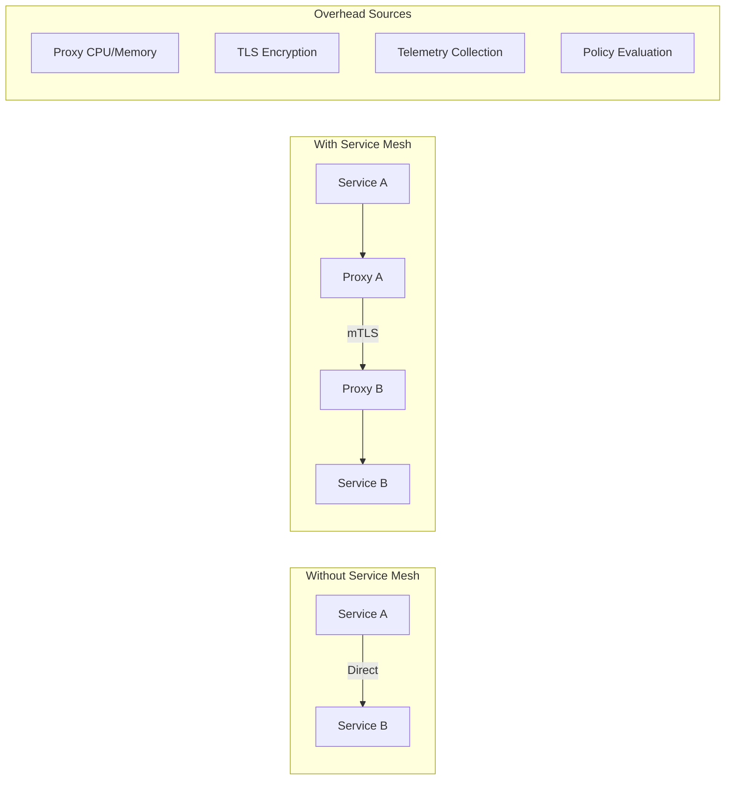
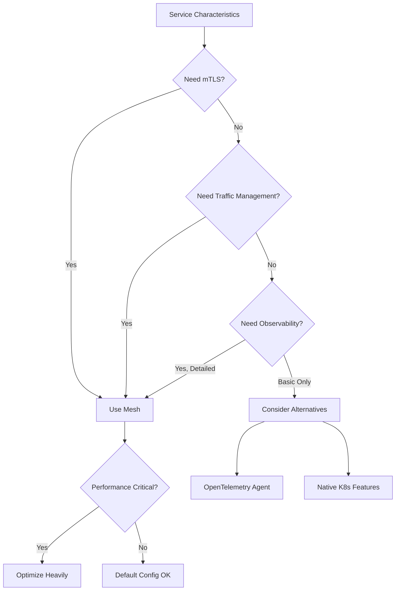

# How to Fix "Service Mesh Overhead" Issues

Author: [nawazdhandala](https://www.github.com/nawazdhandala)

Tags: Service Mesh, Istio, Linkerd, Performance, Kubernetes, Microservices, Latency, Sidecar

Description: Learn how to diagnose and reduce service mesh overhead including sidecar optimization, resource tuning, and selective mesh enrollment.

---

> Service meshes like Istio and Linkerd provide powerful features for traffic management, security, and observability. But these features come at a cost. This guide shows you how to identify and reduce service mesh overhead without sacrificing the benefits.

A typical service mesh adds 2-5ms of latency per hop and consumes 50-100MB of memory per sidecar. For services with many internal calls, this overhead compounds quickly. Understanding where the overhead comes from helps you optimize effectively.

---

## Understanding Service Mesh Overhead



| Overhead Source | Typical Impact | Can Reduce? |
|-----------------|---------------|-------------|
| Sidecar memory | 50-100MB per pod | Yes |
| Sidecar CPU | 10-50m per pod | Yes |
| Latency per hop | 2-5ms | Somewhat |
| mTLS encryption | 0.5-2ms | Somewhat |
| Telemetry collection | 5-20% CPU | Yes |
| Policy evaluation | 0.5-1ms | Yes |

---

## Measuring Service Mesh Overhead

First, quantify the actual overhead:

```yaml
# benchmark-deployment.yaml
# Deploy with and without sidecar to measure overhead

apiVersion: apps/v1
kind: Deployment
metadata:
  name: benchmark-with-mesh
spec:
  replicas: 1
  selector:
    matchLabels:
      app: benchmark
      mesh: enabled
  template:
    metadata:
      labels:
        app: benchmark
        mesh: enabled
      # Sidecar injection enabled (default)
    spec:
      containers:
      - name: app
        image: your-app:latest
        resources:
          requests:
            cpu: 100m
            memory: 128Mi

---
apiVersion: apps/v1
kind: Deployment
metadata:
  name: benchmark-without-mesh
spec:
  replicas: 1
  selector:
    matchLabels:
      app: benchmark
      mesh: disabled
  template:
    metadata:
      labels:
        app: benchmark
        mesh: disabled
      annotations:
        # Disable sidecar injection
        sidecar.istio.io/inject: "false"
    spec:
      containers:
      - name: app
        image: your-app:latest
        resources:
          requests:
            cpu: 100m
            memory: 128Mi
```

```bash
#!/bin/bash
# measure_mesh_overhead.sh
# Benchmark service mesh overhead

SERVICE_WITH_MESH="benchmark-with-mesh:8080"
SERVICE_WITHOUT_MESH="benchmark-without-mesh:8080"
REQUESTS=10000
CONCURRENCY=50

echo "=== Testing WITHOUT service mesh ==="
kubectl exec -it fortio-client -- fortio load \
    -c $CONCURRENCY \
    -n $REQUESTS \
    -qps 0 \
    http://$SERVICE_WITHOUT_MESH/api/test

echo ""
echo "=== Testing WITH service mesh ==="
kubectl exec -it fortio-client -- fortio load \
    -c $CONCURRENCY \
    -n $REQUESTS \
    -qps 0 \
    http://$SERVICE_WITH_MESH/api/test

# Compare P50, P99 latencies and resource usage
echo ""
echo "=== Resource usage comparison ==="
kubectl top pods -l app=benchmark
```

---

## Istio Sidecar Optimization

Reduce Istio sidecar resource usage:

```yaml
# istio-sidecar-config.yaml
# Optimized sidecar configuration

apiVersion: install.istio.io/v1alpha1
kind: IstioOperator
metadata:
  name: optimized-istio
spec:
  meshConfig:
    # Reduce access logging overhead
    accessLogFile: ""  # Disable or use "/dev/stdout" if needed

    # Optimize proxy settings
    defaultConfig:
      # Reduce tracing overhead
      tracing:
        sampling: 1.0  # 1% sampling instead of 100%

      # Concurrency settings
      concurrency: 2  # Match expected parallelism

      # Reduce memory footprint
      proxyMetadata:
        ISTIO_META_DNS_CAPTURE: "false"  # Disable DNS proxying if not needed

  components:
    pilot:
      k8s:
        resources:
          requests:
            cpu: 500m
            memory: 1Gi

  values:
    global:
      proxy:
        # Reduce sidecar resources
        resources:
          requests:
            cpu: 10m
            memory: 40Mi
          limits:
            cpu: 200m
            memory: 128Mi

        # Use native sidecars (Kubernetes 1.29+)
        # Reduces startup overhead
        enableCoreDump: false

    pilot:
      # Optimize xDS push frequency
      env:
        PILOT_PUSH_THROTTLE: 100
        PILOT_DEBOUNCE_AFTER: "100ms"
        PILOT_DEBOUNCE_MAX: "1s"
```

```yaml
# sidecar-resource-override.yaml
# Per-deployment sidecar resource override

apiVersion: apps/v1
kind: Deployment
metadata:
  name: low-traffic-service
spec:
  template:
    metadata:
      annotations:
        # Override sidecar resources for low-traffic services
        sidecar.istio.io/proxyCPU: "10m"
        sidecar.istio.io/proxyMemory: "40Mi"
        sidecar.istio.io/proxyCPULimit: "100m"
        sidecar.istio.io/proxyMemoryLimit: "100Mi"

        # Disable features not needed
        proxy.istio.io/config: |
          tracing:
            sampling: 0
    spec:
      containers:
      - name: app
        image: your-app:latest
```

---

## Limiting Sidecar Scope

Only proxy traffic that needs mesh features:

```yaml
# sidecar-scope.yaml
# Limit which services the sidecar communicates with

apiVersion: networking.istio.io/v1beta1
kind: Sidecar
metadata:
  name: api-gateway-sidecar
  namespace: production
spec:
  workloadSelector:
    labels:
      app: api-gateway
  egress:
  # Only configure sidecars for services we actually call
  - hosts:
    - "./user-service.production.svc.cluster.local"
    - "./order-service.production.svc.cluster.local"
    - "./payment-service.production.svc.cluster.local"
    # External services
    - "istio-system/*"

  # Reduce config size
  outboundTrafficPolicy:
    mode: REGISTRY_ONLY

---
# Default restrictive sidecar for the namespace
apiVersion: networking.istio.io/v1beta1
kind: Sidecar
metadata:
  name: default
  namespace: production
spec:
  egress:
  - hosts:
    - "./*"  # Same namespace only
    - "istio-system/*"
```

---

## Selective Mesh Enrollment

Not every service needs to be in the mesh:

```yaml
# namespace-config.yaml
# Control mesh enrollment at namespace level

apiVersion: v1
kind: Namespace
metadata:
  name: critical-services
  labels:
    # Enable injection for this namespace
    istio-injection: enabled

---
apiVersion: v1
kind: Namespace
metadata:
  name: batch-jobs
  labels:
    # Disable injection - batch jobs don't need mesh
    istio-injection: disabled

---
apiVersion: v1
kind: Namespace
metadata:
  name: mixed-services
  labels:
    # Enable injection at namespace level
    istio-injection: enabled
```

```yaml
# selective-injection.yaml
# Per-pod injection control

apiVersion: apps/v1
kind: Deployment
metadata:
  name: internal-tool
  namespace: mixed-services
spec:
  template:
    metadata:
      annotations:
        # Disable sidecar for this specific deployment
        sidecar.istio.io/inject: "false"
    spec:
      containers:
      - name: tool
        image: internal-tool:latest

---
apiVersion: apps/v1
kind: Deployment
metadata:
  name: customer-api
  namespace: mixed-services
spec:
  template:
    metadata:
      annotations:
        # Explicitly enable (good for documentation)
        sidecar.istio.io/inject: "true"
    spec:
      containers:
      - name: api
        image: customer-api:latest
```

---

## Linkerd Optimization

Linkerd is generally lighter than Istio, but can still be optimized:

```yaml
# linkerd-config.yaml
# Optimized Linkerd configuration

apiVersion: linkerd.io/v1alpha2
kind: Link
metadata:
  name: optimized-config
spec:
  # Proxy configuration
  proxy:
    resources:
      cpu:
        request: 10m
        limit: 100m
      memory:
        request: 20Mi
        limit: 100Mi

    # Log level (reduce overhead)
    logLevel: warn

    # Disable features not needed
    accessLog: disabled

---
# Per-workload annotation overrides
apiVersion: apps/v1
kind: Deployment
metadata:
  name: my-service
  annotations:
    # Linkerd-specific resource overrides
    config.linkerd.io/proxy-cpu-request: "10m"
    config.linkerd.io/proxy-memory-request: "20Mi"

    # Skip outbound ports (bypass proxy for certain traffic)
    config.linkerd.io/skip-outbound-ports: "3306,6379"

    # Skip inbound ports
    config.linkerd.io/skip-inbound-ports: "9090"
```

---

## Protocol Optimization

Optimize how traffic flows through the mesh:

```yaml
# protocol-config.yaml
# Optimize protocol handling

apiVersion: networking.istio.io/v1beta1
kind: DestinationRule
metadata:
  name: optimize-grpc
spec:
  host: grpc-service.production.svc.cluster.local
  trafficPolicy:
    connectionPool:
      http:
        # HTTP/2 settings for gRPC
        h2UpgradePolicy: UPGRADE
        http2MaxRequests: 1000
        maxRequestsPerConnection: 100

    # Connection pooling
    tcp:
      maxConnections: 100
      connectTimeout: 5s

    # Load balancing
    loadBalancer:
      simple: LEAST_REQUEST

---
# Declare service protocol explicitly
apiVersion: v1
kind: Service
metadata:
  name: grpc-service
spec:
  ports:
  - name: grpc  # Prefix with protocol for Istio
    port: 50051
    targetPort: 50051
    # Or use appProtocol (Kubernetes 1.18+)
    appProtocol: grpc
```

---

## Bypass Proxy for Internal Traffic

Skip the proxy for trusted internal traffic:

```yaml
# traffic-bypass.yaml
# Bypass mesh for specific traffic patterns

apiVersion: apps/v1
kind: Deployment
metadata:
  name: database-client
spec:
  template:
    metadata:
      annotations:
        # Bypass proxy for database traffic
        traffic.sidecar.istio.io/excludeOutboundPorts: "5432,3306,6379,9042"

        # Or exclude by IP range
        traffic.sidecar.istio.io/excludeOutboundIPRanges: "10.0.0.0/8"

        # Include only specific ranges
        traffic.sidecar.istio.io/includeOutboundIPRanges: "10.1.0.0/16"
```

```yaml
# service-entry-bypass.yaml
# Bypass for external services

apiVersion: networking.istio.io/v1beta1
kind: ServiceEntry
metadata:
  name: external-database
spec:
  hosts:
  - database.external.com
  ports:
  - number: 5432
    name: postgres
    protocol: TCP
  resolution: DNS
  location: MESH_EXTERNAL
```

---

## Monitoring Mesh Overhead

```yaml
# prometheus-rules.yaml
# Alert on excessive mesh overhead

apiVersion: monitoring.coreos.com/v1
kind: PrometheusRule
metadata:
  name: mesh-overhead-alerts
spec:
  groups:
  - name: service-mesh
    rules:
    - alert: HighSidecarMemory
      expr: |
        container_memory_usage_bytes{container="istio-proxy"} > 150 * 1024 * 1024
      for: 10m
      labels:
        severity: warning
      annotations:
        summary: "Sidecar using > 150MB memory"

    - alert: HighSidecarCPU
      expr: |
        rate(container_cpu_usage_seconds_total{container="istio-proxy"}[5m]) > 0.1
      for: 10m
      labels:
        severity: warning
      annotations:
        summary: "Sidecar using > 100m CPU"

    - alert: HighProxyLatency
      expr: |
        histogram_quantile(0.99,
          rate(istio_request_duration_milliseconds_bucket[5m])
        ) > 50
      for: 5m
      labels:
        severity: warning
      annotations:
        summary: "P99 proxy latency > 50ms"
```

```bash
#!/bin/bash
# mesh_overhead_report.sh
# Generate mesh overhead report

echo "=== Sidecar Resource Usage ==="
kubectl top pods --containers -A | grep istio-proxy | \
    awk '{sum_cpu+=$3; sum_mem+=$4; count++}
    END {printf "Total sidecars: %d\nAvg CPU: %dm\nAvg Memory: %dMi\n",
         count, sum_cpu/count, sum_mem/count}'

echo ""
echo "=== Services without Mesh ==="
kubectl get pods -A -o json | jq -r '
  .items[] |
  select(.spec.containers | map(.name) | contains(["istio-proxy"]) | not) |
  "\(.metadata.namespace)/\(.metadata.name)"
' | head -20

echo ""
echo "=== Mesh Latency Overhead ==="
# Requires Prometheus
curl -s "http://prometheus:9090/api/v1/query" \
    --data-urlencode 'query=histogram_quantile(0.99, rate(istio_request_duration_milliseconds_bucket[5m]))' \
    | jq '.data.result[] | {service: .metric.destination_service, p99_ms: .value[1]}'
```

---

## Decision Matrix: When to Use Service Mesh



| Scenario | Recommendation |
|----------|----------------|
| External-facing APIs | Full mesh with mTLS |
| Internal microservices | Mesh with optimizations |
| Batch jobs | Exclude from mesh |
| Database connections | Bypass proxy |
| High-frequency internal calls | Consider direct communication |
| Legacy services | Selective enrollment |

---

## Best Practices Summary

| Optimization | Impact |
|--------------|--------|
| Reduce sidecar resources | 30-50% memory savings |
| Limit sidecar scope | Faster config updates |
| Selective enrollment | Less total overhead |
| Protocol optimization | Better throughput |
| Bypass non-mesh traffic | Lower latency |
| Reduce telemetry sampling | Less CPU usage |

---

*Need to monitor your service mesh performance? [OneUptime](https://oneuptime.com) provides comprehensive Kubernetes and service mesh monitoring with latency tracking and resource alerts.*

**Related Reading:**
- [How to Set Up Service Mesh with Istio or Linkerd](https://oneuptime.com/blog/post/2026-01-06-kubernetes-service-mesh-istio-linkerd/view)
- [How to Fix Slow Kubernetes Pod Startup](https://oneuptime.com/blog/post/2026-01-24-slow-kubernetes-pod-startup/view)
