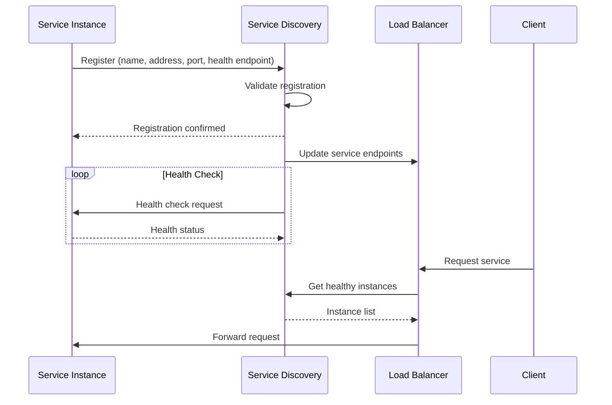
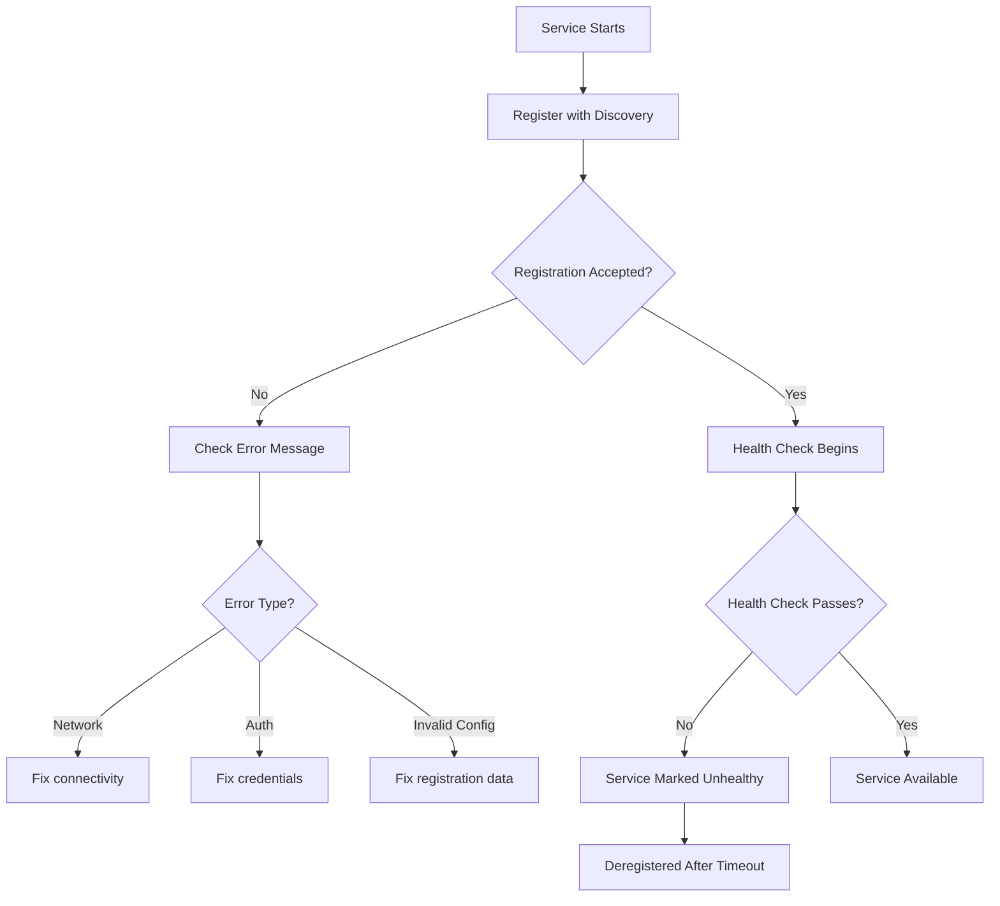
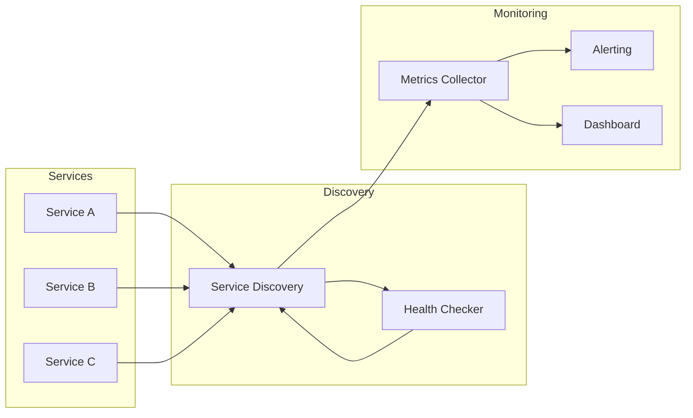

# How to Fix "Service Registration Failed" Errors

Author: [nawazdhandala](https://www.github.com/nawazdhandala)

Tags: Service Discovery, Microservices, Consul, Eureka, Kubernetes, etcd, Troubleshooting, Distributed Systems

Description: Learn how to diagnose and fix service registration failures in service discovery systems like Consul, Eureka, and Kubernetes, including network issues, health check misconfigurations, and registration conflicts.

---

> Service registration is the heartbeat of microservices architecture. When a service fails to register, it becomes invisible to the rest of your system, leading to cascading failures and service unavailability.

Service registration failures can occur for various reasons including network connectivity issues, misconfigured health checks, authentication problems, or service discovery system overload. This guide walks you through diagnosing and fixing these issues.

---

## Understanding Service Registration



---

## Common Causes of Registration Failures

### 1. Network Connectivity Issues

The service cannot reach the discovery server.

```bash
# Check connectivity to Consul
curl -v http://consul.service.consul:8500/v1/status/leader

# Check connectivity to Eureka
curl -v http://eureka-server:8761/eureka/apps

# Check Kubernetes service connectivity
kubectl run test-pod --rm -it --image=busybox --restart=Never -- \
    wget -qO- http://kubernetes.default.svc.cluster.local/healthz
```

### 2. Authentication and Authorization Failures

```go
// Go - Consul registration with ACL token
package main

import (
    "fmt"
    "log"
    "os"

    "github.com/hashicorp/consul/api"
)

func registerServiceWithConsul() error {
    // Create client configuration
    config := api.DefaultConfig()
    config.Address = os.Getenv("CONSUL_HTTP_ADDR")

    // Set ACL token if required
    token := os.Getenv("CONSUL_HTTP_TOKEN")
    if token != "" {
        config.Token = token
    }

    // Create client
    client, err := api.NewClient(config)
    if err != nil {
        return fmt.Errorf("failed to create consul client: %w", err)
    }

    // Define service registration
    registration := &api.AgentServiceRegistration{
        ID:      "my-service-1",
        Name:    "my-service",
        Port:    8080,
        Address: getLocalIP(),
        Tags:    []string{"api", "v1"},
        Check: &api.AgentServiceCheck{
            HTTP:                           fmt.Sprintf("http://%s:8080/health", getLocalIP()),
            Interval:                       "10s",
            Timeout:                        "5s",
            DeregisterCriticalServiceAfter: "1m",
        },
    }

    // Register service
    err = client.Agent().ServiceRegister(registration)
    if err != nil {
        // Check for ACL permission error
        if isACLError(err) {
            return fmt.Errorf("ACL permission denied. Check CONSUL_HTTP_TOKEN: %w", err)
        }
        return fmt.Errorf("service registration failed: %w", err)
    }

    log.Println("Service registered successfully")
    return nil
}

func isACLError(err error) bool {
    return err != nil && (
        contains(err.Error(), "Permission denied") ||
        contains(err.Error(), "ACL not found"))
}

func contains(s, substr string) bool {
    return len(s) >= len(substr) && s[:len(substr)] == substr
}

func getLocalIP() string {
    // Implementation to get local IP
    return "10.0.0.1"
}

func main() {
    if err := registerServiceWithConsul(); err != nil {
        log.Fatal(err)
    }
}
```

---

## Health Check Misconfiguration

One of the most common causes of registration failures is incorrect health check configuration.



### Fixing Health Check Issues

```java
// Java - Spring Boot Eureka configuration with proper health checks
// application.yml

/*
eureka:
  client:
    serviceUrl:
      defaultZone: http://eureka-server:8761/eureka/
    # Retry configuration for registration
    eureka-connection-idle-timeout-seconds: 30
    eureka-server-connect-timeout-seconds: 5
    eureka-server-read-timeout-seconds: 8
  instance:
    # Use IP address instead of hostname
    preferIpAddress: true
    # Health check path
    healthCheckUrlPath: /actuator/health
    statusPageUrlPath: /actuator/info
    # Lease renewal configuration
    leaseRenewalIntervalInSeconds: 10
    leaseExpirationDurationInSeconds: 30
    # Instance identification
    instanceId: ${spring.application.name}:${random.value}

management:
  endpoints:
    web:
      exposure:
        include: health,info
  endpoint:
    health:
      show-details: always
*/

// Custom health indicator for dependencies
import org.springframework.boot.actuate.health.Health;
import org.springframework.boot.actuate.health.HealthIndicator;
import org.springframework.stereotype.Component;

@Component
public class ServiceDependencyHealthIndicator implements HealthIndicator {

    private final DatabaseConnection database;
    private final CacheConnection cache;

    public ServiceDependencyHealthIndicator(
            DatabaseConnection database,
            CacheConnection cache) {
        this.database = database;
        this.cache = cache;
    }

    @Override
    public Health health() {
        // Check database connectivity
        if (!database.isConnected()) {
            return Health.down()
                .withDetail("database", "Connection failed")
                .build();
        }

        // Check cache connectivity (non-critical)
        if (!cache.isConnected()) {
            return Health.up()
                .withDetail("cache", "Degraded - using fallback")
                .build();
        }

        return Health.up()
            .withDetail("database", "Connected")
            .withDetail("cache", "Connected")
            .build();
    }
}
```

---

## Kubernetes Service Registration Issues

In Kubernetes, services are registered via endpoints when pods become ready.

```yaml
# deployment.yaml with proper readiness configuration
apiVersion: apps/v1
kind: Deployment
metadata:
  name: my-service
spec:
  replicas: 3
  selector:
    matchLabels:
      app: my-service
  template:
    metadata:
      labels:
        app: my-service
    spec:
      containers:
      - name: app
        image: myregistry/my-service:latest
        ports:
        - containerPort: 8080
          name: http

        # Readiness probe - determines service registration
        readinessProbe:
          httpGet:
            path: /health/ready
            port: 8080
          initialDelaySeconds: 5
          periodSeconds: 10
          timeoutSeconds: 5
          successThreshold: 1
          failureThreshold: 3

        # Liveness probe - determines pod restart
        livenessProbe:
          httpGet:
            path: /health/live
            port: 8080
          initialDelaySeconds: 15
          periodSeconds: 20
          timeoutSeconds: 5
          failureThreshold: 3

        # Resource limits can cause registration issues
        resources:
          requests:
            memory: "256Mi"
            cpu: "100m"
          limits:
            memory: "512Mi"
            cpu: "500m"

        env:
        - name: POD_IP
          valueFrom:
            fieldRef:
              fieldPath: status.podIP
```

### Debugging Kubernetes Registration

```bash
# Check pod status and events
kubectl describe pod my-service-xxx

# Check endpoint registration
kubectl get endpoints my-service -o yaml

# Check if readiness probe is passing
kubectl logs my-service-xxx | grep -i health

# Check service selector matches pod labels
kubectl get service my-service -o yaml
kubectl get pods -l app=my-service --show-labels

# Debug readiness probe manually
kubectl exec -it my-service-xxx -- curl localhost:8080/health/ready
```

---

## Retry Logic for Registration

Implement robust retry logic to handle transient failures.

```python
# Python - Service registration with retry logic
import time
import logging
from typing import Optional
from dataclasses import dataclass
from functools import wraps

import consul

logging.basicConfig(level=logging.INFO)
logger = logging.getLogger(__name__)

@dataclass
class ServiceConfig:
    name: str
    address: str
    port: int
    health_endpoint: str
    tags: list

class RegistrationError(Exception):
    """Raised when service registration fails after all retries"""
    pass

def retry_with_backoff(
    max_retries: int = 5,
    base_delay: float = 1.0,
    max_delay: float = 60.0,
    exponential_base: float = 2.0
):
    """Decorator for retrying functions with exponential backoff"""
    def decorator(func):
        @wraps(func)
        def wrapper(*args, **kwargs):
            retries = 0
            while retries < max_retries:
                try:
                    return func(*args, **kwargs)
                except Exception as e:
                    retries += 1
                    if retries >= max_retries:
                        raise RegistrationError(
                            f"Failed after {max_retries} retries: {e}"
                        ) from e

                    delay = min(
                        base_delay * (exponential_base ** retries),
                        max_delay
                    )
                    logger.warning(
                        f"Attempt {retries} failed: {e}. "
                        f"Retrying in {delay:.1f}s..."
                    )
                    time.sleep(delay)
            return None
        return wrapper
    return decorator

class ServiceRegistry:
    def __init__(self, consul_host: str = "localhost", consul_port: int = 8500):
        self.client = consul.Consul(host=consul_host, port=consul_port)
        self.registered_services: list = []

    @retry_with_backoff(max_retries=5, base_delay=2.0)
    def register(self, config: ServiceConfig) -> bool:
        """Register a service with Consul"""
        service_id = f"{config.name}-{config.address}-{config.port}"

        # Validate connectivity first
        try:
            leader = self.client.status.leader()
            if not leader:
                raise ConnectionError("Consul cluster has no leader")
        except Exception as e:
            raise ConnectionError(f"Cannot connect to Consul: {e}")

        # Build health check
        check = consul.Check.http(
            url=f"http://{config.address}:{config.port}{config.health_endpoint}",
            interval="10s",
            timeout="5s",
            deregister="1m"
        )

        # Register service
        success = self.client.agent.service.register(
            name=config.name,
            service_id=service_id,
            address=config.address,
            port=config.port,
            tags=config.tags,
            check=check
        )

        if success:
            self.registered_services.append(service_id)
            logger.info(f"Service {service_id} registered successfully")

        return success

    def deregister_all(self):
        """Deregister all services on shutdown"""
        for service_id in self.registered_services:
            try:
                self.client.agent.service.deregister(service_id)
                logger.info(f"Service {service_id} deregistered")
            except Exception as e:
                logger.error(f"Failed to deregister {service_id}: {e}")

# Usage example
if __name__ == "__main__":
    registry = ServiceRegistry(
        consul_host="consul.service.consul",
        consul_port=8500
    )

    config = ServiceConfig(
        name="payment-service",
        address="10.0.1.5",
        port=8080,
        health_endpoint="/health",
        tags=["api", "payments", "v2"]
    )

    try:
        registry.register(config)
    except RegistrationError as e:
        logger.error(f"Service registration failed: {e}")
        # Implement fallback or alert
```

---

## Handling Registration Conflicts

When the same service ID is registered multiple times, conflicts can occur.

```typescript
// TypeScript - Unique service ID generation and conflict handling
import { Consul } from 'consul';
import { v4 as uuidv4 } from 'uuid';
import * as os from 'os';

interface ServiceRegistration {
    name: string;
    port: number;
    healthEndpoint: string;
    tags?: string[];
}

class ServiceDiscoveryClient {
    private consul: Consul;
    private serviceId: string | null = null;
    private heartbeatInterval: NodeJS.Timeout | null = null;

    constructor(consulHost: string = 'localhost', consulPort: number = 8500) {
        this.consul = new Consul({
            host: consulHost,
            port: consulPort.toString(),
            promisify: true
        });
    }

    // Generate unique service ID to avoid conflicts
    private generateServiceId(serviceName: string): string {
        const hostname = os.hostname();
        const uniqueId = uuidv4().substring(0, 8);
        return `${serviceName}-${hostname}-${uniqueId}`;
    }

    // Get the local IP address
    private getLocalIP(): string {
        const interfaces = os.networkInterfaces();
        for (const name of Object.keys(interfaces)) {
            for (const iface of interfaces[name] || []) {
                if (iface.family === 'IPv4' && !iface.internal) {
                    return iface.address;
                }
            }
        }
        return '127.0.0.1';
    }

    async register(config: ServiceRegistration): Promise<string> {
        this.serviceId = this.generateServiceId(config.name);
        const address = this.getLocalIP();

        // Check for existing registration with same ID
        try {
            const existingServices = await this.consul.agent.service.list();
            if (existingServices[this.serviceId]) {
                console.log(`Service ${this.serviceId} already registered, deregistering first`);
                await this.consul.agent.service.deregister(this.serviceId);
            }
        } catch (error) {
            console.warn('Could not check existing services:', error);
        }

        // Register the service
        const registration = {
            id: this.serviceId,
            name: config.name,
            address: address,
            port: config.port,
            tags: config.tags || [],
            check: {
                http: `http://${address}:${config.port}${config.healthEndpoint}`,
                interval: '10s',
                timeout: '5s',
                deregistercriticalserviceafter: '1m'
            }
        };

        try {
            await this.consul.agent.service.register(registration);
            console.log(`Service registered: ${this.serviceId}`);

            // Start heartbeat to maintain registration
            this.startHeartbeat();

            return this.serviceId;
        } catch (error: any) {
            // Handle specific error cases
            if (error.message?.includes('Permission denied')) {
                throw new Error('ACL token missing or invalid');
            }
            if (error.message?.includes('connection refused')) {
                throw new Error('Cannot connect to Consul agent');
            }
            throw error;
        }
    }

    private startHeartbeat(): void {
        // Periodic check to ensure registration is still valid
        this.heartbeatInterval = setInterval(async () => {
            try {
                const services = await this.consul.agent.service.list();
                if (!services[this.serviceId!]) {
                    console.warn('Service registration lost, re-registering...');
                    // Re-register logic would go here
                }
            } catch (error) {
                console.error('Heartbeat check failed:', error);
            }
        }, 30000);
    }

    async deregister(): Promise<void> {
        if (this.heartbeatInterval) {
            clearInterval(this.heartbeatInterval);
        }

        if (this.serviceId) {
            try {
                await this.consul.agent.service.deregister(this.serviceId);
                console.log(`Service deregistered: ${this.serviceId}`);
            } catch (error) {
                console.error('Deregistration failed:', error);
            }
        }
    }
}

// Usage with graceful shutdown
async function main() {
    const client = new ServiceDiscoveryClient('consul.local', 8500);

    // Register service
    await client.register({
        name: 'order-service',
        port: 3000,
        healthEndpoint: '/health',
        tags: ['api', 'orders']
    });

    // Handle shutdown signals
    const shutdown = async () => {
        console.log('Shutting down...');
        await client.deregister();
        process.exit(0);
    };

    process.on('SIGTERM', shutdown);
    process.on('SIGINT', shutdown);
}

main().catch(console.error);
```

---

## Monitoring Registration Health



### Prometheus Metrics for Registration

```go
// Go - Registration metrics for monitoring
package registration

import (
    "github.com/prometheus/client_golang/prometheus"
    "github.com/prometheus/client_golang/prometheus/promauto"
)

var (
    // Counter for registration attempts
    registrationAttempts = promauto.NewCounterVec(
        prometheus.CounterOpts{
            Name: "service_registration_attempts_total",
            Help: "Total number of service registration attempts",
        },
        []string{"service_name", "status"},
    )

    // Gauge for current registration status
    registrationStatus = promauto.NewGaugeVec(
        prometheus.GaugeOpts{
            Name: "service_registration_status",
            Help: "Current service registration status (1=registered, 0=unregistered)",
        },
        []string{"service_name", "instance_id"},
    )

    // Histogram for registration latency
    registrationLatency = promauto.NewHistogramVec(
        prometheus.HistogramOpts{
            Name:    "service_registration_duration_seconds",
            Help:    "Time taken to register service",
            Buckets: prometheus.ExponentialBuckets(0.01, 2, 10),
        },
        []string{"service_name"},
    )
)

// RecordRegistrationAttempt records a registration attempt
func RecordRegistrationAttempt(serviceName string, success bool) {
    status := "success"
    if !success {
        status = "failure"
    }
    registrationAttempts.WithLabelValues(serviceName, status).Inc()
}

// SetRegistrationStatus updates the current registration status
func SetRegistrationStatus(serviceName, instanceID string, registered bool) {
    value := 0.0
    if registered {
        value = 1.0
    }
    registrationStatus.WithLabelValues(serviceName, instanceID).Set(value)
}

// ObserveRegistrationLatency records registration duration
func ObserveRegistrationLatency(serviceName string, durationSeconds float64) {
    registrationLatency.WithLabelValues(serviceName).Observe(durationSeconds)
}
```

---

## Troubleshooting Checklist

When service registration fails, work through this checklist:

1. **Network Connectivity**
   - Can the service reach the discovery server?
   - Are there firewall rules blocking traffic?
   - Is DNS resolving correctly?

2. **Authentication**
   - Are ACL tokens configured correctly?
   - Does the token have sufficient permissions?
   - Has the token expired?

3. **Health Check Configuration**
   - Is the health endpoint accessible?
   - Is the health check returning 200 OK?
   - Are timeouts configured appropriately?

4. **Service Configuration**
   - Is the service ID unique?
   - Is the port number correct?
   - Is the address reachable from the discovery server?

5. **Discovery Server Health**
   - Is the discovery cluster healthy?
   - Is there a leader elected?
   - Is the server under resource pressure?

---

## Best Practices

1. **Use unique service IDs** - Include hostname and random component
2. **Implement retry logic** - Network issues are often transient
3. **Monitor registration status** - Alert on registration failures
4. **Configure appropriate timeouts** - Balance responsiveness with stability
5. **Implement graceful deregistration** - Clean up on shutdown
6. **Test health endpoints** - Ensure they respond correctly under load

---

*Need to monitor your service discovery health? [OneUptime](https://oneuptime.com) provides real-time monitoring for microservices registration and health status.*

**Related Reading:**
- [How to Handle Rate Limiting Across Services](https://oneuptime.com/blog/post/2026-01-24-rate-limiting-across-services/view)
- [How to Fix "Health Check Failed" Service Errors](https://oneuptime.com/blog/post/2026-01-24-health-check-failed-service-errors/view)
