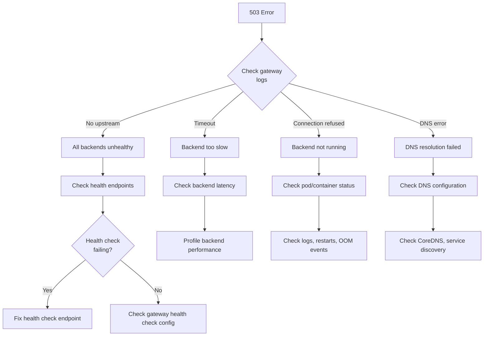

# How to Fix "Service Unavailable" Gateway Errors

Author: [nawazdhandala](https://www.github.com/nawazdhandala)

Tags: Gateway, HTTP 503, Load Balancer, Troubleshooting, Kubernetes, Nginx, DevOps, SRE

Description: A practical guide to diagnosing and fixing HTTP 503 Service Unavailable errors from API gateways, load balancers, and reverse proxies.

---

"503 Service Unavailable" is one of the most common and frustrating errors in distributed systems. It means the gateway received your request but could not find a healthy backend to serve it. The root cause can be anywhere in the chain from DNS to your application.

## Understanding 503 Errors


### Common 503 Causes

| Component | Possible Cause | Quick Check |
|-----------|---------------|-------------|
| Load Balancer | No healthy backends | Check health check status |
| API Gateway | Upstream timeout | Check gateway logs |
| Service | Crashed/OOM | Check pod status, memory |
| Service | Not ready | Check readiness probe |
| Network | DNS failure | Check DNS resolution |
| Resources | Connection exhaustion | Check file descriptors |

## Diagnostic Workflow



## Step 1: Check Gateway/Load Balancer Status

### Nginx Ingress Controller

```bash
# Check ingress controller logs
kubectl logs -n ingress-nginx -l app.kubernetes.io/name=ingress-nginx --tail=100

# Look for upstream errors
kubectl logs -n ingress-nginx -l app.kubernetes.io/name=ingress-nginx | grep -i "upstream\|503"

# Check nginx configuration
kubectl exec -n ingress-nginx deploy/ingress-nginx-controller -- cat /etc/nginx/nginx.conf

# Check upstream status
kubectl exec -n ingress-nginx deploy/ingress-nginx-controller -- curl localhost:10254/nginx_status
```

### AWS ALB/NLB

```bash
# Check target group health
aws elbv2 describe-target-health \
  --target-group-arn arn:aws:elasticloadbalancing:us-east-1:123456789:targetgroup/my-targets/abc123

# Check ALB access logs in S3
aws s3 cp s3://my-alb-logs/AWSLogs/123456789/elasticloadbalancing/us-east-1/2024/01/15/ ./logs/ --recursive

# Parse for 503 errors
grep "503" ./logs/*.log | head -20
```

### HAProxy

```bash
# Check HAProxy stats
curl -s http://localhost:9000/haproxy?stats;csv | column -t -s','

# Look for backend status
echo "show stat" | socat stdio /var/run/haproxy.sock | grep -E "BACKEND|DOWN"

# Check HAProxy logs
journalctl -u haproxy -n 100 | grep -i "503\|no server\|DOWN"
```

## Step 2: Check Backend Service Health

### Kubernetes Service Health

```bash
# Check if pods are running and ready
kubectl get pods -l app=my-service -o wide

# Check endpoints (are pods registered with service?)
kubectl get endpoints my-service

# Describe service to see selector
kubectl describe service my-service

# Check pod events for issues
kubectl describe pod <pod-name> | grep -A 20 "Events:"

# Check pod readiness
kubectl get pods -l app=my-service -o jsonpath='{range .items[*]}{.metadata.name}{"\t"}{.status.conditions[?(@.type=="Ready")].status}{"\n"}{end}'
```

### Direct Health Check

```bash
# Get pod IP and check health directly
POD_IP=$(kubectl get pod <pod-name> -o jsonpath='{.status.podIP}')

# Test health endpoint
kubectl run debug --rm -it --image=curlimages/curl -- curl -v http://$POD_IP:8080/health

# Test from within cluster
kubectl exec -it deploy/my-service -- curl localhost:8080/health
```

### Check for OOM or Crashes

```bash
# Check for OOMKilled containers
kubectl get pods -l app=my-service -o jsonpath='{range .items[*]}{.metadata.name}{"\t"}{.status.containerStatuses[*].lastState.terminated.reason}{"\n"}{end}'

# Check container restart count
kubectl get pods -l app=my-service -o jsonpath='{range .items[*]}{.metadata.name}{"\t"}{.status.containerStatuses[*].restartCount}{"\n"}{end}'

# Get previous container logs if crashed
kubectl logs <pod-name> --previous

# Check resource usage
kubectl top pods -l app=my-service
```

## Step 3: Fix Common Issues

### Issue 1: Health Check Misconfiguration

The gateway health check does not match what the application exposes.

```yaml
# Incorrect: Health check path doesn't exist
apiVersion: v1
kind: Service
metadata:
  name: my-service
  annotations:
    # AWS ALB health check
    alb.ingress.kubernetes.io/healthcheck-path: /health  # App uses /healthz
---
# Correct: Match the actual health endpoint
apiVersion: v1
kind: Service
metadata:
  name: my-service
  annotations:
    alb.ingress.kubernetes.io/healthcheck-path: /healthz
    alb.ingress.kubernetes.io/healthcheck-port: "8080"
    alb.ingress.kubernetes.io/healthcheck-interval-seconds: "15"
    alb.ingress.kubernetes.io/healthy-threshold-count: "2"
    alb.ingress.kubernetes.io/unhealthy-threshold-count: "3"
```

```yaml
# Kubernetes probes should match
apiVersion: apps/v1
kind: Deployment
metadata:
  name: my-service
spec:
  template:
    spec:
      containers:
        - name: app
          ports:
            - containerPort: 8080
          readinessProbe:
            httpGet:
              path: /healthz
              port: 8080
            initialDelaySeconds: 5
            periodSeconds: 10
            failureThreshold: 3
          livenessProbe:
            httpGet:
              path: /healthz
              port: 8080
            initialDelaySeconds: 15
            periodSeconds: 20
            failureThreshold: 3
```

### Issue 2: Slow Application Startup

Application takes too long to become ready, causing health check failures.

```yaml
# Increase initial delay and add startup probe
apiVersion: apps/v1
kind: Deployment
metadata:
  name: my-service
spec:
  template:
    spec:
      containers:
        - name: app
          # Startup probe for slow-starting applications
          startupProbe:
            httpGet:
              path: /healthz
              port: 8080
            failureThreshold: 30
            periodSeconds: 10
          # Readiness probe kicks in after startup succeeds
          readinessProbe:
            httpGet:
              path: /healthz
              port: 8080
            periodSeconds: 10
            failureThreshold: 3
```

### Issue 3: Resource Exhaustion

Application runs out of memory or file descriptors.

```yaml
# Set appropriate resource limits
apiVersion: apps/v1
kind: Deployment
metadata:
  name: my-service
spec:
  template:
    spec:
      containers:
        - name: app
          resources:
            requests:
              memory: "256Mi"
              cpu: "250m"
            limits:
              memory: "512Mi"
              cpu: "500m"
          # Increase file descriptor limit if needed
          securityContext:
            capabilities:
              add: ["SYS_RESOURCE"]
```

```bash
# Check current resource usage
kubectl top pods -l app=my-service

# Check if pod was OOMKilled
kubectl describe pod <pod-name> | grep -A5 "Last State"
```

### Issue 4: Connection Pool Exhaustion

Too many connections queued, gateway times out.

```javascript
// Node.js - Increase connection pool
const http = require('http');

// Increase max sockets
http.globalAgent.maxSockets = 100;

// Or use keep-alive agent with limits
const agent = new http.Agent({
    keepAlive: true,
    maxSockets: 50,
    maxFreeSockets: 10,
    timeout: 60000
});
```

```java
// Spring Boot - Configure connection pool
@Configuration
public class WebClientConfig {
    @Bean
    public WebClient webClient() {
        HttpClient httpClient = HttpClient.create()
            .option(ChannelOption.CONNECT_TIMEOUT_MILLIS, 5000)
            .responseTimeout(Duration.ofSeconds(10))
            .doOnConnected(conn ->
                conn.addHandlerLast(new ReadTimeoutHandler(10))
                    .addHandlerLast(new WriteTimeoutHandler(10))
            );

        ConnectionProvider provider = ConnectionProvider.builder("custom")
            .maxConnections(100)
            .maxIdleTime(Duration.ofSeconds(20))
            .maxLifeTime(Duration.ofMinutes(5))
            .pendingAcquireTimeout(Duration.ofSeconds(60))
            .evictInBackground(Duration.ofSeconds(120))
            .build();

        return WebClient.builder()
            .clientConnector(new ReactorClientHttpConnector(
                HttpClient.create(provider)
            ))
            .build();
    }
}
```

### Issue 5: DNS Resolution Failures

Service cannot resolve upstream hostname.

```bash
# Check CoreDNS status
kubectl get pods -n kube-system -l k8s-app=kube-dns

# Check CoreDNS logs
kubectl logs -n kube-system -l k8s-app=kube-dns

# Test DNS resolution from pod
kubectl run debug --rm -it --image=busybox -- nslookup my-service.default.svc.cluster.local

# Check /etc/resolv.conf in pod
kubectl exec -it <pod-name> -- cat /etc/resolv.conf
```

```yaml
# Fix DNS policy if using hostNetwork
apiVersion: apps/v1
kind: Deployment
spec:
  template:
    spec:
      hostNetwork: true
      dnsPolicy: ClusterFirstWithHostNet  # Required when using hostNetwork
```

## Step 4: Gateway-Specific Fixes

### Nginx Ingress

```yaml
# Increase timeouts and buffer sizes
apiVersion: networking.k8s.io/v1
kind: Ingress
metadata:
  name: my-ingress
  annotations:
    # Increase proxy timeouts
    nginx.ingress.kubernetes.io/proxy-connect-timeout: "30"
    nginx.ingress.kubernetes.io/proxy-send-timeout: "60"
    nginx.ingress.kubernetes.io/proxy-read-timeout: "60"
    # Increase buffer sizes
    nginx.ingress.kubernetes.io/proxy-buffer-size: "16k"
    nginx.ingress.kubernetes.io/proxy-buffers-number: "4"
    # Configure retries
    nginx.ingress.kubernetes.io/proxy-next-upstream: "error timeout http_503"
    nginx.ingress.kubernetes.io/proxy-next-upstream-tries: "3"
spec:
  rules:
    - host: api.example.com
      http:
        paths:
          - path: /
            pathType: Prefix
            backend:
              service:
                name: my-service
                port:
                  number: 80
```

### Envoy/Istio

```yaml
# Configure retry policy and circuit breaking
apiVersion: networking.istio.io/v1beta1
kind: VirtualService
metadata:
  name: my-service
spec:
  hosts:
    - my-service
  http:
    - route:
        - destination:
            host: my-service
            port:
              number: 80
      retries:
        attempts: 3
        perTryTimeout: 10s
        retryOn: 5xx,reset,connect-failure,retriable-4xx
      timeout: 30s
---
apiVersion: networking.istio.io/v1beta1
kind: DestinationRule
metadata:
  name: my-service
spec:
  host: my-service
  trafficPolicy:
    connectionPool:
      tcp:
        maxConnections: 100
        connectTimeout: 5s
      http:
        h2UpgradePolicy: UPGRADE
        http1MaxPendingRequests: 100
        http2MaxRequests: 1000
        maxRequestsPerConnection: 100
    outlierDetection:
      consecutive5xxErrors: 5
      interval: 10s
      baseEjectionTime: 30s
      maxEjectionPercent: 50
```

### Kong

```yaml
# Configure health checks and retries
apiVersion: configuration.konghq.com/v1
kind: KongIngress
metadata:
  name: my-service-config
upstream:
  healthchecks:
    active:
      healthy:
        interval: 5
        successes: 2
      unhealthy:
        interval: 5
        http_failures: 3
        tcp_failures: 3
        timeouts: 3
      http_path: /healthz
      timeout: 5
    passive:
      healthy:
        successes: 2
      unhealthy:
        http_failures: 5
        tcp_failures: 5
        timeouts: 5
proxy:
  connect_timeout: 10000
  read_timeout: 60000
  write_timeout: 60000
  retries: 3
```

## Step 5: Implement Proper Health Checks

### Comprehensive Health Check Implementation

```go
package health

import (
    "context"
    "encoding/json"
    "net/http"
    "sync"
    "time"
)

type HealthChecker struct {
    checks map[string]Check
    mu     sync.RWMutex
}

type Check func(ctx context.Context) error

type HealthStatus struct {
    Status    string                 `json:"status"`
    Timestamp string                 `json:"timestamp"`
    Checks    map[string]CheckStatus `json:"checks"`
}

type CheckStatus struct {
    Status    string `json:"status"`
    Message   string `json:"message,omitempty"`
    Latency   string `json:"latency"`
}

func NewHealthChecker() *HealthChecker {
    return &HealthChecker{
        checks: make(map[string]Check),
    }
}

func (h *HealthChecker) AddCheck(name string, check Check) {
    h.mu.Lock()
    defer h.mu.Unlock()
    h.checks[name] = check
}

// LivenessHandler - Is the application running?
func (h *HealthChecker) LivenessHandler(w http.ResponseWriter, r *http.Request) {
    w.WriteHeader(http.StatusOK)
    json.NewEncoder(w).Encode(map[string]string{
        "status": "alive",
    })
}

// ReadinessHandler - Is the application ready to serve traffic?
func (h *HealthChecker) ReadinessHandler(w http.ResponseWriter, r *http.Request) {
    ctx, cancel := context.WithTimeout(r.Context(), 5*time.Second)
    defer cancel()

    h.mu.RLock()
    checks := make(map[string]Check, len(h.checks))
    for k, v := range h.checks {
        checks[k] = v
    }
    h.mu.RUnlock()

    status := HealthStatus{
        Status:    "healthy",
        Timestamp: time.Now().UTC().Format(time.RFC3339),
        Checks:    make(map[string]CheckStatus),
    }

    allHealthy := true
    var wg sync.WaitGroup
    var mu sync.Mutex

    for name, check := range checks {
        wg.Add(1)
        go func(n string, c Check) {
            defer wg.Done()

            start := time.Now()
            err := c(ctx)
            latency := time.Since(start)

            mu.Lock()
            defer mu.Unlock()

            if err != nil {
                allHealthy = false
                status.Checks[n] = CheckStatus{
                    Status:  "unhealthy",
                    Message: err.Error(),
                    Latency: latency.String(),
                }
            } else {
                status.Checks[n] = CheckStatus{
                    Status:  "healthy",
                    Latency: latency.String(),
                }
            }
        }(name, check)
    }

    wg.Wait()

    if !allHealthy {
        status.Status = "unhealthy"
        w.WriteHeader(http.StatusServiceUnavailable)
    } else {
        w.WriteHeader(http.StatusOK)
    }

    json.NewEncoder(w).Encode(status)
}

// Example usage
func main() {
    checker := NewHealthChecker()

    // Add database check
    checker.AddCheck("database", func(ctx context.Context) error {
        return db.PingContext(ctx)
    })

    // Add cache check
    checker.AddCheck("redis", func(ctx context.Context) error {
        return redis.Ping(ctx).Err()
    })

    // Add downstream service check
    checker.AddCheck("payment-service", func(ctx context.Context) error {
        req, _ := http.NewRequestWithContext(ctx, "GET",
            "http://payment-service/health", nil)
        resp, err := http.DefaultClient.Do(req)
        if err != nil {
            return err
        }
        defer resp.Body.Close()
        if resp.StatusCode != 200 {
            return fmt.Errorf("unhealthy: %d", resp.StatusCode)
        }
        return nil
    })

    http.HandleFunc("/healthz", checker.LivenessHandler)
    http.HandleFunc("/ready", checker.ReadinessHandler)
    http.ListenAndServe(":8080", nil)
}
```

## Monitoring and Alerting

### Prometheus Alerts for 503 Errors

```yaml
groups:
  - name: gateway-errors
    rules:
      - alert: High503ErrorRate
        expr: |
          sum(rate(nginx_ingress_controller_requests{status="503"}[5m]))
          / sum(rate(nginx_ingress_controller_requests[5m])) > 0.05
        for: 2m
        labels:
          severity: critical
        annotations:
          summary: "High 503 error rate detected"
          description: "More than 5% of requests are returning 503"

      - alert: AllBackendsUnhealthy
        expr: |
          kube_endpoint_address_available{endpoint="my-service"} == 0
        for: 1m
        labels:
          severity: critical
        annotations:
          summary: "No healthy backends for {{ $labels.endpoint }}"

      - alert: PodNotReady
        expr: |
          kube_pod_status_ready{condition="true",pod=~"my-service.*"} == 0
        for: 5m
        labels:
          severity: warning
        annotations:
          summary: "Pod {{ $labels.pod }} not ready"
```

### Quick Diagnostic Script

```bash
#!/bin/bash
# diagnose-503.sh - Quick diagnosis for 503 errors

SERVICE=$1
NAMESPACE=${2:-default}

echo "=== Diagnosing 503 for service: $SERVICE in namespace: $NAMESPACE ==="

echo -e "\n--- Pod Status ---"
kubectl get pods -n $NAMESPACE -l app=$SERVICE -o wide

echo -e "\n--- Endpoints ---"
kubectl get endpoints -n $NAMESPACE $SERVICE

echo -e "\n--- Recent Pod Events ---"
kubectl get events -n $NAMESPACE --field-selector involvedObject.name=$SERVICE --sort-by='.lastTimestamp' | tail -10

echo -e "\n--- Pod Logs (last 20 lines) ---"
kubectl logs -n $NAMESPACE -l app=$SERVICE --tail=20 2>/dev/null || echo "No logs available"

echo -e "\n--- Resource Usage ---"
kubectl top pods -n $NAMESPACE -l app=$SERVICE 2>/dev/null || echo "Metrics not available"

echo -e "\n--- Health Check Test ---"
POD=$(kubectl get pods -n $NAMESPACE -l app=$SERVICE -o jsonpath='{.items[0].metadata.name}' 2>/dev/null)
if [ -n "$POD" ]; then
    kubectl exec -n $NAMESPACE $POD -- curl -s localhost:8080/health 2>/dev/null || echo "Health check failed or endpoint not found"
fi

echo -e "\n--- Ingress Controller Logs (503 related) ---"
kubectl logs -n ingress-nginx -l app.kubernetes.io/name=ingress-nginx --tail=50 2>/dev/null | grep -i "503\|upstream" || echo "No 503 errors in ingress logs"
```

## Summary Checklist

When you encounter a 503 error:

1. **Check gateway logs** - What error message does the gateway report?
2. **Check backend health** - Are pods running and ready?
3. **Verify endpoints** - Is the service registered with endpoints?
4. **Test health endpoint** - Does the health check actually pass?
5. **Check resources** - Is the pod OOMKilled or resource constrained?
6. **Review timeouts** - Are gateway timeouts appropriate for the backend?
7. **Check DNS** - Can the gateway resolve the backend hostname?
8. **Review recent changes** - What changed before the errors started?

---

503 errors are a symptom, not the disease. The key is to systematically work through the request path from gateway to backend, checking each component's health and configuration. Most 503 errors come down to health check misconfigurations, resource exhaustion, or deployment timing issues.
