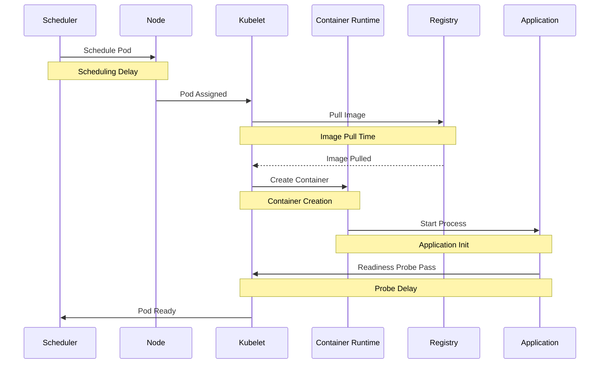

# How to Fix 'Slow Kubernetes Pod Startup'

Author: [nawazdhandala](https://www.github.com/nawazdhandala)

Tags: Kubernetes, Performance, Pod Startup, Container, DevOps, Docker, Optimization, Scheduling

Description: Learn how to diagnose and fix slow Kubernetes pod startup times, including image optimization, scheduling improvements, and probe configuration.

---

> Slow pod startup can significantly impact your application's ability to scale and recover from failures. This guide covers the common causes of slow pod startup and provides practical solutions to reduce startup time from minutes to seconds.

In production environments, pod startup time directly affects autoscaling responsiveness, deployment speed, and incident recovery. A pod that takes 3 minutes to start versus 30 seconds can mean the difference between handling a traffic spike gracefully and experiencing an outage.

---

## Pod Startup Timeline



Each phase can introduce delays. Let us examine and optimize each one.

---

## Diagnosing Startup Delays

First, identify where time is being spent:

```bash
#!/bin/bash
# diagnose_startup.sh
# Script to analyze pod startup time

POD_NAME=$1
NAMESPACE=${2:-default}

if [ -z "$POD_NAME" ]; then
    echo "Usage: $0 <pod-name> [namespace]"
    exit 1
fi

echo "=== Pod Events ==="
kubectl get events -n "$NAMESPACE" \
    --field-selector "involvedObject.name=$POD_NAME" \
    --sort-by='.lastTimestamp'

echo ""
echo "=== Pod Status Timeline ==="
kubectl get pod "$POD_NAME" -n "$NAMESPACE" -o json | jq '
  .status.conditions[] |
  {type: .type, status: .status, lastTransitionTime: .lastTransitionTime}
'

echo ""
echo "=== Container Startup Time ==="
kubectl get pod "$POD_NAME" -n "$NAMESPACE" -o json | jq '
  .status.containerStatuses[] |
  {
    name: .name,
    started: .state.running.startedAt,
    ready: .ready,
    restartCount: .restartCount
  }
'

echo ""
echo "=== Image Pull Time ==="
# Extract image pull events
kubectl get events -n "$NAMESPACE" \
    --field-selector "involvedObject.name=$POD_NAME,reason=Pulled" \
    -o json | jq '.items[] | {message: .message, time: .lastTimestamp}'
```

```yaml
# Example output analysis:
#
# Scheduling:    0.5s  (Normal)
# Image Pull:   45.0s  (SLOW - needs optimization)
# Container:     2.0s  (Normal)
# App Init:     30.0s  (SLOW - needs optimization)
# Readiness:    10.0s  (SLOW - probe config issue)
#
# Total:        87.5s
```

---

## Optimizing Image Pull Time

Image pull is often the biggest contributor to slow startup:

```dockerfile
# Dockerfile
# Multi-stage build for minimal image size

# Build stage
FROM golang:1.22 AS builder

WORKDIR /app
COPY go.mod go.sum ./
# Cache dependencies
RUN go mod download

COPY . .
# Build static binary
RUN CGO_ENABLED=0 GOOS=linux go build -ldflags="-w -s" -o /app/server

# Runtime stage - use minimal base image
FROM gcr.io/distroless/static-debian12:nonroot

# Copy only the binary
COPY --from=builder /app/server /server

# Run as non-root user (already set in distroless)
ENTRYPOINT ["/server"]

# Image size: ~15MB vs ~800MB with golang base
```

```yaml
# deployment.yaml
# Configure image pull for performance

apiVersion: apps/v1
kind: Deployment
metadata:
  name: api-server
spec:
  replicas: 3
  selector:
    matchLabels:
      app: api-server
  template:
    metadata:
      labels:
        app: api-server
    spec:
      # Use a private registry close to your cluster
      containers:
      - name: api
        image: your-registry.region.cloud/api-server:v1.2.3

        # Always use specific tags, never :latest
        imagePullPolicy: IfNotPresent

        resources:
          requests:
            memory: "256Mi"
            cpu: "250m"
          limits:
            memory: "512Mi"
            cpu: "1000m"

      # Pre-pull images on nodes using DaemonSet
      # See below for DaemonSet example
```

```yaml
# image-prepuller-daemonset.yaml
# Pre-pull images to all nodes for faster startup

apiVersion: apps/v1
kind: DaemonSet
metadata:
  name: image-prepuller
  namespace: kube-system
spec:
  selector:
    matchLabels:
      app: image-prepuller
  template:
    metadata:
      labels:
        app: image-prepuller
    spec:
      # Run on all nodes
      tolerations:
      - operator: Exists

      initContainers:
      # Pull images during init, then exit
      - name: prepull-api
        image: your-registry.region.cloud/api-server:v1.2.3
        imagePullPolicy: Always
        command: ["echo", "Image pulled"]
        resources:
          requests:
            memory: "10Mi"
            cpu: "10m"

      containers:
      - name: pause
        image: gcr.io/google_containers/pause:3.9
        resources:
          requests:
            memory: "10Mi"
            cpu: "10m"
```

---

## Optimizing Application Startup

Reduce application initialization time:

```go
// main.go
// Fast startup patterns for Go applications

package main

import (
    "context"
    "log"
    "net/http"
    "os"
    "os/signal"
    "sync"
    "syscall"
    "time"
)

type Server struct {
    httpServer *http.Server
    db         *Database
    cache      *Cache
    ready      bool
    readyMu    sync.RWMutex
}

func main() {
    // Start accepting requests immediately
    // Initialize dependencies in background
    server := &Server{}

    // Start HTTP server first (can serve health checks)
    go server.startHTTP()

    // Initialize dependencies concurrently
    var wg sync.WaitGroup
    errChan := make(chan error, 2)

    wg.Add(2)

    // Initialize database connection
    go func() {
        defer wg.Done()
        db, err := initDatabase()
        if err != nil {
            errChan <- err
            return
        }
        server.db = db
    }()

    // Initialize cache connection
    go func() {
        defer wg.Done()
        cache, err := initCache()
        if err != nil {
            errChan <- err
            return
        }
        server.cache = cache
    }()

    // Wait for initialization with timeout
    done := make(chan struct{})
    go func() {
        wg.Wait()
        close(done)
    }()

    select {
    case <-done:
        server.setReady(true)
        log.Println("Server ready")
    case err := <-errChan:
        log.Fatalf("Failed to initialize: %v", err)
    case <-time.After(30 * time.Second):
        log.Fatal("Initialization timeout")
    }

    // Wait for shutdown signal
    waitForShutdown(server)
}

func (s *Server) startHTTP() {
    mux := http.NewServeMux()

    // Liveness probe - always returns OK if process is running
    mux.HandleFunc("/healthz", func(w http.ResponseWriter, r *http.Request) {
        w.WriteHeader(http.StatusOK)
    })

    // Readiness probe - returns OK only when fully initialized
    mux.HandleFunc("/readyz", func(w http.ResponseWriter, r *http.Request) {
        if s.isReady() {
            w.WriteHeader(http.StatusOK)
        } else {
            w.WriteHeader(http.StatusServiceUnavailable)
        }
    })

    // Application routes
    mux.HandleFunc("/api/", s.handleAPI)

    s.httpServer = &http.Server{
        Addr:    ":8080",
        Handler: mux,
    }

    log.Println("Starting HTTP server on :8080")
    if err := s.httpServer.ListenAndServe(); err != http.ErrServerClosed {
        log.Fatalf("HTTP server error: %v", err)
    }
}

func (s *Server) isReady() bool {
    s.readyMu.RLock()
    defer s.readyMu.RUnlock()
    return s.ready
}

func (s *Server) setReady(ready bool) {
    s.readyMu.Lock()
    defer s.readyMu.Unlock()
    s.ready = ready
}

func (s *Server) handleAPI(w http.ResponseWriter, r *http.Request) {
    if !s.isReady() {
        http.Error(w, "Service not ready", http.StatusServiceUnavailable)
        return
    }
    // Handle request
    w.Write([]byte("OK"))
}

func initDatabase() (*Database, error) {
    // Use connection pooling with lazy initialization
    // Return quickly, validate connections in background
    return NewDatabase(DatabaseConfig{
        MaxOpenConns:    25,
        MaxIdleConns:    5,
        ConnMaxLifetime: time.Hour,
    })
}

func initCache() (*Cache, error) {
    // Similar pattern for cache
    return NewCache(CacheConfig{
        PoolSize: 10,
    })
}

func waitForShutdown(server *Server) {
    quit := make(chan os.Signal, 1)
    signal.Notify(quit, syscall.SIGINT, syscall.SIGTERM)
    <-quit

    log.Println("Shutting down...")
    server.setReady(false)

    ctx, cancel := context.WithTimeout(context.Background(), 30*time.Second)
    defer cancel()

    server.httpServer.Shutdown(ctx)
}
```

---

## Optimizing Probe Configuration

Poorly configured probes add unnecessary startup delay:

```yaml
# deployment-probes.yaml
# Optimized probe configuration

apiVersion: apps/v1
kind: Deployment
metadata:
  name: api-server
spec:
  template:
    spec:
      containers:
      - name: api
        image: your-registry/api-server:v1.2.3
        ports:
        - containerPort: 8080

        # Startup probe - for slow-starting containers
        # Gives the app time to start before liveness kicks in
        startupProbe:
          httpGet:
            path: /healthz
            port: 8080
          # Check every 2 seconds
          periodSeconds: 2
          # Fail after 30 attempts (60 seconds max)
          failureThreshold: 30
          # Consider started after 1 success
          successThreshold: 1

        # Liveness probe - restarts container if unhealthy
        # Only runs after startup probe succeeds
        livenessProbe:
          httpGet:
            path: /healthz
            port: 8080
          # Don't start checking immediately
          initialDelaySeconds: 0
          periodSeconds: 10
          failureThreshold: 3
          timeoutSeconds: 5

        # Readiness probe - controls traffic routing
        readinessProbe:
          httpGet:
            path: /readyz
            port: 8080
          # Start checking immediately
          initialDelaySeconds: 0
          # Check frequently during startup
          periodSeconds: 2
          # Single success marks as ready
          successThreshold: 1
          failureThreshold: 3
          timeoutSeconds: 3
```

Common probe mistakes to avoid:

| Mistake | Impact | Solution |
|---------|--------|----------|
| High initialDelaySeconds | Delays readiness unnecessarily | Use startupProbe instead |
| Long periodSeconds | Slow to become ready | Use 1-2s during startup |
| Same endpoint for all probes | Liveness kills during init | Separate /healthz and /readyz |
| No startupProbe | Liveness kills slow-starting apps | Add startupProbe for apps > 10s |
| HTTP probe on TCP app | Extra overhead | Use tcpSocket or exec |

---

## Scheduling Optimization

Speed up pod scheduling:

```yaml
# deployment-scheduling.yaml
# Optimized scheduling configuration

apiVersion: apps/v1
kind: Deployment
metadata:
  name: api-server
spec:
  template:
    spec:
      # Prioritize scheduling
      priorityClassName: high-priority

      # Spread pods across nodes
      topologySpreadConstraints:
      - maxSkew: 1
        topologyKey: kubernetes.io/hostname
        whenUnsatisfiable: ScheduleAnyway
        labelSelector:
          matchLabels:
            app: api-server

      # Resource requests help scheduler make fast decisions
      containers:
      - name: api
        resources:
          # Accurate requests = faster scheduling
          requests:
            memory: "256Mi"
            cpu: "250m"
          limits:
            memory: "512Mi"
            cpu: "1000m"

      # Avoid scheduling on overloaded nodes
      affinity:
        nodeAffinity:
          preferredDuringSchedulingIgnoredDuringExecution:
          - weight: 100
            preference:
              matchExpressions:
              - key: node.kubernetes.io/instance-type
                operator: In
                values:
                - m5.xlarge
                - m5.2xlarge
```

```yaml
# priority-class.yaml
# Define priority for critical workloads

apiVersion: scheduling.k8s.io/v1
kind: PriorityClass
metadata:
  name: high-priority
value: 1000000
globalDefault: false
description: "High priority for production workloads"

---
apiVersion: scheduling.k8s.io/v1
kind: PriorityClass
metadata:
  name: low-priority
value: 100
globalDefault: false
description: "Low priority for batch jobs"
```

---

## Startup Time Comparison

```mermaid
gantt
    title Pod Startup Time Comparison
    dateFormat ss
    axisFormat %S

    section Before
    Scheduling       :a1, 00, 02
    Image Pull       :a2, after a1, 45
    Container Start  :a3, after a2, 03
    App Init         :a4, after a3, 30
    Readiness Delay  :a5, after a4, 10

    section After
    Scheduling       :b1, 00, 01
    Image Pull       :b2, after b1, 05
    Container Start  :b3, after b2, 02
    App Init         :b4, after b3, 08
    Readiness        :b5, after b4, 02
```



---

## Monitoring Startup Metrics

Track startup performance with Prometheus:

```yaml
# prometheus-rules.yaml
# Alert on slow pod startup

apiVersion: monitoring.coreos.com/v1
kind: PrometheusRule
metadata:
  name: pod-startup-alerts
spec:
  groups:
  - name: pod-startup
    rules:
    - alert: SlowPodStartup
      expr: |
        (
          kube_pod_status_ready_time
          - kube_pod_created
        ) > 60
      for: 5m
      labels:
        severity: warning
      annotations:
        summary: "Pod {{ $labels.pod }} took > 60s to start"

    - alert: FrequentImagePulls
      expr: |
        increase(
          kubelet_image_pull_duration_seconds_count[1h]
        ) > 100
      labels:
        severity: info
      annotations:
        summary: "High image pull frequency on {{ $labels.node }}"
```

---

## Checklist for Fast Pod Startup

| Optimization | Expected Improvement |
|--------------|---------------------|
| Multi-stage Docker builds | 50-90% smaller images |
| Local/regional registry | 5-30s faster pulls |
| Pre-pull images with DaemonSet | Near-zero pull time |
| Concurrent dependency init | 30-50% faster app startup |
| Optimized probe config | 5-30s faster readiness |
| Accurate resource requests | Faster scheduling |
| Connection pooling with lazy init | Faster dependency startup |

---

*Need to monitor your Kubernetes pod startup times across clusters? [OneUptime](https://oneuptime.com) provides Kubernetes monitoring with custom metrics and alerting.*

**Related Reading:**
- [How to Debug CrashLoopBackOff and OOMKilled](https://oneuptime.com/blog/post/2026-01-06-kubernetes-debug-crashloopbackoff-oomkilled/view)
- [How to Diagnose Slow Kubernetes Deployments](https://oneuptime.com/blog/post/2026-01-06-kubernetes-diagnose-slow-deployments/view)
