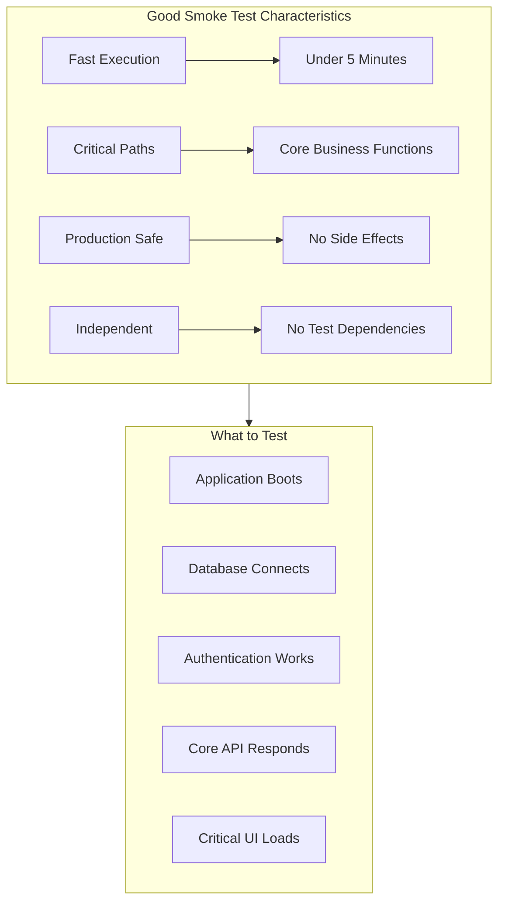

# How to Handle Smoke Testing

Author: [nawazdhandala](https://www.github.com/nawazdhandala)

Tags: Smoke Testing, Quality Assurance, Testing Strategy, CI/CD, Deployment, DevOps, Automation

Description: A comprehensive guide to implementing effective smoke tests that catch critical failures quickly without slowing down your deployment pipeline.

---

Smoke testing is your first line of defense after a deployment. Named after the hardware practice of powering on a device to see if smoke comes out, smoke tests verify that the most critical functionality of your application works. They are fast, focused, and should run after every deployment. This guide shows you how to build an effective smoke testing strategy.

## What Makes a Good Smoke Test

Smoke tests are different from your regular test suite. They have specific characteristics that make them effective.



## Designing Your Smoke Test Suite

### Identify Critical Paths

Start by mapping the paths that must work for your application to be considered "up."

```python
# smoke_test_config.py
"""
Define critical paths for smoke testing.
These are the absolute minimum features that must work.
"""

CRITICAL_PATHS = {
    'health_check': {
        'endpoint': '/health',
        'method': 'GET',
        'expected_status': 200,
        'timeout_seconds': 5,
        'description': 'Application health endpoint responds'
    },
    'database_connectivity': {
        'endpoint': '/health/db',
        'method': 'GET',
        'expected_status': 200,
        'timeout_seconds': 10,
        'description': 'Database connection is healthy'
    },
    'authentication': {
        'endpoint': '/auth/login',
        'method': 'POST',
        'payload': {'email': 'smoke-test@example.com', 'password': 'smoke-test-pwd'},
        'expected_status': 200,
        'timeout_seconds': 10,
        'description': 'User authentication works'
    },
    'core_api': {
        'endpoint': '/api/v1/status',
        'method': 'GET',
        'expected_status': 200,
        'timeout_seconds': 5,
        'description': 'Core API is responsive'
    },
    'static_assets': {
        'endpoint': '/static/app.js',
        'method': 'GET',
        'expected_status': 200,
        'timeout_seconds': 5,
        'description': 'Static assets are served'
    }
}
```

### Build the Smoke Test Runner

Create a dedicated runner that executes tests in parallel and reports results quickly.

```python
# smoke_runner.py
import asyncio
import aiohttp
import time
from dataclasses import dataclass
from typing import Optional, Dict, Any
from enum import Enum

class TestStatus(Enum):
    PASSED = 'passed'
    FAILED = 'failed'
    TIMEOUT = 'timeout'
    ERROR = 'error'

@dataclass
class SmokeTestResult:
    name: str
    status: TestStatus
    duration_ms: float
    description: str
    error_message: Optional[str] = None
    response_body: Optional[str] = None

class SmokeTestRunner:
    """
    Runs smoke tests in parallel and collects results.
    Designed to be fast and production-safe.
    """

    def __init__(self, base_url: str, timeout: int = 30):
        self.base_url = base_url.rstrip('/')
        self.timeout = aiohttp.ClientTimeout(total=timeout)
        self.results: list[SmokeTestResult] = []

    async def run_single_test(
        self,
        session: aiohttp.ClientSession,
        name: str,
        config: Dict[str, Any]
    ) -> SmokeTestResult:
        """Execute a single smoke test."""
        start_time = time.time()
        url = f"{self.base_url}{config['endpoint']}"

        try:
            # Build request kwargs
            kwargs = {
                'timeout': aiohttp.ClientTimeout(
                    total=config.get('timeout_seconds', 10)
                )
            }

            if config.get('payload'):
                kwargs['json'] = config['payload']

            if config.get('headers'):
                kwargs['headers'] = config['headers']

            # Make the request
            method = config.get('method', 'GET').lower()
            async with getattr(session, method)(url, **kwargs) as response:
                duration = (time.time() - start_time) * 1000

                if response.status == config['expected_status']:
                    return SmokeTestResult(
                        name=name,
                        status=TestStatus.PASSED,
                        duration_ms=duration,
                        description=config['description']
                    )
                else:
                    body = await response.text()
                    return SmokeTestResult(
                        name=name,
                        status=TestStatus.FAILED,
                        duration_ms=duration,
                        description=config['description'],
                        error_message=f"Expected {config['expected_status']}, got {response.status}",
                        response_body=body[:500]  # Truncate for readability
                    )

        except asyncio.TimeoutError:
            duration = (time.time() - start_time) * 1000
            return SmokeTestResult(
                name=name,
                status=TestStatus.TIMEOUT,
                duration_ms=duration,
                description=config['description'],
                error_message=f"Request timed out after {config.get('timeout_seconds', 10)}s"
            )
        except Exception as e:
            duration = (time.time() - start_time) * 1000
            return SmokeTestResult(
                name=name,
                status=TestStatus.ERROR,
                duration_ms=duration,
                description=config['description'],
                error_message=str(e)
            )

    async def run_all(self, test_configs: Dict[str, Dict]) -> list[SmokeTestResult]:
        """Run all smoke tests in parallel."""
        async with aiohttp.ClientSession(timeout=self.timeout) as session:
            tasks = [
                self.run_single_test(session, name, config)
                for name, config in test_configs.items()
            ]
            self.results = await asyncio.gather(*tasks)

        return self.results

    def get_summary(self) -> Dict[str, Any]:
        """Get a summary of test results."""
        passed = sum(1 for r in self.results if r.status == TestStatus.PASSED)
        failed = sum(1 for r in self.results if r.status == TestStatus.FAILED)
        total_duration = sum(r.duration_ms for r in self.results)

        return {
            'total': len(self.results),
            'passed': passed,
            'failed': failed,
            'success_rate': (passed / len(self.results) * 100) if self.results else 0,
            'total_duration_ms': total_duration,
            'all_passed': failed == 0
        }

    def print_report(self):
        """Print a formatted test report."""
        print("\n" + "=" * 60)
        print("SMOKE TEST RESULTS")
        print("=" * 60 + "\n")

        for result in self.results:
            status_icon = "PASS" if result.status == TestStatus.PASSED else "FAIL"
            print(f"[{status_icon}] {result.name} ({result.duration_ms:.0f}ms)")
            print(f"      {result.description}")

            if result.error_message:
                print(f"      Error: {result.error_message}")
            print()

        summary = self.get_summary()
        print("-" * 60)
        print(f"Total: {summary['total']} | Passed: {summary['passed']} | Failed: {summary['failed']}")
        print(f"Success Rate: {summary['success_rate']:.1f}%")
        print(f"Duration: {summary['total_duration_ms']:.0f}ms")
        print("=" * 60)

# Main execution
async def main():
    from smoke_test_config import CRITICAL_PATHS
    import sys

    base_url = sys.argv[1] if len(sys.argv) > 1 else 'http://localhost:8080'

    runner = SmokeTestRunner(base_url)
    await runner.run_all(CRITICAL_PATHS)
    runner.print_report()

    # Exit with error code if any tests failed
    summary = runner.get_summary()
    sys.exit(0 if summary['all_passed'] else 1)

if __name__ == '__main__':
    asyncio.run(main())
```

## Browser-Based Smoke Tests

For applications with critical UI flows, add browser smoke tests using Playwright or Selenium.

```javascript
// smoke.spec.js (Playwright)
const { test, expect } = require('@playwright/test');

// Configure for speed over coverage
test.describe.configure({ mode: 'parallel' });

test.describe('Smoke Tests', () => {
  // Set short timeouts for smoke tests
  test.setTimeout(30000);

  test('homepage loads successfully', async ({ page }) => {
    const response = await page.goto('/');

    // Check response status
    expect(response.status()).toBe(200);

    // Check critical elements are present
    await expect(page.locator('header')).toBeVisible();
    await expect(page.locator('main')).toBeVisible();

    // Check no JavaScript errors
    const errors = [];
    page.on('pageerror', error => errors.push(error));
    await page.waitForLoadState('networkidle');
    expect(errors).toHaveLength(0);
  });

  test('login page is accessible', async ({ page }) => {
    await page.goto('/login');

    // Check login form is present
    await expect(page.locator('input[name="email"]')).toBeVisible();
    await expect(page.locator('input[name="password"]')).toBeVisible();
    await expect(page.locator('button[type="submit"]')).toBeVisible();
  });

  test('user can complete login flow', async ({ page }) => {
    await page.goto('/login');

    // Fill in credentials
    await page.fill('input[name="email"]', 'smoke-test@example.com');
    await page.fill('input[name="password"]', 'smoke-test-password');

    // Submit and verify redirect
    await page.click('button[type="submit"]');

    // Should redirect to dashboard
    await expect(page).toHaveURL(/.*dashboard/);

    // Dashboard should show user info
    await expect(page.locator('[data-testid="user-menu"]')).toBeVisible();
  });

  test('critical API endpoints respond', async ({ request }) => {
    // Test API directly without browser overhead
    const endpoints = [
      { path: '/api/v1/health', expectedStatus: 200 },
      { path: '/api/v1/version', expectedStatus: 200 },
      { path: '/api/v1/config', expectedStatus: 200 }
    ];

    for (const { path, expectedStatus } of endpoints) {
      const response = await request.get(path);
      expect(response.status(), `${path} should return ${expectedStatus}`).toBe(expectedStatus);
    }
  });

  test('static assets load correctly', async ({ page }) => {
    await page.goto('/');

    // Check that CSS is loaded by verifying styled elements
    const header = page.locator('header');
    const styles = await header.evaluate(el => {
      const computed = window.getComputedStyle(el);
      return {
        hasBackgroundColor: computed.backgroundColor !== 'rgba(0, 0, 0, 0)',
        hasPadding: computed.padding !== '0px'
      };
    });

    expect(styles.hasBackgroundColor || styles.hasPadding).toBeTruthy();
  });
});
```

## CI/CD Integration

### GitHub Actions Workflow

```yaml
# .github/workflows/smoke-tests.yml
name: Smoke Tests

on:
  deployment_status:
  workflow_dispatch:
    inputs:
      target_url:
        description: 'URL to test'
        required: true

jobs:
  smoke-test:
    runs-on: ubuntu-latest
    # Only run on successful deployments
    if: github.event.deployment_status.state == 'success' || github.event_name == 'workflow_dispatch'

    steps:
      - uses: actions/checkout@v4

      - name: Set up Python
        uses: actions/setup-python@v5
        with:
          python-version: '3.11'

      - name: Install dependencies
        run: pip install aiohttp

      - name: Determine target URL
        id: url
        run: |
          if [ "${{ github.event_name }}" == "workflow_dispatch" ]; then
            echo "target=${{ github.event.inputs.target_url }}" >> $GITHUB_OUTPUT
          else
            echo "target=${{ github.event.deployment_status.target_url }}" >> $GITHUB_OUTPUT
          fi

      - name: Run API smoke tests
        run: python smoke_runner.py ${{ steps.url.outputs.target }}

      - name: Install Playwright
        run: |
          pip install playwright
          playwright install chromium

      - name: Run browser smoke tests
        run: |
          playwright test smoke.spec.js --project=chromium
        env:
          BASE_URL: ${{ steps.url.outputs.target }}

      - name: Notify on failure
        if: failure()
        uses: slackapi/slack-github-action@v1
        with:
          payload: |
            {
              "text": "Smoke tests failed for deployment to ${{ steps.url.outputs.target }}"
            }
        env:
          SLACK_WEBHOOK_URL: ${{ secrets.SLACK_WEBHOOK }}
```

### Post-Deployment Hook

```bash
#!/bin/bash
# deploy-with-smoke.sh
# Run smoke tests after deployment and rollback if they fail

set -e

ENVIRONMENT=$1
VERSION=$2

echo "Deploying version $VERSION to $ENVIRONMENT..."

# Perform deployment
kubectl set image deployment/app app=myapp:$VERSION -n $ENVIRONMENT
kubectl rollout status deployment/app -n $ENVIRONMENT --timeout=300s

# Get the service URL
SERVICE_URL=$(kubectl get svc app -n $ENVIRONMENT -o jsonpath='{.status.loadBalancer.ingress[0].hostname}')

echo "Running smoke tests against $SERVICE_URL..."

# Run smoke tests
if python smoke_runner.py "https://$SERVICE_URL"; then
    echo "Smoke tests passed. Deployment successful."
else
    echo "Smoke tests failed! Rolling back..."
    kubectl rollout undo deployment/app -n $ENVIRONMENT
    kubectl rollout status deployment/app -n $ENVIRONMENT --timeout=300s

    # Send alert
    curl -X POST "$SLACK_WEBHOOK" \
        -H 'Content-Type: application/json' \
        -d "{\"text\": \"Deployment of $VERSION to $ENVIRONMENT failed smoke tests and was rolled back.\"}"

    exit 1
fi
```

## Smoke Test Best Practices

### Keep Tests Independent

Each smoke test should be completely independent. Never rely on test execution order.

```python
# BAD: Tests depend on each other
def test_create_user():
    response = client.post('/users', json={'name': 'Test'})
    global user_id
    user_id = response.json()['id']

def test_get_user():
    # Fails if test_create_user did not run first
    response = client.get(f'/users/{user_id}')
    assert response.status_code == 200

# GOOD: Tests are independent
def test_create_user():
    response = client.post('/users', json={'name': 'Test'})
    assert response.status_code == 201
    # Clean up
    client.delete(f"/users/{response.json()['id']}")

def test_get_user():
    # Use a known test user that always exists
    response = client.get('/users/smoke-test-user-id')
    assert response.status_code == 200
```

### Use Dedicated Test Accounts

Create dedicated smoke test accounts that are always present in your system.

```python
# smoke_test_data.py
"""
Smoke test accounts should be seeded in every environment.
These accounts have limited permissions and are clearly marked.
"""

SMOKE_TEST_USER = {
    'email': 'smoke-test@yourcompany.internal',
    'password': 'stored-in-secrets-manager',  # Retrieved at runtime
    'user_id': 'smoke-test-user-00000',
    'permissions': ['read:own_profile', 'read:public_data']
}

# Seed script for new environments
def seed_smoke_test_data(db):
    """Create smoke test user if it does not exist."""
    existing = db.users.find_one({'email': SMOKE_TEST_USER['email']})

    if not existing:
        db.users.insert_one({
            '_id': SMOKE_TEST_USER['user_id'],
            'email': SMOKE_TEST_USER['email'],
            'password_hash': hash_password(SMOKE_TEST_USER['password']),
            'is_smoke_test': True,
            'created_at': datetime.utcnow()
        })
        print("Smoke test user created")
    else:
        print("Smoke test user already exists")
```

## Monitoring and Alerting

Set up continuous smoke testing to catch issues between deployments.

```python
# continuous_smoke.py
"""
Run smoke tests periodically and report to monitoring.
"""
import asyncio
import time
from prometheus_client import Gauge, Counter, push_to_gateway

# Prometheus metrics
smoke_test_success = Gauge(
    'smoke_test_success',
    'Whether smoke tests are passing',
    ['environment']
)
smoke_test_duration = Gauge(
    'smoke_test_duration_seconds',
    'Duration of smoke test run',
    ['environment']
)
smoke_test_failures = Counter(
    'smoke_test_failures_total',
    'Total smoke test failures',
    ['environment', 'test_name']
)

async def run_continuous_smoke_tests(
    environment: str,
    base_url: str,
    interval_seconds: int = 60
):
    """Run smoke tests continuously."""
    from smoke_runner import SmokeTestRunner
    from smoke_test_config import CRITICAL_PATHS

    while True:
        start = time.time()
        runner = SmokeTestRunner(base_url)

        try:
            await runner.run_all(CRITICAL_PATHS)
            summary = runner.get_summary()

            # Update metrics
            smoke_test_success.labels(environment=environment).set(
                1 if summary['all_passed'] else 0
            )
            smoke_test_duration.labels(environment=environment).set(
                time.time() - start
            )

            # Track individual failures
            for result in runner.results:
                if result.status.value != 'passed':
                    smoke_test_failures.labels(
                        environment=environment,
                        test_name=result.name
                    ).inc()

            # Push to Prometheus Pushgateway
            push_to_gateway(
                'prometheus-pushgateway:9091',
                job='smoke_tests',
                registry=None
            )

        except Exception as e:
            print(f"Error running smoke tests: {e}")
            smoke_test_success.labels(environment=environment).set(0)

        await asyncio.sleep(interval_seconds)
```

Smoke testing is about finding critical failures quickly. Keep your smoke tests fast, focused, and reliable. They should give you confidence that your deployment succeeded and your users can access the core functionality of your application.
