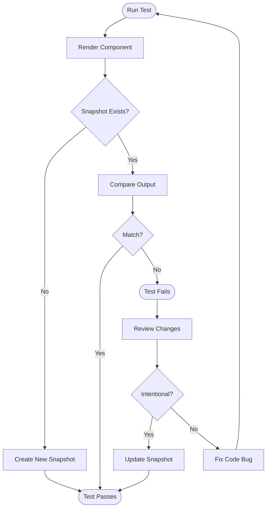
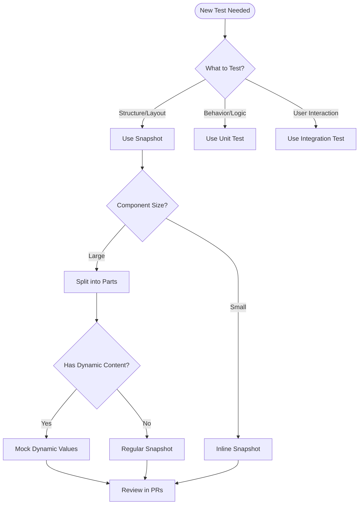

# How to Fix "Snapshot Test" Failures

Author: [nawazdhandala](https://www.github.com/nawazdhandala)

Tags: Testing, Jest, Snapshot Testing, React, JavaScript, Debugging, Frontend

Description: Learn how to diagnose and fix snapshot test failures, including strategies for maintaining snapshots and avoiding common pitfalls.

---

Snapshot testing captures the rendered output of your components and compares it against stored references. When snapshots fail, it can be confusing to determine whether the change is intentional or a bug. This guide covers practical strategies for debugging snapshot failures, maintaining snapshot files, and writing more resilient snapshot tests.

## How Snapshot Testing Works

Snapshot tests serialize your component's output to a file. On subsequent runs, the test compares the current output against the stored snapshot. Any difference causes a failure.



## Common Causes of Snapshot Failures

### 1. Dynamic Content

Dynamic values like dates, IDs, and random numbers cause snapshots to fail unpredictably:

```javascript
// PROBLEMATIC - Contains dynamic date
function Header() {
  return (
    <div>
      <h1>Dashboard</h1>
      <span>Last updated: {new Date().toISOString()}</span>
    </div>
  );
}

// Test fails on every run because the date changes
test('renders header', () => {
  const { container } = render(<Header />);
  expect(container).toMatchSnapshot();
});
```

**Solution: Mock dynamic values**

```javascript
// Mock the date
beforeAll(() => {
  jest.useFakeTimers();
  jest.setSystemTime(new Date('2026-01-24T12:00:00Z'));
});

afterAll(() => {
  jest.useRealTimers();
});

test('renders header with mocked date', () => {
  const { container } = render(<Header />);
  expect(container).toMatchSnapshot();
});
```

**Alternative: Use property matchers**

```javascript
test('renders with dynamic content', () => {
  const data = {
    id: generateUUID(),
    createdAt: new Date().toISOString(),
    name: 'Test Item',
  };

  expect(data).toMatchSnapshot({
    id: expect.any(String),
    createdAt: expect.any(String),
  });
});
```

### 2. Styling and CSS-in-JS Changes

CSS class names from CSS-in-JS libraries often include hashes that change:

```javascript
// Snapshot includes generated class names like "Button__StyledButton-sc-1234abc"
// These change when styles change or on different machines

// SOLUTION: Use jest-styled-components or similar
import 'jest-styled-components';

test('renders styled button', () => {
  const { container } = render(<StyledButton>Click me</StyledButton>);
  expect(container.firstChild).toMatchSnapshot();
});
```

For Emotion:

```javascript
// jest.setup.js
import { createSerializer } from '@emotion/jest';

expect.addSnapshotSerializer(createSerializer());
```

### 3. Third-Party Component Updates

Library updates can change rendered output:

```javascript
// Before library update
// <MaterialButton class="MuiButton-root MuiButton-contained">

// After library update
// <MaterialButton class="MuiButton-root MuiButton-contained MuiButton-sizeMedium">
```

**Solution: Use shallow rendering or mock components**

```javascript
// Mock the third-party component
jest.mock('@mui/material/Button', () => {
  return function MockButton({ children, ...props }) {
    return <button data-testid="mock-button" {...props}>{children}</button>;
  };
});

test('renders with mocked material button', () => {
  const { container } = render(<MyComponent />);
  expect(container).toMatchSnapshot();
});
```

### 4. Platform-Specific Differences

Snapshots may differ between operating systems or Node versions:

```javascript
// Path separators differ: Windows uses \, Unix uses /
// Line endings differ: Windows uses \r\n, Unix uses \n
```

**Solution: Normalize output**

```javascript
// Custom serializer for consistent output
expect.addSnapshotSerializer({
  test: (val) => typeof val === 'string',
  print: (val) => {
    return val
      .replace(/\r\n/g, '\n')           // Normalize line endings
      .replace(/\\/g, '/')               // Normalize path separators
      .replace(/\s+/g, ' ')              // Normalize whitespace
      .trim();
  },
});
```

## Debugging Snapshot Failures

### Step 1: View the Diff

When a snapshot fails, Jest shows a diff. Read it carefully:

```
- Snapshot  - 3
+ Received  + 3

  <div>
    <h1>
-     Welcome
+     Welcome Back
    </h1>
    <p>
-     You have 5 notifications
+     You have 3 notifications
    </p>
  </div>
```

### Step 2: Interactive Update Mode

Run Jest in interactive mode to review and update snapshots one by one:

```bash
# Run in watch mode
jest --watch

# Press 'i' for interactive snapshot mode
# Review each failure and press 'u' to update or 's' to skip
```

### Step 3: Check for Unintended Changes

Ask these questions:
- Did I modify this component recently?
- Did I update any dependencies?
- Is this change intentional or a regression?

### Step 4: Update or Fix

```bash
# Update all snapshots (use with caution!)
jest --updateSnapshot

# Update specific test file snapshots
jest --updateSnapshot --testPathPattern="Button.test.js"
```

## Writing Better Snapshot Tests

### Use Inline Snapshots for Small Output

```javascript
test('formats currency', () => {
  expect(formatCurrency(1234.56)).toMatchInlineSnapshot(`"$1,234.56"`);
});

test('renders simple component', () => {
  const { container } = render(<Badge count={5} />);
  expect(container.innerHTML).toMatchInlineSnapshot(
    `"<span class="badge">5</span>"`
  );
});
```

### Target Specific Parts

Instead of snapshotting entire components, target specific parts:

```javascript
// AVOID - Large snapshot of entire page
test('renders page', () => {
  const { container } = render(<EntirePage />);
  expect(container).toMatchSnapshot();
});

// BETTER - Snapshot specific elements
test('renders page header correctly', () => {
  const { getByRole } = render(<EntirePage />);
  expect(getByRole('banner')).toMatchSnapshot();
});

test('renders navigation items', () => {
  const { getByRole } = render(<EntirePage />);
  expect(getByRole('navigation')).toMatchSnapshot();
});
```

### Combine with Assertions

Snapshots work best alongside explicit assertions:

```javascript
test('renders user profile', () => {
  const user = { name: 'John', role: 'Admin' };
  const { getByText, container } = render(<UserProfile user={user} />);

  // Explicit assertions for critical content
  expect(getByText('John')).toBeInTheDocument();
  expect(getByText('Admin')).toBeInTheDocument();

  // Snapshot for overall structure
  expect(container).toMatchSnapshot();
});
```

## Snapshot Management Best Practices

### 1. Keep Snapshots Small

```javascript
// Large snapshots are hard to review
// Break them into focused tests

describe('ProductCard', () => {
  test('renders product image', () => {
    const { getByRole } = render(<ProductCard {...props} />);
    expect(getByRole('img')).toMatchSnapshot();
  });

  test('renders product details', () => {
    const { getByTestId } = render(<ProductCard {...props} />);
    expect(getByTestId('product-details')).toMatchSnapshot();
  });

  test('renders price section', () => {
    const { getByTestId } = render(<ProductCard {...props} />);
    expect(getByTestId('price-section')).toMatchSnapshot();
  });
});
```

### 2. Review Snapshots in Code Review

Treat snapshot files as code:

```javascript
// .gitattributes
*.snap linguist-generated=false
```

```yaml
# In your PR template
## Checklist
- [ ] Reviewed snapshot changes
- [ ] Snapshot updates are intentional
```

### 3. Clean Up Obsolete Snapshots

```bash
# Remove unused snapshots
jest --updateSnapshot --coverage

# Or run with the flag
jest --detectOpenHandles --forceExit --ci
```

### 4. Use Descriptive Test Names

Snapshot files use test names as keys:

```javascript
// Good - descriptive snapshot names
test('renders loading state when data is fetching', () => {
  expect(container).toMatchSnapshot();
});

test('renders error state with retry button', () => {
  expect(container).toMatchSnapshot();
});

// Bad - generic names
test('renders correctly', () => {
  expect(container).toMatchSnapshot();
});
```

## Snapshot Testing Decision Flow



## Configuration Tips

### Jest Configuration

```javascript
// jest.config.js
module.exports = {
  // Snapshot format
  snapshotFormat: {
    escapeString: true,
    printBasicPrototype: true,
  },

  // Snapshot resolver for custom locations
  snapshotResolver: './snapshotResolver.js',

  // Snapshot serializers
  snapshotSerializers: [
    'jest-serializer-html',
    '@emotion/jest/serializer',
  ],
};
```

### Custom Snapshot Resolver

```javascript
// snapshotResolver.js
module.exports = {
  // Where to store snapshots
  resolveSnapshotPath: (testPath, snapshotExtension) =>
    testPath.replace('__tests__', '__snapshots__') + snapshotExtension,

  // How to find test from snapshot
  resolveTestPath: (snapshotFilePath, snapshotExtension) =>
    snapshotFilePath
      .replace('__snapshots__', '__tests__')
      .slice(0, -snapshotExtension.length),

  testPathForConsistencyCheck: 'src/__tests__/example.test.js',
};
```

## Conclusion

Snapshot tests are powerful for catching unintended UI changes but require careful maintenance. When a snapshot fails, always investigate whether the change is intentional before updating. Keep snapshots small and focused, mock dynamic content, and treat snapshot files as first-class code that deserves review. Combined with explicit assertions, snapshots provide an effective safety net that catches regressions while remaining maintainable over time.
