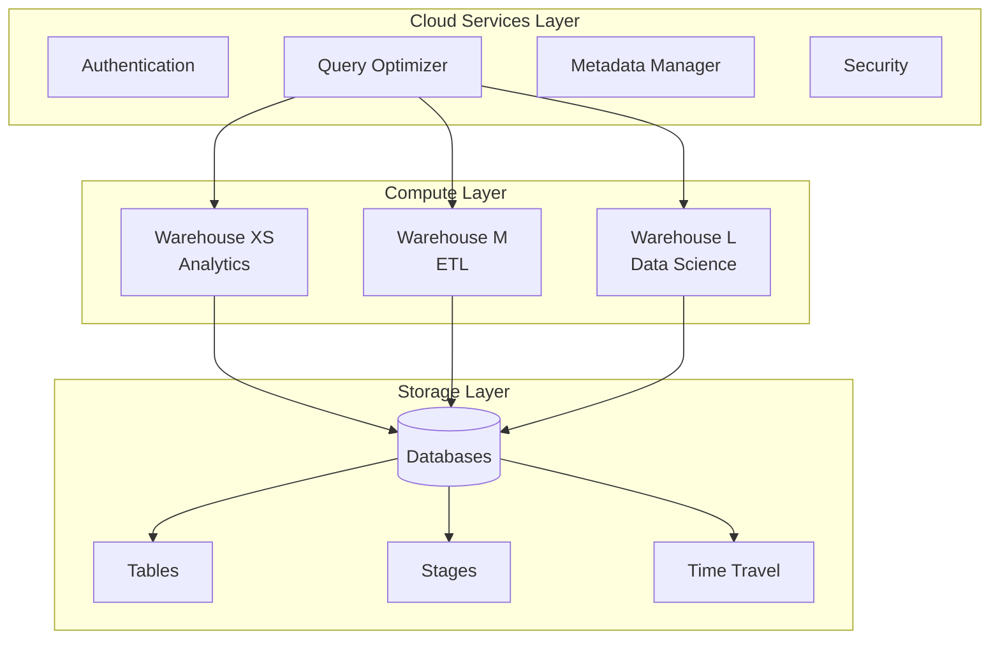

# How to Configure Snowflake Data Warehouse

Author: [nawazdhandala](https://www.github.com/nawazdhandala)

Tags: Snowflake, Data Warehouse, Cloud Data, SQL, Data Engineering, Analytics, Data Architecture

Description: Learn how to configure Snowflake data warehouse for optimal performance, cost management, and security with practical examples and best practices.

---

> Snowflake has become the go-to cloud data warehouse for organizations seeking separation of storage and compute, near-infinite scalability, and zero maintenance overhead. However, getting the configuration right is essential for both performance and cost control.

This guide covers Snowflake configuration from account setup through production optimization, helping you build a well-architected data warehouse.

---

## Understanding Snowflake Architecture

Snowflake's unique architecture separates storage, compute, and services into independent layers.



---

## Initial Account Configuration

Start with proper account-level settings that affect all users and workloads.

```sql
-- account_setup.sql
-- Initial Snowflake account configuration

-- Set account-level parameters
USE ROLE ACCOUNTADMIN;

-- Enable multi-factor authentication requirement
ALTER ACCOUNT SET REQUIRE_MFA = TRUE;

-- Configure session timeout (in seconds)
ALTER ACCOUNT SET SESSION_TIMEOUT = 14400;  -- 4 hours

-- Set default timezone
ALTER ACCOUNT SET TIMEZONE = 'UTC';

-- Enable query acceleration (helps with ad-hoc queries)
ALTER ACCOUNT SET ENABLE_QUERY_ACCELERATION = TRUE;

-- Configure statement timeout to prevent runaway queries
ALTER ACCOUNT SET STATEMENT_TIMEOUT_IN_SECONDS = 3600;  -- 1 hour max

-- Enable result caching for repeated queries
ALTER ACCOUNT SET USE_CACHED_RESULT = TRUE;

-- Set up network policy to restrict access
CREATE NETWORK POLICY corporate_network
    ALLOWED_IP_LIST = ('10.0.0.0/8', '192.168.0.0/16', '203.0.113.0/24')
    BLOCKED_IP_LIST = ()
    COMMENT = 'Restrict access to corporate network';

ALTER ACCOUNT SET NETWORK_POLICY = corporate_network;
```

---

## Database and Schema Organization

Organize your data warehouse with a clear structure that supports governance and discoverability.

```sql
-- database_structure.sql
-- Create organized database structure

-- Create databases for different data zones
CREATE DATABASE raw_data
    COMMENT = 'Raw data ingested from source systems';

CREATE DATABASE staging
    COMMENT = 'Intermediate transformations and data quality checks';

CREATE DATABASE analytics
    COMMENT = 'Curated data models for business users';

CREATE DATABASE sandbox
    DATA_RETENTION_TIME_IN_DAYS = 1
    COMMENT = 'Experimentation space for data scientists';

-- Create schemas within analytics database
USE DATABASE analytics;

-- Schema for each business domain
CREATE SCHEMA sales
    COMMENT = 'Sales and revenue metrics';

CREATE SCHEMA marketing
    COMMENT = 'Marketing campaign and attribution data';

CREATE SCHEMA finance
    COMMENT = 'Financial reporting and accounting';

CREATE SCHEMA operations
    COMMENT = 'Operational metrics and KPIs';

-- Create shared schema for common dimensions
CREATE SCHEMA shared
    COMMENT = 'Shared dimension tables and lookup data';

-- Grant appropriate access
GRANT USAGE ON DATABASE analytics TO ROLE analyst;
GRANT USAGE ON ALL SCHEMAS IN DATABASE analytics TO ROLE analyst;
GRANT SELECT ON ALL TABLES IN DATABASE analytics TO ROLE analyst;
GRANT SELECT ON FUTURE TABLES IN DATABASE analytics TO ROLE analyst;
```

---

## Virtual Warehouse Configuration

Configure warehouses for different workload patterns to optimize performance and cost.

```sql
-- warehouse_configuration.sql
-- Create and configure virtual warehouses

-- ETL warehouse - larger for batch processing
CREATE WAREHOUSE etl_warehouse
    WAREHOUSE_SIZE = 'LARGE'
    WAREHOUSE_TYPE = 'STANDARD'
    AUTO_SUSPEND = 60              -- Suspend after 1 minute of inactivity
    AUTO_RESUME = TRUE
    MIN_CLUSTER_COUNT = 1
    MAX_CLUSTER_COUNT = 3          -- Scale up to 3 clusters for parallel loads
    SCALING_POLICY = 'STANDARD'
    COMMENT = 'ETL and data loading workloads';

-- Analytics warehouse - medium for BI tools
CREATE WAREHOUSE analytics_warehouse
    WAREHOUSE_SIZE = 'MEDIUM'
    WAREHOUSE_TYPE = 'STANDARD'
    AUTO_SUSPEND = 300             -- 5 minutes for interactive use
    AUTO_RESUME = TRUE
    MIN_CLUSTER_COUNT = 1
    MAX_CLUSTER_COUNT = 2
    SCALING_POLICY = 'ECONOMY'     -- Favor cost over performance for scaling
    ENABLE_QUERY_ACCELERATION = TRUE
    QUERY_ACCELERATION_MAX_SCALE_FACTOR = 4
    COMMENT = 'Business intelligence and reporting';

-- Data science warehouse - extra large for ML workloads
CREATE WAREHOUSE data_science_warehouse
    WAREHOUSE_SIZE = 'XLARGE'
    WAREHOUSE_TYPE = 'STANDARD'
    AUTO_SUSPEND = 120
    AUTO_RESUME = TRUE
    MIN_CLUSTER_COUNT = 1
    MAX_CLUSTER_COUNT = 1          -- Single cluster to control costs
    COMMENT = 'Machine learning and advanced analytics';

-- Serverless warehouse for variable workloads
CREATE WAREHOUSE serverless_warehouse
    WAREHOUSE_TYPE = 'SNOWPARK-OPTIMIZED'
    WAREHOUSE_SIZE = 'MEDIUM'
    AUTO_SUSPEND = 60
    COMMENT = 'Snowpark and UDF workloads';

-- Create resource monitor to control costs
CREATE RESOURCE MONITOR monthly_budget
    CREDIT_QUOTA = 1000            -- 1000 credits per month
    FREQUENCY = MONTHLY
    START_TIMESTAMP = IMMEDIATELY
    TRIGGERS
        ON 75 PERCENT DO NOTIFY
        ON 90 PERCENT DO NOTIFY
        ON 100 PERCENT DO SUSPEND;

-- Apply resource monitor to warehouses
ALTER WAREHOUSE etl_warehouse SET RESOURCE_MONITOR = monthly_budget;
ALTER WAREHOUSE analytics_warehouse SET RESOURCE_MONITOR = monthly_budget;
```

---

## Data Loading Configuration

Set up efficient data loading pipelines using stages and pipes.

```sql
-- data_loading.sql
-- Configure data loading infrastructure

USE DATABASE raw_data;
CREATE SCHEMA IF NOT EXISTS ingestion;
USE SCHEMA ingestion;

-- Create external stage for S3
CREATE STAGE s3_landing_stage
    URL = 's3://my-data-bucket/landing/'
    STORAGE_INTEGRATION = s3_integration
    FILE_FORMAT = (
        TYPE = 'PARQUET'
        COMPRESSION = 'SNAPPY'
    )
    COMMENT = 'Landing zone for incoming data files';

-- Create file formats for different data types
CREATE FILE FORMAT json_format
    TYPE = 'JSON'
    COMPRESSION = 'AUTO'
    STRIP_OUTER_ARRAY = TRUE
    ENABLE_OCTAL = FALSE
    ALLOW_DUPLICATE = FALSE
    STRIP_NULL_VALUES = FALSE
    IGNORE_UTF8_ERRORS = FALSE;

CREATE FILE FORMAT csv_format
    TYPE = 'CSV'
    COMPRESSION = 'AUTO'
    FIELD_DELIMITER = ','
    RECORD_DELIMITER = '\n'
    SKIP_HEADER = 1
    FIELD_OPTIONALLY_ENCLOSED_BY = '"'
    TRIM_SPACE = TRUE
    ERROR_ON_COLUMN_COUNT_MISMATCH = FALSE
    ESCAPE = '\\'
    NULL_IF = ('NULL', 'null', '');

-- Create target table for events
CREATE TABLE events (
    event_id STRING NOT NULL,
    event_type STRING NOT NULL,
    user_id STRING,
    properties VARIANT,
    event_timestamp TIMESTAMP_NTZ NOT NULL,
    loaded_at TIMESTAMP_NTZ DEFAULT CURRENT_TIMESTAMP()
)
CLUSTER BY (DATE_TRUNC('DAY', event_timestamp), event_type)
COMMENT = 'Raw event data from application';

-- Create Snowpipe for automatic ingestion
CREATE PIPE events_pipe
    AUTO_INGEST = TRUE
    AS
    COPY INTO events (event_id, event_type, user_id, properties, event_timestamp)
    FROM (
        SELECT
            $1:event_id::STRING,
            $1:event_type::STRING,
            $1:user_id::STRING,
            $1:properties::VARIANT,
            $1:timestamp::TIMESTAMP_NTZ
        FROM @s3_landing_stage/events/
    )
    FILE_FORMAT = (FORMAT_NAME = 'json_format')
    ON_ERROR = 'CONTINUE';

-- Show pipe status
SELECT SYSTEM$PIPE_STATUS('events_pipe');
```

Python code for loading data programmatically:

```python
# snowflake_loader.py
# Load data into Snowflake using Python

import snowflake.connector
from snowflake.connector.pandas_tools import write_pandas
import pandas as pd
from typing import Optional

class SnowflakeLoader:
    """
    Handle data loading into Snowflake with best practices.
    """

    def __init__(self, account: str, user: str, password: str, warehouse: str):
        self.connection_params = {
            'account': account,
            'user': user,
            'password': password,
            'warehouse': warehouse,
            'role': 'DATA_ENGINEER'
        }

    def get_connection(self):
        """Create a new database connection."""
        return snowflake.connector.connect(**self.connection_params)

    def load_dataframe(
        self,
        df: pd.DataFrame,
        database: str,
        schema: str,
        table: str,
        overwrite: bool = False
    ) -> dict:
        """
        Load a pandas DataFrame into Snowflake.
        Returns statistics about the load operation.
        """
        conn = self.get_connection()

        try:
            # Set context
            conn.cursor().execute(f"USE DATABASE {database}")
            conn.cursor().execute(f"USE SCHEMA {schema}")

            # Write DataFrame to Snowflake
            success, nchunks, nrows, _ = write_pandas(
                conn=conn,
                df=df,
                table_name=table,
                database=database,
                schema=schema,
                overwrite=overwrite,
                auto_create_table=True,
                quote_identifiers=False
            )

            return {
                'success': success,
                'chunks': nchunks,
                'rows': nrows,
                'table': f"{database}.{schema}.{table}"
            }
        finally:
            conn.close()

    def execute_copy(
        self,
        stage: str,
        table: str,
        file_format: str,
        pattern: Optional[str] = None
    ) -> dict:
        """
        Execute a COPY INTO command for bulk loading.
        """
        conn = self.get_connection()

        try:
            # Build COPY command
            copy_sql = f"""
                COPY INTO {table}
                FROM @{stage}
                FILE_FORMAT = (FORMAT_NAME = '{file_format}')
                ON_ERROR = 'CONTINUE'
                PURGE = TRUE
            """

            if pattern:
                copy_sql += f" PATTERN = '{pattern}'"

            cursor = conn.cursor()
            cursor.execute(copy_sql)

            # Get load results
            result = cursor.fetchone()

            return {
                'file': result[0] if result else None,
                'status': result[1] if result else 'NO_FILES',
                'rows_parsed': result[2] if result else 0,
                'rows_loaded': result[3] if result else 0
            }
        finally:
            conn.close()


# Example usage
if __name__ == '__main__':
    loader = SnowflakeLoader(
        account='myaccount.us-east-1',
        user='data_engineer',
        password='secure_password',
        warehouse='etl_warehouse'
    )

    # Load a DataFrame
    df = pd.DataFrame({
        'id': [1, 2, 3],
        'name': ['Alice', 'Bob', 'Charlie'],
        'created_at': pd.Timestamp.now()
    })

    result = loader.load_dataframe(
        df=df,
        database='staging',
        schema='public',
        table='users'
    )

    print(f"Loaded {result['rows']} rows to {result['table']}")
```

---

## Security Configuration

Implement proper security controls to protect your data.

```sql
-- security_configuration.sql
-- Set up security roles and access controls

USE ROLE SECURITYADMIN;

-- Create functional roles
CREATE ROLE data_engineer;
CREATE ROLE analyst;
CREATE ROLE data_scientist;
CREATE ROLE finance_analyst;
CREATE ROLE read_only;

-- Create role hierarchy
GRANT ROLE read_only TO ROLE analyst;
GRANT ROLE analyst TO ROLE data_scientist;
GRANT ROLE analyst TO ROLE data_engineer;

-- Grant warehouse access by role
GRANT USAGE ON WAREHOUSE analytics_warehouse TO ROLE analyst;
GRANT USAGE ON WAREHOUSE analytics_warehouse TO ROLE finance_analyst;
GRANT USAGE ON WAREHOUSE data_science_warehouse TO ROLE data_scientist;
GRANT USAGE ON WAREHOUSE etl_warehouse TO ROLE data_engineer;

-- Data access grants
USE ROLE SYSADMIN;

-- Analysts can read analytics database
GRANT USAGE ON DATABASE analytics TO ROLE analyst;
GRANT USAGE ON ALL SCHEMAS IN DATABASE analytics TO ROLE analyst;
GRANT SELECT ON ALL TABLES IN DATABASE analytics TO ROLE analyst;
GRANT SELECT ON FUTURE TABLES IN DATABASE analytics TO ROLE analyst;

-- Finance analysts can only see finance schema
GRANT USAGE ON DATABASE analytics TO ROLE finance_analyst;
GRANT USAGE ON SCHEMA analytics.finance TO ROLE finance_analyst;
GRANT SELECT ON ALL TABLES IN SCHEMA analytics.finance TO ROLE finance_analyst;

-- Data engineers have full access to raw and staging
GRANT ALL ON DATABASE raw_data TO ROLE data_engineer;
GRANT ALL ON DATABASE staging TO ROLE data_engineer;

-- Set up row-level security with row access policies
CREATE ROW ACCESS POLICY region_policy AS (region STRING)
RETURNS BOOLEAN ->
    CURRENT_ROLE() IN ('ACCOUNTADMIN', 'DATA_ENGINEER')
    OR EXISTS (
        SELECT 1 FROM user_region_access
        WHERE user_id = CURRENT_USER()
        AND allowed_region = region
    );

-- Apply policy to table
ALTER TABLE analytics.sales.transactions
    ADD ROW ACCESS POLICY region_policy ON (region);

-- Create column masking policy for PII
CREATE MASKING POLICY email_mask AS (val STRING)
RETURNS STRING ->
    CASE
        WHEN CURRENT_ROLE() IN ('ACCOUNTADMIN', 'DATA_ENGINEER') THEN val
        ELSE REGEXP_REPLACE(val, '.+@', '****@')
    END;

-- Apply masking policy
ALTER TABLE analytics.shared.customers
    MODIFY COLUMN email SET MASKING POLICY email_mask;
```

---

## Performance Optimization

Configure tables and queries for optimal performance.

```sql
-- performance_optimization.sql
-- Optimize table structures and queries

-- Create a properly clustered fact table
CREATE TABLE analytics.sales.transactions (
    transaction_id STRING NOT NULL,
    customer_id STRING NOT NULL,
    product_id STRING NOT NULL,
    store_id STRING NOT NULL,
    transaction_date DATE NOT NULL,
    transaction_timestamp TIMESTAMP_NTZ NOT NULL,
    quantity INTEGER,
    unit_price DECIMAL(10,2),
    total_amount DECIMAL(12,2),
    currency STRING DEFAULT 'USD',
    payment_method STRING,
    region STRING
)
-- Cluster by most common filter columns
CLUSTER BY (transaction_date, region, store_id)
-- Enable search optimization for ad-hoc queries
ENABLE_SEARCH_OPTIMIZATION = TRUE
COMMENT = 'Sales transaction fact table';

-- Create materialized view for common aggregations
CREATE MATERIALIZED VIEW analytics.sales.daily_sales_summary AS
SELECT
    transaction_date,
    region,
    store_id,
    COUNT(*) as transaction_count,
    SUM(total_amount) as total_sales,
    AVG(total_amount) as avg_transaction_value
FROM analytics.sales.transactions
GROUP BY transaction_date, region, store_id;

-- Create a task to refresh summaries
CREATE TASK refresh_sales_summary
    WAREHOUSE = etl_warehouse
    SCHEDULE = 'USING CRON 0 */4 * * * America/New_York'
AS
    ALTER MATERIALIZED VIEW analytics.sales.daily_sales_summary RESUME;

-- Enable the task
ALTER TASK refresh_sales_summary RESUME;

-- Query optimization example
-- Bad: Full table scan
-- SELECT * FROM transactions WHERE YEAR(transaction_date) = 2024;

-- Good: Predicate pushdown on cluster key
SELECT *
FROM analytics.sales.transactions
WHERE transaction_date BETWEEN '2024-01-01' AND '2024-12-31'
    AND region = 'US-EAST';
```

---

## Monitoring and Cost Management

Set up monitoring to track usage and control costs.

```sql
-- monitoring_setup.sql
-- Create monitoring views and alerts

-- Create a monitoring database
CREATE DATABASE IF NOT EXISTS monitoring;
USE DATABASE monitoring;
CREATE SCHEMA IF NOT EXISTS usage;
USE SCHEMA usage;

-- View for warehouse credit usage
CREATE VIEW warehouse_credit_usage AS
SELECT
    warehouse_name,
    DATE_TRUNC('DAY', start_time) as usage_date,
    SUM(credits_used) as daily_credits,
    SUM(credits_used_compute) as compute_credits,
    SUM(credits_used_cloud_services) as cloud_services_credits
FROM snowflake.account_usage.warehouse_metering_history
WHERE start_time >= DATEADD('DAY', -30, CURRENT_TIMESTAMP())
GROUP BY warehouse_name, DATE_TRUNC('DAY', start_time)
ORDER BY usage_date DESC, daily_credits DESC;

-- View for query performance
CREATE VIEW slow_queries AS
SELECT
    query_id,
    query_text,
    user_name,
    warehouse_name,
    execution_time / 1000 as execution_seconds,
    bytes_scanned / (1024*1024*1024) as gb_scanned,
    rows_produced,
    partitions_scanned,
    partitions_total
FROM snowflake.account_usage.query_history
WHERE execution_time > 60000  -- Longer than 1 minute
    AND start_time >= DATEADD('DAY', -7, CURRENT_TIMESTAMP())
ORDER BY execution_time DESC
LIMIT 100;

-- View for storage usage trends
CREATE VIEW storage_usage AS
SELECT
    usage_date,
    database_name,
    SUM(average_database_bytes) / (1024*1024*1024) as storage_gb,
    SUM(average_failsafe_bytes) / (1024*1024*1024) as failsafe_gb
FROM snowflake.account_usage.database_storage_usage_history
WHERE usage_date >= DATEADD('DAY', -90, CURRENT_DATE())
GROUP BY usage_date, database_name
ORDER BY usage_date DESC;

-- Create alert for high credit usage
CREATE ALERT high_credit_usage_alert
    WAREHOUSE = etl_warehouse
    SCHEDULE = 'USING CRON 0 9 * * * America/New_York'
    IF (EXISTS (
        SELECT 1
        FROM warehouse_credit_usage
        WHERE usage_date = CURRENT_DATE() - 1
            AND daily_credits > 100
    ))
    THEN
        CALL SYSTEM$SEND_EMAIL(
            'data-team@company.com',
            'High Snowflake Credit Usage Alert',
            'Daily credit usage exceeded 100 credits yesterday.'
        );

ALTER ALERT high_credit_usage_alert RESUME;
```

---

## Best Practices

1. **Right-size warehouses** - Start small and scale up based on actual needs
2. **Use auto-suspend** - Always configure auto-suspend to avoid idle costs
3. **Cluster large tables** - Use clustering keys based on common filter columns
4. **Leverage caching** - Design queries to benefit from result caching
5. **Monitor continuously** - Track credit usage and query performance daily
6. **Use resource monitors** - Set hard limits to prevent cost overruns
7. **Implement proper security** - Use roles, masking, and row-level security from the start

---

*Need unified monitoring across your Snowflake data warehouse and other infrastructure? [OneUptime](https://oneuptime.com) provides comprehensive observability for cloud data platforms.*

**Related Reading:**
- [How to Configure Data Lake Architecture](https://oneuptime.com/blog/post/2026-01-24-data-lake-architecture/view)
- [How to Handle Apache Beam Pipelines](https://oneuptime.com/blog/post/2026-01-24-apache-beam-pipelines/view)
