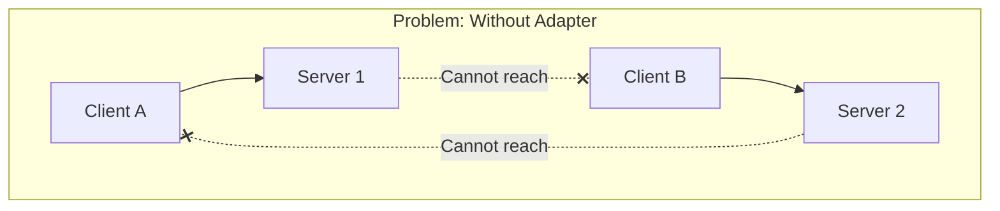
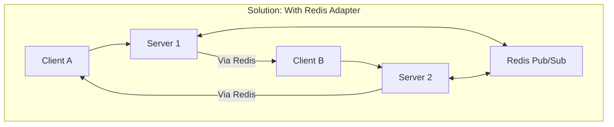
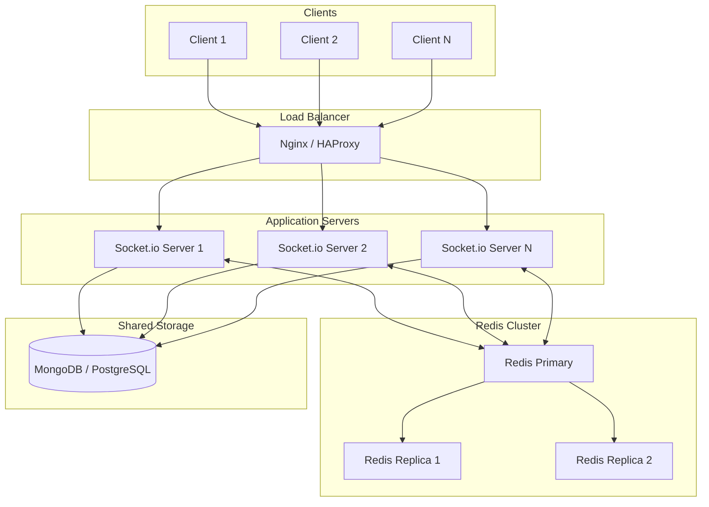

# How to Configure Socket.io with Multiple Servers

Author: [nawazdhandala](https://www.github.com/nawazdhandala)

Tags: Socket.io, WebSocket, Redis, Node.js, Scaling, Load Balancing, Clustering

Description: Learn how to configure Socket.io across multiple servers using Redis adapter, sticky sessions, and proper load balancing for scalable real-time applications.

---

Running Socket.io across multiple servers is essential for scaling real-time applications. Without proper configuration, users connected to different servers cannot communicate with each other. This guide covers the complete setup for multi-server Socket.io deployments.

## The Multi-Server Challenge

When you scale Socket.io horizontally, each server maintains its own set of connections. Without a shared state mechanism, messages sent from one server will not reach clients connected to other servers.





## Solution 1: Redis Adapter Setup

### Install Dependencies

```bash
npm install socket.io @socket.io/redis-adapter redis
```

### Basic Redis Adapter Configuration

```javascript
// server.js - Socket.io with Redis adapter

const http = require('http');
const { Server } = require('socket.io');
const { createClient } = require('redis');
const { createAdapter } = require('@socket.io/redis-adapter');

async function createServer() {
    const httpServer = http.createServer();

    const io = new Server(httpServer, {
        cors: {
            origin: '*',
            methods: ['GET', 'POST']
        }
    });

    // Create Redis clients for pub/sub
    const pubClient = createClient({
        url: process.env.REDIS_URL || 'redis://localhost:6379'
    });
    const subClient = pubClient.duplicate();

    // Connect to Redis
    await Promise.all([
        pubClient.connect(),
        subClient.connect()
    ]);

    // Set up the Redis adapter
    io.adapter(createAdapter(pubClient, subClient));

    // Connection handling
    io.on('connection', (socket) => {
        console.log(`Client connected: ${socket.id} on server ${process.pid}`);

        // Join a room
        socket.on('join-room', (room) => {
            socket.join(room);
            console.log(`${socket.id} joined room: ${room}`);
        });

        // Broadcast to room (works across servers)
        socket.on('room-message', (data) => {
            io.to(data.room).emit('message', {
                from: socket.id,
                content: data.message,
                timestamp: Date.now()
            });
        });

        // Broadcast to all (works across servers)
        socket.on('broadcast', (message) => {
            io.emit('broadcast', {
                from: socket.id,
                content: message
            });
        });

        socket.on('disconnect', () => {
            console.log(`Client disconnected: ${socket.id}`);
        });
    });

    const PORT = process.env.PORT || 3000;
    httpServer.listen(PORT, () => {
        console.log(`Server ${process.pid} listening on port ${PORT}`);
    });

    return io;
}

createServer().catch(console.error);
```

### Redis Adapter with Cluster Mode

```javascript
// server-cluster.js - Socket.io with Redis in cluster mode

const cluster = require('cluster');
const http = require('http');
const { Server } = require('socket.io');
const { createClient } = require('redis');
const { createAdapter } = require('@socket.io/redis-adapter');
const { setupMaster, setupWorker } = require('@socket.io/sticky');
const numCPUs = require('os').cpus().length;

if (cluster.isPrimary) {
    console.log(`Primary ${process.pid} starting ${numCPUs} workers`);

    // Create the HTTP server in the primary process
    const httpServer = http.createServer();

    // Set up sticky sessions (required for Socket.io)
    setupMaster(httpServer, {
        loadBalancingMethod: 'least-connection'
    });

    httpServer.listen(3000, () => {
        console.log('Primary listening on port 3000');
    });

    // Fork workers
    for (let i = 0; i < numCPUs; i++) {
        cluster.fork();
    }

    cluster.on('exit', (worker, code, signal) => {
        console.log(`Worker ${worker.process.pid} died, restarting...`);
        cluster.fork();
    });

} else {
    startWorker();
}

async function startWorker() {
    const httpServer = http.createServer();
    const io = new Server(httpServer);

    // Redis adapter for cross-process communication
    const pubClient = createClient({ url: 'redis://localhost:6379' });
    const subClient = pubClient.duplicate();

    await Promise.all([pubClient.connect(), subClient.connect()]);

    io.adapter(createAdapter(pubClient, subClient));

    // Set up the worker
    setupWorker(io);

    io.on('connection', (socket) => {
        console.log(`Worker ${process.pid}: Client ${socket.id} connected`);

        socket.on('message', (data) => {
            // This will reach all clients across all workers
            io.emit('message', data);
        });

        socket.on('disconnect', () => {
            console.log(`Worker ${process.pid}: Client ${socket.id} disconnected`);
        });
    });

    // Worker listens on random port, primary handles routing
    httpServer.listen(0, 'localhost');
    console.log(`Worker ${process.pid} started`);
}
```

## Solution 2: Sticky Sessions with Load Balancer

Sticky sessions ensure that a client always connects to the same server during a session, which is required for Socket.io's HTTP long-polling fallback.

### Nginx Configuration

```nginx
# /etc/nginx/conf.d/socketio.conf

upstream socketio_nodes {
    # Use IP hash for sticky sessions
    ip_hash;

    server 192.168.1.10:3000;
    server 192.168.1.11:3000;
    server 192.168.1.12:3000;

    # Health checks
    keepalive 64;
}

server {
    listen 80;
    server_name socket.example.com;

    location / {
        proxy_pass http://socketio_nodes;

        # WebSocket support
        proxy_http_version 1.1;
        proxy_set_header Upgrade $http_upgrade;
        proxy_set_header Connection "upgrade";

        # Headers
        proxy_set_header Host $host;
        proxy_set_header X-Real-IP $remote_addr;
        proxy_set_header X-Forwarded-For $proxy_add_x_forwarded_for;
        proxy_set_header X-Forwarded-Proto $scheme;

        # Timeouts
        proxy_connect_timeout 7d;
        proxy_send_timeout 7d;
        proxy_read_timeout 7d;
    }
}
```

### HAProxy Configuration

```
# /etc/haproxy/haproxy.cfg

global
    maxconn 100000
    nbthread 4

defaults
    mode http
    timeout connect 5s
    timeout client 60s
    timeout server 60s
    timeout tunnel 1h

frontend socketio_front
    bind *:80
    bind *:443 ssl crt /etc/ssl/certs/server.pem

    default_backend socketio_back

backend socketio_back
    balance source
    hash-type consistent

    # Enable WebSocket
    option http-server-close
    option forwardfor

    # Cookie-based stickiness (alternative to source IP)
    cookie SERVERID insert indirect nocache

    server node1 192.168.1.10:3000 check cookie node1
    server node2 192.168.1.11:3000 check cookie node2
    server node3 192.168.1.12:3000 check cookie node3
```

## Solution 3: Complete Multi-Server Architecture



### Full Implementation

```javascript
// app.js - Production Socket.io server

const express = require('express');
const http = require('http');
const { Server } = require('socket.io');
const { createClient } = require('redis');
const { createAdapter } = require('@socket.io/redis-adapter');

class SocketIOCluster {
    constructor(config) {
        this.config = {
            port: config.port || 3000,
            redisUrl: config.redisUrl || 'redis://localhost:6379',
            serverId: config.serverId || `server-${process.pid}`,
            ...config
        };

        this.app = express();
        this.server = http.createServer(this.app);
        this.io = null;
        this.pubClient = null;
        this.subClient = null;
    }

    async initialize() {
        // Set up Redis clients
        this.pubClient = createClient({
            url: this.config.redisUrl,
            socket: {
                reconnectStrategy: (retries) => {
                    if (retries > 10) {
                        return new Error('Redis connection failed');
                    }
                    return Math.min(retries * 100, 3000);
                }
            }
        });

        this.subClient = this.pubClient.duplicate();

        // Redis error handling
        this.pubClient.on('error', (err) => {
            console.error('Redis pub client error:', err);
        });

        this.subClient.on('error', (err) => {
            console.error('Redis sub client error:', err);
        });

        await Promise.all([
            this.pubClient.connect(),
            this.subClient.connect()
        ]);

        console.log('Connected to Redis');

        // Configure Socket.io
        this.io = new Server(this.server, {
            cors: {
                origin: this.config.allowedOrigins || '*',
                methods: ['GET', 'POST'],
                credentials: true
            },
            transports: ['websocket', 'polling'],
            pingTimeout: 60000,
            pingInterval: 25000,
            upgradeTimeout: 30000,
            maxHttpBufferSize: 1e6
        });

        // Attach Redis adapter
        this.io.adapter(createAdapter(this.pubClient, this.subClient));

        // Set up event handlers
        this.setupEventHandlers();

        // Set up HTTP routes
        this.setupRoutes();
    }

    setupEventHandlers() {
        this.io.on('connection', (socket) => {
            this.handleConnection(socket);
        });
    }

    handleConnection(socket) {
        const clientInfo = {
            id: socket.id,
            serverId: this.config.serverId,
            connectedAt: new Date().toISOString()
        };

        console.log(`Client connected: ${JSON.stringify(clientInfo)}`);

        // Store socket metadata
        socket.data.serverId = this.config.serverId;
        socket.data.connectedAt = Date.now();

        // Authentication (if needed)
        socket.on('authenticate', async (token, callback) => {
            try {
                const user = await this.verifyToken(token);
                socket.data.userId = user.id;
                socket.join(`user:${user.id}`);
                callback({ success: true, userId: user.id });
            } catch (error) {
                callback({ success: false, error: error.message });
            }
        });

        // Join room
        socket.on('join', (room, callback) => {
            socket.join(room);
            console.log(`Socket ${socket.id} joined room: ${room}`);
            if (callback) callback({ success: true });
        });

        // Leave room
        socket.on('leave', (room, callback) => {
            socket.leave(room);
            console.log(`Socket ${socket.id} left room: ${room}`);
            if (callback) callback({ success: true });
        });

        // Message to room
        socket.on('message:room', (data) => {
            this.io.to(data.room).emit('message', {
                from: socket.id,
                fromServer: this.config.serverId,
                room: data.room,
                content: data.content,
                timestamp: Date.now()
            });
        });

        // Direct message to user
        socket.on('message:user', (data) => {
            this.io.to(`user:${data.userId}`).emit('direct-message', {
                from: socket.data.userId,
                content: data.content,
                timestamp: Date.now()
            });
        });

        // Broadcast to all
        socket.on('broadcast', (data) => {
            this.io.emit('broadcast', {
                from: socket.id,
                fromServer: this.config.serverId,
                content: data.content,
                timestamp: Date.now()
            });
        });

        // Get room members (across all servers)
        socket.on('room:members', async (room, callback) => {
            try {
                const sockets = await this.io.in(room).fetchSockets();
                const members = sockets.map(s => ({
                    id: s.id,
                    userId: s.data.userId,
                    serverId: s.data.serverId
                }));
                callback({ success: true, members });
            } catch (error) {
                callback({ success: false, error: error.message });
            }
        });

        socket.on('disconnect', (reason) => {
            console.log(`Client disconnected: ${socket.id}, reason: ${reason}`);
        });
    }

    async verifyToken(token) {
        // Implement your token verification logic
        return { id: 'user-' + Math.random().toString(36).substr(2, 9) };
    }

    setupRoutes() {
        // Health check
        this.app.get('/health', (req, res) => {
            res.json({
                status: 'healthy',
                serverId: this.config.serverId,
                connections: this.io.engine.clientsCount,
                uptime: process.uptime()
            });
        });

        // Server info
        this.app.get('/info', async (req, res) => {
            const sockets = await this.io.fetchSockets();
            res.json({
                serverId: this.config.serverId,
                totalConnections: sockets.length,
                rooms: Array.from(this.io.sockets.adapter.rooms.keys())
            });
        });
    }

    async start() {
        await this.initialize();

        this.server.listen(this.config.port, () => {
            console.log(`Socket.io server ${this.config.serverId} running on port ${this.config.port}`);
        });
    }

    async shutdown() {
        console.log('Shutting down server...');

        // Notify clients
        this.io.emit('server-shutdown', {
            serverId: this.config.serverId,
            reconnectIn: 5000
        });

        // Close connections gracefully
        const sockets = await this.io.fetchSockets();
        for (const socket of sockets) {
            socket.disconnect(true);
        }

        // Close Redis connections
        await this.pubClient.quit();
        await this.subClient.quit();

        // Close HTTP server
        this.server.close();
    }
}

// Start server
const server = new SocketIOCluster({
    port: process.env.PORT || 3000,
    redisUrl: process.env.REDIS_URL || 'redis://localhost:6379',
    serverId: process.env.SERVER_ID || `server-${process.pid}`,
    allowedOrigins: ['https://myapp.com', 'http://localhost:3000']
});

server.start().catch(console.error);

// Graceful shutdown
process.on('SIGTERM', () => server.shutdown());
process.on('SIGINT', () => server.shutdown());
```

### Client Implementation

```javascript
// client.js - Socket.io client for multi-server setup

import { io } from 'socket.io-client';

class SocketClient {
    constructor(url, options = {}) {
        this.url = url;
        this.options = {
            transports: ['websocket', 'polling'],
            reconnection: true,
            reconnectionAttempts: 10,
            reconnectionDelay: 1000,
            reconnectionDelayMax: 5000,
            timeout: 20000,
            ...options
        };
        this.socket = null;
        this.eventHandlers = new Map();
    }

    connect() {
        return new Promise((resolve, reject) => {
            this.socket = io(this.url, this.options);

            this.socket.on('connect', () => {
                console.log('Connected to server');
                resolve(this.socket);
            });

            this.socket.on('connect_error', (error) => {
                console.error('Connection error:', error.message);
                reject(error);
            });

            this.socket.on('disconnect', (reason) => {
                console.log('Disconnected:', reason);
                if (reason === 'io server disconnect') {
                    // Server initiated disconnect, need manual reconnect
                    this.socket.connect();
                }
            });

            this.socket.on('server-shutdown', (data) => {
                console.log('Server shutting down, will reconnect in', data.reconnectIn);
            });
        });
    }

    authenticate(token) {
        return new Promise((resolve, reject) => {
            this.socket.emit('authenticate', token, (response) => {
                if (response.success) {
                    resolve(response);
                } else {
                    reject(new Error(response.error));
                }
            });
        });
    }

    joinRoom(room) {
        return new Promise((resolve) => {
            this.socket.emit('join', room, resolve);
        });
    }

    leaveRoom(room) {
        return new Promise((resolve) => {
            this.socket.emit('leave', room, resolve);
        });
    }

    sendToRoom(room, content) {
        this.socket.emit('message:room', { room, content });
    }

    sendToUser(userId, content) {
        this.socket.emit('message:user', { userId, content });
    }

    broadcast(content) {
        this.socket.emit('broadcast', { content });
    }

    async getRoomMembers(room) {
        return new Promise((resolve, reject) => {
            this.socket.emit('room:members', room, (response) => {
                if (response.success) {
                    resolve(response.members);
                } else {
                    reject(new Error(response.error));
                }
            });
        });
    }

    on(event, handler) {
        this.socket.on(event, handler);
        this.eventHandlers.set(event, handler);
    }

    off(event) {
        const handler = this.eventHandlers.get(event);
        if (handler) {
            this.socket.off(event, handler);
            this.eventHandlers.delete(event);
        }
    }

    disconnect() {
        if (this.socket) {
            this.socket.disconnect();
        }
    }
}

// Usage
const client = new SocketClient('https://socket.example.com');

async function main() {
    await client.connect();
    await client.authenticate('user-token');

    // Join a chat room
    await client.joinRoom('general');

    // Listen for messages
    client.on('message', (data) => {
        console.log(`Message from ${data.from} (server ${data.fromServer}):`, data.content);
    });

    // Send message to room
    client.sendToRoom('general', 'Hello everyone!');

    // Get room members (from all servers)
    const members = await client.getRoomMembers('general');
    console.log('Room members:', members);
}

main().catch(console.error);
```

## Solution 4: Redis Streams Adapter (Alternative)

For applications requiring message persistence and replay:

```javascript
// server-streams.js - Socket.io with Redis Streams

const { Server } = require('socket.io');
const { createAdapter } = require('@socket.io/redis-streams-adapter');
const { createClient } = require('redis');

async function createServerWithStreams() {
    const redisClient = createClient({ url: 'redis://localhost:6379' });
    await redisClient.connect();

    const io = new Server(3000, {
        adapter: createAdapter(redisClient, {
            // Stream configuration
            streamName: 'socket.io',
            maxLen: 10000  // Keep last 10000 messages
        })
    });

    io.on('connection', (socket) => {
        // Messages are persisted in Redis Streams
        socket.on('message', (data) => {
            io.emit('message', data);
        });
    });

    return io;
}
```

## Testing Multi-Server Setup

```javascript
// test-cluster.js - Test multi-server communication

const io = require('socket.io-client');

async function testMultiServer() {
    // Connect to load balancer (will be routed to different servers)
    const clients = [];

    for (let i = 0; i < 10; i++) {
        const socket = io('http://localhost:80', {
            transports: ['websocket']
        });

        clients.push(new Promise((resolve) => {
            socket.on('connect', () => {
                console.log(`Client ${i} connected: ${socket.id}`);
                socket.emit('join', 'test-room');
                resolve(socket);
            });
        }));
    }

    const sockets = await Promise.all(clients);

    // Listen for messages on all clients
    sockets.forEach((socket, i) => {
        socket.on('message', (data) => {
            console.log(`Client ${i} received:`, data.content, 'from server:', data.fromServer);
        });
    });

    // Send message from first client
    setTimeout(() => {
        console.log('Sending test message...');
        sockets[0].emit('message:room', {
            room: 'test-room',
            content: 'Hello from client 0!'
        });
    }, 1000);

    // Cleanup after test
    setTimeout(() => {
        sockets.forEach(s => s.disconnect());
        process.exit(0);
    }, 3000);
}

testMultiServer().catch(console.error);
```

## Conclusion

Configuring Socket.io across multiple servers requires three key components: a Redis adapter for cross-server communication, sticky sessions for proper connection handling, and a load balancer to distribute traffic. The Redis adapter ensures that events emitted on one server reach clients connected to other servers. Sticky sessions guarantee that Socket.io's HTTP polling fallback works correctly. With this architecture in place, you can scale your real-time application horizontally while maintaining seamless communication between all connected clients regardless of which server they are connected to.
