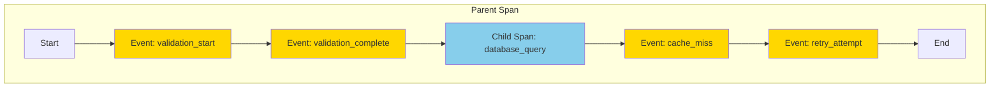
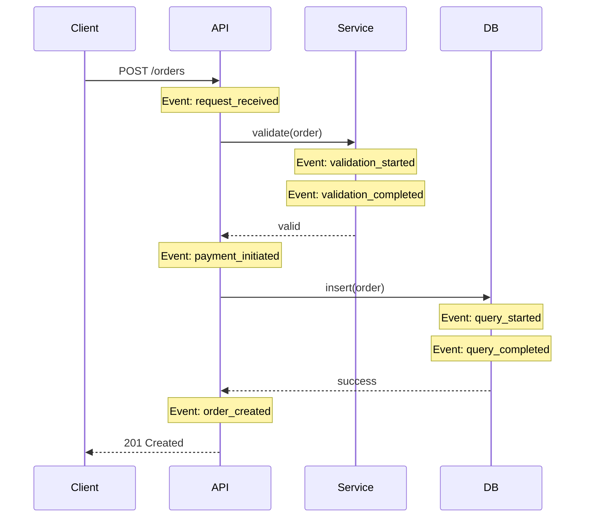
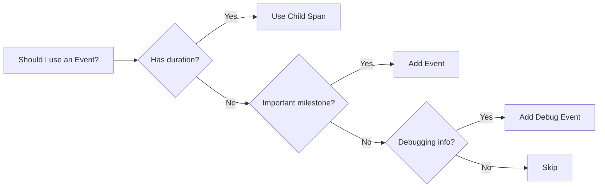

# How to Handle Span Events and Annotations

Author: [nawazdhandala](https://www.github.com/nawazdhandala)

Tags: OpenTelemetry, Tracing, Spans, Events, Observability, Debugging

Description: Learn how to effectively use span events and annotations in OpenTelemetry to capture detailed timing information, debug data, and contextual metadata within traces.

---

Span events and annotations are powerful features in OpenTelemetry that allow you to record point-in-time occurrences within a span's lifetime. Unlike child spans, events are lightweight and perfect for marking milestones, recording state changes, or capturing debugging information. This guide covers best practices for using span events effectively.

## Understanding Span Events vs Child Spans

Before diving into implementation, understand when to use each:



**Use Events When:**
- Recording a point-in-time occurrence (no duration)
- Adding debugging information
- Marking milestones in a process
- Capturing state transitions
- Recording errors without creating new spans

**Use Child Spans When:**
- The operation has meaningful duration
- You need separate timing metrics
- The operation calls external services
- You want to see it as a distinct unit in traces

## Adding Basic Span Events

### Python Implementation

```python
from opentelemetry import trace
from opentelemetry.trace import Status, StatusCode
import time

tracer = trace.get_tracer("event-example")

def process_order(order_id, items):
    """Process an order with detailed event tracking."""

    with tracer.start_as_current_span("process_order") as span:
        # Set span attributes for context
        span.set_attribute("order.id", order_id)
        span.set_attribute("order.item_count", len(items))

        # Event: Mark the start of validation
        # Events are timestamped automatically
        span.add_event("validation_started", {
            "validation.type": "inventory_check"
        })

        # Perform validation
        validation_result = validate_inventory(items)

        # Event: Record validation result
        span.add_event("validation_completed", {
            "validation.success": validation_result.success,
            "validation.items_checked": len(items),
            "validation.duration_ms": validation_result.duration_ms
        })

        if not validation_result.success:
            # Event: Record why validation failed
            span.add_event("validation_failed", {
                "failure.reason": validation_result.error,
                "failure.items": str(validation_result.failed_items)
            })
            span.set_status(Status(StatusCode.ERROR, "Validation failed"))
            return None

        # Event: Starting payment processing
        span.add_event("payment_initiated", {
            "payment.method": "credit_card",
            "payment.amount": calculate_total(items)
        })

        # Process payment
        payment_result = process_payment(order_id)

        # Event: Payment result
        span.add_event("payment_completed", {
            "payment.success": payment_result.success,
            "payment.transaction_id": payment_result.transaction_id
        })

        return payment_result
```

### Node.js Implementation

```javascript
const { trace } = require('@opentelemetry/api');

const tracer = trace.getTracer('event-example');

async function processOrder(orderId, items) {
    // Start the parent span
    return tracer.startActiveSpan('process_order', async (span) => {
        try {
            // Set initial attributes
            span.setAttributes({
                'order.id': orderId,
                'order.item_count': items.length,
            });

            // Event: Mark validation start with timestamp
            span.addEvent('validation_started', {
                'validation.type': 'inventory_check',
            });

            const validationStart = Date.now();
            const validationResult = await validateInventory(items);

            // Event: Record validation completion with duration
            span.addEvent('validation_completed', {
                'validation.success': validationResult.success,
                'validation.duration_ms': Date.now() - validationStart,
            });

            if (!validationResult.success) {
                // Event: Capture failure details
                span.addEvent('validation_failed', {
                    'failure.reason': validationResult.error,
                    'failure.items': JSON.stringify(validationResult.failedItems),
                });
                throw new Error('Validation failed');
            }

            // Event: Payment initiation
            span.addEvent('payment_initiated', {
                'payment.method': 'credit_card',
            });

            const paymentResult = await processPayment(orderId);

            // Event: Payment success
            span.addEvent('payment_completed', {
                'payment.transaction_id': paymentResult.transactionId,
            });

            return paymentResult;

        } catch (error) {
            // Record exception as an event with stack trace
            span.recordException(error);
            span.setStatus({ code: 2, message: error.message });
            throw error;

        } finally {
            span.end();
        }
    });
}
```

### Go Implementation

```go
package main

import (
    "context"
    "time"

    "go.opentelemetry.io/otel"
    "go.opentelemetry.io/otel/attribute"
    "go.opentelemetry.io/otel/codes"
    "go.opentelemetry.io/otel/trace"
)

var tracer = otel.Tracer("event-example")

func ProcessOrder(ctx context.Context, orderID string, items []Item) (*PaymentResult, error) {
    // Start span with context
    ctx, span := tracer.Start(ctx, "process_order")
    defer span.End()

    // Set span attributes
    span.SetAttributes(
        attribute.String("order.id", orderID),
        attribute.Int("order.item_count", len(items)),
    )

    // Event: Validation started
    span.AddEvent("validation_started", trace.WithAttributes(
        attribute.String("validation.type", "inventory_check"),
    ))

    validationStart := time.Now()
    validationResult, err := ValidateInventory(ctx, items)
    validationDuration := time.Since(validationStart)

    // Event: Validation completed with timing
    span.AddEvent("validation_completed", trace.WithAttributes(
        attribute.Bool("validation.success", err == nil),
        attribute.Int64("validation.duration_ms", validationDuration.Milliseconds()),
    ))

    if err != nil {
        // Event: Capture failure details
        span.AddEvent("validation_failed", trace.WithAttributes(
            attribute.String("failure.reason", err.Error()),
        ))
        span.SetStatus(codes.Error, "Validation failed")
        return nil, err
    }

    // Event: Payment initiated
    span.AddEvent("payment_initiated", trace.WithAttributes(
        attribute.String("payment.method", "credit_card"),
        attribute.Float64("payment.amount", CalculateTotal(items)),
    ))

    paymentResult, err := ProcessPayment(ctx, orderID)
    if err != nil {
        span.RecordError(err)
        span.SetStatus(codes.Error, "Payment failed")
        return nil, err
    }

    // Event: Payment completed
    span.AddEvent("payment_completed", trace.WithAttributes(
        attribute.String("payment.transaction_id", paymentResult.TransactionID),
    ))

    return paymentResult, nil
}
```

## Recording Exceptions as Events

OpenTelemetry provides a special method for recording exceptions that automatically captures stack traces:

```python
from opentelemetry import trace

tracer = trace.get_tracer("exception-example")

def risky_operation():
    with tracer.start_as_current_span("risky_operation") as span:
        try:
            # Attempt risky operation
            result = perform_database_query()
            return result

        except ConnectionError as e:
            # Record exception with full details
            # This automatically captures:
            # - exception.type
            # - exception.message
            # - exception.stacktrace
            span.record_exception(e, attributes={
                "exception.escaped": False,  # Exception was handled
                "db.connection.pool_size": 10,
                "db.connection.active": 8,
            })

            # You can still continue after recording
            span.add_event("fallback_initiated", {
                "fallback.type": "cache_read"
            })

            return read_from_cache()

        except Exception as e:
            # Unhandled exception - mark as escaped
            span.record_exception(e, attributes={
                "exception.escaped": True,  # Will propagate up
            })
            span.set_status(Status(StatusCode.ERROR, str(e)))
            raise
```

### JavaScript Exception Recording

```javascript
const { trace, SpanStatusCode } = require('@opentelemetry/api');

const tracer = trace.getTracer('exception-example');

async function riskyOperation() {
    return tracer.startActiveSpan('risky_operation', async (span) => {
        try {
            const result = await performDatabaseQuery();
            return result;

        } catch (error) {
            // Record the exception with context
            span.recordException(error, {
                'exception.escaped': false,
                'error.category': categorizeError(error),
            });

            // Add event for fallback
            span.addEvent('fallback_initiated', {
                'fallback.type': 'cache_read',
            });

            // Try fallback
            try {
                return await readFromCache();
            } catch (fallbackError) {
                // Both primary and fallback failed
                span.recordException(fallbackError, {
                    'exception.escaped': true,
                    'fallback.failed': true,
                });
                span.setStatus({
                    code: SpanStatusCode.ERROR,
                    message: 'All fallbacks exhausted',
                });
                throw fallbackError;
            }
        } finally {
            span.end();
        }
    });
}
```

## Timing Events with Custom Timestamps

Sometimes you need to record events with specific timestamps:

```python
from opentelemetry import trace
from datetime import datetime, timezone
import time

tracer = trace.get_tracer("timestamp-example")

def process_with_timestamps(data):
    with tracer.start_as_current_span("process_data") as span:
        # Record event at a specific time
        # Useful when processing events that happened earlier
        event_time = datetime(2024, 1, 15, 10, 30, 0, tzinfo=timezone.utc)

        span.add_event(
            "data_received",
            attributes={
                "data.size_bytes": len(data),
                "data.format": "json"
            },
            # Convert to nanoseconds for OpenTelemetry
            timestamp=int(event_time.timestamp() * 1e9)
        )

        # Process with timing milestones
        stages = ["parse", "validate", "transform", "store"]

        for stage in stages:
            stage_start = time.time_ns()

            # Perform stage processing
            process_stage(stage, data)

            stage_end = time.time_ns()

            # Record completion with precise timing
            span.add_event(
                f"{stage}_completed",
                attributes={
                    "stage.name": stage,
                    "stage.duration_ns": stage_end - stage_start,
                },
                timestamp=stage_end
            )
```

## Event Attributes Best Practices

### Structured Event Naming

Use consistent, hierarchical event names:

```python
# Good: Clear hierarchy and meaning
span.add_event("cache.lookup.started")
span.add_event("cache.lookup.hit")
span.add_event("cache.lookup.miss")

span.add_event("db.query.started")
span.add_event("db.query.completed")
span.add_event("db.query.failed")

span.add_event("retry.attempt", {"retry.count": 1})
span.add_event("retry.success")
span.add_event("retry.exhausted")

# Bad: Inconsistent and unclear
span.add_event("looking up cache")
span.add_event("found it!")
span.add_event("DB")
span.add_event("trying again")
```

### Attribute Naming Conventions

Follow OpenTelemetry semantic conventions:

```python
# Event attributes should use dot notation
# and follow semantic conventions where applicable

# Good: Follows conventions
span.add_event("http.request.started", {
    "http.method": "POST",
    "http.url": "/api/orders",
    "http.request.body.size": 1024,
})

span.add_event("db.query.executed", {
    "db.system": "postgresql",
    "db.operation": "SELECT",
    "db.statement": "SELECT * FROM users WHERE id = ?",
    "db.rows_affected": 1,
})

# Bad: Inconsistent naming
span.add_event("made http call", {
    "method": "POST",
    "URL": "/api/orders",
    "bodySize": 1024,
})
```

## Creating a Timeline of Events

Events are perfect for creating detailed timelines:

```mermaid
gantt
    title Span Event Timeline
    dateFormat X
    axisFormat %L ms

    section Order Processing
    validation_started     :milestone, 0, 0
    inventory_check       :active, 0, 50
    validation_completed  :milestone, 50, 50
    payment_initiated     :milestone, 50, 50
    payment_processing    :active, 50, 200
    payment_completed     :milestone, 200, 200
    fulfillment_started   :milestone, 200, 200
```



```python
import time
from opentelemetry import trace

tracer = trace.get_tracer("timeline-example")

def create_order_timeline(order):
    """Create a detailed timeline of order processing."""

    with tracer.start_as_current_span("order_processing") as span:
        timeline = []

        def record_milestone(name, attributes=None):
            """Helper to record milestone with timing."""
            timestamp = time.time_ns()
            attrs = attributes or {}
            attrs["milestone.sequence"] = len(timeline)

            span.add_event(name, attrs, timestamp=timestamp)
            timeline.append({
                "name": name,
                "timestamp": timestamp,
                "attributes": attrs
            })

        # Record each milestone
        record_milestone("order.received", {
            "order.id": order.id,
            "order.total": order.total
        })

        # Validation phase
        record_milestone("validation.started")
        validate_result = validate_order(order)
        record_milestone("validation.completed", {
            "validation.passed": validate_result.passed
        })

        # Payment phase
        record_milestone("payment.started", {
            "payment.method": order.payment_method
        })
        payment_result = process_payment(order)
        record_milestone("payment.completed", {
            "payment.success": payment_result.success,
            "payment.transaction_id": payment_result.id
        })

        # Fulfillment phase
        record_milestone("fulfillment.started")
        fulfillment_result = start_fulfillment(order)
        record_milestone("fulfillment.completed", {
            "fulfillment.warehouse": fulfillment_result.warehouse
        })

        # Add summary attribute with total timeline
        span.set_attribute("order.milestone_count", len(timeline))

        return timeline
```

## Filtering and Sampling Events

When you have high-volume events, implement filtering:

```python
from opentelemetry import trace
from opentelemetry.sdk.trace import TracerProvider
from opentelemetry.sdk.trace.export import SpanExporter, SpanExportResult
import random

class EventFilteringExporter(SpanExporter):
    """Exporter that filters high-volume events."""

    def __init__(self, wrapped_exporter, event_sample_rate=0.1):
        self.wrapped_exporter = wrapped_exporter
        self.event_sample_rate = event_sample_rate
        # Events to always include
        self.important_events = {
            "error", "exception", "failure", "timeout"
        }

    def export(self, spans):
        filtered_spans = []

        for span in spans:
            # Check if span has events to filter
            if hasattr(span, 'events') and span.events:
                filtered_events = []

                for event in span.events:
                    # Always keep important events
                    if any(imp in event.name.lower() for imp in self.important_events):
                        filtered_events.append(event)
                    # Sample other events
                    elif random.random() < self.event_sample_rate:
                        filtered_events.append(event)

                # Replace events with filtered list
                span._events = filtered_events

            filtered_spans.append(span)

        return self.wrapped_exporter.export(filtered_spans)

    def shutdown(self):
        return self.wrapped_exporter.shutdown()
```

## Annotations for Debugging

Use events as debugging annotations during development:

```python
import os
from opentelemetry import trace

tracer = trace.get_tracer("debug-example")

# Check if debug mode is enabled
DEBUG_MODE = os.environ.get("OTEL_DEBUG_EVENTS", "false").lower() == "true"

def debug_event(span, name, attributes=None):
    """Add debug event only when debugging is enabled."""
    if DEBUG_MODE:
        attrs = attributes or {}
        attrs["debug"] = True
        span.add_event(f"debug.{name}", attrs)

def complex_algorithm(data):
    with tracer.start_as_current_span("complex_algorithm") as span:
        span.set_attribute("input.size", len(data))

        # Debug: Log input characteristics
        debug_event(span, "input_analysis", {
            "data.type": type(data).__name__,
            "data.sample": str(data[:100]) if len(data) > 100 else str(data)
        })

        # Step 1: Preprocessing
        preprocessed = preprocess(data)
        debug_event(span, "preprocess_complete", {
            "output.size": len(preprocessed),
            "reduction_ratio": len(preprocessed) / len(data)
        })

        # Step 2: Core algorithm
        for iteration in range(max_iterations):
            result = iterate(preprocessed)

            # Debug: Log each iteration
            debug_event(span, f"iteration_{iteration}", {
                "convergence": result.convergence,
                "delta": result.delta
            })

            if result.converged:
                debug_event(span, "convergence_reached", {
                    "iterations": iteration
                })
                break

        # Step 3: Post-processing
        final = postprocess(result)
        debug_event(span, "postprocess_complete", {
            "output.size": len(final)
        })

        return final
```

## Visualizing Events in Traces

Events appear as points on the span timeline in tracing UIs:



## Summary

Span events provide a lightweight way to capture detailed information within traces:



Key takeaways:

1. **Use events for point-in-time occurrences** - Not for operations with duration
2. **Follow naming conventions** - Use dot notation and semantic conventions
3. **Record exceptions properly** - Use `record_exception` for full stack traces
4. **Add meaningful attributes** - Include context that aids debugging
5. **Filter high-volume events** - Sample or filter events in production
6. **Use debug events during development** - Enable via environment variables

By effectively using span events, you create rich, detailed traces that make debugging and performance analysis significantly easier.
