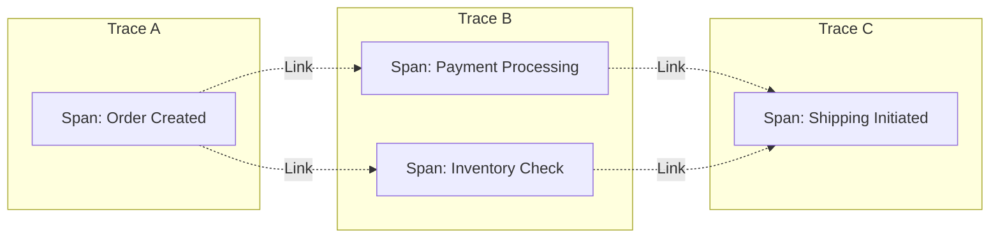
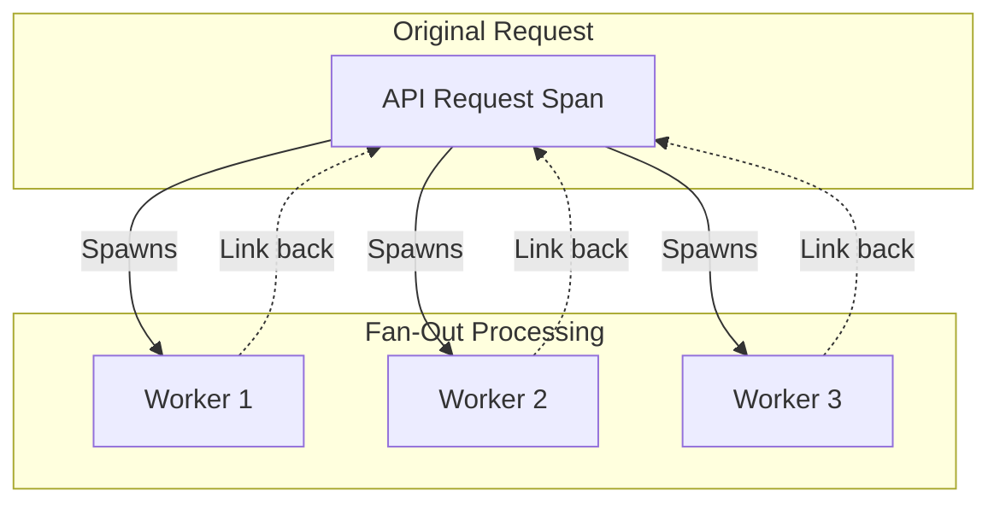
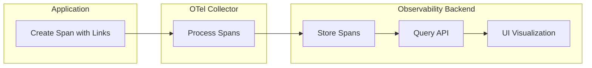

# How to Fix "Span Link Missing" Issues

Author: [nawazdhandala](https://www.github.com/nawazdhandala)

Tags: OpenTelemetry, Distributed Tracing, Span Links, Debugging, Observability

Description: Learn how to diagnose and fix span link missing issues in OpenTelemetry, ensuring proper correlation between related traces.

---

Span links in OpenTelemetry allow you to connect related spans that are not in a parent-child relationship. When these links go missing, you lose valuable context about how different parts of your system interact. This guide will help you diagnose and fix span link missing issues.

## Understanding Span Links

Span links create associations between spans across different traces or within the same trace. Unlike parent-child relationships, links represent causal relationships that do not imply a direct call hierarchy.



## Common Causes of Missing Span Links

### 1. Incorrect Link Context Extraction

The most common cause is failing to properly extract and propagate the span context when creating links.

```python
# Incorrect: Missing context extraction
from opentelemetry import trace

tracer = trace.get_tracer(__name__)

def process_message(message):
    # This creates a span without links
    with tracer.start_as_current_span("process_message") as span:
        # Missing: Link to the original producer span
        handle_message(message)
```

```python
# Correct: Properly extracting context and creating links
from opentelemetry import trace
from opentelemetry.trace import Link, SpanContext, TraceFlags

tracer = trace.get_tracer(__name__)

def process_message(message):
    # Extract the span context from the message headers
    # This assumes trace context was propagated via message headers
    trace_id = int(message.headers.get("traceparent-trace-id"), 16)
    span_id = int(message.headers.get("traceparent-span-id"), 16)

    # Create a SpanContext from the extracted values
    linked_context = SpanContext(
        trace_id=trace_id,
        span_id=span_id,
        is_remote=True,
        trace_flags=TraceFlags(0x01)  # Sampled flag
    )

    # Create the span with a link to the producer span
    link = Link(context=linked_context, attributes={"link.type": "producer"})

    with tracer.start_as_current_span(
        "process_message",
        links=[link]  # Pass the link when creating the span
    ) as span:
        handle_message(message)
```

### 2. Links Not Passed During Span Creation

Span links must be provided when the span is created. They cannot be added after the span has started.

```python
# Incorrect: Trying to add links after span creation
with tracer.start_as_current_span("my_span") as span:
    # This will not work - links cannot be added after creation
    # span.add_link(link)  # No such method exists
    pass
```

```python
# Correct: Pass links during span creation
links = [
    Link(context=context1, attributes={"source": "service-a"}),
    Link(context=context2, attributes={"source": "service-b"})
]

# Links must be provided in start_as_current_span or start_span
with tracer.start_as_current_span("my_span", links=links) as span:
    # Process with proper links established
    pass
```

### 3. Invalid Span Context in Links

Links with invalid span contexts will be silently dropped by most SDKs.

```python
from opentelemetry.trace import SpanContext, TraceFlags, INVALID_SPAN_CONTEXT

def create_link_safely(trace_id_hex, span_id_hex):
    """Create a span link with validation."""
    try:
        trace_id = int(trace_id_hex, 16)
        span_id = int(span_id_hex, 16)

        # Validate that IDs are not zero (invalid)
        if trace_id == 0 or span_id == 0:
            print("Warning: Invalid trace or span ID, skipping link")
            return None

        context = SpanContext(
            trace_id=trace_id,
            span_id=span_id,
            is_remote=True,
            trace_flags=TraceFlags(0x01)
        )

        # Check if the context is valid before creating the link
        if context == INVALID_SPAN_CONTEXT:
            print("Warning: Invalid span context, skipping link")
            return None

        return Link(context=context)

    except (ValueError, TypeError) as e:
        print(f"Error creating link: {e}")
        return None

# Usage with validation
link = create_link_safely(message.trace_id, message.span_id)
links = [link] if link is not None else []

with tracer.start_as_current_span("process", links=links) as span:
    # Process with validated links
    pass
```

## Debugging Missing Span Links

### Step 1: Enable Debug Logging

Enable debug logging to see what is happening with your spans and links.

```python
import logging

# Enable OpenTelemetry debug logging
logging.basicConfig(level=logging.DEBUG)
logging.getLogger("opentelemetry").setLevel(logging.DEBUG)
```

### Step 2: Use a Console Exporter for Testing

```python
from opentelemetry import trace
from opentelemetry.sdk.trace import TracerProvider
from opentelemetry.sdk.trace.export import (
    ConsoleSpanExporter,
    SimpleSpanProcessor
)

# Set up the tracer provider with console export
provider = TracerProvider()
processor = SimpleSpanProcessor(ConsoleSpanExporter())
provider.add_span_processor(processor)
trace.set_tracer_provider(provider)

# Now spans with links will be printed to console
tracer = trace.get_tracer(__name__)
```

### Step 3: Verify Link Data in Exported Spans

When inspecting exported spans, look for the links field.

```json
{
  "name": "process_message",
  "context": {
    "trace_id": "0x5b8aa5a2d2c872e8321cf37308d69df2",
    "span_id": "0x051581bf3cb55c13"
  },
  "links": [
    {
      "context": {
        "trace_id": "0x7a8bb6b3e3d983f9432dg48419e7ae03",
        "span_id": "0x162692cg4dc66d24"
      },
      "attributes": {
        "link.type": "producer"
      }
    }
  ]
}
```

## Common Scenarios and Solutions

### Batch Processing with Multiple Input Sources

When processing a batch from multiple sources, link to all original spans.

```python
from opentelemetry import trace
from opentelemetry.trace import Link

tracer = trace.get_tracer(__name__)

def process_batch(messages):
    """Process a batch of messages, linking to all producers."""
    links = []

    # Create links to all message producers
    for message in messages:
        if message.span_context:
            link = Link(
                context=message.span_context,
                attributes={
                    "message.id": message.id,
                    "message.source": message.source
                }
            )
            links.append(link)

    # Create a single span with links to all input messages
    with tracer.start_as_current_span(
        "process_batch",
        links=links,
        attributes={"batch.size": len(messages)}
    ) as span:
        results = []
        for message in messages:
            result = process_single_message(message)
            results.append(result)
        return results
```

### Fan-Out Pattern

When one request triggers multiple downstream operations.



```python
from opentelemetry import trace
from opentelemetry.trace import Link
import concurrent.futures

tracer = trace.get_tracer(__name__)

def distribute_work(request):
    """Distribute work to multiple workers with span links."""
    with tracer.start_as_current_span("distribute_work") as parent_span:
        # Get the current span context to link from workers
        parent_context = parent_span.get_span_context()

        # Create tasks with the parent context for linking
        tasks = [
            {"data": chunk, "parent_context": parent_context}
            for chunk in split_data(request.data)
        ]

        with concurrent.futures.ThreadPoolExecutor() as executor:
            futures = [
                executor.submit(worker_process, task)
                for task in tasks
            ]
            return [f.result() for f in futures]

def worker_process(task):
    """Worker that links back to the parent span."""
    # Create a link to the parent span that distributed this work
    link = Link(
        context=task["parent_context"],
        attributes={"link.relationship": "fan-out"}
    )

    with tracer.start_as_current_span(
        "worker_process",
        links=[link]
    ) as span:
        return process_data(task["data"])
```

### Retry Scenarios

When retrying operations, link to the original attempt.

```python
from opentelemetry import trace
from opentelemetry.trace import Link
import time

tracer = trace.get_tracer(__name__)

def execute_with_retry(operation, max_retries=3):
    """Execute an operation with retry, linking retry spans to originals."""
    previous_span_context = None

    for attempt in range(max_retries):
        links = []

        # Link to the previous attempt if this is a retry
        if previous_span_context is not None:
            links.append(Link(
                context=previous_span_context,
                attributes={
                    "retry.previous_attempt": attempt - 1,
                    "retry.reason": "previous_failure"
                }
            ))

        with tracer.start_as_current_span(
            f"operation_attempt",
            links=links,
            attributes={"retry.attempt": attempt}
        ) as span:
            # Store this span's context for potential next retry
            previous_span_context = span.get_span_context()

            try:
                result = operation()
                span.set_attribute("retry.success", True)
                return result
            except Exception as e:
                span.set_attribute("retry.success", False)
                span.set_attribute("retry.error", str(e))

                if attempt == max_retries - 1:
                    raise

                time.sleep(2 ** attempt)  # Exponential backoff
```

## Collector Configuration for Span Links

Ensure your OpenTelemetry Collector is properly configured to handle span links.

```yaml
# otel-collector-config.yaml
receivers:
  otlp:
    protocols:
      grpc:
        endpoint: 0.0.0.0:4317
      http:
        endpoint: 0.0.0.0:4318

processors:
  batch:
    # Ensure batch size accommodates spans with multiple links
    send_batch_size: 512
    timeout: 5s

exporters:
  # Export to your backend (e.g., Jaeger, Zipkin, or OneUptime)
  otlp:
    endpoint: "your-backend:4317"
    tls:
      insecure: false

service:
  pipelines:
    traces:
      receivers: [otlp]
      processors: [batch]
      exporters: [otlp]
```

## Verifying Span Links in Your Backend

Different backends display span links differently. Here is what to look for.



### Querying for Spans with Links

Most backends support querying for spans that have links.

```bash
# Example: Query spans with links using a backend API
curl -X GET "https://your-backend/api/traces?hasLinks=true" \
  -H "Authorization: Bearer $API_TOKEN"
```

## Best Practices for Span Links

1. **Always validate span contexts** before creating links to avoid silent failures.

2. **Add meaningful attributes** to links to explain the relationship.

3. **Use links for causal relationships** that are not parent-child, such as batch processing, fan-out patterns, and retry operations.

4. **Test link propagation** using console exporters during development.

5. **Document your linking strategy** so team members understand when and why links are created.

## Conclusion

Span links are a powerful feature in OpenTelemetry that help you understand complex relationships between traces. By following the patterns in this guide, you can ensure your span links are properly created, propagated, and visible in your observability backend. Remember to validate span contexts, pass links during span creation, and use meaningful attributes to make your traces more valuable for debugging and analysis.
