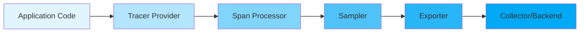
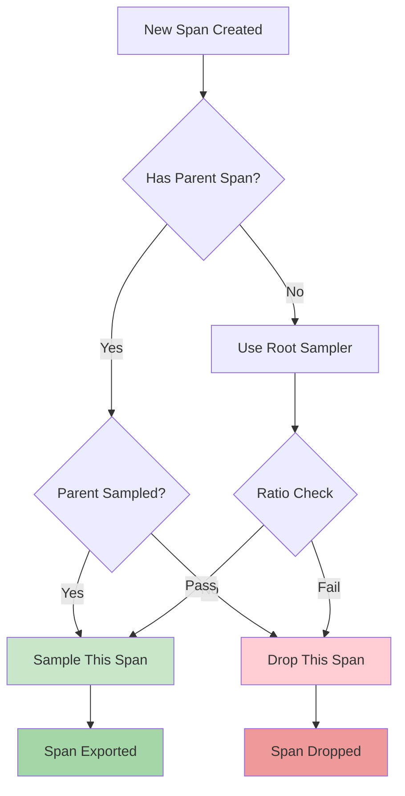
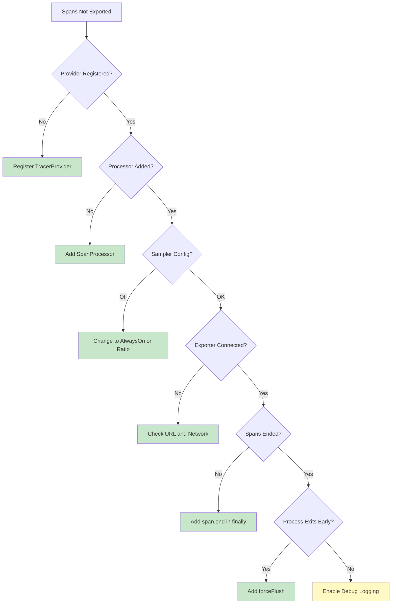

# How to Fix 'Span Not Exported' Issues

Author: [nawazdhandala](https://www.github.com/nawazdhandala)

Tags: OpenTelemetry, Tracing, Debugging, Observability, Spans

Description: Learn how to diagnose and fix common 'span not exported' issues in OpenTelemetry, including configuration problems, sampling issues, and exporter errors.

---

One of the most frustrating issues when working with OpenTelemetry is when your spans are not being exported to your observability backend. You have instrumented your application, configured your exporters, but nothing shows up in your traces. This guide will help you diagnose and fix these "span not exported" issues systematically.

## Understanding the Span Export Pipeline

Before diving into solutions, it is important to understand how spans flow through the OpenTelemetry pipeline.



Each stage in this pipeline can potentially cause spans to be lost. Let us examine each one.

## Common Causes and Solutions

### 1. Tracer Provider Not Registered

The most common cause of missing spans is forgetting to register the TracerProvider globally.

```javascript
// WRONG: Creating a tracer without registering the provider
// This tracer will use the no-op implementation and spans will be lost
const { trace } = require('@opentelemetry/api');
const tracer = trace.getTracer('my-service'); // Uses no-op tracer!

// CORRECT: Register the provider before getting a tracer
const { NodeTracerProvider } = require('@opentelemetry/sdk-trace-node');
const { trace } = require('@opentelemetry/api');

// Create and configure the provider
const provider = new NodeTracerProvider();

// Register the provider globally - this is the critical step
provider.register();

// Now get a tracer - this will use the registered provider
const tracer = trace.getTracer('my-service');
```

### 2. Missing or Misconfigured Span Processor

Spans need a processor to batch and send them to the exporter. Without a span processor, spans are created but never exported.

```javascript
const { NodeTracerProvider } = require('@opentelemetry/sdk-trace-node');
const { SimpleSpanProcessor, BatchSpanProcessor } = require('@opentelemetry/sdk-trace-base');
const { OTLPTraceExporter } = require('@opentelemetry/exporter-trace-otlp-http');

const provider = new NodeTracerProvider();

// Create an exporter that sends spans to your collector
const exporter = new OTLPTraceExporter({
  url: 'http://localhost:4318/v1/traces'  // OTLP HTTP endpoint
});

// Option 1: SimpleSpanProcessor - exports spans immediately (good for development)
// Use this when you need to see spans right away, but it has performance overhead
provider.addSpanProcessor(new SimpleSpanProcessor(exporter));

// Option 2: BatchSpanProcessor - batches spans before export (recommended for production)
// This is more efficient but spans may be delayed slightly
provider.addSpanProcessor(new BatchSpanProcessor(exporter, {
  maxQueueSize: 2048,           // Maximum spans to queue before dropping
  maxExportBatchSize: 512,      // Maximum spans per export batch
  scheduledDelayMillis: 5000,   // Time to wait before exporting a batch
  exportTimeoutMillis: 30000    // Timeout for export operations
}));

provider.register();
```

### 3. Sampling Configuration Issues

If your sampler is configured to drop spans, they will never be exported. Check your sampling configuration.

```javascript
const { NodeTracerProvider } = require('@opentelemetry/sdk-trace-node');
const {
  AlwaysOnSampler,
  AlwaysOffSampler,
  TraceIdRatioBasedSampler,
  ParentBasedSampler
} = require('@opentelemetry/sdk-trace-base');

// PROBLEM: AlwaysOffSampler drops ALL spans
// This is useful for testing but will cause "span not exported" in production
const badProvider = new NodeTracerProvider({
  sampler: new AlwaysOffSampler()  // Never exports anything!
});

// SOLUTION 1: Use AlwaysOnSampler for development/debugging
const debugProvider = new NodeTracerProvider({
  sampler: new AlwaysOnSampler()  // Exports every span
});

// SOLUTION 2: Use ratio-based sampling for production
// This samples 10% of traces while keeping complete trace integrity
const productionProvider = new NodeTracerProvider({
  sampler: new ParentBasedSampler({
    root: new TraceIdRatioBasedSampler(0.1)  // 10% sampling rate
  })
});
```

The sampling decision flow looks like this:



### 4. Exporter Connection Issues

Your exporter might be failing to connect to the collector or backend.

```javascript
const { OTLPTraceExporter } = require('@opentelemetry/exporter-trace-otlp-http');
const { diag, DiagConsoleLogger, DiagLogLevel } = require('@opentelemetry/api');

// Enable diagnostic logging to see exporter errors
// This will print detailed information about what's happening
diag.setLogger(new DiagConsoleLogger(), DiagLogLevel.DEBUG);

// Configure the exporter with proper error handling
const exporter = new OTLPTraceExporter({
  url: 'http://localhost:4318/v1/traces',
  headers: {
    // Add authentication if required by your collector
    'Authorization': 'Bearer your-token-here'
  },
  // Set reasonable timeouts
  timeoutMillis: 10000
});

// Test the exporter connection manually
async function testExporter() {
  try {
    // Create a test span to verify export works
    const testSpan = {
      traceId: '1234567890abcdef1234567890abcdef',
      spanId: '1234567890abcdef',
      name: 'test-span',
      kind: 0,
      startTime: [Date.now(), 0],
      endTime: [Date.now() + 100, 0],
      status: { code: 0 },
      attributes: {},
      events: [],
      links: []
    };

    await exporter.export([testSpan], (result) => {
      if (result.code === 0) {
        console.log('Export successful!');
      } else {
        console.error('Export failed:', result.error);
      }
    });
  } catch (error) {
    console.error('Exporter test failed:', error);
  }
}
```

### 5. Spans Not Being Ended

Spans must be explicitly ended before they can be exported. Unended spans remain in memory and are never sent.

```javascript
const { trace } = require('@opentelemetry/api');

const tracer = trace.getTracer('my-service');

// WRONG: Span never ended - will not be exported
function processRequestBad(data) {
  const span = tracer.startSpan('process-request');
  // Do some work...
  return result;  // Span is never ended!
}

// CORRECT: Always end spans, even on errors
function processRequestGood(data) {
  const span = tracer.startSpan('process-request');
  try {
    // Do some work...
    span.setStatus({ code: 0 });  // Mark as successful
    return result;
  } catch (error) {
    // Record the error in the span
    span.recordException(error);
    span.setStatus({ code: 2, message: error.message });
    throw error;
  } finally {
    // ALWAYS end the span in finally block
    span.end();
  }
}

// BEST: Use the startActiveSpan helper for automatic span management
async function processRequestBest(data) {
  return tracer.startActiveSpan('process-request', async (span) => {
    try {
      // Do some work...
      span.setStatus({ code: 0 });
      return result;
    } catch (error) {
      span.recordException(error);
      span.setStatus({ code: 2, message: error.message });
      throw error;
    } finally {
      span.end();  // Still need to end, but context is managed automatically
    }
  });
}
```

### 6. Application Exits Before Export Completes

In short-lived applications like serverless functions, the process might exit before the batch processor exports spans.

```javascript
const { NodeTracerProvider } = require('@opentelemetry/sdk-trace-node');
const { BatchSpanProcessor } = require('@opentelemetry/sdk-trace-base');
const { OTLPTraceExporter } = require('@opentelemetry/exporter-trace-otlp-http');

const provider = new NodeTracerProvider();
const exporter = new OTLPTraceExporter();
const processor = new BatchSpanProcessor(exporter);

provider.addSpanProcessor(processor);
provider.register();

// For serverless or short-lived processes, force flush before exit
async function shutdown() {
  // Force flush ensures all pending spans are exported
  await provider.forceFlush();

  // Then shut down gracefully
  await provider.shutdown();

  console.log('All spans exported, shutting down');
}

// Handle various shutdown signals
process.on('SIGTERM', shutdown);
process.on('SIGINT', shutdown);

// For AWS Lambda or similar
exports.handler = async (event) => {
  try {
    // Process the event...
    return result;
  } finally {
    // Flush spans before Lambda freezes the container
    await provider.forceFlush();
  }
};
```

## Debugging Checklist

Use this checklist to systematically diagnose span export issues:



## Complete Working Example

Here is a complete, working setup that handles all the common pitfalls:

```javascript
// tracing.js - Complete OpenTelemetry setup with proper error handling

const { NodeTracerProvider } = require('@opentelemetry/sdk-trace-node');
const { BatchSpanProcessor } = require('@opentelemetry/sdk-trace-base');
const { OTLPTraceExporter } = require('@opentelemetry/exporter-trace-otlp-http');
const { Resource } = require('@opentelemetry/resources');
const { SemanticResourceAttributes } = require('@opentelemetry/semantic-conventions');
const { diag, DiagConsoleLogger, DiagLogLevel, trace } = require('@opentelemetry/api');
const { ParentBasedSampler, TraceIdRatioBasedSampler } = require('@opentelemetry/sdk-trace-base');

// Step 1: Enable diagnostic logging for debugging
// Set to DEBUG during troubleshooting, INFO or WARN for production
diag.setLogger(new DiagConsoleLogger(), DiagLogLevel.INFO);

// Step 2: Create a resource that identifies your service
const resource = new Resource({
  [SemanticResourceAttributes.SERVICE_NAME]: 'my-service',
  [SemanticResourceAttributes.SERVICE_VERSION]: '1.0.0',
  [SemanticResourceAttributes.DEPLOYMENT_ENVIRONMENT]: process.env.NODE_ENV || 'development'
});

// Step 3: Configure the sampler based on environment
const sampler = process.env.NODE_ENV === 'production'
  ? new ParentBasedSampler({ root: new TraceIdRatioBasedSampler(0.1) })  // 10% in production
  : new ParentBasedSampler({ root: new TraceIdRatioBasedSampler(1.0) }); // 100% in development

// Step 4: Create the tracer provider with resource and sampler
const provider = new NodeTracerProvider({
  resource,
  sampler
});

// Step 5: Configure the exporter with proper endpoint
const exporter = new OTLPTraceExporter({
  url: process.env.OTEL_EXPORTER_OTLP_ENDPOINT || 'http://localhost:4318/v1/traces',
  headers: process.env.OTEL_EXPORTER_OTLP_HEADERS
    ? JSON.parse(process.env.OTEL_EXPORTER_OTLP_HEADERS)
    : {}
});

// Step 6: Add a batch processor with sensible defaults
const processor = new BatchSpanProcessor(exporter, {
  maxQueueSize: 2048,
  maxExportBatchSize: 512,
  scheduledDelayMillis: 5000,
  exportTimeoutMillis: 30000
});

provider.addSpanProcessor(processor);

// Step 7: Register the provider globally
provider.register();

// Step 8: Set up graceful shutdown
async function shutdown() {
  console.log('Shutting down tracing...');
  try {
    await provider.forceFlush();
    await provider.shutdown();
    console.log('Tracing shut down successfully');
  } catch (error) {
    console.error('Error during tracing shutdown:', error);
  }
}

process.on('SIGTERM', shutdown);
process.on('SIGINT', shutdown);

// Step 9: Export a configured tracer for use in your application
const tracer = trace.getTracer('my-service', '1.0.0');

module.exports = { tracer, shutdown };
```

## Summary

When spans are not being exported, systematically check each stage of the pipeline: provider registration, span processor configuration, sampling settings, exporter connectivity, span lifecycle management, and shutdown handling. Enable diagnostic logging early in your troubleshooting process to get visibility into what is happening internally. With proper configuration and error handling, you can ensure reliable span export in any environment.

**Related Reading:**

- [How to name spans in OpenTelemetry](https://oneuptime.com/blog/post/2024-11-04-how-to-name-spans-in-opentelemetry/view)
- [What are Traces and Spans in OpenTelemetry](https://oneuptime.com/blog/post/2025-08-27-traces-and-spans-in-opentelemetry/view)
- [How to Configure OpenTelemetry Processors](https://oneuptime.com/blog/post/2026-01-24-configure-opentelemetry-processors/view)
