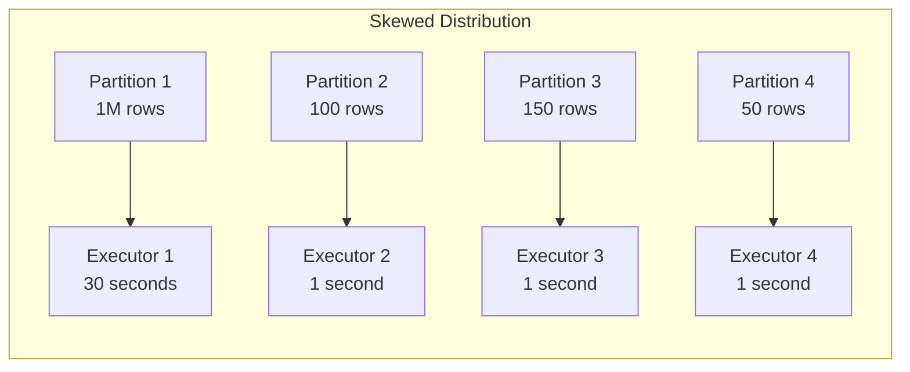
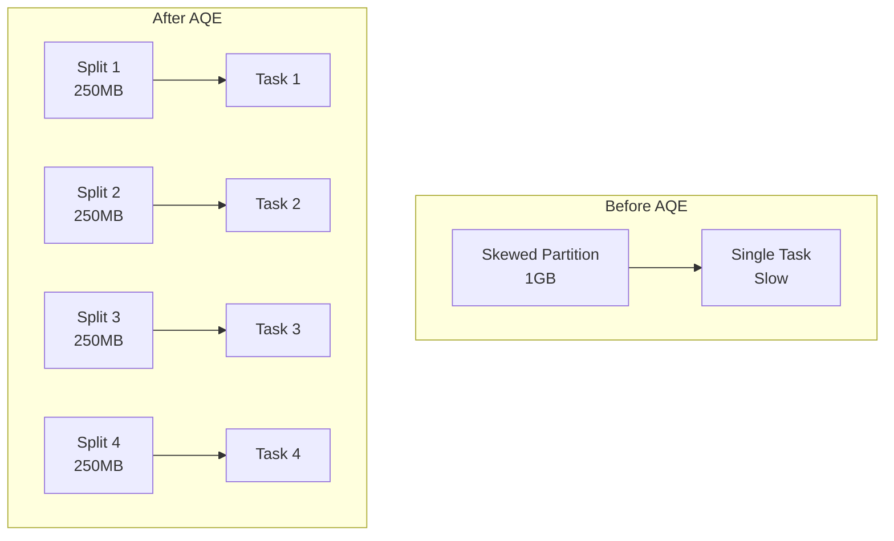

# How to Fix "Data Skew" Issues in Spark

Author: [nawazdhandala](https://www.github.com/nawazdhandala)

Tags: Apache Spark, Data Engineering, Big Data, Performance Tuning, Distributed Systems, PySpark

Description: Learn how to identify and fix data skew issues in Apache Spark that cause slow jobs, out-of-memory errors, and unbalanced partition processing.

---

> Data skew is one of the most common performance killers in Spark applications. When a few partitions contain significantly more data than others, your entire job slows down to the speed of the slowest task.

Data skew occurs when data is unevenly distributed across partitions, causing some tasks to process much more data than others. This guide covers practical techniques to identify and resolve skew in your Spark applications.

---

## Understanding Data Skew

In a distributed system like Spark, data is split into partitions that get processed in parallel. When one partition has significantly more data than others, that single task becomes a bottleneck.



The job cannot complete until all tasks finish, so even though three executors finish quickly, the entire stage waits for the skewed partition.

---

## Identifying Data Skew

Before fixing skew, you need to confirm it exists. Here are several methods to detect skewed data.

### Check the Spark UI

The Spark UI shows task duration distribution. Look for tasks that take significantly longer than others in the same stage.

```python
# Check partition sizes programmatically
from pyspark.sql import SparkSession
from pyspark.sql.functions import spark_partition_id, count

spark = SparkSession.builder.appName("SkewAnalysis").getOrCreate()

# Load your dataset
df = spark.read.parquet("/data/transactions")

# Analyze partition distribution
partition_counts = df.groupBy(spark_partition_id().alias("partition_id")) \
    .agg(count("*").alias("row_count")) \
    .orderBy("row_count", ascending=False)

partition_counts.show(20)

# Calculate skew ratio
stats = partition_counts.select("row_count").summary("min", "max", "mean")
stats.show()
```

### Analyze Key Distribution

If you suspect skew on a specific column used in joins or groupBy operations, analyze its distribution.

```python
from pyspark.sql.functions import col, count, desc

# Check distribution of join key
df.groupBy("customer_id") \
    .agg(count("*").alias("frequency")) \
    .orderBy(desc("frequency")) \
    .show(20)

# Find top N most frequent keys
top_keys = df.groupBy("customer_id") \
    .count() \
    .orderBy(desc("count")) \
    .limit(10) \
    .collect()

print("Top skewed keys:")
for row in top_keys:
    print(f"  {row['customer_id']}: {row['count']} records")
```

---

## Solution 1: Salting Technique

Salting adds a random prefix to skewed keys, distributing them across multiple partitions. After processing, you remove the salt and aggregate results.

```python
from pyspark.sql.functions import (
    col, concat, lit, floor, rand,
    sum as spark_sum, count
)

# Define number of salt buckets
SALT_BUCKETS = 10

# Original skewed join
# skewed_df.join(lookup_df, "customer_id")  # This would be slow

# Step 1: Add salt to the skewed dataframe
salted_df = skewed_df.withColumn(
    "salt",
    floor(rand() * SALT_BUCKETS).cast("int")
).withColumn(
    "salted_key",
    concat(col("customer_id"), lit("_"), col("salt"))
)

# Step 2: Explode the lookup table to match all salt values
from pyspark.sql.functions import explode, array

# Create array of salt values
salt_array = array([lit(i) for i in range(SALT_BUCKETS)])

lookup_exploded = lookup_df.withColumn(
    "salt",
    explode(salt_array)
).withColumn(
    "salted_key",
    concat(col("customer_id"), lit("_"), col("salt"))
)

# Step 3: Join on salted key (now distributed evenly)
result = salted_df.join(
    lookup_exploded,
    "salted_key",
    "left"
).drop("salt", "salted_key")
```

---

## Solution 2: Broadcast Join for Small Tables

When joining a large skewed table with a smaller table, broadcasting the smaller table eliminates shuffle entirely.

```python
from pyspark.sql.functions import broadcast

# Check if lookup table is small enough to broadcast
lookup_size_mb = spark.sparkContext._jvm.org.apache.spark.util.SizeEstimator.estimate(
    lookup_df._jdf
) / (1024 * 1024)

print(f"Lookup table size: {lookup_size_mb:.2f} MB")

# Broadcast join - no shuffle, no skew issues
result = large_skewed_df.join(
    broadcast(lookup_df),
    "customer_id",
    "left"
)

# Configure broadcast threshold (default is 10MB)
spark.conf.set("spark.sql.autoBroadcastJoinThreshold", "100MB")
```

---

## Solution 3: Adaptive Query Execution (AQE)

Spark 3.0+ includes Adaptive Query Execution that automatically handles skew in shuffle partitions.

```python
# Enable AQE and skew join optimization
spark.conf.set("spark.sql.adaptive.enabled", "true")
spark.conf.set("spark.sql.adaptive.skewJoin.enabled", "true")

# Configure skew detection thresholds
# A partition is skewed if it's larger than this factor times the median
spark.conf.set("spark.sql.adaptive.skewJoin.skewedPartitionFactor", "5")

# Minimum size for a partition to be considered skewed
spark.conf.set("spark.sql.adaptive.skewJoin.skewedPartitionThresholdInBytes", "256MB")

# AQE will automatically split skewed partitions during joins
result = skewed_df.join(other_df, "join_key")
```

AQE works by:
1. Collecting runtime statistics during shuffle
2. Identifying partitions significantly larger than median
3. Splitting skewed partitions into smaller pieces
4. Replicating the non-skewed side to match



---

## Solution 4: Isolate and Handle Skewed Keys

For extreme skew where a few keys dominate, separate processing for those keys can be effective.

```python
from pyspark.sql.functions import col, when, lit

# Identify highly skewed keys
skewed_keys = df.groupBy("customer_id") \
    .count() \
    .filter(col("count") > 1000000) \
    .select("customer_id") \
    .collect()

skewed_key_list = [row["customer_id"] for row in skewed_keys]

# Separate skewed and non-skewed data
df_skewed = df.filter(col("customer_id").isin(skewed_key_list))
df_normal = df.filter(~col("customer_id").isin(skewed_key_list))

# Process non-skewed data normally
result_normal = df_normal.join(lookup_df, "customer_id")

# Process skewed data with broadcast
# This works because we isolated few keys with many records
result_skewed = df_skewed.join(
    broadcast(lookup_df.filter(col("customer_id").isin(skewed_key_list))),
    "customer_id"
)

# Union results
final_result = result_normal.union(result_skewed)
```

---

## Solution 5: Custom Partitioning

When the default hash partitioner causes skew, implement custom partitioning logic.

```python
from pyspark.sql.functions import col, hash as spark_hash, abs as spark_abs

# Repartition with a custom expression to spread skewed keys
# Add secondary key to distribute hot keys
df_repartitioned = df.repartition(
    200,
    col("customer_id"),
    col("transaction_date")  # Secondary partitioning key
)

# Or use a hash with modulo for more control
df_custom = df.withColumn(
    "partition_key",
    spark_abs(spark_hash(col("customer_id"), col("transaction_id"))) % 200
).repartition(200, col("partition_key"))

# For groupBy operations, use partial aggregation
result = df.groupBy("customer_id") \
    .agg(
        spark_sum("amount").alias("total_amount"),
        count("*").alias("transaction_count")
    ) \
    .repartition(100)  # Redistribute after aggregation
```

---

## Solution 6: Handling NULL Values

NULL values often cause unexpected skew since they all hash to the same partition.

```python
from pyspark.sql.functions import col, coalesce, monotonically_increasing_id

# Check for NULL concentration
null_count = df.filter(col("join_key").isNull()).count()
total_count = df.count()
print(f"NULL percentage: {null_count / total_count * 100:.2f}%")

# Option 1: Replace NULLs with unique values
df_no_nulls = df.withColumn(
    "join_key_safe",
    coalesce(
        col("join_key"),
        concat(lit("NULL_"), monotonically_increasing_id())
    )
)

# Option 2: Separate NULL handling
df_with_keys = df.filter(col("join_key").isNotNull())
df_nulls = df.filter(col("join_key").isNull())

# Process separately and union
result_with_keys = df_with_keys.join(lookup_df, "join_key")
result_nulls = df_nulls.crossJoin(
    lookup_df.filter(col("join_key").isNull())
)

final_result = result_with_keys.union(result_nulls)
```

---

## Monitoring and Prevention

Set up monitoring to catch skew early in your data pipelines.

```python
def analyze_skew(df, partition_col=None, threshold_ratio=10):
    """
    Analyze a DataFrame for potential data skew.
    Returns metrics and warnings about skewed distributions.
    """
    from pyspark.sql.functions import spark_partition_id, count, col

    # Analyze partition distribution
    partition_stats = df.groupBy(spark_partition_id().alias("pid")) \
        .agg(count("*").alias("cnt")) \
        .agg(
            {"cnt": "min", "cnt": "max", "cnt": "avg"}
        ).collect()[0]

    min_size = partition_stats["min(cnt)"]
    max_size = partition_stats["max(cnt)"]
    avg_size = partition_stats["avg(cnt)"]

    skew_ratio = max_size / avg_size if avg_size > 0 else 0

    report = {
        "min_partition_size": min_size,
        "max_partition_size": max_size,
        "avg_partition_size": avg_size,
        "skew_ratio": skew_ratio,
        "is_skewed": skew_ratio > threshold_ratio
    }

    if report["is_skewed"]:
        print(f"WARNING: Data skew detected! Ratio: {skew_ratio:.2f}x")
        print(f"  Max partition: {max_size:,} rows")
        print(f"  Average partition: {avg_size:,.0f} rows")

    return report

# Use in your pipeline
skew_report = analyze_skew(transactions_df, threshold_ratio=5)
```

---

## Best Practices

1. **Enable AQE by default** - It handles many skew scenarios automatically
2. **Profile your data** - Understand key distributions before writing joins
3. **Use broadcast joins** - When one side fits in memory, avoid shuffle entirely
4. **Monitor partition sizes** - Add skew detection to your pipeline monitoring
5. **Handle NULLs explicitly** - They often cause unexpected skew
6. **Consider salting for extreme cases** - When keys have millions of duplicates
7. **Test with production data** - Skew often only appears at scale

---

*Need to monitor your Spark jobs for performance issues like data skew? [OneUptime](https://oneuptime.com) provides real-time observability for data pipelines with automatic anomaly detection.*

**Related Reading:**
- [How to Configure Delta Lake Tables](https://oneuptime.com/blog/post/2026-01-24-delta-lake-tables/view)
- [How to Fix "Executor Memory" Spark Errors](https://oneuptime.com/blog/post/2026-01-24-spark-executor-memory/view)
