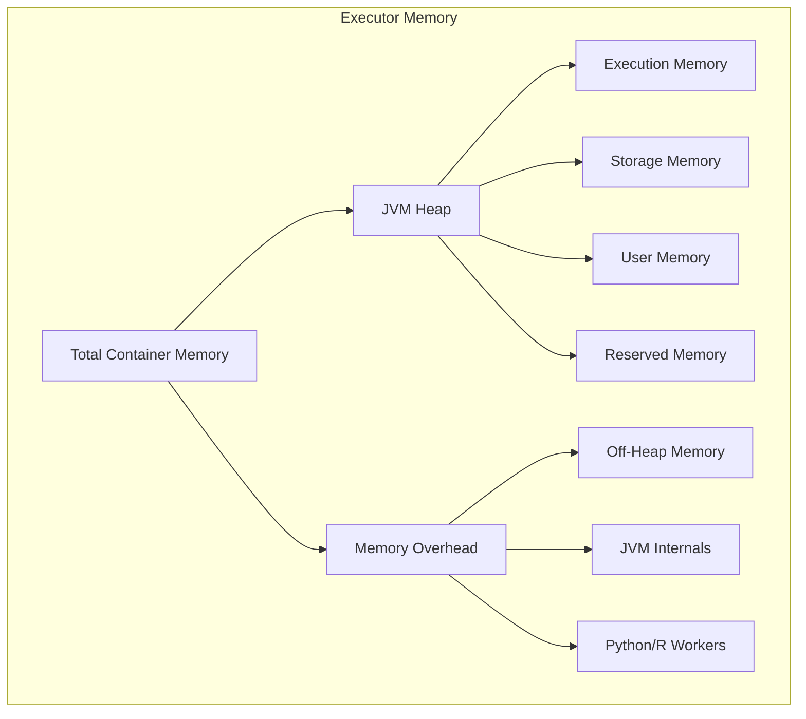

# How to Fix "Executor Memory" Spark Errors

Author: [nawazdhandala](https://www.github.com/nawazdhandala)

Tags: Apache Spark, Memory Management, Performance Tuning, Big Data, PySpark, Out of Memory, JVM

Description: Learn how to diagnose and fix executor memory errors in Apache Spark including OutOfMemoryError, container killed by YARN, and memory overhead issues.

---

> Few errors are more frustrating than "Container killed by YARN for exceeding memory limits" or "java.lang.OutOfMemoryError: Java heap space" in the middle of a long-running Spark job. Understanding Spark's memory model is key to fixing these issues.

This guide explains Spark's memory architecture and provides practical solutions for common memory errors.

---

## Understanding Spark Memory Architecture

Each Spark executor divides its memory into several regions for different purposes.



Key memory regions:
- **Execution Memory**: Shuffles, joins, sorts, aggregations
- **Storage Memory**: Cached data, broadcast variables
- **User Memory**: User data structures, UDF overhead
- **Memory Overhead**: Off-heap, JVM internals, PySpark processes

---

## Common Memory Errors and Solutions

### Error 1: Container Killed by YARN

```
Container killed by YARN for exceeding memory limits.
12.5 GB of 12 GB physical memory used.
```

This error means the total container memory (heap + overhead) exceeded the limit.

```python
# Solution: Increase memory overhead
# Default overhead is max(384MB, 0.1 * executor memory)

spark.conf.set("spark.executor.memory", "10g")
spark.conf.set("spark.executor.memoryOverhead", "2g")  # Explicit 2GB overhead

# For PySpark with heavy Python processing, increase further
spark.conf.set("spark.executor.memoryOverhead", "4g")

# Alternative: Calculate dynamically
executor_memory_gb = 10
overhead_gb = max(2, int(executor_memory_gb * 0.2))  # 20% overhead
spark.conf.set("spark.executor.memoryOverhead", f"{overhead_gb}g")
```

### Error 2: Java Heap Space

```
java.lang.OutOfMemoryError: Java heap space
```

The JVM heap is exhausted. This often happens during shuffles or with large broadcast variables.

```python
# Solution 1: Increase executor memory
spark.conf.set("spark.executor.memory", "16g")

# Solution 2: Adjust memory fraction for execution
# Default is 0.6, meaning 60% of heap (after reserved) for execution+storage
spark.conf.set("spark.memory.fraction", "0.8")

# Solution 3: Reduce cached data if not needed
spark.conf.set("spark.memory.storageFraction", "0.3")  # Reduce storage portion

# Solution 4: Enable off-heap memory for large shuffles
spark.conf.set("spark.memory.offHeap.enabled", "true")
spark.conf.set("spark.memory.offHeap.size", "4g")
```

### Error 3: GC Overhead Limit Exceeded

```
java.lang.OutOfMemoryError: GC overhead limit exceeded
```

The JVM is spending too much time in garbage collection.

```python
# Solution 1: Increase heap size
spark.conf.set("spark.executor.memory", "20g")

# Solution 2: Tune garbage collector
spark.conf.set("spark.executor.extraJavaOptions",
    "-XX:+UseG1GC -XX:G1HeapRegionSize=16m -XX:InitiatingHeapOccupancyPercent=35")

# Solution 3: Reduce number of partitions to lower object count
df = df.coalesce(100)  # Fewer partitions = fewer objects

# Solution 4: Use more efficient data types
from pyspark.sql.types import IntegerType

# Convert string IDs to integers where possible
df = df.withColumn("id", df["id"].cast(IntegerType()))
```

---

## Memory Configuration Best Practices

### Calculating Executor Memory

Match your executor configuration to your cluster node size.

```python
# Example: Node has 64GB RAM, 16 cores
# Reserve 1 core and some memory for system processes

cores_per_node = 16
memory_per_node_gb = 64

# Leave 1 core for OS and Hadoop daemons
executor_cores = 5  # 3 executors per node with 5 cores each

# Leave ~10% memory for system
available_memory = memory_per_node_gb * 0.9
executors_per_node = (cores_per_node - 1) // executor_cores

memory_per_executor = available_memory / executors_per_node
overhead = max(0.384, memory_per_executor * 0.1)
heap_memory = memory_per_executor - overhead

print(f"Recommended configuration:")
print(f"  spark.executor.memory = {int(heap_memory)}g")
print(f"  spark.executor.memoryOverhead = {overhead:.1f}g")
print(f"  spark.executor.cores = {executor_cores}")
```

### Memory-Optimized Spark Session

```python
from pyspark.sql import SparkSession

def create_optimized_session(
    app_name: str,
    executor_memory: str = "16g",
    executor_cores: int = 5,
    num_executors: int = 10
) -> SparkSession:
    """
    Create a SparkSession with optimized memory configuration.
    """

    # Parse executor memory for overhead calculation
    memory_gb = int(executor_memory.rstrip("g"))
    overhead_gb = max(2, int(memory_gb * 0.15))

    spark = SparkSession.builder \
        .appName(app_name) \
        .config("spark.executor.memory", executor_memory) \
        .config("spark.executor.memoryOverhead", f"{overhead_gb}g") \
        .config("spark.executor.cores", executor_cores) \
        .config("spark.executor.instances", num_executors) \
        .config("spark.driver.memory", "8g") \
        .config("spark.driver.memoryOverhead", "2g") \
        .config("spark.memory.fraction", "0.8") \
        .config("spark.memory.storageFraction", "0.3") \
        .config("spark.sql.adaptive.enabled", "true") \
        .config("spark.sql.adaptive.coalescePartitions.enabled", "true") \
        .config("spark.serializer", "org.apache.spark.serializer.KryoSerializer") \
        .config("spark.kryoserializer.buffer.max", "1024m") \
        .getOrCreate()

    return spark

spark = create_optimized_session(
    app_name="memory_optimized_job",
    executor_memory="16g",
    executor_cores=5,
    num_executors=20
)
```

---

## Reducing Memory Usage

### Strategy 1: Optimize Data Types

Using appropriate data types significantly reduces memory footprint.

```python
from pyspark.sql.functions import col
from pyspark.sql.types import (
    IntegerType, ShortType, ByteType,
    FloatType, DateType
)

def optimize_dtypes(df):
    """
    Downcast columns to smallest appropriate data type.
    """
    for column in df.columns:
        dtype = df.schema[column].dataType.typeName()

        if dtype == "long":
            # Check if values fit in smaller type
            stats = df.select(
                col(column).cast("long").alias("val")
            ).agg({"val": "min", "val": "max"}).collect()[0]

            min_val, max_val = stats[0], stats[1]

            if min_val >= -128 and max_val <= 127:
                df = df.withColumn(column, col(column).cast(ByteType()))
            elif min_val >= -32768 and max_val <= 32767:
                df = df.withColumn(column, col(column).cast(ShortType()))
            elif min_val >= -2147483648 and max_val <= 2147483647:
                df = df.withColumn(column, col(column).cast(IntegerType()))

        elif dtype == "double":
            # Use float for less precision-critical columns
            df = df.withColumn(column, col(column).cast(FloatType()))

        elif dtype == "timestamp":
            # Use date if time component is not needed
            # df = df.withColumn(column, col(column).cast(DateType()))
            pass

    return df

# Apply optimization
df_optimized = optimize_dtypes(df)
```

### Strategy 2: Partition Management

Control partition sizes to manage memory consumption per task.

```python
from pyspark.sql.functions import spark_partition_id, count

def analyze_and_optimize_partitions(df, target_mb_per_partition=128):
    """
    Analyze partitions and repartition for optimal memory usage.
    """
    # Get current partition statistics
    partition_stats = df.groupBy(spark_partition_id().alias("pid")) \
        .agg(count("*").alias("cnt"))

    total_rows = df.count()
    current_partitions = df.rdd.getNumPartitions()

    # Estimate row size (rough calculation)
    sample_size = min(10000, total_rows)
    sample_bytes = df.limit(sample_size).toPandas().memory_usage(deep=True).sum()
    bytes_per_row = sample_bytes / sample_size

    # Calculate optimal partitions
    total_bytes = bytes_per_row * total_rows
    target_bytes = target_mb_per_partition * 1024 * 1024
    optimal_partitions = max(1, int(total_bytes / target_bytes))

    print(f"Current partitions: {current_partitions}")
    print(f"Estimated data size: {total_bytes / (1024**3):.2f} GB")
    print(f"Recommended partitions: {optimal_partitions}")

    # Repartition if needed
    if abs(current_partitions - optimal_partitions) > current_partitions * 0.2:
        if optimal_partitions < current_partitions:
            df = df.coalesce(optimal_partitions)
        else:
            df = df.repartition(optimal_partitions)

    return df

df = analyze_and_optimize_partitions(df, target_mb_per_partition=128)
```

### Strategy 3: Avoid Collecting Large Data to Driver

```python
# BAD: Collecting large dataset to driver
all_data = df.collect()  # OutOfMemoryError on driver!

# GOOD: Process in chunks or write to storage
df.write.parquet("/output/path")

# GOOD: Use take() for samples
sample = df.take(1000)

# GOOD: Use toPandas() only on aggregated/filtered data
summary = df.groupBy("category").count().toPandas()

# GOOD: Iterate through partitions if needed
def process_partition(partition):
    results = []
    for row in partition:
        results.append(process_row(row))
    return iter(results)

df.rdd.mapPartitions(process_partition).saveAsTextFile("/output")
```

---

## Handling Large Shuffles

Shuffles are the most memory-intensive operations. Optimize them to prevent OOM errors.

```python
# Increase shuffle partitions for large data
spark.conf.set("spark.sql.shuffle.partitions", "400")

# Enable external shuffle service to spill to disk
spark.conf.set("spark.shuffle.spill", "true")
spark.conf.set("spark.shuffle.spill.compress", "true")

# Compress shuffle data
spark.conf.set("spark.shuffle.compress", "true")
spark.conf.set("spark.io.compression.codec", "lz4")

# For very large shuffles, use sort-based shuffle
spark.conf.set("spark.shuffle.manager", "sort")
spark.conf.set("spark.shuffle.sort.bypassMergeThreshold", "200")
```

### Reducing Shuffle Size

```python
from pyspark.sql.functions import col, sum as spark_sum

# BAD: Shuffle entire dataset then aggregate
result = df.groupBy("customer_id").agg(spark_sum("amount"))

# BETTER: Filter before grouping to reduce shuffle
result = df.filter(col("amount") > 0) \
    .groupBy("customer_id") \
    .agg(spark_sum("amount"))

# BEST: Use partial aggregation with repartition
result = df \
    .repartition(200, "customer_id") \
    .groupBy("customer_id") \
    .agg(spark_sum("amount"))
```

---

## Monitoring Memory Usage

Track memory consumption during job execution.

```python
def log_memory_metrics(spark):
    """
    Log current memory metrics from all executors.
    """
    sc = spark.sparkContext

    # Get executor memory status
    status = sc.statusTracker()

    for executor_id in status.getExecutorInfos():
        print(f"Executor {executor_id.host()}:")
        print(f"  Total cores: {executor_id.totalCores()}")
        print(f"  Max memory: {executor_id.maxMemory() / (1024**3):.2f} GB")

# Enable detailed GC logging
spark.conf.set("spark.executor.extraJavaOptions",
    "-verbose:gc -XX:+PrintGCDetails -XX:+PrintGCTimeStamps")

# Access Spark UI metrics programmatically
def get_stage_memory_metrics(spark, stage_id):
    """
    Get memory metrics for a specific stage from the Spark UI REST API.
    """
    import requests

    ui_url = spark.sparkContext.uiWebUrl
    response = requests.get(f"{ui_url}/api/v1/applications/{spark.sparkContext.applicationId}/stages/{stage_id}")

    if response.status_code == 200:
        stage_data = response.json()
        for task in stage_data.get("tasks", {}).values():
            print(f"Task {task['taskId']}:")
            print(f"  Peak execution memory: {task.get('peakExecutionMemory', 0) / (1024**2):.0f} MB")
            print(f"  Memory spilled: {task.get('memoryBytesSpilled', 0) / (1024**2):.0f} MB")

    return response.json()
```

---

## Quick Reference: Memory Configurations

```python
# Common configurations for different scenarios

# Small cluster, large data
spark.conf.set("spark.executor.memory", "8g")
spark.conf.set("spark.executor.memoryOverhead", "2g")
spark.conf.set("spark.sql.shuffle.partitions", "500")
spark.conf.set("spark.memory.fraction", "0.8")

# Large cluster, medium data
spark.conf.set("spark.executor.memory", "16g")
spark.conf.set("spark.executor.memoryOverhead", "4g")
spark.conf.set("spark.sql.shuffle.partitions", "200")
spark.conf.set("spark.memory.fraction", "0.6")

# PySpark with heavy UDFs
spark.conf.set("spark.executor.memory", "12g")
spark.conf.set("spark.executor.memoryOverhead", "6g")  # Extra for Python workers
spark.conf.set("spark.python.worker.memory", "2g")

# Machine learning / iterative algorithms
spark.conf.set("spark.executor.memory", "20g")
spark.conf.set("spark.memory.storageFraction", "0.5")  # More cache space
spark.conf.set("spark.kryoserializer.buffer.max", "2g")
```

---

## Best Practices Summary

1. **Right-size executors** - Match to node capacity, leaving room for overhead
2. **Use Kryo serialization** - More efficient than Java serialization
3. **Enable AQE** - Automatic partition coalescing reduces memory pressure
4. **Monitor spill metrics** - Spilling indicates memory pressure
5. **Optimize data types** - Smaller types mean less memory
6. **Filter early** - Reduce data volume before shuffles
7. **Cache selectively** - Only cache data that is reused
8. **Tune GC** - G1GC often works better for large heaps

---

*Experiencing memory issues in your Spark clusters? [OneUptime](https://oneuptime.com) provides real-time monitoring with intelligent alerting to catch memory problems before they cause job failures.*

**Related Reading:**
- [How to Fix "Data Skew" Issues in Spark](https://oneuptime.com/blog/post/2026-01-24-spark-data-skew/view)
- [How to Handle Databricks Workflows](https://oneuptime.com/blog/post/2026-01-24-databricks-workflows/view)
